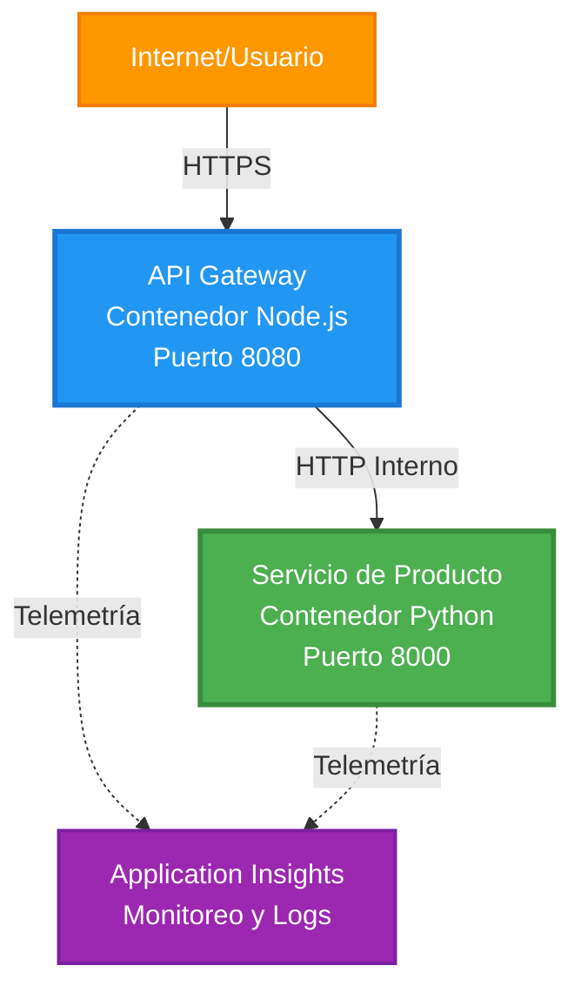
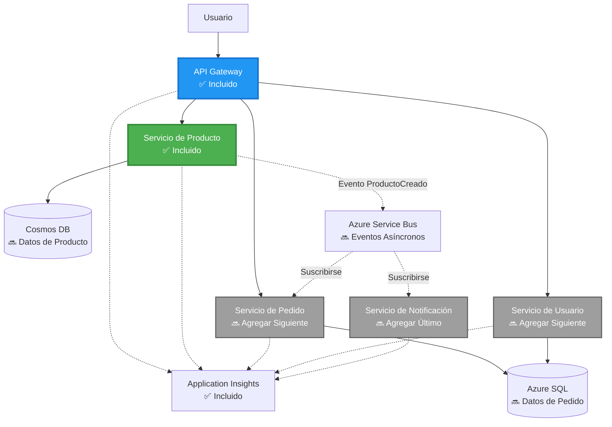
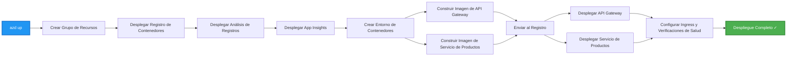

# Arquitectura de Microservicios - Ejemplo de Aplicación en Contenedor

⏱️ **Tiempo Estimado**: 25-35 minutos | 💰 **Costo Estimado**: ~$50-100/mes | ⭐ **Complejidad**: Avanzada

**📚 Ruta de Aprendizaje:**
- ← Anterior: [API Simple con Flask](../../../../examples/container-app/simple-flask-api) - Conceptos básicos de un solo contenedor
- 🎯 **Estás Aquí**: Arquitectura de Microservicios (base de 2 servicios)
- → Siguiente: [Integración de IA](../../../../docs/ai-foundry) - Añade inteligencia a tus servicios
- 🏠 [Inicio del Curso](../../README.md)

---

Una arquitectura de microservicios **simplificada pero funcional** desplegada en Azure Container Apps utilizando AZD CLI. Este ejemplo demuestra comunicación entre servicios, orquestación de contenedores y monitoreo con una configuración práctica de 2 servicios.

> **📚 Enfoque de Aprendizaje**: Este ejemplo comienza con una arquitectura mínima de 2 servicios (API Gateway + Servicio Backend) que puedes desplegar y aprender. Después de dominar esta base, proporcionamos orientación para expandir a un ecosistema completo de microservicios.

## Lo que Aprenderás

Al completar este ejemplo, aprenderás a:
- Desplegar múltiples contenedores en Azure Container Apps
- Implementar comunicación entre servicios con redes internas
- Configurar escalado basado en el entorno y verificaciones de salud
- Monitorear aplicaciones distribuidas con Application Insights
- Comprender patrones de despliegue de microservicios y mejores prácticas
- Aprender expansión progresiva de arquitecturas simples a complejas

## Arquitectura

### Fase 1: Lo que Estamos Construyendo (Incluido en Este Ejemplo)


**Detalles de los Componentes:**

| Componente | Propósito | Acceso | Recursos |
|------------|-----------|--------|----------|
| **API Gateway** | Redirige solicitudes externas a servicios backend | Público (HTTPS) | 1 vCPU, 2GB RAM, 2-20 réplicas |
| **Servicio de Productos** | Gestiona el catálogo de productos con datos en memoria | Solo interno | 0.5 vCPU, 1GB RAM, 1-10 réplicas |
| **Application Insights** | Registro centralizado y trazabilidad distribuida | Portal de Azure | 1-2 GB/mes de ingestión de datos |

**¿Por qué Empezar Simple?**
- ✅ Despliega y comprende rápidamente (25-35 minutos)
- ✅ Aprende patrones básicos de microservicios sin complejidad
- ✅ Código funcional que puedes modificar y experimentar
- ✅ Menor costo para aprender (~$50-100/mes vs $300-1400/mes)
- ✅ Construye confianza antes de añadir bases de datos y colas de mensajes

**Analogía**: Piensa en esto como aprender a conducir. Comienzas en un estacionamiento vacío (2 servicios), dominas lo básico y luego progresas al tráfico de la ciudad (5+ servicios con bases de datos).

### Fase 2: Expansión Futura (Arquitectura de Referencia)

Una vez que domines la arquitectura de 2 servicios, puedes expandirla a:


Consulta la sección "Guía de Expansión" al final para instrucciones paso a paso.

## Características Incluidas

✅ **Descubrimiento de Servicios**: Descubrimiento automático basado en DNS entre contenedores  
✅ **Balanceo de Carga**: Balanceo de carga integrado entre réplicas  
✅ **Autoescalado**: Escalado independiente por servicio basado en solicitudes HTTP  
✅ **Monitoreo de Salud**: Verificaciones de liveness y readiness para ambos servicios  
✅ **Registro Distribuido**: Registro centralizado con Application Insights  
✅ **Redes Internas**: Comunicación segura entre servicios  
✅ **Orquestación de Contenedores**: Despliegue y escalado automáticos  
✅ **Actualizaciones Sin Interrupciones**: Actualizaciones progresivas con gestión de revisiones  

## Requisitos Previos

### Herramientas Necesarias

Antes de comenzar, verifica que tienes estas herramientas instaladas:

1. **[Azure Developer CLI (azd)](https://learn.microsoft.com/azure/developer/azure-developer-cli/install-azd)** (versión 1.0.0 o superior)
   ```bash
   azd version
   # Salida esperada: versión azd 1.0.0 o superior
   ```

2. **[Azure CLI](https://learn.microsoft.com/cli/azure/install-azure-cli)** (versión 2.50.0 o superior)
   ```bash
   az --version
   # Salida esperada: azure-cli 2.50.0 o superior
   ```

3. **[Docker](https://www.docker.com/get-started)** (para desarrollo/pruebas locales - opcional)
   ```bash
   docker --version
   # Salida esperada: versión de Docker 20.10 o superior
   ```

### Verifica tu Configuración

Ejecuta estos comandos para confirmar que estás listo:

```bash
# Verificar Azure Developer CLI
azd version
# ✅ Esperado: azd versión 1.0.0 o superior

# Verificar Azure CLI
az --version
# ✅ Esperado: azure-cli 2.50.0 o superior

# Verificar Docker (opcional)
docker --version
# ✅ Esperado: Docker versión 20.10 o superior
```

**Criterio de Éxito**: Todos los comandos devuelven números de versión que coinciden o superan los mínimos requeridos.

### Requisitos de Azure

- Una **suscripción activa de Azure** ([crea una cuenta gratuita](https://azure.microsoft.com/free/))
- Permisos para crear recursos en tu suscripción
- Rol de **Colaborador** en la suscripción o grupo de recursos

### Conocimientos Previos

Este es un ejemplo de nivel **avanzado**. Deberías tener:
- Completado el [ejemplo de API Simple con Flask](../../../../examples/container-app/simple-flask-api) 
- Comprensión básica de la arquitectura de microservicios
- Familiaridad con APIs REST y HTTP
- Entendimiento de conceptos de contenedores

**¿Nuevo en Container Apps?** Comienza con el [ejemplo de API Simple con Flask](../../../../examples/container-app/simple-flask-api) primero para aprender lo básico.

## Inicio Rápido (Paso a Paso)

### Paso 1: Clonar y Navegar

```bash
git clone https://github.com/microsoft/AZD-for-beginners.git
cd AZD-for-beginners/examples/microservices
```

**✓ Verificación de Éxito**: Verifica que ves `azure.yaml`:
```bash
ls
# Esperado: README.md, azure.yaml, infra/, src/
```

### Paso 2: Autenticarse con Azure

```bash
azd auth login
```

Esto abrirá tu navegador para la autenticación en Azure. Inicia sesión con tus credenciales de Azure.

**✓ Verificación de Éxito**: Deberías ver:
```
Logged in to Azure.
```

### Paso 3: Inicializar el Entorno

```bash
azd init
```

**Preguntas que verás**:
- **Nombre del entorno**: Ingresa un nombre corto (por ejemplo, `microservices-dev`)
- **Suscripción de Azure**: Selecciona tu suscripción
- **Ubicación de Azure**: Elige una región (por ejemplo, `eastus`, `westeurope`)

**✓ Verificación de Éxito**: Deberías ver:
```
SUCCESS: New project initialized!
```

### Paso 4: Desplegar Infraestructura y Servicios

```bash
azd up
```

**Qué sucede** (toma 8-12 minutos):


**✓ Verificación de Éxito**: Deberías ver:
```
SUCCESS: Your application was deployed to Azure in X minutes Y seconds.
Endpoint: https://api-gateway-<unique-id>.azurecontainerapps.io
```

**⏱️ Tiempo**: 8-12 minutos

### Paso 5: Probar el Despliegue

```bash
# Obtener el endpoint del gateway
GATEWAY_URL=$(azd env get-values | grep API_GATEWAY_URL | cut -d '=' -f2 | tr -d '"')

# Probar la salud del API Gateway
curl $GATEWAY_URL/health
```

**✅ Salida esperada:**
```json
{
  "status": "healthy",
  "service": "api-gateway",
  "timestamp": "2025-11-19T10:30:00Z"
}
```

**Prueba el servicio de productos a través del gateway**:
```bash
# Listar productos
curl $GATEWAY_URL/api/products
```

**✅ Salida esperada:**
```json
[
  {"id":1,"name":"Laptop","price":999.99,"stock":50},
  {"id":2,"name":"Mouse","price":29.99,"stock":200},
  {"id":3,"name":"Keyboard","price":79.99,"stock":150}
]
```

**✓ Verificación de Éxito**: Ambos endpoints devuelven datos JSON sin errores.

---

**🎉 ¡Felicidades!** Has desplegado una arquitectura de microservicios en Azure.

## Estructura del Proyecto

Todos los archivos de implementación están incluidos: este es un ejemplo completo y funcional:

```
microservices/
│
├── README.md                         # This file
├── azure.yaml                        # AZD configuration
├── .gitignore                        # Git ignore patterns
│
├── infra/                           # Infrastructure as Code (Bicep)
│   ├── main.bicep                   # Main orchestration
│   ├── abbreviations.json           # Naming conventions
│   ├── core/                        # Shared infrastructure
│   │   ├── container-apps-environment.bicep  # Container environment + registry
│   │   └── monitor.bicep            # Application Insights + Log Analytics
│   └── app/                         # Service definitions
│       ├── api-gateway.bicep        # API Gateway container app
│       └── product-service.bicep    # Product Service container app
│
└── src/                             # Application source code
    ├── api-gateway/                 # Node.js API Gateway
    │   ├── app.js                   # Express server with routing
    │   ├── package.json             # Node dependencies
    │   └── Dockerfile               # Container definition
    └── product-service/             # Python Product Service
        ├── main.py                  # Flask API with product data
        ├── requirements.txt         # Python dependencies
        └── Dockerfile               # Container definition
```

**Qué Hace Cada Componente:**

**Infraestructura (infra/)**:
- `main.bicep`: Orquesta todos los recursos de Azure y sus dependencias
- `core/container-apps-environment.bicep`: Crea el entorno de Container Apps y Azure Container Registry
- `core/monitor.bicep`: Configura Application Insights para registro distribuido
- `app/*.bicep`: Definiciones individuales de aplicaciones en contenedor con escalado y verificaciones de salud

**API Gateway (src/api-gateway/)**:
- Servicio público que redirige solicitudes a servicios backend
- Implementa registro, manejo de errores y reenvío de solicitudes
- Demuestra comunicación HTTP entre servicios

**Servicio de Productos (src/product-service/)**:
- Servicio interno con catálogo de productos (en memoria para simplicidad)
- API REST con verificaciones de salud
- Ejemplo de patrón de microservicio backend

## Resumen de Servicios

### API Gateway (Node.js/Express)

**Puerto**: 8080  
**Acceso**: Público (ingreso externo)  
**Propósito**: Redirige solicitudes entrantes a los servicios backend correspondientes  

**Endpoints**:
- `GET /` - Información del servicio
- `GET /health` - Endpoint de verificación de salud
- `GET /api/products` - Redirige al servicio de productos (listar todos)
- `GET /api/products/:id` - Redirige al servicio de productos (obtener por ID)

**Características Clave**:
- Enrutamiento de solicitudes con axios
- Registro centralizado
- Manejo de errores y gestión de tiempos de espera
- Descubrimiento de servicios mediante variables de entorno
- Integración con Application Insights

**Destacado de Código** (`src/api-gateway/app.js`):
```javascript
// Comunicación interna del servicio
app.get('/api/products', async (req, res) => {
  const response = await axios.get(`${PRODUCT_SERVICE_URL}/products`, {
    timeout: 5000
  });
  res.json(response.data);
});
```

### Servicio de Productos (Python/Flask)

**Puerto**: 8000  
**Acceso**: Solo interno (sin ingreso externo)  
**Propósito**: Gestiona el catálogo de productos con datos en memoria  

**Endpoints**:
- `GET /` - Información del servicio
- `GET /health` - Endpoint de verificación de salud
- `GET /products` - Lista todos los productos
- `GET /products/<id>` - Obtiene producto por ID

**Características Clave**:
- API RESTful con Flask
- Almacenamiento de productos en memoria (simple, sin base de datos)
- Monitoreo de salud con probes
- Registro estructurado
- Integración con Application Insights

**Modelo de Datos**:
```python
{
  "id": 1,
  "name": "Laptop",
  "description": "High-performance laptop",
  "price": 999.99,
  "stock": 50
}
```

**¿Por qué Solo Interno?**
El servicio de productos no está expuesto públicamente. Todas las solicitudes deben pasar por el API Gateway, que proporciona:
- Seguridad: Punto de acceso controlado
- Flexibilidad: Puede cambiar el backend sin afectar a los clientes
- Monitoreo: Registro centralizado de solicitudes

## Comprendiendo la Comunicación entre Servicios

### Cómo se Comunican los Servicios


En este ejemplo, el API Gateway se comunica con el Servicio de Productos utilizando **llamadas HTTP internas**:

```javascript
// Puerta de enlace de API (src/api-gateway/app.js)
const PRODUCT_SERVICE_URL = process.env.PRODUCT_SERVICE_URL;

// Realizar solicitud HTTP interna
const response = await axios.get(`${PRODUCT_SERVICE_URL}/products`);
```

**Puntos Clave**:

1. **Descubrimiento Basado en DNS**: Container Apps proporciona automáticamente DNS para servicios internos
   - FQDN del Servicio de Productos: `product-service.internal.<environment>.azurecontainerapps.io`
   - Simplificado como: `http://product-service` (Container Apps lo resuelve)

2. **Sin Exposición Pública**: El Servicio de Productos tiene `external: false` en Bicep
   - Solo accesible dentro del entorno de Container Apps
   - No se puede alcanzar desde internet

3. **Variables de Entorno**: Las URLs de los servicios se inyectan en el momento del despliegue
   - Bicep pasa el FQDN interno al gateway
   - No hay URLs codificadas en el código de la aplicación

**Analogía**: Piensa en esto como oficinas. El API Gateway es la recepción (cara pública), y el Servicio de Productos es una oficina interna (solo interno). Los visitantes deben pasar por recepción para llegar a cualquier oficina.

## Opciones de Despliegue

### Despliegue Completo (Recomendado)

```bash
# Implementar infraestructura y ambos servicios
azd up
```

Esto despliega:
1. Entorno de Container Apps
2. Application Insights
3. Container Registry
4. Contenedor del API Gateway
5. Contenedor del Servicio de Productos

**Tiempo**: 8-12 minutos

### Desplegar Servicio Individual

```bash
# Implementar solo un servicio (después de la configuración inicial de azd)
azd deploy api-gateway

# O implementar el servicio de producto
azd deploy product-service
```

**Caso de Uso**: Cuando has actualizado el código en un servicio y quieres desplegar solo ese servicio.

### Actualizar Configuración

```bash
# Cambiar los parámetros de escalado
azd env set GATEWAY_MAX_REPLICAS 30

# Reimplementar con la nueva configuración
azd up
```

## Configuración

### Configuración de Escalado

Ambos servicios están configurados con autoescalado basado en HTTP en sus archivos Bicep:

**API Gateway**:
- Réplicas mínimas: 2 (siempre al menos 2 para disponibilidad)
- Réplicas máximas: 20
- Disparador de escalado: 50 solicitudes concurrentes por réplica

**Servicio de Productos**:
- Réplicas mínimas: 1 (puede escalar a cero si es necesario)
- Réplicas máximas: 10
- Disparador de escalado: 100 solicitudes concurrentes por réplica

**Personalizar Escalado** (en `infra/app/*.bicep`):
```bicep
scale: {
  minReplicas: 1
  maxReplicas: 10
  rules: [
    {
      name: 'http-scale-rule'
      http: {
        metadata: {
          concurrentRequests: '100'  // Adjust this
        }
      }
    }
  ]
}
```

### Asignación de Recursos

**API Gateway**:
- CPU: 1.0 vCPU
- Memoria: 2 GiB
- Razón: Maneja todo el tráfico externo

**Servicio de Productos**:
- CPU: 0.5 vCPU
- Memoria: 1 GiB
- Razón: Operaciones ligeras en memoria

### Verificaciones de Salud

Ambos servicios incluyen probes de liveness y readiness:

```bicep
probes: [
  {
    type: 'Liveness'
    httpGet: {
      path: '/health'
      port: 8080
    }
    initialDelaySeconds: 10
    periodSeconds: 30
  }
  {
    type: 'Readiness'
    httpGet: {
      path: '/health'
      port: 8080
    }
    initialDelaySeconds: 5
    periodSeconds: 10
  }
]
```

**Qué Significa Esto**:
- **Liveness**: Si la verificación de salud falla, Container Apps reinicia el contenedor
- **Readiness**: Si no está listo, Container Apps deja de redirigir tráfico a esa réplica

## Monitoreo y Observabilidad

### Ver Registros de Servicios

```bash
# Transmitir registros desde API Gateway
azd logs api-gateway --follow

# Ver registros recientes del servicio de productos
azd logs product-service --tail 100

# Ver todos los registros de ambos servicios
azd logs --follow
```

**Salida Esperada**:
```
[api-gateway] API Gateway listening on port 8080
[api-gateway] Product Service URL: http://product-service
[api-gateway] GET /api/products 200 - 45ms
[product-service] Retrieved 5 products
```

### Consultas en Application Insights

Accede a Application Insights en el Portal de Azure y ejecuta estas consultas:

**Encontrar Solicitudes Lentas**:
```kusto
requests
| where timestamp > ago(1h)
| where duration > 1000  // Requests taking >1 second
| summarize count() by name, cloud_RoleName
| order by count_ desc
```

**Rastrear Llamadas entre Servicios**:
```kusto
dependencies
| where timestamp > ago(1h)
| where type == "Http"
| project timestamp, name, target, duration, success
| order by timestamp desc
```

**Tasa de Errores por Servicio**:
```kusto
exceptions
| where timestamp > ago(24h)
| summarize errorCount = count() by cloud_RoleName, type
| order by errorCount desc
```

**Volumen de Solicitudes a lo Largo del Tiempo**:
```kusto
requests
| where timestamp > ago(1h)
| summarize requestCount = count() by bin(timestamp, 5m), cloud_RoleName
| render timechart
```

### Acceder al Panel de Monitoreo

```bash
# Obtener detalles de Application Insights
azd env get-values | grep APPLICATIONINSIGHTS

# Abrir la supervisión del Portal de Azure
az monitor app-insights component show \
  --app $(azd env get-values | grep APPLICATIONINSIGHTS_CONNECTION_STRING | cut -d '=' -f2) \
  --resource-group $(azd env get-values | grep AZURE_RESOURCE_GROUP | cut -d '=' -f2) \
  --query "appId" -o tsv
```

### Métricas en Vivo

1. Navega a Application Insights en el Portal de Azure
2. Haz clic en "Live Metrics"
3. Ve solicitudes, fallos y rendimiento en tiempo real
4. Prueba ejecutando: `curl $(azd env get-values | grep API_GATEWAY_URL | cut -d '=' -f2 | tr -d '"')/api/products`

## Ejercicios Prácticos

### Ejercicio 1: Añadir un Nuevo Endpoint de Producto ⭐ (Fácil)

**Objetivo**: Añadir un endpoint POST para crear nuevos productos

**Punto de Inicio**: `src/product-service/main.py`

**Pasos**:

1. Añade este endpoint después de la función `get_product` en `main.py`:

```python
@app.route('/products', methods=['POST'])
def create_product():
    """Create a new product"""
    data = request.get_json()
    
    # Validar campos obligatorios
    if not data or 'name' not in data or 'price' not in data:
        return jsonify({'error': 'Missing required fields: name, price'}), 400
    
    new_id = max(p['id'] for p in products) + 1
    new_product = {
        'id': new_id,
        'name': data['name'],
        'description': data.get('description', ''),
        'price': float(data['price']),
        'stock': int(data.get('stock', 0))
    }
    products.append(new_product)
    logger.info(f"Created product {new_id}")
    return jsonify(new_product), 201
```

2. Añade la ruta POST al API Gateway (`src/api-gateway/app.js`):

```javascript
// Agrega esto después de la ruta GET /api/products
app.post('/api/products', async (req, res) => {
  try {
    console.log(`Forwarding POST request to ${PRODUCT_SERVICE_URL}/products`);
    const response = await axios.post(`${PRODUCT_SERVICE_URL}/products`, req.body, {
      timeout: 5000
    });
    res.status(201).json(response.data);
  } catch (error) {
    console.error('Error calling product service:', error.message);
    res.status(503).json({
      error: 'Product service unavailable',
      message: error.message
    });
  }
});
```

3. Vuelve a implementar ambos servicios:

```bash
azd deploy product-service
azd deploy api-gateway
```

4. Prueba el nuevo endpoint:

```bash
GATEWAY_URL=$(azd env get-values | grep API_GATEWAY_URL | cut -d '=' -f2 | tr -d '"')

# Crear un nuevo producto
curl -X POST $GATEWAY_URL/api/products \
  -H "Content-Type: application/json" \
  -d '{"name":"USB Cable","price":9.99,"stock":500}'
```

**✅ Salida esperada:**
```json
{"id":6,"name":"USB Cable","description":"","price":9.99,"stock":500}
```

5. Verifica que aparezca en la lista:

```bash
curl $GATEWAY_URL/api/products
# Ahora debería mostrar 6 productos incluyendo el nuevo cable USB
```

**Criterios de éxito**:
- ✅ La solicitud POST devuelve HTTP 201
- ✅ El nuevo producto aparece en la lista GET /api/products
- ✅ El producto tiene un ID auto-incrementado

**Tiempo**: 10-15 minutos

---

### Ejercicio 2: Modificar Reglas de Autoescalado ⭐⭐ (Medio)

**Objetivo**: Cambiar el Product Service para que escale más agresivamente

**Punto de partida**: `infra/app/product-service.bicep`

**Pasos**:

1. Abre `infra/app/product-service.bicep` y encuentra el bloque `scale` (alrededor de la línea 95)

2. Cambia de:
```bicep
scale: {
  minReplicas: 1
  maxReplicas: 10
  rules: [
    {
      name: 'http-scale-rule'
      http: {
        metadata: {
          concurrentRequests: '100'  // OLD
        }
      }
    }
  ]
}
```

A:
```bicep
scale: {
  minReplicas: 2  // Always have 2 running
  maxReplicas: 20  // Allow more scaling
  rules: [
    {
      name: 'http-scale-rule'
      http: {
        metadata: {
          concurrentRequests: '20'  // Scale at lower threshold
        }
      }
    }
  ]
}
```

3. Vuelve a implementar la infraestructura:

```bash
azd up
```

4. Verifica la nueva configuración de escalado:

```bash
az containerapp show \
  --name $(azd env get-values | grep PRODUCT_SERVICE | head -1 | cut -d '/' -f5) \
  --resource-group $(azd env get-values | grep AZURE_RESOURCE_GROUP | cut -d '=' -f2 | tr -d '"') \
  --query "properties.template.scale" -o json
```

**✅ Salida esperada:**
```json
{
  "minReplicas": 2,
  "maxReplicas": 20,
  "rules": [...]
}
```

5. Prueba el autoescalado con carga:

```bash
# Generar solicitudes concurrentes
for i in {1..500}; do curl $GATEWAY_URL/api/products & done

# Observar cómo ocurre el escalado
azd logs product-service --follow
# Buscar: Eventos de escalado de Container Apps
```

**Criterios de éxito**:
- ✅ El Product Service siempre ejecuta al menos 2 réplicas
- ✅ Bajo carga, escala a más de 2 réplicas
- ✅ El portal de Azure muestra las nuevas reglas de escalado

**Tiempo**: 15-20 minutos

---

### Ejercicio 3: Agregar Consulta de Monitoreo Personalizada ⭐⭐ (Medio)

**Objetivo**: Crear una consulta personalizada en Application Insights para rastrear el rendimiento de la API de productos

**Pasos**:

1. Navega a Application Insights en el portal de Azure:
   - Ve al portal de Azure
   - Encuentra tu grupo de recursos (rg-microservices-*)
   - Haz clic en el recurso de Application Insights

2. Haz clic en "Logs" en el menú de la izquierda

3. Crea esta consulta:

```kusto
requests
| where timestamp > ago(1h)
| where name contains "products"
| summarize 
    RequestCount = count(),
    AvgDuration = avg(duration),
    P95Duration = percentile(duration, 95),
    SuccessRate = 100.0 * countif(success == true) / count()
  by bin(timestamp, 5m)
| render timechart
```

4. Haz clic en "Run" para ejecutar la consulta

5. Guarda la consulta:
   - Haz clic en "Save"
   - Nombre: "Product API Performance"
   - Categoría: "Performance"

6. Genera tráfico de prueba:

```bash
for i in {1..100}; do curl $GATEWAY_URL/api/products; sleep 1; done
```

7. Actualiza la consulta para ver los datos

**✅ Salida esperada:**
- Gráfico que muestra el conteo de solicitudes a lo largo del tiempo
- Duración promedio < 500ms
- Tasa de éxito = 100%
- Intervalos de tiempo de 5 minutos

**Criterios de éxito**:
- ✅ La consulta muestra 100+ solicitudes
- ✅ Tasa de éxito es 100%
- ✅ Duración promedio < 500ms
- ✅ El gráfico muestra intervalos de tiempo de 5 minutos

**Resultado de aprendizaje**: Comprender cómo monitorear el rendimiento del servicio con consultas personalizadas

**Tiempo**: 10-15 minutos

---

### Ejercicio 4: Implementar Lógica de Reintento ⭐⭐⭐ (Avanzado)

**Objetivo**: Agregar lógica de reintento al API Gateway cuando el Product Service no esté disponible temporalmente

**Punto de partida**: `src/api-gateway/app.js`

**Pasos**:

1. Instala la librería de reintento:

```bash
cd src/api-gateway
npm install axios-retry --save
cd ../..
```

2. Actualiza `src/api-gateway/app.js` (agrega después de la importación de axios):

```javascript
const axiosRetry = require('axios-retry');

// Configurar lógica de reintento
axiosRetry(axios, {
  retries: 3,
  retryDelay: (retryCount) => {
    return retryCount * 1000; // 1s, 2s, 3s
  },
  retryCondition: (error) => {
    // Reintentar en errores de red o respuestas 5xx
    return axiosRetry.isNetworkOrIdempotentRequestError(error) ||
           (error.response && error.response.status >= 500);
  }
});

console.log('Retry logic configured: 3 retries with exponential backoff');
```

3. Vuelve a implementar el API Gateway:

```bash
azd deploy api-gateway
```

4. Prueba el comportamiento de reintento simulando una falla del servicio:

```bash
# Escalar el servicio de productos a 0 (simular fallo)
az containerapp update \
  --name $(azd env get-values | grep PRODUCT_SERVICE | head -1 | cut -d '/' -f5) \
  --resource-group $(azd env get-values | grep AZURE_RESOURCE_GROUP | cut -d '=' -f2 | tr -d '"') \
  --min-replicas 0 \
  --max-replicas 0

# Intentar acceder a los productos (reintentará 3 veces)
time curl -v $GATEWAY_URL/api/products
# Observar: La respuesta tarda ~6 segundos (1s + 2s + 3s reintentos)

# Restaurar el servicio de productos
az containerapp update \
  --name $(azd env get-values | grep PRODUCT_SERVICE | head -1 | cut -d '/' -f5) \
  --resource-group $(azd env get-values | grep AZURE_RESOURCE_GROUP | cut -d '=' -f2 | tr -d '"') \
  --min-replicas 1 \
  --max-replicas 10
```

5. Revisa los registros de reintento:

```bash
azd logs api-gateway --tail 50
# Buscar: Mensajes de intento de reintento
```

**✅ Comportamiento esperado:**
- Las solicitudes intentan 3 veces antes de fallar
- Cada reintento espera más tiempo (1s, 2s, 3s)
- Solicitudes exitosas después de que el servicio se reinicia
- Los registros muestran los intentos de reintento

**Criterios de éxito**:
- ✅ Las solicitudes intentan 3 veces antes de fallar
- ✅ Cada reintento espera más tiempo (retroceso exponencial)
- ✅ Solicitudes exitosas después de que el servicio se reinicia
- ✅ Los registros muestran los intentos de reintento

**Resultado de aprendizaje**: Comprender patrones de resiliencia en microservicios (circuit breakers, reintentos, timeouts)

**Tiempo**: 20-25 minutos

---

## Punto de Verificación de Conocimientos

Después de completar este ejemplo, verifica tu comprensión:

### 1. Comunicación entre Servicios ✓

Pon a prueba tus conocimientos:
- [ ] ¿Puedes explicar cómo el API Gateway descubre el Product Service? (Descubrimiento de servicios basado en DNS)
- [ ] ¿Qué sucede si el Product Service está caído? (El Gateway devuelve un error 503)
- [ ] ¿Cómo agregarías un tercer servicio? (Crear un nuevo archivo Bicep, agregarlo a main.bicep, crear carpeta src)

**Verificación Práctica:**
```bash
# Simular fallo del servicio
az containerapp update --name <product-service-name> --min-replicas 0 --max-replicas 0
curl $GATEWAY_URL/api/products
# ✅ Esperado: 503 Servicio No Disponible

# Restaurar servicio
az containerapp update --name <product-service-name> --min-replicas 1 --max-replicas 10
```

### 2. Monitoreo y Observabilidad ✓

Pon a prueba tus conocimientos:
- [ ] ¿Dónde ves los registros distribuidos? (Application Insights en el portal de Azure)
- [ ] ¿Cómo rastreas solicitudes lentas? (Consulta Kusto: `requests | where duration > 1000`)
- [ ] ¿Puedes identificar qué servicio causó un error? (Revisar el campo `cloud_RoleName` en los registros)

**Verificación Práctica:**
```bash
# Generar una simulación de solicitud lenta
curl "$GATEWAY_URL/api/products?delay=2000"

# Consultar Application Insights para solicitudes lentas
# Navegar al Portal de Azure → Application Insights → Logs
# Ejecutar: requests | where duration > 1000 | project timestamp, name, duration, cloud_RoleName
```

### 3. Escalado y Rendimiento ✓

Pon a prueba tus conocimientos:
- [ ] ¿Qué desencadena el autoescalado? (Reglas de solicitudes HTTP concurrentes: 50 para el gateway, 100 para el producto)
- [ ] ¿Cuántas réplicas están ejecutándose ahora? (Verificar con `az containerapp revision list`)
- [ ] ¿Cómo escalarías el Product Service a 5 réplicas? (Actualizar minReplicas en Bicep)

**Verificación Práctica:**
```bash
# Generar carga para probar el escalado automático
for i in {1..1000}; do curl $GATEWAY_URL/api/products & done

# Observar el aumento de réplicas
azd logs api-gateway --follow
# ✅ Esperado: Ver eventos de escalado en los registros
```

**Criterios de éxito**: Puedes responder todas las preguntas y verificar con comandos prácticos.

---

## Análisis de Costos

### Costos Mensuales Estimados (Para Este Ejemplo de 2 Servicios)

| Recurso | Configuración | Costo Estimado |
|----------|--------------|----------------|
| API Gateway | 2-20 réplicas, 1 vCPU, 2GB RAM | $30-150 |
| Product Service | 1-10 réplicas, 0.5 vCPU, 1GB RAM | $15-75 |
| Container Registry | Nivel básico | $5 |
| Application Insights | 1-2 GB/mes | $5-10 |
| Log Analytics | 1 GB/mes | $3 |
| **Total** | | **$58-243/mes** |

### Desglose de Costos por Uso

**Tráfico ligero** (pruebas/aprendizaje): ~$60/mes
- API Gateway: 2 réplicas × 24/7 = $30
- Product Service: 1 réplica × 24/7 = $15
- Monitoreo + Registro = $13

**Tráfico moderado** (pequeña producción): ~$120/mes
- API Gateway: 5 réplicas promedio = $75
- Product Service: 3 réplicas promedio = $45
- Monitoreo + Registro = $13

**Tráfico alto** (periodos ocupados): ~$240/mes
- API Gateway: 15 réplicas promedio = $225
- Product Service: 8 réplicas promedio = $120
- Monitoreo + Registro = $13

### Consejos para Optimizar Costos

1. **Escala a Cero para Desarrollo**:
   ```bicep
   scale: {
     minReplicas: 0  // Save $30-40/month when not in use
     maxReplicas: 10
   }
   ```

2. **Usa el Plan de Consumo para Cosmos DB** (cuando lo agregues):
   - Paga solo por lo que usas
   - Sin cargo mínimo

3. **Configura el Muestreo en Application Insights**:
   ```javascript
   appInsights.defaultClient.config.samplingPercentage = 50; // Muestrea el 50% de las solicitudes
   ```

4. **Limpia Cuando No Sea Necesario**:
   ```bash
   azd down --force --purge
   ```

### Opciones de Nivel Gratuito

Para aprendizaje/pruebas, considera:
- ✅ Usa créditos gratuitos de Azure ($200 por los primeros 30 días con cuentas nuevas)
- ✅ Mantén el mínimo de réplicas (ahorra ~50% de costos)
- ✅ Elimina después de probar (sin cargos continuos)
- ✅ Escala a cero entre sesiones de aprendizaje

**Ejemplo**: Ejecutar este ejemplo por 2 horas/día × 30 días = ~$5/mes en lugar de $60/mes

---

## Referencia Rápida de Solución de Problemas

### Problema: `azd up` falla con "Subscription not found"

**Solución**:
```bash
# Iniciar sesión nuevamente con suscripción explícita
az account set --subscription <your-subscription-id>
azd env set AZURE_SUBSCRIPTION_ID <your-subscription-id>
azd up
```

### Problema: API Gateway devuelve 503 "Product service unavailable"

**Diagnóstico**:
```bash
# Verificar los registros del servicio del producto
azd logs product-service --tail 50

# Verificar el estado del servicio del producto
az containerapp show \
  --name $(azd env get-values | grep PRODUCT_SERVICE | head -1 | cut -d '/' -f5) \
  --resource-group $(azd env get-values | grep AZURE_RESOURCE_GROUP | cut -d '=' -f2 | tr -d '"') \
  --query "properties.runningStatus"
```

**Causas Comunes**:
1. El Product Service no se inició (revisar registros para errores de Python)
2. La verificación de estado falla (verificar que el endpoint `/health` funcione)
3. La construcción de la imagen del contenedor falló (revisar el registro para la imagen)

### Problema: El autoescalado no funciona

**Diagnóstico**:
```bash
# Verificar el conteo actual de réplicas
az containerapp revision list \
  --name $(azd env get-values | grep API_GATEWAY | head -1 | cut -d '/' -f5) \
  --resource-group $(azd env get-values | grep AZURE_RESOURCE_GROUP | cut -d '=' -f2 | tr -d '"') \
  --query "[].properties.replicas"

# Generar carga para probar
for i in {1..1000}; do curl $GATEWAY_URL/api/products & done

# Observar eventos de escalado
azd logs api-gateway --follow | grep -i scale
```

**Causas Comunes**:
1. La carga no es lo suficientemente alta para activar la regla de escalado (se necesitan >50 solicitudes concurrentes)
2. Ya se alcanzaron las réplicas máximas (verificar configuración en Bicep)
3. Regla de escalado mal configurada en Bicep (verificar valor de concurrentRequests)

### Problema: Application Insights no muestra registros

**Diagnóstico**:
```bash
# Verificar que la cadena de conexión esté configurada
azd env get-values | grep APPLICATIONINSIGHTS

# Comprobar si los servicios están enviando telemetría
az monitor app-insights component show \
  --app $(azd env get-values | grep APPLICATIONINSIGHTS_NAME | cut -d '=' -f2 | tr -d '"') \
  --resource-group $(azd env get-values | grep AZURE_RESOURCE_GROUP | cut -d '=' -f2 | tr -d '"') \
  --query "properties.InstrumentationKey"
```

**Causas Comunes**:
1. La cadena de conexión no se pasó al contenedor (verificar variables de entorno)
2. El SDK de Application Insights no está configurado (verificar importaciones en el código)
3. El firewall bloquea la telemetría (raro, verificar reglas de red)

### Problema: La construcción de Docker falla localmente

**Diagnóstico**:
```bash
# Probar la construcción de la puerta de enlace de la API
cd src/api-gateway
docker build -t test-gateway .

# Probar la construcción del servicio de productos
cd ../product-service
docker build -t test-product .
```

**Causas Comunes**:
1. Dependencias faltantes en package.json/requirements.txt
2. Errores de sintaxis en Dockerfile
3. Problemas de red al descargar dependencias

**¿Aún tienes problemas?** Consulta [Guía de Problemas Comunes](../../docs/troubleshooting/common-issues.md) o [Solución de Problemas de Azure Container Apps](https://learn.microsoft.com/azure/container-apps/troubleshooting)

---

## Limpieza

Para evitar cargos continuos, elimina todos los recursos:

```bash
azd down --force --purge
```

**Mensaje de Confirmación**:
```
? Total resources to delete: 6, are you sure you want to continue? (y/N)
```

Escribe `y` para confirmar.

**Qué se Elimina**:
- Entorno de Container Apps
- Ambos Container Apps (gateway y product service)
- Container Registry
- Application Insights
- Log Analytics Workspace
- Grupo de Recursos

**✓ Verifica la Limpieza**:
```bash
az group list --query "[?starts_with(name,'rg-microservices')]" --output table
```

Debería devolver vacío.

---

## Guía de Expansión: De 2 a 5+ Servicios

Una vez que domines esta arquitectura de 2 servicios, aquí tienes cómo expandir:

### Fase 1: Agregar Persistencia en Base de Datos (Próximo Paso)

**Agregar Cosmos DB para el Product Service**:

1. Crea `infra/core/cosmos.bicep`:
   ```bicep
   resource cosmosAccount 'Microsoft.DocumentDB/databaseAccounts@2023-04-15' = {
     name: name
     location: location
     kind: 'GlobalDocumentDB'
     properties: {
       databaseAccountOfferType: 'Standard'
       consistencyPolicy: { defaultConsistencyLevel: 'Session' }
       locations: [{ locationName: location, failoverPriority: 0 }]
     }
   }
   ```

2. Actualiza el Product Service para usar el SDK de Azure Cosmos DB para Python en lugar de datos en memoria

3. Costo adicional estimado: ~$25/mes (sin servidor)

### Fase 2: Agregar un Tercer Servicio (Gestión de Pedidos)

**Crear Order Service**:

1. Nueva carpeta: `src/order-service/` (Python/Node.js/C#)
2. Nuevo Bicep: `infra/app/order-service.bicep`
3. Actualiza el API Gateway para enrutar `/api/orders`
4. Agrega Azure SQL Database para la persistencia de pedidos

**La arquitectura se convierte en**:
```
API Gateway → Product Service (Cosmos DB)
           → Order Service (Azure SQL)
```

### Fase 3: Agregar Comunicación Asíncrona (Service Bus)

**Implementar Arquitectura Basada en Eventos**:

1. Agrega Azure Service Bus: `infra/core/servicebus.bicep`
2. El Product Service publica eventos "ProductCreated"
3. El Order Service se suscribe a eventos de productos
4. Agrega Notification Service para procesar eventos

**Patrón**: Solicitud/Respuesta (HTTP) + Basado en Eventos (Service Bus)

### Fase 4: Agregar Autenticación de Usuarios

**Implementar User Service**:

1. Crea `src/user-service/` (Go/Node.js)
2. Agrega Azure AD B2C o autenticación JWT personalizada
3. El API Gateway valida los tokens antes de enrutar
4. Los servicios verifican permisos de usuario

### Fase 5: Preparación para Producción

**Agrega Estos Componentes**:
- ✅ Azure Front Door (balanceo de carga global)
- ✅ Azure Key Vault (gestión de secretos)
- ✅ Azure Monitor Workbooks (tableros personalizados)
- ✅ Pipeline CI/CD (GitHub Actions)
- ✅ Despliegues Blue-Green
- ✅ Identidad Administrada para todos los servicios

**Costo Total de Arquitectura en Producción**: ~$300-1,400/mes

---

## Aprende Más

### Documentación Relacionada
- [Documentación de Azure Container Apps](https://learn.microsoft.com/azure/container-apps/)
- [Guía de Arquitectura de Microservicios](https://learn.microsoft.com/azure/architecture/guide/architecture-styles/microservices)
- [Application Insights para Trazabilidad Distribuida](https://learn.microsoft.com/azure/azure-monitor/app/distributed-tracing)
- [Documentación de Azure Developer CLI](https://learn.microsoft.com/azure/developer/azure-developer-cli/)

### Próximos Pasos en Este Curso
- ← Anterior: [Simple Flask API](../../../../examples/container-app/simple-flask-api) - Ejemplo básico de un solo contenedor
- → Siguiente: [Guía de Integración de IA](../../../../docs/ai-foundry) - Agregar capacidades de IA
- 🏠 [Inicio del Curso](../../README.md)

### Comparación: Cuándo Usar Qué

| Característica | Contenedor Único | Microservicios (Este) | Kubernetes (AKS) |
|----------------|------------------|-----------------------|------------------|
| **Caso de Uso** | Apps simples | Apps complejas | Apps empresariales |
| **Escalabilidad** | Servicio único | Escalado por servicio | Máxima flexibilidad |
| **Complejidad** | Baja | Media | Alta |
| **Tamaño del Equipo** | 1-3 desarrolladores | 3-10 desarrolladores | 10+ desarrolladores |
| **Costo** | ~$15-50/mes | ~$60-250/mes | ~$150-500/mes |
| **Tiempo de Despliegue** | 5-10 minutos | 8-12 minutos | 15-30 minutos |
| **Mejor Para** | MVPs, prototipos | Aplicaciones en producción | Multi-nube, redes avanzadas |

**Recomendación**: Comienza con Container Apps (este ejemplo), pasa a AKS solo si necesitas características específicas de Kubernetes.

---

## Preguntas Frecuentes

**P: ¿Por qué solo 2 servicios en lugar de 5+?**  
R: Progresión educativa. Domina los fundamentos (comunicación entre servicios, monitoreo, escalado) con un ejemplo simple antes de añadir complejidad. Los patrones que aprendes aquí se aplican a arquitecturas de 100 servicios.

**P: ¿Puedo añadir más servicios por mi cuenta?**  
R: ¡Por supuesto! Sigue la guía de expansión anterior. Cada nuevo servicio sigue el mismo patrón: crea una carpeta `src`, crea un archivo Bicep, actualiza `azure.yaml`, despliega.

**P: ¿Está listo para producción?**  
R: Es una base sólida. Para producción, añade: identidad administrada, Key Vault, bases de datos persistentes, pipeline de CI/CD, alertas de monitoreo y estrategia de respaldo.

**P: ¿Por qué no usar Dapr u otro service mesh?**  
R: Mantén la simplicidad para aprender. Una vez que entiendas la red nativa de Container Apps, puedes añadir Dapr para escenarios avanzados (gestión de estado, pub/sub, bindings).

**P: ¿Cómo depuro localmente?**  
R: Ejecuta los servicios localmente con Docker:  
```bash
cd src/api-gateway
docker build -t local-gateway .
docker run -p 8080:8080 -e PRODUCT_SERVICE_URL=http://localhost:8000 local-gateway
```
  
**P: ¿Puedo usar diferentes lenguajes de programación?**  
R: ¡Sí! Este ejemplo muestra Node.js (gateway) + Python (servicio de productos). Puedes mezclar cualquier lenguaje que funcione en contenedores: C#, Go, Java, Ruby, PHP, etc.

**P: ¿Qué pasa si no tengo créditos de Azure?**  
R: Usa el nivel gratuito de Azure (los primeros 30 días con cuentas nuevas obtienen $200 en créditos) o despliega para pruebas cortas y elimina inmediatamente. Este ejemplo cuesta ~$2/día.

**P: ¿En qué se diferencia esto de Azure Kubernetes Service (AKS)?**  
R: Container Apps es más simple (no necesitas conocimientos de Kubernetes) pero menos flexible. AKS te da control total de Kubernetes, pero requiere más experiencia. Comienza con Container Apps y avanza a AKS si es necesario.

**P: ¿Puedo usar esto con servicios existentes de Azure?**  
R: ¡Sí! Puedes conectarte a bases de datos existentes, cuentas de almacenamiento, Service Bus, etc. Actualiza los archivos Bicep para referenciar recursos existentes en lugar de crear nuevos.

---

> **🎓 Resumen de la Ruta de Aprendizaje**: Has aprendido a desplegar una arquitectura de múltiples servicios con escalado automático, red interna, monitoreo centralizado y patrones listos para producción. Esta base te prepara para sistemas distribuidos complejos y arquitecturas de microservicios empresariales.

**📚 Navegación del Curso:**
- ← Anterior: [API Simple con Flask](../../../../examples/container-app/simple-flask-api)
- → Siguiente: [Ejemplo de Integración con Base de Datos](../../../../database-app)
- 🏠 [Inicio del Curso](../../README.md)
- 📖 [Mejores Prácticas para Container Apps](../../docs/deployment/deployment-guide.md)

---

**✨ ¡Felicidades!** Has completado el ejemplo de microservicios. Ahora entiendes cómo construir, desplegar y monitorear aplicaciones distribuidas en Azure Container Apps. ¿Listo para añadir capacidades de IA? Consulta la [Guía de Integración de IA](../../../../docs/ai-foundry).

---

<!-- CO-OP TRANSLATOR DISCLAIMER START -->
**Descargo de responsabilidad**:  
Este documento ha sido traducido utilizando el servicio de traducción automática [Co-op Translator](https://github.com/Azure/co-op-translator). Si bien nos esforzamos por lograr precisión, tenga en cuenta que las traducciones automáticas pueden contener errores o imprecisiones. El documento original en su idioma nativo debe considerarse la fuente autorizada. Para información crítica, se recomienda una traducción profesional realizada por humanos. No nos hacemos responsables de malentendidos o interpretaciones erróneas que surjan del uso de esta traducción.
<!-- CO-OP TRANSLATOR DISCLAIMER END -->