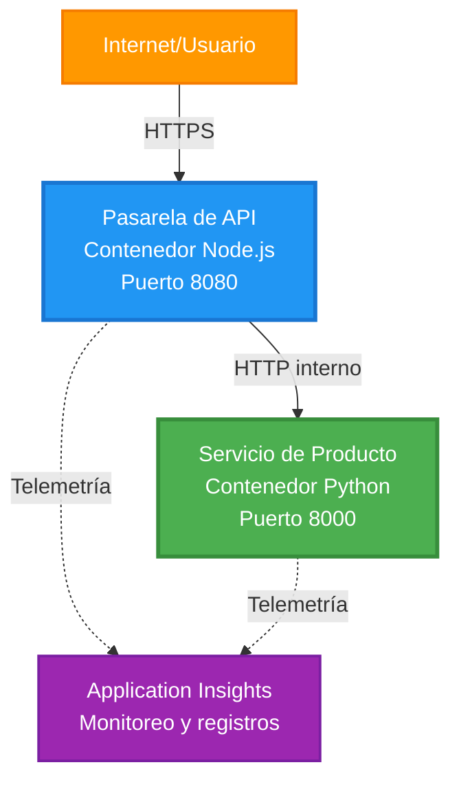
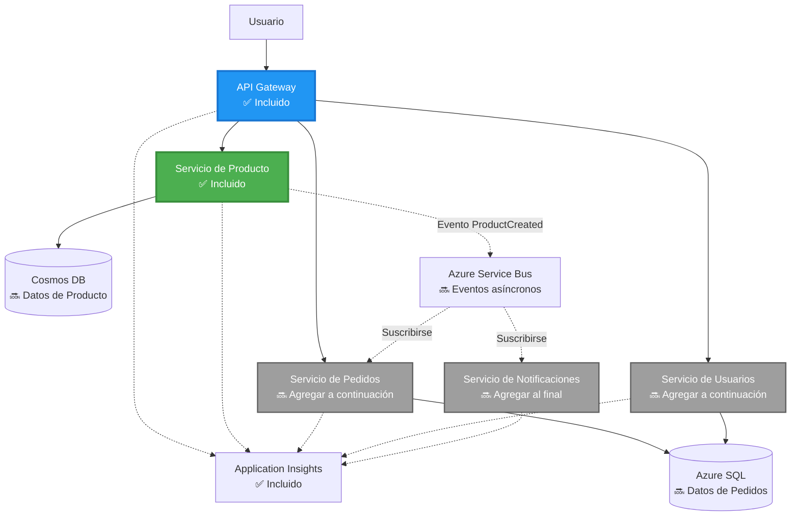
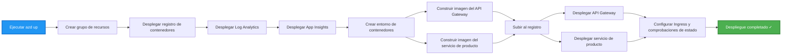
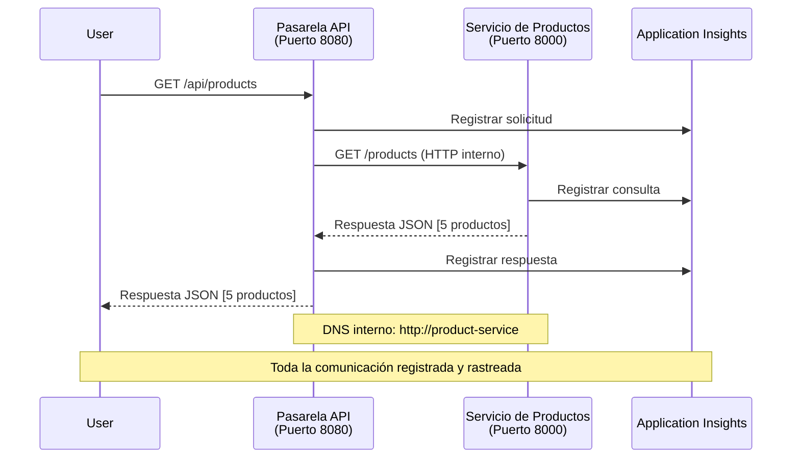

# Arquitectura de Microservicios - Ejemplo de Container App

⏱️ **Tiempo estimado**: 25-35 minutos | 💰 **Costo estimado**: ~$50-100/mes | ⭐ **Complejidad**: Avanzado

**📚 Ruta de aprendizaje:**
- ← Anterior: [Simple Flask API](../../../../examples/container-app/simple-flask-api) - Fundamentos de un solo contenedor
- 🎯 **Estás aquí**: Arquitectura de microservicios (fundamento de 2 servicios)
- → Siguiente: [AI Integration](../../../../docs/ai-foundry) - Agregar inteligencia a tus servicios
- 🏠 [Inicio del curso](../../README.md)

---

Una arquitectura de microservicios **simplificada pero funcional** desplegada en Azure Container Apps usando AZD CLI. Este ejemplo demuestra comunicación entre servicios, orquestación de contenedores y monitorización con una configuración práctica de 2 servicios.

> **📚 Enfoque de aprendizaje**: Este ejemplo comienza con una arquitectura mínima de 2 servicios (API Gateway + Servicio de Productos) que puedes desplegar y aprender. Después de dominar esta base, proporcionamos orientación para expandir a un ecosistema completo de microservicios.

## Qué aprenderás

Al completar este ejemplo, podrás:
- Desplegar múltiples contenedores en Azure Container Apps
- Implementar comunicación entre servicios con red interna
- Configurar escalado basado en el entorno y comprobaciones de salud
- Monitorizar aplicaciones distribuidas con Application Insights
- Entender patrones de despliegue de microservicios y buenas prácticas
- Aprender la expansión progresiva de arquitecturas simples a complejas

## Arquitectura

### Fase 1: Lo que estamos construyendo (Incluido en este ejemplo)


**Detalles de los componentes:**

| Componente | Propósito | Acceso | Recursos |
|-----------|---------|--------|-----------|
| **API Gateway** | Enruta solicitudes externas a los servicios backend | Público (HTTPS) | 1 vCPU, 2GB RAM, 2-20 réplicas |
| **Servicio de Productos** | Administra el catálogo de productos con datos en memoria | Solo interno | 0.5 vCPU, 1GB RAM, 1-10 réplicas |
| **Application Insights** | Registro centralizado y rastreo distribuido | Azure Portal | 1-2 GB/mes de ingestión de datos |

**¿Por qué empezar simple?**
- ✅ Desplegar y comprender rápidamente (25-35 minutos)
- ✅ Aprender patrones centrales de microservicios sin complejidad
- ✅ Código funcional que puedes modificar y experimentar
- ✅ Menor costo para aprender (~$50-100/mes vs $300-1400/mes)
- ✅ Ganar confianza antes de añadir bases de datos y colas de mensajes

**Analogía**: Piensa en esto como aprender a conducir. Empiezas en un estacionamiento vacío (2 servicios), dominas lo básico y luego progresas al tráfico de la ciudad (5+ servicios con bases de datos).

### Fase 2: Expansión futura (Arquitectura de referencia)

Una vez que domines la arquitectura de 2 servicios, puedes expandir a:


Consulta la sección "Expansion Guide" al final para instrucciones paso a paso.

## Características incluidas

✅ **Descubrimiento de servicios**: Descubrimiento automático basado en DNS entre contenedores  
✅ **Balanceo de carga**: Balanceo de carga integrado entre réplicas  
✅ **Autoescalado**: Escalado independiente por servicio basado en solicitudes HTTP  
✅ **Monitorización de salud**: Probes de liveness y readiness para ambos servicios  
✅ **Registro distribuido**: Registro centralizado con Application Insights  
✅ **Red interna**: Comunicación segura entre servicios  
✅ **Orquestación de contenedores**: Despliegue y escalado automáticos  
✅ **Actualizaciones sin tiempo de inactividad**: Actualizaciones continuas con gestión de revisiones  

## Requisitos previos

### Herramientas requeridas

Antes de comenzar, verifica que tengas instaladas estas herramientas:

1. **[Azure Developer CLI (azd)](https://learn.microsoft.com/azure/developer/azure-developer-cli/install-azd)** (versión 1.0.0 o superior)
   ```bash
   azd version
   # Salida esperada: azd versión 1.0.0 o superior
   ```

2. **[Azure CLI](https://learn.microsoft.com/cli/azure/install-azure-cli)** (versión 2.50.0 o superior)
   ```bash
   az --version
   # Salida esperada: azure-cli 2.50.0 o superior
   ```

3. **[Docker](https://www.docker.com/get-started)** (para desarrollo/pruebas locales - opcional)
   ```bash
   docker --version
   # Salida esperada: Docker versión 20.10 o superior
   ```

### Verifica tu configuración

Ejecuta estos comandos para confirmar que estás listo:

```bash
# Comprobar Azure Developer CLI
azd version
# ✅ Esperado: azd versión 1.0.0 o superior

# Comprobar Azure CLI
az --version
# ✅ Esperado: azure-cli 2.50.0 o superior

# Comprobar Docker (opcional)
docker --version
# ✅ Esperado: versión de Docker 20.10 o superior
```

**Criterios de éxito**: Todos los comandos devuelven números de versión que coinciden o superan los mínimos.

### Requisitos de Azure

- Una **suscripción de Azure** activa ([crea una cuenta gratuita](https://azure.microsoft.com/free/))
- Permisos para crear recursos en tu suscripción
- Rol de **Contributor** en la suscripción o grupo de recursos

### Conocimientos previos

Este es un ejemplo de **nivel avanzado**. Deberías tener:
- Haber completado el [ejemplo Simple Flask API](../../../../examples/container-app/simple-flask-api) 
- Comprensión básica de la arquitectura de microservicios
- Familiaridad con APIs REST y HTTP
- Comprensión de conceptos de contenedores

**¿Nuevo en Container Apps?** Comienza primero con el [ejemplo Simple Flask API](../../../../examples/container-app/simple-flask-api) para aprender lo básico.

## Inicio rápido (Paso a paso)

### Paso 1: Clonar y navegar

```bash
git clone https://github.com/microsoft/AZD-for-beginners.git
cd AZD-for-beginners/examples/microservices
```

**✓ Verificación de éxito**: Verifica que veas `azure.yaml`:
```bash
ls
# Esperado: README.md, azure.yaml, infra/, src/
```

### Paso 2: Autenticar con Azure

```bash
azd auth login
```

Esto abrirá tu navegador para la autenticación en Azure. Inicia sesión con tus credenciales de Azure.

**✓ Verificación de éxito**: Deberías ver:
```
Logged in to Azure.
```

### Paso 3: Inicializar el entorno

```bash
azd init
```

**Mensajes que verás**:
- **Nombre del entorno**: Ingresa un nombre corto (p. ej., `microservices-dev`)
- **Suscripción de Azure**: Selecciona tu suscripción
- **Ubicación de Azure**: Elige una región (p. ej., `eastus`, `westeurope`)

**✓ Verificación de éxito**: Deberías ver:
```
SUCCESS: New project initialized!
```

### Paso 4: Desplegar infraestructura y servicios

```bash
azd up
```

**Qué sucede** (toma 8-12 minutos):


**✓ Verificación de éxito**: Deberías ver:
```
SUCCESS: Your application was deployed to Azure in X minutes Y seconds.
Endpoint: https://api-gateway-<unique-id>.azurecontainerapps.io
```

**⏱️ Tiempo**: 8-12 minutos

### Paso 5: Probar el despliegue

```bash
# Obtener el punto de enlace de la pasarela
GATEWAY_URL=$(azd env get-values | grep API_GATEWAY_URL | cut -d '=' -f2 | tr -d '"')

# Probar la salud de API Gateway
curl $GATEWAY_URL/health
```

**✅ Salida esperada:**
```json
{
  "status": "healthy",
  "service": "api-gateway",
  "timestamp": "2025-11-19T10:30:00Z"
}
```

**Probar el servicio de productos a través del gateway**:
```bash
# Listar productos
curl $GATEWAY_URL/api/products
```

**✅ Salida esperada:**
```json
[
  {"id":1,"name":"Laptop","price":999.99,"stock":50},
  {"id":2,"name":"Mouse","price":29.99,"stock":200},
  {"id":3,"name":"Keyboard","price":79.99,"stock":150}
]
```

**✓ Verificación de éxito**: Ambos endpoints devuelven datos JSON sin errores.

---

**🎉 ¡Felicidades!** ¡Has desplegado una arquitectura de microservicios en Azure!

## Estructura del proyecto

Todos los archivos de implementación están incluidos: este es un ejemplo completo y funcional:

```
microservices/
│
├── README.md                         # This file
├── azure.yaml                        # AZD configuration
├── .gitignore                        # Git ignore patterns
│
├── infra/                           # Infrastructure as Code (Bicep)
│   ├── main.bicep                   # Main orchestration
│   ├── abbreviations.json           # Naming conventions
│   ├── core/                        # Shared infrastructure
│   │   ├── container-apps-environment.bicep  # Container environment + registry
│   │   └── monitor.bicep            # Application Insights + Log Analytics
│   └── app/                         # Service definitions
│       ├── api-gateway.bicep        # API Gateway container app
│       └── product-service.bicep    # Product Service container app
│
└── src/                             # Application source code
    ├── api-gateway/                 # Node.js API Gateway
    │   ├── app.js                   # Express server with routing
    │   ├── package.json             # Node dependencies
    │   └── Dockerfile               # Container definition
    └── product-service/             # Python Product Service
        ├── main.py                  # Flask API with product data
        ├── requirements.txt         # Python dependencies
        └── Dockerfile               # Container definition
```

**Qué hace cada componente:**

**Infraestructura (infra/)**:
- `main.bicep`: Orquesta todos los recursos de Azure y sus dependencias
- `core/container-apps-environment.bicep`: Crea el entorno de Container Apps y Azure Container Registry
- `core/monitor.bicep`: Configura Application Insights para el registro distribuido
- `app/*.bicep`: Definiciones individuales de Container Apps con escalado y comprobaciones de salud

**API Gateway (src/api-gateway/)**:
- Servicio público que enruta solicitudes a los servicios backend
- Implementa registro, manejo de errores y reenvío de solicitudes
- Demuestra comunicación HTTP entre servicios

**Servicio de Productos (src/product-service/)**:
- Servicio interno con catálogo de productos (en memoria para simplicidad)
- API REST con comprobaciones de salud
- Ejemplo del patrón de microservicio backend

## Resumen de servicios

### API Gateway (Node.js/Express)

**Puerto**: 8080  
**Acceso**: Público (ingreso externo)  
**Propósito**: Enruta las solicitudes entrantes a los servicios backend apropiados  

**Endpoints**:
- `GET /` - Información del servicio
- `GET /health` - Endpoint de comprobación de salud
- `GET /api/products` - Reenvía al servicio de productos (listar todos)
- `GET /api/products/:id` - Reenvía al servicio de productos (obtener por ID)

**Funciones clave**:
- Enrutamiento de solicitudes con axios
- Registro centralizado
- Manejo de errores y gestión de timeouts
- Descubrimiento de servicios vía variables de entorno
- Integración con Application Insights

**Fragmento de código** (`src/api-gateway/app.js`):
```javascript
// Comunicación interna del servicio
app.get('/api/products', async (req, res) => {
  const response = await axios.get(`${PRODUCT_SERVICE_URL}/products`, {
    timeout: 5000
  });
  res.json(response.data);
});
```

### Servicio de Productos (Python/Flask)

**Puerto**: 8000  
**Acceso**: Solo interno (sin ingreso externo)  
**Propósito**: Administra el catálogo de productos con datos en memoria  

**Endpoints**:
- `GET /` - Información del servicio
- `GET /health` - Endpoint de comprobación de salud
- `GET /products` - Listar todos los productos
- `GET /products/<id>` - Obtener producto por ID

**Funciones clave**:
- API REST con Flask
- Almacenamiento de productos en memoria (simple, sin base de datos)
- Monitorización de salud con probes
- Registro estructurado
- Integración con Application Insights

**Modelo de datos**:
```python
{
  "id": 1,
  "name": "Laptop",
  "description": "High-performance laptop",
  "price": 999.99,
  "stock": 50
}
```

**¿Por qué solo interno?**
El servicio de productos no está expuesto públicamente. Todas las solicitudes deben pasar por el API Gateway, que proporciona:
- Seguridad: Punto de acceso controlado
- Flexibilidad: Se puede cambiar el backend sin afectar a los clientes
- Monitorización: Registro centralizado de solicitudes

## Entendiendo la comunicación entre servicios

### Cómo se comunican los servicios entre sí


En este ejemplo, el API Gateway se comunica con el Servicio de Productos usando **llamadas HTTP internas**:

```javascript
// Pasarela de API (src/api-gateway/app.js)
const PRODUCT_SERVICE_URL = process.env.PRODUCT_SERVICE_URL;

// Realizar una solicitud HTTP interna
const response = await axios.get(`${PRODUCT_SERVICE_URL}/products`);
```

**Puntos clave**:

1. **Descubrimiento basado en DNS**: Container Apps proporciona automáticamente DNS para servicios internos
   - FQDN del Servicio de Productos: `product-service.internal.<environment>.azurecontainerapps.io`
   - Simplificado como: `http://product-service` (Container Apps lo resuelve)

2. **Sin exposición pública**: El Servicio de Productos tiene `external: false` en Bicep
   - Solo accesible dentro del entorno de Container Apps
   - No se puede acceder desde internet

3. **Variables de entorno**: Las URL de los servicios se inyectan en tiempo de despliegue
   - Bicep pasa el FQDN interno al gateway
   - No hay URLs codificadas en el código de la aplicación

**Analogía**: Piensa en esto como salas de oficina. El API Gateway es el mostrador de recepción (de cara al público), y el Servicio de Productos es una sala de oficina (solo interna). Los visitantes deben pasar por recepción para llegar a cualquier oficina.

## Opciones de despliegue

### Despliegue completo (recomendado)

```bash
# Desplegar la infraestructura y ambos servicios
azd up
```

Esto despliega:
1. Entorno de Container Apps
2. Application Insights
3. Container Registry
4. Contenedor del API Gateway
5. Contenedor del Servicio de Productos

**Tiempo**: 8-12 minutos

### Desplegar servicio individual

```bash
# Desplegar solo un servicio (después del azd up inicial)
azd deploy api-gateway

# O desplegar el servicio de producto
azd deploy product-service
```

**Caso de uso**: Cuando has actualizado el código en un servicio y quieres redeplegar solo ese servicio.

### Actualizar configuración

```bash
# Cambiar parámetros de escalado
azd env set GATEWAY_MAX_REPLICAS 30

# Volver a desplegar con la nueva configuración
azd up
```

## Configuración

### Configuración de escalado

Ambos servicios están configurados con escalado automático basado en HTTP en sus archivos Bicep:

**API Gateway**:
- Réplicas mínimas: 2 (siempre al menos 2 para disponibilidad)
- Réplicas máximas: 20
- Disparador de escalado: 50 solicitudes concurrentes por réplica

**Servicio de Productos**:
- Réplicas mínimas: 1 (puede escalar a cero si es necesario)
- Réplicas máximas: 10
- Disparador de escalado: 100 solicitudes concurrentes por réplica

**Personalizar escalado** (en `infra/app/*.bicep`):
```bicep
scale: {
  minReplicas: 1
  maxReplicas: 10
  rules: [
    {
      name: 'http-scale-rule'
      http: {
        metadata: {
          concurrentRequests: '100'  // Adjust this
        }
      }
    }
  ]
}
```

### Asignación de recursos

**API Gateway**:
- CPU: 1.0 vCPU
- Memoria: 2 GiB
- Razón: Maneja todo el tráfico externo

**Servicio de Productos**:
- CPU: 0.5 vCPU
- Memoria: 1 GiB
- Razón: Operaciones ligeras en memoria

### Comprobaciones de salud

Ambos servicios incluyen sondas de liveness y readiness:

```bicep
probes: [
  {
    type: 'Liveness'
    httpGet: {
      path: '/health'
      port: 8080
    }
    initialDelaySeconds: 10
    periodSeconds: 30
  }
  {
    type: 'Readiness'
    httpGet: {
      path: '/health'
      port: 8080
    }
    initialDelaySeconds: 5
    periodSeconds: 10
  }
]
```

**Qué significa esto**:
- **Liveness**: Si la comprobación de salud falla, Container Apps reinicia el contenedor
- **Readiness**: Si no está listo, Container Apps deja de enrutar tráfico a esa réplica

## Monitorización y observabilidad

### Ver registros de servicios

```bash
# Ver registros usando azd monitor
azd monitor --logs

# O use Azure CLI para Container Apps específicos:
# Transmitir registros desde API Gateway
az containerapp logs show --name api-gateway --resource-group $RG_NAME --follow

# Ver registros recientes del servicio de producto
az containerapp logs show --name product-service --resource-group $RG_NAME --tail 100
```

**Salida esperada**:
```
[api-gateway] API Gateway listening on port 8080
[api-gateway] Product Service URL: http://product-service
[api-gateway] GET /api/products 200 - 45ms
[product-service] Retrieved 5 products
```

### Consultas de Application Insights

Accede a Application Insights en el Portal de Azure y luego ejecuta estas consultas:

**Encontrar solicitudes lentas**:
```kusto
requests
| where timestamp > ago(1h)
| where duration > 1000  // Requests taking >1 second
| summarize count() by name, cloud_RoleName
| order by count_ desc
```

**Rastrear llamadas entre servicios**:
```kusto
dependencies
| where timestamp > ago(1h)
| where type == "Http"
| project timestamp, name, target, duration, success
| order by timestamp desc
```

**Tasa de errores por servicio**:
```kusto
exceptions
| where timestamp > ago(24h)
| summarize errorCount = count() by cloud_RoleName, type
| order by errorCount desc
```

**Volumen de solicitudes a lo largo del tiempo**:
```kusto
requests
| where timestamp > ago(1h)
| summarize requestCount = count() by bin(timestamp, 5m), cloud_RoleName
| render timechart
```

### Acceder al panel de monitorización

```bash
# Obtener detalles de Application Insights
azd env get-values | grep APPLICATIONINSIGHTS

# Abrir la supervisión en el Portal de Azure
az monitor app-insights component show \
  --app $(azd env get-values | grep APPLICATIONINSIGHTS_CONNECTION_STRING | cut -d '=' -f2) \
  --resource-group $(azd env get-values | grep AZURE_RESOURCE_GROUP | cut -d '=' -f2) \
  --query "appId" -o tsv
```

### Métricas en vivo

1. Navega a Application Insights en el Portal de Azure
2. Haz clic en "Live Metrics"
3. Ve solicitudes, fallos y rendimiento en tiempo real
4. Prueba ejecutando: `curl $(azd env get-values | grep API_GATEWAY_URL | cut -d '=' -f2 | tr -d '"')/api/products`

## Ejercicios prácticos

### Ejercicio 1: Añadir un nuevo endpoint de producto ⭐ (Fácil)

**Objetivo**: Añadir un endpoint POST para crear nuevos productos

**Punto de partida**: `src/product-service/main.py`

**Pasos**:

1. Añade este endpoint después de la función `get_product` en `main.py`:

```python
@app.route('/products', methods=['POST'])
def create_product():
    """Create a new product"""
    data = request.get_json()
    
    # Validar campos obligatorios
    if not data or 'name' not in data or 'price' not in data:
        return jsonify({'error': 'Missing required fields: name, price'}), 400
    
    new_id = max(p['id'] for p in products) + 1
    new_product = {
        'id': new_id,
        'name': data['name'],
        'description': data.get('description', ''),
        'price': float(data['price']),
        'stock': int(data.get('stock', 0))
    }
    products.append(new_product)
    logger.info(f"Created product {new_id}")
    return jsonify(new_product), 201
```

2. Añade la ruta POST al API Gateway (`src/api-gateway/app.js`):

```javascript
// Agrega esto después de la ruta GET /api/products
app.post('/api/products', async (req, res) => {
  try {
    console.log(`Forwarding POST request to ${PRODUCT_SERVICE_URL}/products`);
    const response = await axios.post(`${PRODUCT_SERVICE_URL}/products`, req.body, {
      timeout: 5000
    });
    res.status(201).json(response.data);
  } catch (error) {
    console.error('Error calling product service:', error.message);
    res.status(503).json({
      error: 'Product service unavailable',
      message: error.message
    });
  }
});
```

3. Vuelva a desplegar ambos servicios:

```bash
azd deploy product-service
azd deploy api-gateway
```

4. Pruebe el nuevo endpoint:

```bash
GATEWAY_URL=$(azd env get-values | grep API_GATEWAY_URL | cut -d '=' -f2 | tr -d '"')

# Crear un nuevo producto
curl -X POST $GATEWAY_URL/api/products \
  -H "Content-Type: application/json" \
  -d '{"name":"USB Cable","price":9.99,"stock":500}'
```

**✅ Salida esperada:**
```json
{"id":6,"name":"USB Cable","description":"","price":9.99,"stock":500}
```

5. Verifique que aparezca en la lista:

```bash
curl $GATEWAY_URL/api/products
# Ahora debería mostrar 6 productos, incluido el nuevo cable USB
```

**Criterios de éxito**:
- ✅ La solicitud POST devuelve HTTP 201
- ✅ El nuevo producto aparece en la lista GET /api/products
- ✅ El producto tiene un ID autoincremental

**Tiempo**: 10-15 minutos

---

### Ejercicio 2: Modificar las reglas de escalado automático ⭐⭐ (Medio)

**Objetivo**: Cambiar Product Service para escalar de forma más agresiva

**Punto de partida**: `infra/app/product-service.bicep`

**Pasos**:

1. Abra `infra/app/product-service.bicep` y encuentre el bloque `scale` (alrededor de la línea 95)

2. Cambie de:
```bicep
scale: {
  minReplicas: 1
  maxReplicas: 10
  rules: [
    {
      name: 'http-scale-rule'
      http: {
        metadata: {
          concurrentRequests: '100'  // OLD
        }
      }
    }
  ]
}
```

A:
```bicep
scale: {
  minReplicas: 2  // Always have 2 running
  maxReplicas: 20  // Allow more scaling
  rules: [
    {
      name: 'http-scale-rule'
      http: {
        metadata: {
          concurrentRequests: '20'  // Scale at lower threshold
        }
      }
    }
  ]
}
```

3. Vuelva a desplegar la infraestructura:

```bash
azd up
```

4. Verifique la nueva configuración de escalado:

```bash
az containerapp show \
  --name $(azd env get-values | grep PRODUCT_SERVICE | head -1 | cut -d '/' -f5) \
  --resource-group $(azd env get-values | grep AZURE_RESOURCE_GROUP | cut -d '=' -f2 | tr -d '"') \
  --query "properties.template.scale" -o json
```

**✅ Salida esperada:**
```json
{
  "minReplicas": 2,
  "maxReplicas": 20,
  "rules": [...]
}
```

5. Pruebe el escalado automático con carga:

```bash
# Generar solicitudes concurrentes
for i in {1..500}; do curl $GATEWAY_URL/api/products & done

# Observa cómo ocurre el escalado usando la CLI de Azure
az containerapp logs show --name product-service --resource-group $RG_NAME --follow
# Busca: eventos de escalado de Container Apps
```

**Criterios de éxito**:
- ✅ Product Service siempre se ejecuta con al menos 2 réplicas
- ✅ Bajo carga, escala a más de 2 réplicas
- ✅ Portal de Azure muestra las nuevas reglas de escalado

**Tiempo**: 15-20 minutos

---

### Ejercicio 3: Agregar una consulta de monitoreo personalizada ⭐⭐ (Medio)

**Objetivo**: Crear una consulta personalizada en Application Insights para rastrear el rendimiento de la API de productos

**Pasos**:

1. Vaya a Application Insights en el Portal de Azure:
   - Abra el Portal de Azure
   - Encuentre su grupo de recursos (rg-microservices-*)
   - Haga clic en el recurso de Application Insights

2. Haga clic en "Logs" en el menú izquierdo

3. Cree esta consulta:

```kusto
requests
| where timestamp > ago(1h)
| where name contains "products"
| summarize 
    RequestCount = count(),
    AvgDuration = avg(duration),
    P95Duration = percentile(duration, 95),
    SuccessRate = 100.0 * countif(success == true) / count()
  by bin(timestamp, 5m)
| render timechart
```

4. Haga clic en "Run" para ejecutar la consulta

5. Guarde la consulta:
   - Haga clic en "Save"
   - Nombre: "Product API Performance"
   - Categoría: "Performance"

6. Genere tráfico de prueba:

```bash
for i in {1..100}; do curl $GATEWAY_URL/api/products; sleep 1; done
```

7. Actualice la consulta para ver los datos

**✅ Salida esperada:**
- Gráfica que muestra el recuento de solicitudes a lo largo del tiempo
- Duración media < 500 ms
- Tasa de éxito = 100%
- Intervalos de tiempo de 5 minutos

**Criterios de éxito**:
- ✅ La consulta muestra más de 100 solicitudes
- ✅ La tasa de éxito es 100%
- ✅ Duración media < 500 ms
- ✅ La gráfica muestra intervalos de 5 minutos

**Resultado de aprendizaje**: Entender cómo monitorear el rendimiento del servicio con consultas personalizadas

**Tiempo**: 10-15 minutos

---

### Ejercicio 4: Implementar lógica de reintento ⭐⭐⭐ (Avanzado)

**Objetivo**: Añadir lógica de reintento al API Gateway cuando Product Service no esté disponible temporalmente

**Punto de partida**: `src/api-gateway/app.js`

**Pasos**:

1. Instale la librería de reintentos:

```bash
cd src/api-gateway
npm install axios-retry --save
cd ../..
```

2. Actualice `src/api-gateway/app.js` (añadir después de la importación de axios):

```javascript
const axiosRetry = require('axios-retry');

// Configurar la lógica de reintentos
axiosRetry(axios, {
  retries: 3,
  retryDelay: (retryCount) => {
    return retryCount * 1000; // 1s, 2s, 3s
  },
  retryCondition: (error) => {
    // Reintentar ante errores de red o respuestas 5xx
    return axiosRetry.isNetworkOrIdempotentRequestError(error) ||
           (error.response && error.response.status >= 500);
  }
});

console.log('Retry logic configured: 3 retries with exponential backoff');
```

3. Vuelva a desplegar el API Gateway:

```bash
azd deploy api-gateway
```

4. Pruebe el comportamiento de reintento simulando la falla del servicio:

```bash
# Escalar el servicio de productos a 0 (simular fallo)
az containerapp update \
  --name $(azd env get-values | grep PRODUCT_SERVICE | head -1 | cut -d '/' -f5) \
  --resource-group $(azd env get-values | grep AZURE_RESOURCE_GROUP | cut -d '=' -f2 | tr -d '"') \
  --min-replicas 0 \
  --max-replicas 0

# Intentar acceder a los productos (reintentará 3 veces)
time curl -v $GATEWAY_URL/api/products
# Observa: la respuesta tarda ~6 segundos (1s + 2s + 3s en los reintentos)

# Restaurar el servicio de productos
az containerapp update \
  --name $(azd env get-values | grep PRODUCT_SERVICE | head -1 | cut -d '/' -f5) \
  --resource-group $(azd env get-values | grep AZURE_RESOURCE_GROUP | cut -d '=' -f2 | tr -d '"') \
  --min-replicas 1 \
  --max-replicas 10
```

5. Vea los registros de reintentos:

```bash
az containerapp logs show --name api-gateway --resource-group $RG_NAME --tail 50
# Busca: mensajes de reintento
```

**✅ Comportamiento esperado:**
- Las solicitudes se reintentan 3 veces antes de fallar
- Cada reintento espera más tiempo (1 s, 2 s, 3 s)
- Solicitudes exitosas después de que el servicio se reinicia
- Los registros muestran los intentos de reintento

**Criterios de éxito**:
- ✅ Las solicitudes se reintentan 3 veces antes de fallar
- ✅ Cada reintento espera más (backoff exponencial)
- ✅ Solicitudes exitosas después de que el servicio se reinicia
- ✅ Los registros muestran los intentos de reintento

**Resultado de aprendizaje**: Comprender patrones de resiliencia en microservicios (circuit breakers, reintentos, timeouts)

**Tiempo**: 20-25 minutos

---

## Comprobación de conocimientos

Después de completar este ejemplo, verifique su comprensión:

### 1. Comunicación entre servicios ✓

Evalúe su conocimiento:
- [ ] ¿Puede explicar cómo el API Gateway descubre el Product Service? (Descubrimiento de servicios basado en DNS)
- [ ] ¿Qué ocurre si Product Service está caído? (El Gateway devuelve un error 503)
- [ ] ¿Cómo añadiría un tercer servicio? (Crear un nuevo archivo Bicep, añadirlo a main.bicep, crear la carpeta src)

**Verificación práctica:**
```bash
# Simular fallo del servicio
az containerapp update --name <product-service-name> --min-replicas 0 --max-replicas 0
curl $GATEWAY_URL/api/products
# ✅ Esperado: 503 Servicio no disponible

# Restaurar servicio
az containerapp update --name <product-service-name> --min-replicas 1 --max-replicas 10
```

### 2. Monitoreo y observabilidad ✓

Evalúe su conocimiento:
- [ ] ¿Dónde ve registros distribuidos? (Application Insights en el Portal de Azure)
- [ ] ¿Cómo rastrea solicitudes lentas? (Consulta Kusto: `requests | where duration > 1000`)
- [ ] ¿Puede identificar qué servicio causó un error? (Revise el campo `cloud_RoleName` en los registros)

**Verificación práctica:**
```bash
# Generar una simulación de solicitud lenta
curl "$GATEWAY_URL/api/products?delay=2000"

# Consultar Application Insights por solicitudes lentas
# Navegar al Portal de Azure → Application Insights → Registros
# Ejecutar: requests | where duration > 1000 | project timestamp, name, duration, cloud_RoleName
```

### 3. Escalado y rendimiento ✓

Evalúe su conocimiento:
- [ ] ¿Qué desencadena el escalado automático? (Reglas de solicitudes HTTP concurrentes: 50 para el gateway, 100 para product)
- [ ] ¿Cuántas réplicas se están ejecutando ahora? (Compruébelo con `az containerapp revision list`)
- [ ] ¿Cómo escalaría Product Service a 5 réplicas? (Actualice minReplicas en Bicep)

**Verificación práctica:**
```bash
# Generar carga para probar el escalado automático
for i in {1..1000}; do curl $GATEWAY_URL/api/products & done

# Observar el aumento de réplicas usando Azure CLI
az containerapp logs show --name api-gateway --resource-group $RG_NAME --follow
# ✅ Esperado: Ver eventos de escalado en los registros
```

**Criterios de éxito**: Puede responder a todas las preguntas y verificarlas con los comandos prácticos.

---

## Análisis de costos

### Costos mensuales estimados (para este ejemplo de 2 servicios)

| Recurso | Configuración | Costo estimado |
|----------|--------------|----------------|
| API Gateway | 2-20 réplicas, 1 vCPU, 2GB RAM | $30-150 |
| Product Service | 1-10 réplicas, 0.5 vCPU, 1GB RAM | $15-75 |
| Container Registry | nivel básico | $5 |
| Application Insights | 1-2 GB/mes | $5-10 |
| Log Analytics | 1 GB/mes | $3 |
| **Total** | | **$58-243/mes** |

### Desglose de costos por uso

**Tráfico ligero** (pruebas/aprendizaje): ~$60/mes
- API Gateway: 2 réplicas × 24/7 = $30
- Product Service: 1 réplica × 24/7 = $15
- Monitoreo + Registro = $13

**Tráfico moderado** (pequeña producción): ~$120/mes
- API Gateway: 5 réplicas promedio = $75
- Product Service: 3 réplicas promedio = $45
- Monitoreo + Registro = $13

**Tráfico alto** (periodos de alta actividad): ~$240/mes
- API Gateway: 15 réplicas promedio = $225
- Product Service: 8 réplicas promedio = $120
- Monitoreo + Registro = $13

### Consejos para optimizar costos

1. **Escalar a cero para desarrollo**:
   ```bicep
   scale: {
     minReplicas: 0  // Save $30-40/month when not in use
     maxReplicas: 10
   }
   ```

2. **Usar el plan de consumo para Cosmos DB** (cuando lo añada):
   - Pague solo por lo que use
   - Sin cargo mínimo

3. **Configurar muestreo en Application Insights**:
   ```javascript
   appInsights.defaultClient.config.samplingPercentage = 50; // Muestrea el 50% de las solicitudes
   ```

4. **Limpie los recursos cuando no los necesite**:
   ```bash
   azd down --force --purge
   ```

### Opciones de nivel gratuito

Para aprendizaje/pruebas, considere:
- ✅ Utilice los créditos gratuitos de Azure ($200 durante los primeros 30 días con cuentas nuevas)
- ✅ Mantenga el número mínimo de réplicas (ahorra ~50% de costos)
- ✅ Elimine después de las pruebas (sin cargos continuos)
- ✅ Escale a cero entre sesiones de aprendizaje

**Ejemplo**: Ejecutar este ejemplo 2 horas/día × 30 días = ~$5/mes en lugar de $60/mes

---

## Referencia rápida de solución de problemas

### Problema: `azd up` falla con "Subscription not found"

**Solución**:
```bash
# Inicie sesión de nuevo con una suscripción explícita
az account set --subscription <your-subscription-id>
azd env set AZURE_SUBSCRIPTION_ID <your-subscription-id>
azd up
```

### Problema: API Gateway devuelve 503 "Product service unavailable"

**Diagnóstico**:
```bash
# Comprobar los registros del servicio de producto usando Azure CLI
az containerapp logs show --name product-service --resource-group $RG_NAME --tail 50

# Comprobar la salud del servicio de producto
az containerapp show \
  --name $(azd env get-values | grep PRODUCT_SERVICE | head -1 | cut -d '/' -f5) \
  --resource-group $(azd env get-values | grep AZURE_RESOURCE_GROUP | cut -d '=' -f2 | tr -d '"') \
  --query "properties.runningStatus"
```

**Causas comunes**:
1. Product service no se inició (verifique los registros en busca de errores de Python)
2. La comprobación de estado falla (verifique que el endpoint `/health` funcione)
3. La compilación de la imagen del contenedor falló (verifique el registro para la imagen)

### Problema: El escalado automático no funciona

**Diagnóstico**:
```bash
# Comprobar el recuento actual de réplicas
az containerapp revision list \
  --name $(azd env get-values | grep API_GATEWAY | head -1 | cut -d '/' -f5) \
  --resource-group $(azd env get-values | grep AZURE_RESOURCE_GROUP | cut -d '=' -f2 | tr -d '"') \
  --query "[].properties.replicas"

# Generar carga para probar
for i in {1..1000}; do curl $GATEWAY_URL/api/products & done

# Supervisar los eventos de escalado con Azure CLI
az containerapp logs show --name api-gateway --resource-group $RG_NAME --follow | grep -i scale
```

**Causas comunes**:
1. La carga no es lo suficientemente alta para activar la regla de escalado (se necesitan >50 solicitudes concurrentes)
2. Ya se alcanzó el máximo de réplicas (verifique la configuración en Bicep)
3. Regla de escalado mal configurada en Bicep (verifique el valor concurrentRequests)

### Problema: Application Insights no muestra registros

**Diagnóstico**:
```bash
# Verificar que la cadena de conexión esté configurada
azd env get-values | grep APPLICATIONINSIGHTS

# Comprobar si los servicios están enviando telemetría
az monitor app-insights component show \
  --app $(azd env get-values | grep APPLICATIONINSIGHTS_NAME | cut -d '=' -f2 | tr -d '"') \
  --resource-group $(azd env get-values | grep AZURE_RESOURCE_GROUP | cut -d '=' -f2 | tr -d '"') \
  --query "properties.InstrumentationKey"
```

**Causas comunes**:
1. La cadena de conexión no se pasó al contenedor (verifique las variables de entorno)
2. El SDK de Application Insights no está configurado (verifique las importaciones en el código)
3. El firewall bloquea la telemetría (raro, verifique las reglas de red)

### Problema: La compilación de Docker falla localmente

**Diagnóstico**:
```bash
# Probar la compilación del API Gateway
cd src/api-gateway
docker build -t test-gateway .

# Probar la compilación del servicio de productos
cd ../product-service
docker build -t test-product .
```

**Causas comunes**:
1. Dependencias faltantes en package.json/requirements.txt
2. Errores de sintaxis en el Dockerfile
3. Problemas de red al descargar dependencias

**¿Sigue atascado?** Vea [Guía de problemas comunes](../../docs/chapter-07-troubleshooting/common-issues.md) o [Solución de problemas de Azure Container Apps](https://learn.microsoft.com/azure/container-apps/troubleshooting)

---

## Limpieza

Para evitar cargos continuos, elimine todos los recursos:

```bash
azd down --force --purge
```

**Solicitud de confirmación**:
```
? Total resources to delete: 6, are you sure you want to continue? (y/N)
```

Escriba `y` para confirmar.

**Qué se elimina**:
- Entorno de Container Apps
- Ambas Container Apps (gateway y product service)
- Container Registry
- Application Insights
- Log Analytics Workspace
- Grupo de recursos

**✓ Verificar la limpieza**:
```bash
az group list --query "[?starts_with(name,'rg-microservices')]" --output table
```

Debería devolver vacío.

---

## Guía de expansión: De 2 a 5+ servicios

Una vez que domine esta arquitectura de 2 servicios, aquí tiene cómo expandirla:

### Fase 1: Añadir persistencia de base de datos (Siguiente paso)

**Añadir Cosmos DB para Product Service**:

1. Cree `infra/core/cosmos.bicep`:
   ```bicep
   resource cosmosAccount 'Microsoft.DocumentDB/databaseAccounts@2023-04-15' = {
     name: name
     location: location
     kind: 'GlobalDocumentDB'
     properties: {
       databaseAccountOfferType: 'Standard'
       consistencyPolicy: { defaultConsistencyLevel: 'Session' }
       locations: [{ locationName: location, failoverPriority: 0 }]
     }
   }
   ```

2. Actualice product service para usar el SDK de Azure Cosmos DB para Python en lugar de datos en memoria

3. Coste adicional estimado: ~$25/mes (serverless)

### Fase 2: Añadir un tercer servicio (Gestión de pedidos)

**Crear Order Service**:

1. Nueva carpeta: `src/order-service/` (Python/Node.js/C#)
2. Nuevo Bicep: `infra/app/order-service.bicep`
3. Actualice el API Gateway para enrutar `/api/orders`
4. Añada Azure SQL Database para la persistencia de pedidos

**La arquitectura se convierte en**:
```
API Gateway → Product Service (Cosmos DB)
           → Order Service (Azure SQL)
```

### Fase 3: Añadir comunicación asíncrona (Service Bus)

**Implementar arquitectura basada en eventos**:

1. Añadir Azure Service Bus: `infra/core/servicebus.bicep`
2. Product Service publica eventos "ProductCreated"
3. Order Service se suscribe a los eventos de productos
4. Añada Notification Service para procesar eventos

**Patrón**: Solicitud/Respuesta (HTTP) + Orientado a eventos (Service Bus)

### Fase 4: Añadir autenticación de usuarios

**Implementar User Service**:

1. Cree `src/user-service/` (Go/Node.js)
2. Añada Azure AD B2C o autenticación JWT personalizada
3. El API Gateway valida los tokens antes de enrutar
4. Los servicios verifican los permisos de usuario

### Fase 5: Preparación para producción

**Añada estos componentes**:
- ✅ Azure Front Door (balanceo de carga global)
- ✅ Azure Key Vault (gestión de secretos)
- ✅ Azure Monitor Workbooks (paneles personalizados)
- ✅ Canalización CI/CD (GitHub Actions)
- ✅ Despliegues blue-green
- ✅ Managed Identity para todos los servicios

**Costo de la arquitectura completa en producción**: ~$300-1,400/mes

---

## Aprender más

### Documentación relacionada
- [Documentación de Azure Container Apps](https://learn.microsoft.com/azure/container-apps/)
- [Guía de arquitectura de microservicios](https://learn.microsoft.com/azure/architecture/guide/architecture-styles/microservices)
- [Application Insights para trazabilidad distribuida](https://learn.microsoft.com/azure/azure-monitor/app/distributed-tracing)
- [Documentación de Azure Developer CLI](https://learn.microsoft.com/azure/developer/azure-developer-cli/)

### Próximos pasos en este curso
- ← Anterior: [Simple Flask API](../../../../examples/container-app/simple-flask-api) - Ejemplo para principiantes con un solo contenedor
- → Siguiente: [AI Integration Guide](../../../../docs/ai-foundry) - Añadir capacidades de IA
- 🏠 [Inicio del curso](../../README.md)

### Comparación: Cuándo usar cada opción

| Característica | Contenedor único | Microservicios (este) | Kubernetes (AKS) |
|---------|-----------------|---------------------|------------------|
| **Caso de uso** | Aplicaciones sencillas | Aplicaciones complejas | Aplicaciones empresariales |
| **Escalabilidad** | Servicio único | Escalado por servicio | Máxima flexibilidad |
| **Complejidad** | Baja | Media | Alta |
| **Tamaño del equipo** | 1-3 desarrolladores | 3-10 desarrolladores | 10+ desarrolladores |
| **Costo** | ~$15-50/mes | ~$60-250/mes | ~$150-500/mes |
| **Tiempo de despliegue** | 5-10 minutos | 8-12 minutos | 15-30 minutos |
| **Mejor para** | MVPs, prototipos | Aplicaciones de producción | Multi-cloud, redes avanzadas |

**Recomendación**: Comience con Container Apps (este ejemplo), pase a AKS solo si necesita características específicas de Kubernetes.

---

## Preguntas frecuentes

**P: ¿Por qué solo 2 servicios en lugar de 5+?**  
R: Progresión educativa. Domina los fundamentos (comunicación entre servicios, monitorización, escalado) con un ejemplo simple antes de añadir complejidad. Los patrones que aprendes aquí se aplican a arquitecturas de 100 servicios.

**P: ¿Puedo añadir más servicios yo mismo?**  
R: ¡Por supuesto! Sigue la guía de expansión arriba. Cada nuevo servicio sigue el mismo patrón: crea la carpeta src, crea el archivo Bicep, actualiza azure.yaml, despliega.

**P: ¿Esto está listo para producción?**  
R: Es una base sólida. Para producción, añade: managed identity, Key Vault, bases de datos persistentes, canalizaciones CI/CD, alertas de monitorización y estrategia de respaldo.

**P: ¿Por qué no usar Dapr u otra malla de servicios?**  
R: Manténlo simple para el aprendizaje. Una vez que entiendas el networking nativo de Container Apps, puedes añadir Dapr para escenarios avanzados (gestión de estado, pub/sub, bindings).

**P: ¿Cómo depuro localmente?**  
R: Ejecuta los servicios localmente con Docker:
```bash
cd src/api-gateway
docker build -t local-gateway .
docker run -p 8080:8080 -e PRODUCT_SERVICE_URL=http://localhost:8000 local-gateway
```

**P: ¿Puedo usar diferentes lenguajes de programación?**  
R: ¡Sí! Este ejemplo muestra Node.js (gateway) + Python (servicio de productos). Puedes mezclar cualquier lenguaje que se ejecute en contenedores: C#, Go, Java, Ruby, PHP, etc.

**P: ¿Y si no tengo créditos de Azure?**  
R: Usa la capa gratuita de Azure (los primeros 30 días las cuentas nuevas obtienen $200 en créditos) o despliega por periodos cortos de prueba y elimina inmediatamente. Este ejemplo cuesta ~$2/día.

**P: ¿En qué se diferencia esto de Azure Kubernetes Service (AKS)?**  
R: Container Apps es más simple (no se necesita conocimiento de Kubernetes) pero menos flexible. AKS te da control total de Kubernetes pero requiere más experiencia. Comienza con Container Apps, y pásate a AKS si es necesario.

**P: ¿Puedo usar esto con servicios de Azure existentes?**  
R: ¡Sí! Puedes conectarte a bases de datos existentes, cuentas de almacenamiento, Service Bus, etc. Actualiza los archivos Bicep para referenciar recursos existentes en lugar de crear nuevos.

---

> **🎓 Resumen del camino de aprendizaje**: Has aprendido a desplegar una arquitectura multi-servicio con escalado automático, networking interno, monitorización centralizada y patrones listos para producción. Esta base te prepara para sistemas distribuidos complejos y arquitecturas de microservicios empresariales.

**📚 Navegación del curso:**
- ← Anterior: [API simple de Flask](../../../../examples/container-app/simple-flask-api)
- → Siguiente: [Ejemplo de integración de base de datos](../../../../database-app)
- 🏠 [Inicio del curso](../../README.md)
- 📖 [Mejores prácticas de Container Apps](../../docs/chapter-04-infrastructure/deployment-guide.md)

---

**✨ ¡Felicidades!** Has completado el ejemplo de microservicios. Ahora entiendes cómo construir, desplegar y monitorizar aplicaciones distribuidas en Azure Container Apps. ¿Listo para añadir capacidades de IA? Consulta la [Guía de integración de IA](../../../../docs/ai-foundry)!

---

<!-- CO-OP TRANSLATOR DISCLAIMER START -->
**Descargo de responsabilidad**:
Este documento ha sido traducido utilizando el servicio de traducción automática basado en IA [Co-op Translator](https://github.com/Azure/co-op-translator). Aunque nos esforzamos por la exactitud, tenga en cuenta que las traducciones automatizadas pueden contener errores o inexactitudes. El documento original en su idioma nativo debe considerarse la fuente autorizada. Para información crítica, se recomienda una traducción profesional realizada por un traductor humano. No nos hacemos responsables de ningún malentendido o interpretación errónea que surja del uso de esta traducción.
<!-- CO-OP TRANSLATOR DISCLAIMER END -->