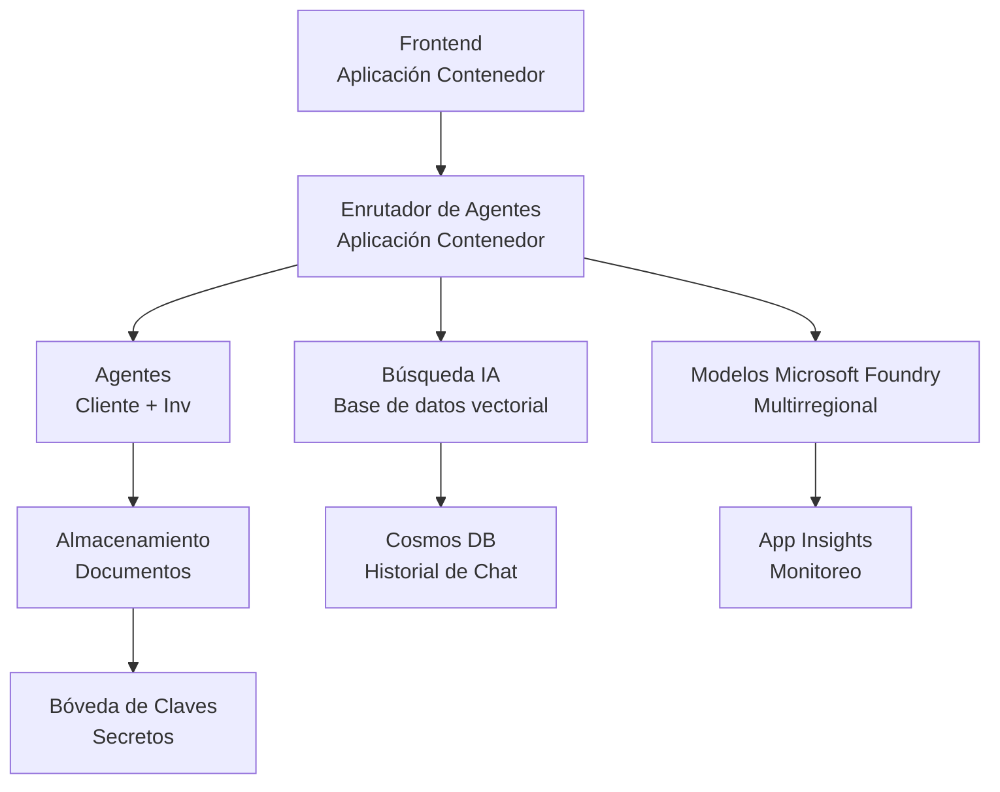

# Solución Minorista Multi-Agente - Plantilla de Infraestructura

**Capítulo 5: Paquete de Despliegue en Producción**  
- **📚 Inicio del Curso**: [AZD Para Principiantes](../../README.md)  
- **📖 Capítulo Relacionado**: [Capítulo 5: Soluciones de IA Multi-Agente](../../README.md#-chapter-5-multi-agent-ai-solutions-advanced)  
- **📝 Guía del Escenario**: [Arquitectura Completa](../retail-scenario.md)  
- **🎯 Despliegue Rápido**: [Despliegue con Un Clic](../../../../examples/retail-multiagent-arm-template)  

> **⚠️ SOLO PLANTILLA DE INFRAESTRUCTURA**  
> Esta plantilla ARM despliega **recursos de Azure** para un sistema multi-agente.  
>  
> **Lo que se despliega (15-25 minutos):**  
> - ✅ Modelos Microsoft Foundry (gpt-4.1, gpt-4.1-mini, embeddings en 3 regiones)  
> - ✅ Servicio AI Search (vacío, listo para creación de índices)  
> - ✅ Container Apps (imágenes de marcador de posición, listos para su código)  
> - ✅ Almacenamiento, Cosmos DB, Key Vault, Application Insights  
>  
> **Lo que NO se incluye (requiere desarrollo):**  
> - ❌ Código de implementación de agentes (Agente de Cliente, Agente de Inventario)  
> - ❌ Lógica de enrutamiento y endpoints de API  
> - ❌ Interfaz de chat frontend  
> - ❌ Esquemas de índices de búsqueda y canalizaciones de datos  
> - ❌ **Esfuerzo estimado de desarrollo: 80-120 horas**  
>  
> **Use esta plantilla si:**  
> - ✅ Quiere aprovisionar infraestructura Azure para un proyecto multi-agente  
> - ✅ Planea desarrollar la implementación de agentes por separado  
> - ✅ Necesita una base de infraestructura lista para producción  
>  
> **No use si:**  
> - ❌ Espera una demo funcional multi-agente inmediatamente  
> - ❌ Busca ejemplos completos de código de aplicación  

## Resumen

Este directorio contiene una plantilla completa de Azure Resource Manager (ARM) para desplegar la **fundación de infraestructura** de un sistema multi-agente de soporte al cliente. La plantilla aprovisiona todos los servicios necesarios de Azure, configurados apropiadamente y conectados, listos para el desarrollo de su aplicación.

**Después del despliegue, tendrá:** Infraestructura Azure lista para producción  
**Para completar el sistema, necesita:** Código de agentes, UI frontend y configuración de datos (ver [Guía de Arquitectura](../retail-scenario.md))

## 🎯 Qué se Despliega

### Infraestructura Principal (Estado Después del Despliegue)

✅ **Servicios de Modelos Microsoft Foundry** (Listos para llamadas API)  
- Región primaria: despliegue gpt-4.1 (capacidad 20K TPM)  
- Región secundaria: despliegue gpt-4.1-mini (capacidad 10K TPM)  
- Región terciaria: modelo de embeddings de texto (capacidad 30K TPM)  
- Región de evaluación: modelo calificador gpt-4.1 (capacidad 15K TPM)  
- **Estado:** Totalmente funcional - puede hacer llamadas API inmediatamente  

✅ **Azure AI Search** (Vacío - listo para configuración)  
- Capacidades de búsqueda vectorial habilitadas  
- Nivel estándar con 1 partición, 1 réplica  
- **Estado:** Servicio en ejecución, pero requiere creación de índices  
- **Acción requerida:** Crear índice de búsqueda con su esquema  

✅ **Cuenta de Almacenamiento Azure** (Vacía - lista para cargas)  
- Contenedores de blobs: `documents`, `uploads`  
- Configuración segura (solo HTTPS, sin acceso público)  
- **Estado:** Lista para recibir archivos  
- **Acción requerida:** Subir sus datos de productos y documentos  

⚠️ **Entorno de Container Apps** (Imágenes de marcador desplegadas)  
- Aplicación enrutadora de agentes (imagen nginx por defecto)  
- Aplicación frontend (imagen nginx por defecto)  
- Autoescalado configurado (0-10 instancias)  
- **Estado:** Contenedores marcadores en ejecución  
- **Acción requerida:** Construir y desplegar sus aplicaciones de agentes  

✅ **Azure Cosmos DB** (Vacío - listo para datos)  
- Base de datos y contenedor preconfigurados  
- Optimizado para operaciones de baja latencia  
- TTL habilitado para limpieza automática  
- **Estado:** Listo para almacenar historial de chat  

✅ **Azure Key Vault** (Opcional - listo para secretos)  
- Eliminación suave habilitada  
- RBAC configurado para identidades gestionadas  
- **Estado:** Listo para almacenar claves API y cadenas de conexión  

✅ **Application Insights** (Opcional - monitoreo activo)  
- Conectado a workspace de Log Analytics  
- Métricas y alertas personalizadas configuradas  
- **Estado:** Listo para recibir telemetría de sus aplicaciones  

✅ **Document Intelligence** (Listo para llamadas API)  
- Nivel S0 para cargas de trabajo de producción  
- **Estado:** Listo para procesar documentos cargados  

✅ **Bing Search API** (Listo para llamadas API)  
- Nivel S1 para búsquedas en tiempo real  
- **Estado:** Listo para consultas de búsqueda web  

### Modos de Despliegue  

| Modo       | Capacidad OpenAI | Instancias de Contenedores | Nivel de Búsqueda | Redundancia de Almacenamiento | Mejor Para                                    |
|------------|------------------|----------------------------|-------------------|-------------------------------|-----------------------------------------------|
| **Mínimo** | 10K-20K TPM      | 0-2 réplicas               | Básico            | LRS (Local)                   | Desarrollo/prueba, aprendizaje, prueba de concepto |
| **Estándar** | 30K-60K TPM     | 2-5 réplicas               | Estándar          | ZRS (Zona)                    | Producción, tráfico moderado (<10K usuarios)  |
| **Premium** | 80K-150K TPM     | 5-10 réplicas, redundancia zonal | Premium           | GRS (Geo)                     | Empresa, tráfico alto (>10K usuarios), SLA 99.99% |

**Impacto en Costos:**  
- **Mínimo → Estándar:** aumento de costo ~4x ($100-370/mes → $420-1,450/mes)  
- **Estándar → Premium:** aumento de costo ~3x ($420-1,450/mes → $1,150-3,500/mes)  
- **Elija según:** carga esperada, requisitos SLA, limitaciones presupuestarias  

**Planificación de Capacidad:**  
- **TPM (Tokens por Minuto):** Total entre todos los modelos desplegados  
- **Instancias de Contenedores:** Rango de autoescalado (réplicas mín-máx)  
- **Nivel de Búsqueda:** Afecta rendimiento de consultas y límites de tamaño de índice  

## 📋 Prerrequisitos

### Herramientas Requeridas  
1. **Azure CLI** (versión 2.50.0 o superior)  
   ```bash
   az --version  # Verificar versión
   az login      # Autenticar
   ```
  
2. **Suscripción activa de Azure** con acceso de Propietario o Colaborador  
   ```bash
   az account show  # Verificar suscripción
   ```
  
### Cuotas de Azure Requeridas  

Antes del despliegue, verifique que tiene cuotas suficientes en sus regiones objetivo:  

```bash
# Verifique la disponibilidad de los Modelos Microsoft Foundry en su región
az cognitiveservices account list-skus \
  --kind OpenAI \
  --location eastus2

# Verifique la cuota de OpenAI (ejemplo para gpt-4.1)
az cognitiveservices usage list \
  --location eastus2 \
  --query "[?name.value=='OpenAI.Standard.gpt-4.1']"

# Verifique la cuota de Aplicaciones en Contenedor
az provider show \
  --namespace Microsoft.App \
  --query "resourceTypes[?resourceType=='managedEnvironments'].locations"
```
  
**Cuotas Mínimas Requeridas:**  
- **Modelos Microsoft Foundry:** 3-4 despliegues de modelos en varias regiones  
  - gpt-4.1: 20K TPM (Tokens Por Minuto)  
  - gpt-4.1-mini: 10K TPM  
  - text-embedding-ada-002: 30K TPM  
  - **Nota:** gpt-4.1 puede tener lista de espera en algunas regiones - ver [disponibilidad de modelos](https://learn.microsoft.com/azure/ai-services/openai/concepts/models)  
- **Container Apps:** Entorno gestionado + 2-10 instancias de contenedor  
- **AI Search:** Nivel estándar (Básico insuficiente para búsqueda vectorial)  
- **Cosmos DB:** Rendimiento aprovisionado estándar  

**Si la cuota es insuficiente:**  
1. Ir a Portal Azure → Cuotas → Solicitar aumento  
2. O usar Azure CLI:  
   ```bash
   az support tickets create \
     --ticket-name "OpenAI-Quota-Increase" \
     --severity "minimal" \
     --description "Request quota increase for Microsoft Foundry Models gpt-4.1 in eastus2"
   ```
3. Considerar regiones alternativas con disponibilidad

## 🚀 Despliegue Rápido

### Opción 1: Usando Azure CLI  

```bash
# Clona o descarga los archivos de la plantilla
git clone <repository-url>
cd examples/retail-multiagent-arm-template

# Haz que el script de despliegue sea ejecutable
chmod +x deploy.sh

# Despliega con la configuración predeterminada
./deploy.sh -g myResourceGroup

# Despliega para producción con funciones premium
./deploy.sh -g myProdRG -e prod -m premium -l eastus2
```
  
### Opción 2: Usando Portal de Azure  

[](https://portal.azure.com/#create/Microsoft.Template/uri/https%3A%2F%2Fraw.githubusercontent.com%2Fmicrosoft%2Fazd-for-beginners%2Fmain%2Fexamples%2Fretail-multiagent-arm-template%2Fazuredeploy.json)  

### Opción 3: Usando Azure CLI directamente  

```bash
# Crear grupo de recursos
az group create --name myResourceGroup --location eastus2

# Implementar plantilla
az deployment group create \
  --resource-group myResourceGroup \
  --template-file azuredeploy.json \
  --parameters azuredeploy.parameters.json
```
  
## ⏱️ Cronograma de Despliegue

### Qué esperar

| Fase                  | Duración        | Qué sucede                                                  |
|-----------------------|-----------------|-------------------------------------------------------------|
| **Validación de plantilla** | 30-60 segundos  | Azure valida sintaxis y parámetros del template ARM         |
| **Configuración de grupo de recursos** | 10-20 segundos  | Crea grupo de recursos (si es necesario)                    |
| **Aprovisionamiento OpenAI** | 5-8 minutos    | Crea 3-4 cuentas OpenAI y despliega modelos                  |
| **Container Apps**         | 3-5 minutos    | Crea entorno y despliega contenedores marcadores             |
| **Búsqueda y Almacenamiento** | 2-4 minutos    | Aprovisiona servicio AI Search y cuentas de almacenamiento   |
| **Cosmos DB**             | 2-3 minutos    | Crea base de datos y configura contenedores                  |
| **Configuración de monitoreo** | 2-3 minutos    | Configura Application Insights y Log Analytics                |
| **Configuración RBAC**     | 1-2 minutos    | Configura identidades gestionadas y permisos                  |
| **Despliegue total**       | **15-25 minutos** | Infraestructura completa y lista                              |

**Después del Despliegue:**  
- ✅ **Infraestructura Lista:** Todos los servicios de Azure aprovisionados y en ejecución  
- ⏱️ **Desarrollo de Aplicación:** 80-120 horas (su responsabilidad)  
- ⏱️ **Configuración de Índices:** 15-30 minutos (requiere su esquema)  
- ⏱️ **Carga de Datos:** Varía según tamaño de conjunto de datos  
- ⏱️ **Pruebas y Validación:** 2-4 horas  

---

## ✅ Verificar Éxito del Despliegue

### Paso 1: Verificar Aprovisionamiento de Recursos (2 minutos)  

```bash
# Verificar que todos los recursos se hayan desplegado correctamente
az resource list \
  --resource-group myResourceGroup \
  --query "[?provisioningState!='Succeeded'].{Name:name, Status:provisioningState, Type:type}" \
  --output table
```
  
**Esperado:** Tabla vacía (todos los recursos muestran estado "Succeeded")

### Paso 2: Verificar Despliegues de Modelos Microsoft Foundry (3 minutos)  

```bash
# Listar todas las cuentas de OpenAI
az cognitiveservices account list \
  --resource-group myResourceGroup \
  --query "[?kind=='OpenAI'].{Name:name, Location:location, Status:properties.provisioningState}" \
  --output table

# Verificar los despliegues del modelo para la región principal
OPENAI_NAME=$(az cognitiveservices account list \
  --resource-group myResourceGroup \
  --query "[?kind=='OpenAI'] | [0].name" -o tsv)

az cognitiveservices account deployment list \
  --name $OPENAI_NAME \
  --resource-group myResourceGroup \
  --output table
```
  
**Esperado:**  
- 3-4 cuentas OpenAI (regiones primaria, secundaria, terciaria, evaluación)  
- 1-2 modelos desplegados por cuenta (gpt-4.1, gpt-4.1-mini, text-embedding-ada-002)

### Paso 3: Probar Endpoints de Infraestructura (5 minutos)  

```bash
# Obtener URLs de la aplicación de contenedor
az containerapp list \
  --resource-group myResourceGroup \
  --query "[].{Name:name, URL:properties.configuration.ingress.fqdn, Status:properties.runningStatus}" \
  --output table

# Probar el endpoint del enrutador (la imagen de marcador de posición responderá)
ROUTER_URL=$(az containerapp show \
  --name retail-router \
  --resource-group myResourceGroup \
  --query "properties.configuration.ingress.fqdn" -o tsv)

echo "Testing: https://$ROUTER_URL"
curl -I https://$ROUTER_URL || echo "Container running (placeholder image - expected)"
```
  
**Esperado:**  
- Container Apps muestran estado "Running"  
- Nginx marcador responde con HTTP 200 o 404 (sin código de aplicación aún)

### Paso 4: Verificar Acceso API Modelos Microsoft Foundry (3 minutos)  

```bash
# Obtener el endpoint y la clave de OpenAI
OPENAI_ENDPOINT=$(az cognitiveservices account show \
  --name $OPENAI_NAME \
  --resource-group myResourceGroup \
  --query "properties.endpoint" -o tsv)

OPENAI_KEY=$(az cognitiveservices account keys list \
  --name $OPENAI_NAME \
  --resource-group myResourceGroup \
  --query "key1" -o tsv)

# Probar el despliegue de gpt-4.1
curl "${OPENAI_ENDPOINT}openai/deployments/gpt-4.1/chat/completions?api-version=2024-08-01-preview" \
  -H "Content-Type: application/json" \
  -H "api-key: $OPENAI_KEY" \
  -d '{
    "messages": [{"role": "user", "content": "Say hello"}],
    "max_tokens": 10
  }'
```
  
**Esperado:** Respuesta JSON con finalización de chat (confirma funcionalidad OpenAI)

### Qué Funciona vs Qué No

**✅ Funciona tras el despliegue:**  
- Modelos Microsoft Foundry desplegados y aceptando llamadas API  
- Servicio AI Search en ejecución (vacío, sin índices aún)  
- Container Apps en ejecución (imágenes nginx marcador)  
- Cuentas de almacenamiento accesibles y listas para cargas  
- Cosmos DB listo para operaciones de datos  
- Application Insights recopilando telemetría de infraestructura  
- Key Vault listo para almacenamiento de secretos  

**❌ No funciona aún (Requiere desarrollo):**  
- Endpoints de agentes (no hay código de aplicación desplegado)  
- Funcionalidad de chat (requiere frontend + backend)  
- Consultas de búsqueda (no hay índice de búsqueda creado)  
- Pipelines de procesamiento de documentos (no hay datos cargados)  
- Telemetría personalizada (requiere instrumentación de la aplicación)  

**Próximos pasos:** Ver [Configuración Post-Despliegue](../../../../examples/retail-multiagent-arm-template) para desarrollar y desplegar su aplicación

---

## ⚙️ Opciones de Configuración

### Parámetros de la Plantilla

| Parámetro           | Tipo    | Predeterminado      | Descripción                             |
|---------------------|---------|---------------------|---------------------------------------|
| `projectName`       | string  | "retail"            | Prefijo para todos los nombres de recursos |
| `location`          | string  | Ubicación del grupo de recursos | Región primaria de despliegue          |
| `secondaryLocation` | string  | "westus2"           | Región secundaria para despliegue multirregional |
| `tertiaryLocation`  | string  | "francecentral"     | Región para modelo de embeddings       |
| `environmentName`   | string  | "dev"               | Designación del entorno (dev/staging/prod) |
| `deploymentMode`    | string  | "standard"          | Configuración del despliegue (mínimo/estándar/premium) |
| `enableMultiRegion` | bool    | true                | Habilitar despliegue multirregional    |
| `enableMonitoring`  | bool    | true                | Habilitar Application Insights y registro |
| `enableSecurity`    | bool    | true                | Habilitar Key Vault y seguridad mejorada |

### Personalización de Parámetros

Edite `azuredeploy.parameters.json`:  

```json
{
  "$schema": "https://schema.management.azure.com/schemas/2019-04-01/deploymentParameters.json#",
  "contentVersion": "1.0.0.0",
  "parameters": {
    "projectName": {
      "value": "mycompany"
    },
    "environmentName": {
      "value": "prod"
    },
    "deploymentMode": {
      "value": "premium"
    },
    "location": {
      "value": "eastus2"
    }
  }
}
```
  
## 🏗️ Resumen de Arquitectura


## 📖 Uso del Script de Despliegue

El script `deploy.sh` provee una experiencia de despliegue interactiva:  

```bash
# Mostrar ayuda
./deploy.sh --help

# Despliegue básico
./deploy.sh -g myResourceGroup

# Despliegue avanzado con configuraciones personalizadas
./deploy.sh \
  -g myProductionRG \
  -p companyname \
  -e prod \
  -m premium \
  -l eastus2

# Despliegue de desarrollo sin multi-región
./deploy.sh \
  -g myDevRG \
  -e dev \
  -m minimal \
  --no-multi-region \
  --no-security
```
  
### Características del Script

- ✅ **Validación de prerrequisitos** (Azure CLI, estado de login, archivos de plantilla)  
- ✅ **Gestión de grupo de recursos** (crea si no existe)  
- ✅ **Validación de plantilla** antes del despliegue  
- ✅ **Monitoreo del progreso** con salida en colores  
- ✅ **Despliegue de outputs** muestreados  
- ✅ **Guía post-despliegue**  

## 📊 Monitoreo del Despliegue

### Verificar Estado del Despliegue  

```bash
# Listar despliegues
az deployment group list --resource-group myResourceGroup --output table

# Obtener detalles del despliegue
az deployment group show \
  --resource-group myResourceGroup \
  --name retail-deployment-YYYYMMDD-HHMMSS

# Supervisar el progreso del despliegue
az deployment group create \
  --resource-group myResourceGroup \
  --template-file azuredeploy.json \
  --parameters azuredeploy.parameters.json \
  --verbose
```
  
### Outputs del Despliegue  

Después del despliegue exitoso, están disponibles los siguientes outputs:  

- **URL Frontend**: Punto de acceso público para la interfaz web  
- **URL Router**: Endpoint API para el enrutador de agentes  
- **Endpoints OpenAI**: Endpoints primario y secundario del servicio OpenAI  
- **Servicio de Búsqueda**: Endpoint del servicio Azure AI Search  
- **Cuenta de Almacenamiento**: Nombre de la cuenta para documentos  
- **Key Vault**: Nombre del Key Vault (si está habilitado)  
- **Application Insights**: Nombre del servicio de monitoreo (si está habilitado)  

## 🔧 Post-Despliegue: Próximos Pasos
> **📝 Importante:** La infraestructura está desplegada, pero necesitas desarrollar y desplegar el código de la aplicación.

### Fase 1: Desarrollar las Aplicaciones de Agentes (Tu Responsabilidad)

La plantilla ARM crea **Container Apps vacíos** con imágenes nginx de marcador de posición. Debes:

**Desarrollo Requerido:**
1. **Implementación del Agente** (30-40 horas)
   - Agente de servicio al cliente con integración gpt-4.1
   - Agente de inventario con integración gpt-4.1-mini
   - Lógica de enrutamiento de agentes

2. **Desarrollo Frontend** (20-30 horas)
   - Interfaz de chat (React/Vue/Angular)
   - Funcionalidad de carga de archivos
   - Renderizado y formato de respuestas

3. **Servicios Backend** (12-16 horas)
   - Router FastAPI o Express
   - Middleware de autenticación
   - Integración de telemetría

**Consulta:** [Guía de Arquitectura](../retail-scenario.md) para patrones de implementación detallados y ejemplos de código

### Fase 2: Configurar el Índice de Búsqueda AI (15-30 minutos)

Crea un índice de búsqueda que coincida con tu modelo de datos:

```bash
# Obtener detalles del servicio de búsqueda
SEARCH_NAME=$(az search service list \
  --resource-group myResourceGroup \
  --query "[0].name" -o tsv)

SEARCH_KEY=$(az search admin-key show \
  --service-name $SEARCH_NAME \
  --resource-group myResourceGroup \
  --query "primaryKey" -o tsv)

# Crear índice con su esquema (ejemplo)
curl -X POST "https://${SEARCH_NAME}.search.windows.net/indexes?api-version=2023-11-01" \
  -H "Content-Type: application/json" \
  -H "api-key: ${SEARCH_KEY}" \
  -d '{
    "name": "products",
    "fields": [
      {"name": "id", "type": "Edm.String", "key": true},
      {"name": "title", "type": "Edm.String", "searchable": true},
      {"name": "content", "type": "Edm.String", "searchable": true},
      {"name": "category", "type": "Edm.String", "filterable": true},
      {"name": "content_vector", "type": "Collection(Edm.Single)", 
       "searchable": true, "dimensions": 1536, "vectorSearchProfile": "default"}
    ],
    "vectorSearch": {
      "algorithms": [{"name": "default", "kind": "hnsw"}],
      "profiles": [{"name": "default", "algorithm": "default"}]
    }
  }'
```

**Recursos:**
- [Diseño del esquema de índice AI Search](https://learn.microsoft.com/azure/search/search-what-is-an-index)
- [Configuración de búsqueda vectorial](https://learn.microsoft.com/azure/search/vector-search-how-to-create-index)

### Fase 3: Cargar Tus Datos (Tiempo variable)

Una vez que tengas los datos de productos y documentos:

```bash
# Obtener detalles de la cuenta de almacenamiento
STORAGE_NAME=$(az storage account list \
  --resource-group myResourceGroup \
  --query "[0].name" -o tsv)

STORAGE_KEY=$(az storage account keys list \
  --account-name $STORAGE_NAME \
  --resource-group myResourceGroup \
  --query "[0].value" -o tsv)

# Sube tus documentos
az storage blob upload-batch \
  --destination documents \
  --source /path/to/your/product/docs \
  --account-name $STORAGE_NAME \
  --account-key $STORAGE_KEY

# Ejemplo: Subir archivo único
az storage blob upload \
  --container-name documents \
  --name "product-manual.pdf" \
  --file /path/to/product-manual.pdf \
  --account-name $STORAGE_NAME \
  --account-key $STORAGE_KEY
```

### Fase 4: Construir y Desplegar Tus Aplicaciones (8-12 horas)

Una vez que hayas desarrollado el código de los agentes:

```bash
# 1. Crear Azure Container Registry (si es necesario)
az acr create \
  --name myregistry \
  --resource-group myResourceGroup \
  --sku Basic

# 2. Construir y enviar la imagen del router del agente
docker build -t myregistry.azurecr.io/agent-router:v1 /path/to/your/router/code
az acr login --name myregistry
docker push myregistry.azurecr.io/agent-router:v1

# 3. Construir y enviar la imagen del frontend
docker build -t myregistry.azurecr.io/frontend:v1 /path/to/your/frontend/code
docker push myregistry.azurecr.io/frontend:v1

# 4. Actualizar las aplicaciones de contenedor con tus imágenes
az containerapp update \
  --name retail-router \
  --resource-group myResourceGroup \
  --image myregistry.azurecr.io/agent-router:v1

az containerapp update \
  --name retail-frontend \
  --resource-group myResourceGroup \
  --image myregistry.azurecr.io/frontend:v1

# 5. Configurar las variables de entorno
az containerapp update \
  --name retail-router \
  --resource-group myResourceGroup \
  --set-env-vars \
    OPENAI_ENDPOINT=secretref:openai-endpoint \
    OPENAI_KEY=secretref:openai-key \
    SEARCH_ENDPOINT=secretref:search-endpoint \
    SEARCH_KEY=secretref:search-key
```

### Fase 5: Probar Tu Aplicación (2-4 horas)

```bash
# Obtén la URL de tu aplicación
ROUTER_URL=$(az containerapp show \
  --name retail-router \
  --resource-group myResourceGroup \
  --query "properties.configuration.ingress.fqdn" -o tsv)

# Punto final del agente de prueba (una vez que tu código esté desplegado)
curl -X POST "https://${ROUTER_URL}/chat" \
  -H "Content-Type: application/json" \
  -d '{
    "message": "Hello, I need help with my order",
    "agent": "customer"
  }'

# Revisa los registros de la aplicación
az containerapp logs show \
  --name retail-router \
  --resource-group myResourceGroup \
  --follow
```

### Recursos de Implementación

**Arquitectura y Diseño:**
- 📖 [Guía Completa de Arquitectura](../retail-scenario.md) - Patrones de implementación detallados
- 📖 [Patrones de diseño multiagente](https://learn.microsoft.com/azure/architecture/ai-ml/guide/multi-agent-systems)

**Ejemplos de Código:**
- 🔗 [Ejemplo de chat de Microsoft Foundry Models](https://github.com/Azure-Samples/azure-search-openai-demo) - patrón RAG
- 🔗 [Semantic Kernel](https://github.com/microsoft/semantic-kernel) - Framework para agentes (C#)
- 🔗 [LangChain Azure](https://github.com/langchain-ai/langchain) - Orquestación de agentes (Python)
- 🔗 [AutoGen](https://github.com/microsoft/autogen) - Conversaciones multiagente

**Esfuerzo Total Estimado:**
- Despliegue de infraestructura: 15-25 minutos (✅ Completo)
- Desarrollo de aplicaciones: 80-120 horas (🔨 Tu trabajo)
- Pruebas y optimización: 15-25 horas (🔨 Tu trabajo)

## 🛠️ Solución de Problemas

### Problemas Comunes

#### 1. Cuota de Microsoft Foundry Models Excedida

```bash
# Verificar el uso actual de la cuota
az cognitiveservices usage list --location eastus2

# Solicitar aumento de cuota
az support tickets create \
  --ticket-name "OpenAI-Quota-Increase" \
  --severity "minimal" \
  --description "Request quota increase for Microsoft Foundry Models in region X"
```

#### 2. Fallo en el Despliegue de Container Apps

```bash
# Revisar los registros de la aplicación del contenedor
az containerapp logs show \
  --name retail-router \
  --resource-group myResourceGroup \
  --follow

# Reiniciar la aplicación del contenedor
az containerapp revision restart \
  --name retail-router \
  --resource-group myResourceGroup
```

#### 3. Inicialización del Servicio de Búsqueda

```bash
# Verificar el estado del servicio de búsqueda
az search service show \
  --name <search-service-name> \
  --resource-group myResourceGroup

# Probar la conectividad del servicio de búsqueda
curl -X GET "https://<search-service-name>.search.windows.net/indexes?api-version=2023-11-01" \
  -H "api-key: <search-admin-key>"
```

### Validación del Despliegue

```bash
# Validar que todos los recursos están creados
az resource list \
  --resource-group myResourceGroup \
  --output table

# Verificar la salud del recurso
az resource list \
  --resource-group myResourceGroup \
  --query "[?provisioningState!='Succeeded'].{Name:name, Status:provisioningState, Type:type}" \
  --output table
```

## 🔐 Consideraciones de Seguridad

### Gestión de Claves
- Todos los secretos se almacenan en Azure Key Vault (cuando está habilitado)
- Las container apps usan identidad administrada para autenticación
- Las cuentas de almacenamiento tienen configuraciones seguras por defecto (solo HTTPS, sin acceso público a blobs)

### Seguridad de Red
- Las container apps usan redes internas cuando es posible
- Servicio de búsqueda configurado con opción de endpoints privados
- Cosmos DB configurado con permisos mínimos necesarios

### Configuración RBAC
```bash
# Asignar roles necesarios para la identidad administrada
az role assignment create \
  --assignee <container-app-managed-identity> \
  --role "Cognitive Services OpenAI User" \
  --scope <openai-resource-id>
```

## 💰 Optimización de Costos

### Estimaciones de Costos (Mensual, USD)

| Modo | OpenAI | Container Apps | Search | Storage | Total Est. |
|------|--------|----------------|--------|---------|------------|
| Mínimo | $50-200 | $20-50 | $25-100 | $5-20 | $100-370 |
| Estándar | $200-800 | $100-300 | $100-300 | $20-50 | $420-1450 |
| Premium | $500-2000 | $300-800 | $300-600 | $50-100 | $1150-3500 |

### Monitoreo de Costos

```bash
# Configurar alertas de presupuesto
az consumption budget create \
  --account-name <subscription-id> \
  --budget-name "retail-budget" \
  --amount 500 \
  --time-grain Monthly \
  --start-date 2024-01-01 \
  --end-date 2024-12-31
```

## 🔄 Actualizaciones y Mantenimiento

### Actualizaciones de Plantillas
- Control de versiones para los archivos ARM template
- Probar cambios primero en entorno de desarrollo
- Usar modo de despliegue incremental para actualizaciones

### Actualizaciones de Recursos
```bash
# Actualizar con nuevos parámetros
az deployment group create \
  --resource-group myResourceGroup \
  --template-file azuredeploy.json \
  --parameters azuredeploy.parameters.json \
  --mode Incremental
```

### Respaldo y Recuperación
- Respaldo automático habilitado en Cosmos DB
- Eliminación suave habilitada en Key Vault
- Revisión de container apps mantenida para reversión

## 📞 Soporte

- **Problemas con la plantilla**: [GitHub Issues](https://github.com/microsoft/azd-for-beginners/issues)
- **Soporte Azure**: [Portal de Soporte Azure](https://portal.azure.com/#blade/Microsoft_Azure_Support/HelpAndSupportBlade)
- **Comunidad**: [Azure AI Discord](https://discord.gg/microsoft-azure)

---

**⚡ ¿Listo para desplegar tu solución multiagente?**

Comienza con: `./deploy.sh -g myResourceGroup`

---

<!-- CO-OP TRANSLATOR DISCLAIMER START -->
**Aviso Legal**:  
Este documento ha sido traducido utilizando el servicio de traducción automática [Co-op Translator](https://github.com/Azure/co-op-translator). Aunque nos esforzamos por la precisión, tenga en cuenta que las traducciones automáticas pueden contener errores o inexactitudes. El documento original en su idioma nativo debe considerarse la fuente autorizada. Para información crítica, se recomienda una traducción profesional realizada por humanos. No nos hacemos responsables de ningún malentendido o interpretación errónea derivada del uso de esta traducción.
<!-- CO-OP TRANSLATOR DISCLAIMER END -->