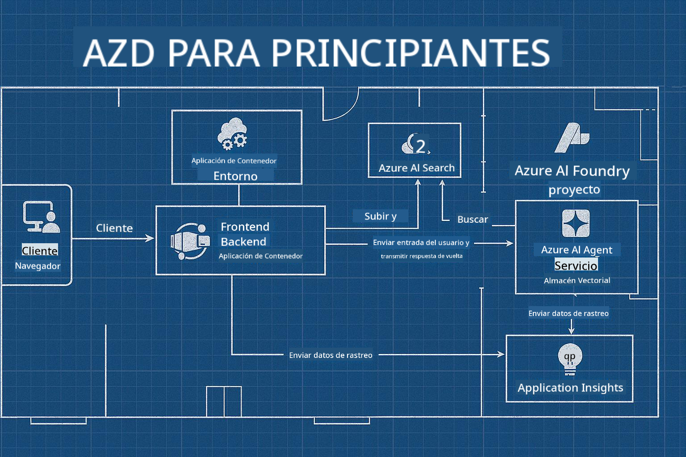

<!--
CO_OP_TRANSLATOR_METADATA:
{
  "original_hash": "245d24997bbcf2bae93bb2a503845d37",
  "translation_date": "2025-09-23T11:40:28+00:00",
  "source_file": "workshop/README.md",
  "language_code": "es"
}
-->
# Taller AZD para Desarrolladores de IA

## Plantillas AZD

Construir una solución de aplicación de IA de nivel empresarial para tu escenario específico es muy parecido a construir tu propia casa. Puedes diseñarla tú mismo, construirla ladrillo a ladrillo y asumir la responsabilidad de garantizar que cumpla con todas las pautas de gobernanza y desarrollo.

**O ....** 

Puedes trabajar con un arquitecto que te proporcione un _plano_ para una casa inicial y luego colaborar contigo para _personalizarla_ según tus necesidades. Esto te permite concentrarte en lo que hace que **tu casa** sea especial, mientras que los expertos se encargan del cableado, la plomería y otras dependencias subyacentes.

**Esta es la idea detrás de [Plantillas de Aplicaciones de IA](https://ai.azure.com/templates)**: una serie de planos para construir diferentes tipos de "casas de aplicaciones de IA" según tus necesidades y dependencias principales.

## Personalización de Plantillas

Las plantillas están diseñadas para funcionar con [Azure AI Foundry](https://ai.azure.com). Piensa en esta plataforma como tu "contratista de construcción" con acceso a todos los recursos, herramientas y experiencia que necesitas para completar el trabajo.

Solo necesitas elegir [tus plantillas iniciales](https://learn.microsoft.com/en-us/azure/ai-foundry/how-to/develop/ai-template-get-started). Por ejemplo, nos centraremos en la plantilla _Get Started with AI Agents_ para construirte una "Casa de IA Agente" que incluye características como Búsqueda de IA, Red Teaming, Evaluaciones, Trazabilidad, Monitoreo y más.



Solo necesitas reservar tiempo con el arquitecto para que te guíe en el proceso de personalización. [GitHub Copilot para Azure](https://learn.microsoft.com/en-us/azure/developer/github-copilot-azure/get-started) puede ser ese guía. Simplemente "chatea con él" para:

- Aprender sobre las características de Azure en tu plantilla
- Desplegar recursos de Azure
- Obtener información sobre tu implementación
- Diagnosticar y solucionar problemas

En este taller, aprenderemos a _descomponer_ la plantilla existente (para entender lo que ofrece) y luego _personalizarla_ (para cumplir con nuestros requisitos), paso a paso.

Las Plantillas de IA **hacen que funcione**: al completar el taller, aprenderás a **hacerlo tuyo**.

----

**Navegación del Taller**
- **📚 Inicio del Curso**: [AZD Para Principiantes](../README.md)
- **📖 Capítulos Relacionados**: Incluye [Capítulo 1](../README.md#-chapter-1-foundation--quick-start), [Capítulo 2](../README.md#-chapter-2-ai-first-development-recommended-for-ai-developers) y [Capítulo 5](../README.md#-chapter-5-multi-agent-ai-solutions-advanced)
- **🛠️ Laboratorio Práctico**: [Laboratorio del Taller de IA](../docs/ai-foundry/ai-workshop-lab.md)
- **🚀 Próximos Pasos**: [Módulos del Taller](../../../workshop)

Bienvenido al taller práctico para aprender Azure Developer CLI (AZD) con un enfoque en el despliegue de aplicaciones de IA. Este taller está diseñado para llevarte desde los conceptos básicos de AZD hasta el despliegue de soluciones de IA listas para producción.

## Resumen del Taller

**Duración:** 2-3 horas  
**Nivel:** Principiante a Intermedio  
**Requisitos Previos:** Conocimientos básicos de Azure, herramientas de línea de comandos y conceptos de IA

### Lo que Aprenderás

- **Fundamentos de AZD**: Comprender Infraestructura como Código con AZD
- 🤖 **Integración de Servicios de IA**: Desplegar Azure OpenAI, Búsqueda de IA y otros servicios de IA
- **Despliegue de Contenedores**: Usar Azure Container Apps para aplicaciones de IA
- **Mejores Prácticas de Seguridad**: Implementar Identidad Administrada y configuraciones seguras
- **Monitoreo y Observabilidad**: Configurar Application Insights para cargas de trabajo de IA
- **Patrones de Producción**: Estrategias de despliegue listas para empresas

## Estructura del Taller

### Módulo 1: Fundamentos de AZD (30 minutos)
- Instalación y configuración de AZD
- Comprender la estructura de proyectos de AZD
- Tu primer despliegue con AZD
- **Laboratorio**: Desplegar una aplicación web simple

### Módulo 2: Integración con Azure OpenAI (45 minutos)
- Configuración de recursos de Azure OpenAI
- Estrategias de despliegue de modelos
- Configuración de acceso a API y autenticación
- **Laboratorio**: Desplegar una aplicación de chat con GPT-4

### Módulo 3: Aplicaciones RAG (45 minutos)
- Integración con Búsqueda de IA de Azure
- Procesamiento de documentos con Azure Document Intelligence
- Embeddings vectoriales y búsqueda semántica
- **Laboratorio**: Construir un sistema de preguntas y respuestas basado en documentos

### Módulo 4: Despliegue en Producción (30 minutos)
- Configuración de Container Apps
- Optimización de escalabilidad y rendimiento
- Monitoreo y registro
- **Laboratorio**: Desplegar en producción con observabilidad

### Módulo 5: Patrones Avanzados (15 minutos)
- Despliegues en múltiples entornos
- Integración CI/CD
- Estrategias de optimización de costos
- **Conclusión**: Lista de verificación para preparación de producción

## Requisitos Previos

### Herramientas Necesarias

Por favor, instala estas herramientas antes del taller:

```bash
# Azure Developer CLI
curl -fsSL https://aka.ms/install-azd.sh | bash

# Azure CLI
curl -sL https://aka.ms/InstallAzureCLIDeb | sudo bash

# Git
sudo apt-get install git

# Docker
curl -fsSL https://get.docker.com -o get-docker.sh
sudo sh get-docker.sh

# Python 3.10+
sudo apt-get install python3.10 python3.10-venv python3-pip
```

### Configuración de Cuenta Azure

1. **Suscripción de Azure**: [Regístrate gratis](https://azure.microsoft.com/free/)
2. **Acceso a Azure OpenAI**: [Solicitar acceso](https://aka.ms/oai/access)
3. **Permisos Requeridos**:
   - Rol de Colaborador en la suscripción o grupo de recursos
   - Administrador de Acceso de Usuario (para asignaciones RBAC)

### Verificar Requisitos Previos

Ejecuta este script para verificar tu configuración:

```bash
#!/bin/bash
echo "Verifying workshop prerequisites..."

# Check AZD installation
if command -v azd &> /dev/null; then
    echo "✅ Azure Developer CLI: $(azd --version)"
else
    echo "❌ Azure Developer CLI not found"
fi

# Check Azure CLI
if command -v az &> /dev/null; then
    echo "✅ Azure CLI: $(az --version | head -n1)"
else
    echo "❌ Azure CLI not found"
fi

# Check Docker
if command -v docker &> /dev/null; then
    echo "✅ Docker: $(docker --version)"
else
    echo "❌ Docker not found"
fi

# Check Python
if command -v python3 &> /dev/null; then
    echo "✅ Python: $(python3 --version)"
else
    echo "❌ Python 3 not found"
fi

# Check Azure login
if az account show &> /dev/null; then
    echo "✅ Azure: Logged in as $(az account show --query user.name -o tsv)"
else
    echo "❌ Azure: Not logged in (run 'az login')"
fi

echo "Setup verification complete!"
```

## Materiales del Taller

### Ejercicios de Laboratorio

Cada módulo incluye laboratorios prácticos con código inicial y pasos detallados:

- **[lab-1-azd-basics/](../../../workshop/lab-1-azd-basics)** - Tu primer despliegue con AZD
- **[lab-2-openai-chat/](../../../workshop/lab-2-openai-chat)** - Aplicación de chat con Azure OpenAI
- **[lab-3-rag-search/](../../../workshop/lab-3-rag-search)** - Aplicación RAG con Búsqueda de IA
- **[lab-4-production/](../../../workshop/lab-4-production)** - Patrones de despliegue en producción
- **[lab-5-advanced/](../../../workshop/lab-5-advanced)** - Escenarios avanzados de despliegue

### Materiales de Referencia

- **[Guía de Integración con AI Foundry](../docs/ai-foundry/azure-ai-foundry-integration.md)** - Patrones de integración completos
- **[Guía de Despliegue de Modelos de IA](../docs/ai-foundry/ai-model-deployment.md)** - Mejores prácticas de despliegue de modelos
- **[Prácticas de IA en Producción](../docs/ai-foundry/production-ai-practices.md)** - Patrones de despliegue empresarial
- **[Guía de Solución de Problemas de IA](../docs/troubleshooting/ai-troubleshooting.md)** - Problemas comunes y soluciones

### Plantillas de Ejemplo

Plantillas de inicio rápido para escenarios comunes de IA:

```
workshop/templates/
├── minimal-chat/          # Basic OpenAI chat app
├── rag-application/       # RAG with AI Search
├── multi-model/          # Multiple AI services
└── production-ready/     # Enterprise template
```

## Comenzando

### Opción 1: GitHub Codespaces (Recomendado)

La forma más rápida de comenzar el taller:

[](https://github.com/codespaces/new?hide_repo_select=true&ref=main&repo=YOUR_REPO_ID)

### Opción 2: Desarrollo Local

1. **Clonar el repositorio del taller:**
```bash
git clone https://github.com/YOUR_ORG/AZD-for-beginners.git
cd AZD-for-beginners/workshop
```

2. **Iniciar sesión en Azure:**
```bash
az login
azd auth login
```

3. **Comenzar con el Laboratorio 1:**
```bash
cd lab-1-azd-basics
cat README.md  # Follow the instructions
```

### Opción 3: Taller Guiado por Instructor

Si estás asistiendo a una sesión guiada por instructor:

- 🎥 **Grabación del Taller**: [Disponible bajo demanda](https://aka.ms/azd-ai-workshop)
- 💬 **Comunidad en Discord**: [Únete para soporte en vivo](https://aka.ms/foundry/discord)
- **Comentarios sobre el Taller**: [Comparte tu experiencia](https://aka.ms/azd-workshop-feedback)

## Cronograma del Taller

### Aprendizaje Autónomo (3 horas)

```
⏰ 00:00 - 00:30  Module 1: AZD Foundations
⏰ 00:30 - 01:15  Module 2: Azure OpenAI Integration
⏰ 01:15 - 02:00  Module 3: RAG Applications
⏰ 02:00 - 02:30  Module 4: Production Deployment
⏰ 02:30 - 02:45  Module 5: Advanced Patterns
⏰ 02:45 - 03:00  Q&A and Next Steps
```

### Sesión Guiada por Instructor (2.5 horas)

```
⏰ 00:00 - 00:15  Welcome & Prerequisites Check
⏰ 00:15 - 00:40  Module 1: Live Demo + Lab
⏰ 00:40 - 01:20  Module 2: OpenAI Integration
⏰ 01:20 - 01:30  Break
⏰ 01:30 - 02:10  Module 3: RAG Applications
⏰ 02:10 - 02:30  Module 4: Production Patterns
⏰ 02:30 - 02:45  Module 5: Advanced Topics
⏰ 02:45 - 03:00  Q&A and Resources
```

## Criterios de Éxito

Al final de este taller, serás capaz de:

✅ **Desplegar aplicaciones de IA** usando plantillas AZD  
✅ **Configurar servicios de Azure OpenAI** con seguridad adecuada  
✅ **Construir aplicaciones RAG** con integración de Búsqueda de IA de Azure  
✅ **Implementar patrones de producción** para cargas de trabajo de IA empresariales  
✅ **Monitorear y solucionar problemas** en despliegues de aplicaciones de IA  
✅ **Aplicar estrategias de optimización de costos** para cargas de trabajo de IA  

## Comunidad y Soporte

### Durante el Taller

- 🙋 **Preguntas**: Usa el chat del taller o levanta la mano
- 🐛 **Problemas**: Consulta la [guía de solución de problemas](../docs/troubleshooting/ai-troubleshooting.md)
- **Consejos**: Comparte descubrimientos con otros participantes

### Después del Taller

- 💬 **Discord**: [Comunidad Azure AI Foundry](https://aka.ms/foundry/discord)
- **Problemas en GitHub**: [Reportar problemas de plantillas](https://github.com/YOUR_ORG/AZD-for-beginners/issues)
- 📧 **Comentarios**: [Formulario de evaluación del taller](https://aka.ms/azd-workshop-feedback)

## Próximos Pasos

### Continuar Aprendiendo

1. **Escenarios Avanzados**: Explora [despliegues en múltiples regiones](../docs/ai-foundry/production-ai-practices.md#multi-region-deployment)
2. **Integración CI/CD**: Configura [flujos de trabajo con GitHub Actions](../docs/deployment/github-actions.md)
3. **Plantillas Personalizadas**: Crea tus propias [plantillas AZD](../docs/getting-started/custom-templates.md)

### Aplicar en tus Proyectos

1. **Evaluación**: Usa nuestra [lista de verificación de preparación](./production-readiness-checklist.md)
2. **Plantillas**: Comienza con nuestras [plantillas específicas de IA](../../../workshop/templates)
3. **Soporte**: Únete al [Discord de Azure AI Foundry](https://aka.ms/foundry/discord)

### Comparte tu Éxito

- ⭐ **Dale estrella al repositorio** si este taller te ayudó
- 🐦 **Comparte en redes sociales** con #AzureDeveloperCLI #AzureAI
- 📝 **Escribe un post en tu blog** sobre tu experiencia de despliegue de IA

---

## Comentarios sobre el Taller

Tu opinión nos ayuda a mejorar la experiencia del taller:

| Aspecto | Calificación (1-5) | Comentarios |
|--------|--------------|----------|
| Calidad del Contenido | ⭐⭐⭐⭐⭐ | |
| Laboratorios Prácticos | ⭐⭐⭐⭐⭐ | |
| Documentación | ⭐⭐⭐⭐⭐ | |
| Nivel de Dificultad | ⭐⭐⭐⭐⭐ | |
| Experiencia General | ⭐⭐⭐⭐⭐ | |

**Enviar comentarios**: [Formulario de Evaluación del Taller](https://aka.ms/azd-workshop-feedback)

---

**Anterior:** [Guía de Solución de Problemas de IA](../docs/troubleshooting/ai-troubleshooting.md) | **Siguiente:** Comienza con [Laboratorio 1: Fundamentos de AZD](../../../workshop/lab-1-azd-basics)

**¿Listo para comenzar a construir aplicaciones de IA con AZD?**

[Comienza el Laboratorio 1: Fundamentos de AZD →](./lab-1-azd-basics/README.md)

---

