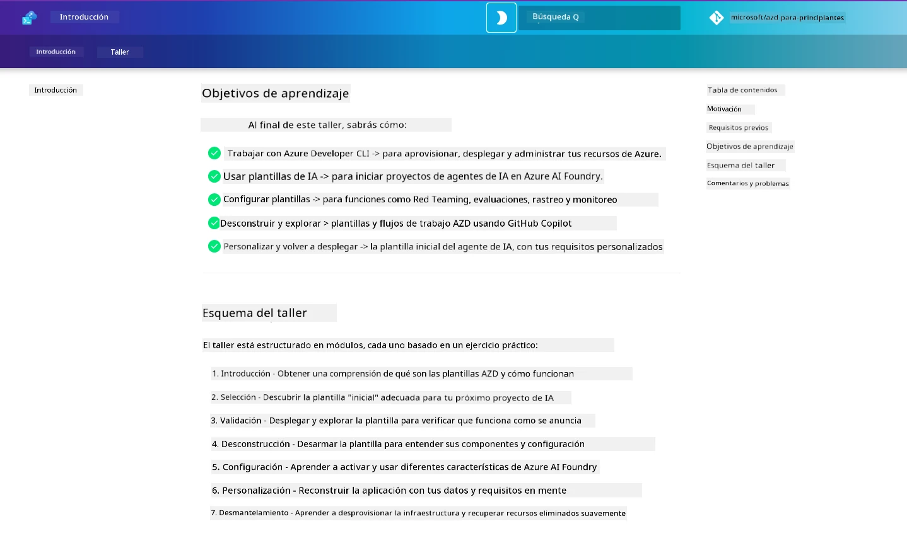

<div align="center">
  <div style="background: linear-gradient(135deg, #0078d4, #106ebe); border-radius: 10px; padding: 20px; margin: 20px 0; box-shadow: 0 4px 15px rgba(0, 120, 212, 0.3); border: 2px solid #005a9e;">
    <h2 style="color: white; margin: 0; font-size: 24px; text-shadow: 1px 1px 2px rgba(0,0,0,0.3);">
      🎯 Taller AZD para desarrolladores de IA
    </h2>
    <p style="color: white; margin: 10px 0 0 0; font-size: 16px; text-shadow: 1px 1px 2px rgba(0,0,0,0.3);">
      <strong>Un taller práctico para crear aplicaciones de IA con Azure Developer CLI.</strong><br>
      Completa 7 módulos para dominar plantillas AZD y flujos de trabajo de despliegue de IA.
    </p>
    <div style="margin-top: 15px;">
      <span style="background: rgba(255,255,255,0.2); padding: 5px 10px; border-radius: 15px; color: white; font-size: 14px;">
        📅 Última actualización: febrero de 2026
      </span>
    </div>
  </div>
</div>

# Taller AZD para desarrolladores de IA

Bienvenido al taller práctico para aprender Azure Developer CLI (AZD) con un enfoque en el despliegue de aplicaciones de IA. Este taller te ayuda a obtener una comprensión aplicada de las plantillas AZD en 3 pasos:

1. **Descubrimiento** - encuentra la plantilla que te conviene.
1. **Despliegue** - desplegar y validar que funciona
1. **Personalización** - modifica e itera para que sea tuya!

Over the course of this workshop, you will also be introduced to core developer tools and workflows, to help you streamline your end-to-end development journey.

<br/>

## Guía basada en el navegador

The workshop lessons are in Markdown. You can navigate them directly in GitHub - or launch a browser-based preview as shown in the screenshot below.



To use this option - fork the repository to your profile, and launch GitHub Codespaces. Once the VS Code terminal is active, type this command:

```bash title="" linenums="0"
mkdocs serve > /dev/null 2>&1 &
```

In a few seconds, you will see a pop-up dialog. Select the option to `Abrir en el navegador`. The web-based guide will now open in a new browser tab. Some benefits of this preview:

1. **Búsqueda integrada** - encuentra palabras clave o lecciones rápidamente.
1. **Icono de copiar** - pasa el cursor sobre los bloques de código para ver esta opción
1. **Alternar tema** - cambia entre los temas oscuro y claro
1. **Obtener ayuda** - haz clic en el icono de Discord en el pie para unirte!

<br/>

## Descripción general del taller

**Duration:** 3-4 hours  
**Level:** Beginner to Intermediate  
**Prerequisites:** Familiarity with Azure, AI concepts, VS Code & command-line tools.

Este es un taller práctico donde aprendes haciendo. Una vez que hayas completado los ejercicios, recomendamos revisar el AZD For Beginners curriculum to continue your learning journey into Security and Productivity best practices.

| Tiempo| Módulo  | Objetivo |
|:---|:---|:---|
| 15 mins | [Introducción](docs/instructions/0-Introduction.md) | Set the stage, understand the goals |
| 30 mins | [Seleccionar plantilla de IA](docs/instructions/1-Select-AI-Template.md) | Explora opciones y elige una plantilla inicial | 
| 30 mins | [Validar plantilla de IA](docs/instructions/2-Validate-AI-Template.md) | Desplegar la solución predeterminada en Azure |
| 30 mins | [Desconstruir plantilla de IA](docs/instructions/3-Deconstruct-AI-Template.md) | Explora la estructura y la configuración |
| 30 mins | [Configurar plantilla de IA](docs/instructions/4-Configure-AI-Template.md) | Activa y prueba las funciones disponibles |
| 30 mins | [Personalizar plantilla de IA](docs/instructions/5-Customize-AI-Template.md) | Adapta la plantilla a tus necesidades |
| 30 mins | [Desmantelar infraestructura](docs/instructions/6-Teardown-Infrastructure.md) | Cleanup and release resources |
| 15 mins | [Wrap-Up & Next Steps](docs/instructions/7-Wrap-up.md) | Learning resources, Workshop challenge |

<br/>

## What You'll Learn

Think of the AZD Template as a learning sandbox to explore various capabilities and tools for end-to-end development on Microsoft Foundry. By the end of this workshop, you should have an intuitive sense for various tools and concepts in this context.

| Concepto  | Objetivo |
|:---|:---|
| **Azure Developer CLI** | Entender los comandos y flujos de trabajo de la herramienta|
| **Plantillas AZD**| Entender la estructura del proyecto y la configuración|
| **Azure AI Agent**| Provisión y despliegue de un proyecto de Microsoft Foundry  |
| **Azure AI Search**| Habilitar ingeniería de contexto con agentes |
| **Observabilidad**| Explorar trazado, monitorización y evaluaciones |
| **Red Teaming**| Explorar pruebas adversariales y mitigaciones |

<br/>

## Estructura del taller

The workshop is structured to take you on a journey from template discovery, to deployment, deconstruction, and customization - using the official [Introducción a los agentes de IA](https://github.com/Azure-Samples/get-started-with-ai-agents) starter template as the basis.

### [Módulo 1: Seleccionar plantilla de IA](docs/instructions/1-Select-AI-Template.md) (30 mins)

- ¿Qué son las plantillas de IA?
- ¿Dónde puedo encontrar plantillas de IA?
- ¿Cómo puedo empezar a crear agentes de IA?
- **Laboratorio**: Inicio rápido con GitHub Codespaces

### [Módulo 2: Validar plantilla de IA](docs/instructions/2-Validate-AI-Template.md) (30 mins)

- ¿Cuál es la arquitectura de la plantilla de IA?
- ¿Cuál es el flujo de trabajo de desarrollo de AZD?
- ¿Cómo puedo obtener ayuda con el desarrollo de AZD?
- **Laboratorio**: Desplegar y validar la plantilla de agentes de IA

### [Módulo 3: Desconstruir plantilla de IA](docs/instructions/3-Deconstruct-AI-Template.md) (30 mins)

- Explora tu entorno en `.azure/` 
- Explora la configuración de recursos en `infra/` 
- Explora tu configuración de AZD en `azure.yaml`s
- **Laboratorio**: Modificar variables de entorno y volver a desplegar

### [Módulo 4: Configurar plantilla de IA](docs/instructions/4-Configure-AI-Template.md) (30 mins)
- Explora: Generación aumentada por recuperación
- Explora: Evaluación de agentes y Red Teaming
- Explora: Trazado y monitorización
- **Laboratorio**: Explora Agente de IA + Observabilidad 

### [Módulo 5: Personalizar plantilla de IA](docs/instructions/5-Customize-AI-Template.md) (30 mins)
- Define: PRD with Scenario Requirements
- Configura: Environment Variables for AZD
- Implementa: Lifecycle Hooks for added tasks
- **Laboratorio**: Personaliza la plantilla para mi escenario

### [Módulo 6: Desmantelar infraestructura](docs/instructions/6-Teardown-Infrastructure.md) (30 mins)
- Recap: What are AZD Templates?
- Recap: Why use Azure Developer CLI?
- Próximos pasos: ¡Prueba una plantilla diferente!
- **Laboratorio**: Dar de baja la infraestructura y limpieza

<br/>

## Reto del taller

¿Quieres desafiarte a hacer más? Aquí hay algunas sugerencias de proyectos - o comparte tus ideas con nosotros!!

| Proyecto | Descripción |
|:---|:---|
|1. **Desconstruye una plantilla de IA compleja** | Usa el flujo de trabajo y las herramientas que describimos y comprueba si puedes desplegar, validar y personalizar una plantilla de solución de IA diferente. _¿Qué aprendiste?_|
|2. **Personaliza con tu escenario**  | Intenta redactar un PRD (Product Requirements Document) para un escenario distinto. Luego usa GitHub Copilot en el repositorio de la plantilla en Agent Model - y pídele que genere un flujo de trabajo de personalización para ti. _¿Qué aprendiste? ¿Cómo podrías mejorar estas sugerencias?_|
| | |

## ¿Tienes comentarios?

1. Publica un issue en este repositorio - etiquétalo `Workshop` por conveniencia.
1. Únete al Discord de Microsoft Foundry - conéctate con tus compañeros!


| | | 
|:---|:---|
| **📚 Inicio del curso**| [AZD Para Principiantes](../README.md)|
| **📖 Documentación** | [Comienza con plantillas de IA](https://learn.microsoft.com/en-us/azure/ai-foundry/how-to/develop/ai-template-get-started)|
| **🛠️Plantillas de IA** | [Plantillas de Microsoft Foundry](https://ai.azure.com/templates) |
|**🚀 Próximos pasos** | [Comenzar taller](../../../workshop) |
| | |

<br/>

---

**Navegación:** [Curso principal](../README.md) | [Introducción](docs/instructions/0-Introduction.md) | [Módulo 1: Seleccionar plantilla](docs/instructions/1-Select-AI-Template.md)

**¿Listo para comenzar a crear aplicaciones de IA con AZD?**

[Comenzar taller: Introducción →](docs/instructions/0-Introduction.md)

---

<!-- CO-OP TRANSLATOR DISCLAIMER START -->
Descargo de responsabilidad:
Este documento ha sido traducido utilizando el servicio de traducción automática con IA [Co-op Translator](https://github.com/Azure/co-op-translator). Aunque nos esforzamos por la exactitud, tenga en cuenta que las traducciones automáticas pueden contener errores o imprecisiones. El documento original en su idioma nativo debe considerarse la fuente autorizada. Para información crítica, se recomienda una traducción profesional realizada por un traductor humano. No nos hacemos responsables de ningún malentendido o interpretación errónea que surja del uso de esta traducción.
<!-- CO-OP TRANSLATOR DISCLAIMER END -->