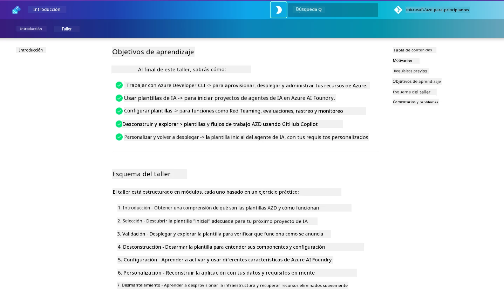

<div align="center">
  <div style="background: linear-gradient(135deg, #0078d4, #106ebe); border-radius: 10px; padding: 20px; margin: 20px 0; box-shadow: 0 4px 15px rgba(0, 120, 212, 0.3); border: 2px solid #005a9e;">
    <h2 style="color: white; margin: 0; font-size: 24px; text-shadow: 1px 1px 2px rgba(0,0,0,0.3);">
      🎯 AZD para desarrolladores de IA - Taller
    </h2>
    <p style="color: white; margin: 10px 0 0 0; font-size: 16px; text-shadow: 1px 1px 2px rgba(0,0,0,0.3);">
      <strong>Un taller práctico para construir aplicaciones de IA con Azure Developer CLI.</strong><br>
      Completa 7 módulos para dominar las plantillas AZD y los flujos de trabajo de implementación de IA.
    </p>
    <div style="margin-top: 15px;">
      <span style="background: rgba(255,255,255,0.2); padding: 5px 10px; border-radius: 15px; color: white; font-size: 14px;">
        📅 Última actualización: marzo de 2026
      </span>
    </div>
  </div>
</div>

# AZD for AI Developers Workshop

Bienvenido al taller práctico para aprender Azure Developer CLI (AZD) con un enfoque en la implementación de aplicaciones de IA. Este taller te ayuda a obtener una comprensión aplicada de las plantillas AZD en 3 pasos:

1. **Descubrimiento** - encuentra la plantilla que es adecuada para ti.
1. **Implementación** - implementa y valida que funcione
1. **Personalización** - modifica e itera para hacerlo tuyo!

A lo largo de este taller, también se te presentarán herramientas y flujos de trabajo centrales para desarrolladores, para ayudarte a optimizar tu recorrido de desarrollo de extremo a extremo.

<br/>

## Guía basada en el navegador

Las lecciones del taller están en Markdown. Puedes navegarlas directamente en GitHub - o iniciar una vista previa en el navegador como se muestra en la captura de pantalla a continuación.



Para usar esta opción, haz un fork del repositorio en tu perfil y lanza GitHub Codespaces. Una vez que el terminal de VS Code esté activo, escribe este comando:

This browser preview works in GitHub Codespaces, dev containers, or a local clone with Python and MkDocs installed.

```bash title="" linenums="0"
mkdocs serve > /dev/null 2>&1 &
```

En unos segundos verás un cuadro de diálogo emergente. Selecciona la opción `Open in browser`. La guía basada en la web se abrirá ahora en una nueva pestaña del navegador. Algunos beneficios de esta vista previa:

1. **Búsqueda integrada** - encuentra palabras clave o lecciones rápidamente.
1. **Icono de copiar** - pasa el cursor sobre los bloques de código para ver esta opción
1. **Alternar tema** - cambia entre temas oscuro y claro
1. **Obtén ayuda** - ¡haz clic en el ícono de Discord en el pie de página para unirte!

<br/>

## Descripción general del taller

**Duración:** 3-4 horas  
**Nivel:** Principiante a Intermedio  
**Requisitos previos:** Familiaridad con Azure, conceptos de IA, VS Code y herramientas de línea de comandos.

Este es un taller práctico donde aprendes haciendo. Una vez que hayas completado los ejercicios, recomendamos revisar el plan de estudios AZD For Beginners para continuar tu aprendizaje en prácticas recomendadas de Seguridad y Productividad.

| Time| Module  | Objective |
|:---|:---|:---|
| 15 mins | [Introduction](docs/instructions/0-Introduction.md) | Set the stage, understand the goals |
| 30 mins | [Select AI Template](docs/instructions/1-Select-AI-Template.md) | Explore options and pick starter | 
| 30 mins | [Validate AI Template](docs/instructions/2-Validate-AI-Template.md) | Deploy default solution to Azure |
| 30 mins | [Deconstruct AI Template](docs/instructions/3-Deconstruct-AI-Template.md) | Explore structure and configuration |
| 30 mins | [Configure AI Template](docs/instructions/4-Configure-AI-Template.md) | Activate and try available features |
| 30 mins | [Customize AI Template](docs/instructions/5-Customize-AI-Template.md) | Adapt the template to your needs |
| 30 mins | [Teardown Infrastructure](docs/instructions/6-Teardown-Infrastructure.md) | Cleanup and release resources |
| 15 mins | [Wrap-Up & Next Steps](docs/instructions/7-Wrap-up.md) | Learning resources, Workshop challenge |

<br/>

## Lo que aprenderás

Piensa en la plantilla AZD como un sandbox de aprendizaje para explorar varias capacidades y herramientas para el desarrollo de extremo a extremo en Microsoft Foundry. Al final de este taller, deberías tener una sensación intuitiva de varias herramientas y conceptos en este contexto.

| Concept  | Objective |
|:---|:---|
| **Azure Developer CLI** | Understand tool commands and workflows|
| **AZD Templates**| Understand project structure and config|
| **Azure AI Agent**| Provision & deploy Microsoft Foundry project  |
| **Azure AI Search**| Enable context engineering with agents |
| **Observability**| Explore tracing, monitoring and evaluations |
| **Red Teaming**| Explore adversarial testing and mitigations |

<br/>

## Estructura del taller

El taller está estructurado para llevarte en un recorrido desde el descubrimiento de plantillas, hasta la implementación, deconstrucción y personalización, utilizando la plantilla oficial [Getting Started with AI Agents](https://github.com/Azure-Samples/get-started-with-ai-agents) como base.

### [Módulo 1: Select AI Template](docs/instructions/1-Select-AI-Template.md) (30 mins)

- ¿Qué son las plantillas de IA?
- ¿Dónde puedo encontrar plantillas de IA?
- ¿Cómo puedo comenzar a construir agentes de IA?
- **Lab**: Inicio rápido en Codespaces o en un contenedor de desarrollo

### [Módulo 2: Validate AI Template](docs/instructions/2-Validate-AI-Template.md) (30 mins)

- ¿Cuál es la arquitectura de la plantilla de IA?
- ¿Cuál es el flujo de trabajo de desarrollo con AZD?
- ¿Cómo puedo obtener ayuda con el desarrollo con AZD?
- **Lab**: Implementar y validar la plantilla de agentes de IA

### [Módulo 3: Deconstruct AI Template](docs/instructions/3-Deconstruct-AI-Template.md) (30 mins)

- Explora tu entorno en `.azure/` 
- Explora tu configuración de recursos en `infra/` 
- Explora tu configuración de AZD en `azure.yaml`s
- **Lab**: Modificar variables de entorno y volver a implementar

### [Módulo 4: Configure AI Template](docs/instructions/4-Configure-AI-Template.md) (30 mins)
- Explorar: Retrieval Augmented Generation
- Explorar: Evaluación de agentes y Red Teaming
- Explorar: Trazabilidad y supervisión
- **Lab**: Explorar Agente de IA + Observabilidad 

### [Módulo 5: Customize AI Template](docs/instructions/5-Customize-AI-Template.md) (30 mins)
- Definir: PRD con requisitos de escenario
- Configurar: Variables de entorno para AZD
- Implementar: Hooks de ciclo de vida para tareas adicionales
- **Lab**: Personalizar la plantilla para mi escenario

### [Módulo 6: Teardown Infrastructure](docs/instructions/6-Teardown-Infrastructure.md) (30 mins)
- Recap: ¿Qué son las plantillas AZD?
- Recap: ¿Por qué usar Azure Developer CLI?
- Próximos pasos: ¡Prueba una plantilla diferente!
- **Lab**: Desaprovisionar la infraestructura y limpiar

<br/>

## Desafío del taller

¿Quieres desafiarte a hacer más? Aquí hay algunas sugerencias de proyectos - ¡o comparte tus ideas con nosotros!

| Project | Description |
|:---|:---|
|1. **Deconstruct A Complex AI Template** | Usa el flujo de trabajo y las herramientas que describimos y ve si puedes implementar, validar y personalizar una plantilla de solución de IA diferente. _¿Qué aprendiste?_|
|2. **Customize With Your Scenario**  | Intenta redactar un PRD (Documento de Requisitos del Producto) para un escenario diferente. Luego usa GitHub Copilot en tu repositorio de plantillas en Agent Model - y pídele que genere un flujo de trabajo de personalización para ti. _¿Qué aprendiste? ¿Cómo podrías mejorar estas sugerencias?_|
| | |

## ¿Tienes comentarios?

1. Publica un issue en este repositorio - márcalo con la etiqueta `Workshop` para mayor comodidad.
1. ¡Únete al Discord de Microsoft Foundry - conecta con tus pares!


| | | 
|:---|:---|
| **📚 Course Home**| [AZD For Beginners](../README.md)|
| **📖 Documentation** | [Get started with AI templates](https://learn.microsoft.com/en-us/azure/ai-foundry/how-to/develop/ai-template-get-started)|
| **🛠️AI Templates** | [Microsoft Foundry Templates](https://ai.azure.com/templates) |
|**🚀 Next Steps** | [Begin Workshop](#descripción-general-del-taller) |
| | |

<br/>

---

**Navigation:** [Main Course](../README.md) | [Introduction](docs/instructions/0-Introduction.md) | [Module 1: Select Template](docs/instructions/1-Select-AI-Template.md)

**¿Listo para comenzar a crear aplicaciones de IA con AZD?**

[Begin Workshop: Introduction →](docs/instructions/0-Introduction.md)

---

<!-- CO-OP TRANSLATOR DISCLAIMER START -->
**Descargo de responsabilidad**:
Este documento ha sido traducido utilizando el servicio de traducción por IA [Co-op Translator](https://github.com/Azure/co-op-translator). Aunque nos esforzamos por la exactitud, tenga en cuenta que las traducciones automatizadas pueden contener errores o inexactitudes. El documento original en su idioma nativo debe considerarse la fuente autorizada. Para información crítica, se recomienda una traducción profesional realizada por traductores humanos. No nos hacemos responsables de ningún malentendido o interpretación errónea que surja del uso de esta traducción.
<!-- CO-OP TRANSLATOR DISCLAIMER END -->