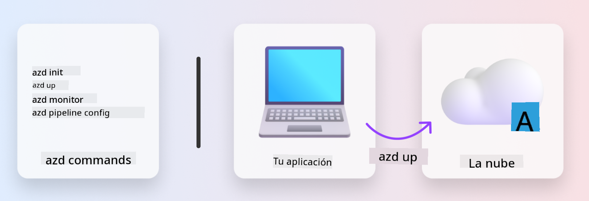
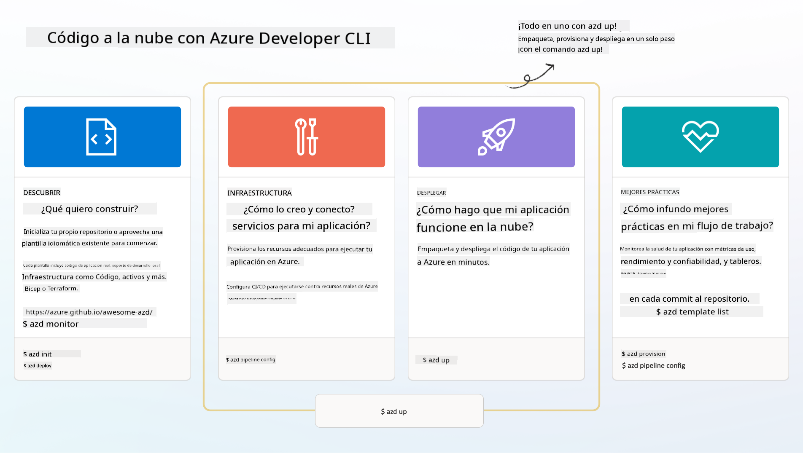

<!--
CO_OP_TRANSLATOR_METADATA:
{
  "original_hash": "06d6207eff634aefcaa41739490a5324",
  "translation_date": "2025-09-24T10:00:17+00:00",
  "source_file": "workshop/docs/instructions/1-Select-AI-Template.md",
  "language_code": "es"
}
-->
# 1. Selecciona una Plantilla

!!! tip "AL FINAL DE ESTE MÓDULO PODRÁS"

    - [ ] Describir qué son las plantillas de AZD
    - [ ] Descubrir y usar plantillas de AZD para IA
    - [ ] Comenzar con la plantilla de Agentes de IA
    - [ ] **Laboratorio 1:** Inicio rápido de AZD con GitHub Codespaces

---

## 1. Una Analogía de Constructor

Construir una aplicación moderna de IA lista para empresas _desde cero_ puede ser abrumador. Es un poco como construir tu nueva casa por tu cuenta, ladrillo por ladrillo. ¡Sí, se puede hacer! Pero no es la forma más efectiva de obtener el resultado deseado.

En cambio, a menudo comenzamos con un _plano de diseño_ existente y trabajamos con un arquitecto para personalizarlo según nuestros requisitos personales. Y esa es exactamente la estrategia que debemos adoptar al construir aplicaciones inteligentes. Primero, encuentra una buena arquitectura de diseño que se ajuste a tu problema. Luego, trabaja con un arquitecto de soluciones para personalizar y desarrollar la solución para tu escenario específico.

Pero, ¿dónde podemos encontrar estos planos de diseño? ¿Y cómo encontramos un arquitecto dispuesto a enseñarnos cómo personalizar y desplegar estos planos por nuestra cuenta? En este taller, respondemos esas preguntas presentándote tres tecnologías:

1. [Azure Developer CLI](https://aka.ms/azd) - una herramienta de código abierto que acelera el camino del desarrollador desde el desarrollo local (construcción) hasta el despliegue en la nube (envío).
1. [Plantillas de Azure AI Foundry](https://ai.azure.com/templates) - repositorios estandarizados de código abierto que contienen código de ejemplo, infraestructura y archivos de configuración para desplegar una arquitectura de solución de IA.
1. [GitHub Copilot Agent Mode](https://code.visualstudio.com/docs/copilot/chat/chat-agent-mode) - un agente de codificación basado en conocimientos de Azure que puede guiarnos para navegar por la base de código y realizar cambios utilizando lenguaje natural.

Con estas herramientas en mano, ahora podemos _descubrir_ la plantilla adecuada, _desplegarla_ para validar que funciona y _personalizarla_ para adaptarla a nuestros escenarios específicos. Vamos a profundizar y aprender cómo funcionan.

---

## 2. Azure Developer CLI

El [Azure Developer CLI](https://learn.microsoft.com/en-us/azure/developer/azure-developer-cli/) (o `azd`) es una herramienta de línea de comandos de código abierto que puede acelerar tu viaje de código a la nube con un conjunto de comandos amigables para desarrolladores que funcionan de manera consistente en tu entorno IDE (desarrollo) y CI/CD (devops).

Con `azd`, tu proceso de despliegue puede ser tan simple como:

- `azd init` - Inicializa un nuevo proyecto de IA a partir de una plantilla existente de AZD.
- `azd up` - Provisiona infraestructura y despliega tu aplicación en un solo paso.
- `azd monitor` - Obtén monitoreo y diagnósticos en tiempo real para tu aplicación desplegada.
- `azd pipeline config` - Configura pipelines de CI/CD para automatizar el despliegue en Azure.

**🎯 | EJERCICIO**: <br/> Explora la herramienta de línea de comandos `azd` en tu entorno de GitHub Codespaces ahora. Comienza escribiendo este comando para ver lo que la herramienta puede hacer:

```bash title="" linenums="0"
azd help
```



---

## 3. La Plantilla AZD

Para que `azd` logre esto, necesita saber qué infraestructura provisionar, qué configuraciones aplicar y qué aplicación desplegar. Aquí es donde entran las [plantillas de AZD](https://learn.microsoft.com/en-us/azure/developer/azure-developer-cli/azd-templates?tabs=csharp).

Las plantillas de AZD son repositorios de código abierto que combinan código de ejemplo con archivos de infraestructura y configuración necesarios para desplegar la arquitectura de solución.
Al usar un enfoque de _Infraestructura como Código_ (IaC), permiten que las definiciones de recursos de la plantilla y las configuraciones sean controladas por versiones (al igual que el código fuente de la aplicación), creando flujos de trabajo reutilizables y consistentes entre los usuarios de ese proyecto.

Al crear o reutilizar una plantilla de AZD para _tu_ escenario, considera estas preguntas:

1. ¿Qué estás construyendo? → ¿Hay una plantilla que tenga código inicial para ese escenario?
1. ¿Cómo está arquitecturada tu solución? → ¿Hay una plantilla que tenga los recursos necesarios?
1. ¿Cómo se despliega tu solución? → Piensa en `azd deploy` con hooks de pre/post-procesamiento.
1. ¿Cómo puedes optimizarla aún más? → Piensa en monitoreo integrado y pipelines de automatización.

**🎯 | EJERCICIO**: <br/> 
Visita la galería [Awesome AZD](https://azure.github.io/awesome-azd/) y usa los filtros para explorar las más de 250 plantillas disponibles actualmente. Ve si puedes encontrar una que se alinee con los requisitos de _tu_ escenario.



---

## 4. Plantillas de Aplicaciones de IA

---

