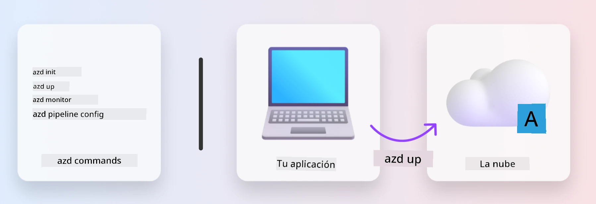
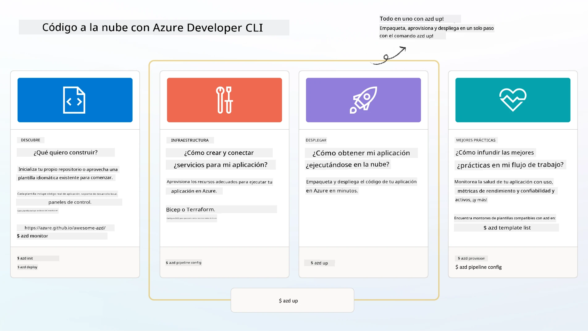

# 1. Seleccionar una plantilla

!!! tip "AL FINAL DE ESTE MÓDULO PODRÁS"

    - [ ] Describir qué son las plantillas AZD
    - [ ] Descubrir y usar plantillas AZD para IA
    - [ ] Empezar con la plantilla de Agentes de IA
    - [ ] **Lab 1:** Inicio rápido de AZD en Codespaces o en un contenedor de desarrollo

---

## 1. Una analogía del constructor

Construir una aplicación de IA moderna y lista para la empresa _desde cero_ puede ser desalentador. Es un poco como construir tu nueva casa por tu cuenta, ladrillo a ladrillo. ¡Sí, se puede hacer! ¡Pero no es la manera más eficaz de obtener el resultado deseado! 

En su lugar, a menudo comenzamos con un _plano de diseño_ existente y trabajamos con un arquitecto para personalizarlo según nuestros requisitos personales. Y ese es exactamente el enfoque a seguir al crear aplicaciones inteligentes. Primero, encuentra una buena arquitectura de diseño que se adapte a tu ámbito del problema. Luego trabaja con un arquitecto de soluciones para personalizar y desarrollar la solución para tu escenario específico.

¿Pero dónde podemos encontrar estos planos de diseño? ¿Y cómo encontramos un arquitecto dispuesto a enseñarnos a personalizar e implementar estos planos por nuestra cuenta? En este taller respondemos a esas preguntas presentándote tres tecnologías:

1. [Azure Developer CLI](https://aka.ms/azd) - una herramienta de código abierto que acelera el camino del desarrollador desde el desarrollo local (build) hasta el despliegue en la nube (ship).
1. [Microsoft Foundry Templates](https://ai.azure.com/templates) - repositorios estandarizados y de código abierto que contienen código de ejemplo, infraestructura y archivos de configuración para desplegar una arquitectura de solución de IA.
1. [GitHub Copilot Agent Mode](https://code.visualstudio.com/docs/copilot/chat/chat-agent-mode) - un agente de codificación fundamentado en el conocimiento de Azure, que puede guiarnos para navegar la base de código y realizar cambios usando lenguaje natural.

Con estas herramientas en mano, ahora podemos _descubrir_ la plantilla adecuada, _desplegarla_ para validar que funciona y _personalizarla_ para adaptarla a nuestros escenarios específicos. Vamos a profundizar y aprender cómo funcionan.


---

## 2. Azure Developer CLI

The [Azure Developer CLI](https://learn.microsoft.com/en-us/azure/developer/azure-developer-cli/) (or `azd`) es una herramienta de línea de comandos de código abierto que puede acelerar tu viaje de código a la nube con un conjunto de comandos amigables para desarrolladores que funcionan de manera coherente en tu IDE (desarrollo) y en entornos de CI/CD (devops).

Con `azd`, tu viaje de despliegue puede ser tan simple como:

- `azd init` - Inicializa un nuevo proyecto de IA a partir de una plantilla AZD existente.
- `azd up` - Proporciona infraestructura y despliega tu aplicación en un solo paso.
- `azd monitor` - Obtén monitorización y diagnósticos en tiempo real para tu aplicación desplegada.
- `azd pipeline config` - Configura pipelines de CI/CD para automatizar el despliegue en Azure.

**🎯 | EJERCICIO**: <br/> Explora la herramienta de línea de comandos `azd` en tu entorno actual del taller ahora. Esto puede ser GitHub Codespaces, un contenedor de desarrollo o un clon local con los requisitos previos instalados. Comienza escribiendo este comando para ver lo que la herramienta puede hacer:

```bash title="" linenums="0"
azd help
```



---

## 3. La plantilla AZD

Para que `azd` logre esto, necesita saber la infraestructura que debe aprovisionar, los ajustes de configuración que debe aplicar y la aplicación que debe desplegar. Aquí es donde entran las [plantillas AZD](https://learn.microsoft.com/en-us/azure/developer/azure-developer-cli/azd-templates?tabs=csharp). 

Las plantillas AZD son repositorios de código abierto que combinan código de ejemplo con archivos de infraestructura y configuración necesarios para desplegar la arquitectura de la solución.
Al usar un enfoque de _Infrastructure-as-Code_ (IaC), permiten que las definiciones de recursos de la plantilla y los ajustes de configuración se controlen por versiones (al igual que el código fuente de la aplicación), creando flujos de trabajo reutilizables y coherentes entre los usuarios de ese proyecto.

Al crear o reutilizar una plantilla AZD para _tu_ escenario, considera estas preguntas:

1. ¿Qué estás construyendo? → ¿Existe una plantilla que tenga código inicial para ese escenario?
1. ¿Cómo está diseñada tu solución? → ¿Existe una plantilla que tenga los recursos necesarios?
1. ¿Cómo se despliega tu solución? → ¡Piensa en `azd deploy` con hooks de pre/post-procesamiento!
1. ¿Cómo puedes optimizarla aún más? → ¡Piensa en monitorización integrada y pipelines de automatización!

**🎯 | EJERCICIO**: <br/> 
Visita la galería [Awesome AZD](https://azure.github.io/awesome-azd/) y usa los filtros para explorar las más de 250 plantillas disponibles actualmente. Comprueba si puedes encontrar una que se alinee con los requisitos de _tu_ escenario.



---

## 4. Plantillas de aplicaciones de IA

Para aplicaciones con capacidades de IA, Microsoft proporciona plantillas especializadas que incluyen **Microsoft Foundry** y **Foundry Agents**. Estas plantillas aceleran tu camino para construir aplicaciones inteligentes listas para producción.

### Plantillas de Microsoft Foundry y Foundry Agents

Selecciona una plantilla a continuación para desplegar. Cada plantilla está disponible en [Awesome AZD](https://azure.github.io/awesome-azd/) y puede inicializarse con un solo comando.

| Plantilla | Descripción | Deploy Command |
|----------|-------------|----------------|
| **[AI Chat with RAG](https://azure.github.io/awesome-azd/?tags=ai&tags=rag)** | Aplicación de chat con Generación Aumentada por Recuperación usando Microsoft Foundry | `azd init -t azure-samples/azure-search-openai-demo` |
| **[Foundry Agent Service Starter](https://azure.github.io/awesome-azd/?tags=ai&tags=agents)** | Construye agentes de IA con Foundry Agents para ejecución autónoma de tareas | `azd init -t azure-samples/foundry-agent-service-starter` |
| **[Multi-Agent Orchestration](https://azure.github.io/awesome-azd/?tags=ai&tags=agents)** | Coordina múltiples Foundry Agents para flujos de trabajo complejos | `azd init -t azure-samples/multi-agent-orchestration` |
| **[AI Document Intelligence](https://azure.github.io/awesome-azd/?tags=ai&tags=document)** | Extrae y analiza documentos con modelos de Microsoft Foundry | `azd init -t azure-samples/ai-document-processing` |
| **[Conversational AI Bot](https://azure.github.io/awesome-azd/?tags=ai&tags=bot)** | Construye chatbots inteligentes con integración de Microsoft Foundry | `azd init -t azure-samples/ai-chat-protocol` |
| **[AI Image Generation](https://azure.github.io/awesome-azd/?tags=ai&tags=dalle)** | Genera imágenes usando DALL-E a través de Microsoft Foundry | `azd init -t azure-samples/ai-image-generation` |
| **[Semantic Kernel Agent](https://azure.github.io/awesome-azd/?tags=ai&tags=semantic-kernel)** | Agentes de IA usando Semantic Kernel con Foundry Agents | `azd init -t azure-samples/semantic-kernel-agent` |
| **[AutoGen Multi-Agent](https://azure.github.io/awesome-azd/?tags=ai&tags=autogen)** | Sistemas multi-agente usando el framework AutoGen | `azd init -t azure-samples/autogen-multi-agent` |

### Inicio rápido

1. **Navega por las plantillas**: Visita [https://azure.github.io/awesome-azd/](https://azure.github.io/awesome-azd/) y filtra por `AI`, `Agents` o `Microsoft Foundry`
2. **Selecciona tu plantilla**: Elige una que coincida con tu caso de uso
3. **Inicializa**: Ejecuta el comando `azd init` para la plantilla elegida
4. **Despliega**: Ejecuta `azd up` para aprovisionar y desplegar

**🎯 | EJERCICIO**: <br/>
Selecciona una de las plantillas anteriores según tu escenario:

- **¿Construyendo un chatbot?** → Comienza con **AI Chat with RAG** o **Conversational AI Bot**
- **¿Necesitas agentes autónomos?** → Prueba **Foundry Agent Service Starter** o **Multi-Agent Orchestration**
- **¿Procesando documentos?** → Usa **AI Document Intelligence**
- **¿Quieres asistencia de codificación con IA?** → Explora **Semantic Kernel Agent** o **AutoGen Multi-Agent**

```bash title="Example: Deploy the AI Chat with RAG template" linenums="0"
azd init -t azure-samples/azure-search-openai-demo
azd up
```

!!! info "Explora más plantillas"
    La [Awesome AZD Gallery](https://azure.github.io/awesome-azd/) contiene más de 250 plantillas. Usa los filtros para encontrar plantillas que coincidan con tus requisitos específicos de lenguaje, framework y servicios de Azure.

---

<!-- CO-OP TRANSLATOR DISCLAIMER START -->
**Descargo de responsabilidad**:
Este documento ha sido traducido utilizando el servicio de traducción automática [Co-op Translator](https://github.com/Azure/co-op-translator). Aunque nos esforzamos por la exactitud, tenga en cuenta que las traducciones automatizadas pueden contener errores o imprecisiones. El documento original en su idioma nativo debe considerarse la fuente autorizada. Para información crítica, se recomienda una traducción profesional realizada por traductores humanos. No nos hacemos responsables de ningún malentendido o interpretación errónea que surja del uso de esta traducción.
<!-- CO-OP TRANSLATOR DISCLAIMER END -->