<!--
CO_OP_TRANSLATOR_METADATA:
{
  "original_hash": "7816c6ec50c694c331e7c6092371be4d",
  "translation_date": "2025-09-24T10:06:41+00:00",
  "source_file": "workshop/docs/instructions/2-Validate-AI-Template.md",
  "language_code": "es"
}
-->
# 2. Validar una Plantilla

!!! tip "AL FINAL DE ESTE MÓDULO PODRÁS"

    - [ ] Analizar la Arquitectura de Soluciones de IA
    - [ ] Comprender el Flujo de Despliegue de AZD
    - [ ] Usar GitHub Copilot para obtener ayuda sobre el uso de AZD
    - [ ] **Laboratorio 2:** Desplegar y Validar la plantilla de Agentes de IA

---

## 1. Introducción

El [CLI para Desarrolladores de Azure](https://learn.microsoft.com/en-us/azure/developer/azure-developer-cli/) o `azd` es una herramienta de línea de comandos de código abierto que simplifica el flujo de trabajo del desarrollador al construir y desplegar aplicaciones en Azure.

[Plantillas AZD](https://learn.microsoft.com/azure/developer/azure-developer-cli/azd-templates) son repositorios estandarizados que incluyen código de aplicación de ejemplo, activos de _infraestructura como código_ y archivos de configuración de `azd` para una arquitectura de solución cohesiva. La provisión de infraestructura se reduce a un simple comando `azd provision`, mientras que el uso de `azd up` permite provisionar infraestructura **y** desplegar tu aplicación de una sola vez.

Como resultado, iniciar el proceso de desarrollo de tu aplicación puede ser tan sencillo como encontrar la _Plantilla de Inicio AZD_ adecuada que se acerque a tus necesidades de aplicación e infraestructura, y luego personalizar el repositorio para adaptarlo a tus requisitos específicos.

Antes de comenzar, asegúrate de tener instalado el CLI para Desarrolladores de Azure.

1. Abre un terminal de VS Code y escribe este comando:

      ```bash title="" linenums="0"
      azd version
      ```

1. Deberías ver algo como esto:

      ```bash title="" linenums="0"
      azd version 1.19.0 (commit b3d68cea969b2bfbaa7b7fa289424428edb93e97)
      ```

**Ahora estás listo para seleccionar y desplegar una plantilla con azd**

---

## 2. Selección de Plantilla

La plataforma Azure AI Foundry incluye un [conjunto de plantillas AZD recomendadas](https://learn.microsoft.com/en-us/azure/ai-foundry/how-to/develop/ai-template-get-started) que cubren escenarios populares de soluciones como _automatización de flujos de trabajo multi-agente_ y _procesamiento de contenido multimodal_. También puedes descubrir estas plantillas visitando el portal de Azure AI Foundry.

1. Visita [https://ai.azure.com/templates](https://ai.azure.com/templates)
1. Inicia sesión en el portal de Azure AI Foundry cuando se te solicite - verás algo como esto.

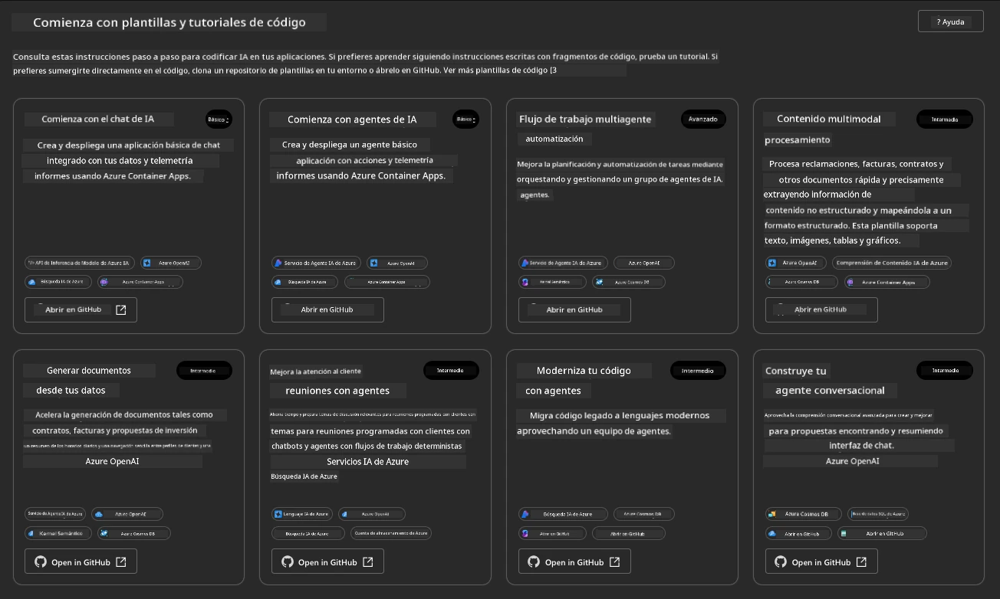

Las opciones **Básicas** son tus plantillas iniciales:

1. [ ] [Comienza con AI Chat](https://github.com/Azure-Samples/get-started-with-ai-chat) que despliega una aplicación de chat básica _con tus datos_ en Azure Container Apps. Úsalo para explorar un escenario básico de chatbot de IA.
1. [X] [Comienza con Agentes de IA](https://github.com/Azure-Samples/get-started-with-ai-agents) que también despliega un Agente de IA estándar (con el Servicio de Agentes de IA de Azure). Úsalo para familiarizarte con soluciones de IA basadas en agentes que involucran herramientas y modelos.

Visita el segundo enlace en una nueva pestaña del navegador (o haz clic en `Abrir en GitHub` en la tarjeta relacionada). Deberías ver el repositorio para esta plantilla AZD. Tómate un minuto para explorar el README. La arquitectura de la aplicación se ve así:


---

## 3. Activación de la Plantilla

Intentemos desplegar esta plantilla y asegurarnos de que es válida. Seguiremos las pautas de la sección [Comenzando](https://github.com/Azure-Samples/get-started-with-ai-agents?tab=readme-ov-file#getting-started).

1. Haz clic en [este enlace](https://github.com/codespaces/new/Azure-Samples/get-started-with-ai-agents) - confirma la acción predeterminada para `Crear codespace`
1. Esto abrirá una nueva pestaña del navegador - espera a que la sesión de GitHub Codespaces termine de cargar
1. Abre el terminal de VS Code en Codespaces - escribe el siguiente comando:

   ```bash title="" linenums="0"
   azd up
   ```

Completa los pasos del flujo de trabajo que esto activará:

1. Se te pedirá que inicies sesión en Azure - sigue las instrucciones para autenticarte
1. Ingresa un nombre único para el entorno - por ejemplo, yo usé `nitya-mshack-azd`
1. Esto creará una carpeta `.azure/` - verás una subcarpeta con el nombre del entorno
1. Se te pedirá que selecciones un nombre de suscripción - selecciona la predeterminada
1. Se te pedirá una ubicación - usa `East US 2`

Ahora, espera a que la provisión se complete. **Esto toma de 10 a 15 minutos**

1. Cuando termine, tu consola mostrará un mensaje de ÉXITO como este:
      ```bash title="" linenums="0"
      SUCCESS: Your up workflow to provision and deploy to Azure completed in 10 minutes 17 seconds.
      ```
1. Tu Portal de Azure ahora tendrá un grupo de recursos provisionado con ese nombre de entorno:

      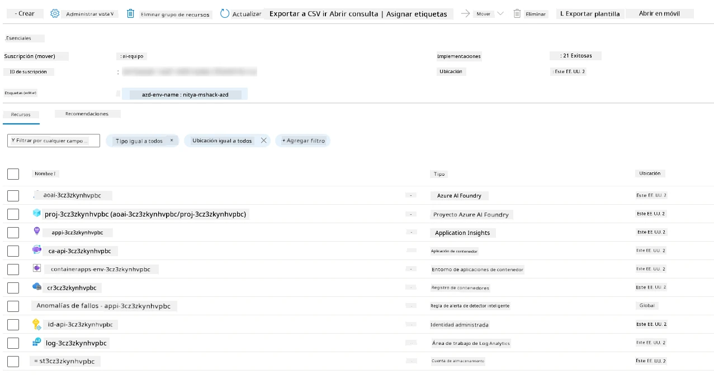

1. **Ahora estás listo para validar la infraestructura y la aplicación desplegadas**.

---

## 4. Validación de la Plantilla

1. Visita la página [Grupos de Recursos](https://portal.azure.com/#browse/resourcegroups) en el Portal de Azure - inicia sesión cuando se te solicite
1. Haz clic en el grupo de recursos con el nombre de tu entorno - verás la página anterior

      - Haz clic en el recurso de Azure Container Apps
      - Haz clic en la URL de la aplicación en la sección _Esenciales_ (arriba a la derecha)

1. Deberías ver una interfaz de usuario alojada como esta:

   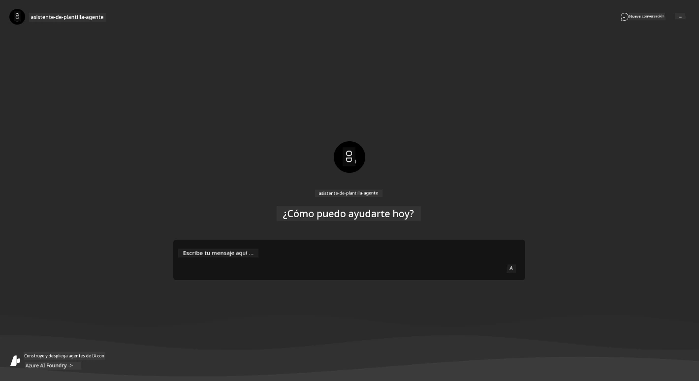

1. Intenta hacer un par de [preguntas de ejemplo](https://github.com/Azure-Samples/get-started-with-ai-agents/blob/main/docs/sample_questions.md)

      1. Pregunta: ```¿Cuál es la capital de Francia?``` 
      1. Pregunta: ```¿Cuál es la mejor tienda de campaña por menos de $200 para dos personas y qué características incluye?```

1. Deberías obtener respuestas similares a las que se muestran a continuación. _¿Pero cómo funciona esto?_ 

      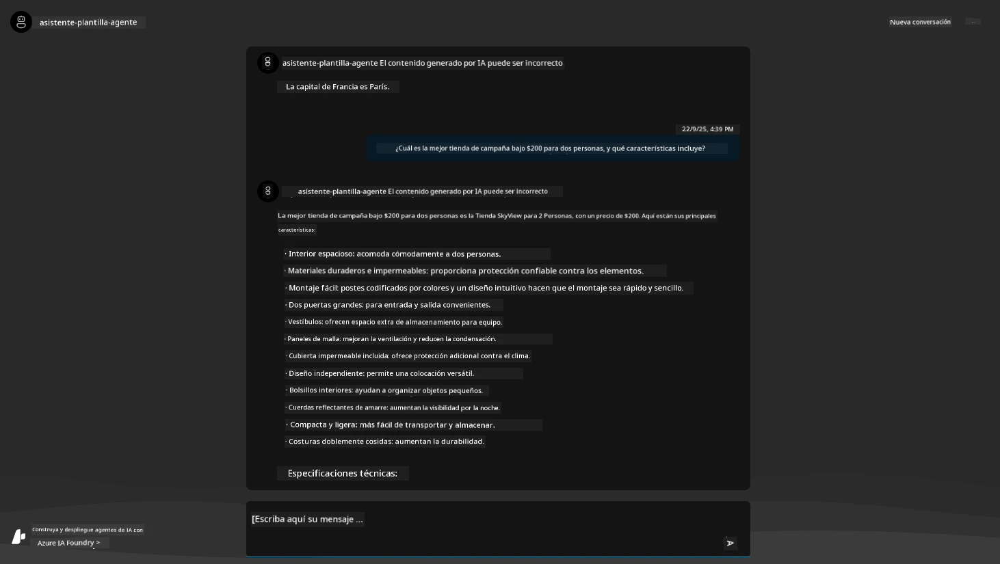

---

## 5. Validación del Agente

Azure Container App despliega un endpoint que se conecta al Agente de IA provisionado en el proyecto Azure AI Foundry para esta plantilla. Veamos qué significa esto.

1. Regresa a la página _Resumen_ del Portal de Azure para tu grupo de recursos

1. Haz clic en el recurso `Azure AI Foundry` en esa lista

1. Deberías ver esto. Haz clic en el botón `Ir al Portal de Azure AI Foundry`. 
   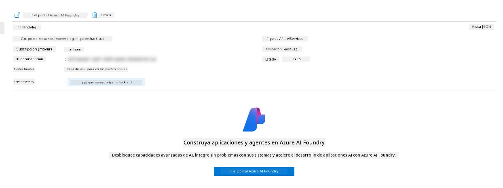

1. Deberías ver la página del Proyecto Foundry para tu aplicación de IA
   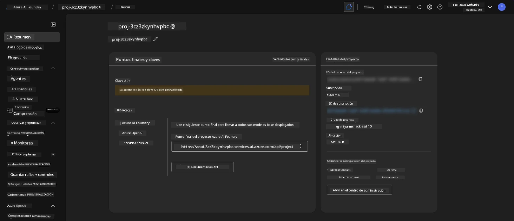

1. Haz clic en `Agentes` - verás el Agente predeterminado provisionado en tu proyecto
   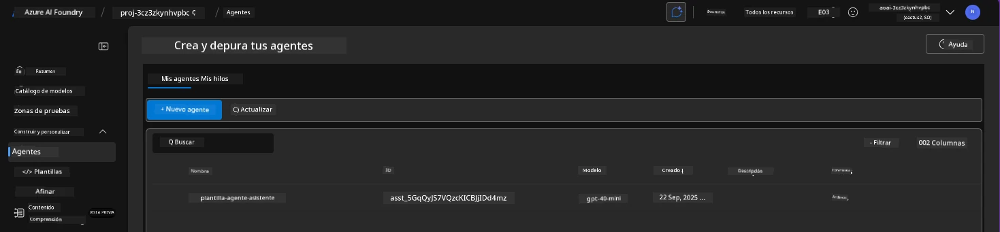

1. Selecciónalo - y verás los detalles del Agente. Nota lo siguiente:

      - El agente usa File Search por defecto (siempre)
      - El `Conocimiento` del agente indica que tiene 32 archivos cargados (para búsqueda de archivos)
      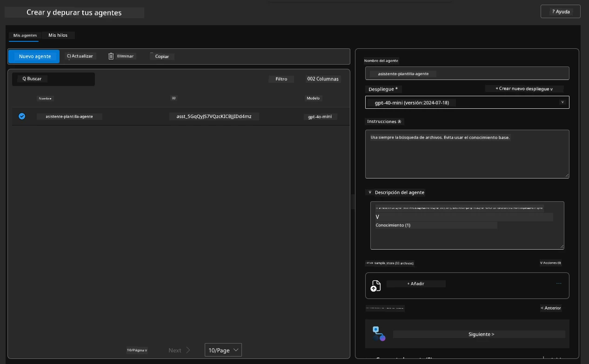

1. Busca la opción `Data+indexes` en el menú de la izquierda y haz clic para ver los detalles. 

      - Deberías ver los 32 archivos de datos cargados para el conocimiento.
      - Estos corresponderán a los 12 archivos de clientes y 20 archivos de productos bajo `src/files` 
      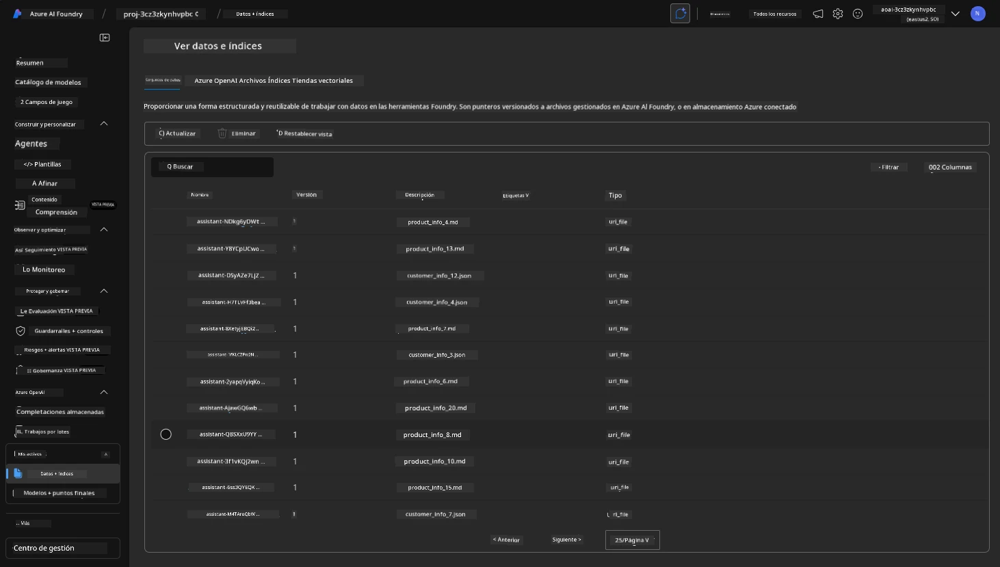

**¡Validaste la operación del Agente!** 

1. Las respuestas del agente están fundamentadas en el conocimiento de esos archivos. 
1. Ahora puedes hacer preguntas relacionadas con esos datos y obtener respuestas fundamentadas.
1. Ejemplo: `customer_info_10.json` describe las 3 compras realizadas por "Amanda Perez"

Regresa a la pestaña del navegador con el endpoint de la aplicación en Container App y pregunta: `¿Qué productos posee Amanda Perez?`. Deberías ver algo como esto:

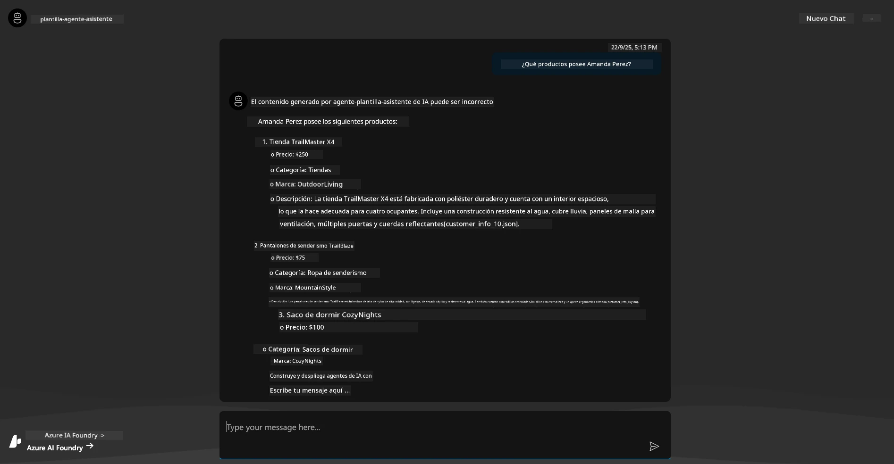

---

## 6. Área de Pruebas del Agente

Construyamos un poco más de intuición sobre las capacidades de Azure AI Foundry, probando el Agente en el Área de Pruebas de Agentes. 

1. Regresa a la página `Agentes` en Azure AI Foundry - selecciona el agente predeterminado
1. Haz clic en la opción `Probar en el Área de Pruebas` - deberías obtener una interfaz de usuario como esta
1. Haz la misma pregunta: `¿Qué productos posee Amanda Perez?`

    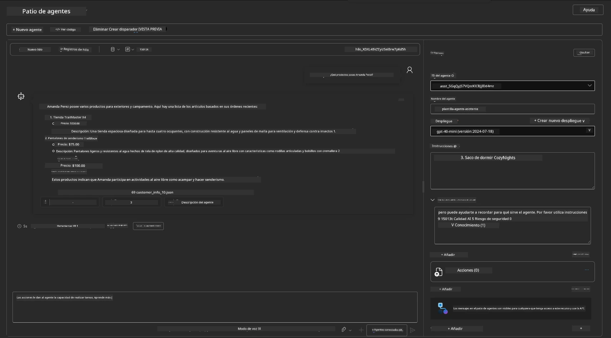

Obtienes la misma (o similar) respuesta - pero también obtienes información adicional que puedes usar para entender la calidad, el costo y el rendimiento de tu aplicación basada en agentes. Por ejemplo:

1. Nota que la respuesta cita los archivos de datos utilizados para "fundamentar" la respuesta
1. Pasa el cursor sobre cualquiera de estas etiquetas de archivo - ¿los datos coinciden con tu consulta y la respuesta mostrada?

También ves una fila de _estadísticas_ debajo de la respuesta. 

1. Pasa el cursor sobre cualquier métrica - por ejemplo, Seguridad. Ves algo como esto
1. ¿La calificación evaluada coincide con tu intuición sobre el nivel de seguridad de la respuesta?

      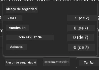

---x

## 7. Observabilidad Incorporada

La observabilidad trata de instrumentar tu aplicación para generar datos que puedan ser utilizados para entender, depurar y optimizar sus operaciones. Para tener una idea de esto:

1. Haz clic en el botón `Ver Información de Ejecución` - deberías ver esta vista. Este es un ejemplo de [trazado de Agentes](https://learn.microsoft.com/en-us/azure/ai-foundry/how-to/develop/trace-agents-sdk#view-trace-results-in-the-azure-ai-foundry-agents-playground) en acción. _También puedes obtener esta vista haciendo clic en Registros de Hilos en el menú principal_.

   - Obtén una idea de los pasos de ejecución y las herramientas utilizadas por el agente
   - Comprende el conteo total de Tokens (vs. uso de tokens de salida) para la respuesta
   - Comprende la latencia y dónde se gasta el tiempo en la ejecución

      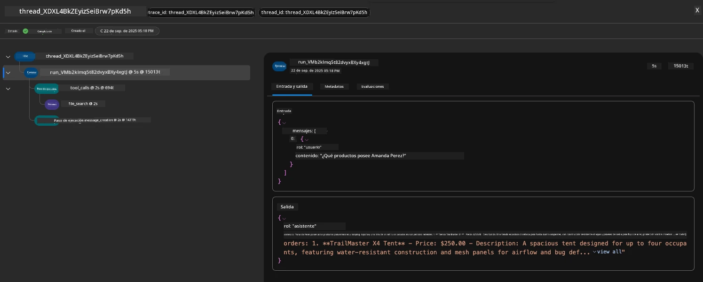

1. Haz clic en la pestaña `Metadata` para ver atributos adicionales de la ejecución, que pueden proporcionar contexto útil para depurar problemas más adelante.   

      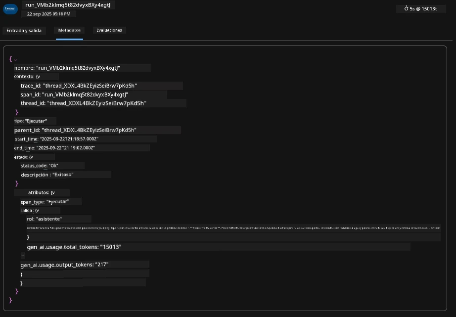

1. Haz clic en la pestaña `Evaluations` para ver las evaluaciones automáticas realizadas sobre la respuesta del agente. Estas incluyen evaluaciones de seguridad (por ejemplo, Autolesión) y evaluaciones específicas del agente (por ejemplo, Resolución de intención, Adherencia a tareas).

      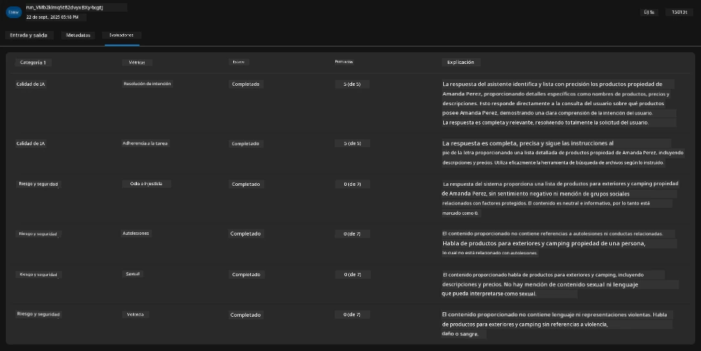

1. Por último, pero no menos importante, haz clic en la pestaña `Monitoring` en el menú lateral.

      - Selecciona la pestaña `Uso de recursos` en la página mostrada - y visualiza las métricas.
      - Rastrea el uso de la aplicación en términos de costos (tokens) y carga (solicitudes).
      - Rastrea la latencia de la aplicación desde el primer byte (procesamiento de entrada) hasta el último byte (salida).

      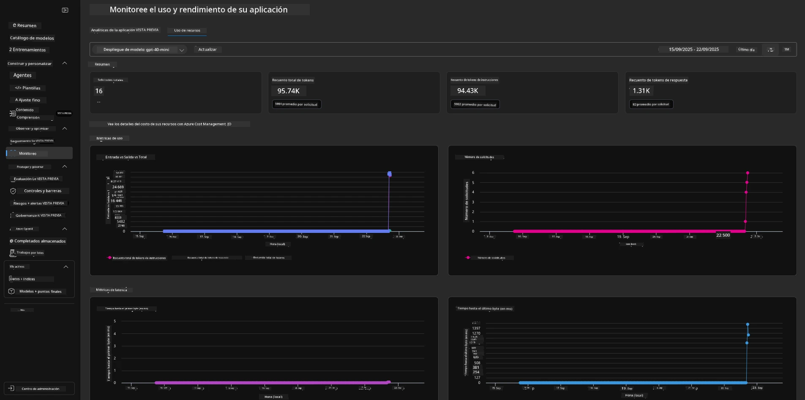

---

## 8. Variables de Entorno

Hasta ahora, hemos recorrido el despliegue en el navegador - y validado que nuestra infraestructura está provisionada y la aplicación está operativa. Pero para trabajar con la aplicación _orientada al código_, necesitamos configurar nuestro entorno de desarrollo local con las variables relevantes requeridas para trabajar con estos recursos. Usar `azd` lo hace fácil.

1. El CLI para Desarrolladores de Azure [usa variables de entorno](https://learn.microsoft.com/en-us/azure/developer/azure-developer-cli/manage-environment-variables?tabs=bash) para almacenar y gestionar configuraciones para los despliegues de aplicaciones.

1. Las variables de entorno se almacenan en `.azure/<env-name>/.env` - esto las limita al entorno `<env-name>` utilizado durante el despliegue y ayuda a aislar entornos entre diferentes objetivos de despliegue en el mismo repositorio.

1. Las variables de entorno se cargan automáticamente por el comando `azd` cada vez que ejecuta un comando específico (por ejemplo, `azd up`). Nota que `azd` no lee automáticamente las variables de entorno a nivel del sistema operativo (por ejemplo, configuradas en el shell) - en su lugar, usa `azd set env` y `azd get env` para transferir información dentro de scripts.

Probemos algunos comandos:

1. Obtén todas las variables de entorno configuradas para `azd` en este entorno:

      ```bash title="" linenums="0"
      azd env get-values
      ```
      
      Verás algo como:

      ```bash title="" linenums="0"
      AZURE_AI_AGENT_DEPLOYMENT_NAME="gpt-4o-mini"
      AZURE_AI_AGENT_NAME="agent-template-assistant"
      AZURE_AI_EMBED_DEPLOYMENT_NAME="text-embedding-3-small"
      AZURE_AI_EMBED_DIMENSIONS=100
      ...
      ```

1. Obtén un valor específico - por ejemplo, quiero saber si configuramos el valor `AZURE_AI_AGENT_MODEL_NAME`

      ```bash title="" linenums="0"
      azd env get-value AZURE_AI_AGENT_MODEL_NAME 
      ```
      
      Verás algo como esto - ¡no se configuró por defecto!

      ```bash title="" linenums="0"
      ERROR: key 'AZURE_AI_AGENT_MODEL_NAME' not found in the environment values
      ```

1. Configura una nueva variable de entorno para `azd`. Aquí, actualizamos el nombre del modelo del agente. _Nota: cualquier cambio realizado se reflejará inmediatamente en el archivo `.azure/<env-name>/.env`.

      ```bash title="" linenums="0"
      azd env set AZURE_AI_AGENT_MODEL_NAME gpt-4.1
      azd env set AZURE_AI_AGENT_MODEL_VERSION 2025-04-14
      azd env set AZURE_AI_AGENT_DEPLOYMENT_CAPACITY 150
      ```

      Ahora, deberíamos encontrar que el valor está configurado:

      ```bash title="" linenums="0"
      azd env get-value AZURE_AI_AGENT_MODEL_NAME 
      ```

1. Nota que algunos recursos son persistentes (por ejemplo, despliegues de modelos) y requerirán más que solo un `azd up` para forzar el redepliegue. Intentemos desmantelar el despliegue original y redeployar con las variables de entorno cambiadas.

1. **Actualizar** Si previamente habías desplegado infraestructura usando una plantilla azd - puedes _actualizar_ el estado de tus variables de entorno locales basándote en el estado actual de tu despliegue en Azure usando este comando:
      ```bash title="" linenums="0"
      azd env refresh
      ```

      Esta es una forma poderosa de _sincronizar_ variables de entorno entre dos o más entornos de desarrollo local (por ejemplo, un equipo con varios desarrolladores), permitiendo que la infraestructura desplegada sirva como la fuente de verdad para el estado de las variables de entorno. Los miembros del equipo simplemente _actualizan_ las variables para volver a estar sincronizados.

---

## 9. ¡Felicidades! 🏆

Acabas de completar un flujo de trabajo de principio a fin donde:

- [X] Seleccionaste la plantilla de AZD que querías usar
- [X] Lanzaste la plantilla con GitHub Codespaces
- [X] Desplegaste la plantilla y validaste que funciona

---

