# 2. Validar una plantilla

!!! tip "AL FINAL DE ESTE MÓDULO PODRÁS"

    - [ ] Analizar la Arquitectura de Solución AI
    - [ ] Entender el Flujo de Trabajo de Implementación AZD
    - [ ] Usar GitHub Copilot para obtener ayuda sobre el uso de AZD
    - [ ] **Laboratorio 2:** Implementar y Validar la plantilla de Agentes AI

---


## 1. Introducción

El [Azure Developer CLI](https://learn.microsoft.com/en-us/azure/developer/azure-developer-cli/) o `azd` es una herramienta de línea de comandos de código abierto que agiliza el flujo de trabajo del desarrollador al construir e implementar aplicaciones en Azure.

[Las plantillas AZD](https://learn.microsoft.com/azure/developer/azure-developer-cli/azd-templates) son repositorios estandarizados que incluyen código de aplicación de ejemplo, activos de _infraestructura como código_ y archivos de configuración `azd` para una arquitectura de solución coherente. La provisión de infraestructura se vuelve tan simple como un comando `azd provision` - mientras que usar `azd up` permite aprovisionar la infraestructura **y** desplegar tu aplicación de una sola vez!

Como resultado, iniciar tu proceso de desarrollo de aplicación puede ser tan simple como encontrar la _plantilla inicial AZD_ adecuada que se acerque a las necesidades de tu aplicación e infraestructura, para luego personalizar el repositorio según los requerimientos de tu escenario.

Antes de comenzar, asegúrate de tener instalado el Azure Developer CLI.

1. Abre un terminal en VS Code y escribe este comando:

      ```bash title="" linenums="0"
      azd version
      ```

1. Deberías ver algo como esto:

      ```bash title="" linenums="0"
      azd version 1.19.0 (commit b3d68cea969b2bfbaa7b7fa289424428edb93e97)
      ```

**Ya estás listo para seleccionar e implementar una plantilla con azd**

---

## 2. Selección de Plantilla

La plataforma Microsoft Foundry incluye un [conjunto de plantillas AZD recomendadas](https://learn.microsoft.com/en-us/azure/ai-foundry/how-to/develop/ai-template-get-started) que cubren escenarios populares como _automatización de flujos de trabajo multi-agente_ y _procesamiento de contenido multimodal_. También puedes descubrir estas plantillas visitando el portal de Microsoft Foundry.

1. Visita [https://ai.azure.com/templates](https://ai.azure.com/templates)
1. Inicia sesión en el portal de Microsoft Foundry cuando se te solicite; verás algo así.

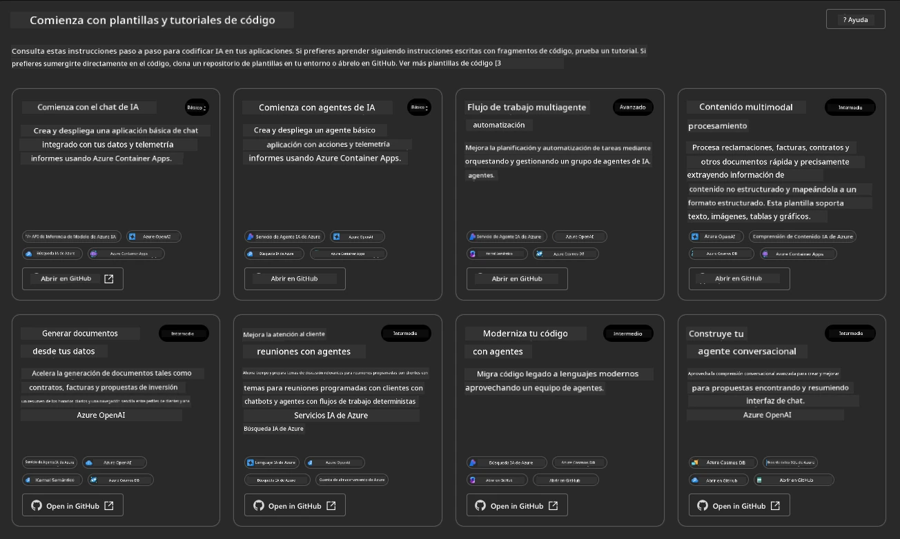


Las opciones **Básicas** son tus plantillas iniciales:

1. [ ] [Comenzar con AI Chat](https://github.com/Azure-Samples/get-started-with-ai-chat) que despliega una aplicación básica de chat _con tus datos_ en Azure Container Apps. Usa esto para explorar un escenario básico de chatbot AI.
1. [X] [Comenzar con AI Agents](https://github.com/Azure-Samples/get-started-with-ai-agents) que también despliega un Agente AI estándar (con los Agentes Foundry). Usa esto para familiarizarte con soluciones AI agenticas que involucran herramientas y modelos.

Abre el segundo enlace en una nueva pestaña del navegador (o haz clic en `Open in GitHub` para la tarjeta relacionada). Deberías ver el repositorio de esta plantilla AZD. Tómate un minuto para explorar el README. La arquitectura de la aplicación se ve así:

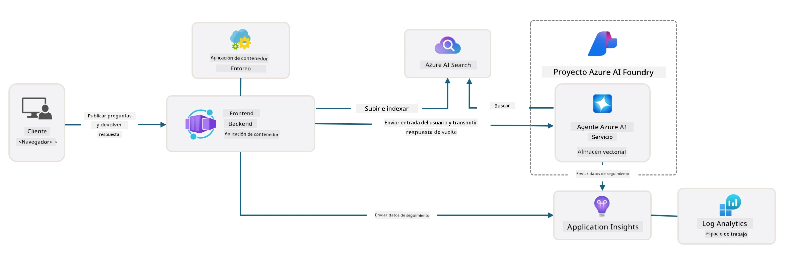

---

## 3. Activación de la Plantilla

Intentemos desplegar esta plantilla y asegurarnos de que sea válida. Seguiremos las directrices de la sección [Empezando](https://github.com/Azure-Samples/get-started-with-ai-agents?tab=readme-ov-file#getting-started).

1. Haz clic en [este enlace](https://github.com/codespaces/new/Azure-Samples/get-started-with-ai-agents) - confirma la acción predeterminada para `Create codespace`
1. Esto abrirá una nueva pestaña del navegador - espera a que la sesión de GitHub Codespaces termine de cargar
1. Abre el terminal de VS Code en Codespaces - escribe el siguiente comando:

   ```bash title="" linenums="0"
   azd up
   ```

Completa los pasos del flujo de trabajo que esto activará:

1. Se te pedirá iniciar sesión en Azure - sigue las instrucciones para autenticarte
1. Ingresa un nombre de entorno único para ti - por ejemplo, usé `nitya-mshack-azd`
1. Esto creará una carpeta `.azure/` - verás una subcarpeta con el nombre del entorno
1. Se te pedirá seleccionar una suscripción - selecciona la predeterminada
1. Se te pedirá un lugar - usa `East US 2`

Ahora, espera a que termine la provisión. **Esto toma entre 10 y 15 minutos**

1. Cuando termine, tu consola mostrará un mensaje de ÉXITO así:
      ```bash title="" linenums="0"
      SUCCESS: Your up workflow to provision and deploy to Azure completed in 10 minutes 17 seconds.
      ```
1. Ahora tu Portal de Azure tendrá un grupo de recursos aprovisionado con ese nombre de entorno:

      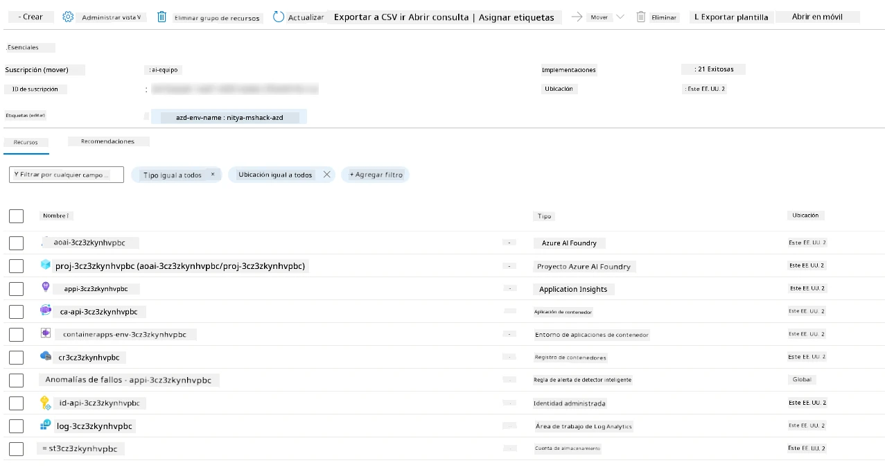

1. **Ya estás listo para validar la infraestructura y aplicación desplegadas**.

---

## 4. Validación de la Plantilla

1. Visita la página de [Grupos de Recursos](https://portal.azure.com/#browse/resourcegroups) en Azure Portal - inicia sesión cuando se te solicite
1. Haz clic en el GR para el nombre de tu entorno - verás la página mostrada arriba

      - haz clic en el recurso Azure Container Apps
      - haz clic en la Url de la Aplicación en la sección _Esenciales_ (arriba a la derecha)

1. Deberías ver una interfaz de usuario front-end alojada como esta:

   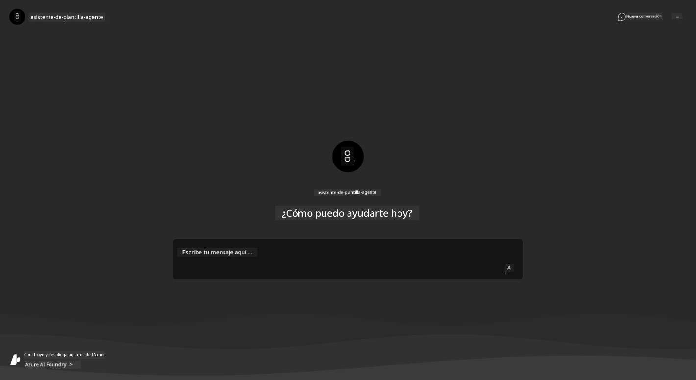

1. Intenta hacer un par de [preguntas de ejemplo](https://github.com/Azure-Samples/get-started-with-ai-agents/blob/main/docs/sample_questions.md)

      1. Pregunta: ```¿Cuál es la capital de Francia?``` 
      1. Pregunta: ```¿Cuál es la mejor tienda para dos personas por menos de $200 y qué características incluye?```

1. Deberías obtener respuestas similares a las mostradas a continuación. _¿Pero cómo funciona esto?_ 

      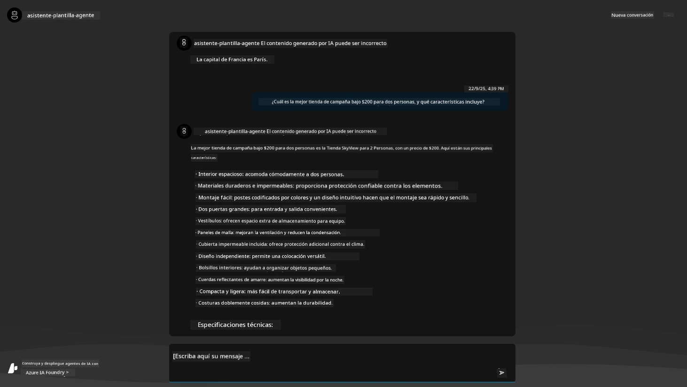

---

## 5. Validación del Agente

La Azure Container App despliega un endpoint que conecta con el Agente AI aprovisionado en el proyecto Microsoft Foundry para esta plantilla. Veamos qué significa eso.

1. Regresa a la página _Resumen_ en Azure Portal para tu grupo de recursos

1. Haz clic en el recurso `Microsoft Foundry` en esa lista

1. Deberías ver esto. Haz clic en el botón `Go to Microsoft Foundry Portal`. 
   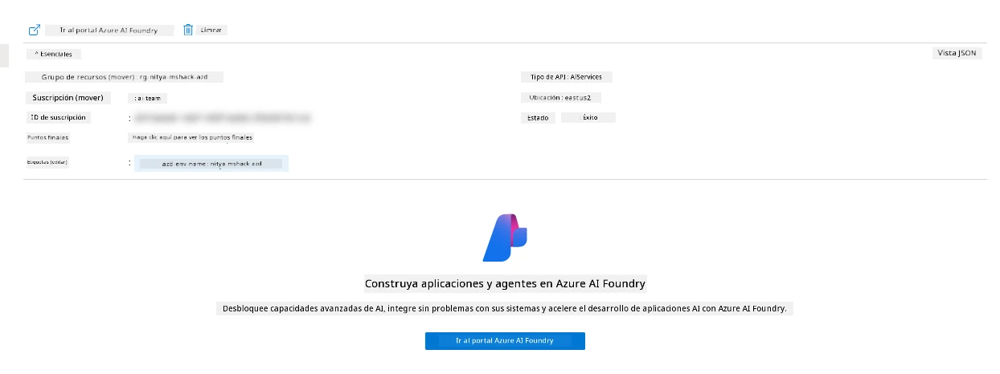

1. Deberías ver la página del Proyecto Foundry para tu aplicación AI
   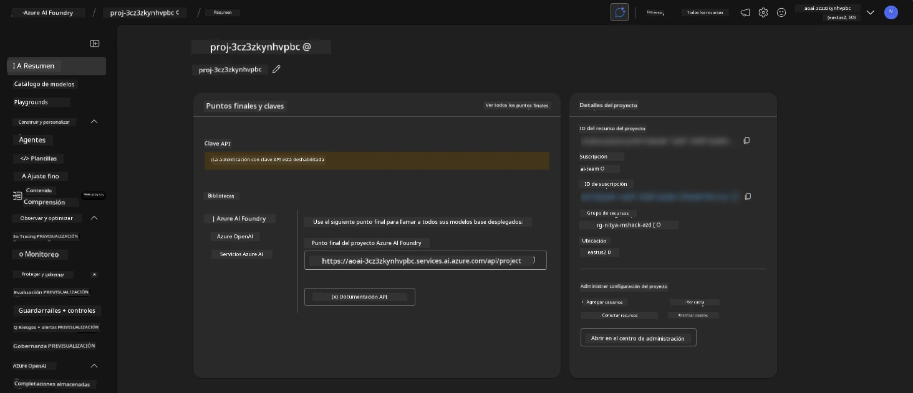

1. Haz clic en `Agents` - verás el Agente predeterminado aprovisionado en tu proyecto
   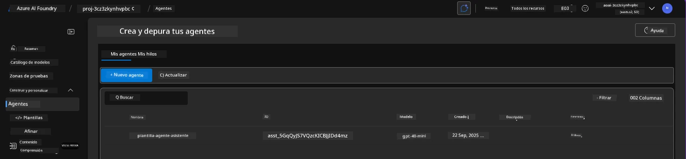

1. Selecciónalo - verás los detalles del Agente. Nota lo siguiente:

      - El agente usa Búsqueda de Archivos por defecto (siempre)
      - El campo `Knowledge` indica que tiene 32 archivos subidos (para búsqueda de archivos)
      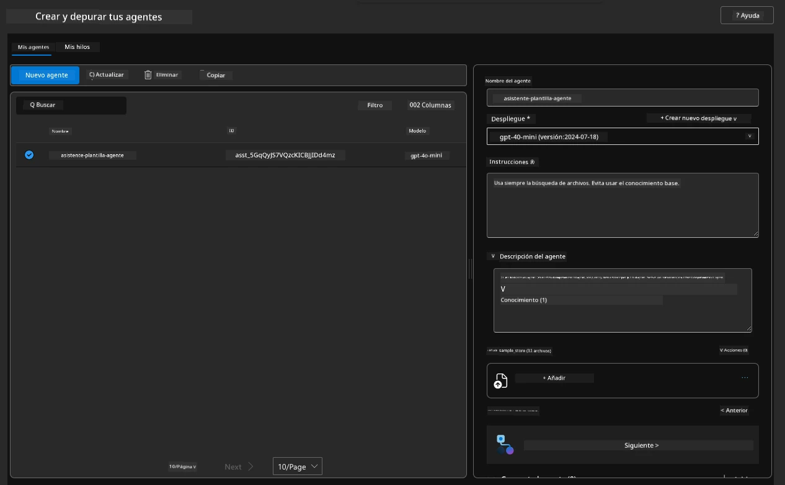

1. Busca la opción `Data+indexes` en el menú izquierdo y haz clic para ver detalles.

      - Deberías ver los 32 archivos de datos cargados para el conocimiento.
      - Estos corresponderán a los 12 archivos de clientes y 20 de productos en `src/files` 
      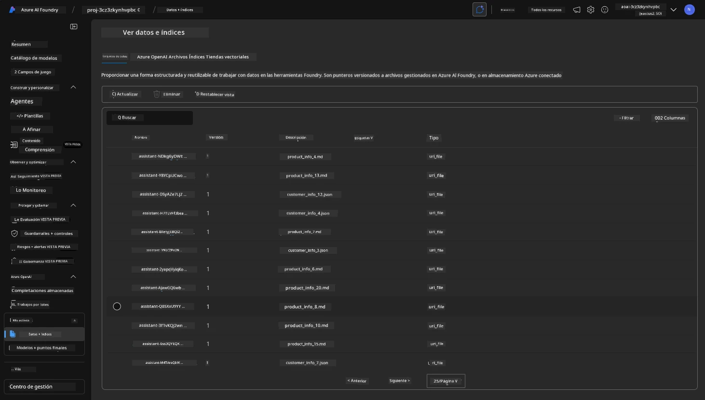

**¡Has validado la operación del Agente!** 

1. Las respuestas del agente se basan en el conocimiento contenido en esos archivos.
1. Ahora puedes hacer preguntas relacionadas con esos datos y obtener respuestas fundamentadas.
1. Ejemplo: `customer_info_10.json` describe las 3 compras hechas por "Amanda Perez"

Regresa a la pestaña del navegador con el endpoint de Container App y pregunta: `¿Qué productos posee Amanda Perez?`. Deberías ver algo así:

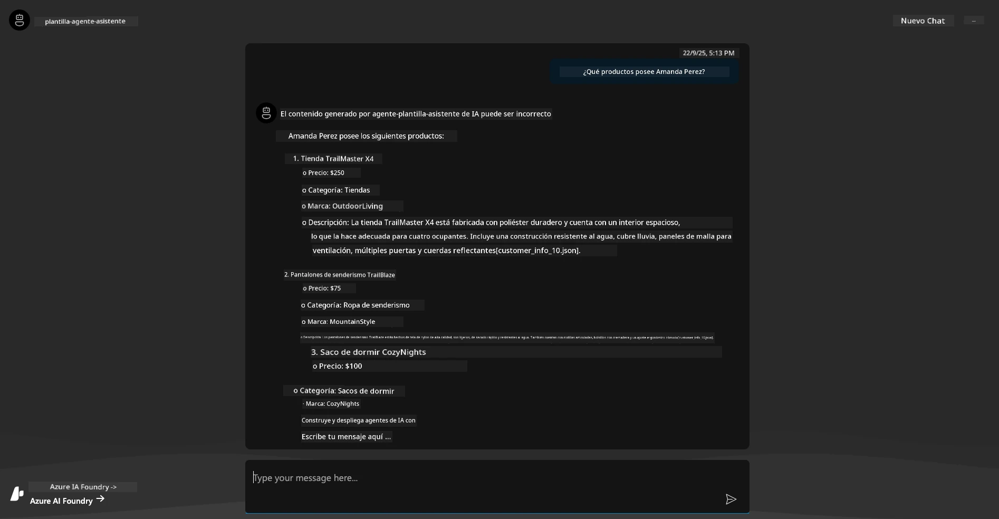

---

## 6. Área de Prueba de Agentes

Construyamos un poco más de intuición sobre las capacidades de Microsoft Foundry, probando el Agente en el Agents Playground.

1. Regresa a la página `Agents` en Microsoft Foundry - selecciona el agente predeterminado
1. Haz clic en la opción `Try in Playground` - deberías ver una interfaz del Playground así
1. Pregunta lo mismo: `¿Qué productos posee Amanda Perez?`

    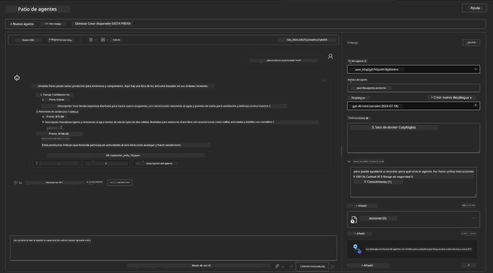

Obtienes la misma (o similar) respuesta, pero también obtienes información adicional que puedes usar para entender la calidad, costo y rendimiento de tu aplicación agentica. Por ejemplo:

1. Observa que la respuesta cita archivos de datos usados para "fundamentar" la respuesta
1. Pasa el cursor sobre alguna de estas etiquetas de archivo - ¿los datos coinciden con tu consulta y la respuesta mostrada?

También verás una fila de _estadísticas_ debajo de la respuesta.

1. Pasa el cursor sobre cualquier métrica - p.ej., Seguridad. Verás algo así
1. ¿Coincide la calificación evaluada con tu intuición sobre el nivel de seguridad de la respuesta?

      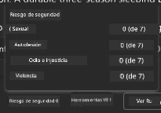

---

## 7. Observabilidad Integrada

La observabilidad consiste en instrumentar tu aplicación para generar datos que puedan usarse para entender, depurar y optimizar sus operaciones. Para tener una idea de esto:

1. Haz clic en el botón `View Run Info` - deberías ver esta vista. Este es un ejemplo de [seguimiento de Agentes](https://learn.microsoft.com/en-us/azure/ai-foundry/how-to/develop/trace-agents-sdk#view-trace-results-in-the-azure-ai-foundry-agents-playground) en acción. _También puedes obtener esta vista haciendo clic en Thread Logs en el menú principal_.

   - Observa los pasos de ejecución y las herramientas usadas por el agente
   - Entiende el conteo total de Tokens (vs. tokens de salida usados) para la respuesta
   - Entiende la latencia y dónde se está invertiendo tiempo durante la ejecución

      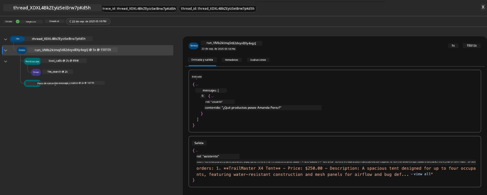

1. Haz clic en la pestaña `Metadata` para ver atributos adicionales de la ejecución, que pueden proporcionar contexto útil para depurar problemas después.   

      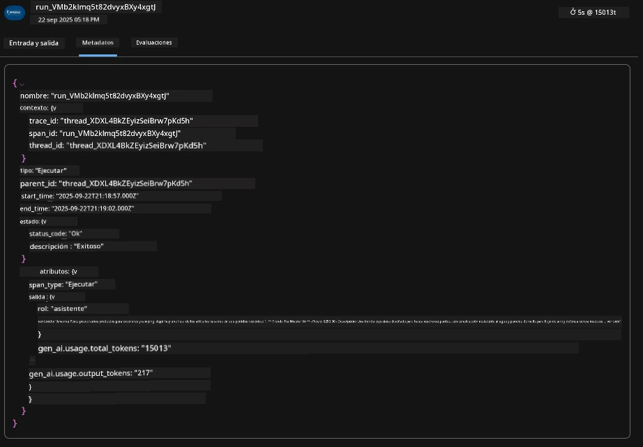


1. Haz clic en la pestaña `Evaluations` para ver autoevaluaciones realizadas sobre la respuesta del agente. Estas incluyen evaluaciones de seguridad (p. ej., Autolesiones) y evaluaciones específicas del agente (p. ej., Resolución de intención, Adhesión a la tarea).

      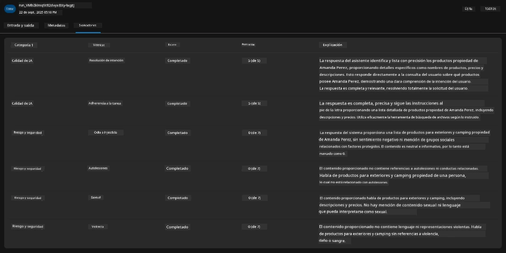

1. Por último, pero no menos importante, haz clic en la pestaña `Monitoring` en el menú lateral.

      - Selecciona la pestaña `Resource usage` en la página mostrada y observa las métricas.
      - Rastrea el uso de la aplicación en términos de costos (tokens) y carga (solicitudes).
      - Rastrea la latencia de la aplicación hasta el primer byte (procesamiento de entrada) y el último byte (salida).

      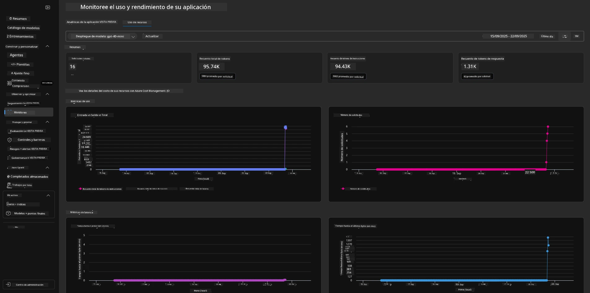

---

## 8. Variables de Entorno

Hasta ahora, hemos recorrido la implementación en el navegador y validado que nuestra infraestructura está aprovisionada y la aplicación está operativa. Pero para trabajar con el código de la aplicación _primero_, necesitamos configurar nuestro entorno de desarrollo local con las variables relevantes requeridas para trabajar con estos recursos. Usar `azd` facilita esto.

1. El Azure Developer CLI [utiliza variables de entorno](https://learn.microsoft.com/en-us/azure/developer/azure-developer-cli/manage-environment-variables?tabs=bash) para almacenar y administrar configuraciones para los despliegues de aplicaciones.

1. Las variables de entorno se almacenan en `.azure/<env-name>/.env` - esto las limita al entorno `env-name` usado durante el despliegue y te ayuda a aislar entornos entre diferentes objetivos de despliegue en el mismo repositorio.

1. Las variables de entorno se cargan automáticamente por el comando `azd` cada vez que ejecuta un comando específico (p. ej., `azd up`). Nota que `azd` no lee automáticamente variables de entorno _a nivel SO_ (p. ej., definidas en el shell) - en su lugar usa `azd set env` y `azd get env` para transferir información dentro de los scripts.


Probemos algunos comandos:

1. Obtén todas las variables de entorno configuradas para `azd` en este entorno:

      ```bash title="" linenums="0"
      azd env get-values
      ```
      
      Verás algo así:

      ```bash title="" linenums="0"
      AZURE_AI_AGENT_DEPLOYMENT_NAME="gpt-4.1-mini"
      AZURE_AI_AGENT_NAME="agent-template-assistant"
      AZURE_AI_EMBED_DEPLOYMENT_NAME="text-embedding-3-small"
      AZURE_AI_EMBED_DIMENSIONS=100
      ...
      ```

1. Obtén un valor específico - por ejemplo, quiero saber si configuramos el valor `AZURE_AI_AGENT_MODEL_NAME`

      ```bash title="" linenums="0"
      azd env get-value AZURE_AI_AGENT_MODEL_NAME 
      ```
      
      Verás algo así - ¡no fue configurado por defecto!

      ```bash title="" linenums="0"
      ERROR: key 'AZURE_AI_AGENT_MODEL_NAME' not found in the environment values
      ```

1. Configura una nueva variable de entorno para `azd`. Aquí, actualizamos el nombre del modelo del agente. _Nota: cualquier cambio hecho se reflejará inmediatamente en el archivo `.azure/<env-name>/.env`._

      ```bash title="" linenums="0"
      azd env set AZURE_AI_AGENT_MODEL_NAME gpt-4.1
      azd env set AZURE_AI_AGENT_MODEL_VERSION 2025-04-14
      azd env set AZURE_AI_AGENT_DEPLOYMENT_CAPACITY 150
      ```

      Ahora deberíamos encontrar que el valor está configurado:

      ```bash title="" linenums="0"
      azd env get-value AZURE_AI_AGENT_MODEL_NAME 
      ```

1. Ten en cuenta que algunos recursos son persistentes (p. ej., implementaciones de modelos) y requerirán más que un `azd up` para forzar la reimplementación. Probemos desmontar la implementación original y volver a implementar con las variables de entorno cambiadas.

1. **Actualizar** Si previamente implementaste infraestructura usando una plantilla azd - puedes _actualizar_ el estado de tus variables de entorno locales basado en el estado actual de tu despliegue en Azure usando este comando:

      ```bash title="" linenums="0"
      azd env refresh
      ```

      Esta es una forma poderosa de _sincronizar_ las variables de entorno entre dos o más entornos de desarrollo locales (por ejemplo, un equipo con varios desarrolladores), lo que permite que la infraestructura desplegada sirva como la verdad fundamental para el estado de las variables de entorno. Los miembros del equipo simplemente _actualizan_ las variables para volver a sincronizarse.

---

## 9. Felicitaciones 🏆

Acabas de completar un flujo de trabajo de extremo a extremo donde:

- [X] Seleccionaste la plantilla AZD que quieres usar
- [X] Lanzaste la plantilla con GitHub Codespaces
- [X] Implementaste la plantilla y validaste que funciona

---

<!-- CO-OP TRANSLATOR DISCLAIMER START -->
**Descargo de responsabilidad**:
Este documento ha sido traducido utilizando el servicio de traducción automática [Co-op Translator](https://github.com/Azure/co-op-translator). Aunque nos esforzamos por alcanzar la precisión, tenga en cuenta que las traducciones automatizadas pueden contener errores o inexactitudes. El documento original en su idioma nativo debe considerarse la fuente autorizada. Para información crítica, se recomienda una traducción profesional realizada por humanos. No nos hacemos responsables de malentendidos o interpretaciones erróneas derivadas del uso de esta traducción.
<!-- CO-OP TRANSLATOR DISCLAIMER END -->