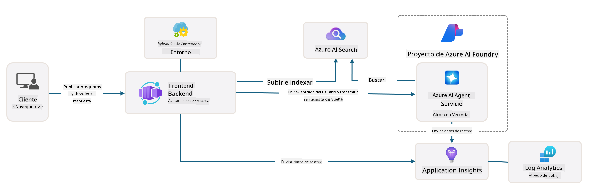

<!--
CO_OP_TRANSLATOR_METADATA:
{
  "original_hash": "4e403f041411361140d6beb88ab2a181",
  "translation_date": "2025-09-24T10:03:02+00:00",
  "source_file": "workshop/docs/instructions/3-Deconstruct-AI-Template.md",
  "language_code": "es"
}
-->
# 3. Deconstruir una Plantilla

!!! tip "AL FINAL DE ESTE MÓDULO SERÁS CAPAZ DE"

    - [ ] Elemento
    - [ ] Elemento
    - [ ] Elemento
    - [ ] **Laboratorio 3:** 

---

Con las plantillas de AZD y la Azure Developer CLI (`azd`), podemos iniciar rápidamente nuestro viaje de desarrollo de IA con repositorios estandarizados que proporcionan código de ejemplo, infraestructura y archivos de configuración, en forma de un proyecto _starter_ listo para desplegar.

**Pero ahora, necesitamos entender la estructura del proyecto y la base de código, y ser capaces de personalizar la plantilla de AZD, ¡sin experiencia previa ni conocimiento de AZD!**

---

## 1. Activar GitHub Copilot

### 1.1 Instalar GitHub Copilot Chat

Es momento de explorar [GitHub Copilot con Modo Agente](https://code.visualstudio.com/docs/copilot/chat/chat-agent-mode). Ahora podemos usar lenguaje natural para describir nuestra tarea a un nivel alto y obtener asistencia en la ejecución. Para este laboratorio, utilizaremos el [plan gratuito de Copilot](https://github.com/github-copilot/signup), que tiene un límite mensual para completaciones e interacciones de chat.

La extensión puede instalarse desde el marketplace, pero ya debería estar disponible en tu entorno de Codespaces. _Haz clic en `Open Chat` desde el menú desplegable del ícono de Copilot y escribe un mensaje como `What can you do?`_ - es posible que se te solicite iniciar sesión. **GitHub Copilot Chat está listo**.

### 1.2. Instalar Servidores MCP

Para que el Modo Agente sea efectivo, necesita acceso a las herramientas adecuadas para ayudarle a recuperar conocimiento o realizar acciones. Aquí es donde los servidores MCP pueden ayudar. Configuraremos los siguientes servidores:

1. [Azure MCP Server](../../../../../workshop/docs/instructions)
1. [Microsoft Docs MCP Server](../../../../../workshop/docs/instructions)

Para activarlos:

1. Crea un archivo llamado `.vscode/mcp.json` si no existe.
1. Copia lo siguiente en ese archivo y ¡inicia los servidores!
   ```json title=".vscode/mcp.json"
   {
      "servers": {
         "Azure MCP Server": {
            "command": "npx",
            "args": [
            "-y",
            "@azure/mcp@latest",
            "server",
            "start"
            ]
         },
         "microsoft.docs.mcp": {
            "type": "http",
            "url": "https://learn.microsoft.com/api/mcp"
         }
      }
   }
   ```

??? warning "Es posible que recibas un error indicando que `npx` no está instalado (haz clic para expandir la solución)"

      Para solucionarlo, abre el archivo `.devcontainer/devcontainer.json` y agrega esta línea a la sección de características. Luego reconstruye el contenedor. Ahora deberías tener `npx` instalado.

      ```title="" linenums="0"
         "features": {
            "ghcr.io/devcontainers/features/node:1": {},
            ...
         },
      ```

---

### 1.3. Probar GitHub Copilot Chat

**Primero usa `az login` para autenticarte con Azure desde la línea de comandos de VS Code.**

Ahora deberías poder consultar el estado de tu suscripción de Azure y hacer preguntas sobre los recursos desplegados o la configuración. Prueba estos mensajes:

1. `List my Azure resource groups`
1. `#foundry list my current deployments`

También puedes hacer preguntas sobre la documentación de Azure y obtener respuestas basadas en el servidor MCP de Microsoft Docs. Prueba estos mensajes:

1. `#microsoft_docs_search What is Azure Developer CLI?`
1. `#microsoft_docs_search Show me a Python tutorial to chat with deployed model`

O puedes pedir fragmentos de código para completar una tarea. Prueba este mensaje:

1. `Give me a Python code example that uses AAD for an interactive chat client`

En el modo `Ask`, esto proporcionará código que puedes copiar y probar. En el modo `Agent`, esto podría ir un paso más allá y crear los recursos relevantes para ti, incluyendo scripts de configuración y documentación, para ayudarte a ejecutar esa tarea.

**Ahora estás listo para comenzar a explorar el repositorio de la plantilla**

---

## 2. Deconstruir la Arquitectura

??? prompt "ASK: Explica la arquitectura de la aplicación en docs/images/architecture.png en 1 párrafo"

      Esta aplicación es una aplicación de chat impulsada por IA construida en Azure que demuestra una arquitectura moderna basada en agentes. La solución se centra en una Azure Container App que aloja el código principal de la aplicación, el cual procesa la entrada del usuario y genera respuestas inteligentes a través de un agente de IA. 
      
      La arquitectura aprovecha el Proyecto Azure AI Foundry como base para las capacidades de IA, conectándose a los Servicios de Azure AI que proporcionan los modelos de lenguaje subyacentes (como GPT-4o-mini) y la funcionalidad del agente. Las interacciones del usuario fluyen a través de un frontend basado en React hacia un backend FastAPI que se comunica con el servicio de agente de IA para generar respuestas contextuales. 
      
      El sistema incorpora capacidades de recuperación de conocimiento mediante búsqueda de archivos o el servicio Azure AI Search, permitiendo que el agente acceda y cite información de documentos cargados. Para la excelencia operativa, la arquitectura incluye monitoreo integral a través de Application Insights y Log Analytics Workspace para rastreo, registro y optimización del rendimiento. 
      
      Azure Storage proporciona almacenamiento de blobs para datos de la aplicación y archivos cargados, mientras que Managed Identity asegura acceso seguro entre los recursos de Azure sin almacenar credenciales. Toda la solución está diseñada para escalabilidad y mantenibilidad, con la aplicación contenedorizada escalando automáticamente según la demanda mientras proporciona seguridad, monitoreo y capacidades de CI/CD integradas a través del ecosistema de servicios gestionados de Azure.



---

## 3. Estructura del Repositorio

!!! prompt "ASK: Explica la estructura de carpetas de la plantilla. Comienza con un diagrama jerárquico visual."

??? info "ANSWER: Diagrama Jerárquico Visual"

      ```bash title="" 
      get-started-with-ai-agents/
      ├── 📋 Configuración y Setup
      │   ├── azure.yaml                    # Configuración de Azure Developer CLI
      │   ├── docker-compose.yaml           # Contenedores de desarrollo local
      │   ├── pyproject.toml                # Configuración del proyecto Python
      │   ├── requirements-dev.txt          # Dependencias de desarrollo
      │   └── .devcontainer/                # Configuración del contenedor de desarrollo en VS Code
      │
      ├── 🏗️ Infraestructura (infra/)
      │   ├── main.bicep                    # Plantilla principal de infraestructura
      │   ├── api.bicep                     # Recursos específicos de la API
      │   ├── main.parameters.json          # Parámetros de infraestructura
      │   └── core/                         # Componentes modulares de infraestructura
      │       ├── ai/                       # Configuraciones de servicios de IA
      │       ├── host/                     # Infraestructura de alojamiento
      │       ├── monitor/                  # Monitoreo y registro
      │       ├── search/                   # Configuración de Azure AI Search
      │       ├── security/                 # Seguridad e identidad
      │       └── storage/                  # Configuraciones de cuentas de almacenamiento
      │
      ├── 💻 Código Fuente de la Aplicación (src/)
      │   ├── api/                          # API Backend
      │   │   ├── main.py                   # Entrada de la aplicación FastAPI
      │   │   ├── routes.py                 # Definiciones de rutas de la API
      │   │   ├── search_index_manager.py   # Funcionalidad de búsqueda
      │   │   ├── data/                     # Manejo de datos de la API
      │   │   ├── static/                   # Recursos web estáticos
      │   │   └── templates/                # Plantillas HTML
      │   ├── frontend/                     # Frontend React/TypeScript
      │   │   ├── package.json              # Dependencias de Node.js
      │   │   ├── vite.config.ts            # Configuración de construcción con Vite
      │   │   └── src/                      # Código fuente del frontend
      │   ├── data/                         # Archivos de datos de ejemplo
      │   │   └── embeddings.csv            # Embeddings precomputados
      │   ├── files/                        # Archivos de base de conocimiento
      │   │   ├── customer_info_*.json      # Ejemplos de datos de clientes
      │   │   └── product_info_*.md         # Documentación de productos
      │   ├── Dockerfile                    # Configuración del contenedor
      │   └── requirements.txt              # Dependencias de Python
      │
      ├── 🔧 Automatización y Scripts (scripts/)
      │   ├── postdeploy.sh/.ps1           # Configuración post-despliegue
      │   ├── setup_credential.sh/.ps1     # Configuración de credenciales
      │   ├── validate_env_vars.sh/.ps1    # Validación de entorno
      │   └── resolve_model_quota.sh/.ps1  # Gestión de cuotas de modelos
      │
      ├── 🧪 Pruebas y Evaluación
      │   ├── tests/                        # Pruebas unitarias e integrales
      │   │   └── test_search_index_manager.py
      │   ├── evals/                        # Marco de evaluación de agentes
      │   │   ├── evaluate.py               # Ejecutor de evaluación
      │   │   ├── eval-queries.json         # Consultas de prueba
      │   │   └── eval-action-data-path.json
      │   ├── sandbox/                      # Área de pruebas de desarrollo
      │   │   ├── 1-quickstart.py           # Ejemplos para comenzar
      │   │   └── aad-interactive-chat.py   # Ejemplos de autenticación
      │   └── airedteaming/                 # Evaluación de seguridad de IA
      │       └── ai_redteaming.py          # Pruebas de red team
      │
      ├── 📚 Documentación (docs/)
      │   ├── deployment.md                 # Guía de despliegue
      │   ├── local_development.md          # Instrucciones de configuración local
      │   ├── troubleshooting.md            # Problemas comunes y soluciones
      │   ├── azure_account_setup.md        # Prerrequisitos de Azure
      │   └── images/                       # Recursos para documentación
      │
      └── 📄 Metadatos del Proyecto
         ├── README.md                     # Resumen del proyecto
         ├── CODE_OF_CONDUCT.md           # Directrices de la comunidad
         ├── CONTRIBUTING.md              # Guía de contribución
         ├── LICENSE                      # Términos de licencia
         └── next-steps.md                # Guía post-despliegue
      ```

### 3.1. Arquitectura Principal de la Aplicación

Esta plantilla sigue un patrón de **aplicación web full-stack** con:

- **Backend**: FastAPI en Python con integración de Azure AI
- **Frontend**: TypeScript/React con sistema de construcción Vite
- **Infraestructura**: Plantillas Azure Bicep para recursos en la nube
- **Contenerización**: Docker para despliegue consistente

### 3.2 Infraestructura como Código (bicep)

La capa de infraestructura utiliza plantillas **Azure Bicep** organizadas de manera modular:

   - **`main.bicep`**: Orquesta todos los recursos de Azure
   - **Módulos `core/`**: Componentes reutilizables para diferentes servicios
      - Servicios de IA (Azure OpenAI, AI Search)
      - Alojamiento de contenedores (Azure Container Apps)
      - Monitoreo (Application Insights, Log Analytics)
      - Seguridad (Key Vault, Managed Identity)

### 3.3 Código Fuente de la Aplicación (`src/`)

**API Backend (`src/api/`)**:

- API REST basada en FastAPI
- Integración con el servicio de agente de Azure AI
- Gestión de índices de búsqueda para recuperación de conocimiento
- Capacidades de carga y procesamiento de archivos

**Frontend (`src/frontend/`)**:

- SPA moderna con React/TypeScript
- Vite para desarrollo rápido y construcciones optimizadas
- Interfaz de chat para interacciones con el agente

**Base de Conocimiento (`src/files/`)**:

- Datos de clientes y productos de ejemplo
- Demuestra recuperación de conocimiento basada en archivos
- Ejemplos en formato JSON y Markdown

### 3.4 DevOps y Automatización

**Scripts (`scripts/`)**:

- Scripts multiplataforma en PowerShell y Bash
- Validación y configuración del entorno
- Configuración post-despliegue
- Gestión de cuotas de modelos

**Integración con Azure Developer CLI**:

- Configuración `azure.yaml` para flujos de trabajo `azd`
- Aprovisionamiento y despliegue automatizados
- Gestión de variables de entorno

### 3.5 Pruebas y Garantía de Calidad

**Marco de Evaluación (`evals/`)**:

- Evaluación del rendimiento del agente
- Pruebas de calidad de consulta-respuesta
- Pipeline de evaluación automatizada

**Seguridad de IA (`airedteaming/`)**:

- Pruebas de red team para seguridad de IA
- Escaneo de vulnerabilidades de seguridad
- Prácticas responsables de IA

---

## 4. ¡Felicidades 🏆!

Has utilizado exitosamente GitHub Copilot Chat con servidores MCP para explorar el repositorio.

- [X] Activaste GitHub Copilot para Azure
- [X] Entendiste la Arquitectura de la Aplicación
- [X] Exploraste la estructura de la plantilla AZD

Esto te da una idea de los activos de _infraestructura como código_ para esta plantilla. A continuación, veremos el archivo de configuración para AZD.

---

