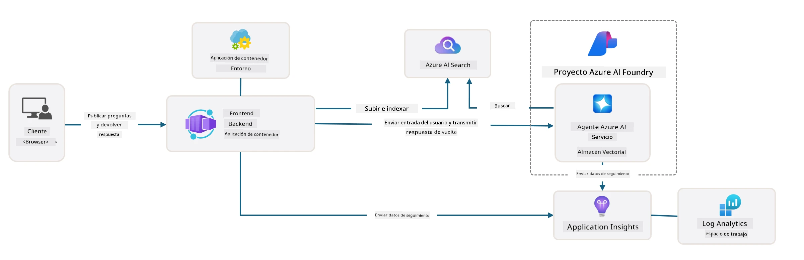

# 3. Deconstruir una plantilla

!!! tip "AL FINAL DE ESTE MÓDULO PODRÁS"

    - [ ] Activar GitHub Copilot con servidores MCP para asistencia de Azure
    - [ ] Entender la estructura de carpetas y componentes de la plantilla AZD
    - [ ] Explorar patrones de organización de infraestructura como código (Bicep)
    - [ ] **Laboratorio 3:** Usar GitHub Copilot para explorar y entender la arquitectura del repositorio 

---


Con las plantillas AZD y la Azure Developer CLI (`azd`) podemos iniciar rápidamente nuestro viaje de desarrollo con IA con repositorios estandarizados que proporcionan código de ejemplo, infraestructura y archivos de configuración: en forma de un proyecto _starter_ listo para desplegar.

**¡Pero ahora, necesitamos entender la estructura del proyecto y la base de código - y poder personalizar la plantilla AZD - sin experiencia previa o conocimiento de AZD!**

---

## 1. Activar GitHub Copilot

### 1.1 Instalar GitHub Copilot Chat

Es hora de explorar [GitHub Copilot with Agent Mode](https://code.visualstudio.com/docs/copilot/chat/chat-agent-mode). Ahora, podemos usar lenguaje natural para describir nuestra tarea a alto nivel y obtener asistencia en la ejecución. Para este laboratorio, usaremos el [plan gratuito de Copilot](https://github.com/github-copilot/signup) que tiene un límite mensual para completaciones e interacciones de chat.

La extensión puede instalarse desde el marketplace, pero ya debería estar disponible en tu entorno Codespaces. _Haz clic en `Open Chat` desde el desplegable del icono de Copilot - y escribe un prompt como `What can you do?`_ - es posible que se te pida iniciar sesión. **GitHub Copilot Chat está listo**.

### 1.2. Instalar servidores MCP

Para que el modo Agente sea efectivo, necesita acceso a las herramientas adecuadas para ayudarle a recuperar conocimiento o realizar acciones. Aquí es donde los servidores MCP pueden ayudar. Configuraremos los siguientes servidores:

1. [Servidor MCP de Azure](../../../../../workshop/docs/instructions)
1. [Servidor MCP de Microsoft Docs](../../../../../workshop/docs/instructions)

Para activarlos:

1. Crea un archivo llamado `.vscode/mcp.json` si no existe
1. Copia lo siguiente en ese archivo - ¡y arranca los servidores!
   ```json title=".vscode/mcp.json"
   {
      "servers": {
         "Azure MCP Server": {
            "command": "npx",
            "args": [
            "-y",
            "@azure/mcp@latest",
            "server",
            "start"
            ]
         },
         "microsoft.docs.mcp": {
            "type": "http",
            "url": "https://learn.microsoft.com/api/mcp"
         }
      }
   }
   ```

??? warning "Es posible que recibas un error indicando que `npx` no está instalado (haz clic para expandir la solución)"

      Para solucionarlo, abre el archivo `.devcontainer/devcontainer.json` y añade esta línea en la sección features. Luego reconstruye el contenedor. Ahora deberías tener `npx` instalado.

      ```title="" linenums="0"
         "features": {
            "ghcr.io/devcontainers/features/node:1": {},
            ...
         },
      ```

---

### 1.3. Probar GitHub Copilot Chat

**Usa primero `az login` para autenticarte con Azure desde la línea de comandos de VS Code.**

Ahora deberías poder consultar el estado de tu suscripción de Azure y hacer preguntas sobre recursos desplegados o configuración. Prueba estos prompts:

1. `List my Azure resource groups`
1. `#foundry list my current deployments`

También puedes hacer preguntas sobre la documentación de Azure y obtener respuestas fundamentadas en el servidor MCP de Microsoft Docs. Prueba estos prompts:

1. `#microsoft_docs_search What is Azure Developer CLI?`
1. `#microsoft_docs_search Show me a Python tutorial to chat with deployed model`

O puedes pedir fragmentos de código para completar una tarea. Prueba este prompt.

1. `Give me a Python code example that uses AAD for an interactive chat client`

En el modo `Ask`, esto proporcionará código que puedes copiar-pegar y probar. En el modo `Agent`, esto podría ir un paso más allá y crear los recursos relevantes para ti - incluidos scripts de configuración y documentación - para ayudarte a ejecutar esa tarea.

**Ahora estás listo para empezar a explorar el repositorio de plantillas**

---

## 2. Deconstruir la arquitectura

??? prompt "PREGUNTA: Explica la arquitectura de la aplicación en docs/images/architecture.png en 1 párrafo"

      Esta aplicación es una aplicación de chat impulsada por IA construida en Azure que demuestra una arquitectura moderna basada en agentes. La solución se centra en una Azure Container App que aloja el código principal de la aplicación, que procesa la entrada del usuario y genera respuestas inteligentes a través de un agente de IA. 
      
      La arquitectura aprovecha Microsoft Foundry Project como la base para las capacidades de IA, conectándose a Azure AI Services que proporcionan los modelos de lenguaje subyacentes (como GPT-4o-mini) y la funcionalidad de agente. Las interacciones de los usuarios fluyen a través de un frontend basado en React hacia un backend FastAPI que se comunica con el servicio agente de IA para generar respuestas contextuales. 
      
      El sistema incorpora capacidades de recuperación de conocimiento mediante búsqueda en archivos o el servicio Azure AI Search, permitiendo que el agente acceda y cite información de documentos subidos. Para la excelencia operativa, la arquitectura incluye una monitorización integral con Application Insights y Log Analytics Workspace para trazabilidad, registro y optimización del rendimiento. 
      
      Azure Storage provee almacenamiento de blobs para datos de la aplicación y cargas de archivos, mientras que Managed Identity asegura el acceso seguro entre recursos de Azure sin almacenar credenciales. Toda la solución está diseñada para escalabilidad y mantenibilidad, con la aplicación en contenedores escalando automáticamente según la demanda y ofreciendo seguridad, monitorización y capacidades de CI/CD mediante los servicios gestionados de Azure.



---

## 3. Estructura del repositorio

!!! prompt "PREGUNTA: Explica la estructura de carpetas de la plantilla. Empieza con un diagrama jerárquico visual."

??? info "RESPUESTA: Diagrama jerárquico visual"

      ```bash title="" 
      get-started-with-ai-agents/
      ├── 📋 Configuración y puesta en marcha
      │   ├── azure.yaml                    # Configuración de Azure Developer CLI
      │   ├── docker-compose.yaml           # Contenedores para desarrollo local
      │   ├── pyproject.toml                # Configuración del proyecto Python
      │   ├── requirements-dev.txt          # Dependencias de desarrollo
      │   └── .devcontainer/                # Configuración del contenedor de desarrollo de VS Code
      │
      ├── 🏗️ Infraestructura (infra/)
      │   ├── main.bicep                    # Plantilla de infraestructura principal
      │   ├── api.bicep                     # Recursos específicos de la API
      │   ├── main.parameters.json          # Parámetros de infraestructura
      │   └── core/                         # Componentes de infraestructura modulares
      │       ├── ai/                       # Configuraciones de servicios de IA
      │       ├── host/                     # Infraestructura de hosting
      │       ├── monitor/                  # Monitorización y registro
      │       ├── search/                   # Configuración de Azure AI Search
      │       ├── security/                 # Seguridad e identidad
      │       └── storage/                  # Configuraciones de cuenta de almacenamiento
      │
      ├── 💻 Código fuente de la aplicación (src/)
      │   ├── api/                          # API del backend
      │   │   ├── main.py                   # Entrada de la aplicación FastAPI
      │   │   ├── routes.py                 # Definiciones de rutas de la API
      │   │   ├── search_index_manager.py   # Funcionalidad de búsqueda
      │   │   ├── data/                     # Manejo de datos del API
      │   │   ├── static/                   # Activos web estáticos
      │   │   └── templates/                # Plantillas HTML
      │   ├── frontend/                     # Frontend React/TypeScript
      │   │   ├── package.json              # Dependencias de Node.js
      │   │   ├── vite.config.ts            # Configuración de compilación de Vite
      │   │   └── src/                      # Código fuente del frontend
      │   ├── data/                         # Archivos de datos de ejemplo
      │   │   └── embeddings.csv            # Embeddings precomputados
      │   ├── files/                        # Archivos de la base de conocimiento
      │   │   ├── customer_info_*.json      # Muestras de datos de clientes
      │   │   └── product_info_*.md         # Documentación de producto
      │   ├── Dockerfile                    # Configuración del contenedor
      │   └── requirements.txt              # Dependencias de Python
      │
      ├── 🔧 Automatización y scripts (scripts/)
      │   ├── postdeploy.sh/.ps1           # Configuración posterior al despliegue
      │   ├── setup_credential.sh/.ps1     # Configuración de credenciales
      │   ├── validate_env_vars.sh/.ps1    # Validación del entorno
      │   └── resolve_model_quota.sh/.ps1  # Gestión de cuotas de modelos
      │
      ├── 🧪 Pruebas y evaluación
      │   ├── tests/                        # Pruebas unitarias e de integración
      │   │   └── test_search_index_manager.py
      │   ├── evals/                        # Marco de evaluación de agentes
      │   │   ├── evaluate.py               # Ejecutador de evaluación
      │   │   ├── eval-queries.json         # Consultas de prueba
      │   │   └── eval-action-data-path.json
      │   ├── sandbox/                      # Entorno de desarrollo
      │   │   ├── 1-quickstart.py           # Ejemplos para comenzar
      │   │   └── aad-interactive-chat.py   # Ejemplos de autenticación
      │   └── airedteaming/                 # Evaluación de seguridad de IA
      │       └── ai_redteaming.py          # Pruebas de red team
      │
      ├── 📚 Documentación (docs/)
      │   ├── deployment.md                 # Guía de despliegue
      │   ├── local_development.md          # Instrucciones de configuración local
      │   ├── troubleshooting.md            # Problemas comunes y soluciones
      │   ├── azure_account_setup.md        # Requisitos previos de Azure
      │   └── images/                       # Recursos para la documentación
      │
      └── 📄 Metadatos del proyecto
         ├── README.md                     # Resumen del proyecto
         ├── CODE_OF_CONDUCT.md           # Normas de la comunidad
         ├── CONTRIBUTING.md              # Guía de contribución
         ├── LICENSE                      # Términos de la licencia
         └── next-steps.md                # Orientación posterior al despliegue
      ```

### 3.1. Arquitectura principal de la aplicación

Esta plantilla sigue un patrón de **aplicación web full-stack** con:

- **Backend**: Python FastAPI con integración de Azure AI
- **Frontend**: TypeScript/React con Vite como sistema de compilación
- **Infraestructura**: Plantillas Azure Bicep para recursos en la nube
- **Contenerización**: Docker para despliegues consistentes

### 3.2 Infraestructura como Código (Bicep)

La capa de infraestructura usa plantillas **Azure Bicep** organizadas de forma modular:

   - **`main.bicep`**: Orquesta todos los recursos de Azure
   - **`core/` módulos**: Componentes reutilizables para distintos servicios
      - Servicios de IA (Azure OpenAI, AI Search)
      - Alojamiento de contenedores (Azure Container Apps)
      - Monitorización (Application Insights, Log Analytics)
      - Seguridad (Key Vault, Managed Identity)

### 3.3 Código fuente de la aplicación (`src/`)

**API del backend (`src/api/`)**:

- API REST basada en FastAPI
- Integración con Foundry Agents
- Gestión de índices de búsqueda para recuperación de conocimiento
- Capacidades de subida y procesamiento de archivos

**Frontend (`src/frontend/`)**:

- SPA moderna con React/TypeScript
- Vite para desarrollo rápido y builds optimizados
- Interfaz de chat para interacciones con agentes

**Base de conocimiento (`src/files/`)**:

- Datos de ejemplo de clientes y productos
- Demuestra recuperación de conocimiento basada en archivos
- Ejemplos en formato JSON y Markdown


### 3.4 DevOps y Automatización

**Scripts (`scripts/`)**:

- Scripts multiplataforma en PowerShell y Bash
- Validación y configuración del entorno
- Configuración posterior al despliegue
- Gestión de cuotas de modelos

**Integración con Azure Developer CLI**:

- `azure.yaml` para configuración de flujos `azd`
- Provisionamiento y despliegue automatizados
- Gestión de variables de entorno

### 3.5 Pruebas y Aseguramiento de la Calidad

**Marco de evaluación (`evals/`)**:

- Evaluación del rendimiento de agentes
- Pruebas de calidad de consulta-respuesta
- Canalización de evaluación automatizada

**Seguridad de IA (`airedteaming/`)**:

- Pruebas de red team para seguridad de IA
- Escaneo de vulnerabilidades de seguridad
- Prácticas de IA responsable

---

## 4. ¡Felicidades 🏆

Has utilizado con éxito GitHub Copilot Chat con servidores MCP para explorar el repositorio.

- [X] Activaste GitHub Copilot para Azure
- [X] Entendiste la arquitectura de la aplicación
- [X] Exploraste la estructura de la plantilla AZD

Esto te da una idea de los activos de _infraestructura como código_ para esta plantilla. A continuación, analizaremos el archivo de configuración para AZD.

---

<!-- CO-OP TRANSLATOR DISCLAIMER START -->
Descargo de responsabilidad:
Este documento ha sido traducido utilizando el servicio de traducción automática por IA [Co-op Translator](https://github.com/Azure/co-op-translator). Aunque nos esforzamos por la precisión, tenga en cuenta que las traducciones automatizadas pueden contener errores o inexactitudes. El documento original en su idioma nativo debe considerarse la fuente autorizada. Para información crítica, se recomienda una traducción profesional realizada por un traductor humano. No nos hacemos responsables de malentendidos o interpretaciones erróneas que surjan del uso de esta traducción.
<!-- CO-OP TRANSLATOR DISCLAIMER END -->