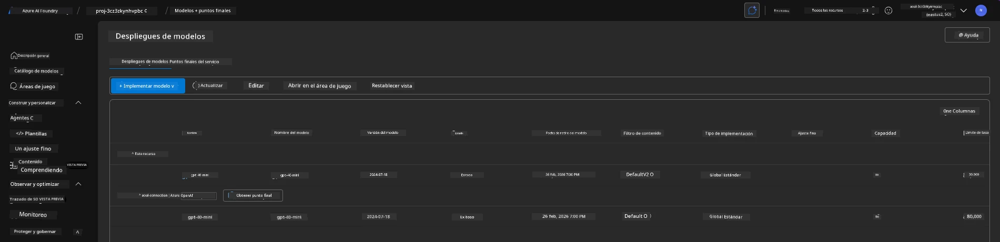
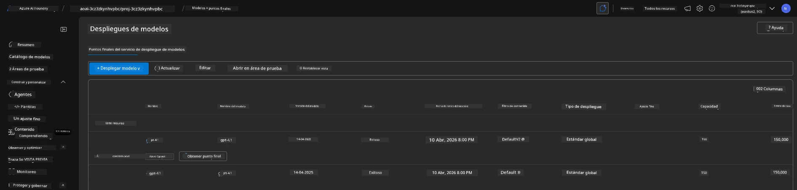

<!--
CO_OP_TRANSLATOR_METADATA:
{
  "original_hash": "6539a34c770f3ceff282370d72ee74dc",
  "translation_date": "2025-09-24T10:00:46+00:00",
  "source_file": "workshop/docs/instructions/6-Teardown-Infrastructure.md",
  "language_code": "es"
}
-->
# 6. Desmontar Infraestructura

!!! tip "AL FINAL DE ESTE MÓDULO SERÁS CAPAZ DE"

    - [ ] Elemento
    - [ ] Elemento
    - [ ] Elemento

---

## Ejercicios Adicionales

Antes de desmontar el proyecto, toma unos minutos para realizar una exploración abierta.

!!! danger "NITYA-TODO: Esbozar algunas sugerencias para probar"

---

## Desaprovisionar Infraestructura

1. Desmontar la infraestructura es tan sencillo como:
      
      ```bash title="" linenums="0"
      azd down --purge
      ```
1. El flag `--purge` asegura que también se eliminen los recursos de Cognitive Service que fueron eliminados de forma suave, liberando así la cuota retenida por estos recursos. Una vez completado, verás algo como esto:
      
      ```bash title="" linenums="0"
      ? Total resources to delete: 11, are you sure you want to continue? Yes
      Deleting your resources can take some time.
      (✓) Done: Deleted resource group rg-nitya-mshack-azd
      (✓) Done: Purging Cognitive Account: aoai-3cz3zkynhvpbc

      SUCCESS: Your application was removed from Azure in 11 minutes 4 seconds.
      ```

1. (Opcional) Si ahora ejecutas `azd up` nuevamente, notarás que el modelo gpt-4.1 se despliega, ya que la variable de entorno fue cambiada (y guardada) en la carpeta local `.azure`.

      Aquí están los despliegues del modelo **antes**:

      

      Y aquí está **después**:
      

---

