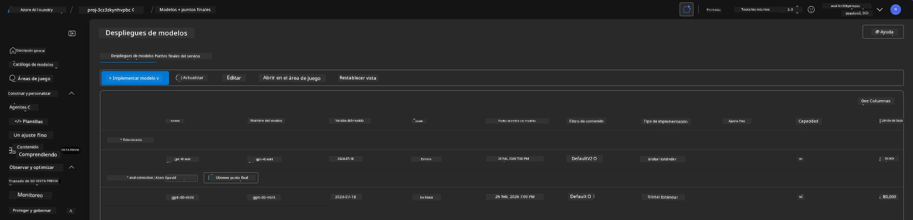
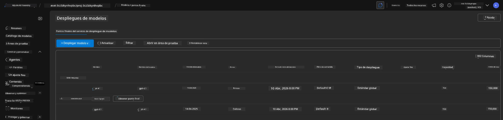

# 6. Desmantelar la infraestructura

!!! tip "AL FINAL DE ESTE MÓDULO PODRÁS"

    - [ ] Entender la importancia de la limpieza de recursos y la gestión de costos
    - [ ] Usar `azd down` para desprovisionar la infraestructura de forma segura
    - [ ] Recuperar servicios de Azure AI eliminados temporalmente si es necesario
    - [ ] **Lab 6:** Limpiar los recursos de Azure y verificar la eliminación

---

## Ejercicios adicionales

Before we tear down the project, take a few minutes to do some open-ended exploration.

!!! info "Prueba estas sugerencias de exploración"

    **Experimenta con GitHub Copilot:**
    
    1. Pregunta: `¿Qué otras plantillas AZD podría probar para escenarios multi-agente?`
    2. Pregunta: `¿Cómo puedo personalizar las instrucciones del agente para un caso de uso en salud?`
    3. Pregunta: `¿Qué variables de entorno controlan la optimización de costos?`
    
    **Explora el Portal de Azure:**
    
    1. Revisa las métricas de Application Insights de tu despliegue
    2. Consulta el análisis de costos de los recursos aprovisionados
    3. Explora el playground de agentes del portal Microsoft Foundry una vez más

---

## Desprovisionar la infraestructura

1. Desmontar la infraestructura es tan sencillo como:
      
      ```bash title="" linenums="0"
      azd down --purge
      ```
1. La opción `--purge` garantiza que también purgue los recursos de Cognitive Service eliminados de forma temporal, liberando así la cuota retenida por estos recursos. Una vez completado verás algo como esto:
      
      ```bash title="" linenums="0"
      ? Total resources to delete: 11, are you sure you want to continue? Yes
      Deleting your resources can take some time.
      (✓) Done: Deleted resource group rg-nitya-mshack-azd
      (✓) Done: Purging Cognitive Account: aoai-3cz3zkynhvpbc

      SUCCESS: Your application was removed from Azure in 11 minutes 4 seconds.
      ```

1. (Opcional) Si ahora ejecutas `azd up` de nuevo, notarás que el modelo gpt-4.1 se despliega ya que la variable de entorno fue cambiada (y guardada) en la carpeta local `.azure`. 

      Aquí están los despliegues del modelo **antes**:

      

      Y aquí está **después**:
      

---

<!-- CO-OP TRANSLATOR DISCLAIMER START -->
**Descargo de responsabilidad**:
Este documento ha sido traducido utilizando el servicio de traducción automática [Co-op Translator](https://github.com/Azure/co-op-translator). Aunque nos esforzamos por la precisión, tenga en cuenta que las traducciones automatizadas pueden contener errores o inexactitudes. El documento original en su idioma nativo debe considerarse la fuente autorizada. Para información crítica, se recomienda una traducción profesional humana. No somos responsables de cualquier malentendido o interpretación errónea que surja del uso de esta traducción.
<!-- CO-OP TRANSLATOR DISCLAIMER END -->