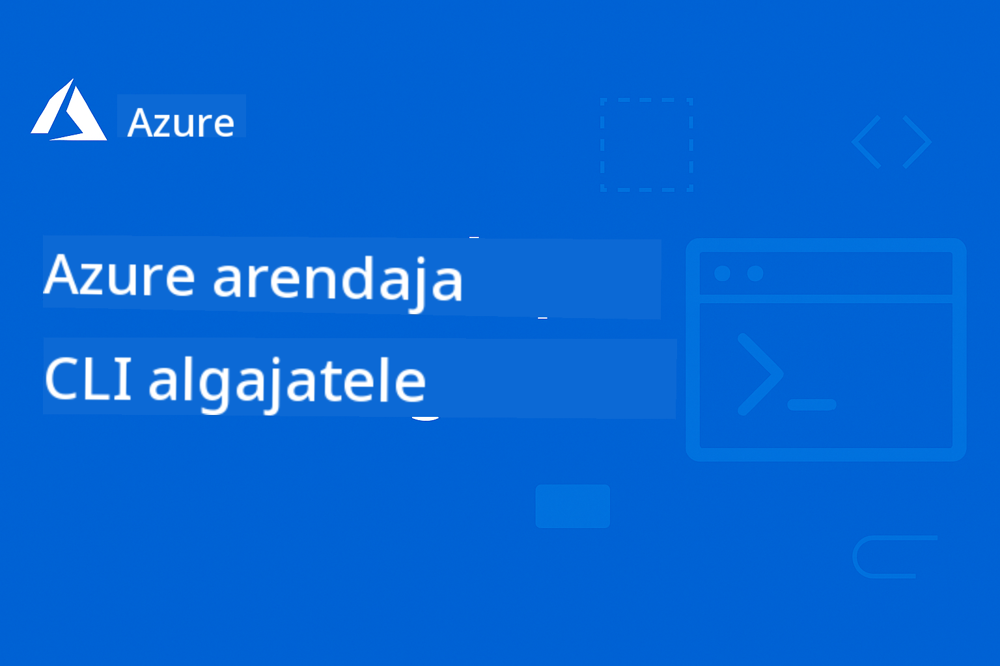

<!--
CO_OP_TRANSLATOR_METADATA:
{
  "original_hash": "6a804be263d09a0fd6f36d6ab251707a",
  "translation_date": "2025-11-25T13:11:33+00:00",
  "source_file": "README.md",
  "language_code": "et"
}
-->
# AZD Algajatele: Struktureeritud Õppeprogramm

 

[](https://GitHub.com/microsoft/azd-for-beginners/watchers/)
[](https://GitHub.com/microsoft/azd-for-beginners/network/)
[](https://GitHub.com/microsoft/azd-for-beginners/stargazers/)

[](https://discord.gg/microsoft-azure)
[](https://discord.gg/nTYy5BXMWG)

## Kuidas alustada selle kursusega

Järgi neid samme, et alustada oma AZD õppe teekonda:

1. **Haru loomine**: Klõpsa [](https://GitHub.com/microsoft/azd-for-beginners/fork)
2. **Klooni repositoorium**: `git clone https://github.com/microsoft/azd-for-beginners.git`
3. **Liitu kogukonnaga**: [Azure Discord kogukonnad](https://discord.com/invite/ByRwuEEgH4) ekspertide toetuseks
4. **Vali oma õppe tee**: Vali allpool peatükk, mis vastab sinu kogemustasemele

### Mitmekeelne tugi

#### Automaatne tõlge (alati ajakohane)

<!-- CO-OP TRANSLATOR LANGUAGES TABLE START -->
[Araabia](../ar/README.md) | [Bengali](../bn/README.md) | [Bulgaaria](../bg/README.md) | [Birma (Myanmar)](../my/README.md) | [Hiina (lihtsustatud)](../zh/README.md) | [Hiina (traditsiooniline, Hongkong)](../hk/README.md) | [Hiina (traditsiooniline, Macau)](../mo/README.md) | [Hiina (traditsiooniline, Taiwan)](../tw/README.md) | [Horvaatia](../hr/README.md) | [Tšehhi](../cs/README.md) | [Taani](../da/README.md) | [Hollandi](../nl/README.md) | [Eesti](./README.md) | [Soome](../fi/README.md) | [Prantsuse](../fr/README.md) | [Saksa](../de/README.md) | [Kreeka](../el/README.md) | [Heebrea](../he/README.md) | [Hindi](../hi/README.md) | [Ungari](../hu/README.md) | [Indoneesia](../id/README.md) | [Itaalia](../it/README.md) | [Jaapani](../ja/README.md) | [Kannada](../kn/README.md) | [Korea](../ko/README.md) | [Leedu](../lt/README.md) | [Malai](../ms/README.md) | [Malajalami](../ml/README.md) | [Marathi](../mr/README.md) | [Nepali](../ne/README.md) | [Nigeeria pidgin](../pcm/README.md) | [Norra](../no/README.md) | [Pärsia (Farsi)](../fa/README.md) | [Poola](../pl/README.md) | [Portugali (Brasiilia)](../br/README.md) | [Portugali (Portugal)](../pt/README.md) | [Punjabi (Gurmukhi)](../pa/README.md) | [Rumeenia](../ro/README.md) | [Vene](../ru/README.md) | [Serbia (kirillitsa)](../sr/README.md) | [Slovaki](../sk/README.md) | [Sloveeni](../sl/README.md) | [Hispaania](../es/README.md) | [Suahiili](../sw/README.md) | [Rootsi](../sv/README.md) | [Tagalogi (Filipino)](../tl/README.md) | [Tamili](../ta/README.md) | [Telugu](../te/README.md) | [Tai](../th/README.md) | [Türgi](../tr/README.md) | [Ukraina](../uk/README.md) | [Urdu](../ur/README.md) | [Vietnami](../vi/README.md)
<!-- CO-OP TRANSLATOR LANGUAGES TABLE END -->

## Kursuse ülevaade

Õpi Azure Developer CLI (azd) struktureeritud peatükkide kaudu, mis on loodud järkjärguliseks õppimiseks. **Eriline rõhk AI rakenduste juurutamisel Microsoft Foundry integratsiooniga.**

### Miks see kursus on oluline kaasaegsetele arendajatele

Microsoft Foundry Discord kogukonna andmetel **45% arendajatest soovib kasutada AZD-d AI töökoormuste jaoks**, kuid nad seisavad silmitsi järgmiste väljakutsetega:
- Keerulised mitme teenuse AI arhitektuurid
- Parimad praktikad AI juurutamiseks tootmises  
- Azure AI teenuste integreerimine ja seadistamine
- Kulude optimeerimine AI töökoormuste jaoks
- AI-spetsiifiliste juurutamisprobleemide lahendamine

### Õpieesmärgid

Selle struktureeritud kursuse läbimisega õpid:
- **AZD põhialused**: Põhimõtted, paigaldamine ja seadistamine
- **AI rakenduste juurutamine**: AZD kasutamine Microsoft Foundry teenustega
- **Infrastruktuur koodina**: Azure'i ressursside haldamine Bicep mallidega
- **Juurutamisprobleemide lahendamine**: Tavaliste probleemide lahendamine ja vigade otsimine
- **Optimeerimine tootmiseks**: Turvalisus, skaleerimine, jälgimine ja kulude haldamine
- **Mitmeagendilised lahendused**: Keeruliste AI arhitektuuride juurutamine

## 📚 Õppepeatükid

*Vali oma õppe tee vastavalt kogemustasemele ja eesmärkidele*

### 🚀 Peatükk 1: Alused ja kiire algus
**Eeldused**: Azure'i tellimus, põhilised käsurea teadmised  
**Kestus**: 30-45 minutit  
**Raskusaste**: ⭐

#### Mida õpid
- Azure Developer CLI põhialuste mõistmine
- AZD paigaldamine oma platvormile
- Esimene edukas juurutamine

#### Õppematerjalid
- **🎯 Alusta siit**: [Mis on Azure Developer CLI?](../..)
- **📖 Teooria**: [AZD põhialused](docs/getting-started/azd-basics.md) - Põhimõtted ja terminoloogia
- **⚙️ Seadistamine**: [Paigaldamine ja seadistamine](docs/getting-started/installation.md) - Platvormispetsiifilised juhendid
- **🛠️ Praktiline töö**: [Sinu esimene projekt](docs/getting-started/first-project.md) - Samm-sammult juhend
- **📋 Kiirviide**: [Käskude spikker](resources/cheat-sheet.md)

#### Praktilised harjutused
```bash
# Kiire paigalduskontroll
azd version

# Paigalda oma esimene rakendus
azd init --template todo-nodejs-mongo
azd up
```

**💡 Peatüki tulemus**: Edukas lihtsa veebirakenduse juurutamine Azure'i kasutades AZD-d

**✅ Edukuse kontroll:**
```bash
# Pärast 1. peatüki lõpetamist peaksite olema võimeline:
azd version              # Näitab paigaldatud versiooni
azd init --template todo-nodejs-mongo  # Initsialiseerib projekti
azd up                  # Paigaldab Azure'i
azd show                # Kuvab töötava rakenduse URL-i
# Rakendus avaneb brauseris ja töötab
azd down --force --purge  # Puhastab ressursid
```

**📊 Ajakulu:** 30-45 minutit  
**📈 Oskustase pärast:** Võimeline iseseisvalt lihtsaid rakendusi juurutama

**✅ Edukuse kontroll:**
```bash
# Pärast 1. peatüki lõpetamist peaksite olema võimeline:
azd version              # Näitab paigaldatud versiooni
azd init --template todo-nodejs-mongo  # Initsialiseerib projekti
azd up                  # Paigaldab Azure'i
azd show                # Kuvab töötava rakenduse URL-i
# Rakendus avaneb brauseris ja töötab
azd down --force --purge  # Puhastab ressursid
```

**📊 Ajakulu:** 30-45 minutit  
**📈 Oskustase pärast:** Võimeline iseseisvalt lihtsaid rakendusi juurutama

---

### 🤖 Peatükk 2: AI-keskne arendus (soovitatav AI arendajatele)
**Eeldused**: Peatükk 1 lõpetatud  
**Kestus**: 1-2 tundi  
**Raskusaste**: ⭐⭐

#### Mida õpid
- Microsoft Foundry integratsioon AZD-ga
- AI-põhiste rakenduste juurutamine
- AI teenuste seadistuste mõistmine

#### Õppematerjalid
- **🎯 Alusta siit**: [Microsoft Foundry integratsioon](docs/microsoft-foundry/microsoft-foundry-integration.md)
- **📖 Mustrid**: [AI mudeli juurutamine](docs/microsoft-foundry/ai-model-deployment.md) - AI mudelite haldamine ja juurutamine
- **🛠️ Töötuba**: [AI töötuba](docs/microsoft-foundry/ai-workshop-lab.md) - Muuda oma AI lahendused AZD-valmis
- **🎥 Interaktiivne juhend**: [Töötoa materjalid](workshop/README.md) - Brauseripõhine õpe MkDocs * DevContainer keskkonnas
- **📋 Mallid**: [Microsoft Foundry mallid](../..)
- **📝 Näited**: [AZD juurutamise näited](examples/README.md)

#### Praktilised harjutused
```bash
# Paigalda oma esimene AI rakendus
azd init --template azure-search-openai-demo
azd up

# Proovi täiendavaid AI malle
azd init --template openai-chat-app-quickstart
azd init --template agent-openai-python-prompty
```

**💡 Peatüki tulemus**: AI-põhise vestlusrakenduse juurutamine ja seadistamine RAG funktsionaalsusega

**✅ Edukuse kontroll:**
```bash
# Pärast 2. peatükki peaksite olema võimeline:
azd init --template azure-search-openai-demo
azd up
# Testima AI vestlusliidest
# Esitama küsimusi ja saama AI-põhiseid vastuseid koos allikatega
# Kontrollima, et otsingu integreerimine toimib
azd monitor  # Kontrollima, et Application Insights näitab telemeetriat
azd down --force --purge
```

**📊 Ajakulu:** 1-2 tundi  
**📈 Oskustase pärast:** Võimeline juurutama ja seadistama tootmisvalmis AI rakendusi  
**💰 Kulude teadlikkus:** Mõista $80-150/kuus arenduskulusid, $300-3500/kuus tootmiskulusid

#### 💰 AI juurutamise kulude kaalutlused

**Arenduskeskkond (hinnanguliselt $80-150/kuus):**
- Azure OpenAI (Pay-as-you-go): $0-50/kuus (sõltuvalt tokenite kasutusest)
- AI otsing (Basic tase): $75/kuus
- Konteinerirakendused (tarbimispõhine): $0-20/kuus
- Salvestusruum (Standard): $1-5/kuus

**Tootmiskeskkond (hinnanguliselt $300-3,500+/kuus):**
- Azure OpenAI (PTU järjepidevaks jõudluseks): $3,000+/kuus VÕI Pay-as-go suure mahuga
- AI otsing (Standard tase): $250/kuus
- Konteinerirakendused (dedikeeritud): $50-100/kuus
- Rakenduse ülevaated: $5-50/kuus
- Salvestusruum (Premium): $10-50/kuus

**💡 Kulude optimeerimise näpunäited:**
- Kasuta **tasuta taset** Azure OpenAI õppimiseks (50,000 tokenit/kuus kaasas)
- Käivita `azd down`, et ressursid mitteaktiivse arenduse ajal vabastada
- Alusta tarbimispõhise arveldusega, uuenda PTU-le ainult tootmiseks
- Kasuta `azd provision --preview`, et hinnata kulusid enne juurutamist
- Luba automaatne skaleerimine: maksa ainult tegeliku kasutuse eest

**Kulude jälgimine:**
```bash
# Kontrolli hinnangulisi igakuiseid kulusid
azd provision --preview

# Jälgi tegelikke kulusid Azure'i portaalis
az consumption budget list --resource-group <your-rg>
```

---

### ⚙️ Peatükk 3: Konfiguratsioon ja autentimine
**Eeldused**: Peatükk 1 lõpetatud  
**Kestus**: 45-60 minutit  
**Raskusaste**: ⭐⭐

#### Mida õpid
- Keskkonna konfiguratsioon ja haldamine
- Autentimise ja turvalisuse parimad praktikad
- Ressursside nimetamine ja organiseerimine

#### Õppematerjalid
- **📖 Konfiguratsioon**: [Konfiguratsiooni juhend](docs/getting-started/configuration.md) - Keskkonna seadistamine
- **🔐 Turvalisus**: [Autentimismustrid ja hallatud identiteet](docs/getting-started/authsecurity.md) - Autentimismustrid
- **📝 Näited**: [Andmebaasi rakenduse näide](examples/database-app/README.md) - AZD andmebaasi näited

#### Praktilised harjutused
- Konfigureeri mitu keskkonda (arendus, testimine, tootmine)
- Seadista hallatud identiteedi autentimine
- Rakenda keskkonnaspetsiifilised konfiguratsioonid

**💡 Peatüki tulemus**: Halda mitut keskkonda õige autentimise ja turvalisusega

---

### 🏗️ Peatükk 4: Infrastruktuur koodina ja juurutamine
**Eeldused**: Peatükid 1-3 lõpetatud  
**Kestus**: 1-1.5 tundi  
**Raskusaste**: ⭐⭐⭐

#### Mida õpid
- Täiustatud juurutamismustrid
- Infrastruktuur koodina Bicepiga
- Ressursside ettevalmistamise strateegiad

#### Õppematerjalid
- **📖 Juurutamine**: [Juurutamise juhend](docs/deployment/deployment-guide.md) - Täielikud töövood
- **🏗️ Ressursside ettevalmistamine**: [Ressursside ettevalmistamine](docs/deployment/provisioning.md) - Azure'i ressursside haldamine
- **📝 Näited**: [Konteinerirakenduse näide](../../examples/container-app) - Konteineriseeritud juurutused

#### Praktilised harjutused
- Loo kohandatud Bicep mallid
- Juuruta mitme teenusega rakendusi
- Rakenda sinine-roheline juurutamise strateegiad

**💡 Peatüki tulemus**: Juuruta keerulisi mitme teenusega rakendusi kohandatud infrastruktuuri mallidega

---

### 🎯 Peatükk 5: Mitmeagendilised AI lahendused (edasijõudnutele)
**Eeldused**: Peatükid 1-2 lõpetatud  
**Kestus**: 2-3 tundi  
**Raskusaste**: ⭐⭐⭐⭐

#### Mida õpid
- Mitmeagendilised arhitektuurimustrid
- Agentide orkestreerimine ja koordineerimine
- Tootmisvalmis AI juurutused

#### Õppematerjalid
- **🤖 Esiletõstetud projekt**: [Jaemüügi mitmeagendiline lahendus](examples/retail-scenario.md) - Täielik rakendus
- **🛠️ ARM Mallid**: [ARM Mallipakett](../../examples/retail-multiagent-arm-template) - Ühe klõpsuga juurutamine
- **📖 Arhitektuur**: [Multi-agentide koordineerimismustrid](/docs/pre-deployment/coordination-patterns.md) - Mustrite ülevaade

#### Praktilised Harjutused
```bash
# Paigalda täielik jaemüügi multi-agent lahendus
cd examples/retail-multiagent-arm-template
./deploy.sh

# Uuri agentide konfiguratsioone
az deployment group show --resource-group <rg-name> --name <deployment-name>
```

**💡 Peatüki Tulemus**: Juurutada ja hallata tootmisvalmis multi-agent AI lahendust koos Kliendi- ja Inventuuriagentidega

---

### 🔍 Peatükk 6: Eeljuurutamise valideerimine ja planeerimine
**Eeltingimused**: Peatükk 4 lõpetatud  
**Kestus**: 1 tund  
**Keerukus**: ⭐⭐

#### Mida Õpid
- Mahu planeerimine ja ressursside valideerimine
- SKU valikustrateegiad
- Kontrollnimekirjad ja automatiseerimine

#### Õppematerjalid
- **📊 Planeerimine**: [Mahu planeerimine](docs/pre-deployment/capacity-planning.md) - Ressursside valideerimine
- **💰 Valik**: [SKU valik](docs/pre-deployment/sku-selection.md) - Kulutõhusad valikud
- **✅ Valideerimine**: [Eelkontrollid](docs/pre-deployment/preflight-checks.md) - Automaatne skriptimine

#### Praktilised Harjutused
- Käivita mahu valideerimise skriptid
- Optimeeri SKU valikud kulude jaoks
- Rakenda automatiseeritud eeljuurutamise kontrollid

**💡 Peatüki Tulemus**: Valideeri ja optimeeri juurutused enne täitmist

---

### 🚨 Peatükk 7: Tõrkeotsing ja silumine
**Eeltingimused**: Mis tahes juurutamise peatükk lõpetatud  
**Kestus**: 1-1,5 tundi  
**Keerukus**: ⭐⭐

#### Mida Õpid
- Süsteemne silumise lähenemine
- Levinud probleemid ja lahendused
- AI-spetsiifiline tõrkeotsing

#### Õppematerjalid
- **🔧 Levinud probleemid**: [Levinud probleemid](docs/troubleshooting/common-issues.md) - KKK ja lahendused
- **🕵️ Silumine**: [Silumisjuhend](docs/troubleshooting/debugging.md) - Samm-sammuline juhend
- **🤖 AI probleemid**: [AI-spetsiifiline tõrkeotsing](docs/troubleshooting/ai-troubleshooting.md) - AI-teenuste probleemid

#### Praktilised Harjutused
- Diagnoosi juurutamise tõrked
- Lahenda autentimisprobleemid
- Silu AI-teenuste ühenduvus

**💡 Peatüki Tulemus**: Diagnoosi ja lahenda iseseisvalt levinud juurutamisprobleeme

---

### 🏢 Peatükk 8: Tootmis- ja ettevõttemustrid
**Eeltingimused**: Peatükid 1-4 lõpetatud  
**Kestus**: 2-3 tundi  
**Keerukus**: ⭐⭐⭐⭐

#### Mida Õpid
- Tootmise juurutamise strateegiad
- Ettevõtte turvalisuse mustrid
- Jälgimine ja kulude optimeerimine

#### Õppematerjalid
- **🏭 Tootmine**: [Tootmise AI parimad tavad](docs/microsoft-foundry/production-ai-practices.md) - Ettevõttemustrid
- **📝 Näited**: [Mikroteenuste näide](../../examples/microservices) - Keerukad arhitektuurid
- **📊 Jälgimine**: [Rakenduse Insights integratsioon](docs/pre-deployment/application-insights.md) - Jälgimine

#### Praktilised Harjutused
- Rakenda ettevõtte turvalisuse mustrid
- Seadista põhjalik jälgimine
- Juuruta tootmisesse koos nõuetekohase haldusega

**💡 Peatüki Tulemus**: Juuruta ettevõttevalmis rakendused täielike tootmisvõimalustega

---

## 🎓 Töötoa Ülevaade: Praktiline Õppimiskogemus

> **⚠️ TÖÖTUBA STAATUS: Aktiivne arendus**  
> Töötoa materjalid on hetkel väljatöötamisel ja täiustamisel. Põhimoodulid on funktsionaalsed, kuid mõned edasijõudnud osad on puudulikud. Töötame aktiivselt kogu sisu lõpuleviimise nimel. [Jälgi edenemist →](workshop/README.md)

### Interaktiivsed Töötoa Materjalid
**Põhjalik praktiline õppimine brauseripõhiste tööriistade ja juhendatud harjutustega**

Meie töötoa materjalid pakuvad struktureeritud, interaktiivset õppimiskogemust, mis täiendab ülaltoodud peatükkidel põhinevat õppekava. Töötuba on mõeldud nii iseseisvaks õppimiseks kui ka juhendajaga sessioonideks.

#### 🛠️ Töötoa Omadused
- **Brauseripõhine liides**: Täielik MkDocs-põhine töötuba otsingu, kopeerimise ja teemade funktsioonidega
- **GitHub Codespaces integratsioon**: Ühe klõpsuga arenduskeskkonna seadistamine
- **Struktureeritud õpitee**: 7-etapilised juhendatud harjutused (kokku 3,5 tundi)
- **Avastamine → Juurutamine → Kohandamine**: Progressiivne metoodika
- **Interaktiivne DevContainer keskkond**: Eelseadistatud tööriistad ja sõltuvused

#### 📚 Töötoa Struktuur
Töötuba järgib **Avastamine → Juurutamine → Kohandamine** metoodikat:

1. **Avastamise Faas** (45 min)
   - Uuri Microsoft Foundry malle ja teenuseid
   - Mõista multi-agent arhitektuurimustreid
   - Vaata üle juurutamise nõuded ja eeltingimused

2. **Juurutamise Faas** (2 tundi)
   - Praktiline AI rakenduste juurutamine AZD-ga
   - Seadista Azure AI teenused ja lõpp-punktid
   - Rakenda turvalisuse ja autentimise mustrid

3. **Kohandamise Faas** (45 min)
   - Kohanda rakendusi konkreetsete kasutusjuhtude jaoks
   - Optimeeri tootmise juurutamiseks
   - Rakenda jälgimist ja kulude haldamist

#### 🚀 Töötoa Alustamine
```bash
# Valik 1: GitHub Codespaces (Soovitatav)
# Klõpsa "Code" → "Create codespace on main" repositooriumis

# Valik 2: Kohalik arendus
git clone https://github.com/microsoft/azd-for-beginners.git
cd azd-for-beginners/workshop
# Järgi seadistusjuhiseid workshop/README.md failis
```

#### 🎯 Töötoa Õpitulemused
Töötoa läbimisega osalejad:
- **Juurutavad Tootmise AI Rakendusi**: Kasutavad AZD-d koos Microsoft Foundry teenustega
- **Valdavad Multi-Agent Arhitektuure**: Rakendavad koordineeritud AI agentide lahendusi
- **Rakendavad Turvalisuse Parimaid Tavasid**: Seadistavad autentimise ja juurdepääsukontrolli
- **Optimeerivad Skaalale**: Kujundavad kulutõhusaid ja jõudlusele optimeeritud juurutusi
- **Lahendavad Juurutamisprobleeme**: Lahendavad levinud probleeme iseseisvalt

#### 📖 Töötoa Ressursid
- **🎥 Interaktiivne Juhend**: [Töötoa Materjalid](workshop/README.md) - Brauseripõhine õpikeskkond
- **📋 Samm-sammult Juhised**: [Juhendatud Harjutused](../../workshop/docs/instructions) - Üksikasjalikud juhendid
- **🛠️ AI Töötoa Labor**: [AI Töötoa Labor](docs/microsoft-foundry/ai-workshop-lab.md) - AI-keskne harjutamine
- **💡 Kiirstart**: [Töötoa Seadistamise Juhend](workshop/README.md#quick-start) - Keskkonna seadistamine

**Sobib ideaalselt**: Ettevõtete koolitusteks, ülikoolikursusteks, iseseisvaks õppimiseks ja arendajate koolitusteks.

---

## 📖 Mis on Azure Developer CLI?

Azure Developer CLI (azd) on arendajakeskne käsurealiides, mis kiirendab rakenduste loomise ja Azure'i juurutamise protsessi. See pakub:

- **Mallipõhised juurutused** - Kasuta eelvalmistatud malle levinud rakendusmustrite jaoks
- **Infrastruktuur koodina** - Halda Azure'i ressursse Bicepi või Terraformi abil  
- **Integreeritud töövood** - Sujuv ressursside ettevalmistamine, juurutamine ja jälgimine
- **Arendajasõbralik** - Optimeeritud arendaja tootlikkuse ja kogemuse jaoks

### **AZD + Microsoft Foundry: Ideaalne AI Juurutamiseks**

**Miks AZD AI Lahenduste jaoks?** AZD lahendab peamised väljakutsed, millega AI arendajad silmitsi seisavad:

- **AI-Valmis Mallid** - Eelseadistatud mallid Azure OpenAI, Cognitive Services ja ML töökoormuste jaoks
- **Turvalised AI Juurutused** - Sisseehitatud turvalisuse mustrid AI teenuste, API võtmete ja mudeli lõpp-punktide jaoks  
- **Tootmise AI Mustrid** - Parimad tavad skaleeritavate ja kulutõhusate AI rakenduste juurutamiseks
- **Lõpuni AI Töövood** - Mudeli arendamisest kuni tootmise juurutamiseni koos nõuetekohase jälgimisega
- **Kulude Optimeerimine** - Nutikad ressursside jaotamise ja skaleerimise strateegiad AI töökoormuste jaoks
- **Microsoft Foundry Integratsioon** - Sujuv ühendus Microsoft Foundry mudelikataloogi ja lõpp-punktidega

---

## 🎯 Mallide ja Näidete Raamatukogu

### Esiletõstetud: Microsoft Foundry Mallid
**Alusta siit, kui juurutad AI rakendusi!**

> **Märkus:** Need mallid demonstreerivad erinevaid AI mustreid. Mõned on välised Azure'i näited, teised kohalikud rakendused.

| Mall | Peatükk | Keerukus | Teenused | Tüüp |
|------|---------|----------|----------|------|
| [**Alusta AI vestlusega**](https://github.com/Azure-Samples/get-started-with-ai-chat) | Peatükk 2 | ⭐⭐ | AzureOpenAI + Azure AI Model Inference API + Azure AI Search + Azure Container Apps + Application Insights | Väline |
| [**Alusta AI agentidega**](https://github.com/Azure-Samples/get-started-with-ai-agents) | Peatükk 2 | ⭐⭐ | Azure AI Agent Service + AzureOpenAI + Azure AI Search + Azure Container Apps + Application Insights| Väline |
| [**Azure Search + OpenAI Demo**](https://github.com/Azure-Samples/azure-search-openai-demo) | Peatükk 2 | ⭐⭐ | AzureOpenAI + Azure AI Search + App Service + Storage | Väline |
| [**OpenAI Vestlusrakenduse Kiirstart**](https://github.com/Azure-Samples/openai-chat-app-quickstart) | Peatükk 2 | ⭐ | AzureOpenAI + Container Apps + Application Insights | Väline |
| [**Agent OpenAI Python Prompty**](https://github.com/Azure-Samples/agent-openai-python-prompty) | Peatükk 5 | ⭐⭐⭐ | AzureOpenAI + Azure Functions + Prompty | Väline |
| [**Contoso Chat RAG**](https://github.com/Azure-Samples/contoso-chat) | Peatükk 8 | ⭐⭐⭐⭐ | AzureOpenAI + AI Search + Cosmos DB + Container Apps | Väline |
| [**Jaemüügi Multi-Agent Lahendus**](examples/retail-scenario.md) | Peatükk 5 | ⭐⭐⭐⭐ | AzureOpenAI + AI Search + Storage + Container Apps + Cosmos DB | **Kohalik** |

### Esiletõstetud: Täielikud Õppimissenaariumid
**Tootmisvalmis rakenduste mallid, mis on seotud õppimisteemadega**

| Mall | Õppimise Peatükk | Keerukus | Peamine Õppimine |
|------|------------------|----------|------------------|
| [**openai-chat-app-quickstart**](https://github.com/Azure-Samples/openai-chat-app-quickstart) | Peatükk 2 | ⭐ | Põhilised AI juurutamise mustrid |
| [**azure-search-openai-demo**](https://github.com/Azure-Samples/azure-search-openai-demo) | Peatükk 2 | ⭐⭐ | RAG rakendamine Azure AI Searchiga |
| [**ai-document-processing**](https://github.com/Azure-Samples/ai-document-processing) | Peatükk 4 | ⭐⭐ | Dokumendiintelligentsi integreerimine |
| [**agent-openai-python-prompty**](https://github.com/Azure-Samples/agent-openai-python-prompty) | Peatükk 5 | ⭐⭐⭐ | Agendi raamistik ja funktsioonide kutsumine |
| [**contoso-chat**](https://github.com/Azure-Samples/contoso-chat) | Peatükk 8 | ⭐⭐⭐ | Ettevõtte AI orkestreerimine |
| [**retail-multi-agent-solution**](examples/retail-scenario.md) | Peatükk 5 | ⭐⭐⭐⭐ | Multi-agent arhitektuur Kliendi- ja Inventuuriagentidega |

### Õppimine Näidete Tüübi Järgi

> **📌 Kohalikud vs. Välised Näited:**  
> **Kohalikud Näited** (selles repos) = Valmis kohe kasutamiseks  
> **Välised Näited** (Azure Näited) = Klooni seotud repositooriumidest

#### Kohalikud Näited (Valmis Kasutamiseks)
- [**Jaemüügi Multi-Agent Lahendus**](examples/retail-scenario.md) - Täielik tootmisvalmis rakendus ARM mallidega
  - Multi-agent arhitektuur (Klient + Inventuur agendid)
  - Põhjalik jälgimine ja hindamine
  - Ühe klõpsuga juurutamine ARM malli kaudu

#### Kohalikud Näited - Konteinerirakendused (Peatükid 2-5)
**Põhjalikud konteinerite juurutamise näited selles repositooriumis:**
- [**Konteinerirakenduste Näited**](examples/container-app/README.md) - Täielik juhend konteinerite juurutamiseks
  - [Lihtne Flask API](../../examples/container-app/simple-flask-api) - Põhiline REST API nullini skaleerimisega
  - [Mikroteenuste Arhitektuur](../../examples/container-app/microservices) - Tootmisvalmis mitme teenuse juurutamine
  - Kiirstart, Tootmine ja Täiustatud juurutamise mustrid
  - Jälgimise, turvalisuse ja kulude optimeerimise juhised

#### Välised Näited - Lihtsad Rakendused (Peatükid 1-2)
**Klooni need Azure Näidete repositooriumid alustamiseks:**
- [Lihtne Veebirakendus - Node.js + MongoDB](https://github.com/Azure-Samples/todo-nodejs-mongo) - Põhilised juurutamise mustrid
- [Staatiline Veebisait - React SPA](https://github.com/Azure-Samples/todo-csharp-sql-swa-func) - Staatilise sisu juurutamine
- [Konteinerirakendus - Python Flask](https://github.com/Azure-Samples/container-apps-store-api-microservice) - REST API juurutamine

#### Välised Näited - Andmebaasi Integratsioon (Peatükid 3-4)  
- [Andmebaasi Rakendus - C# + SQL](https://github.com/Azure-Samples/todo-csharp-sql) - Andmebaasi ühenduvuse mustrid
- [Funktsioonid + Cosmos DB](https://github.com/Azure-Samples/todo-python-mongo-swa-func) - Serverivaba andmevoog

#### Välised Näited - Täiustatud Mustrid (Peatükid 4-8)
- [Java Mikroteenused](https://github.com/Azure-Samples/java-microservices-aca-lab) - Mitme teenuse arhitektuurid
- [Konteinerirakenduste Tööülesanded](https://github.com/Azure-Samples/container-apps-jobs) - Tausttöötlus  
- [Ettevõtte ML Torustik](https://github.com/Azure-Samples/mlops-v2) - Tootmisvalmis ML mustrid

### Välised Mallikogud
- [**Ametlik AZD Malligalerii**](https://azure.github.io/awesome-azd/) - Kuraatoriga ametlike ja kogukonna mallide kogu
- [**Azure Developer CLI Mallid**](https://learn.microsoft.com/en-us/azure/developer/azure-developer-cli/azd-templates) - Microsoft Learn malli dokumentatsioon
- [**Näidete
- [**Käskude spikker**](resources/cheat-sheet.md) - Olulised azd käsud, jaotatud peatükkide kaupa
- [**Sõnastik**](resources/glossary.md) - Azure'i ja azd terminoloogia  
- [**KKK**](resources/faq.md) - Levinud küsimused, jaotatud õppepeatükkide kaupa
- [**Õppejuhend**](resources/study-guide.md) - Põhjalikud harjutusülesanded

### Praktilised töötoad
- [**AI töötoa labor**](docs/microsoft-foundry/ai-workshop-lab.md) - Muuda oma AI lahendused AZD-ga juurutatavaks (2-3 tundi)
- [**Interaktiivne töötoa juhend**](workshop/README.md) - Brauseripõhine töötuba MkDocs ja DevContainer keskkonnaga
- [**Struktureeritud õpitee**](../../workshop/docs/instructions) - 7-etapilised juhendatud harjutused (Avastamine → Juurutamine → Kohandamine)
- [**AZD algajatele töötuba**](workshop/README.md) - Täielikud praktilised töötoa materjalid koos GitHub Codespaces integratsiooniga

### Välised õpperessursid
- [Azure Developer CLI dokumentatsioon](https://learn.microsoft.com/en-us/azure/developer/azure-developer-cli/)
- [Azure arhitektuurikeskus](https://learn.microsoft.com/en-us/azure/architecture/)
- [Azure hinnakalkulaator](https://azure.microsoft.com/pricing/calculator/)
- [Azure olek](https://status.azure.com/)

---

## 🔧 Kiire tõrkeotsingu juhend

**Levinud probleemid algajatele ja nende kiired lahendused:**

### ❌ "azd: käsku ei leitud"

```bash
# Installige esmalt AZD
# Windows (PowerShell):
winget install microsoft.azd

# macOS:
brew tap azure/azd && brew install azd

# Linux:
curl -fsSL https://aka.ms/install-azd.sh | bash

# Kontrollige paigaldust
azd version
```

### ❌ "Tellimust ei leitud" või "Tellimus pole määratud"

```bash
# Loetle saadaval olevad tellimused
az account list --output table

# Määra vaikimisi tellimus
az account set --subscription "<subscription-id-or-name>"

# Määra AZD keskkonna jaoks
azd env set AZURE_SUBSCRIPTION_ID "<subscription-id>"

# Kontrolli
az account show
```

### ❌ "Ebapiisav kvoot" või "Kvoot ületatud"

```bash
# Proovi erinevat Azure'i piirkonda
azd env set AZURE_LOCATION "westus2"
azd up

# Või kasuta arenduses väiksemaid SKU-sid
# Muuda infra/main.parameters.json:
{
  "sku": "B1"  // Instead of "P1V2"
}
```

### ❌ "azd up" ebaõnnestub poole peal

```bash
# Valik 1: Puhasta ja proovi uuesti
azd down --force --purge
azd up

# Valik 2: Paranda ainult infrastruktuuri
azd provision

# Valik 3: Kontrolli üksikasjalikke logisid
azd show
azd logs
```

### ❌ "Autentimine ebaõnnestus" või "Token aegunud"

```bash
# Taasautendi
az logout
az login

azd auth logout
azd auth login

# Kontrolli autentimist
az account show
```

### ❌ "Ressurss juba olemas" või nimede konfliktid

```bash
# AZD genereerib unikaalseid nimesid, kuid konflikti korral:
azd down --force --purge

# Proovi uuesti värske keskkonnaga
azd env new dev-v2
azd up
```

### ❌ Malli juurutamine võtab liiga kaua aega

**Tavalised ooteajad:**
- Lihtne veebirakendus: 5-10 minutit
- Rakendus koos andmebaasiga: 10-15 minutit
- AI rakendused: 15-25 minutit (OpenAI juurutamine on aeglane)

```bash
# Kontrolli edenemist
azd show

# Kui kinni >30 minutit, kontrolli Azure Portaalist:
azd monitor
# Otsi ebaõnnestunud juurutusi
```

### ❌ "Ligipääs keelatud" või "Keelatud"

```bash
# Kontrolli oma Azure'i rolli
az role assignment list --assignee $(az account show --query user.name -o tsv)

# Sul on vaja vähemalt "Kaastöötaja" rolli
# Palu oma Azure'i administraatoril anda:
# - Kaastöötaja (ressursside jaoks)
# - Kasutaja juurdepääsu administraator (rollide määramiseks)
```

### ❌ Ei leia juurutatud rakenduse URL-i

```bash
# Näita kõiki teenuse lõpp-punkte
azd show

# Või ava Azure'i portaal
azd monitor

# Kontrolli konkreetset teenust
azd env get-values
# Otsi *_URL muutujaid
```

### 📚 Täielikud tõrkeotsingu ressursid

- **Levinud probleemide juhend:** [Üksikasjalikud lahendused](docs/troubleshooting/common-issues.md)
- **AI-spetsiifilised probleemid:** [AI tõrkeotsing](docs/troubleshooting/ai-troubleshooting.md)
- **Silumise juhend:** [Samm-sammuline silumine](docs/troubleshooting/debugging.md)
- **Abi saamine:** [Azure Discord](https://discord.gg/microsoft-azure) #azure-developer-cli

---

## 🔧 Kiire tõrkeotsingu juhend

**Levinud probleemid algajatele ja nende kiired lahendused:**

<details>
<summary><strong>❌ "azd: käsku ei leitud"</strong></summary>

```bash
# Installige esmalt AZD
# Windows (PowerShell):
winget install microsoft.azd

# macOS:
brew tap azure/azd && brew install azd

# Linux:
curl -fsSL https://aka.ms/install-azd.sh | bash

# Kontrollige installatsiooni
azd version
```
</details>

<details>
<summary><strong>❌ "Tellimust ei leitud" või "Tellimus pole määratud"</strong></summary>

```bash
# Loetle saadaval olevad tellimused
az account list --output table

# Määra vaikimisi tellimus
az account set --subscription "<subscription-id-or-name>"

# Määra AZD keskkonna jaoks
azd env set AZURE_SUBSCRIPTION_ID "<subscription-id>"

# Kontrolli
az account show
```
</details>

<details>
<summary><strong>❌ "Ebapiisav kvoot" või "Kvoot ületatud"</strong></summary>

```bash
# Proovi erinevat Azure'i piirkonda
azd env set AZURE_LOCATION "westus2"
azd up

# Või kasuta arenduses väiksemaid SKU-sid
# Muuda infra/main.parameters.json:
{
  "sku": "B1"  // Instead of "P1V2"
}
```
</details>

<details>
<summary><strong>❌ "azd up" ebaõnnestub poole peal</strong></summary>

```bash
# Valik 1: Puhasta ja proovi uuesti
azd down --force --purge
azd up

# Valik 2: Paranda ainult infrastruktuuri
azd provision

# Valik 3: Kontrolli üksikasjalikke logisid
azd show
azd logs
```
</details>

<details>
<summary><strong>❌ "Autentimine ebaõnnestus" või "Token aegunud"</strong></summary>

```bash
# Taasautendi
az logout
az login

azd auth logout
azd auth login

# Kontrolli autentimist
az account show
```
</details>

<details>
<summary><strong>❌ "Ressurss juba olemas" või nimede konfliktid</strong></summary>

```bash
# AZD genereerib unikaalseid nimesid, kuid konflikti korral:
azd down --force --purge

# Proovi uuesti värske keskkonnaga
azd env new dev-v2
azd up
```
</details>

<details>
<summary><strong>❌ Malli juurutamine võtab liiga kaua aega</strong></summary>

**Tavalised ooteajad:**
- Lihtne veebirakendus: 5-10 minutit
- Rakendus koos andmebaasiga: 10-15 minutit
- AI rakendused: 15-25 minutit (OpenAI juurutamine on aeglane)

```bash
# Kontrolli edenemist
azd show

# Kui kinni >30 minutit, kontrolli Azure Portaalist:
azd monitor
# Otsi ebaõnnestunud juurutusi
```
</details>

<details>
<summary><strong>❌ "Ligipääs keelatud" või "Keelatud"</strong></summary>

```bash
# Kontrolli oma Azure'i rolli
az role assignment list --assignee $(az account show --query user.name -o tsv)

# Sul on vaja vähemalt "Kaastöötaja" rolli
# Palu oma Azure'i administraatoril anda:
# - Kaastöötaja (ressursside jaoks)
# - Kasutaja juurdepääsu administraator (rollide määramiseks)
```
</details>

<details>
<summary><strong>❌ Ei leia juurutatud rakenduse URL-i</strong></summary>

```bash
# Näita kõiki teenuse lõpp-punkte
azd show

# Või ava Azure portaal
azd monitor

# Kontrolli konkreetset teenust
azd env get-values
# Otsi *_URL muutujaid
```
</details>

### 📚 Täielikud tõrkeotsingu ressursid

- **Levinud probleemide juhend:** [Üksikasjalikud lahendused](docs/troubleshooting/common-issues.md)
- **AI-spetsiifilised probleemid:** [AI tõrkeotsing](docs/troubleshooting/ai-troubleshooting.md)
- **Silumise juhend:** [Samm-sammuline silumine](docs/troubleshooting/debugging.md)
- **Abi saamine:** [Azure Discord](https://discord.gg/microsoft-azure) #azure-developer-cli

---

## 🎓 Kursuse lõpetamine ja sertifikaat

### Edusammude jälgimine
Jälgi oma õppeprogressi iga peatüki kaudu:

- [ ] **Peatükk 1**: Alused ja kiire alustamine ✅
- [ ] **Peatükk 2**: AI-põhine arendus ✅  
- [ ] **Peatükk 3**: Konfiguratsioon ja autentimine ✅
- [ ] **Peatükk 4**: Infrastruktuur kui kood ja juurutamine ✅
- [ ] **Peatükk 5**: Multi-agent AI lahendused ✅
- [ ] **Peatükk 6**: Eeljuurutamise valideerimine ja planeerimine ✅
- [ ] **Peatükk 7**: Tõrkeotsing ja silumine ✅
- [ ] **Peatükk 8**: Tootmine ja ettevõtte mustrid ✅

### Õppe kinnitamine
Pärast iga peatüki lõpetamist kinnita oma teadmised:
1. **Praktiline harjutus**: Lõpeta peatüki praktiline juurutamine
2. **Teadmiste kontroll**: Vaata üle peatüki KKK sektsioon
3. **Kogukonna arutelu**: Jaga oma kogemusi Azure Discordis
4. **Järgmine peatükk**: Liigu järgmise keerukuse tasemele

### Kursuse lõpetamise eelised
Kõikide peatükkide läbimisel saad:
- **Tootmiskogemus**: Juurutatud reaalsed AI rakendused Azure'is
- **Professionaalsed oskused**: Ettevõtte tasemel juurutamisvõimekus  
- **Kogukonna tunnustus**: Aktiivne liige Azure'i arendajate kogukonnas
- **Karjääri edendamine**: Nõutud AZD ja AI juurutamise oskused

---

## 🤝 Kogukond ja tugi

### Abi ja tugi
- **Tehnilised probleemid**: [Teata vigadest ja esita funktsioonisoove](https://github.com/microsoft/azd-for-beginners/issues)
- **Õppe küsimused**: [Microsoft Azure Discord kogukond](https://discord.gg/microsoft-azure) ja [](https://discord.gg/nTYy5BXMWG)
- **AI-spetsiifiline abi**: Liitu [](https://discord.gg/nTYy5BXMWG)
- **Dokumentatsioon**: [Ametlik Azure Developer CLI dokumentatsioon](https://learn.microsoft.com/en-us/azure/developer/azure-developer-cli/)

### Kogukonna ülevaated Microsoft Foundry Discordist

**Hiljutised küsitluse tulemused #Azure kanalist:**
- **45%** arendajatest soovib kasutada AZD-d AI töökoormuste jaoks
- **Peamised väljakutsed**: Multi-teenuse juurutamine, mandaadihaldus, tootmisvalmidus  
- **Kõige rohkem soovitud**: AI-spetsiifilised mallid, tõrkeotsingu juhendid, parimad praktikad

**Liitu meie kogukonnaga, et:**
- Jagada oma AZD + AI kogemusi ja saada abi
- Juurdepääs uute AI mallide varajastele eelvaadetele
- Panustada AI juurutamise parimatesse praktikatesse
- Mõjutada tulevasi AI + AZD funktsioonide arendusi

### Kursuse panustamine
Ootame panustamist! Palun loe meie [Panustamise juhendit](CONTRIBUTING.md) detailide kohta:
- **Sisu täiustamine**: Paranda olemasolevaid peatükke ja näiteid
- **Uued näited**: Lisa reaalseid stsenaariume ja malle  
- **Tõlkimine**: Aita säilitada mitmekeelset tuge
- **Vigade aruandlus**: Paranda täpsust ja selgust
- **Kogukonna standardid**: Järgi meie kaasavaid kogukonna juhiseid

---

## 📄 Kursuse teave

### Litsents
See projekt on litsentseeritud MIT litsentsi alusel - vaata [LITSENTS](../../LICENSE) faili detailide jaoks.

### Seotud Microsofti õpperessursid

Meie meeskond toodab teisi põhjalikke õppekursusi:

<!-- CO-OP TRANSLATOR OTHER COURSES START -->
### Azure / Edge / MCP / Agendid
[](https://github.com/microsoft/AZD-for-beginners?WT.mc_id=academic-105485-koreyst)
[](https://github.com/microsoft/edgeai-for-beginners?WT.mc_id=academic-105485-koreyst)
[](https://github.com/microsoft/mcp-for-beginners?WT.mc_id=academic-105485-koreyst)
[](https://github.com/microsoft/ai-agents-for-beginners?WT.mc_id=academic-105485-koreyst)

---
 
### Generatiivse AI sari
[](https://github.com/microsoft/generative-ai-for-beginners?WT.mc_id=academic-105485-koreyst)
[-9333EA?style=for-the-badge&labelColor=E5E7EB&color=9333EA)](https://github.com/microsoft/Generative-AI-for-beginners-dotnet?WT.mc_id=academic-105485-koreyst)
[-C084FC?style=for-the-badge&labelColor=E5E7EB&color=C084FC)](https://github.com/microsoft/generative-ai-for-beginners-java?WT.mc_id=academic-105485-koreyst)
[-E879F9?style=for-the-badge&labelColor=E5E7EB&color=E879F9)](https://github.com/microsoft/generative-ai-with-javascript?WT.mc_id=academic-105485-koreyst)

---
 
### Põhiõpe
[](https://aka.ms/ml-beginners?WT.mc_id=academic-105485-koreyst)
[](https://aka.ms/datascience-beginners?WT.mc_id=academic-105485-koreyst)
[](https://aka.ms/ai-beginners?WT.mc_id=academic-105485-koreyst)
[](https://github.com/microsoft/Security-101?WT.mc_id=academic-96948-sayoung)
[](https://aka.ms/webdev-beginners?WT.mc_id=academic-105485-koreyst)  
[](https://aka.ms/iot-beginners?WT.mc_id=academic-105485-koreyst)  
[](https://github.com/microsoft/xr-development-for-beginners?WT.mc_id=academic-105485-koreyst)

---

### Copilot sari  
[](https://aka.ms/GitHubCopilotAI?WT.mc_id=academic-105485-koreyst)  
[](https://github.com/microsoft/mastering-github-copilot-for-dotnet-csharp-developers?WT.mc_id=academic-105485-koreyst)  
[](https://github.com/microsoft/CopilotAdventures?WT.mc_id=academic-105485-koreyst)  
<!-- CO-OP TRANSLATOR OTHER COURSES END -->

---

## 🗺️ Kursuse navigeerimine

**🚀 Kas oled valmis õppima?**

**Algajad**: Alusta [1. peatükist: Alused ja kiire algus](../..)  
**Tehisintellekti arendajad**: Hüppa [2. peatükki: AI-põhine arendus](../..)  
**Kogenud arendajad**: Alusta [3. peatükist: Konfiguratsioon ja autentimine](../..)

**Järgmised sammud**: [Alusta 1. peatükiga - AZD põhialused](docs/getting-started/azd-basics.md) →

---

<!-- CO-OP TRANSLATOR DISCLAIMER START -->
**Lahtiütlus**:  
See dokument on tõlgitud AI tõlketeenuse [Co-op Translator](https://github.com/Azure/co-op-translator) abil. Kuigi püüame tagada täpsust, palume arvestada, et automaatsed tõlked võivad sisaldada vigu või ebatäpsusi. Algne dokument selle algses keeles tuleks pidada autoriteetseks allikaks. Olulise teabe puhul soovitame kasutada professionaalset inimtõlget. Me ei vastuta selle tõlke kasutamisest tulenevate arusaamatuste või valesti tõlgenduste eest.
<!-- CO-OP TRANSLATOR DISCLAIMER END -->