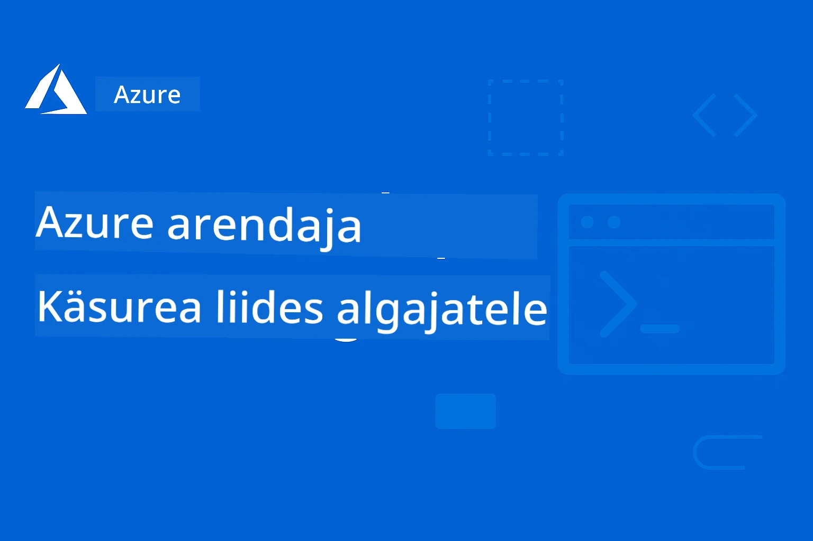

# AZD algajatele: struktuuritud õppeprogramm

 

[](https://GitHub.com/microsoft/azd-for-beginners/watchers/)
[](https://GitHub.com/microsoft/azd-for-beginners/network/)
[](https://GitHub.com/microsoft/azd-for-beginners/stargazers/)

[](https://discord.gg/microsoft-azure)
[](https://discord.gg/nTYy5BXMWG)

## Selle kursuse alustamine

Järgige neid samme, et alustada oma AZD õppimist:

1. **Forka hoidla**: Klõpsake [](https://GitHub.com/microsoft/azd-for-beginners/fork)
2. **Klooni hoidla**: `git clone https://github.com/microsoft/azd-for-beginners.git`
3. **Liitu kogukonnaga**: [Azure Discord Communities](https://discord.com/invite/ByRwuEEgH4) eksperttoe saamiseks
4. **Vali õpitee**: Valige allolevast peatükist see, mis vastab teie kogemustasemele

### Mitmekeelne tugi

#### Automaatne tõlge (alati ajakohane)

<!-- CO-OP TRANSLATOR LANGUAGES TABLE START -->
[Arabic](../ar/README.md) | [Bengali](../bn/README.md) | [Bulgarian](../bg/README.md) | [Burmese (Myanmar)](../my/README.md) | [Chinese (Simplified)](../zh-CN/README.md) | [Chinese (Traditional, Hong Kong)](../zh-HK/README.md) | [Chinese (Traditional, Macau)](../zh-MO/README.md) | [Chinese (Traditional, Taiwan)](../zh-TW/README.md) | [Croatian](../hr/README.md) | [Czech](../cs/README.md) | [Danish](../da/README.md) | [Dutch](../nl/README.md) | [Estonian](./README.md) | [Finnish](../fi/README.md) | [French](../fr/README.md) | [German](../de/README.md) | [Greek](../el/README.md) | [Hebrew](../he/README.md) | [Hindi](../hi/README.md) | [Hungarian](../hu/README.md) | [Indonesian](../id/README.md) | [Italian](../it/README.md) | [Japanese](../ja/README.md) | [Kannada](../kn/README.md) | [Korean](../ko/README.md) | [Lithuanian](../lt/README.md) | [Malay](../ms/README.md) | [Malayalam](../ml/README.md) | [Marathi](../mr/README.md) | [Nepali](../ne/README.md) | [Nigerian Pidgin](../pcm/README.md) | [Norwegian](../no/README.md) | [Persian (Farsi)](../fa/README.md) | [Polish](../pl/README.md) | [Portuguese (Brazil)](../pt-BR/README.md) | [Portuguese (Portugal)](../pt-PT/README.md) | [Punjabi (Gurmukhi)](../pa/README.md) | [Romanian](../ro/README.md) | [Russian](../ru/README.md) | [Serbian (Cyrillic)](../sr/README.md) | [Slovak](../sk/README.md) | [Slovenian](../sl/README.md) | [Spanish](../es/README.md) | [Swahili](../sw/README.md) | [Swedish](../sv/README.md) | [Tagalog (Filipino)](../tl/README.md) | [Tamil](../ta/README.md) | [Telugu](../te/README.md) | [Thai](../th/README.md) | [Turkish](../tr/README.md) | [Ukrainian](../uk/README.md) | [Urdu](../ur/README.md) | [Vietnamese](../vi/README.md)

> **Eelistate kohalikku kloonimist?**

> See hoidla sisaldab üle 50 keele tõlkeid, mis suurendab oluliselt allalaadimismahtu. Tõlgeteta kloonimiseks kasutage sparse checkout’i:
> ```bash
> git clone --filter=blob:none --sparse https://github.com/microsoft/AZD-for-beginners.git
> cd AZD-for-beginners
> git sparse-checkout set --no-cone '/*' '!translations' '!translated_images'
> ```
> See annab teile kõik vajaliku kursuse läbimiseks palju kiiremalt.
<!-- CO-OP TRANSLATOR LANGUAGES TABLE END -->

## Kursuse ülevaade

Omandage Azure Developer CLI (azd) oskused struktureeritud peatükkide kaudu, mis on loodud astmeliseks õppimiseks. **Eriti keskendudes AI rakenduste juurutamisele Microsoft Foundry integratsiooniga.**

### Miks see kursus on tänapäeva arendajatele oluline

Microsoft Foundry Discordi kogukonna põhjal soovib **45% arendajatest kasutada AZD-d AI töökoormuste jaoks**, kuid nad puutuvad kokku järgmiste väljakutsetega:
- Keerukad mitmesüsteemsed AI arhitektuurid
- Tootmise AI juurutamise parimad tavad  
- Azure AI teenuste integreerimine ja seadistamine
- Kulu optimeerimine AI töökoormuste jaoks
- AI-spetsiifiliste juurutusprobleemide tõrkeotsing

### Õpieesmärgid

Selle struktureeritud kursuse lõpetamisega:
- **Saate AZD põhitõed selgeks**: põhimõisted, installatsioon ja seadistamine
- **Juurutate AI rakendusi**: kasutades AZD-d Microsoft Foundry teenustega
- **Rakendate infrastruktuuri koodina**: Azure ressursside haldamine Bicep mallidega
- **Teete tõrkeotsingut**: lahendate levinud probleemid ja debugeerite
- **Optimeerite tootmistootmist**: turvalisus, skaleerimine, jälgimine ja kulude juhtimine
- **Ehitate mitmeagentuurilisi lahendusi**: juurutades keerukaid AI arhitektuure

## 📚 Õppepeatükid

*Valige endale sobiv õpitee kogemuse taseme ja eesmärkide järgi*

### 🚀 1. peatükk: Alused ja kiire algus
**Eeltingimused**: Azure tellimus, põhilised käsurea teadmised  
**Kestus**: 30-45 minutit  
**Keerukus**: ⭐

#### Mida õpite
- Azure Developer CLI põhialused
- AZD installimine teie platvormile
- Esimene edukas juurutus

#### Õppematerjalid
- **🎯 Alustage siit**: [Mis on Azure Developer CLI?](../..)
- **📖 Teooria**: [AZD põhitõed](docs/getting-started/azd-basics.md) - Põhimõisted ja terminid
- **⚙️ Seadistamine**: [Installeerimine ja seadistamine](docs/getting-started/installation.md) - Platvormispetsiifilised juhendid
- **🛠️ Praktiline**: [Teie esimene projekt](docs/getting-started/first-project.md) - Samm-sammuline juhend
- **📋 Kiirviide**: [Käsurea võtmeleht](resources/cheat-sheet.md)

#### Praktilised harjutused
```bash
# Kiire paigalduskontroll
azd version

# Paigalda oma esimene rakendus
azd init --template todo-nodejs-mongo
azd up
```

**💡 Peatüki tulemus**: Edukalt juurutada lihtne veebirakendus Azure’i kasutades AZD-d

**✅ Edu kinnitus:**
```bash
# Pärast peatüki 1 lõpetamist peaksid oskama:
azd version              # Kuvab installitud versiooni
azd init --template todo-nodejs-mongo  # Projekti initsialiseerib
azd up                  # Paigaldab Azure'i
azd show                # Kuvab töötava rakenduse URL-i
# Rakendus avaneb brauseris ja töötab
azd down --force --purge  # Ressursid koristab ära
```

**📊 Ajakulu:** 30-45 minutit  
**📈 Oskuste tase pärast:** Suudab iseseisvalt baastasemel rakendusi juurutada

**✅ Edu kinnitus:**
```bash
# Pärast peatüki 1 lõpetamist peaksite suutma:
azd version              # Kuvab paigaldatud versiooni
azd init --template todo-nodejs-mongo  # Algatab projekti
azd up                  # Juurutab Azure'i
azd show                # Kuvab töötava rakenduse URL-i
# Rakendus avaneb brauseris ja töötab
azd down --force --purge  # Koristab ressursid
```

**📊 Ajakulu:** 30-45 minutit  
**📈 Oskuste tase pärast:** Suudab iseseisvalt baastasemel rakendusi juurutada

---

### 🤖 2. peatükk: AI-esmane arendus (Soovitatav AI arendajatele)
**Eeltingimused**: 1. peatükk lõpetatud  
**Kestus**: 1-2 tundi  
**Keerukus**: ⭐⭐

#### Mida õpite
- Microsoft Foundry integratsioon koos AZD-ga
- AI-põhiste rakenduste juurutamine
- AI teenuse seadistuste mõistmine

#### Õppematerjalid
- **🎯 Alustage siit**: [Microsoft Foundry integratsioon](docs/microsoft-foundry/microsoft-foundry-integration.md)
- **📖 Mustrid**: [AI mudelite juurutamine](docs/microsoft-foundry/ai-model-deployment.md) - AI mudelite juurutamine ja haldamine
- **🛠️ Töötuba**: [AI Töötuba](docs/microsoft-foundry/ai-workshop-lab.md) - Tehke oma AI lahendused AZD-valmis
- **🎥 Interaktiivne juhend**: [Töötoa materjalid](workshop/README.md) - Brauseripõhine õppimine MkDocs * DevContainer keskkonnas
- **📋 Mallid**: [Microsoft Foundry mallid](../..)
- **📝 Näited**: [AZD juurutusnäited](examples/README.md)

#### Praktilised harjutused
```bash
# Käivitage oma esimene tehisintellekti rakendus
azd init --template azure-search-openai-demo
azd up

# Proovige täiendavaid tehisintellekti malle
azd init --template openai-chat-app-quickstart
azd init --template agent-openai-python-prompty
```

**💡 Peatüki tulemus**: Juurutage ja seadistage AI-põhine vestlusrakendus RAG võimekusega

**✅ Edu kinnitus:**
```bash
# Pärast 2. peatükki peaksid sa suutma:
azd init --template azure-search-openai-demo
azd up
# Testida AI vestluse liidest
# Esitada küsimusi ja saada AI-põhiseid vastuseid koos allikatega
# Kontrollida, et otsingu integreerimine toimib
azd monitor  # Kontrollida, et Application Insights näitab telemeetriat
azd down --force --purge
```

**📊 Ajakulu:** 1-2 tundi  
**📈 Oskuste tase pärast:** Suudab juurutada ja seadistada tootmiseks valmis AI rakendusi  
**💰 Kulude teadlikkus:** Mõistab arenduskulud $80-150/kuus, tootmiskulud $300-3500/kuus

#### 💰 Kulud AI juurutustele

**Arenduskeskkond (Hinnanguliselt $80–150 kuus):**
- Azure OpenAI (tasu kasutuse põhjal): $0-50/kuus (sõltuvalt tokenite kasutusest)
- AI Search (Basic tase): $75/kuus
- Container Apps (Tarbimine): $0-20/kuus
- Salvestusruum (Standard): $1-5/kuus

**Tootmiskeskkond (Hinnanguliselt $300–3,500+/kuus):**
- Azure OpenAI (PTU pidevaks jõudluseks): $3,000+/kuus VÕI Tasu kasutuse põhjal suure mahuga
- AI Search (Standard tase): $250/kuus
- Container Apps (Pühendatud): $50-100/kuus
- Application Insights: $5-50/kuus
- Salvestusruum (Premium): $10-50/kuus

**💡 Kuluoptimeerimise näpunäited:**
- Kasutage **Tasuta taset** Azure OpenAI õppimiseks (50 000 tokenit/kuus kaasas)
- Käivitage `azd down`, et vabastada ressursid, kui aktiivselt ei arendata
- Alustage tarbimispõhisest arvestusest, uuendage PTU-le ainult tootmises
- Kasutage `azd provision --preview`, et hinnata kulusid enne juurutamist
- Lubage automaatne skaleerimine: maksate ainult tegeliku kasutuse eest

**Kulude jälgimine:**
```bash
# Kontrolli hinnangulisi igakuiste kulutuste summasid
azd provision --preview

# Jälgi tegelikke kulutusi Azure'i portaalis
az consumption budget list --resource-group <your-rg>
```

---

### ⚙️ 3. peatükk: Seadistamine ja autentimine
**Eeltingimused**: 1. peatükk lõpetatud  
**Kestus**: 45-60 minutit  
**Keerukus**: ⭐⭐

#### Mida õpite
- Keskkonna seadistamine ja haldamine
- Autentimise ja turvalisuse parimad tavad
- Ressursside nimetamine ja organiseerimine

#### Õppematerjalid
- **📖 Seadistamine**: [Seadistamise juhend](docs/getting-started/configuration.md) - Keskkonna seadistus
- **🔐 Turvalisus**: [Autentimise mustrid ja hallatud identiteet](docs/getting-started/authsecurity.md) - Autentimise mustrid
- **📝 Näited**: [Andmebaasi rakenduse näide](examples/database-app/README.md) - AZD andmebaasi näited

#### Praktilised harjutused
- Konfigureerige mitmeid keskkondi (dev, staging, prod)
- Looge hallatud identiteedi autentimine
- Rakendage keskkonnapõhised seadistused

**💡 Peatüki tulemus**: Juhtida mitut keskkonda korrektselt autentimise ja turvalisusega

---

### 🏗️ 4. peatükk: Infrastruktuur koodina ja juurutamine
**Eeltingimused**: Peatükid 1-3 lõpetatud  
**Kestus**: 1-1,5 tundi  
**Keerukus**: ⭐⭐⭐

#### Mida õpite
- Täiustatud juurutusmustrid
- Infrastruktuur koodina Bicep abil
- Ressursside varustamise strateegiad

#### Õppematerjalid
- **📖 Juurutamine**: [Juurutamise juhend](docs/deployment/deployment-guide.md) - Täielikud töövood
- **🏗️ Ressursside varustamine**: [Ressursside loomine](docs/deployment/provisioning.md) - Azure ressursside haldamine
- **📝 Näited**: [Container App näide](../../examples/container-app) - Konteineripõhised juurutused

#### Praktilised harjutused
- Looge kohandatud Bicep mallid
- Juurutage mitmesüsteemseid rakendusi
- Rakendage sinine-roheline juurutusstrateegia

**💡 Peatüki tulemus**: Juurutada keerukaid mitmesüsteemseid rakendusi kasutades kohandatud infrastruktuuri malle

---

### 🎯 5. peatükk: Mitmeagentuurilised AI lahendused (Täpsem)  
**Eeltingimused**: Peatükid 1-2 lõpetatud  
**Kestus**: 2-3 tundi  
**Keerukus**: ⭐⭐⭐⭐
#### Mida Sa Õpid
- Mitmeagendi arhitektuuri mustrid
- Agentide orkestreerimine ja koordineerimine
- Tootmiskõlblikud tehisintellekti juurutused

#### Õppematerjalid
- **🤖 Esiletõstetud Projekt**: [Jaemüügi mitmeagendi lahendus](examples/retail-scenario.md) - Täielik lahendus
- **🛠️ ARM mallid**: [ARM malli pakett](../../examples/retail-multiagent-arm-template) - Ühe klõpsuga juurutus
- **📖 Arhitektuur**: [Mitmeagendi koordineerimismustrid](/docs/pre-deployment/coordination-patterns.md) - Mustrid

#### Praktilised Harjutused
```bash
# Rakendage täielik jaemüügiks mõeldud mitmeagentide lahendus
cd examples/retail-multiagent-arm-template
./deploy.sh

# Uurige agentide konfiguratsioone
az deployment group show --resource-group <rg-name> --name <deployment-name>
```

**💡 Peatüki tulemus**: Juuruta ja halda tootmiskõlblikku mitmeagendi tehisintellekti lahendust koos Kliendi ja Laoseis agentidega

---

### 🔍 Peatükk 6: Eeljuurutuse valideerimine ja planeerimine
**Eeldused**: Peatükk 4 lõpetatud  
**Kestus**: 1 tund  
**Kompleksus**: ⭐⭐

#### Mida Sa Õpid
- Võimsusplaneerimine ja ressursside valideerimine
- SKU valikustrateegiad
- Eelkontrollid ja automatiseerimine

#### Õppematerjalid
- **📊 Planeerimine**: [Võimsusplaneerimine](docs/pre-deployment/capacity-planning.md) - Ressursside valideerimine
- **💰 Valik**: [SKU valik](docs/pre-deployment/sku-selection.md) - Kuluefektiivsed valikud
- **✅ Valideerimine**: [Eelkontrollid](docs/pre-deployment/preflight-checks.md) - Automatiseeritud skriptid

#### Praktilised Harjutused
- Käivita võimsuse valideerimise skripte
- Optimeeri SKU valikuid kulude jaoks
- Rakenda automatiseeritud eeljuurutuse kontrollid

**💡 Peatüki tulemus**: Valideeri ja optimeeri juurutusi enne teostamist

---

### 🚨 Peatükk 7: Tõrkeotsing ja silumine
**Eeldused**: Ükskõik milline juurutuspeatükk lõpetatud  
**Kestus**: 1-1.5 tundi  
**Kompleksus**: ⭐⭐

#### Mida Sa Õpid
- Süstemaatilised silumismeetodid
- Levinud probleemid ja lahendused
- Tehisintellekti spetsiifiline tõrkeotsing

#### Õppematerjalid
- **🔧 Levinud probleemid**: [Levinud probleemid](docs/troubleshooting/common-issues.md) - KKK ja lahendused
- **🕵️ Silumine**: [Silumise juhend](docs/troubleshooting/debugging.md) - Samm-sammult strateegiad
- **🤖 TI probleemid**: [Tehisintellekti tõrkeotsing](docs/troubleshooting/ai-troubleshooting.md) - AI teenuste probleemid

#### Praktilised Harjutused
- Diagnostiseeri juurutusvigasid
- Lahenda autentimisprobleeme
- Silu AI teenuse ühenduvust

**💡 Peatüki tulemus**: Iseseisvalt diagnoosi ja lahenda levinud juurutusprobleeme

---

### 🏢 Peatükk 8: Tootmis- ja ärimustrid
**Eeldused**: Peatükid 1-4 lõpetatud  
**Kestus**: 2-3 tundi  
**Kompleksus**: ⭐⭐⭐⭐

#### Mida Sa Õpid
- Tootmisjuurutuse strateegiad
- Ettevõtte turvamustrid
- Monitooring ja kulude optimeerimine

#### Õppematerjalid
- **🏭 Tootmine**: [Tootmise tehisintellekti parimad praktikad](docs/microsoft-foundry/production-ai-practices.md) - Ettevõtte mustrid
- **📝 Näited**: [Mikroteenuste näide](../../examples/microservices) - Kompleksne arhitektuur
- **📊 Monitooring**: [Application Insights integratsioon](docs/pre-deployment/application-insights.md) - Monitooring

#### Praktilised Harjutused
- Rakenda ettevõtte turvamustreid
- Sea üles põhjalik monitooring
- Juuruta tootmisse koos nõuetekohase haldusega

**💡 Peatüki tulemus**: Juuruta ettevõtte tasemel rakendusi täisfunktsionaalsusega tootmiskeskkonnas

---

## 🎓 Töötuba Ülevaade: Praktiline Õppimiskogemus

> **⚠️ TÖÖTOA STAATUS: Arendusjärgus**  
> Töötuba materjalid on hetkel arendamisel ja täiendamisel. Põhimoodulid on toimivad, kuid mõned arenenumad osad alles lõpetamisel. Töötame aktiivselt kogu sisu lõpetamiseks. [Jälgi edenemist →](workshop/README.md)

### Interaktiivsed Töötuba Materjalid
**Kattuv praktiline õppimine brauseripõhiste tööriistade ja juhendatud harjutustega**

Meie töötuba pakub struktureeritud, interaktiivset õppimiskogemust, mis täiendab ülaltoodud peatükipõhist õppekava. Töötuba sobib nii iseseisvaks õppimiseks kui ka juhendatud sessioonideks.

#### 🛠️ Töötuba Omadused
- **Brauseripõhine liides**: Täielik MkDocs-l põhinev töötuba koos otsingu, kopeerimise ja teemade funktsioonidega
- **GitHub Codespaces Integratsioon**: Ühe klõpsuga arenduskeskkonna seadistus
- **Struktureeritud õppeprotsess**: 7-sammulised juhendatud harjutused (kokku 3,5 tundi)
- **Avastamine → Juurutus → Kohandamine**: Progressiivne metoodika
- **Interaktiivne DevContainer keskkond**: Eelseadistatud tööriistad ja sõltuvused

#### 📚 Töötuba Struktuur
Töötuba järgib **Avastamine → Juurutus → Kohandamine** metoodikat:

1. **Avastusfaas** (45 minutit)
   - Uuri Microsoft Foundry malle ja teenuseid
   - Mõista mitmeagendi arhitektuurimustreid
   - Vaata üle juurutuse nõuded ja eeldused

2. **Juurutusfaas** (2 tundi)
   - Käsi-külge tehisintellekti rakenduste juurutamine AZD-ga
   - Konfigureeri Azure AI teenuseid ja lõpp-punkte
   - Rakenda turva- ja autentimismustreid

3. **Kohandamisfaas** (45 minutit)
   - Muuda rakendusi spetsiifilisteks kasutusjuhtudeks
   - Optimeeri tootmisjuurutuseks
   - Rakenda monitooringut ja kulude juhtimist

#### 🚀 Töötuba Alustamine
```bash
# Valik 1: GitHub Codespaces (Soovitatav)
# Klõpsake "Code" → "Create codespace on main" hoidlas

# Valik 2: Kohalik arendus
git clone https://github.com/microsoft/azd-for-beginners.git
cd azd-for-beginners/workshop
# Järgige juhiseid failis workshop/README.md
```


#### 🎯 Töötuba Õpitulemused
Töötuba lõpetades suudad:
- **Juurutada tootmise AI rakendusi**: Kasuta AZD-d koos Microsoft Foundry teenustega
- **Valdada mitmeagendi arhitektuure**: Rakendada koordineeritud AI agentide lahendusi
- **Rakendada turbe parimaid tavasid**: Konfigureeri autentimist ja juurdepääsukontrolli
- **Optimeerida skaleeritavust**: Kujundada kuluefektiivseid ja jõudlusele orienteeritud juurutusi
- **Tõrkeotsing juurutustel**: Iseseisvalt lahendada levinud probleemid

#### 📖 Töötuba Ressursid
- **🎥 Interaktiivne juhend**: [Töötuba materjalid](workshop/README.md) - Brauseripõhine õppimiskeskkond
- **📋 Samm-sammult juhised**: [Juhendatud harjutused](../../workshop/docs/instructions) - Detailne läbivaatus
- **🛠️ AI töötuba labor**: [AI töötuba labor](docs/microsoft-foundry/ai-workshop-lab.md) - AI-keskse õppematerjal
- **💡 Kiirkäivitus**: [Töötuba seadistamise juhend](workshop/README.md#quick-start) - Keskkonna konfigureerimine

**Sobib ideaalselt**: Ettevõtete koolituseks, ülikoolikursusteks, iseseisvaks õppeks ja arendajate bootcampideks.

---

## 📖 Mis on Azure Developer CLI?

Azure Developer CLI (azd) on arendajale suunatud käsurealiides, mis kiirendab rakenduste loomise ja juurutamise protsessi Azure'i keskkonnas. See pakub:

- **Malli-põhised juurutused** - Kasuta eelvalmisseatud malle tavaliste rakenduse mustrite jaoks
- **Infrastruktuur koodina** - Halda Azure ressursse Bicep või Terraform abil  
- **Integreeritud töövood** - Sujuv varustus, juurutus ja monitooring
- **Arendajasõbralik** - Optimeeritud arendajate tootlikkuseks ja kogemuseks

### **AZD + Microsoft Foundry: Täiuslik AI Juurutusteks**

**Miks valida AZD AI lahenduste jaoks?** AZD lahendab AI arendajate suurimad väljakutsed:

- **AI-valmis mallid** - Eelseatud mallid Azure OpenAI, Cognitive Servicede ja ML töökoormuste jaoks
- **Turvalised AI juurutused** - Sisseehitatud turvamustrid AI teenustele, API võtmetele ja mudelite lõpp-punktidele  
- **Tootmise AI mustrid** - Parimad praktikad skaleeritavate, kulutõhusate AI rakenduste jaoks
- **Täielikud AI töövood** - Mudeli arendusest tootmisjuurutuseni koos monitooringuga
- **Kulude optimeerimine** - Nutikad ressursijaotuse ja skaala strateegiad AI töökoormustele
- **Microsoft Foundry integratsioon** - Sujuv ühendus Microsoft Foundry mudelikataloogi ja lõpp-punktidega

---

## 🎯 Mallide ja Näidiste Teek

### Esiletõstetud: Microsoft Foundry Mallid
**Alusta siit, kui juurutad AI rakendusi!**

> **Märkus:** Need mallid demonstreerivad erinevaid AI mustreid. Mõned on välised Azure proovivõtud, teised lokaalsed rakendused.

| Mall | Peatükk | Kompleksus | Teenused | Tüüp |
|----------|---------|------------|----------|------|
| [**Alusta AI vestlusega**](https://github.com/Azure-Samples/get-started-with-ai-chat) | Peatükk 2 | ⭐⭐ | AzureOpenAI + Azure AI mudelipäring + Azure AI otsing + Azure Container Apps + Application Insights | Välis- |
| [**Alusta AI agentidega**](https://github.com/Azure-Samples/get-started-with-ai-agents) | Peatükk 2 | ⭐⭐ | Azure AI Agent teenus + AzureOpenAI + Azure AI otsing + Azure Container Apps + Application Insights | Välis- |
| [**Azure Search + OpenAI Demo**](https://github.com/Azure-Samples/azure-search-openai-demo) | Peatükk 2 | ⭐⭐ | AzureOpenAI + Azure AI otsing + App Service + Storage | Välis- |
| [**OpenAI vestlustööriista kiirkäivitus**](https://github.com/Azure-Samples/openai-chat-app-quickstart) | Peatükk 2 | ⭐ | AzureOpenAI + Container Apps + Application Insights | Välis- |
| [**Agent OpenAI Python Prompty**](https://github.com/Azure-Samples/agent-openai-python-prompty) | Peatükk 5 | ⭐⭐⭐ | AzureOpenAI + Azure Functions + Prompty | Välis- |
| [**Contoso Chat RAG**](https://github.com/Azure-Samples/contoso-chat) | Peatükk 8 | ⭐⭐⭐⭐ | AzureOpenAI + AI otsing + Cosmos DB + Container Apps | Välis- |
| [**Jaemüügi mitmeagendi lahendus**](examples/retail-scenario.md) | Peatükk 5 | ⭐⭐⭐⭐ | AzureOpenAI + AI otsing + Storage + Container Apps + Cosmos DB | **Lokaalne** |

### Esiletõstetud: Täielikud Õppimissituatsioonid
**Tootmiskõlblikud rakendusmallid seotud õppepeatükkidega**

| Mall | Õppepeatükk | Kompleksus | Peamine Õppepunkt |
|----------|------------------|------------|--------------|
| [**openai-chat-app-quickstart**](https://github.com/Azure-Samples/openai-chat-app-quickstart) | Peatükk 2 | ⭐ | Põhilised AI juurutusmustrid |
| [**azure-search-openai-demo**](https://github.com/Azure-Samples/azure-search-openai-demo) | Peatükk 2 | ⭐⭐ | RAG rakendus Azure AI otsinguga |
| [**ai-document-processing**](https://github.com/Azure-Samples/ai-document-processing) | Peatükk 4 | ⭐⭐ | Dokumendi intelligentsuse integratsioon |
| [**agent-openai-python-prompty**](https://github.com/Azure-Samples/agent-openai-python-prompty) | Peatükk 5 | ⭐⭐⭐ | Agendi raamistik ja funktsioonide kutsumine |
| [**contoso-chat**](https://github.com/Azure-Samples/contoso-chat) | Peatükk 8 | ⭐⭐⭐ | Ettevõtte AI orkestreerimine |
| [**retail-multi-agent-solution**](examples/retail-scenario.md) | Peatükk 5 | ⭐⭐⭐⭐ | Mitmeagendi arhitektuur koos Kliendi ja Laoseis agentidega |

### Õppimine Näidete Lõikes

> **📌 Kohalikud vs. Välised Näited:**  
> **Kohalikud näited** (selles reposis) = Koheselt kasutamiseks valmis  
> **Välised näited** (Azure Samples) = Kloonida seotud hoidlatesse

#### Kohalikud Näited (Valmis Kasutada)
- [**Jaemüügi mitmeagendi lahendus**](examples/retail-scenario.md) - Täielik tootmiskõlblik rakendus koos ARM mallidega
  - Mitmeagendi arhitektuur (Kliendi ja Laoseis agendid)
  - Täielik monitooring ja hindamine
  - Ühe klõpsuga juurutus ARM malliga

#### Kohalikud Näited - Konteinerirakendused (Peatükid 2-5)
**Lai valik konteineripõhiseid juurutusnäiteid selles reposis:**
- [**Konteinerirakenduse näited**](examples/container-app/README.md) - Täielik juhend konteineripõhiste juurutuste jaoks
  - [Lihtne Flask API](../../examples/container-app/simple-flask-api) - Põhiline REST API koos scale-to-zero võimalusega
  - [Mikroteenuste arhitektuur](../../examples/container-app/microservices) - Tootmiskõlblik mitmeteenuseline juurutus
  - Kiirkäivitus, tootmine ja arenenud juurutusmustrid
  - Monitooring, turve ja kulude optimeerimise juhised

#### Välised Näited - Lihtsad Rakendused (Peatükid 1-2)
**Klooni need Azure Sample repod, et alustada:**
- [Lihtne veebirakendus - Node.js + MongoDB](https://github.com/Azure-Samples/todo-nodejs-mongo) - Põhilised juurutusmustrid
- [Staatiline veebileht - React SPA](https://github.com/Azure-Samples/todo-csharp-sql-swa-func) - Staatilise sisu juurutus
- [Konteinerirakendus - Python Flask](https://github.com/Azure-Samples/container-apps-store-api-microservice) - REST API juurutus

#### Välised Näited - Andmebaasi Integratsioon (Peatükid 3-4)  
- [Andmebaasi rakendus - C# + SQL](https://github.com/Azure-Samples/todo-csharp-sql) - Andmebaasi ühenduvusmustrid
- [Funktsioonid + Cosmos DB](https://github.com/Azure-Samples/todo-python-mongo-swa-func) - Serverita andmevoog

#### Välised Näited - Arenenud Mustrid (Peatükid 4-8)
- [Java mikroteenused](https://github.com/Azure-Samples/java-microservices-aca-lab) - Mitmeteenuseline arhitektuur
- [Konteinerirakendused tööülesannetega](https://github.com/Azure-Samples/container-apps-jobs) - Taustaprotsessid  
- [Ettevõtte ML töövoog](https://github.com/Azure-Samples/mlops-v2) - Tootmiskõlblikud ML mustrid

### Välised Malli Kogumikud
- [**Ametlik AZD malli galerii**](https://azure.github.io/awesome-azd/) - Valitud ametlike ja kogukonna mallide kogu
- [**Azure Developer CLI mallid**](https://learn.microsoft.com/en-us/azure/developer/azure-developer-cli/azd-templates) - Microsoft Learn mallide dokumentatsioon
- [**Näidiste kataloog**](examples/README.md) - Kohalikud õppimise näited koos üksikasjalike seletustega

---

## 📚 Õppematerjalid ja viited

### Kiired viited
- [**Käsu petuleht**](resources/cheat-sheet.md) - Olulised azd käsud peatükkide kaupa organiseeritud
- [**Sõnastik**](resources/glossary.md) - Azure ja azd terminoloogia  
- [**KKK**](resources/faq.md) - Levinud küsimused õppimispeatükkide kaupa organiseeritud
- [**Õpijuhend**](resources/study-guide.md) - Ulatuslikud praktilised harjutused

### Käed-külge töötoad
- [**AI töötoa labor**](docs/microsoft-foundry/ai-workshop-lab.md) - Tehke oma tehisintellekti lahendused AZD-lahenduseks (2-3 tundi)
- [**Interaktiivne töötoa juhend**](workshop/README.md) - Brauseripõhine töötoa juhend MkDocs ja DevContainer keskkonnaga
- [**Struktureeritud õppeteekond**](../../workshop/docs/instructions) - 7-astmeline juhendatud harjutuste rada (Avastus → Juhtimine → Kohandamine)
- [**AZD algajatele töötoa materjalid**](workshop/README.md) - Täielik käed-külge töötoa materjalide komplekt koos GitHub Codespaces integratsiooniga

### Välised õppematerjalid
- Azure Developer CLI dokumentatsioon (https://learn.microsoft.com/en-us/azure/developer/azure-developer-cli/)
- Azure arhitektuurikeskus (https://learn.microsoft.com/en-us/azure/architecture/)
- Azure hinnakalkulaator (https://azure.microsoft.com/pricing/calculator/)
- Azure oleku leht (https://status.azure.com/)

---

## 🔧 Kiire tõrkeotsingu juhend

**Algajate sagedased probleemid ja kohesed lahendused:**

### ❌ "azd: käsku ei leitud"

```bash
# Paigalda esmalt AZD
# Windows (PowerShell):
winget install microsoft.azd

# macOS:
brew tap azure/azd && brew install azd

# Linux:
curl -fsSL https://aka.ms/install-azd.sh | bash

# Kontrolli paigaldust
azd version
```

### ❌ "Tellimust ei leitud" või "Tellimus pole määratud"

```bash
# Loendi saadaval olevad tellimused
az account list --output table

# Määra vaikimisi tellimus
az account set --subscription "<subscription-id-or-name>"

# Määra AZD keskkonnale
azd env set AZURE_SUBSCRIPTION_ID "<subscription-id>"

# Kontrolli
az account show
```

### ❌ "Piirang ületatud" või "Kvoot ei piisa"

```bash
# Proovi erinevat Azure'i piirkonda
azd env set AZURE_LOCATION "westus2"
azd up

# Või kasuta arenduses väiksemaid SKU-sid
# Muuda infra/main.parameters.json:
{
  "sku": "B1"  // Instead of "P1V2"
}
```

### ❌ "azd up" peatub poole peal

```bash
# Valik 1: Puhasta ja proovi uuesti
azd down --force --purge
azd up

# Valik 2: Paranda ainult infrastruktuur
azd provision

# Valik 3: Kontrolli üksikasjalikke logisid
azd show
azd logs
```

### ❌ "Autentimine ebaõnnestus" või "Token on aegunud"

```bash
# Autentige uuesti
az logout
az login

azd auth logout
azd auth login

# Kontrollige autentimist
az account show
```

### ❌ "Vara on juba olemas" või nimede konfliktid

```bash
# AZD genereerib unikaalseid nimesid, kuid kui tekib konflikt:
azd down --force --purge

# Proovi siis uuesti värske keskkonnaga
azd env new dev-v2
azd up
```

### ❌ Malli juurutus võtab liiga kaua aega

**Tavalised ooteajad:**
- Lihtne veebirakendus: 5-10 minutit
- Rakendus koos andmebaasiga: 10-15 minutit
- AI rakendused: 15-25 minutit (OpenAI juurutamine on aeglane)

```bash
# Kontrolli edenemist
azd show

# Kui kinni >30 minutit, vaata Azure Portaal:
azd monitor
# Otsi ebaõnnestunud juurutusi
```

### ❌ "Luba keelatud" või "Keelatud"

```bash
# Kontrolli oma Azure rolli
az role assignment list --assignee $(az account show --query user.name -o tsv)

# Sul peab olema vähemalt "Contributor" roll
# Palu oma Azure administraatoril anda:
# - Contributor (ressursside jaoks)
# - User Access Administrator (rolli määramiseks)
```

### ❌ Juurutatud rakenduse URL-i ei leita

```bash
# Näita kõiki teenuse lõpp-punkte
azd show

# Või ava Azure Portaal
azd monitor

# Kontrolli kindlat teenust
azd env get-values
# Otsi *_URL muutujad
```

### 📚 Täielikud tõrkeotsingu ressursid

- **Levinud probleemide juhend:** [Üksikasjalikud lahendused](docs/troubleshooting/common-issues.md)
- **AI spetsiifilised probleemid:** [AI tõrkeotsing](docs/troubleshooting/ai-troubleshooting.md)
- **Silumine:** [Samm-sammult silumine](docs/troubleshooting/debugging.md)
- **Abi saamine:** [Azure Discord](https://discord.gg/microsoft-azure) #azure-developer-cli

---

## 🔧 Kiire tõrkeotsingu juhend

**Algajate sagedased probleemid ja kohesed lahendused:**

<details>
<summary><strong>❌ "azd: käsku ei leitud"</strong></summary>

```bash
# Installi esmalt AZD
# Windows (PowerShell):
winget install microsoft.azd

# macOS:
brew tap azure/azd && brew install azd

# Linux:
curl -fsSL https://aka.ms/install-azd.sh | bash

# Kinnita installatsioon
azd version
```
</details>

<details>
<summary><strong>❌ "Tellimust ei leitud" või "Tellimus pole määratud"</strong></summary>

```bash
# Kuvada saadaolevad tellimused
az account list --output table

# Määra vaikimisi tellimus
az account set --subscription "<subscription-id-or-name>"

# Määra AZD keskkonna jaoks
azd env set AZURE_SUBSCRIPTION_ID "<subscription-id>"

# Kontrolli
az account show
```
</details>

<details>
<summary><strong>❌ "Piirang ületatud" või "Kvoot ei piisa"</strong></summary>

```bash
# Proovi erinevat Azure'i piirkonda
azd env set AZURE_LOCATION "westus2"
azd up

# Või kasuta arenduses väiksemaid SKU-sid
# Muuda faili infra/main.parameters.json:
{
  "sku": "B1"  // Instead of "P1V2"
}
```
</details>

<details>
<summary><strong>❌ "azd up" peatub poole peal</strong></summary>

```bash
# Variant 1: Puhasta ja proovi uuesti
azd down --force --purge
azd up

# Variant 2: Paranda ainult infrastruktuuri
azd provision

# Variant 3: Kontrolli üksikasjalikke logisid
azd show
azd logs
```
</details>

<details>
<summary><strong>❌ "Autentimine ebaõnnestus" või "Token on aegunud"</strong></summary>

```bash
# Autentige uuesti
az logout
az login

azd auth logout
azd auth login

# Kontrollige autentimist
az account show
```
</details>

<details>
<summary><strong>❌ "Vara on juba olemas" või nimede konfliktid</strong></summary>

```bash
# AZD genereerib unikaalseid nimesid, kuid kui tekib konflikt:
azd down --force --purge

# Siis proovi uuesti uue keskkonnaga
azd env new dev-v2
azd up
```
</details>

<details>
<summary><strong>❌ Malli juurutus võtab liiga kaua aega</strong></summary>

**Tavalised ooteajad:**
- Lihtne veebirakendus: 5-10 minutit
- Rakendus koos andmebaasiga: 10-15 minutit
- AI rakendused: 15-25 minutit (OpenAI juurutamine on aeglane)

```bash
# Kontrolli edenemist
azd show

# Kui ummikus rohkem kui 30 minutit, vaata Azure'i portaali:
azd monitor
# Otsi ebaõnnestunud juurutusi
```
</details>

<details>
<summary><strong>❌ "Luba keelatud" või "Keelatud"</strong></summary>

```bash
# Kontrolli oma Azure'i rolli
az role assignment list --assignee $(az account show --query user.name -o tsv)

# Sul peab olema vähemalt "Kaastööline" roll
# Palu oma Azure administraatoril anda:
# - Kaastööline (ressursside jaoks)
# - Kasutaja juurdepääsu administraator (rolli määrangute jaoks)
```
</details>

<details>
<summary><strong>❌ Juurutatud rakenduse URL-i ei leita</strong></summary>

```bash
# Kuvage kõik teenuse lõpp-punktid
azd show

# Või avage Azure portaal
azd monitor

# Kontrollige konkreetset teenust
azd env get-values
# Otsige *_URL muutujad
```
</details>

### 📚 Täielikud tõrkeotsingu ressursid

- **Levinud probleemide juhend:** [Üksikasjalikud lahendused](docs/troubleshooting/common-issues.md)
- **AI spetsiifilised probleemid:** [AI tõrkeotsing](docs/troubleshooting/ai-troubleshooting.md)
- **Silumine:** [Samm-sammult silumine](docs/troubleshooting/debugging.md)
- **Abi saamine:** [Azure Discord](https://discord.gg/microsoft-azure) #azure-developer-cli

---

## 🎓 Kursuse lõpetamine ja sertifitseerimine

### Edusammude jälgimine
Jälgi oma õppimise edenemist iga peatüki lõikes:

- [ ] **Peatükk 1**: Alused ja kiire algus ✅
- [ ] **Peatükk 2**: AI-esmane arendus ✅  
- [ ] **Peatükk 3**: Konfiguratsioon ja autentimine ✅
- [ ] **Peatükk 4**: Infrastruktuur koodina ja juurutamine ✅
- [ ] **Peatükk 5**: Mitmeagendi AI lahendused ✅
- [ ] **Peatükk 6**: Eeljuurutuse valideerimine ja planeerimine ✅
- [ ] **Peatükk 7**: Tõrkeotsing ja silumine ✅
- [ ] **Peatükk 8**: Tootmise ja ettevõtte mustrid ✅

### Õppimise tõestamine
Pärast iga peatüki lõpetamist kinnita oma teadmisi, tehes järgmist:
1. **Praktiline harjutus**: Tee peatüki käed-külge juurutus valmis
2. **Teadmiste kontroll**: Loe oma peatüki KKK jaotist
3. **Kogukonna arutelu**: Jaga oma kogemust Azure Discordis
4. **Järgmine peatükk**: Liigu järgmisele keerukuse tasemele

### Kursuse lõpetamise eelised
Pärast kõigi peatükkide lõpetamist oled saavutanud:
- **Tootmiskogemus**: Juurutanud reaalseid AI rakendusi Azure keskkonda
- **Professionaalsed oskused**: Ettevõttevalmis juurutamise võimekused  
- **Kogukonna tunnustus**: Aktiivne Azure arendajate kogukonna liige
- **Karjääriedu**: Nõutud AZD ja AI juurutamise ekspertis

---

## 🤝 Kogukond ja tugi

### Abi saamine ja tugi
- **Tehnilised probleemid**: [Teatage vigadest ja esitage funktsioonisoove](https://github.com/microsoft/azd-for-beginners/issues)
- **Õppeküsimused**: [Microsoft Azure Discordi kogukond](https://discord.gg/microsoft-azure) ja [](https://discord.gg/nTYy5BXMWG)
- **AI-spetsiifiline abi**: Liitu [](https://discord.gg/nTYy5BXMWG)
- **Dokumentatsioon**: [Ametlik Azure Developer CLI dokumentatsioon](https://learn.microsoft.com/en-us/azure/developer/azure-developer-cli/)

### Kogukonna ülevaated Microsoft Foundry Discordist

**Hiljutiste #Azure kanali küsitluste tulemused:**
- **45%** arendajatest soovib kasutada AZD-d AI töökoormuste jaoks
- **Peamised väljakutsed**: Mitme teenuse juurutus, volituste haldus, tootmisvalmidus  
- **Kõige nõutumad:** AI-spetsiifilised mallid, tõrkeotsingu juhendid, parimad tavad

**Liitu meie kogukonnaga, et:**
- Jagada oma AZD + AI kogemusi ja saada abi
- Saada varajasi eelvaateid uutele AI mallidele
- Panustada AI juurutamise parimatesse tavadesse
- Mõjutada tulevasi AI + AZD funktsioone

### Kursusele panustamine
Ootame panuseid! Loe meie [Panustamise juhendit](CONTRIBUTING.md) üksikasjade saamiseks:
- **Sisu parandused**: Täienda olemasolevaid peatükke ja näiteid
- **Uued näited**: Lisa reaalsed stsenaariumid ja mallid  
- **Tõlkimine**: Aita hoida mitmekeelsust
- **Vigade raportid**: Paranda täpsust ja selgust
- **Kogukonna standardid**: Järgi kaasava kogukonna juhiseid

---

## 📄 Kursuse info

### Litsents
See projekt on litsentseeritud MIT litsentsi all - vaata [LICENSE](../../LICENSE) faili lisateabe saamiseks.

### Seotud Microsofti õppematerjalid

Meie meeskond toodab ka teisi põhjalikke õppemodule:

<!-- CO-OP TRANSLATOR OTHER COURSES START -->
### LangChain
[](https://aka.ms/langchain4j-for-beginners)
[](https://aka.ms/langchainjs-for-beginners?WT.mc_id=m365-94501-dwahlin)
[](https://github.com/microsoft/langchain-for-beginners?WT.mc_id=m365-94501-dwahlin)
---

### Azure / Edge / MCP / Agendid
[](https://github.com/microsoft/AZD-for-beginners?WT.mc_id=academic-105485-koreyst)
[](https://github.com/microsoft/edgeai-for-beginners?WT.mc_id=academic-105485-koreyst)
[](https://github.com/microsoft/mcp-for-beginners?WT.mc_id=academic-105485-koreyst)
[](https://github.com/microsoft/ai-agents-for-beginners?WT.mc_id=academic-105485-koreyst)

---
 
### Generatiivse tehisintellekti sari
[](https://github.com/microsoft/generative-ai-for-beginners?WT.mc_id=academic-105485-koreyst)
[-9333EA?style=for-the-badge&labelColor=E5E7EB&color=9333EA)](https://github.com/microsoft/Generative-AI-for-beginners-dotnet?WT.mc_id=academic-105485-koreyst)
[-C084FC?style=for-the-badge&labelColor=E5E7EB&color=C084FC)](https://github.com/microsoft/generative-ai-for-beginners-java?WT.mc_id=academic-105485-koreyst)
[-E879F9?style=for-the-badge&labelColor=E5E7EB&color=E879F9)](https://github.com/microsoft/generative-ai-with-javascript?WT.mc_id=academic-105485-koreyst)

---
 
### Põhiõpe
[](https://aka.ms/ml-beginners?WT.mc_id=academic-105485-koreyst)
[](https://aka.ms/datascience-beginners?WT.mc_id=academic-105485-koreyst)
[](https://aka.ms/ai-beginners?WT.mc_id=academic-105485-koreyst)
[](https://github.com/microsoft/Security-101?WT.mc_id=academic-96948-sayoung)
[](https://aka.ms/webdev-beginners?WT.mc_id=academic-105485-koreyst)
[](https://aka.ms/iot-beginners?WT.mc_id=academic-105485-koreyst)
[](https://github.com/microsoft/xr-development-for-beginners?WT.mc_id=academic-105485-koreyst)

---
 
### Copilot'i sari
[](https://aka.ms/GitHubCopilotAI?WT.mc_id=academic-105485-koreyst)
[](https://github.com/microsoft/mastering-github-copilot-for-dotnet-csharp-developers?WT.mc_id=academic-105485-koreyst)
[](https://github.com/microsoft/CopilotAdventures?WT.mc_id=academic-105485-koreyst)
<!-- CO-OP TRANSLATOR OTHER COURSES END -->

---

## 🗺️ Kursuse navigeerimine

**🚀 Oled valmis õppima alustama?**

**Algajad**: Alusta [1. peatükk: Alused ja kiire algus](../..)  
**AI arendajad**: Hüpata [2. peatükk: AI-esimene arendus](../..)  
**Kogenud arendajad**: Alusta [3. peatükk: Konfiguratsioon ja autentimine](../..)

**Järgmised sammud**: [Alusta 1. peatükist – AZD põhialused](docs/getting-started/azd-basics.md) →

---

<!-- CO-OP TRANSLATOR DISCLAIMER START -->
**Vastutusest loobumine**:
See dokument on tõlgitud kasutades tehisintellekti tõlketeenust [Co-op Translator](https://github.com/Azure/co-op-translator). Kuigi püüame täpsust, palun pidage meeles, et automaatsed tõlked võivad sisaldada vigu või ebatäpsusi. Originaaldokument selle emakeeles tuleks pidada autoriteetseks allikaks. Olulise teabe puhul soovitatakse kasutada professionaalset inimtõlget. Me ei vastuta selle tõlke kasutamisest tingitud arusaamatuste või valesti mõistmiste eest.
<!-- CO-OP TRANSLATOR DISCLAIMER END -->