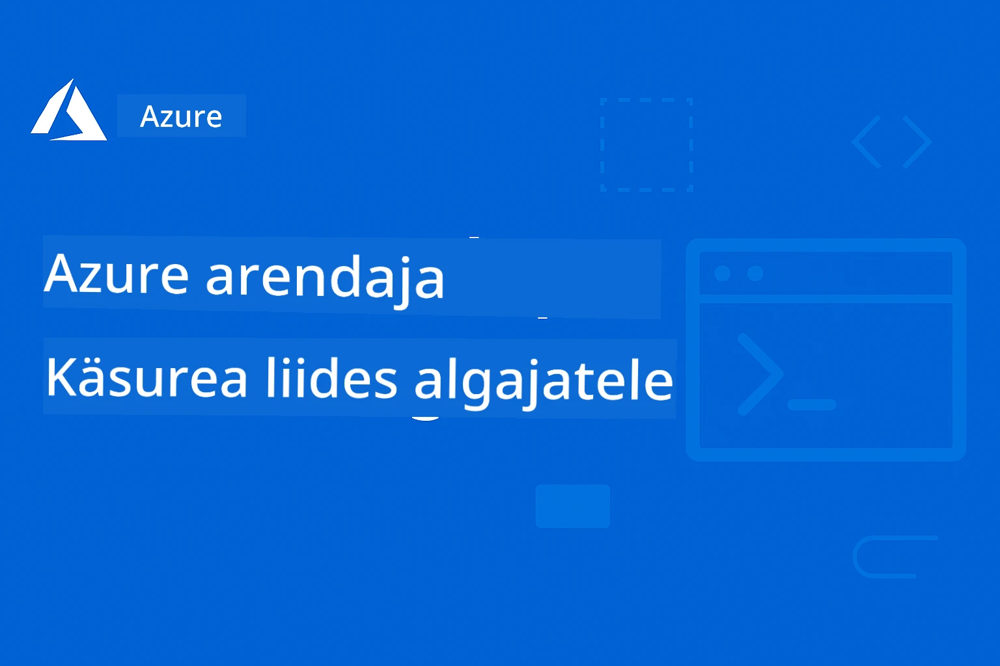

# AZD Algajatele: Struktureeritud Õppimise Teekond

 

[](https://GitHub.com/microsoft/azd-for-beginners/watchers/)
[](https://GitHub.com/microsoft/azd-for-beginners/network/)
[](https://GitHub.com/microsoft/azd-for-beginners/stargazers/)

[](https://discord.gg/microsoft-azure)
[](https://discord.gg/nTYy5BXMWG)

---

### Automaatne Tõlge (Alati Värsked)

<!-- CO-OP TRANSLATOR LANGUAGES TABLE START -->
[Araabia](../ar/README.md) | [Bengali](../bn/README.md) | [Bulgaaria](../bg/README.md) | [Birma (Myanmar)](../my/README.md) | [Hiina (lihtsustatud)](../zh-CN/README.md) | [Hiina (traditsiooniline, Hongkong)](../zh-HK/README.md) | [Hiina (traditsiooniline, Macau)](../zh-MO/README.md) | [Hiina (traditsiooniline, Taiwan)](../zh-TW/README.md) | [Horvaadi](../hr/README.md) | [Tšehhi](../cs/README.md) | [Taani](../da/README.md) | [Hollandi](../nl/README.md) | [Eesti](./README.md) | [Soome](../fi/README.md) | [Prantsuse](../fr/README.md) | [Saksa](../de/README.md) | [Kreeka](../el/README.md) | [Heebrea](../he/README.md) | [Hindi](../hi/README.md) | [Ungari](../hu/README.md) | [Indoneesia](../id/README.md) | [Itaalia](../it/README.md) | [Jaapani](../ja/README.md) | [Kannada](../kn/README.md) | [Korea](../ko/README.md) | [Leedu](../lt/README.md) | [Malai](../ms/README.md) | [Malajalami](../ml/README.md) | [Marathi](../mr/README.md) | [Nepali](../ne/README.md) | [Nigeeria Pidgin](../pcm/README.md) | [Norra](../no/README.md) | [Pärsia (Farsi)](../fa/README.md) | [Poola](../pl/README.md) | [Portugali (Brasiilia)](../pt-BR/README.md) | [Portugali (Portugal)](../pt-PT/README.md) | [Pandžabi (Gurmukhi)](../pa/README.md) | [Rumeenia](../ro/README.md) | [Vene](../ru/README.md) | [Serbia (tsyrillitsa)](../sr/README.md) | [Slovakkia](../sk/README.md) | [Sloveenia](../sl/README.md) | [Hispaania](../es/README.md) | [Suahiili](../sw/README.md) | [Rootsi](../sv/README.md) | [Tagalogi (filipino)](../tl/README.md) | [Tamil](../ta/README.md) | [Telugu](../te/README.md) | [Tai](../th/README.md) | [Türgi](../tr/README.md) | [Ukraina](../uk/README.md) | [Urdu](../ur/README.md) | [Vietnami](../vi/README.md)

> **Eelistad kloonimist lokaalselt?**
>
> See hoidla sisaldab üle 50 keele tõlget, mis suurendab oluliselt allalaaditava faili suurust. Kloonimiseks ilma tõlgeteta kasuta harvendatud checkout'i:
>
> **Bash / macOS / Linux:**
> ```bash
> git clone --filter=blob:none --sparse https://github.com/microsoft/AZD-for-beginners.git
> cd AZD-for-beginners
> git sparse-checkout set --no-cone '/*' '!translations' '!translated_images'
> ```
>
> **CMD (Windows):**
> ```cmd
> git clone --filter=blob:none --sparse https://github.com/microsoft/AZD-for-beginners.git
> cd AZD-for-beginners
> git sparse-checkout set --no-cone "/*" "!translations" "!translated_images"
> ```
>
> See annab sulle kõik vajaliku kursuse läbimiseks tunduvalt kiirema allalaadimisega.
<!-- CO-OP TRANSLATOR LANGUAGES TABLE END -->

## 🆕 Mis on täna azd-s uut

Azure Developer CLI on kasvanud kaugemale traditsioonilistest veebirakendustest ja API-dest. Täna on azd ainus tööriist **igal** rakendusel Azure'i juurutamiseks — sh tehisintellekti võimsusega rakendused ja intelligentsed agentid.

Siin on, mida see sinu jaoks tähendab:

- **Tehisintellekti agendid on nüüd azd esmatasandi töökoormused.** Sa saad initsialiseerida, juurutada ja hallata AI agentide projekte kasutades sama `azd init` → `azd up` töövoogu, mida juba tead.
- **Microsoft Foundry integratsioon** toob mudelijuhtimise, agentide hostimise ja AI teenuste konfiguratsiooni otse azd mallide ökosüsteemi.
- **Tuumik töövoog pole muutunud.** Olgu see todo rakendus, mikroteenus või mitme agendiga AI lahendus – käsud on samad.

Kui oled varasemalt azd kasutanud, siis AI tugi on loomulik laiendus, mitte eraldi tööriist või edasijõudnutel mõeldud rada. Kui alustad värskelt, õpid ühe töövoo, mis töötab kõigi puhul.

---

## 🚀 Mis on Azure Developer CLI (azd)?

**Azure Developer CLI (azd)** on arendajasõbralik käsurea tööriist, mis teeb rakenduste Azure’i juurutamise lihtsaks. Selle asemel, et käsitsi luua ja ühendada kümmekond Azure ressurssi, saad ühe käsuga juurutada terve rakenduse.

### `azd up` Võlu

```bash
# See üks käsk teeb kõik ära:
# ✅ Loob kõik Azure'i ressursid
# ✅ Seadistab võrgu ja turvalisuse
# ✅ Koostab teie rakenduse koodi
# ✅ Juurutab Azuresse
# ✅ Annab teile töötava URL-i
azd up
```

**Nii lihtne see ongi!** Ei mingit Azure Portaali klikkimist, keerulisi ARM mudeleid õppimist ega käsitsi seadistamist – lihtsalt toimivad rakendused Azure’is.

---

## ❓ Azure Developer CLI vs Azure CLI: Mis vahe on?

See on algajate kõige sagedasem küsimus. Siin on lihtne vastus:

| Funktsioon | **Azure CLI (`az`)** | **Azure Developer CLI (`azd`)** |
|------------|---------------------|--------------------------------|
| **Eesmärk** | Individuaalsete Azure ressursside haldamine | Täisrakenduste juurutamine |
| **Mõtteviis** | Infrastruktuurikeskne | Rakendusekeskne |
| **Näide** | `az webapp create --name myapp...` | `azd up` |
| **Õppimiskõver** | Peab tundma Azure teenuseid | Pead teadma oma rakendust |
| **Parim kasutusvaldkond** | DevOps, infrastruktuur | Arendajad, prototüüpimine |

### Lihtne Võrdlus

- **Azure CLI** on nagu kõik tööriistad maja ehitamiseks – haamrid, saed, naelad. Võid ehitada ükskõik mida, kuid pead ehitamiseks midagi teadma.
- **Azure Developer CLI** on nagu ehitusfirma palkamine – sa kirjeldad, mida tahad, nemad teevad maja valmis.

### Millal mida kasutada

| Stsenaarium | Kasuta seda |
|-------------|-------------|
| "Tahaksin kiirelt oma veebirakenduse juurutada" | `azd up` |
| "Pean looma lihtsalt salvestuskonto" | `az storage account create` |
| "Ehitan täisväärt AI-rakendust" | `azd init --template azure-search-openai-demo` |
| "Pean konkreetset Azure ressurssi siluma" | `az resource show` |
| "Soovin mõne minutiga tootmiskõlblikku juurutust" | `azd up --environment production` |

### Nad töötavad koos!

AZD kasutab Azure CLI-d taustal. Sa võid mõlemaid kasutada:
```bash
# Juuruta oma rakendus AZD-iga
azd up

# Seejärel häälesta konkreetseid ressursse Azure CLI abil
az webapp config set --name myapp --always-on true
```

---

## 🌟 Leia mallid Awesome AZD-st

Ära alusta tühjalt lehelt! **Awesome AZD** on kogukonna kogumik juurutamiseks valmis mallidest:

| Ressurss | Kirjeldus |
|----------|-----------|
| 🔗 [**Awesome AZD Galerii**](https://azure.github.io/awesome-azd/) | Sirvi üle 200 malli ühe klikiga juurutamiseks |
| 🔗 [**Esita mall**](https://github.com/Azure/awesome-azd/issues) | Anna oma mall panuseks kogukonnale |
| 🔗 [**GitHub Hoidla**](https://github.com/Azure/awesome-azd) | Hinda ja uuri lähtekoodi |

### Populaarsed AI mallid Awesome AZD-st

```bash
# RAG-vestlus Microsoft Foundry mudelitega + AI-otsing
azd init --template azure-search-openai-demo

# Kiire AI-vestlusrakendus
azd init --template openai-chat-app-quickstart

# AI-agentid koos Foundry-agentidega
azd init --template get-started-with-ai-agents
```

---

## 🎯 Alustamine 3 sammuga

### Samm 1: Paigalda AZD (2 minutit)

**Windows:**
```powershell
winget install microsoft.azd
```

**macOS:**
```bash
brew tap azure/azd && brew install azd
```

**Linux:**
```bash
curl -fsSL https://aka.ms/install-azd.sh | bash
```

### Samm 2: Logi sisse Azure’i

```bash
azd auth login
```

### Samm 3: Juuruta oma esimene rakendus

```bash
# Initsialiseeri mallist
azd init --template todo-nodejs-mongo

# Paigalda Azuresse (loob kõik!)
azd up
```

**🎉 See ongi kõik!** Sinu rakendus on nüüd Azure’is töös.

### Puhasta (Ära unusta!)

```bash
# Remove all resources when done experimenting
azd down --force --purge
```

---

## 📚 Kuidas seda kursust kasutada

See kursus on mõeldud **järkjärguliseks õppimiseks** – alusta sealt, kus end mugavalt tunned, ja liigu edasi:

| Sinu kogemus | Alusta siit |
|--------------|-------------|
| **Täiesti uus Azure’is** | [1. peatükk: Alused](../..) |
| **Tunned Azure’i, uus azd-s** | [1. peatükk: Alused](../..) |
| **Tahad juurutada AI-rakendusi** | [2. peatükk: AI-esmane arendus](../..) |
| **Soovid praktilist harjutust** | [🎓 Interaktiivne töötuba](workshop/README.md) – 3-4-tunnine juhendatud lab |
| **Vajalikud tootmisvalmiduse mustrid** | [8. peatükk: Tootmine ja ettevõtlus](../..) |

### Kiire seadistus

1. **Tee seda hoidlast fork**: [](https://GitHub.com/microsoft/azd-for-beginners/fork)
2. **Klooni see**: `git clone https://github.com/YOUR-USERNAME/azd-for-beginners.git`
3. **Küsi abi**: [Azure Discordi kogukond](https://discord.com/invite/ByRwuEEgH4)

> **Eelistad kloonimist lokaalselt?**

> See hoidla sisaldab üle 50 keele tõlget, mis suurendab oluliselt allalaaditava faili suurust. Kloonimiseks ilma tõlgeteta kasuta harvendatud checkout'i:
> ```bash
> git clone --filter=blob:none --sparse https://github.com/microsoft/AZD-for-beginners.git
> cd AZD-for-beginners
> git sparse-checkout set --no-cone '/*' '!translations' '!translated_images'
> ```
> See annab sulle kõik vajaliku kursuse läbimiseks tunduvalt kiirema allalaadimisega.


## Kursuse ülevaade

Omandage Azure Developer CLI (azd) süvitsi läbi struktureeritud peatükkide, mis on mõeldud järkjärguliseks õppimiseks. **Eriline rõhk AI-rakenduste juurutamisel Microsoft Foundry integratsiooniga.**

### Miks see kursus on tänapäeva arendajatele oluline

Põhinedes Microsoft Foundry Discordi kogukonna sisendil, **45% arendajatest soovib kasutada AZD-d AI töökoormuste jaoks**, kuid puutub kokku väljakutsetega:
- Keerulised mitme teenuse AI arhitektuurid
- Tootmisvalmide AI juurutamise parimad praktikad  
- Azure AI teenuste integreerimine ja konfiguratsioon
- AI töökoormate kulude optimeerimine
- AI-spetsiifiliste juurutusprobleemide tõrkeotsing

### Õpieesmärgid

Kursuse läbimisel:
- **Valdad AZD põhialuseid**: põhimõisted, paigaldus ja seadistus
- **Juurutad AI rakendusi**: kasuta AZD-d koos Microsoft Foundry teenustega
- **Rakendad infrastruktuuri koodina**: halda Azure ressursse Bicep mallidega
- **Tõrkeotsing juurutustes**: lahenda tavalisi probleeme ja silu vigu
- **Optimeerid tootmiseks**: turvalisus, skaleerimine, jälgimine ja kulude juhtimine
- **Lood mitme agendiga lahendusi**: juuruta keerukaid AI arhitektuure

## 🗺️ Kursuse kaart: Kiire navigeerimine peatükkide kaupa

Igal peatükil on eraldi README, kus on õppimise eesmärgid, kiire algus ja harjutused:

| Peatükk | Teema | Tunnid | Kestus | Raskeusaste |
|---------|-------|---------|--------|-------------|
| **[1. peatükk: Alused](docs/chapter-01-foundation/README.md)** | Alustamine | [AZD põhialused](docs/chapter-01-foundation/azd-basics.md) &#124; [Paigaldus](docs/chapter-01-foundation/installation.md) &#124; [Esimene projekt](docs/chapter-01-foundation/first-project.md) | 30-45 min | ⭐ |
| **[2. peatükk: AI arendus](docs/chapter-02-ai-development/README.md)** | AI-esimesed rakendused | [Foundry integratsioon](docs/chapter-02-ai-development/microsoft-foundry-integration.md) &#124; [AI agendid](docs/chapter-02-ai-development/agents.md) &#124; [Mudeli juurutamine](docs/chapter-02-ai-development/ai-model-deployment.md) &#124; [Töötuba](docs/chapter-02-ai-development/ai-workshop-lab.md) | 1-2 tundi | ⭐⭐ |
| **[3. peatükk: Konfiguratsioon](docs/chapter-03-configuration/README.md)** | Autentimine & Turvalisus | [Konfiguratsioon](docs/chapter-03-configuration/configuration.md) &#124; [Autentimine & turvalisus](docs/chapter-03-configuration/authsecurity.md) | 45-60 minutit | ⭐⭐ |
| **[4. peatükk: Infrastruktuur](docs/chapter-04-infrastructure/README.md)** | IaC & Juurutamine | [Juurutamise juhend](docs/chapter-04-infrastructure/deployment-guide.md) &#124; [Varustamine](docs/chapter-04-infrastructure/provisioning.md) | 1-1,5 tundi | ⭐⭐⭐ |
| **[5. peatükk: Mitmeagendiline](docs/chapter-05-multi-agent/README.md)** | AI agendi lahendused | [Jaekaubanduse stsenaarium](examples/retail-scenario.md) &#124; [Koordineerimise mustrid](docs/chapter-06-pre-deployment/coordination-patterns.md) | 2-3 tundi | ⭐⭐⭐⭐ |
| **[6. peatükk: Eeljuurutus](docs/chapter-06-pre-deployment/README.md)** | Planeerimine & valideerimine | [Eellennukatsetused](docs/chapter-06-pre-deployment/preflight-checks.md) &#124; [Võimsuse planeerimine](docs/chapter-06-pre-deployment/capacity-planning.md) &#124; [SKU valik](docs/chapter-06-pre-deployment/sku-selection.md) &#124; [Rakenduse ülevaated](docs/chapter-06-pre-deployment/application-insights.md) | 1 tund | ⭐⭐ |
| **[7. peatükk: Tõrkeotsing](docs/chapter-07-troubleshooting/README.md)** | Silumine & parandus | [Levinud probleemid](docs/chapter-07-troubleshooting/common-issues.md) &#124; [Silumine](docs/chapter-07-troubleshooting/debugging.md) &#124; [AI probleemid](docs/chapter-07-troubleshooting/ai-troubleshooting.md) | 1-1,5 tundi | ⭐⭐ |
| **[8. peatükk: Tootmine](docs/chapter-08-production/README.md)** | Ettevõtte mustrid | [Tootmise praktikad](docs/chapter-08-production/production-ai-practices.md) | 2-3 tundi | ⭐⭐⭐⭐ |
| **[🎓 Töötuba](workshop/README.md)** | Praktikum | [Sissejuhatus](workshop/docs/instructions/0-Introduction.md) &#124; [Valik](workshop/docs/instructions/1-Select-AI-Template.md) &#124; [Valideerimine](workshop/docs/instructions/2-Validate-AI-Template.md) &#124; [Lagundamine](workshop/docs/instructions/3-Deconstruct-AI-Template.md) &#124; [Konfigureerimine](workshop/docs/instructions/4-Configure-AI-Template.md) &#124; [Kohandamine](workshop/docs/instructions/5-Customize-AI-Template.md) &#124; [Lammutamine](workshop/docs/instructions/6-Teardown-Infrastructure.md) &#124; [Kokkuvõte](workshop/docs/instructions/7-Wrap-up.md) | 3-4 tundi | ⭐⭐ |

**Kogu kursuse kestus:** ~10-14 tundi | **Oskuste tase:** Algaja → Tootmisvalmis

---

## 📚 Õppepeatükid

*Valige oma õpitee vastavalt kogemustele ja eesmärkidele*

### 🚀 1. peatükk: Alused & Kiiralgus
**Eeltingimused**: Azure’i tellimus, baas käsurida teadmine  
**Kestus**: 30-45 minutit  
**Keerukus**: ⭐

#### Mida õpid
- Azure Developer CLI põhialused
- AZD paigaldamine sinu platvormile
- Esimene edukas juurutus

#### Õppeallikad
- **🎯 Alusta siit**: [Mis on Azure Developer CLI?](../..)
- **📖 Teooria**: [AZD põhialused](docs/chapter-01-foundation/azd-basics.md) – põhimõisted ja terminoloogia
- **⚙️ Seadistamine**: [Paigaldus & seadistus](docs/chapter-01-foundation/installation.md) – platvormipõhised juhised
- **🛠️ Praktika**: [Sinu esimene projekt](docs/chapter-01-foundation/first-project.md) – samm-sammult juhend
- **📋 Kiirviide**: [Käsurea spikker](resources/cheat-sheet.md)

#### Praktilised harjutused
```bash
# Kiire paigalduskontroll
azd version

# Käivitage oma esimene rakendus
azd init --template todo-nodejs-mongo
azd up
```

**💡 Peatüki tulemus:** Serverivaba lihtsa veebirakenduse edukas juurutamine Azure’i kasutades AZD

**✅ Tähtsad õnnestumise kriteeriumid:**
```bash
# Peale 1. peatüki lõpetamist peaksid oskama:
azd version              # Kuvab paigaldatud versiooni
azd init --template todo-nodejs-mongo  # Käivitab projekti
azd up                  # Paigaldab Azure’i
azd show                # Kuvab töötava rakenduse URL-i
# Rakendus avaneb brauseris ja töötab
azd down --force --purge  # Puhastab ressursid
```

**📊 Ajainvesteering:** 30-45 minutit  
**📈 Oskuste tase pärast:** Suudab iseseisvalt juurutada baastasemel rakendusi

---

### 🤖 2. peatükk: AI-esimene arendus (Soovitatav AI arendajatele)
**Eeltingimused**: 1. peatükk lõpetatud  
**Kestus**: 1-2 tundi  
**Keerukus**: ⭐⭐

#### Mida õpid
- Microsoft Foundry integratsioon AZD-ga
- AI-põhiste rakenduste juurutamine
- AI teenuste konfiguratsioonide mõistmine

#### Õppeallikad
- **🎯 Alusta siit**: [Microsoft Foundry integratsioon](docs/chapter-02-ai-development/microsoft-foundry-integration.md)
- **🤖 AI agendid**: [AI agentide juhend](docs/chapter-02-ai-development/agents.md) – nutikate agentide juurutamine AZD abil
- **📖 Mustrid**: [AI mudeli juurutamine](docs/chapter-02-ai-development/ai-model-deployment.md) – AI mudelite haldamine ja juurutamine
- **🛠️ Töötuba**: [AI töötuba](docs/chapter-02-ai-development/ai-workshop-lab.md) – muuda oma AI lahendused AZD-valmis
- **🎥 Interaktiivne juhend**: [Töötuba materjalid](workshop/README.md) – brauseripõhine õppimine MkDocsi * DevContainer keskkonnas
- **📋 Mallid**: [Microsoft Foundry mallid](../..)
- **📝 Näited**: [AZD juurutuse näited](examples/README.md)

#### Praktilised harjutused
```bash
# Käivitage oma esimene tehisintellekti rakendus
azd init --template azure-search-openai-demo
azd up

# Proovige täiendavaid tehisintellekti malle
azd init --template openai-chat-app-quickstart
azd init --template agent-openai-python-prompty
```

**💡 Peatüki tulemus:** AI-toega vestlusrakenduse juurutamine ja konfigureerimine koos RAG võimekusega

**✅ Tähtsad õnnestumise kriteeriumid:**
```bash
# Pärast 2. peatükki peaksite suutma:
azd init --template azure-search-openai-demo
azd up
# Testida tehisintellekti vestlusliidest
# Esitada küsimusi ja saada tehisintellekti-põhiseid vastuseid koos allikatega
# Kontrollida, et otsingu integratsioon töötab
azd monitor  # Kontrollida, kas Application Insights näitab telemeetriat
azd down --force --purge
```

**📊 Ajainvesteering:** 1-2 tundi  
**📈 Oskuste tase pärast:** Suudab juurutada ja konfigureerida tootmisvalmis AI rakendusi  
**💰 Kulu teadlikkus:** Mõista arendus- ($80-150/kuu) ja tootmiskulusid ($300-3500/kuu)

#### 💰 AI juurutuste kulunäitajad

**Arenduskeskkond (hinnanguliselt $80-150/kuu):**
- Microsoft Foundry mudelid (tasulise kasutuse alusel): $0-50/kuu (üksuste põhjal)
- AI otsing (põhitase): $75/kuu
- Container Apps (tarbimise alusel): $0-20/kuu
- Salvestus (standard): $1-5/kuu

**Tootmiskeskkond (hinnanguliselt $300-3,500+/kuu):**
- Microsoft Foundry mudelid (PTU tagamaks stabiilne jõudlus): $3000+/kuu VÕI tasuline suurte mahuga kasutus
- AI otsing (standardtase): $250/kuu
- Container Apps (pühendatud): $50-100/kuu
- Rakenduse ülevaated: $5-50/kuu
- Salvestus (premium): $10-50/kuu

**💡 Kuluoptimeerimise näpunäited:**
- Kasuta tasuta Microsoft Foundry mudeleid õppimiseks (Azure OpenAI 50 000 üksust kuus kaasas)
- Käivita `azd down`, et ressursid vabastada, kui mitte aktiivselt arendad
- Alusta tarbimispõhisest arvestusest, uuenda PTU-le vaid tootmises
- Kasuta `azd provision --preview`, et hinnata kulusid enne juurutust
- Luba automaatne skaleerimine: maksa ainult tegeliku kasutuse eest

**Kulude jälgimine:**
```bash
# Kontrolli hinnangulisi igakuiseid kulutusi
azd provision --preview

# Jälgi tegelikke kulutusi Azure'i portaalis
az consumption budget list --resource-group <your-rg>
```

---

### ⚙️ 3. peatükk: Konfiguratsioon & Autentimine
**Eeltingimused**: 1. peatükk lõpetatud  
**Kestus**: 45-60 minutit  
**Keerukus**: ⭐⭐

#### Mida õpid
- Keskkonna konfiguratsiooni ja haldust
- Autentimise ja turvalisuse parimad tavad
- Ressursside nimetamist ja korraldust

#### Õppeallikad
- **📖 Konfiguratsioon**: [Konfiguratsiooni juhend](docs/chapter-03-configuration/configuration.md) – keskkonna seadistamine
- **🔐 Turvalisus**: [Autentimise mustrid ja hallatav identiteet](docs/chapter-03-configuration/authsecurity.md) – autentimismustrid
- **📝 Näited**: [Andmebaasi rakenduse näide](examples/database-app/README.md) – AZD andmebaasi näited

#### Praktilised harjutused
- Mitu keskkonda seadistamine (arendus, testimine, tootmine)
- Hallatava identiteedi autentimise seadistamine
- Keskkonnaspetsiifiliste konfiguratsioonide rakendamine

**💡 Peatüki tulemus:** Halda mitut keskkonda korraliku autentimise ja turvalisusega

---

### 🏗️ 4. peatükk: Infrastruktuur koodina & Juurutamine
**Eeltingimused**: Peatükid 1-3 lõpetatud  
**Kestus**: 1-1,5 tundi  
**Keerukus**: ⭐⭐⭐

#### Mida õpid
- Täiustatud juurutusmustrid
- Infrastruktuur koodina Bicep abil
- Ressursside varustamise strateegiad

#### Õppeallikad
- **📖 Juurutamine**: [Juurutamise juhend](docs/chapter-04-infrastructure/deployment-guide.md) – täielikud töövood
- **🏗️ Varustamine**: [Ressursside varustamine](docs/chapter-04-infrastructure/provisioning.md) – Azure’i ressursihaldus
- **📝 Näited**: [Container App näide](../../examples/container-app) – konteineripõhised juurutused

#### Praktilised harjutused
- Kohandatud Bicep mallide loomine
- Mitme laitmatu teenuse rakenduste juurutamine
- Blue-green juurutusstrateegiate rakendamine

**💡 Peatüki tulemus:** Komplekssete mitmete teenuste rakenduste juurutamine kohandatud infrastruktuurimallide abil

---

### 🎯 5. peatükk: Mitmeagendilisi AI lahendusi (edasijõudnud)
**Eeltingimused**: Peatükid 1-2 lõpetatud  
**Kestus**: 2-3 tundi  
**Keerukus**: ⭐⭐⭐⭐

#### Mida õpid
- Mitmeagendilise arhitektuuri mustrid
- Agentide orkestreerimine ja koordineerimine
- Tootmisvalmid AI juurutused

#### Õppeallikad
- **🤖 Esiletõstetud projekt**: [Jaemüügi mitmeagendiline lahendus](examples/retail-scenario.md) – täielik rakendus
- **🛠️ ARM mallid**: [ARM malli pakett](../../examples/retail-multiagent-arm-template) – ühe klikiga juurutamine
- **📖 Arhitektuur**: [Mitmeagendi koordineerimise mustrid](docs/chapter-06-pre-deployment/coordination-patterns.md) – mustrid

#### Praktilised harjutused
```bash
# Käivitage täielik jaemüügi mitme agendi lahendus
cd examples/retail-multiagent-arm-template
./deploy.sh

# Uurige agendi konfiguratsioone
az deployment group show --resource-group <rg-name> --name <deployment-name>
```

**💡 Peatüki tulemus:** Tootmisvalmi mitmeagendilise AI lahenduse juurutamine ja haldamine kliendi ja inventari agentidega

---

### 🔍 6. peatükk: Eeljuurutuse valideerimine ja planeerimine
**Eeltingimused**: 4. peatükk lõpetatud  
**Kestus**: 1 tund  
**Keerukus**: ⭐⭐

#### Mida õpid
- Võimsuse planeerimine ja ressursside valideerimine
- SKU valiku strateegiad
- Eellennukatsete ja automatiseerimise rakendamine

#### Õppeallikad
- **📊 Planeerimine**: [Võimsuse planeerimine](docs/chapter-06-pre-deployment/capacity-planning.md) – ressursi valideerimine
- **💰 Valik**: [SKU valik](docs/chapter-06-pre-deployment/sku-selection.md) – kuluefektiivsed valikud
- **✅ Valideerimine**: [Eellennukatsetused](docs/chapter-06-pre-deployment/preflight-checks.md) – automatiseeritud skriptid

#### Praktilised harjutused
- Käivita võimsuse valideerimise skriptid
- Optimeeri kulude vähendamiseks SKU valikuid
- Rakenda automatiseeritud eellennukatseid

**💡 Peatüki tulemus:** Valideeri ja optimeeri juurutused enne nende elluviimist

---

### 🚨 7. peatükk: Tõrkeotsing ja silumine
**Eeltingimused**: Mõni juurutamise peatükk lõpetatud  
**Kestus**: 1-1,5 tundi  
**Keerukus**: ⭐⭐

#### Mida õpid
- Süstemaatilised silumise meetodid
- Levinumad probleemid ja lahendused
- AI-spetsiifiline tõrkeotsing

#### Õppeallikad
- **🔧 Levinud probleemid**: [Levinud probleemid](docs/chapter-07-troubleshooting/common-issues.md) – korduma kippuvad küsimused ja lahendused
- **🕵️ Silumine**: [Silumise juhend](docs/chapter-07-troubleshooting/debugging.md) – samm-sammult strateegiad
- **🤖 AI probleemid**: [AI teenuste tõrkeotsing](docs/chapter-07-troubleshooting/ai-troubleshooting.md) – AI teenuste probleemid

#### Praktilised harjutused
- Diagnostika juurutamise nurjumiste korral
- Lahenda autentimisprobleeme
- Silu AI teenuste ühenduvust

**💡 Peatüki tulemus:** Iseseisvalt diagnoosi panna ja lahendada levinumad juurutamise probleemid

---

### 🏢 8. peatükk: Tootmine & Ettevõtte mustrid
**Eeltingimused**: Peatükid 1-4 lõpetatud  
**Kestus**: 2-3 tundi  
**Keerukus**: ⭐⭐⭐⭐

#### Mida õpid
- Tootmise juurutusstrateegiad
- Ettevõtte turvalisuse mustrid
- Järelevalve ja kulude optimeerimine
- **🏭 Tootmine**: [Tootmise AI parimad praktikad](docs/chapter-08-production/production-ai-practices.md) - Ettevõtte mustrid  
- **📝 Näited**: [Mikroteenuste näide](../../examples/microservices) - Kompleksed arhitektuurid  
- **📊 Järelevalve**: [Application Insights integratsioon](docs/chapter-06-pre-deployment/application-insights.md) - Jälgimine  

#### Praktilised harjutused  
- Rakenda ettevõtte turbemustrid  
- Sea üles põhjalik järelevalve  
- Käivita tootmiskeskkonnas koos korraldusega  

**💡 Peatüki tulemus**: Käivita ettevõtte valmis rakendusi täieulatuslike tootmiskompetentsidega  

---

## 🎓 Töötuba ülevaade: Praktiline õppimiskogemus  

> **⚠️ TÖÖTOA STAATUS: Aktiivne arendus**  
> Töötuba materjalid on praegu arendamisel ja täiendamisel. Põhimoodulid toimivad, kuid mõned täiustatud osad on lõpetamata. Töötame aktiivselt kogu sisu lõpetamiseks. [Jälgi edenemist →](workshop/README.md)  

### Interaktiivsed töötuba materjalid  
**Põhjalik praktiline õppimine brauseripõhiste tööriistade ja juhendatud harjutustega**  

Meie töötubade materjalid pakuvad struktureeritud, interaktiivset õpikogemust, mis täiendab ülalolevat peatükkidel põhinevat õppekava. Töötuba on mõeldud nii iseseisvaks õppimiseks kui ka juhendajaga sessioonideks.  

#### 🛠️ Töötuba omadused  
- **Brauseripõhine liides**: Täielik MkDocs-põhine töötuba koos otsingu, kopeerimise ja teema valikutega  
- **GitHub Codespaces integratsioon**: Ühe klõpsuga arenduskeskkonna seadistamine  
- **Struktureeritud õppeplaan**: 8-mooduline juhendatud harjutuste seeria (kokku 3-4 tundi)  
- **Järk-järguline metoodika**: Sissejuhatus → Valik → Kinnitamine → Lahtimurdmine → Konfigureerimine → Kohandamine → Lammutamine → Kokkuvõte  
- **Interaktiivne DevContainer keskkond**: Eelseadistatud tööriistad ja sõltuvused  

#### 📚 Töötuba moodulite struktuur  
Töötuba järgib **8-moodulilist järjestikust metoodikat**, mis viib äratundmisest juurutamise valdamiseni:  

| Moodul | Teema | Mida sa teed | Kestus |  
|--------|-------|--------------|--------|  
| **0. Sissejuhatus** | Töötuba ülevaade | Mõista õpieesmärke, eeltingimusi ja töötuba struktuuri | 15 min |  
| **1. Valik** | Mallide otsimine | Uuri AZD malle ja vali sinu stsenaario jaoks sobiv AI mall | 20 min |  
| **2. Kinnitus** | Juuruta ja kontrolli | Juuruta mall käsuga `azd up` ja kinnita infrastruktuuri toimimine | 30 min |  
| **3. Lahtimurdmine** | Struktuuri mõistmine | Kasuta GitHub Copilot malliarhitektuuri, Bicep failide ja koodi korralduse uurimiseks | 30 min |  
| **4. Konfigureerimine** | azure.yaml süvitsi | Saa valdavaks `azure.yaml` seadistamine, elutsükli kinnituskonksud ja keskkonnamuutujad | 30 min |  
| **5. Kohandamine** | Tee see omaks | Luba AI otsing, jälgimine, hindamine ja kohanda oma stsenaariumi jaoks | 45 min |  
| **6. Lammutamine** | Puhasta üles | Turvaliselt desarmeeri ressursid käsuga `azd down --purge` | 15 min |  
| **7. Kokkuvõte** | Järgmised sammud | Vaata üle saavutused, peamised mõisted ja jätka oma õppimisretke | 15 min |  

**Töötuba voog:**  
```
Introduction → Selection → Validation → Deconstruction → Configuration → Customization → Teardown → Wrap-up
     ↓            ↓           ↓              ↓               ↓              ↓            ↓           ↓
  Overview    Find the     Deploy &      Explore        Master         Customize     Clean up    Review &
             right        verify        code &        azure.yaml      for your      resources   next steps
             template                   structure                     scenario
```
  
#### 🚀 Töötuba käivitamine  
```bash
# Valik 1: GitHub Codespaces (Soovitatud)
# Klõpsa "Code" → "Create codespace on main" hoiustas

# Valik 2: Kohalik arendus
git clone https://github.com/microsoft/azd-for-beginners.git
cd azd-for-beginners/workshop
# Järgige juhendeid failis workshop/README.md
```
  
#### 🎯 Töötuba õpitulemused  
Töötuba lõpetades osalejad:  
- **Juurutavad tootmisvalmis AI rakendusi**: Kasutades AZD-d koos Microsoft Foundry teenustega  
- **Valdavad multiagendi arhitektuure**: Rakendavad koordineeritud AI agentide lahendusi  
- **Rakendavad turbe parimaid praktikaid**: Seadistavad autentimise ja juurdepääsu kontrolli  
- **Optimeerivad skaleeritavust**: Kujundavad kuluefektiivseid ja jõudlusele orienteeritud juurutusi  
- **Lahendavad juurutusprobleeme**: Lahendavad iseseisvalt levinumaid probleeme  

#### 📖 Töötuba ressursid  
- **🎥 Interaktiivne juhend**: [Töötuba materjalid](workshop/README.md) - Brauseripõhine õpikeskkond  
- **📋 Mooduli järgi juhised**:  
  - [0. Sissejuhatus](workshop/docs/instructions/0-Introduction.md) - Töötuba ülevaade ja eesmärgid  
  - [1. Valik](workshop/docs/instructions/1-Select-AI-Template.md) - Leia ja vali AI mallid  
  - [2. Kinnitus](workshop/docs/instructions/2-Validate-AI-Template.md) - Juuruta ja testi malle  
  - [3. Lahtimurdmine](workshop/docs/instructions/3-Deconstruct-AI-Template.md) - Uuri malliarhitektuuri  
  - [4. Konfigureerimine](workshop/docs/instructions/4-Configure-AI-Template.md) - Valda azure.yaml  
  - [5. Kohandamine](workshop/docs/instructions/5-Customize-AI-Template.md) - Kohanda oma stsenaariumi jaoks  
  - [6. Lammutamine](workshop/docs/instructions/6-Teardown-Infrastructure.md) - Puhasta ressursid  
  - [7. Kokkuvõte](workshop/docs/instructions/7-Wrap-up.md) - Ülevaade ja järgmised sammud  
- **🛠️ AI töötuba labor**: [AI töötuba labor](docs/chapter-02-ai-development/ai-workshop-lab.md) - AI fookusega harjutused  
- **💡 Kiirjuhend**: [Töötuba seadistamise juhend](workshop/README.md#quick-start) - Keskkonna seadistus  

**Sobib ideaalselt**: Ettevõtte koolitustele, ülikoolikursustele, iseseisvaks õppimiseks ja arendajate laagritele.  

---

## 📖 Süvitsi: AZD võimekused  

Põhitõdedest kaugemale liikudes pakub AZD võimsaid funktsioone tootmise juurutamiseks:  

- **Mallipõhised juurutused** - Kasuta eelvalmiste malle tavapäraste rakendustepatroonide jaoks  
- **Infrastruktuur kui kood** - Halda Azure ressursse Bicep või Terraform abil  
- **Integreeritud töövood** - Juuruta, jälgi ja halda rakendusi sujuvalt  
- **Arendajasõbralik** - Optimeeritud arendaja produktiivsuse ja kogemuse jaoks  

### **AZD + Microsoft Foundry: Täiuslik AI juurutusteks**  

**Miks AZD AI lahendustele?** AZD lahendab AI arendajate suurimad väljakutsed:  

- **AI-valmis mallid** - Eelseadistatud mallid Microsoft Foundry mudelite, kognitiivsete teenuste ja ML koormuste jaoks  
- **Turbemustrid AI juurutustele** - Sisseehitatud turbe mustrid AI teenustele, API võtmetele ja mudelite lõpp-punktidele  
- **Tootmisvalmis AI mustrid** - Parimad praktikad skaleeritavate ja kulutõhusate AI rakenduste juurutamiseks  
- **Lõpuni AI töövood** - Mudelite arendusest tootmiseni koos põhjaliku jälgimisega  
- **Kulude optimeerimine** - Nutikad ressursijaotuse ja skaleerimise strateegiad AI koormustele  
- **Microsoft Foundry integratsioon** - Sujuv ühendus Microsoft Foundry mudelite kataloogi ja lõpp-punktidega  

---

## 🎯 Mallid ja näidiste teek  

### Esiletõstetud: Microsoft Foundry mallid  
**Alusta siit, kui käivitad AI rakendusi!**  

> **Märkus:** Need mallid demonstreerivad erinevaid AI mustreid. Mõned on välised Azure näidised, teised kohaliku rakendused.  

| Mall | Peatükk | Keerukus | Teenused | Tüüp |  
|----------|---------|------------|----------|------|  
| [**AI vestlusega alustamine**](https://github.com/Azure-Samples/get-started-with-ai-chat) | Peatükk 2 | ⭐⭐ | AzureOpenAI + Azure AI Model Inference API + Azure AI Search + Azure Container Apps + Application Insights | Välised |  
| [**AI agentidega alustamine**](https://github.com/Azure-Samples/get-started-with-ai-agents) | Peatükk 2 | ⭐⭐ | Foundry Agents + AzureOpenAI + Azure AI Search + Azure Container Apps + Application Insights | Välised |  
| [**Azure Search + OpenAI demo**](https://github.com/Azure-Samples/azure-search-openai-demo) | Peatükk 2 | ⭐⭐ | AzureOpenAI + Azure AI Search + App Service + Storage | Välised |  
| [**OpenAI Chat App kiirjuhend**](https://github.com/Azure-Samples/openai-chat-app-quickstart) | Peatükk 2 | ⭐ | AzureOpenAI + Container Apps + Application Insights | Välised |  
| [**Agent OpenAI Python Prompty**](https://github.com/Azure-Samples/agent-openai-python-prompty) | Peatükk 5 | ⭐⭐⭐ | AzureOpenAI + Azure Functions + Prompty | Välised |  
| [**Contoso Chat RAG**](https://github.com/Azure-Samples/contoso-chat) | Peatükk 8 | ⭐⭐⭐⭐ | AzureOpenAI + AI Search + Cosmos DB + Container Apps | Välised |  
| [**Jaemüügiks mõeldud mitmeagendi lahendus**](examples/retail-scenario.md) | Peatükk 5 | ⭐⭐⭐⭐ | AzureOpenAI + AI Search + Storage + Container Apps + Cosmos DB | **Kohalik** |  

### Esiletõstetud: Täielikud õppesstsenaariumid  
**Tootmisvalmis rakenduse mallid õppe peatükkide järgi**  

| Mall | Õppe peatükk | Keerukus | Peamine õppefookus |  
|----------|------------------|------------|--------------|  
| [**openai-chat-app-quickstart**](https://github.com/Azure-Samples/openai-chat-app-quickstart) | Peatükk 2 | ⭐ | Alused AI juurutuspattroonid |  
| [**azure-search-openai-demo**](https://github.com/Azure-Samples/azure-search-openai-demo) | Peatükk 2 | ⭐⭐ | RAG rakendus Azure AI Search abil |  
| [**ai-document-processing**](https://github.com/Azure-Samples/ai-document-processing) | Peatükk 4 | ⭐⭐ | Dokumentide intelligentsuse integreerimine |  
| [**agent-openai-python-prompty**](https://github.com/Azure-Samples/agent-openai-python-prompty) | Peatükk 5 | ⭐⭐⭐ | Agendi raamistik ja funktsioonide väljakutsumine |  
| [**contoso-chat**](https://github.com/Azure-Samples/contoso-chat) | Peatükk 8 | ⭐⭐⭐ | Ettevõtte AI orkestreerimine |  
| [**retail-multi-agent-solution**](examples/retail-scenario.md) | Peatükk 5 | ⭐⭐⭐⭐ | Mitme agendi arhitektuur klientide ja inventuuri agentidega |  

### Õppimine näidiste kaudu tüübi järgi  

> **📌 Kohalikud vs. välised näited:**  
> **Kohalikud näited** (selles hoidlasseisus) = Valmis kohe kasutamiseks  
> **Välised näited** (Azure näidised) = Kloneeri seotud hoidlatest  

#### Kohalikud näited (valmis kasutamiseks)  
- [**Jaemüügiks mõeldud mitmeagendi lahendus**](examples/retail-scenario.md) - Täielik tootmisvalmis rakendus ARM mallidega  
  - Mitme agendi arhitektuur (Kliendi ja inventuuri agendid)  
  - Põhjalik jälgimine ja hindamine  
  - Ühe klõpsuga juurutus ARM malliga  

#### Kohalikud näited - konteinerirakendused (peatükid 2-5)  
**Selles hoidlas põhjalikud konteinerjuurutuse näited:**  
- [**Konteinerirakenduse näited**](examples/container-app/README.md) - Täielik juhend konteinerite juurutamiseks  
  - [Lihtne Flask API](../../examples/container-app/simple-flask-api) - Põhiline REST API koos skaleerimisega nulli  
  - [Mikroteenuste arhitektuur](../../examples/container-app/microservices) - Tootmisvalmis mitme teenuse juurutus  
  - Kiire algus, tootmine ja täiustatud juurutusmustrid  
  - Jälgimine, turvalisus ja kulude optimeerimise juhendamine  

#### Välised näited - lihtsad rakendused (peatükid 1-2)  
**Kloonige need Azure näidiste hoidlad alustamiseks:**  
- [Lihtne veebirakendus - Node.js + MongoDB](https://github.com/Azure-Samples/todo-nodejs-mongo) - Põhilised juurutusmustrid  
- [Staatiline veebisait - React SPA](https://github.com/Azure-Samples/todo-csharp-sql-swa-func) - Staatilise sisu juurutus  
- [Konteinerirakendus - Python Flask](https://github.com/Azure-Samples/container-apps-store-api-microservice) - REST API juurutus  

#### Välised näited - Andmebaasi integratsioon (peatükid 3-4)  
- [Andmebaasirakendus - C# + SQL](https://github.com/Azure-Samples/todo-csharp-sql) - Andmebaasi ühenduse mustrid  
- [Funktsioonid + Cosmos DB](https://github.com/Azure-Samples/todo-python-mongo-swa-func) - Serveritevabad andmetöövood  

#### Välised näited - Täiustatud mustrid (peatükid 4-8)  
- [Java mikroteenused](https://github.com/Azure-Samples/java-microservices-aca-lab) - Mitmete teenuste arhitektuurid  
- [Konteinerirakenduste tausttööd](https://github.com/Azure-Samples/container-apps-jobs) - Tausttöötlus  
- [Ettevõtte ML torujuhe](https://github.com/Azure-Samples/mlops-v2) - Tootmisvalmis masinõppe mustrid  

### Välised malli kollektsioonid  
- [**Ametlik AZD malligalerii**](https://azure.github.io/awesome-azd/) - Kogutud ametlikud ja kogukonna mallid  
- [**Azure Developer CLI mallid**](https://learn.microsoft.com/en-us/azure/developer/azure-developer-cli/azd-templates) - Microsoft Learn'i mallidokumentatsioon  
- [**Näidiste kataloog**](examples/README.md) - Kohalikud õppe näited koos detailse seletusega  

---

## 📚 Õppe ressursid ja viited  

### Kiirreferentsid  
- [**Käsustik**](resources/cheat-sheet.md) - Olulised azd käsud peatükkide kaupa organiseeritult  
- [**Terminiteraamat**](resources/glossary.md) - Azure ja azd terminoloogia  
- [**KKK**](resources/faq.md) - Levinud küsimused peatükkide kaupa  
- [**Õpijuhend**](resources/study-guide.md) - Põhjalikud praktilised harjutused  

### Praktilised töötuba  
- [**AI töötuba labor**](docs/chapter-02-ai-development/ai-workshop-lab.md) - Tee oma AI lahendused AZD juurutatavaks (2-3 tundi)  
- [**Interaktiivne töötuba**](workshop/README.md) - 8-mooduline juhendatud harjutuste seeria MkDocs ja GitHub Codespaces abiga  
  - Järgi järjekorda: Sissejuhatus → Valik → Kinnitus → Lahtimurdmine → Konfigureerimine → Kohandamine → Lammutamine → Kokkuvõte  

### Välised õppe ressursid
- [Azure arendaja CLI dokumentatsioon](https://learn.microsoft.com/en-us/azure/developer/azure-developer-cli/)
- [Azure arhitektuuri keskus](https://learn.microsoft.com/en-us/azure/architecture/)
- [Azure hinnakalkulaator](https://azure.microsoft.com/pricing/calculator/)
- [Azure olek](https://status.azure.com/)

### Teie redaktori AI-agendi oskused
- [**Microsoft Azure oskused saidil skills.sh**](https://skills.sh/microsoft/github-copilot-for-azure) - 37 avatud agendi oskust Azure AI, Foundry, juurutuse, diagnostika, kulude optimeerimise ja muu jaoks. Paigaldage need GitHub Copiloti, Cursor'i, Claude Code'i või mõnda toetatud agendisse:
  ```bash
  npx skills add microsoft/github-copilot-for-azure
  ```

---

## 🔧 Kiire tõrkeotsingu juhend

**Tavalised algajate probleemid ja vahetud lahendused:**

<details>
<summary><strong>❌ "azd: käsklus ei leitud"</strong></summary>

```bash
# Paigalda esmalt AZD
# Windows (PowerShell):
winget install microsoft.azd

# macOS:
brew tap azure/azd && brew install azd

# Linux:
curl -fsSL https://aka.ms/install-azd.sh | bash

# Kontrolli paigaldust
azd version
```
</details>

<details>
<summary><strong>❌ "Tellimust ei leitud" või "Tellimust pole määratud"</strong></summary>

```bash
# Loetle saadaolevad tellimused
az account list --output table

# Määra vaikimisi tellimus
az account set --subscription "<subscription-id-or-name>"

# Määra AZD keskkonnale
azd env set AZURE_SUBSCRIPTION_ID "<subscription-id>"

# Kontrolli
az account show
```
</details>

<details>
<summary><strong>❌ "Piirarv puudub" või "Piirarv ületatud"</strong></summary>

```bash
# Proovi erinevat Azure'i regiooni
azd env set AZURE_LOCATION "westus2"
azd up

# Või kasuta arenduses väiksemaid SKUsid
# Muuda infra/main.parameters.json faili:
{
  "sku": "B1"  // Instead of "P1V2"
}
```
</details>

<details>
<summary><strong>❌ "azd up" ebaõnnestub poole peal</strong></summary>

```bash
# Valik 1: Puhasta ja proovi uuesti
azd down --force --purge
azd up

# Valik 2: Paranda ainult infrastruktuur
azd provision

# Valik 3: Kontrolli üksikasjalikku olekut
azd show

# Valik 4: Kontrolli logisid Azure Monitoris
azd monitor --logs
```
</details>

<details>
<summary><strong>❌ "Autentimine ebaõnnestus" või "Token on aegunud"</strong></summary>

```bash
# Autentige uuesti
az logout
az login

azd auth logout
azd auth login

# Kontrollige autentimist
az account show
```
</details>

<details>
<summary><strong>❌ "Resurss on juba olemas" või nimede konfliktid</strong></summary>

```bash
# AZD genereerib unikaalseid nimesid, kuid kui tekib konflikt:
azd down --force --purge

# Siis proovi uuesti värske keskkonnaga
azd env new dev-v2
azd up
```
</details>

<details>
<summary><strong>❌ Malli juurutamine võtab liiga kaua aega</strong></summary>

**Tavalised ooteajad:**
- Lihtne veebirakendus: 5-10 minutit
- Rakendus koos andmebaasiga: 10-15 minutit
- AI rakendused: 15-25 minutit (OpenAI käivitamine on aeglane)

```bash
# Kontrolli edenemist
azd show

# Kui takerdunud >30 minutit, kontrolli Azure Portaalis:
azd monitor
# Otsi ebaõnnestunud juurutusi
```
</details>

<details>
<summary><strong>❌ "Luba keelatud" või "Keelatud"</strong></summary>

```bash
# Kontrolli oma Azure rolli
az role assignment list --assignee $(az account show --query user.name -o tsv)

# Sul peab olema vähemalt "Contributor" roll
# Palu oma Azure administraatoril anda:
# - Contributor (ressursside jaoks)
# - User Access Administrator (rollide määramise jaoks)
```
</details>

<details>
<summary><strong>❌ Üles laaditud rakenduse URL-i ei leia</strong></summary>

```bash
# Näita kõiki teenuse lõpp-punkte
azd show

# Või ava Azure Portaal
azd monitor

# Kontrolli konkreetset teenust
azd env get-values
# Otsi *_URL muutujate seast
```
</details>

### 📚 Täielikud tõrkeotsingu ressursid

- **Tavalised probleemid:** [Põhjalikud lahendused](docs/chapter-07-troubleshooting/common-issues.md)
- **AI-spetsiifilised probleemid:** [AI tõrkeotsing](docs/chapter-07-troubleshooting/ai-troubleshooting.md)
- **Silumine:** [Järkjärguline silumine](docs/chapter-07-troubleshooting/debugging.md)
- **Abi saamine:** [Azure Discord](https://discord.gg/microsoft-azure) #azure-developer-cli

---

## 🎓 Kursuse lõpetamine ja sertifitseerimine

### Edusammude jälgimine
Jälgi oma õppe edenemist iga peatüki lõikes:

- [ ] **1. peatükk**: Alused ja kiire algus ✅
- [ ] **2. peatükk**: AI-esimene arendus ✅  
- [ ] **3. peatükk**: Konfiguratsioon ja autentimine ✅
- [ ] **4. peatükk**: Infrastruktur koodina ja juurutamine ✅
- [ ] **5. peatükk**: Mitme agendi AI lahendused ✅
- [ ] **6. peatükk**: Eelsammud valmiduse kontrollimiseks ja planeerimiseks ✅
- [ ] **7. peatükk**: Tõrkeotsing ja silumine ✅
- [ ] **8. peatükk**: Tootmis- ja ettevõttemustrid ✅

### Õppimise kinnitamine
Pärast iga peatüki lõpetamist hinda oma teadmisi:
1. **Praktiline ülesanne**: Viige lõpuni peatüki praktiline juurutus
2. **Teadmiste kontroll**: Korda peatüki KKK-d
3. **Kogukonna arutelu**: Jaga oma kogemust Azure Discordis
4. **Järgmine peatükk**: Liigu järgmisele keerukustasemele

### Kursuse lõpetamise eelised
Kõigi peatükkide läbimisel saad:
- **Tootmiskogemuse**: Reaalselt Azure’isse juurutatud AI-rakendused
- **Professionaalsed oskused**: Ettevõttesisese juurutuse valmidus  
- **Kogukonna tunnustuse**: Aktiivne Azure arendajate kogukonna liige
- **Karjääri edutamise**: Nõutud AZD ja AI juurutamise ekspertiis

---

## 🤝 Kogukond ja tugi

### Abi ja tugi
- **Tehnilised probleemid**: [Teata vigadest ja palu funktsioone](https://github.com/microsoft/azd-for-beginners/issues)
- **Õppimise küsimused**: [Microsoft Azure Discord kogukond](https://discord.gg/microsoft-azure) ja [](https://discord.gg/nTYy5BXMWG)
- **AI-spetsiifiline abi**: Liitu [](https://discord.gg/nTYy5BXMWG)
- **Dokumentatsioon**: [Ametlik Azure Developer CLI dokumentatsioon](https://learn.microsoft.com/en-us/azure/developer/azure-developer-cli/)

### Kogukonna teadmised Microsoft Foundry Discordist

**Hiljutised küsitluse tulemused #Azure kanalist:**
- **45%** arendajatest soovib kasutada AZD-d AI töökoormuste jaoks
- **Peamised väljakutsed**: Mitme teenuse juurutamine, mandaadi haldamine, tootmise valmidus  
- **Kõige sagedamini soovitud**: AI-spetsiifilised mallid, tõrkeotsingu juhendid, parimad tavad

**Liitu meie kogukonnaga, et:**
- Jagada AZD + AI kogemusi ja saada abi
- Juurdepääs uute AI mallide varajastele eelvaadetele
- Panustada AI juurutamise parimatesse tavadesse
- Mõjutada tulevasi AI + AZD funktsioone

### Kursusele panustamine
Ootame panuseid! Palun lugege meie [panustamise juhendit](CONTRIBUTING.md), kus on kirjas:
- **Sisu täiustamine**: Täienda olemasolevaid peatükke ja näiteid
- **Uued näited**: Lisa reaalseid stsenaariume ja malle  
- **Tõlkimine**: Aita säilitada mitmekeelset tuge
- **Vigade teatamised**: Täienda täpsust ja selgust
- **Kogukonna reeglid**: Järgi kaasava kogukonna juhiseid

---

## 📄 Kursuse info

### Litsents
See projekt on litsentseeritud MIT litsentsi alusel - vt [LICENSE](../../LICENSE) faili üksikasjade jaoks.

### Seotud Microsofti õpperessursid

Meie meeskond toodab ka teisi põhjalikke õppekursuseid:

<!-- CO-OP TRANSLATOR OTHER COURSES START -->
### LangChain
[](https://aka.ms/langchain4j-for-beginners)
[](https://aka.ms/langchainjs-for-beginners?WT.mc_id=m365-94501-dwahlin)
[](https://github.com/microsoft/langchain-for-beginners?WT.mc_id=m365-94501-dwahlin)
---

### Azure / Edge / MCP / Agendid
[](https://github.com/microsoft/AZD-for-beginners?WT.mc_id=academic-105485-koreyst)
[](https://github.com/microsoft/edgeai-for-beginners?WT.mc_id=academic-105485-koreyst)
[](https://github.com/microsoft/mcp-for-beginners?WT.mc_id=academic-105485-koreyst)
[](https://github.com/microsoft/ai-agents-for-beginners?WT.mc_id=academic-105485-koreyst)

---
 
### Generatiivne AI sari
[](https://github.com/microsoft/generative-ai-for-beginners?WT.mc_id=academic-105485-koreyst)
[-9333EA?style=for-the-badge&labelColor=E5E7EB&color=9333EA)](https://github.com/microsoft/Generative-AI-for-beginners-dotnet?WT.mc_id=academic-105485-koreyst)
[-C084FC?style=for-the-badge&labelColor=E5E7EB&color=C084FC)](https://github.com/microsoft/generative-ai-for-beginners-java?WT.mc_id=academic-105485-koreyst)
[-E879F9?style=for-the-badge&labelColor=E5E7EB&color=E879F9)](https://github.com/microsoft/generative-ai-with-javascript?WT.mc_id=academic-105485-koreyst)

---
 
### Põhiõpe
[](https://aka.ms/ml-beginners?WT.mc_id=academic-105485-koreyst)
[](https://aka.ms/datascience-beginners?WT.mc_id=academic-105485-koreyst)
[](https://aka.ms/ai-beginners?WT.mc_id=academic-105485-koreyst)
[](https://github.com/microsoft/Security-101?WT.mc_id=academic-96948-sayoung)
[](https://aka.ms/webdev-beginners?WT.mc_id=academic-105485-koreyst)
[](https://aka.ms/iot-beginners?WT.mc_id=academic-105485-koreyst)
[](https://github.com/microsoft/xr-development-for-beginners?WT.mc_id=academic-105485-koreyst)

---
 
### Copilot sari

[](https://aka.ms/GitHubCopilotAI?WT.mc_id=academic-105485-koreyst)
[](https://github.com/microsoft/mastering-github-copilot-for-dotnet-csharp-developers?WT.mc_id=academic-105485-koreyst)
[](https://github.com/microsoft/CopilotAdventures?WT.mc_id=academic-105485-koreyst)
<!-- CO-OP TRANSLATOR OTHER COURSES END -->

---

## 🗺️ Kursuse Navigatsioon

**🚀 Valmis alustama õppimist?**

**Algajad**: Alusta [1. peatükist: Alused & Kiire algus](../..)  
**Tehisintellekti arendajad**: Mine otse [2. peatükki: AI-ga esmane arendus](../..)  
**Kogenud arendajad**: Alusta [3. peatükist: Konfiguratsioon & Autentimine](../..)

**Järgmised sammud**: [Alusta 1. peatükist - AZD põhialused](docs/chapter-01-foundation/azd-basics.md) →

---

<!-- CO-OP TRANSLATOR DISCLAIMER START -->
**Vastutusest loobumine**:  
See dokument on tõlgitud kasutades AI-tõlketeenust [Co-op Translator](https://github.com/Azure/co-op-translator). Kuigi püüame tagada täpsust, palun pidage meeles, et automaatsed tõlked võivad sisaldada vigu või ebatäpsusi. Originaaldokument selle emakeeles tuleks pidada autoriteetseks allikaks. Kriitilise teabe puhul soovitatakse professionaalset inimtõlget. Me ei vastuta selle tõlke kasutamisest tulenevate arusaamatuste või valesti tõlgenduste eest.
<!-- CO-OP TRANSLATOR DISCLAIMER END -->