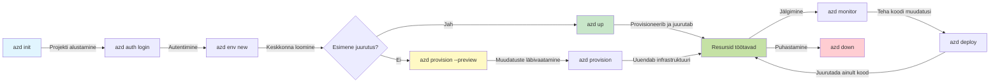
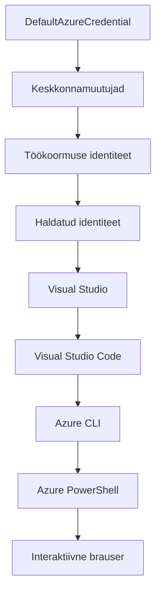

# AZD alustalad - Azure Developer CLI mõistmine

# AZD alustalad - Põhimõisted ja alused

**Kapitlite navigeerimine:**
- **📚 Kursuse avaleht**: [AZD algajatele](../../README.md)
- **📖 Praegune peatükk**: Peatükk 1 - Alused ja kiire algus
- **⬅️ Eelmine**: [Kursuse ülevaade](../../README.md#-chapter-1-foundation--quick-start)
- **➡️ Järgmine**: [Paigaldamine ja seadistamine](installation.md)
- **🚀 Järgmine peatükk**: [Peatükk 2: AI-põhine arendus](../chapter-02-ai-development/microsoft-foundry-integration.md)

## Sissejuhatus

See õppetund tutvustab teile Azure Developer CLI-t (azd), võimsat käsureatööriista, mis kiirendab teie teekonda kohalikust arendusest Azure'i juurutamiseni. Õpite põhikontseptsioone, peamisi funktsioone ja mõistate, kuidas azd lihtsustab pilvepõhiste rakenduste juurutamist.

## Õpieesmärgid

Selle õppetunni lõpuks saate:
- Mõista, mis on Azure Developer CLI ja selle peamine eesmärk
- Õppida malle, keskkondi ja teenuseid puudutavaid põhikontseptsioone
- Tutvuda peamiste funktsioonidega, sealhulgas malli-põhise arenduse ja infrastruktuuri koodina
- Mõista azd projekti struktuuri ja töövoogu
- Olla valmis azd installima ja seadistama oma arenduskeskkonnas

## Õpitulemused

Pärast selle õppetunni läbimist saate:
- Selgitada azd rolli kaasaegsetes pilve-arenduse töövoogudes
- Tuvastada azd projekti struktuuri komponendid
- Kirjeldada, kuidas mallid, keskkonnad ja teenused koos toimivad
- Mõista infrastruktuuri koodi eeliseid azd-ga
- Tunda ära erinevaid azd käske ja nende eesmärke

## Mis on Azure Developer CLI (azd)?

Azure Developer CLI (azd) on käsurea tööriist, mis on loodud kiirendama teie teekonda kohalikust arendusest Azure'i juurutamiseni. See lihtsustab pilvepõhiste rakenduste loomist, juurutamist ja haldamist Azure'is.

### Mida saab azd-ga juurutada?

azd toetab laias valikus koormustüüpe – ja nimekiri kasvab pidevalt. Täna saate azd-ga juurutada:

| Koormustüüp | Näited | Sama töövoog? |
|-------------|--------|---------------|
| **Traditsioonilised rakendused** | Veebiäpid, REST API-d, staatilised saidid | ✅ `azd up` |
| **Teenused ja mikroteenused** | Container Apps, Function Apps, mitme teenusega tagapõhjad | ✅ `azd up` |
| **Tehisintellektiga rakendused** | Vestlusäpid Microsoft Foundry mudelitega, RAG lahendused AI Search'iga | ✅ `azd up` |
| **Intelligentset agenti** | Foundry hostitud agendid, mitme-agendi orkestratsioonid | ✅ `azd up` |

Oluline on see, et **azd elutsükkel jääb samaks, sõltumata sellest, mida te juurutate**. Te initsialiseerite projekti, pakute infrastruktuuri, juurutate koodi, jälgite rakendust ja puhastate – olgu see lihtne veebisait või keerukas AI agent.

See järjepidevus on kavandatud eesmärgiga. azd käsitleb AI võimekusi kui üht teenust, mida teie rakendus saab kasutada, mitte midagi fundamentaalselt erinevat. Microsoft Foundry mudelitega toetatud vestluslõpp-punkt on azd vaatepunktist lihtsalt veel üks teenus, mida konfigureerida ja juurutada.

### 🎯 Miks kasutada AZD-d? Reaalne võrdlus

Vaatame, kuidas toimub lihtsa veebirakenduse andmebaasiga juurutamine:

#### ❌ ILMA AZD-ta: käsitsi Azure'i juurutus (üle 30 minuti)

```bash
# Samm 1: Loo ressursirühm
az group create --name myapp-rg --location eastus

# Samm 2: Loo App Service'i plaan
az appservice plan create --name myapp-plan \
  --resource-group myapp-rg \
  --sku B1 --is-linux

# Samm 3: Loo veebirakendus
az webapp create --name myapp-web-unique123 \
  --resource-group myapp-rg \
  --plan myapp-plan \
  --runtime "NODE:18-lts"

# Samm 4: Loo Cosmos DB konto (10-15 minutit)
az cosmosdb create --name myapp-cosmos-unique123 \
  --resource-group myapp-rg \
  --kind MongoDB

# Samm 5: Loo andmebaas
az cosmosdb mongodb database create \
  --account-name myapp-cosmos-unique123 \
  --resource-group myapp-rg \
  --name tododb

# Samm 6: Loo kogu
az cosmosdb mongodb collection create \
  --account-name myapp-cosmos-unique123 \
  --resource-group myapp-rg \
  --database-name tododb \
  --name todos

# Samm 7: Hangi ühendusstring
CONN_STR=$(az cosmosdb keys list \
  --name myapp-cosmos-unique123 \
  --resource-group myapp-rg \
  --type connection-strings \
  --query "connectionStrings[0].connectionString" -o tsv)

# Samm 8: Konfigureeri rakenduse seaded
az webapp config appsettings set \
  --name myapp-web-unique123 \
  --resource-group myapp-rg \
  --settings MONGODB_URI="$CONN_STR"

# Samm 9: Luba logimine
az webapp log config --name myapp-web-unique123 \
  --resource-group myapp-rg \
  --application-logging filesystem \
  --detailed-error-messages true

# Samm 10: Sea üles Application Insights
az monitor app-insights component create \
  --app myapp-insights \
  --location eastus \
  --resource-group myapp-rg

# Samm 11: Seo App Insights veebirakendusega
INSTRUMENTATION_KEY=$(az monitor app-insights component show \
  --app myapp-insights \
  --resource-group myapp-rg \
  --query "instrumentationKey" -o tsv)

az webapp config appsettings set \
  --name myapp-web-unique123 \
  --resource-group myapp-rg \
  --settings APPINSIGHTS_INSTRUMENTATIONKEY="$INSTRUMENTATION_KEY"

# Samm 12: Koosta rakendus lokaalselt
npm install
npm run build

# Samm 13: Loo juurutuspakk
zip -r app.zip . -x "*.git*" "node_modules/*"

# Samm 14: Juuruta rakendus
az webapp deployment source config-zip \
  --resource-group myapp-rg \
  --name myapp-web-unique123 \
  --src app.zip

# Samm 15: Oota ja palveta, et see toimiks 🙏
# (Automaatset valideerimist pole, vajalik on käsitsi testimine)
```

**Probleemid:**
- ❌ 15+ käsku, mida meeles pidada ja õiges järjekorras täita
- ❌ 30-45 minutit käsitsi tööd
- ❌ Lihtne teha vigu (trükivead, valed parameetrid)
- ❌ Ühendusstringid on nähtavad terminali ajaloos
- ❌ Puudub automaatne tagasikeeramine tõrke korral
- ❌ Raske meeskonnaliikmetele korrata
- ❌ Iga kord erinev (mitte korratav)

#### ✅ AZD-ga: automatiseeritud juurutus (5 käsku, 10-15 minutit)

```bash
# Samm 1: Algatamine mallist
azd init --template todo-nodejs-mongo

# Samm 2: Autentimine
azd auth login

# Samm 3: Keskkonna loomine
azd env new dev

# Samm 4: Muudatuste eelvaade (valikuline, kuid soovitatav)
azd provision --preview

# Samm 5: Kõikide elementide juurutamine
azd up

# ✨ Valmis! Kõik on juurutatud, konfigureeritud ja jälgitud
```

**Eelised:**
- ✅ **5 käsku** vs 15+ käsitsi sammu
- ✅ **10-15 minutit** koguaeg (enamasti Azure'i ootamine)
- ✅ **Vähem käsitsi tehtud vigu** - järjepidev, malli-põhine töövoog
- ✅ **Turvaline salvestus** - paljud mallid kasutavad Azure'i hallatud salvestust
- ✅ **Korduvad juurutused** - iga kord sama töövoog
- ✅ **Täielikult korratav** - iga kord sama tulemus
- ✅ **Meeskonnal kasutamiseks valmis** - igaüks saab sama käskudega juurutada
- ✅ **Infrastruktuur koodina** - versioonihalduses Bicep mallid
- ✅ **Sisseehitatud jälgimine** - Application Insights seadistatud automaatselt

### 📊 Aja ja vigade vähendamine

| Näitaja | Käsitsi juurutus | AZD juurutus | Parandus |
|:--------|:-----------------|:-------------|:---------|
| **Käsud** | 15+ | 5 | 67% vähem |
| **Aeg** | 30-45 min | 10-15 min | 60% kiirem |
| **Vigade sagedus** | ~40% | <5% | 88% vähenemine |
| **Järjepidevus** | Madal (käsitsi) | 100% (automatiseeritud) | Täiuslik |
| **Meeskonna sisseelamine** | 2-4 tundi | 30 minutit | 75% kiirem |
| **Tagasikeeramise aeg** | 30+ min (käsitsi) | 2 min (automatiseeritud) | 93% kiirem |

## Põhikontseptsioonid

### Mallid
Mallid on azd aluseks. Need sisaldavad:
- **Rakenduse kood** - teie lähtekood ja sõltuvused
- **Infrastruktuuri määratlused** - Azure ressursid, kirjeldatud Bicep või Terraform abil
- **Seadistusfailid** - seaded ja keskkonnamuutujad
- **Juurutusskriptid** - automatiseeritud juurutustöövood

### Keskkonnad
Keskkonnad tähistavad erinevaid juurutussihtkohti:
- **Arendus** - testimiseks ja arenduseks
- **Staging** - eeltootmiskeskkond
- **Tootmine** - reaalne tootmiskeskkond

Iga keskkond haldab oma:
- Azure'i ressursigruppi
- Seadistusparameetreid
- Juurutuse olekut

### Teenused
Teenused on teie rakenduse ehituskivid:
- **Frontend** - veebirakendused, SPA-d
- **Backend** - API-d, mikroteenused
- **Andmebaas** - andmesalvestuse lahendused
- **Salvestus** - failide ja bändipõhine salvestus

## Peamised funktsioonid

### 1. Malle-põhine arendus
```bash
# Sirvi saadaolevaid malle
azd template list

# Algata mallist
azd init --template <template-name>
```

### 2. Infrastruktuur koodina
- **Bicep** - Azure spetsiifiline keel
- **Terraform** - mitme pilve infrastruktuuri tööriist
- **ARM mallid** - Azure Resource Manager mallid

### 3. Integreeritud töövood
```bash
# Täielik juurutusvoog
azd up            # Provisionimine + juurutamine, see on esmakordseks seadistamiseks automaatne

# 🧪 UUS: Eelvaata infrastruktuuri muudatusi enne juurutamist (TURVALINE)
azd provision --preview    # Simuleeri infrastruktuuri juurutamist ilma muudatusi tegemata

azd provision     # Loo Azure'i ressursid, kui infrastruktuuri uuendad, kasuta seda
azd deploy        # Juuruta rakenduse kood või juuruta rakenduse kood uuesti pärast uuendust
azd down          # Ressursside puhastamine
```

#### 🛡️ Ohutu infrastruktuuri planeerimine eelvaatega
Käsk `azd provision --preview` muudab juurutused ohutumaks:
- **Kuiv jooks** - näitab, mis luuakse, muudetakse või kustutatakse
- **Null risk** - tegelikke muudatusi Azure keskkonnas ei tehta
- **Meeskonnatöö** - jagage eelvaate tulemusi enne juurutust
- **Kulu hinnang** - saate enne kohustamist teada ressursikulud

```bash
# Näidis eelvaate töövoog
azd provision --preview           # Vaata, mis muutub
# Vaata väljundit üle, aruta meeskonnaga
azd provision                     # Rakenda muudatused enesekindlalt
```

### 📊 Visuaal: AZD arenduse töövoog


**Töövoo selgitus:**
1. **Algus** - alusta mallist või uuest projektist
2. **Autentimine** - logi sisse Azure'i
3. **Keskkond** - loo isoleeritud juurutuskeskkond
4. **Eelvaade** - 🆕 Alati vaata infrastruktuuri muudatusi esmalt läbi (ohutu tava)
5. **Provision** - loo/värskenda Azure ressursse
6. **Juuruta** - saada rakenduse kood üles
7. **Jälgi** - vaata rakenduse toimivust
8. **Itereeri** - muuda ja juuruta kood uuesti
9. **Puhasta** - eemalda ressursid, kui valmis

### 4. Keskkonna haldus
```bash
# Luo ja hallinnoi ympäristöjä
azd env new <environment-name>
azd env select <environment-name>
azd env list
```

### 5. Laiendid ja AI käsud

azd kasutab laiendussüsteemi, mis lisab põhikäsureale juurde võimekusi. See on eriti kasulik AI koormustel:

```bash
# Loenda saadaolevad laiendused
azd extension list

# Paigalda Foundry agentide laiendus
azd extension install azure.ai.agents

# Algata AI agendi projekt manifestist
azd ai agent init -m agent-manifest.yaml

# Käivita MCP server AI-abilise arenduse jaoks (Alpha)
azd mcp start
```

> Laiendusi käsitletakse põhjalikult [Peatükis 2: AI-põhine arendus](../chapter-02-ai-development/agents.md) ja [AZD AI CLI käsud](../chapter-08-production/production-ai-practices.md#azd-ai-cli-commands-and-extensions) viidetes.

## 📁 Projekti struktuur

Tüüpiline azd projekti struktuur:
```
my-app/
├── .azd/                    # azd configuration
│   └── config.json
├── .azure/                  # Azure deployment artifacts
├── .devcontainer/          # Development container config
├── .github/workflows/      # GitHub Actions
├── .vscode/               # VS Code settings
├── infra/                 # Infrastructure code
│   ├── main.bicep        # Main infrastructure template
│   ├── main.parameters.json
│   └── modules/          # Reusable modules
├── src/                  # Application source code
│   ├── api/             # Backend services
│   └── web/             # Frontend application
├── azure.yaml           # azd project configuration
└── README.md
```

## 🔧 Seadistusfailid

### azure.yaml
Põhiprojekti seadistusfail:
```yaml
name: my-awesome-app
metadata:
  template: my-template@1.0.0

services:
  web:
    project: ./src/web
    language: js
    host: appservice
  api:
    project: ./src/api
    language: js
    host: appservice

hooks:
  preprovision:
    shell: pwsh
    run: echo "Preparing to provision..."
```

### .azure/config.json
Keskkonnapõhine seadistus:
```json
{
  "version": 1,
  "defaultEnvironment": "dev",
  "environments": {
    "dev": {
      "subscriptionId": "your-subscription-id",
      "location": "eastus"
    }
  }
}
```

## 🎪 Tavalised töövood koos praktiliste harjutustega

> **💡 Õpi näpunäide:** Järgige neid harjutusi järjekorras, et järk-järgult suurendada oma AZD oskusi.

### 🎯 Harjutus 1: Esimese projekti initsialiseerimine

**Eesmärk:** Loo AZD projekt ja tutvu selle struktuuriga

**Sammud:**
```bash
# Kasuta tõestatud malli
azd init --template todo-nodejs-mongo

# Uuri loodud faile
ls -la  # Vaata kõiki faile, sealhulgas peidetud

# Loodud võtmefailid:
# - azure.yaml (põhikonfiguratsioon)
# - infra/ (taristu kood)
# - src/ (rakenduse kood)
```

**✅ Õnnestumine:** Sul on azure.yaml, infra/ ja src/ kaustad

---

### 🎯 Harjutus 2: Juuruta Azure'i

**Eesmärk:** Täielik lõpp-lõpuni juurutus

**Sammud:**
```bash
# 1. Autendi
az login && azd auth login

# 2. Loo keskkond
azd env new dev
azd env set AZURE_LOCATION eastus

# 3. Vaata muudatusi eelvaates (SOOVITATAV)
azd provision --preview

# 4. Käivita kõik
azd up

# 5. Kontrolli juurutust
azd show    # Vaata oma rakenduse URL-i
```

**Oodatav aeg:** 10-15 minutit  
**✅ Õnnestumine:** Rakenduse URL avaneb brauseris

---

### 🎯 Harjutus 3: Mitmed keskkonnad

**Eesmärk:** Juuruta dev ja staging keskkondadesse

**Sammud:**
```bash
# Dev on juba olemas, loo staging
azd env new staging
azd env set AZURE_LOCATION westus2
azd up

# Vaheta nende vahel
azd env list
azd env select dev
```

**✅ Õnnestumine:** Kaks eraldi ressursigruppi Azure portaalis

---

### 🛡️ Puhas algus: `azd down --force --purge`

Kui on vaja täiesti nullist alustada:

```bash
azd down --force --purge
```

**Mida see teeb:**
- `--force`: Ei küsi kinnitusi
- `--purge`: Kustutab kogu kohaliku oleku ja Azure'i ressursid

**Kasuta kui:**
- Juurutus ebaõnnestus poole peal
- Projektide vahetamine
- Vajad puhta alguse

---

## 🎪 Originaalne töövoo viide

### Uue projekti alustamine
```bash
# Meetod 1: Kasutage olemasolevat malli
azd init --template todo-nodejs-mongo

# Meetod 2: Alustage nullist
azd init

# Meetod 3: Kasutage praegust kataloogi
azd init .
```

### Arendus tsükkel
```bash
# Arenduskeskkonna seadistamine
azd auth login
azd env new dev
azd env select dev

# Kõige juurutamine
azd up

# Tee muudatusi ja juuruta uuesti
azd deploy

# Kui valmis, puhasta
azd down --force --purge # Azure Developer CLI käsk on sinu keskkonna **tõrge lähtestus**—eriti kasulik, kui sa tõrjud ebaõnnestunud juurutusi, puhastad hülgatud ressursse või valmistud värskeks uuesti juurutamiseks.
```

## `azd down --force --purge` mõistmine
Käsk `azd down --force --purge` on võimas vahend oma azd keskkonna ja kõigi seotud ressursside täielikuks eemaldamiseks. Siin on ülevaade, mida iga lipp teeb:
```
--force
```
- Jätab kinnituse küsimised vahele.
- Kasulik automatiseerimise või skriptimise korral, kus käsitsi sisend pole võimalik.
- Tagab, et eemaldusprotsess toimub katkestusteta, isegi kui CLI tuvastab vastuolusid.

```
--purge
```
Kustutab **kogu seotud metaandmeinfo**, sealhulgas:
Keskkonna olek
Kohaliku `.azure` kausta
Vahemälus oleva juurutuse info
Takistab azd-l "mäletamast" varasemaid juurutusi, mis võivad põhjustada probleeme nagu mittesobivad ressursigrupid või aegunud registriviited.


### Miks mõlemat kasutada?
Kui oled `azd up` käsuga kinni jäänud olekuprobleemide või osaliste juurutuste tõttu, tagab see kombinatsioon **puhta alguse**.

See on eriti kasulik pärast käsitsi kustutamisi Azure portaalis või kui vahetad malle, keskkondi või ressursigrupi nimetamise konventsioone.


### Mitme keskkonna haldamine
```bash
# Loo paigutuse keskkond
azd env new staging
azd env select staging
azd up

# Lülitu tagasi arenduskeskkonda
azd env select dev

# Võrdle keskkondi
azd env list
```

## 🔐 Autentimine ja volitused

Autentimise mõistmine on azd juurutuste edukaks tegemiseks ülioluline. Azure kasutab mitmeid autentimismeetodeid ja azd kasutab samu volitusahelaid, mida teised Azure tööriistad.

### Azure CLI autentimine (`az login`)

Enne azd kasutamist tuleb Azure'i sisse logida. Kõige tavalisem viis on Azure CLI kasutamine:

```bash
# Interaktiivne sisselogimine (avab brauseri)
az login

# Logi sisse konkreetse rentnikuga
az login --tenant <tenant-id>

# Logi sisse teenuse esindajaga
az login --service-principal -u <app-id> -p <password> --tenant <tenant-id>

# Kontrolli praegust sisselogimise staatust
az account show

# Loetle saadaval olevad tellimused
az account list --output table

# Määra vaikimisi tellimus
az account set --subscription <subscription-id>
```

### Autentimise töövoog
1. **Interaktiivne sisselogimine**: Avab vaikimisi brauseri autentimiseks
2. **Seadme koodi voog**: Keskkondades, kus pole brauseri ligipääsu
3. **Teenuse kasutaja**: Automatiseerimise ja CI/CD stsenaariumite jaoks
4. **Halvatud identiteet**: Azure'is hostitud rakenduste jaoks

### DefaultAzureCredential ahel

`DefaultAzureCredential` on volitusliik, mis pakub lihtsustatud autentimiskogemust, proovides automaatselt mitmeid volituste allikaid kindlas järjekorras:

#### Volitusallikate järjekord

#### 1. Keskkonnamuutujad
```bash
# Määra teenuse põhimõttel keskkonnamuutujad
export AZURE_CLIENT_ID="<app-id>"
export AZURE_CLIENT_SECRET="<password>"
export AZURE_TENANT_ID="<tenant-id>"
```

#### 2. Koormuse identiteet (Kubernetes/GitHub Actions)
Kasutatakse automaatselt:
- Azure Kubernetes Service (AKS) koos koormuse identiteediga
- GitHub Actions OIDC föderatsiooniga
- Muudes födereeritud identiteedi stsenaariumites

#### 3. Halvatud identiteet
Azure ressursside jaoks nagu:
- Virtuaalmasinad
- App Service
- Azure Functions
- Container Instances

```bash
# Kontrolli, kas töötab Azure'i ressursil hallatava identiteediga
az account show --query "user.type" --output tsv
# Tagastab: "servicePrincipal", kui kasutatakse hallatavat identiteeti
```

#### 4. Arendustööriistade integratsioon
- **Visual Studio**: kasutab automaatselt sisse logitud kontot
- **VS Code**: kasutab Azure Account laiendi volitusi
- **Azure CLI**: kasutab `az login` volitusi (tavalisim lokaalarenduses)

### AZD autentimise seadistamine

```bash
# Meetod 1: Kasuta Azure CLI-d (Soovitatav arenduseks)
az login
azd auth login  # Kasutab olemasolevaid Azure CLI volitusi

# Meetod 2: Otsene azd autentimine
azd auth login --use-device-code  # Peata keskkondade jaoks

# Meetod 3: Kontrolli autentimise olekut
azd auth login --check-status

# Meetod 4: Logi välja ja autentimise uuesti
azd auth logout
azd auth login
```

### Autentimise parimad praktikad

#### Lokaalarendus
```bash
# 1. Logi sisse Azure CLI-ga
az login

# 2. Kontrolli õiget tellimust
az account show
az account set --subscription "Your Subscription Name"

# 3. Kasuta azd olemasolevate volitustega
azd auth login
```

#### CI/CD torujuhtmed
```yaml
# GitHub Actions example
- name: Azure Login
  uses: azure/login@v1
  with:
    creds: ${{ secrets.AZURE_CREDENTIALS }}

- name: Deploy with azd
  run: |
    azd auth login --client-id ${{ secrets.AZURE_CLIENT_ID }} \
                    --client-secret ${{ secrets.AZURE_CLIENT_SECRET }} \
                    --tenant-id ${{ secrets.AZURE_TENANT_ID }}
    azd up --no-prompt
```

#### Tootmiskeskkonnad
- Kasuta **haldatud identiteeti**, kui jooksutad Azure'i ressurssidel
- Kasuta **teenuse kasutajat** automatiseerimise stsenaariumites
- Väldi volituste hoidmist koodis või seadistusfailides
- Kasuta **Azure Key Vault’i** tundlike seadistuste jaoks

### Levinud autentimise probleemid ja lahendused

#### Viga: "Tellimust ei leitud"
```bash
# Lahendus: Määra vaikimisi tellimus
az account list --output table
az account set --subscription "<subscription-id>"
azd env set AZURE_SUBSCRIPTION_ID "<subscription-id>"
```

#### Viga: "Piiratud õigused"
```bash
# Lahendus: Kontrolli ja määra vajalikke rolle
az role assignment list --assignee $(az account show --query user.name --output tsv)

# Üldised vajalikud rollid:
# - Kaasautor (ressursside haldamiseks)
# - Kasutaja juurdepääsu administraator (rollide määramiseks)
```

#### Viga: "Token on aegunud"
```bash
# Lahendus: uuesti autentimine
az logout
az login
azd auth logout
azd auth login
```

### Autentimine erinevates stsenaariumites

#### Lokaalarendus
```bash
# Isikliku arengu konto
az login
azd auth login
```

#### Meeskonna arendus
```bash
# Kasutage organisatsiooni jaoks konkreetset rentnikku
az login --tenant contoso.onmicrosoft.com
azd auth login
```

#### Mitmepoolsed stsenaariumid
```bash
# Vaheta rentnike vahel
az login --tenant tenant1.onmicrosoft.com
# Paigalda rentnikule 1
azd up

az login --tenant tenant2.onmicrosoft.com  
# Paigalda rentnikule 2
azd up
```

### Turvaküsimused
1. **Tunnuste salvestamine**: Ära kunagi salvesta tunnuseid lähtekoodi
2. **Ulatuvuse piiramine**: Kasuta teenuse põhiprintsiipi miinimumõigustel
3. **Tokenite vahetamine**: Vaheta teenuse põhiprintsiibi saladusi regulaarselt
4. **Auditeerimise jälg**: Jälgi autentimise ja juurutustegevusi
5. **Võrgu turvalisus**: Kasuta võimalusel privaatseid lõpp-punkte

### Autentimise tõrkeotsing

```bash
# Tõrkeotsing autentimisprobleemide jaoks
azd auth login --check-status
az account show
az account get-access-token

# Levinud diagnostikakäsud
whoami                          # Praegune kasutajakontekst
az ad signed-in-user show      # Azure AD kasutajaandmed
az group list                  # Testi ressursi juurdepääsu
```

## Mõistmine `azd down --force --purge`

### Avastamine
```bash
azd template list              # Sirvi malle
azd template show <template>   # Mallede üksikasjad
azd init --help               # Initsialiseerimisvalikud
```

### Projekti haldus
```bash
azd show                     # Projekti ülevaade
azd env list                # Saadaval olevad keskkonnad ja valitud vaikevalik
azd config show            # Konfiguratsiooni sätted
```

### Jälgimine
```bash
azd monitor                  # Ava Azure portaali seire
azd monitor --logs           # Vaata rakenduse logisid
azd monitor --live           # Vaata reaalajas mõõdikuid
azd pipeline config          # Sea üles CI/CD
```

## Parimad tavad

### 1. Kasuta tähenduslikke nimesid
```bash
# Hea
azd env new production-east
azd init --template web-app-secure

# Vältida
azd env new env1
azd init --template template1
```

### 2. Kasuta malle
- Alusta olemasolevatest mallidest
- Kohanda vastavalt oma vajadustele
- Loo korduvkasutatavad mallid oma organisatsiooni jaoks

### 3. Keskkondade isoleerimine
- Kasuta eraldi keskkondi arenduseks/testimiseks/tootmiseks
- Ära juuruta otse tootmiskeskkonda lokaalselt
- Kasuta tootmise juurutamiseks CI/CD torustikke

### 4. Konfiguratsiooni haldus
- Kasuta tundlike andmete jaoks keskkonnamuutujaid
- Hoia konfiguratsioon versioonihalduses
- Dokumenteeri keskkonnaspetsiifilised seaded

## Õppemarsruut

### Algaja (1.-2. nädal)
1. Paigalda azd ja autentimise soorita
2. Juuruta lihtne mall
3. Mõista projekti struktuuri
4. Õpi põhikäsklusi (up, down, deploy)

### Kesktase (3.-4. nädal)
1. Kohanda malle
2. Halda mitut keskkonda
3. Mõista infrastruktuuri koodi
4. Sea üles CI/CD torustikke

### Edasijõudnu (5+ nädal)
1. Loo kohandatud malle
2. Edasijõudnud infrastruktuuri mustrid
3. Mitmeregiooniline juurutus
4. Ettevõtte taseme konfiguratsioonid

## Järgmised sammud

**📖 Jätka peatüki 1 õppimist:**
- [Paigaldus & seadistus](installation.md) - Paigalda ja seadista azd
- [Sinu esimene projekt](first-project.md) - Täida praktiline juhend
- [Konfiguratsiooni juhend](configuration.md) - Edasijõudnud seadistusvõimalused

**🎯 Valmis järgmiseks peatükiks?**
- [Peatükk 2: AI-esimene arendus](../chapter-02-ai-development/microsoft-foundry-integration.md) - Alusta tehisintellekti rakenduste loomist

## Lisamaterjalid

- [Azure Developer CLI ülevaade](https://learn.microsoft.com/en-us/azure/developer/azure-developer-cli/)
- [Mallide galerii](https://azure.github.io/awesome-azd/)
- [Kogukonna näited](https://github.com/Azure-Samples)

---

## 🙋 Enim esitatud küsimused

### Üldised küsimused

**K: Mis vahe on AZD-l ja Azure CLI-l?**

V: Azure CLI (`az`) haldab üksikuid Azure ressursse. AZD (`azd`) haldab terviklikke rakendusi:

```bash
# Azure CLI - madala taseme ressursside haldus
az webapp create --name myapp --resource-group rg
az sql server create --name myserver --resource-group rg
# ...vajab veel palju käske

# AZD - rakenduse taseme haldus
azd up  # Paigaldab kogu rakenduse koos kõigi ressurssidega
```

**Mõtle nii:**
- `az` = Töötamine üksikute Lego klotsidega
- `azd` = Töötamine täiesti Lego komplektidega

---

**K: Kas AZD kasutamiseks on vaja Bicepit või Terraformi osata?**

V: Ei! Alusta mallidega:
```bash
# Kasuta olemasolevat malli - IaC teadmisi pole vaja
azd init --template todo-nodejs-mongo
azd up
```

Hiljem saad Bicepi õppida infrastruktuuri kohandamiseks. Mallid annavad töötavad näited õppimiseks.

---

**K: Kui palju maksab AZD mallide kasutamine?**

V: Kulud varieeruvad mallide järgi. Enamik arenduse malle maksab $50-150 kuus:

```bash
# Eelvaade kuludest enne juurutamist
azd provision --preview

# Alati puhastage pärast kasutamist
azd down --force --purge  # Eemaldab kõik ressursid
```

**Näpunäide:** Kasuta tasuta tasemeid kui võimalik:
- App Service: F1 (Tasuta) tase
- Microsoft Foundry mudelid: Azure OpenAI 50,000 tokenit kuus tasuta
- Cosmos DB: 1000 RU/s tasuta tase

---

**K: Kas AZD-d saab kasutada olemasolevate Azure ressurssidega?**

V: Jah, aga lihtsam on alustada puhtalt lehelt. AZD toimib kõige paremini, kui haldab kõiki elutsükli etappe. Olemasolevate ressursside puhul:

```bash
# Valik 1: Impordi olemasolevad ressursid (edasijõudnutele)
azd init
# Seejärel muuda infra/ viitama olemasolevatele ressurssidele

# Valik 2: Alusta puhtalt lehelt (soovitatav)
azd init --template matching-your-stack
azd up  # Loob uue keskkonna
```

---

**K: Kuidas jagada projekti meeskonnaliikmetega?**

V: Kommiteeri AZD projekt Git'i (aga MITTE `.azure` kausta):

```bash
# Juba vaikimisi .gitignore failis
.azure/        # Sisaldab salasõnu ja keskkonnaandmeid
*.env          # Keskkonnamuutujad

# Seejärel meeskonnaliikmed:
git clone <your-repo>
azd auth login
azd env new <their-name>-dev
azd up
```

Kõik saavad sama infrastruktuuri samadest mallidest.

---

### Tõrkeotsingu küsimused

**K: "azd up" ebaõnnestus poole peal. Mida teha?**

V: Kontrolli viga, paranda ja proovi uuesti:

```bash
# Vaata üksikasjalikke logisid
azd show

# Levinumad parandused:

# 1. Kui kvota on ületatud:
azd env set AZURE_LOCATION "westus2"  # Proovi teist piirkonda

# 2. Kui ressursside nimede konflikt:
azd down --force --purge  # Alusta nullist
azd up  # Proovi uuesti

# 3. Kui autentimine on aegunud:
az login
azd auth login
azd up
```

**Sagedasem probleem:** Valesti valitud Azure tellimus
```bash
az account list --output table
az account set --subscription "<correct-subscription>"
```

---

**K: Kuidas juurutada ainult koodi muudatused ilma infrastruktuuri ümberpaigutamiseta?**

V: Kasuta `azd deploy` asemel `azd up`:

```bash
azd up          # Esimest korda: ettevalmistamine + kasutuselevõtt (aeglane)

# Tee koodi muudatusi...

azd deploy      # Järgmised korrad: ainult kasutuselevõtt (kiire)
```

Kiiruse võrdlus:
- `azd up`: 10-15 minutit (infrastruktuuri paigaldamine)
- `azd deploy`: 2-5 minutit (ainult kood)

---

**K: Kas infrastruktuuri malle saab kohandada?**

V: Jah! Muuda Bicep faile `infra/` kaustas:

```bash
# Pärast azd käivitamist
cd infra/
code main.bicep  # Redigeeri VS Code'is

# Muudatuste eelvaade
azd provision --preview

# Muudatuste rakendamine
azd provision
```

**Vihje:** Alusta väikestest muudatustest – muuda kõigepealt SKU-sid:
```bicep
// infra/main.bicep
sku: {
  name: 'B1'  // Change to 'P1V2' for production
}
```

---

**K: Kuidas kustutada kõik AZD loodud ressursid?**

V: Käsuga saab eemaldada kõik ressursid:

```bash
azd down --force --purge

# See kustutab:
# - Kõik Azure ressursid
# - Ressursigrupi
# - Kohaliku keskkonna oleku
# - Vahemällu salvestatud juurutusandmed
```

**Kasuta seda alati kui:**
- Malli testimine on lõpetatud
- Vahetad projekti
- Tahad alustada puhtalt lehelt

**Kulude kokkuhoid:** Kasutamata ressursside kustutamine = $0 kulud

---

**K: Mida teha, kui kustutasin kogemata ressursse Azure Portaalis?**

V: AZD seisund võib sünkroonist välja minna. Kasuta puhast lähenemist:

```bash
# 1. Eemalda kohalik olek
azd down --force --purge

# 2. Alusta uuesti
azd up

# Alternatiiv: Lase AZD-l tuvastada ja parandada
azd provision  # Loob puuduvad ressursid
```

---

### Edasijõudnutele mõeldud küsimused

**K: Kas AZD-d saab kasutada CI/CD torustikes?**

V: Jah! Näide GitHub Actionsist:

```yaml
# .github/workflows/deploy.yml
name: Deploy with AZD

on:
  push:
    branches: [main]

jobs:
  deploy:
    runs-on: ubuntu-latest
    steps:
      - uses: actions/checkout@v2
      
      - name: Install azd
        run: curl -fsSL https://aka.ms/install-azd.sh | bash
      
      - name: Azure Login
        run: |
          azd auth login \
            --client-id ${{ secrets.AZURE_CLIENT_ID }} \
            --client-secret ${{ secrets.AZURE_CLIENT_SECRET }} \
            --tenant-id ${{ secrets.AZURE_TENANT_ID }}
      
      - name: Deploy
        run: azd up --no-prompt
```

---

**K: Kuidas käidelda salajasi andmeid ja tundlikku infot?**

V: AZD integreerub automaatselt Azure Key Vaultiga:

```bash
# Saladused on hoitud Key Vaultis, mitte koodis
azd env set DATABASE_PASSWORD "$(openssl rand -base64 32)"

# AZD teeb automaatselt:
# 1. Loob Key Vaulti
# 2. Salvestab saladuse
# 3. Annab rakendusele juurdepääsu hallatud identiteedi kaudu
# 4. Süstab käitamisel
```

**Ära kunagi kommiti:**
- `.azure/` kaust (sisaldab keskkonna andmeid)
- `.env` failid (kohalikud saladused)
- Ühendusstringid

---

**K: Kas saab juurutada mitmesse regiooni?**

V: Jah, loo iga regiooni jaoks eraldi keskkond:

```bash
# Ida-USA keskkond
azd env new prod-eastus
azd env set AZURE_LOCATION eastus
azd up

# Lääne-Euroopa keskkond
azd env new prod-westeurope
azd env set AZURE_LOCATION westeurope
azd up

# Iga keskkond on sõltumatu
azd env list
```

Tõeliselt mitmeregiooniliste rakenduste jaoks kohanda Bicep malle ja juuruta samaaegselt mitmesse regiooni.

---

**K: Kust saada abi, kui kinni jääd?**

1. **AZD dokumentatsioon:** https://learn.microsoft.com/azure/developer/azure-developer-cli/
2. **GitHub probleemid:** https://github.com/Azure/azure-dev/issues
3. **Discord:** [Azure Discord](https://discord.gg/microsoft-azure) - #azure-developer-cli kanal
4. **Stack Overflow:** Märksõna `azure-developer-cli`
5. **See kursus:** [Tõrkeotsingu juhend](../chapter-07-troubleshooting/common-issues.md)

**Näpunäide:** Enne küsimyst käivita:
```bash
azd show       # Kuvab praeguse oleku
azd version    # Kuvab teie versiooni
```
Lisa see info oma küsimusse kiiremaks abiks.

---

## 🎓 Mis järgmiseks?

Nüüd mõistad AZD põhialuseid. Vali oma tee:

### 🎯 Algajatele:
1. **Järgmine:** [Paigaldus & seadistus](installation.md) - Paigalda AZD oma arvutisse
2. **Seejärel:** [Sinu esimene projekt](first-project.md) - Juuruta oma esimene rakendus
3. **Harjuta:** Täida kõik 3 harjutust selles õppetükis

### 🚀 Tehisintellekti arendajatele:
1. **Mine otse:** [Peatükk 2: AI-esimene arendus](../chapter-02-ai-development/microsoft-foundry-integration.md)
2. **Juuruta:** Alusta `azd init --template get-started-with-ai-chat`
3. **Õpi:** Ehita samal ajal kui juurutad

### 🏗️ Kogenud arendajatele:
1. **Vaata üle:** [Konfiguratsiooni juhend](configuration.md) - Edasijõudnud seaded
2. **Uuri:** [Infrastruktuur koodina](../chapter-04-infrastructure/provisioning.md) - Bicepi põhjalik ülevaade
3. **Loo:** Tee kohandatud malle oma tehnoloogiapaketi jaoks

---

**Peatükkide navigatsioon:**
- **📚 Kursuse avaleht**: [AZD algajatele](../../README.md)
- **📖 Praegune peatükk**: Peatükk 1 - Alused ja kiire algus  
- **⬅️ Eelmine**: [Kursuse ülevaade](../../README.md#-chapter-1-foundation--quick-start)
- **➡️ Järgmine**: [Paigaldus & seadistus](installation.md)
- **🚀 Järgmine peatükk**: [Peatükk 2: AI-esimene arendus](../chapter-02-ai-development/microsoft-foundry-integration.md)

---

<!-- CO-OP TRANSLATOR DISCLAIMER START -->
**Vastutusest loobumine**:
See dokument on tõlgitud kasutades tehisintellekti tõlketeenust [Co-op Translator](https://github.com/Azure/co-op-translator). Kuigi me püüame tagada täpsust, palun arvestage, et automaatsed tõlked võivad sisaldada vigu või ebatäpsusi. Originaaldokument selle emakeeles tuleks pidada usaldusväärseks allikaks. Kriitilise teabe puhul soovitatakse professionaalset inimtõlget. Me ei vastuta ühegi arusaamatuse või väärarusaamise eest, mis võib tuleneda selle tõlketeenuse kasutamisest.
<!-- CO-OP TRANSLATOR DISCLAIMER END -->