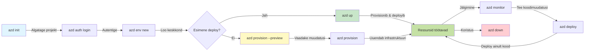
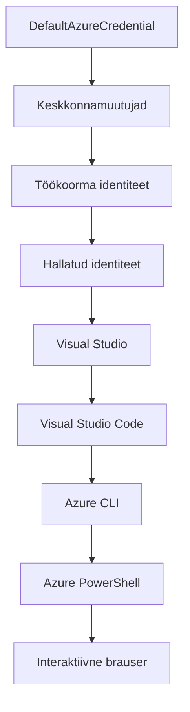

# AZD põhitõed - Azure Developer CLI mõistmine

# AZD põhitõed - põhimõisted ja alused

**Peatükkide navigeerimine:**
- **📚 Kursuse avaleht**: [AZD algajatele](../../README.md)
- **📖 Praegune peatükk**: Peatükk 1 - alus & kiire algus
- **⬅️ Eelmine**: [Kursuse ülevaade](../../README.md#-chapter-1-foundation--quick-start)
- **➡️ Järgmine**: [Paigaldus & seadistamine](installation.md)
- **🚀 Järgmine peatükk**: [Peatükk 2: AI-keskne arendus](../chapter-02-ai-development/microsoft-foundry-integration.md)

## Sissejuhatus

See õppetund tutvustab Azure Developer CLI-d (azd), võimast käsureatööriista, mis kiirendab teie teekonda kohalikust arendusest Azure'i juurutamiseni. Õpite põhimõisteid, põhifunktsioone ja mõistate, kuidas azd lihtsustab pilvepõhiste rakenduste juurutamist.

## Õpieesmärgid

Selle õppetunni lõpuks:
- Mõistate, mis on Azure Developer CLI ja selle peamist eesmärki
- Õpite malli-, keskkonna- ja teenuse põhikontseptsioone
- Uurite peamisi funktsioone, sealhulgas mallipõhist arendust ja Infrastructure as Code’i
- Saate aru azd projekti struktuurist ja töörühmast
- Olete valmis paigaldama ja seadistama azd oma arenduskeskkonnas

## Õpitulemused

Pärast selle õppetunni läbimist suudate:
- Selgitada azd rolli kaasaegsetes pilvearenduse töövoogudes
- Tuvastada azd projekti struktuuri komponendid
- Kirjeldada, kuidas mallid, keskkonnad ja teenused koos töötavad
- Mõista Infrastructure as Code’i eeliseid azd-ga
- Tunda ära erinevaid azd käske ja nende otstarvet

## Mis on Azure Developer CLI (azd)?

Azure Developer CLI (azd) on käsureatööriist, mis on loodud kiirendama teie teekonda kohalikust arendusest Azure'i juurutamiseni. See lihtsustab pilvepõhiste rakenduste ehitamist, juurutamist ja haldamist Azure’is.

### Mida saab azd-ga juurutada?

azd toetab laia valikut töökoormusi – ja nimekiri kasvab pidevalt. Täna saate azd-ga juurutada:

| Töökoormuse tüüp | Näited | Sama töövoog? |
|------------------|--------|--------------|
| **Traditsioonilised rakendused** | Veebirakendused, REST API-d, staatilised saidid | ✅ `azd up` |
| **Teenused ja mikroteenused** | Container Appsid, Function Appsid, mitme teenuse backendid | ✅ `azd up` |
| **AI-põhised rakendused** | Vestlusrakendused Microsoft Foundry mudelitega, RAG lahendused AI Search’iga | ✅ `azd up` |
| **Intelligent agents** | Foundry hostitud agendid, mitme agendi orkestreerimine | ✅ `azd up` |

Oluline mõte on see, et **azd elutsükkel on sama, sõltumata sellest, mida te juurutate**. Te algatate projekti, loote infrastruktuuri, juurutate koodi, jälgite rakendust ja koristate pärast – kas tegemist on lihtsa veebisaidiga või keeruka AI-agendiga.

See järjepidevus on teadlik disainivalik. azd käsitleb AI võimekust kui teist tüüpi teenust, mida teie rakendus kasutada saab, mitte midagi radikaalselt erinevat. Microsoft Foundry mudelitel põhinev jutupunkt on azd vaates lihtsalt veel üks teenus, mida seadistada ja juurutada.

### 🎯 Miks kasutada AZD-d? Reaalne võrdlus

Vaatame ette lihtsa veebirakenduse ja andmebaasi juurutamist:

#### ❌ ILMA AZD-TA: käsitsi Azure juurutamine (30+ minutit)

```bash
# Samm 1: Loo ressursirühm
az group create --name myapp-rg --location eastus

# Samm 2: Loo rakenduse teenuse plaan
az appservice plan create --name myapp-plan \
  --resource-group myapp-rg \
  --sku B1 --is-linux

# Samm 3: Loo veebirakendus
az webapp create --name myapp-web-unique123 \
  --resource-group myapp-rg \
  --plan myapp-plan \
  --runtime "NODE:18-lts"

# Samm 4: Loo Cosmos DB konto (10-15 minutit)
az cosmosdb create --name myapp-cosmos-unique123 \
  --resource-group myapp-rg \
  --kind MongoDB

# Samm 5: Loo andmebaas
az cosmosdb mongodb database create \
  --account-name myapp-cosmos-unique123 \
  --resource-group myapp-rg \
  --name tododb

# Samm 6: Loo kogu
az cosmosdb mongodb collection create \
  --account-name myapp-cosmos-unique123 \
  --resource-group myapp-rg \
  --database-name tododb \
  --name todos

# Samm 7: Hangi ühendusstring
CONN_STR=$(az cosmosdb keys list \
  --name myapp-cosmos-unique123 \
  --resource-group myapp-rg \
  --type connection-strings \
  --query "connectionStrings[0].connectionString" -o tsv)

# Samm 8: Konfigureeri rakenduse seaded
az webapp config appsettings set \
  --name myapp-web-unique123 \
  --resource-group myapp-rg \
  --settings MONGODB_URI="$CONN_STR"

# Samm 9: Luba logimine
az webapp log config --name myapp-web-unique123 \
  --resource-group myapp-rg \
  --application-logging filesystem \
  --detailed-error-messages true

# Samm 10: Sea üles Application Insights
az monitor app-insights component create \
  --app myapp-insights \
  --location eastus \
  --resource-group myapp-rg

# Samm 11: Seo App Insights veebirakendusega
INSTRUMENTATION_KEY=$(az monitor app-insights component show \
  --app myapp-insights \
  --resource-group myapp-rg \
  --query "instrumentationKey" -o tsv)

az webapp config appsettings set \
  --name myapp-web-unique123 \
  --resource-group myapp-rg \
  --settings APPINSIGHTS_INSTRUMENTATIONKEY="$INSTRUMENTATION_KEY"

# Samm 12: Koosta rakendus lokaalselt
npm install
npm run build

# Samm 13: Loo juurutuspakett
zip -r app.zip . -x "*.git*" "node_modules/*"

# Samm 14: Juuruta rakendus
az webapp deployment source config-zip \
  --resource-group myapp-rg \
  --name myapp-web-unique123 \
  --src app.zip

# Samm 15: Oota ja palveta, et see toimib 🙏
# (Automatiseeritud valideerimist pole, vajalik käsitsi testimine)
```
  
**Probleemid:**  
- ❌ >15 käsku meeles pidada ja õigesti järjestada  
- ❌ 30–45 minutit käsitsi tööd  
- ❌ Lihtne teha vigu (trükivead, valed parameetrid)  
- ❌ Ühendusstringid ilmuvad terminali ajaloos nähtavale  
- ❌ Pole automaatset tagasipöördumist kui midagi ebaõnnestub  
- ❌ Raske meeskonnakaaslastele taastada  
- ❌ Iga kord erinev (taastamatud sammud)  

#### ✅ AZD-GA: automatiseeritud juurutamine (5 käsku, 10–15 minutit)

```bash
# Samm 1: Algata mallist
azd init --template todo-nodejs-mongo

# Samm 2: Autendi
azd auth login

# Samm 3: Loo keskkond
azd env new dev

# Samm 4: Vaata muudatusi eelvaates (valikuline, kuid soovitatav)
azd provision --preview

# Samm 5: Arenda kõik välja
azd up

# ✨ Valmis! Kõik on välja arendatud, konfigureeritud ja jälgitav
```
  
**Eelised:**  
- ✅ **5 käsku** vs >15 käsitsi sammu  
- ✅ **10–15 minutit** kokku (põhiliselt ooteaeg Azure’is)  
- ✅ **Null vigu** - automatiseeritud ja testitud  
- ✅ **Saladused turvaliselt hallatud** Key Vault’i kaudu  
- ✅ **Automaatne tagasipöördumine** vigade korral  
- ✅ **Täielikult järjepidev ja taastatav** - iga kord sama tulemus  
- ✅ **Sobib tiimile** - igaüks saab kasutada samu käske  
- ✅ **Infrastructure as Code** - versioonihalduses Bicep mallid  
- ✅ **Automaatne jälgimine** - Application Insights seadistatud  

### 📊 Aja- ja vigade vähendamine

| Mõõdik | Käsitsi juurutamine | AZD juurutamine | Paranemine |
|:-------|:--------------------|:----------------|:-----------|
| **Käsud** | >15 | 5 | 67% vähem |
| **Aeg** | 30–45 min | 10–15 min | 60% kiirem |
| **Vigade määr** | ~40% | <5% | 88% vähendamine |
| **Järjepidevus** | Madal (käsitsi) | 100% (automatiseeritud) | Täiuslik |
| **Tiimi sisseelamine** | 2–4 tundi | 30 minutit | 75% kiirem |
| **Tagasipöördumise aeg** | 30+ minutit (käsitsi) | 2 minutit (automatiseeritud) | 93% kiirem |

## Peamised kontseptsioonid

### Mallid  
Mallid on azd alus. Need sisaldavad:  
- **Rakenduse kood** - teie lähtekood ja sõltuvused  
- **Infrastruktuuri määratlused** - Azure’i ressursid Bicepi või Terraformi kaudu  
- **Seadistusfailid** - sätted ja keskkonnamuutujad  
- **Juurutusskriptid** - automatiseeritud juurutamise töövood  

### Keskkonnad  
Keskkonnad tähistavad erinevaid juurutamise sihtkohti:  
- **Arendus** - testimiseks ja arenduseks  
- **Staging** - eeltootmiskeskkond  
- **Tootmine** - reaalne live keskkond  

Igal keskkonnal on oma:  
- Azure’i ressursigrupp  
- Konfiguratsiooniseaded  
- Juurutuse olek  

### Teenused  
Teenused on teie rakenduse ehituskivid:  
- **Frontend** - veebirakendused, SPA-d  
- **Backend** - API-d, mikroteenused  
- **Andmebaas** - andmesalvestuse lahendused  
- **Salvestus** - failide ja blobide salvestus  

## Peamised funktsioonid

### 1. Mallipõhine arendus  
```bash
# Sirvige saadaolevaid malle
azd template list

# Algata mallist
azd init --template <template-name>
```
  
### 2. Infrastructure as Code  
- **Bicep** - Azure’i domeenispetsiifiline keel  
- **Terraform** - Hübriidpilve infrastruktuuri tööriist  
- **ARM Mallid** - Azure Resource Manager mallid  

### 3. Integreeritud töövood  
```bash
# Täielik juurutamise töövoog
azd up            # Hankimine + juurutamine, see on esmakordseks seadistamiseks käed-vabad

# 🧪 UUS: Eelvaade infrastruktuuri muudatustest enne juurutamist (OHUTU)
azd provision --preview    # Simuleeri infrastruktuuri juurutamist ilma muudatusi tegemata

azd provision     # Loo Azure ressursid, kui uuendad infrastruktuuri, kasuta seda
azd deploy        # Juuruta rakenduse kood või juuruta rakenduse kood uuesti pärast uuendust
azd down          # Ressursside puhastamine
```
  
#### 🛡️ Turvaline infrastruktuuri planeerimine eelvaatega  
Käsk `azd provision --preview` on mängumuutja turvalistel juurutustel:  
- **Eelläbivaatamine** - näitab, mida luuakse, muudetakse või kustutatakse  
- **Nullrisk** - tegelikke muudatusi Azure’is ei toimu  
- **Tiimi koostöö** - jagage eelvaadet enne juurutamist  
- **Kulu hinnang** - mõistke ressursikulude mõju enne pühendumist  

```bash
# Näidisvalmimuse töövoog
azd provision --preview           # Vaata, mis muutub
# Vaata väljund üle, aruta meeskonnaga
azd provision                     # Rakenda muudatused kindlalt
```
  
### 📊 Visuaal: AZD arenduse töövoog  


**Töövoo selgitus:**  
1. **Init** - alustage mallist või uuest projektist  
2. **Auth** - autentige Azure’is  
3. **Keskkond** - looge isoleeritud juurutuskeskkond  
4. **Preview** - 🆕 Alati eelvaade infrastruktuuri muudatustele (turvaline tava)  
5. **Provision** - looge või uuendage Azure’i ressursse  
6. **Deploy** - lükake oma rakenduse kood üles  
7. **Monitor** - jälgige rakenduse jõudlust  
8. **Iterate** - tehke muudatusi ja juurutage uuesti  
9. **Cleanup** - eemaldage ressursid kui valmis  

### 4. Keskkondade haldus  
```bash
# Loo ja halda keskkondi
azd env new <environment-name>
azd env select <environment-name>
azd env list
```
  
### 5. Laiendused ja AI käsud  

azd kasutab laienduste süsteemi, et lisada võimalusi üle põhikäsurealiidese. See on eriti kasulik AI töökoormuste jaoks:  

```bash
# Loetle saadaolevad laiendused
azd extension list

# Paigalda Foundry agentide laiendus
azd extension install azure.ai.agents

# Algata tehisintellekti agendi projekt manifestist
azd ai agent init -m agent-manifest.yaml

# Käivita MCP server tehisintellekti abiga arendamiseks (Alfa)
azd mcp start
```
  
> Laiendused on põhjalikult käsitletud [Peatükis 2: AI-keskne arendus](../chapter-02-ai-development/agents.md) ja [AZD AI CLI käskude](../chapter-08-production/production-ai-practices.md#azd-ai-cli-commands-and-extensions) reference’is.  

## 📁 Projekti struktuur  

Tüüpiline azd projekti struktuur:  
```
my-app/
├── .azd/                    # azd configuration
│   └── config.json
├── .azure/                  # Azure deployment artifacts
├── .devcontainer/          # Development container config
├── .github/workflows/      # GitHub Actions
├── .vscode/               # VS Code settings
├── infra/                 # Infrastructure code
│   ├── main.bicep        # Main infrastructure template
│   ├── main.parameters.json
│   └── modules/          # Reusable modules
├── src/                  # Application source code
│   ├── api/             # Backend services
│   └── web/             # Frontend application
├── azure.yaml           # azd project configuration
└── README.md
```
  
## 🔧 Seadistusfailid  

### azure.yaml  
Põhiline projekti seadistusfail:  
```yaml
name: my-awesome-app
metadata:
  template: my-template@1.0.0

services:
  web:
    project: ./src/web
    language: js
    host: appservice
  api:
    project: ./src/api
    language: js
    host: appservice

hooks:
  preprovision:
    shell: pwsh
    run: echo "Preparing to provision..."
```
  
### .azure/config.json  
Keskkonnapõhine seadistus:  
```json
{
  "version": 1,
  "defaultEnvironment": "dev",
  "environments": {
    "dev": {
      "subscriptionId": "your-subscription-id",
      "location": "eastus"
    }
  }
}
```
  
## 🎪 Levinud töövood praktiliste harjutustega  

> **💡 Õpunipp:** Järgige neid harjutusi järjekorras, et järk-järgult arendada AZD oskusi.  

### 🎯 Harjutus 1: Looge oma esimene projekt  

**Eesmärk:** Looge AZD projekt ja uurige selle struktuuri  

**Sammud:**  
```bash
# Kasutage tõestatud mall
azd init --template todo-nodejs-mongo

# Uurige loodud faile
ls -la  # Vaadake kõiki faile, sh peidetud faile

# Loodud võtmefailid:
# - azure.yaml (põhikonfiguratsioon)
# - infra/ (taristu kood)
# - src/ (rakenduse kood)
```
  
**✅ Edu:** Teil on azure.yaml, infra/ ja src/ kaustad  

---  

### 🎯 Harjutus 2: Juurutage Azure’i  

**Eesmärk:** Lõplik juurutamine algusest lõpuni  

**Sammud:**  
```bash
# 1. Autendi
az login && azd auth login

# 2. Loo keskkond
azd env new dev
azd env set AZURE_LOCATION eastus

# 3. Vaata muudatusi eelvaates (SOOVITATAV)
azd provision --preview

# 4. Paigalda kõik
azd up

# 5. Kontrolli paigaldust
azd show    # Vaata oma rakenduse URL-i
```
  
**Oodatav aeg:** 10–15 minutit  
**✅ Edu:** Rakenduse URL avaneb brauseris  

---  

### 🎯 Harjutus 3: Mitmed keskkonnad  

**Eesmärk:** Juurutage dev ja staging keskkondadesse  

**Sammud:**  
```bash
# Dev olemas, loo staging
azd env new staging
azd env set AZURE_LOCATION westus2
azd up

# Vaheta nende vahel
azd env list
azd env select dev
```
  
**✅ Edu:** Kaks eraldi ressursigruppi Azure Portaalis  

---  

### 🛡️ Puhas algus: `azd down --force --purge`  

Kui peate keskkonna täielikult lähtestama:  

```bash
azd down --force --purge
```
  
**Mida see teeb:**  
- `--force`: Ei nõua kinnitust  
- `--purge`: Kustutab kogu lokaalse oleku ja Azure ressursid  

**Kasutamiseks, kui:**  
- Juurutamine ebaõnnestus poole peal  
- Projekti vahetate  
- Vajate uut algust  

---  

## 🎪 Originaal töövoo reference  

### Uue projekti käivitamine  
```bash
# Meetod 1: Kasuta olemasolevat malli
azd init --template todo-nodejs-mongo

# Meetod 2: Alusta nullist
azd init

# Meetod 3: Kasuta praegust kausta
azd init .
```
  
### Arendustsükkel  
```bash
# Arenduskeskkonna seadistamine
azd auth login
azd env new dev
azd env select dev

# Kõige juurutamine
azd up

# Tee muudatusi ja juuruta uuesti
azd deploy

# Puhasta pärast lõpetamist
azd down --force --purge # käsk Azure Developer CLI-s on sinu keskkonna **tõsine lähtestamine**—eriti kasulik, kui sa lahendad ebaõnnestunud juurutusi, puhastad hüljatud ressursse või valmistud uueks juurutamiseks.
```
  
## `azd down --force --purge` mõistmine  
Käsk `azd down --force --purge` on võimas viis oma azd keskkonna ja kõigi seotud ressursside täielikuks eemaldamiseks. Siin on selgitus, mida iga lipp teeb:  
```
--force
```
- Jätab vahele kinnitusküsimused.  
- Kasulik automatiseerimise või skriptimise puhul, kus käsitsi sisend pole võimalik.  
- Tagab, et sulgemine kulgeb katkestusteta, isegi kui CLI tuvastab ebakõlasid.  

```
--purge
```
Kustutab **kõik seotud metaandmed**, sh:  
Keskkonna oleku  
Lokaalne `.azure` kaust  
Vahemällu salvestatud juurutuse info  
Tõkestab azd-l eelnevate juurutuste "meelespidamise", mis võib põhjustada probleeme nagu ebasobivad ressursigrupid või aegunud registriviited.  

### Miks kasutada mõlemat?  
Kui olete `azd up`-ga takerdunud jätkuva oleku või osalise juurutusega, tagab see kombinatsioon **puhaste lehtede alguse**.  

See on eriti kasulik pärast käsitsi kustutamist Azure portaalis või mallide, keskkondade või ressursigruppide nimetustestide vahetamisel.  

### Mitme keskkonna haldamine  
```bash
# Loo staging keskkond
azd env new staging
azd env select staging
azd up

# Vaheta tagasi arendusrežiimi
azd env select dev

# Võrdle keskkondi
azd env list
```
  
## 🔐 Autentimine ja volitused  

Autentimise mõistmine on edukate azd juurutuste jaoks kriitiline. Azure kasutab mitut autentimismeetodit ja azd kasutab samu volituste ahelaid, mida ka teised Azure tööriistad.  

### Azure CLI autentimine (`az login`)  

Enne azd kasutamist peate Azure’is autentima. Kõige levinum meetod on Azure CLI kasutamine:  

```bash
# Interaktiivne sisselogimine (avab brauseri)
az login

# Logi sisse konkreetse üürnikuna
az login --tenant <tenant-id>

# Logi sisse teenuseteenuse kontoga
az login --service-principal -u <app-id> -p <password> --tenant <tenant-id>

# Kontrolli praegust sisselogimise olekut
az account show

# Loetle saadaolevad tellimused
az account list --output table

# Sea vaikimisi tellimus
az account set --subscription <subscription-id>
```
  
### Autentimise voog  
1. **Interaktiivne sisselogimine**: Avab brauseri vaikimisi autentimiseks  
2. **Seadmekoodi voog**: Keskkondade jaoks, kus puudub brauseri juurdepääs  
3. **Teenuse põhiüksus (Service Principal)**: Automatiseerimise ja CI/CD stsenaariumide jaoks  
4. **Haldusidentiteet**: Azure’is hostitud rakenduste jaoks  

### DefaultAzureCredential kett  
`DefaultAzureCredential` on volitustüüp, mis pakub lihtsustatud autentimiskogemust, püüdes automaatselt mitmeid volituste allikaid kindlas järjekorras:  

#### Volituste keti järjestus  

#### 1. Keskkonnamuutujad  
```bash
# Määra teenuse põhisekretäri keskkonnamuutujad
export AZURE_CLIENT_ID="<app-id>"
export AZURE_CLIENT_SECRET="<password>"
export AZURE_TENANT_ID="<tenant-id>"
```
  
#### 2. Töökoormuse identiteet (Kubernetes/GitHub Actions)  
Automaatne kasutus:  
- Azure Kubernetes Service (AKS) töökoormuse identiteediga  
- GitHub Actions OIDC föderatsiooniga  
- Muud födereeritud identiteedi stsenaariumid  

#### 3. Haldusidentiteet  
Azure'i ressursside jaoks nagu:  
- Virtuaalmasinad  
- App Service  
- Azure Functions  
- Container Instances  

```bash
# Kontrolli, kas töötab Azure'i ressursil hallatud identiteediga
az account show --query "user.type" --output tsv
# Tagastab: "servicePrincipal", kui kasutatakse hallatud identiteeti
```
  
#### 4. Arendustööriistade integratsioon  
- **Visual Studio**: Kasutab automaatselt sisse logitud kontot  
- **VS Code**: Kasutab Azure Account laienduse volitusi  
- **Azure CLI**: Kasutab `az login` volitusi (kohaliku arenduse kõige tavalisem)  

### AZD autentimise seadistamine  

```bash
# Meetod 1: Kasuta Azure CLI-d (Soovitatav arendamiseks)
az login
azd auth login  # Kasutab olemasolevaid Azure CLI mandaate

# Meetod 2: Otsene azd autentimine
azd auth login --use-device-code  # Peatajuvates keskkondades

# Meetod 3: Kontrolli autentimise olekut
azd auth login --check-status

# Meetod 4: Logi välja ja autentitu uuesti
azd auth logout
azd auth login
```
  
### Autentimise head tavad  

#### Kohaliku arenduse jaoks  
```bash
# 1. Logi sisse Azure CLI-ga
az login

# 2. Kontrolli õiget tellimust
az account show
az account set --subscription "Your Subscription Name"

# 3. Kasuta azd olemasolevate volitustega
azd auth login
```
  
#### CI/CD torujuhtmete jaoks  
```yaml
# GitHub Actions example
- name: Azure Login
  uses: azure/login@v1
  with:
    creds: ${{ secrets.AZURE_CREDENTIALS }}

- name: Deploy with azd
  run: |
    azd auth login --client-id ${{ secrets.AZURE_CLIENT_ID }} \
                    --client-secret ${{ secrets.AZURE_CLIENT_SECRET }} \
                    --tenant-id ${{ secrets.AZURE_TENANT_ID }}
    azd up --no-prompt
```
  
#### Tootmiskeskkondades  
- Kasutage **Haldusidentiteeti** kui töötab Azure’i ressurssidel  
- Kasutage **Teenuse põhiüksust** automatiseerimise stsenaariumides  
- Vältige volituste salvestamist koodi või konfiguratsiooni  
- Kasutage **Azure Key Vault’i** tundliku konfiguratsiooni jaoks  

### Levinud autentimise probleemid ja lahendused  

#### Probleem: "Konto puudub"  
```bash
# Lahendus: Määra vaikimisi tellimus
az account list --output table
az account set --subscription "<subscription-id>"
azd env set AZURE_SUBSCRIPTION_ID "<subscription-id>"
```
  
#### Probleem: "Piiratud õigused"  
```bash
# Lahendus: Kontrolli ja määra vajalikud rollid
az role assignment list --assignee $(az account show --query user.name --output tsv)

# Üldised vajalikud rollid:
# - Kaastööline (ressursside haldamiseks)
# - Kasutaja ligipääsu administraator (rolli määramiseks)
```
  
#### Probleem: "Token aegunud"  
```bash
# Lahendus: Autentige uuesti
az logout
az login
azd auth logout
azd auth login
```
  
### Autentimine erinevates stsenaariumides  

#### Kohalik arendus  
```bash
# Personal development account
az login
azd auth login
```
  
#### Tiimi arendus  
```bash
# Kasutage organisatsiooni jaoks konkreetset üürnikku
az login --tenant contoso.onmicrosoft.com
azd auth login
```
  
#### Mitme üürniku stsenaariumid  
```bash
# Vaheta üürnike vahel
az login --tenant tenant1.onmicrosoft.com
# Paigalda üürnikule 1
azd up

az login --tenant tenant2.onmicrosoft.com  
# Paigalda üürnikule 2
azd up
```
  
### Turvaküsimused
1. **Tunnuste salvestamine**: Ära kunagi salvesta tunnuseid lähtekoodi
2. **Piirangu kehtestamine**: Kasuta teenusprincipaalide puhul vähima õiguse põhimõtet
3. **Tokeni pööramine**: Pööra teenusprincipaali saladusi regulaarselt
4. **Auditijälg**: Jälgi autentimist ja juurutustegevusi
5. **Võrgu turvalisus**: Kasuta võimalusel privaatseid lõpp-punkte

### Autentimise tõrkeotsing

```bash
# Tõrkeotsing autentimisprobleemide jaoks
azd auth login --check-status
az account show
az account get-access-token

# Levinud diagnostikakäsud
whoami                          # Praegune kasutaja kontekst
az ad signed-in-user show      # Azure AD kasutaja andmed
az group list                  # Testi ressursi juurdepääsu
```

## Mõistmine `azd down --force --purge`

### Avastamine
```bash
azd template list              # Sirvi malle
azd template show <template>   # Malleteabe
azd init --help               # Initsialiseerimisvalikud
```

### Projekti haldamine
```bash
azd show                     # Projekti ülevaade
azd env show                 # Praegune keskkond
azd config list             # Konfiguratsiooni seaded
```

### Jälgimine
```bash
azd monitor                  # Ava Azure portaali jälgimine
azd monitor --logs           # Vaata rakenduse logisid
azd monitor --live           # Vaata reaalajas mõõdikuid
azd pipeline config          # Sea üles CI/CD
```

## Parimad tavad

### 1. Kasuta tähendusrikkaid nimesid
```bash
# Hea
azd env new production-east
azd init --template web-app-secure

# Vältima
azd env new env1
azd init --template template1
```

### 2. Kasuta malle
- Alusta olemasolevate mallide kasutamisest
- Kohanda vastavalt oma vajadustele
- Loo korduvkasutatavad mallid oma organisatsiooni jaoks

### 3. Keskkonna isoleerimine
- Kasuta eraldi keskkondi arendus-/staging-/tootmiseks
- Ära juuruta otse tootmisse kohaliku masina pealt
- Kasuta CI/CD torujuhtmeid tootmise juurutamiseks

### 4. Konfiguratsiooni haldamine
- Kasuta keskkonnamuutujaid tundliku info jaoks
- Hoia konfiguratsioon versioonihalduses
- Dokumenteeri keskkonnaspetsiifilised seaded

## Õppimise areng

### Algaja (1.-2. nädal)
1. Paigalda azd ja autentitu
2. Juuruta lihtne mall
3. Mõista projekti ülesehitust
4. Õpi põhilisi käske (up, down, deploy)

### Kesktase (3.-4. nädal)
1. Kohanda malle
2. Halda mitut keskkonda
3. Mõista infrastruktuuri koodi
4. Sea üles CI/CD torujuhtmed

### Edasijõudnud (5. nädal ja edasi)
1. Loo kohandatud malle
2. Täiustatud infrastruktuuri mustrid
3. Mitmeregioonilised juurutused
4. Ettevõtte taseme konfiguratsioonid

## Järgmised sammud

**📖 Jätka peatükiga 1:**
- [Paigaldus ja seadistamine](installation.md) - Paigalda ja seadista azd
- [Sinu esimene projekt](first-project.md) - Lõpeta praktiline õpetus
- [Konfiguratsioonijuhend](configuration.md) - Täiustatud konfiguratsiooni võimalused

**🎯 Valmis järgmise peatüki jaoks?**
- [Peatükk 2: AI-keskne arendus](../chapter-02-ai-development/microsoft-foundry-integration.md) - Alusta AI rakenduste loomist

## Lisamaterjalid

- [Azure Developer CLI ülevaade](https://learn.microsoft.com/en-us/azure/developer/azure-developer-cli/)
- [Malligalerii](https://azure.github.io/awesome-azd/)
- [Kogukonna näited](https://github.com/Azure-Samples)

---

## 🙋 Korduma kippuvad küsimused

### Üldised küsimused

**K: Mis vahe on AZD-l ja Azure CLI-l?**

V: Azure CLI (`az`) haldab üksikuid Azure ressursse. AZD (`azd`) haldab terviklikke rakendusi:

```bash
# Azure CLI - madala taseme ressursside haldamine
az webapp create --name myapp --resource-group rg
az sql server create --name myserver --resource-group rg
# ...vajalik veel palju käske

# AZD - rakenduse taseme haldamine
azd up  # Paigaldab kogu rakenduse koos kõigi ressurssidega
```

**Mõtle nii:**
- `az` = Üksikute Lego klotsidega töötamine
- `azd` = Täielike Lego komplektide kasutamine

---

**K: Kas pean AZD kasutamiseks teadma Bicepit või Terraformi?**

V: Ei! Alusta mallide kasutamisest:
```bash
# Kasutage olemasolevat malli - IaC teadmisi ei ole vaja
azd init --template todo-nodejs-mongo
azd up
```

Hiljem võid õppida Bicepit infrastruktuuri kohandamiseks. Mallid pakuvad töövalmis näiteid, millest õppida.

---

**K: Kui palju maksab AZD mallide jooksutamine?**

V: Kulu sõltub mallist. Enamik arenduse malli maksab 50-150 dollarit kuus:

```bash
# Vaata kulusid enne kasutuselevõttu
azd provision --preview

# Alati puhasta, kui ei kasutata
azd down --force --purge  # Eemaldab kõik ressursid
```

**Nõuanne:** Kasuta tasuta tasemeid, kus võimalik:
- App Service: F1 (tasuta) tase
- Microsoft Foundry mudelid: Azure OpenAI 50,000 tokenit kuus tasuta
- Cosmos DB: 1000 RU/s tasuta tase

---

**K: Kas saan AZD kasutada olemasolevate Azure ressurssidega?**

V: Jah, kuid lihtsam on alustada puhtalt lehelt. AZD töötab kõige paremini, kui haldab kogu elutsüklit. Olemasolevate ressursside puhul:

```bash
# Valik 1: Impordi olemasolevad ressursid (edasijõudnutele)
azd init
# Seejärel muuda infra/ nii, et see viitaks olemasolevatele ressurssidele

# Valik 2: Alusta uuesti (soovitatav)
azd init --template matching-your-stack
azd up  # Loob uue keskkonna
```

---

**K: Kuidas jagada oma projekti meeskonnakaaslastega?**

V: Pane AZD projekt Git-i (aga ÄRA lisa .azure kausta):

```bash
# Juba vaikimisi .gitignore failis
.azure/        # Sisaldab saladusi ja keskkonna andmeid
*.env          # Keskkonnamuutujad

# Meeskonnaliikmed siis:
git clone <your-repo>
azd auth login
azd env new <their-name>-dev
azd up
```

Kõik saavad samast mallist loodud identsed infrastruktuurid.

---

### Tõrkeotsingu küsimused

**K: "azd up" nurjus poole peale. Mida teha?**

V: Kontrolli viga, paranda ja proovi uuesti:

```bash
# Vaata üksikasjalikke logisid
azd show

# Levinud parandused:

# 1. Kui kvant leidub:
azd env set AZURE_LOCATION "westus2"  # Proovi teist piirkonda

# 2. Kui ressursi nime konflikt:
azd down --force --purge  # Puhas leht
azd up  # Proovi uuesti

# 3. Kui autentimine on aegunud:
az login
azd auth login
azd up
```

**Sagedaseim probleem:** Valitud vale Azure tellimus
```bash
az account list --output table
az account set --subscription "<correct-subscription>"
```

---

**K: Kuidas juurutada ainult koodimuudatusi, ilma infrastruktuuri uuesti üles seadmata?**

V: Kasuta `azd deploy` asemel `azd up`:

```bash
azd up          # Esimene kord: tarkvara ettevalmistamine + juurutamine (aeglane)

# Tee koodi muudatusi...

azd deploy      # Järgnevad korrad: ainult juurutamine (kiire)
```

Kiiruse võrdlus:
- `azd up`: 10-15 minutit (infrastruktuuri juurutamine)
- `azd deploy`: 2-5 minutit (ainult kood)

---

**K: Kas saan infrastruktuuri malle kohandada?**

V: Jah! Muuda `infra/` kataloogis olevaid Bicep-faile:

```bash
# Pärast azd init
cd infra/
code main.bicep  # Muuda VS Code'is

# Eelvaate muudatused
azd provision --preview

# Rakenda muudatused
azd provision
```

**Nõuanne:** Alusta väikestest muutustest - muuda esmalt SKU-sid:
```bicep
// infra/main.bicep
sku: {
  name: 'B1'  // Change to 'P1V2' for production
}
```

---

**K: Kuidas kustutada kõik, mida AZD lõi?**

V: Üks käsk eemaldab kõik ressursid:

```bash
azd down --force --purge

# See kustutab:
# - Kõik Azure'i ressursid
# - Ressursside grupi
# - Kohaliku keskkonna oleku
# - Vahemällu salvestatud juurutusandmed
```

**Kasuta alati kui:**
- Oled malli testimise lõpetanud
- Vahetad projekti
- Tahad alustada puhtalt lehelt

**Kulu kokkuhoid:** Kasutamata ressursside kustutamine = $0 tasu

---

**K: Mis siis, kui ma kogemata kustutasin ressursse Azure portalist?**

V: AZD seisund võib sünkroonsust kaotada. Puhasta kõike alustades:

```bash
# 1. Eemalda kohalik olek
azd down --force --purge

# 2. Alusta uuesti
azd up

# Alternatiiv: Luba AZD-l tuvastada ja parandada
azd provision  # Loob puuduvad ressursid
```

---

### Edasijõudnud küsimused

**K: Kas AZD-d saab kasutada CI/CD torujuhtmetes?**

V: Jah! Näide GitHub Actions-ist:

```yaml
# .github/workflows/deploy.yml
name: Deploy with AZD

on:
  push:
    branches: [main]

jobs:
  deploy:
    runs-on: ubuntu-latest
    steps:
      - uses: actions/checkout@v2
      
      - name: Install azd
        run: curl -fsSL https://aka.ms/install-azd.sh | bash
      
      - name: Azure Login
        run: |
          azd auth login \
            --client-id ${{ secrets.AZURE_CLIENT_ID }} \
            --client-secret ${{ secrets.AZURE_CLIENT_SECRET }} \
            --tenant-id ${{ secrets.AZURE_TENANT_ID }}
      
      - name: Deploy
        run: azd up --no-prompt
```

---

**K: Kuidas käsitled saladusi ja tundlikku infot?**

V: AZD integreerub automaatselt Azure Key Vaultiga:

```bash
# Saladused salvestatakse Key Vaulti, mitte koodi
azd env set DATABASE_PASSWORD "$(openssl rand -base64 32)"

# AZD automaatselt:
# 1. Loodab Key Vaulti
# 2. Salvestab salajasõna
# 3. Annab rakendusele juurdepääsu hallatava identiteedi kaudu
# 4. Süstib käitamisajal
```

**Ära kunagi pane versioonihaldusse:**
- `.azure/` kaust (sisaldab keskkonna andmeid)
- `.env` failid (kohalikud saladused)
- Ühendusstringid

---

**K: Kas saan juurutada mitmesse regiooni?**

V: Jah, loo iga regiooni kohta eraldi keskkond:

```bash
# Ida-USA keskkond
azd env new prod-eastus
azd env set AZURE_LOCATION eastus
azd up

# Lääne-Euroopa keskkond
azd env new prod-westeurope
azd env set AZURE_LOCATION westeurope
azd up

# Iga keskkond on iseseisev
azd env list
```

Tõeliste mitmeregiooniliste rakenduste puhul kohanda Bicep malle, et korraga mitmesse regiooni juurutada.

---

**K: Kust ma saan abi, kui takerdun?**

1. **AZD dokumentatsioon:** https://learn.microsoft.com/azure/developer/azure-developer-cli/
2. **GitHub probleemid:** https://github.com/Azure/azure-dev/issues
3. **Discord:** [Azure Discord](https://discord.gg/microsoft-azure) - #azure-developer-cli kanal
4. **Stack Overflow:** Märksõna `azure-developer-cli`
5. **See kursus:** [Tõrkeotsingu juhend](../chapter-07-troubleshooting/common-issues.md)

**Nõuanne:** Enne küsimuse esitamist käivita:
```bash
azd show       # Kuvab praeguse oleku
azd version    # Kuvab teie versiooni
```
Lisa see info oma küsimusse kiirema abi saamiseks.

---

## 🎓 Mis edasi?

Nüüd mõistad AZD aluseid. Vali oma tee:

### 🎯 Algajatele:
1. **Järgmine samm:** [Paigaldus ja seadistamine](installation.md) - Paigalda AZD oma arvutisse
2. **Siis:** [Sinu esimene projekt](first-project.md) - Juuruta oma esimene rakendus
3. **Harjuta:** Täida selle õppetüki kõik 3 harjutust

### 🚀 Tehisintellekti arendajatele:
1. **Hüppa juurde:** [Peatükk 2: AI-keskne arendus](../chapter-02-ai-development/microsoft-foundry-integration.md)
2. **Juuruta:** Alusta käsuga `azd init --template get-started-with-ai-chat`
3. **Õpi:** Arenda ja juuruta paralleelselt

### 🏗️ Kogenud arendajatele:
1. **Vaata üle:** [Konfiguratsioonijuhend](configuration.md) - Täiustatud seaded
2. **Uuri:** [Infra koodina](../chapter-04-infrastructure/provisioning.md) - Süvitsi Bicepi teemad
3. **Loo:** Tee oma malle oma tehnoloogiapinule

---

**Peatükkide navigeerimine:**
- **📚 Kursuse avaleht**: [AZD algajatele](../../README.md)
- **📖 Jooksev peatükk**: Peatükk 1 - Alused ja kiire algus  
- **⬅️ Eelmine**: [Kursuse ülevaade](../../README.md#-chapter-1-foundation--quick-start)
- **➡️ Järgmine**: [Paigaldus ja seadistamine](installation.md)
- **🚀 Järgmine peatükk**: [Peatükk 2: AI-keskne arendus](../chapter-02-ai-development/microsoft-foundry-integration.md)

---

<!-- CO-OP TRANSLATOR DISCLAIMER START -->
**Vastutusest loobumine**:
See dokument on tõlgitud kasutades tehisintellektil põhinevat tõlketeenust [Co-op Translator](https://github.com/Azure/co-op-translator). Kuigi püüame tagada täpsust, palun arvestage, et automaatsed tõlked võivad sisaldada vigu või ebatäpsusi. Algne dokument selle emakeeles tuleks pidada autoriteetseks allikaks. Olulise teabe puhul soovitatakse kasutada professionaalset inimtõlget. Me ei vastuta selle tõlke kasutamisest tingitud valesti mõistmiste või tõlgenduste eest.
<!-- CO-OP TRANSLATOR DISCLAIMER END -->