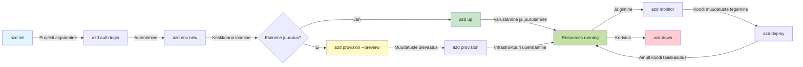
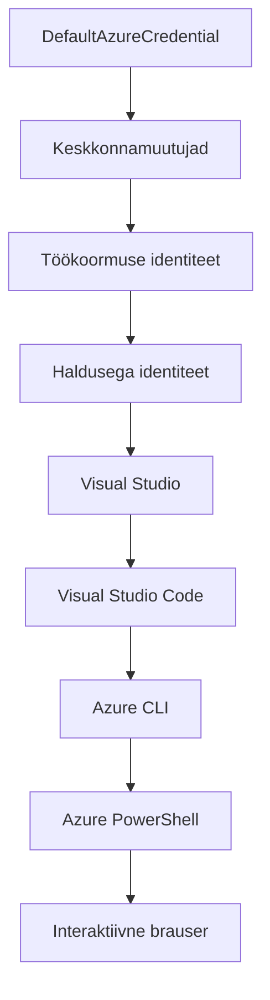

# AZD alused - Azure Developer CLI mõistmine

# AZD alused - Põhikontseptsioonid ja alused

**Peatüki navigeerimine:**
- **📚 Kursuse avaleht**: [AZD algajatele](../../README.md)
- **📖 Jooksev peatükk**: Peatükk 1 - Alus ja kiire alustamine
- **⬅️ Eelmine**: [Kursuse ülevaade](../../README.md#-chapter-1-foundation--quick-start)
- **➡️ Järgmine**: [Paigaldus ja seadistamine](installation.md)
- **🚀 Järgmine peatükk**: [Peatükk 2: AI-eeline arendus](../chapter-02-ai-development/microsoft-foundry-integration.md)

## Sissejuhatus

See õppetund tutvustab sulle Azure Developer CLI-d (azd), võimsat käsurea tööriista, mis kiirendab sinu teekonda kohalikust arendusest Azure'i juurutuseni. Sa õpid põhimõtteid, põhifunktsioone ja mõistad, kuidas azd lihtsustab pilvepõhiste rakenduste juurutamist.

## Õpieesmärgid

Pärast selle õppetunni lõppu:
- Mõistad, mis on Azure Developer CLI ja selle põhiline eesmärk
- Õpid malli-, keskkonna- ja teenuse põhikontseptsioonid
- Uurid võtmefunktsioone, sealhulgas mallipõhist arendust ja infrastruktuuri kui koodi
- Mõistad azd projekti ülesehitust ja töövoogu
- Oled valmis azd installima ja seadistama oma arenduskeskkonnas

## Õpitulemused

Selle õppetunni läbimisel oskad:
- Selgitada azd rolli tänapäevastes pilvearenduse töövoogudes
- Tuvastada azd projekti struktuuri komponente
- Kirjeldada, kuidas mallid, keskkonnad ja teenused töötavad koos
- Mõista infrastruktuuri kui koodi eeliseid azd-ga
- Tunda ära erinevaid azd käske ja nende eesmärke

## Mis on Azure Developer CLI (azd)?

Azure Developer CLI (azd) on käsurea tööriist, mis on loodud kiirendama sinu teekonda kohalikust arendusest Azure'i juurutuseni. See lihtsustab pilvepõhiste rakenduste ehitamist, juurutamist ja haldamist Azure'is.

### Mida saad azd-ga juurutada?

azd toetab laia valikut töökoormusi — ja nimekiri kasvab pidevalt. Täna saad azd kasutada järgmiste juurutamiseks:

| Töökoormuse tüüp | Näited | Sama töövoog? |
|------------------|---------|---------------|
| **Traditsioonilised rakendused** | Veebirakendused, REST API-d, staatilised saidid | ✅ `azd up` |
| **Teenused ja mikroteenused** | Container Apps, Function Apps, mitme teenusega taustsüsteemid | ✅ `azd up` |
| **Tehisintellektiga rakendused** | Vestlusrakendused Microsoft Foundry mudelitega, RAG lahendused AI Search'iga | ✅ `azd up` |
| **Intelligentset agenti** | Foundry majutatud agendid, mitme agendi orkestratsioonid | ✅ `azd up` |

Oluline on mõista, et **azd elutsükkel on sama, olenemata sellest, mida sa juurutad**. Sa algatad projekti, varustad infrastruktuuri, juurutad koodi, jälgid oma rakendust ja puhastad üles — olgu see lihtne veebisait või keerukas AI agent.

See järjepidevus on teadlik disainivalik. azd käsitleb AI võimekust kui veel üht teenust, mida sinu rakendus võib kasutada, mitte midagi fundamentaalselt erinevat. Vestluspunkt Microsoft Foundry mudelite taga on azd vaatepunktist lihtsalt veel üks teenus, mida konfigureerida ja juurutada.

### 🎯 Miks kasutada AZD? Tõsieluline võrdlus

Vaatame lihtsa veebirakenduse ja andmebaasi juurutamist:

#### ❌ ILMA AZD-TA: käsitsi Azure'i juurutus (30+ minutit)

```bash
# Samm 1: Loo ressursigrupi
az group create --name myapp-rg --location eastus

# Samm 2: Loo App Service'i plaan
az appservice plan create --name myapp-plan \
  --resource-group myapp-rg \
  --sku B1 --is-linux

# Samm 3: Loo veebirakendus
az webapp create --name myapp-web-unique123 \
  --resource-group myapp-rg \
  --plan myapp-plan \
  --runtime "NODE:18-lts"

# Samm 4: Loo Cosmos DB konto (10-15 minutit)
az cosmosdb create --name myapp-cosmos-unique123 \
  --resource-group myapp-rg \
  --kind MongoDB

# Samm 5: Loo andmebaas
az cosmosdb mongodb database create \
  --account-name myapp-cosmos-unique123 \
  --resource-group myapp-rg \
  --name tododb

# Samm 6: Loo kollektsioon
az cosmosdb mongodb collection create \
  --account-name myapp-cosmos-unique123 \
  --resource-group myapp-rg \
  --database-name tododb \
  --name todos

# Samm 7: Hangi ühendusstring
CONN_STR=$(az cosmosdb keys list \
  --name myapp-cosmos-unique123 \
  --resource-group myapp-rg \
  --type connection-strings \
  --query "connectionStrings[0].connectionString" -o tsv)

# Samm 8: Konfigureeri rakenduse seaded
az webapp config appsettings set \
  --name myapp-web-unique123 \
  --resource-group myapp-rg \
  --settings MONGODB_URI="$CONN_STR"

# Samm 9: Luba logimine
az webapp log config --name myapp-web-unique123 \
  --resource-group myapp-rg \
  --application-logging filesystem \
  --detailed-error-messages true

# Samm 10: Sea üles Application Insights
az monitor app-insights component create \
  --app myapp-insights \
  --location eastus \
  --resource-group myapp-rg

# Samm 11: Seo App Insights veebirakendusega
INSTRUMENTATION_KEY=$(az monitor app-insights component show \
  --app myapp-insights \
  --resource-group myapp-rg \
  --query "instrumentationKey" -o tsv)

az webapp config appsettings set \
  --name myapp-web-unique123 \
  --resource-group myapp-rg \
  --settings APPINSIGHTS_INSTRUMENTATIONKEY="$INSTRUMENTATION_KEY"

# Samm 12: Koosta rakendus kohapeal
npm install
npm run build

# Samm 13: Loo juurutuspakk
zip -r app.zip . -x "*.git*" "node_modules/*"

# Samm 14: Juuruta rakendus
az webapp deployment source config-zip \
  --resource-group myapp-rg \
  --name myapp-web-unique123 \
  --src app.zip

# Samm 15: Oota ja palveta, et see toimiks 🙏
# (Automaatset valideerimist ei ole, vajalik käsitsi testimine)
```

**Probleemid:**
- ❌ 15+ käsku meenutada ja õiges järjekorras täita
- ❌ 30-45 minutit käsitööd
- ❌ Lihtne teha vigu (trükivead, valed parameetrid)
- ❌ Ühendusstringid nähtavad terminali ajaloos
- ❌ Automaatne tagasipööre puudub, kui midagi ebaõnnestub
- ❌ Raske meeskonnaliikmetele replitseerida
- ❌ Iga kord erinev (mittereproduseeritav)

#### ✅ AZD-GA: automatiseeritud juurutus (5 käsku, 10-15 minutit)

```bash
# Samm 1: Alusta mallist
azd init --template todo-nodejs-mongo

# Samm 2: Autendiimine
azd auth login

# Samm 3: Loo keskkond
azd env new dev

# Samm 4: Muudatuste eelvaade (valikuline, kuid soovitatav)
azd provision --preview

# Samm 5: Paiguta kõik
azd up

# ✨ Valmis! Kõik on paigaldatud, seadistatud ja jälgitav
```

**Eelised:**
- ✅ **5 käsku** vs 15+ käsitsi sammu
- ✅ **10-15 minutit** kokku (enamasti ooteaeg Azure'is)
- ✅ **Vähem käsitsi vigu** — järjepidev, mallipõhine töövoog
- ✅ **Turvaline salastuse haldus** — paljud mallid kasutavad Azure'i hallatavat salajast salvestust
- ✅ **Korduvad juurutused** — iga kord sama töövoog
- ✅ **Täielikult reprodutseeritav** — iga kord sama tulemus
- ✅ **Meeskonna jaoks valmis** — igaüks saab sama käsuga juurutada
- ✅ **Infrastruktuur kui kood** — versioonihalduses Bicep mallid
- ✅ **Sisseehitatud jälgimine** — Application Insights konfigureeritakse automaatselt

### 📊 Aja ja vigade vähendamine

| Mõõdik | Käsitsi juurutus | AZD juurutus | Parandus |
|:-------|:-----------------|:-------------|:---------|
| **Käsud** | 15+ | 5 | 67% vähem |
| **Aeg** | 30-45 min | 10-15 min | 60% kiirem |
| **Vigade määr** | ~40% | <5% | 88% vähendamine |
| **Järjepidevus** | Madal (käsitsi) | 100% (automatiseeritud) | Täiuslik |
| **Meeskonna sisseõppimine** | 2-4 tundi | 30 minutit | 75% kiirem |
| **Tagasipöörde aeg** | 30+ min (käsitsi) | 2 min (automatiseeritud) | 93% kiirem |

## Põhikontseptsioonid

### Mallid
Mallid on azd aluseks. Need sisaldavad:
- **Rakenduse kood** - sinu lähtekood ja sõltuvused
- **Infrastruktuuri definitsioonid** - Azure ressursid Bicep või Terraform-is
- **Seadistuse failid** - sätted ja keskkonnamuutujad
- **Juurutusskriptid** - automatiseeritud juurutusprotsessid

### Keskkonnad
Keskkonnad tähistavad erinevaid juurutuse sihtkohti:
- **Arendus** - testimiseks ja arendamiseks
- **Ettevalmistus** - eeltootmise keskkond
- **Tootmine** - reaalne tootmiskeskkond

Igal keskkonnal on oma:
- Azure ressursigrupp
- Seadistused
- Juurutuse olek

### Teenused
Teenused on sinu rakenduse ehituskivid:
- **Frontend** - veebirakendused, SPA-d
- **Backend** - API-d, mikroteenused
- **Andmebaas** - andmete salvestuslahendused
- **Salvestus** - faili- ja blobisaldistus

## Võtmefunktsioonid

### 1. Mallipõhine arendus
```bash
# Sirvi saadaolevaid malle
azd template list

# Alusta mallist
azd init --template <template-name>
```

### 2. Infrastruktuur kui kood
- **Bicep** - Azure domeenispetsiifiline keel
- **Terraform** - Mitme pilve infrastruktuuritööriist
- **ARM mallid** - Azure Resource Manageri mallid

### 3. Integreeritud töövood
```bash
# Täielik juurutuse töövoog
azd up            # Provision + Deploy see on esmakordseks seadistamiseks automaatne

# 🧪 UUS: Vaata infrastruktuuri muudatusi enne juurutamist (OHUTU)
azd provision --preview    # Simuleeri infrastruktuuri juurutamist muudatusi tegemata

azd provision     # Loo Azure'i ressursid, kui värskendad infrastruktuuri kasuta seda
azd deploy        # Juuruta rakenduse kood või juuruta rakenduse kood uuesti pärast värskendust
azd down          # Ressursside puhastamine
```

#### 🛡️ Turvaline infrastruktuuri planeerimine eelvaatega
Käsk `azd provision --preview` on mängumuutja turvaliste juurutuste jaoks:
- **Kuivkäigu analüüs** - näitab, mis luuakse, muudetakse või kustutatakse
- **Nullrisk** - tegelikke muudatusi Azure keskkonnas ei tehta
- **Meeskonnatöö** - jaga eelvaate tulemusi enne juurutust
- **Kulude hinnang** - mõista ressursi kulusid enne kohustamist

```bash
# Näidise eeltutvustusvoog
azd provision --preview           # Vaata, mis muutub
# Vaata tulemust ja aruta meeskonnaga
azd provision                     # Rakenda muudatused kindlalt
```

### 📊 Visuaal: AZD arendustöövoog



**Töövoo selgitus:**
1. **Init** - alusta malliga või uuest projektist
2. **Auth** - autentimine Azure'is
3. **Environment** - loo isoleeritud juurutuskeskkond
4. **Preview** - 🆕 Alati vaata infrastruktuuri muudatusi esmalt üle (turvaline praktika)
5. **Provision** - loo/muuda Azure ressursse
6. **Deploy** - lükka rakenduse kood
7. **Monitor** - jälgi rakenduse toimivust
8. **Iterate** - tee muudatusi ja juuruta uuesti
9. **Cleanup** - eemalda ressursid pärast lõpetamist

### 4. Keskkonnavaade
```bash
# Loo ja halda keskkondi
azd env new <environment-name>
azd env select <environment-name>
azd env list
```

### 5. Laiendused ja AI käsud

azd kasutab laiendussüsteemi, et lisada võimekusi põhikäsurea tööriista peale. See on eriti kasulik AI töökoormuste jaoks:

```bash
# Kuvada saadaval laiendused
azd extension list

# Paigalda Foundry agentide laiendus
azd extension install azure.ai.agents

# Initsialiseeri AI agendi projekt manifestist
azd ai agent init -m agent-manifest.yaml

# Testi juurutatud agenti (näitab viivitust ja esimest baitide aega)
azd ai agent invoke

# Käivita MCP server AI-toega arenduseks (alfa)
azd mcp start
```

**Agendi elutsükkel algusest lõpuni.** Kui oled installinud `azure.ai.agents`, viib üks töövoog sind ideest töötava ja jälgitava agendini. Päev üks käsud ei pea olema kõik - tunne lihtsalt nende olemasolu:

| Staadium | Käsk | Mida teeb |
|----------|-------|-----------|
| **Raamistiku loomine** | `azd ai agent init -m <manifest>` | Genererib agendi projekti manifesti alusel |
| **Testimine** | `azd ai agent invoke` | Kutsutakse agenti ja kuvatakse vastuse aeg |
| **Mõõtmine** | `azd ai agent eval generate` | Loob hindamisandmestiku agendi jaoks |
| **Parendamine** | `azd ai agent optimize` | Optimeerib agendi juhised sinu andmete põhjal |
| **Inspekteerimine** | `azd ai agent endpoint show` | Kuvab aktiivse lõpp-punkti konfiguratsiooni |
| **Puhastamine** | `azd ai agent delete` | Kustutab majutatud agendi ja kõik selle versioonid |

> Laiendused on täpsemalt käsitletud [peatükis 2: AI-eeline arendus](../chapter-02-ai-development/agents.md) ja [AZD AI CLI käsud](../chapter-08-production/production-ai-practices.md#azd-ai-cli-commands-and-extensions) viidetes.

## 📁 Projekti struktuur

Tüüpiline azd projekti struktuur:
```
my-app/
├── .azd/                    # azd configuration
│   └── config.json
├── .azure/                  # Azure deployment artifacts
├── .devcontainer/          # Development container config
├── .github/workflows/      # GitHub Actions
├── .vscode/               # VS Code settings
├── infra/                 # Infrastructure code
│   ├── main.bicep        # Main infrastructure template
│   ├── main.parameters.json
│   └── modules/          # Reusable modules
├── src/                  # Application source code
│   ├── api/             # Backend services
│   └── web/             # Frontend application
├── azure.yaml           # azd project configuration
└── README.md
```

## 🔧 Konfiguratsioonifailid

### azure.yaml
Peamine projekti seadistusfail:
```yaml
name: my-awesome-app
metadata:
  template: my-template@1.0.0

services:
  web:
    project: ./src/web
    language: js
    host: appservice
  api:
    project: ./src/api
    language: js
    host: appservice

hooks:
  preprovision:
    shell: pwsh
    run: echo "Preparing to provision..."
```

### .azure/config.json
Keskkonnapõhine seadistus:
```json
{
  "version": 1,
  "defaultEnvironment": "dev",
  "environments": {
    "dev": {
      "subscriptionId": "your-subscription-id",
      "location": "eastus"
    }
  }
}
```

## 🎪 Levinumad töövood koos praktiliste harjutustega

> **💡 Õpi nõuanne:** Järgi neid harjutusi järjekorras, et arendada AZD oskusi samm-sammult.

### 🎯 Harjutus 1: Sinu esimese projekti algatamine

**Eesmärk:** Loo AZD projekt ja uuri selle struktuuri

**Sammud:**
```bash
# Kasutage tõestatud malli
azd init --template todo-nodejs-mongo

# Uurige genereeritud faile
ls -la  # Vaadake kõiki faile, sealhulgas peidetud faile

# Loomise võtmefailid:
# - azure.yaml (põhikonfiguratsioon)
# - infra/ (infrastruktuuri kood)
# - src/ (rakenduse kood)
```

**✅ Edu:** Sul on azure.yaml, infra/ ja src/ kaustad

---

### 🎯 Harjutus 2: Juuruta Azure'i

**Eesmärk:** Läbiviia lõpuni juurutus

**Sammud:**
```bash
# 1. Autendi
az login && azd auth login

# 2. Loo keskkond
azd env new dev
azd env set AZURE_LOCATION eastus

# 3. Vaata muudatusi eelvaates (SOOVITATAV)
azd provision --preview

# 4. Paiguta kõik
azd up

# 5. Kontrolli paigaldust
azd show    # Vaata oma rakenduse URL-i
```

**Oodatav aeg:** 10-15 minutit  
**✅ Edu:** Rakenduse URL avaneb brauseris

---

### 🎯 Harjutus 3: Mitmed keskkonnad

**Eesmärk:** Juuruta arendus- ja ettevalmistuskeskkondadesse

**Sammud:**
```bash
# Dev on juba olemas, loo staging
azd env new staging
azd env set AZURE_LOCATION westus2
azd up

# Vaheta nende vahel
azd env list
azd env select dev
```

**✅ Edu:** Kaks eraldi ressursirühma Azure portaalis

---

### 🛡️ Puhas algus: `azd down --force --purge`

Kui vajad täielikku lähtestamist:

```bash
azd down --force --purge
```

**Mida teeb:**
- `--force`: Ei küsi kinnitust
- `--purge`: Kustutab kõik kohalikud olekud ja Azure ressursid

**Kasuta, kui:**
- Juurutus ebaõnnestus poole peal
- Projekti vahetad
- Vajad värsket algust

---

## 🎪 Algne töövoo viide

### Uue projekti alustamine
```bash
# Meetod 1: Kasuta olemasolevat malli
azd init --template todo-nodejs-mongo

# Meetod 2: Alusta nullist
azd init

# Meetod 3: Kasuta käesolevat kataloogi
azd init .
```

### Arendus tsükkel
```bash
# Arenduskeskkonna seadistamine
azd auth login
azd env new dev
azd env select dev

# Kõige juurutamine
azd up

# Muudatuste tegemine ja uuesti juurutamine
azd deploy

# Puhastamine pärast lõpetamist
azd down --force --purge # käsk Azure Developer CLI-s on teie keskkonna **karm lähtestus**—eriti kasulik, kui tegelete nurjunud juurutuste tõrkeotsinguga, orvuks jäänud ressursside puhastamisega või valmistute värskeks uuesti juurutamiseks.
```

## „azd down --force --purge“ mõistmine
Käsk `azd down --force --purge` on võimas viis lõpetamaks oma azd keskkond ja seotud ressursid täielikult. Siin on iga lipu tähendus:
```
--force
```
- Jäetakse vahele kinnituskäsklused.
- Kasulik automatiseerimisel või skriptimisel, kus käsitsi sisend pole võimalik.
- Tagab, et lõpetamine toimub ilma katkestusteta, isegi kui CLI tuvastab ebajärjekindlusi.

```
--purge
```
Kustutab **kõik seotud metaandmed**, sealhulgas:
Keskkonna olek
Kohalik kaust `.azure`
Vahemällu salvestatud juurutusinfo
Takistab azd-l „mäletamast“ eelmisi juurutusi, mis võivad põhjustada probleeme nagu mittesobivad ressursigrupid või aegunud registriviited.


### Miks kasutada mõlemat?
Kui oled `azd up` töö käigus ummikusse jooksnud püsiva oleku või osaliste juurutuste tõttu, tagab see kombinatsioon **puhta lehtri**.

See on eriti kasulik pärast käsitsi kustutatud ressursse Azure portaali kaudu või mallide, keskkondade või ressursigruppide nimede vahetamisel.


### Mitme keskkonna haldamine
```bash
# Loo staging keskkond
azd env new staging
azd env select staging
azd up

# Vaheta tagasi dev keskkonda
azd env select dev

# Võrdle keskkondi
azd env list
```

## 🔐 Autentimine ja mandaat

Autentimise mõistmine on kriitiline edukate azd juurutuste jaoks. Azure kasutab mitut autentimismeetodit ja azd kasutab sama mandaadiketti nagu teised Azure tööriistad.

### Azure CLI autentimine (`az login`)

Enne azd kasutamist pead Azure'i sisse logima. Kõige tavalisem viis on Azure CLI kaudu:

```bash
# Interaktiivne sisselogimine (avab brauseri)
az login

# Sisselogimine kindla üürniku kaudu
az login --tenant <tenant-id>

# Sisselogimine teenusepeaga
az login --service-principal -u <app-id> -p <password> --tenant <tenant-id>

# Praeguse sisselogimisseisundi kontrollimine
az account show

# Saadaval olevate tellimuste nimekiri
az account list --output table

# Vaikimisi tellimuse määramine
az account set --subscription <subscription-id>
```

### Autentimisteekond
1. **Interaktiivne sisselogimine**: avab vaikimisi brauseri autentimiseks
2. **Seadme koodivoog**: kohtades, kus brauseri kasutust pole
3. **Teenusprofiil**: automatiseerimise ja CI/CD stsenaariumides
4. **Hallatav identiteet**: Azure majutatud rakendustele

### DefaultAzureCredential kett

`DefaultAzureCredential` on mandaaditüüp, mis pakub lihtsustatud autentimiskogemust, proovides automaatselt mitmeid mandaadiallikaid kindlas järjekorras:

#### Mandaadikett


#### 1. Keskkonnamuutujad
```bash
# Määra keskkonnamuutujad teenuse põhiselle
export AZURE_CLIENT_ID="<app-id>"
export AZURE_CLIENT_SECRET="<password>"
export AZURE_TENANT_ID="<tenant-id>"
```

#### 2. Töökoormuse identiteet (Kubernetes/GitHub Actions)
Kasutatakse automaatselt:
- Azure Kubernetes Service (AKS) koos Workload Identity-ga
- GitHub Actions OIDC föderatsiooniga
- Muudes födereeritud identiteedi stsenaariumides

#### 3. Hallatav identiteet
Azure ressurssidele nagu:
- Virtuaalmasinad
- App Service
- Azure Functions
- Container Instances

```bash
# Kontrolli, kas töötab Azure'i ressursil hallatud identiteediga
az account show --query "user.type" --output tsv
# Tagastab: "servicePrincipal", kui kasutatakse hallatud identiteeti
```

#### 4. Arendustööriistade integratsioon
- **Visual Studio**: kasutab automaatselt sisse logitud kontot
- **VS Code**: kasutab Azure Account laienduse mandaate
- **Azure CLI**: kasutab `az login` mandaate (kõige tavalisem lokaalarenduses)

### AZD autentimise seadistamine

```bash
# Meetod 1: Kasuta Azure CLI-d (Soovitatav arenduseks)
az login
azd auth login  # Kasutab olemasolevaid Azure CLI mandaate

# Meetod 2: Otsene azd autentimine
azd auth login --use-device-code  # Peakohata keskkondade jaoks

# Meetod 3: Kontrolli autentimise staatust
azd auth login --check-status

# Meetod 4: Logi välja ja autentitu uuesti
azd auth logout
azd auth login
```

### Autentimise parimad praktikad

#### Kohalikuks arenduseks
```bash
# 1. Logi sisse Azure CLI-ga
az login

# 2. Kontrolli õiget tellimust
az account show
az account set --subscription "Your Subscription Name"

# 3. Kasuta azd olemasolevate volitustega
azd auth login
```

#### CI/CD torujuhtmete jaoks
```yaml
# GitHub Actions example
- name: Azure Login
  uses: azure/login@v1
  with:
    creds: ${{ secrets.AZURE_CREDENTIALS }}

- name: Deploy with azd
  run: |
    azd auth login --client-id ${{ secrets.AZURE_CLIENT_ID }} \
                    --client-secret ${{ secrets.AZURE_CLIENT_SECRET }} \
                    --tenant-id ${{ secrets.AZURE_TENANT_ID }}
    azd up --no-prompt
```

#### Toote keskkondade jaoks
- Kasuta **Hallatud identiteeti**, kui jooksutad Azure ressurssidel
- Kasuta **Teenuse peamist** automatiseerimisstsenaariumide jaoks
- Väldi volituste säilitamist koodis või seadistusfailides
- Kasuta **Azure Key Vault'i** tundliku seadistuse jaoks

### Levinumad autentimisprobleemid ja lahendused

#### Probleem: "Tellimust ei leitud"
```bash
# Lahendus: Määra vaikimisi tellimus
az account list --output table
az account set --subscription "<subscription-id>"
azd env set AZURE_SUBSCRIPTION_ID "<subscription-id>"
```

#### Probleem: "Piisamatud õigused"
```bash
# Lahendus: kontrolli ja määra vajalikud rollid
az role assignment list --assignee $(az account show --query user.name --output tsv)

# Levinud vajalikud rollid:
# - Kaasautor (ressursside haldamiseks)
# - Kasutaja juurdepääsu administraator (rollide määramiseks)
```

#### Probleem: "Token aegunud"
```bash
# Lahendus: uuesti autentimine
az logout
az login
azd auth logout
azd auth login
```

### Autentimine erinevates stsenaariumides

#### Kohalik arendus
```bash
# Isikliku arengu konto
az login
azd auth login
```

#### Meeskonnatöö arendus
```bash
# Kasutage organisatsiooni jaoks konkreetset üürnikku
az login --tenant contoso.onmicrosoft.com
azd auth login
```

#### Mitme üürniku stsenaariumid
```bash
# Vaheta rentnike vahel
az login --tenant tenant1.onmicrosoft.com
# Paigalda rentnikule 1
azd up

az login --tenant tenant2.onmicrosoft.com  
# Paigalda rentnikule 2
azd up
```

### Turvaküsimused

1. **Volituste säilitamine**: Ärge kunagi salvestage volitusi lähtekoodi
2. **Ulatuspiirang**: Kasutage teenuse peamist miinimumiõiguste põhimõttega
3. **Tokenite rotatsioon**: Vahetage teenuse peamise saladusi regulaarselt
4. **Auditijälg**: Jälgige autentimis- ja juurutustegevust
5. **Võrgu turvalisus**: Kasutage privaatseid lõpp-punkte, kui võimalik

### Autentimisvigu tõrkeotsing

```bash
# Tõrkeotsing tuvastusprobleemidele
azd auth login --check-status
az account show
az account get-access-token

# Levinud diagnostikakäsud
whoami                          # Praegune kasutajakontekst
az ad signed-in-user show      # Microsoft Entra ID kasutaja üksikasjad
az group list                  # Testi ressursile juurdepääsu
```

## Mõistmine `azd down --force --purge`

### Avastamine
```bash
azd template list              # Sirvi malle
azd template show <template>   # Malli üksikasjad
azd init --help               # Initsialiseerimisvalikud
```

### Projekti haldamine
```bash
azd show                     # Projekti ülevaade
azd env list                # Saadaval keskkonnad ja valitud vaikimisi
azd config show            # Konfiguratsiooni seaded
```

### Jälgimine
```bash
azd monitor                  # Ava Azure portaali monitooring
azd monitor --logs           # Vaata rakenduse logisid
azd monitor --live           # Vaata reaalajas mõõdikuid
azd pipeline config          # Seo CI/CD üles
```

## Parimad tavad

### 1. Kasuta tähenduslikke nimesid
```bash
# Hea
azd env new production-east
azd init --template web-app-secure

# Vältima
azd env new env1
azd init --template template1
```

### 2. Kasuta malle
- Alusta olemasolevatest mallidest
- Kohanda enda vajadustele
- Loo oma organisatsioonile taaskasutatavad mallid

### 3. Keskkondade eraldamine
- Kasuta eraldi keskkondi arenduseks/hankeks/tooteks
- Ära juuruta kunagi otse tootmisesse kohalikust masinast
- Kasuta tootmisjuurutuseks CI/CD torujuhtmeid

### 4. Seadistusjuhtimine
- Kasuta keskkonnamuutujaid tundlike andmete jaoks
- Hoia seadistus versioonihalduses
- Dokumenteeri keskkonnapõhised sätted

## Õppimise tasemed

### Algaja (1.-2. nädal)
1. Paigalda azd ja autentidu
2. Juuruta lihtne mall
3. Mõista projekti ülesehitust
4. Õpi põhilisi käske (up, down, deploy)

### Kesktase (3.-4. nädal)
1. Kohanda malle
2. Halda mitut keskkonda
3. Mõista infrastruktuuri koodi
4. Seadista CI/CD torujuhtmed

### Edasijõudnu (alates 5. nädalast)
1. Loo kohandatud malle
2. Kasuta keerukamaid infrastruktuuri mustreid
3. Mitmeregioonilised juurutused
4. Ettevõtte tasemel konfiguratsioonid

## Järgmised sammud

**📖 Jätka peatüki 1 õppimist:**
- [Paigaldus ja seadistus](installation.md) - Pane azd tööle ja seadista
- [Sinu esimene projekt](first-project.md) - Täienda praktiline juhend
- [Seadistusjuhend](configuration.md) - Edasijõudnud seadistusvalikud

**🎯 Valmis järgmise peatüki jaoks?**
- [Peatükk 2: AI-Esimene Arendus](../chapter-02-ai-development/microsoft-foundry-integration.md) - Alusta tehisintellekti rakenduste loomist

## Lisamaterjalid

- [Azure Developer CLI Ülevaade](https://learn.microsoft.com/en-us/azure/developer/azure-developer-cli/)
- [Malli galerii](https://azure.github.io/awesome-azd/)
- [Kogukonna näited](https://github.com/Azure-Samples)

---

## 🙋 Korduma Kippuvad Küsimused

### Üldised küsimused

**K: Mis vahe on AZD ja Azure CLI vahel?**

V: Azure CLI (`az`) haldab üksikuid Azure ressursse. AZD (`azd`) haldab kogu rakendust:

```bash
# Azure CLI - madala taseme ressursside haldus
az webapp create --name myapp --resource-group rg
az sql server create --name myserver --resource-group rg
# ...vajalik veel palju käske

# AZD - rakenduse taseme haldus
azd up  # Paigaldab kogu rakenduse koos kõigi ressurssidega
```

**Mõtle nii:**
- `az` = töötad üksikute Lego klotsidega
- `azd` = töötad täis Lego komplektidega

---

**K: Kas pean teadma Bicepit või Terraformi, et AZD kasutada?**

V: Ei! Alusta mallidest:
```bash
# Kasuta olemasolevat malli - IaC teadmisi pole vaja
azd init --template todo-nodejs-mongo
azd up
```

Hiljem võid õppida Bicepit infrastruktuuri kohandamiseks. Mallid annavad töötavaid näiteid õppimiseks.

---

**K: Kui palju maksab AZD mallide jooksutamine?**

V: Kulud sõltuvad mallist. Enamik arendusmallidest maksavad $50-150 kuus:

```bash
# Kuvab kulud enne juurutamist
azd provision --preview

# Puhastage alati, kui mitte kasutada
azd down --force --purge  # Eemaldab kõik ressursid
```

**Pro näpunäide:** Kasuta tasuta tasemeid, kus võimalik:
- App Service: F1 (tasuta) tase
- Microsoft Foundry mudelid: Azure OpenAI 50 000 tokenit kuus tasuta
- Cosmos DB: 1000 RU/s tasuta tase

---

**K: Kas saan AZD-d kasutada olemasolevate Azure ressurssidega?**

V: Jah, aga alustada on lihtsam uuelt. AZD töötab kõige paremini, kui haldab kogu elutsüklit. Olemasolevate ressursside puhul:

```bash
# Valik 1: Impordi olemasolevad ressursid (edasijõudnutele)
azd init
# Seejärel muuda infra/, et viidata olemasolevatele ressurssidele

# Valik 2: Alusta puhtalt lehelt (soovitatav)
azd init --template matching-your-stack
azd up  # Luuakse uus keskkond
```

---

**K: Kuidas ma jagan oma projekti meeskonnaga?**

V: Kommiteeri AZD projekt Gitti (aga MITTE .azure kausta):

```bash
# Juba vaikimisi .gitignore failis
.azure/        # Sisaldab salasõnu ja keskkonnaandmeid
*.env          # Keskkonnamuutujad

# Meeskonnaliikmed siis:
git clone <your-repo>
azd auth login
azd env new <their-name>-dev
azd up
```

Kõik saavad identsed infrastruktuurid samadest mallidest.

---

### Tõrkeotsingu küsimused

**K: "azd up" ebaõnnestus poole peal. Mida teha?**

V: Kontrolli viga, paranda ja proovi uuesti:

```bash
# Vaata üksikasjalikke logisid
azd show

# Levinumad parandused:

# 1. Kui kvota ületatud:
azd env set AZURE_LOCATION "westus2"  # Proovi teist regiooni

# 2. Kui ressursi nime konflikt:
azd down --force --purge  # Alusta puhtalt lehelt
azd up  # Proovi uuesti

# 3. Kui autentimine on aegunud:
az login
azd auth login
azd up
```

**Kõige tavalisem probleem:** vale Azure tellimus valitud
```bash
az account list --output table
az account set --subscription "<correct-subscription>"
```

---

**K: Kuidas juurutada ainult koodi muudatusi ilma infrastruktuuri muutmata?**

V: Kasuta `azd deploy` asemel `azd up`:

```bash
azd up          # Esmakordne: pakkumine + juurutamine (aeglane)

# Tee koodimuudatusi...

azd deploy      # Järgmised korrad: ainult juurutamine (kiire)
```

Kiiruse võrdlus:
- `azd up`: 10-15 minutit (juurutab infrastruktuuri)
- `azd deploy`: 2-5 minutit (ainult kood)

---

**K: Kas ma saan infrastruktuuri malle kohandada?**

V: Jah! Muuda `infra/` Bicep faile:

```bash
# Pärast azd init
cd infra/
code main.bicep  # Muuda VS Code'is

# Muudatuste eelvaade
azd provision --preview

# Muudatuste rakendamine
azd provision
```

**Nõuanne:** Alusta väikestest muudatustest - esmalt muuda SKU-sid:
```bicep
// infra/main.bicep
sku: {
  name: 'B1'  // Change to 'P1V2' for production
}
```

---

**K: Kuidas kustutada kõik, mida AZD lõi?**

V: Üks käsk eemaldab kõik ressursid:

```bash
azd down --force --purge

# See kustutab:
# - Kõik Azure'i ressursid
# - Ressursigrupi
# - Kohalikuks keskkonna olekuks
# - Vahemällu salvestatud juurutusandmed
```

**Kasuta alati kui:**
- lõppenud mallide testimine
- vahetad projekti
- tahad alustada puhtalt

**Säästud:** kasutamata ressursside kustutamine tähendab 0$ kulutust

---

**K: Mida teha, kui kustutasin kogemata ressursid Azure portalist?**

V: AZD olek võib mitte vastata tegelikkusele. Tee puhas algus:

```bash
# 1. Eemalda kohalik olek
azd down --force --purge

# 2. Alusta puhtalt lehelt
azd up

# Alternatiiv: lase AZD-l tuvastada ja parandada
azd provision  # Luuakse puuduvad ressursid
```

---

### Edasijõudnute küsimused

**K: Kas saan AZD-d CI/CD torujuhtmetes kasutada?**

V: Jah! Näide GitHub Actions:

```yaml
# .github/workflows/deploy.yml
name: Deploy with AZD

on:
  push:
    branches: [main]

jobs:
  deploy:
    runs-on: ubuntu-latest
    steps:
      - uses: actions/checkout@v2
      
      - name: Install azd
        run: curl -fsSL https://aka.ms/install-azd.sh | bash
      
      - name: Azure Login
        run: |
          azd auth login \
            --client-id ${{ secrets.AZURE_CLIENT_ID }} \
            --client-secret ${{ secrets.AZURE_CLIENT_SECRET }} \
            --tenant-id ${{ secrets.AZURE_TENANT_ID }}
      
      - name: Deploy
        run: azd up --no-prompt
```

---

**K: Kuidas käsitleda saladusi ja tundlikku infot?**

V: AZD integreerub automaatselt Azure Key Vault'iga:

```bash
# Saladused salvestatakse Key Vaulti, mitte koodi
azd env set DATABASE_PASSWORD "$(openssl rand -base64 32)"

# AZD teeb automaatselt:
# 1. Loob Key Vaulti
# 2. Salvestab saladuse
# 3. Annab rakendusele juurdepääsu haldatud identiteedi kaudu
# 4. Süstib jooksuajal
```

**Ära kunagi kohust kustutada:**
- `.azure/` kaust (sisaldab keskkonna andmeid)
- `.env` failid (kohalikud saladused)
- ühendusstringid

---

**K: Kas saab juurutada mitmesse regioonidesse?**

V: Jah, loo keskkond iga regiooni jaoks:

```bash
# Ida-USA keskkond
azd env new prod-eastus
azd env set AZURE_LOCATION eastus
azd up

# Lääne-Euroopa keskkond
azd env new prod-westeurope
azd env set AZURE_LOCATION westeurope
azd up

# Iga keskkond on iseseisev
azd env list
```

Tõeliste mitmeregiooniliste rakenduste jaoks kohanda Bicep malle, et samaaegselt mitmesse regiooni juurutada.

---

**K: Kust saan abi, kui jään hätta?**

1. **AZD dokumentatsioon:** https://learn.microsoft.com/azure/developer/azure-developer-cli/
2. **GitHub Issues:** https://github.com/Azure/azure-dev/issues
3. **Discord:** [Azure Discord](https://discord.gg/microsoft-azure) - #azure-developer-cli kanal
4. **Stack Overflow:** Märksõna `azure-developer-cli`
5. **See kursus:** [Tõrkeotsingu juhend](../chapter-07-troubleshooting/common-issues.md)

**Pro näpunäide:** Enne küsimist käivita:
```bash
azd show       # Kuvab praeguse oleku
azd version    # Kuvab teie versiooni
```
Lisa see info oma küsimusse kiirema abi saamiseks.

---

## 🎓 Mis järgmiseks?

Nüüd mõistad AZD põhitõdesid. Vali oma tee:

### 🎯 Algajatele:
1. **Järgmine:** [Paigaldus ja seadistus](installation.md) - Paigalda AZD oma masinasse
2. **Seejärel:** [Sinu esimene projekt](first-project.md) - Juuruta oma esimene rakendus
3. **Praktiseeri:** Täida kõik 3 harjutust selles õppetükis

### 🚀 AI arendajatele:
1. **Hüppa:** [Peatükk 2: AI-Esimene Arendus](../chapter-02-ai-development/microsoft-foundry-integration.md)
2. **Juuruta:** Alusta `azd init --template get-started-with-ai-chat` malliga
3. **Õpi:** Ehita ja juuruta samaaegselt

### 🏗️ Kogenud arendajatele:
1. **Vaata üle:** [Seadistusjuhend](configuration.md) - Edasijõudnud sätted
2. **Uuri:** [Infrastructure as Code](../chapter-04-infrastructure/provisioning.md) - Bicep süvendatud ülevaade
3. **Ehita:** Loo oma staki jaoks kohandatud malle

---

**Peatükkide navigeerimine:**
- **📚 Kursuse avaleht**: [AZD Algajatele](../../README.md)
- **📖 Jooksev peatükk**: Peatükk 1 - Alused ja kiire algus  
- **⬅️ Eelmine**: [Kursuse ülevaade](../../README.md#-chapter-1-foundation--quick-start)
- **➡️ Järgmine**: [Paigaldus ja seadistus](installation.md)
- **🚀 Järgmine peatükk**: [Peatükk 2: AI-Esimene Arendus](../chapter-02-ai-development/microsoft-foundry-integration.md)

---

<!-- CO-OP TRANSLATOR DISCLAIMER START -->
**Lahtiütlus**:
See dokument on tõlgitud kasutades AI tõlketeenust [Co-op Translator](https://github.com/Azure/co-op-translator). Kuigi me püüdleme täpsuse poole, palun pange tähele, et automatiseeritud tõlgetes võib esineda vigu või ebatäpsusi. Originaaldokument selle emakeeles tuleks pidada autoriteetseks allikaks. Olulise teabe puhul soovitatakse kasutada professionaalset inimtõlget. Me ei vastuta selle tõlkega seotud eksimustest või valesti mõistmistest.
<!-- CO-OP TRANSLATOR DISCLAIMER END -->