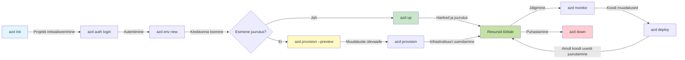
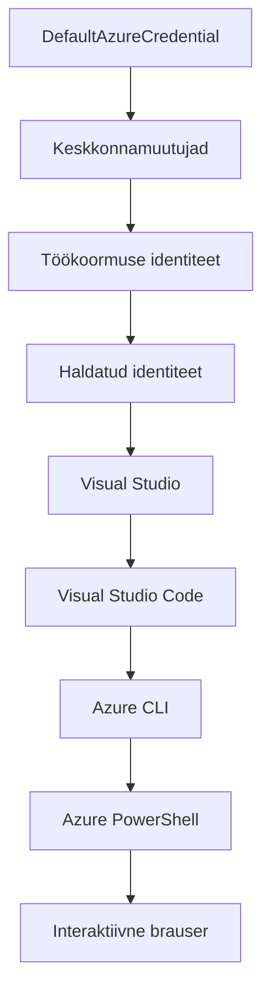

# AZD Põhitõed - Azure Developer CLI mõistmine

# AZD Põhitõed - Põhikontseptsioonid ja alused

**Peatüki navigeerimine:**
- **📚 Kursuse avaleht**: [AZD algajatele](../../README.md)
- **📖 Praegune peatükk**: Peatükk 1 - Alused ja kiire alustamine
- **⬅️ Eelmine**: [Kursuse ülevaade](../../README.md#-chapter-1-foundation--quick-start)
- **➡️ Järgmine**: [Paigaldus ja seadistamine](installation.md)
- **🚀 Järgmine peatükk**: [Peatükk 2: AI-esmase arenduse teemad](../chapter-02-ai-development/microsoft-foundry-integration.md)

## Sissejuhatus

See õppetund tutvustab teile Azure Developer CLI-d (azd), võimsat käsureatööriista, mis kiirendab teie teekonda kohalikust arendusest Azure’i juurutamiseni. Õpite põhilisi kontseptsioone, põhifunktsioone ja mõistate, kuidas azd lihtsustab pilvelähte rakenduste juurutamist.

## Õpieesmärgid

Selle õppetunni lõpuks te:
- Mõistate, mis on Azure Developer CLI ja mis on selle põhieesmärk
- Õpite põhikontseptsioone nagu mallid, keskkonnad ja teenused
- Uurite märkimisväärseid funktsioone, sealhulgas mallipõhist arendust ja infrastruktuuri koodina
- Mõistate azd projekti struktuuri ja töövoogu
- Olete valmis paigaldama ja seadistama azd oma arenduskeskkonnas

## Õpitulemused

Pärast selle õppetunni läbimist saate:
- Selgitada azd rolli kaasaegsetes pilve arendusprotsessides
- Tuvastada azd projekti struktuuri komponente
- Kirjeldada, kuidas mallid, keskkonnad ja teenused töötavad koos
- Mõista infrastruktuuri kui koodi eeliseid azd kasutamisel
- Tunda ära erinevad azd käsud ja nende eesmärgid

## Mis on Azure Developer CLI (azd)?

Azure Developer CLI (azd) on käsureatööriist, mis on loodud selleks, et kiirendada teie teekonda kohalikust arendusest Azure’i juurutamiseni. See lihtsustab pilvelähteliste rakenduste loomise, juurutamise ja haldamise protsessi Azure'is.

### Mida saab azd-ga juurutada?

azd toetab laia valikut töökoormusi – ja nimekiri kasvab pidevalt. Täna saate azd abil juurutada:

| Töökoormuse tüüp | Näited | Sama töövoog? |
|------------------|--------|---------------|
| **Traditsioonilised rakendused** | Veebirakendused, REST API-d, staatilised saidid | ✅ `azd up` |
| **Teenused ja mikroteenused** | Container Apps, Function Apps, mitme teenuse taustsüsteemid | ✅ `azd up` |
| **Tehisintellektipõhised rakendused** | Vestlusrakendused Microsoft Foundry mudelitega, RAG lahendused AI otsinguga | ✅ `azd up` |
| **Intelligentset agenti** | Foundry majutatud agendid, mitme-agendi orkestreerimised | ✅ `azd up` |

Oluline on mõista, et **azd elutsükkel on sama sõltumata sellest, mida juurutate**. Te initsialiseerite projekti, prognoosite infrastruktuuri, juurutate koodi, jälgite rakendust ja puhastate ressursse – olgu selleks siis lihtne veebileht või keerukas AI agent.

See järjepidevus on teadlikult kavandatud. azd käsitleb AI funktsioone kui teist tüüpi teenust, mida teie rakendus võib kasutada, mitte kui midagi fundamentaalselt erinevat. Microsoft Foundry mudelitega toetatud vestluspunkt on azd seisukohast lihtsalt veel üks teenus, mida konfigureerida ja juurutada.

### 🎯 Miks kasutada AZD-d? Reaalne võrdlus

Võrreldes lihtsa veebirakenduse juurutamist koos andmebaasiga:

#### ❌ ILMA AZD-ta: käsitsi Azure’i juurutamine (30+ minutit)

```bash
# Samm 1: Loo ressursirühm
az group create --name myapp-rg --location eastus

# Samm 2: Loo rakenduse teenuse plaan
az appservice plan create --name myapp-plan \
  --resource-group myapp-rg \
  --sku B1 --is-linux

# Samm 3: Loo veebirakendus
az webapp create --name myapp-web-unique123 \
  --resource-group myapp-rg \
  --plan myapp-plan \
  --runtime "NODE:18-lts"

# Samm 4: Loo Cosmos DB konto (10-15 minutit)
az cosmosdb create --name myapp-cosmos-unique123 \
  --resource-group myapp-rg \
  --kind MongoDB

# Samm 5: Loo andmebaas
az cosmosdb mongodb database create \
  --account-name myapp-cosmos-unique123 \
  --resource-group myapp-rg \
  --name tododb

# Samm 6: Loo kogu
az cosmosdb mongodb collection create \
  --account-name myapp-cosmos-unique123 \
  --resource-group myapp-rg \
  --database-name tododb \
  --name todos

# Samm 7: Hangi ühendusstring
CONN_STR=$(az cosmosdb keys list \
  --name myapp-cosmos-unique123 \
  --resource-group myapp-rg \
  --type connection-strings \
  --query "connectionStrings[0].connectionString" -o tsv)

# Samm 8: Konfigureeri rakenduse sätted
az webapp config appsettings set \
  --name myapp-web-unique123 \
  --resource-group myapp-rg \
  --settings MONGODB_URI="$CONN_STR"

# Samm 9: Luba logimine
az webapp log config --name myapp-web-unique123 \
  --resource-group myapp-rg \
  --application-logging filesystem \
  --detailed-error-messages true

# Samm 10: Sea üles Application Insights
az monitor app-insights component create \
  --app myapp-insights \
  --location eastus \
  --resource-group myapp-rg

# Samm 11: Seo App Insights veebirakendusega
INSTRUMENTATION_KEY=$(az monitor app-insights component show \
  --app myapp-insights \
  --resource-group myapp-rg \
  --query "instrumentationKey" -o tsv)

az webapp config appsettings set \
  --name myapp-web-unique123 \
  --resource-group myapp-rg \
  --settings APPINSIGHTS_INSTRUMENTATIONKEY="$INSTRUMENTATION_KEY"

# Samm 12: Koosta rakendus lokaalselt
npm install
npm run build

# Samm 13: Loo juurutuspakett
zip -r app.zip . -x "*.git*" "node_modules/*"

# Samm 14: Juuruta rakendus
az webapp deployment source config-zip \
  --resource-group myapp-rg \
  --name myapp-web-unique123 \
  --src app.zip

# Samm 15: Oota ja palvetage, et see toimiks 🙏
# (Automaatset valideerimist pole, vajalik käsitsi testimine)
```

**Probleemid:**
- ❌ Rohkem kui 15 käsku, mida meeles pidada ja korrektselt täita
- ❌ 30-45 minutit käsitsi tööd
- ❌ Lihtne teha vigu (trükivead, valed parameetrid)
- ❌ Ühendusstringid nähtavad terminali ajaloos
- ❌ Ei ole automatiseeritud tagasipööramist vigade korral
- ❌ Raske meeskonnaliikmete jaoks korrata
- ❌ Iga kord erinev (ei ole korduvkasutatav)

#### ✅ AZD-ga: automatiseeritud juurutamine (5 käsku, 10-15 minutit)

```bash
# 1. samm: Initsialiseeri mallist
azd init --template todo-nodejs-mongo

# 2. samm: Autentimine
azd auth login

# 3. samm: Loo keskkond
azd env new dev

# 4. samm: Muudatuste eelvaade (valikuline, kuid soovitatav)
azd provision --preview

# 5. samm: Kõigi asjade juurutamine
azd up

# ✨ Valmis! Kõik on juurutatud, konfigureeritud ja jälgitud
```

**Eelised:**
- ✅ **5 käsku** vs 15+ käsitsi sammu
- ✅ **10-15 minutit** koguaega (enamik ajast ootate Azure’i)
- ✅ **Vähem käsitsi tehtavaid vigu** – järjepidev mallipõhine töövoog
- ✅ **Turvaline salajaste andmete käitlemine** – paljud mallid kasutavad Azure’i haldatud saladuste hoidlat
- ✅ **Korduvad juurutamised** – sama töövoog iga kord
- ✅ **Täielikult korduvproduktsiooniline** – sama tulemus iga kord
- ✅ **Meeskonnaks valmis** – igaüks saab kasutada samu käske
- ✅ **Infrastruktuur koodina** – versioonihalduses Bicep mallid
- ✅ **Sisseehitatud jälgimine** – Application Insights seadistatud automaatselt

### 📊 Aja ja vigade vähenemine

| Näitaja | Käsitsi juurutamine | AZD juurutamine | Parandus |
|:--------|:--------------------|:----------------|:---------|
| **Käsud** | 15+ | 5 | 67% vähem |
| **Aeg** | 30-45 min | 10-15 min | 60% kiirem |
| **Vigade määr** | ~40% | <5% | 88% vähendamine |
| **Järjepidevus** | Madal (käsitsi) | 100% (automatiseeritud) | Täiuslik |
| **Meeskonna sisseelamine** | 2-4 tundi | 30 minutit | 75% kiirem |
| **Tagasipööramise aeg** | 30+ min (käsitsi) | 2 min (automatiseeritud) | 93% kiirem |

## Põhikontseptsioonid

### Mallid
Mallid on azd alus. Neis on:
- **Rakenduse kood** – teie lähtekood ja sõltuvused
- **Infrastruktuuri määratlused** – Azure’i ressursid määratletud Bicepis või Terraformis
- **Seadistuse failid** – sätted ja keskkonnamuutujad
- **Juurutusskriptid** – automatiseeritud juurutamise töövood

### Keskkonnad
Keskkonnad tähistavad erinevaid juurutamise sihtkohti:
- **Arendus** – testimiseks ja arendamiseks
- **Testkeskkond** – eeltootmisfaas
- **Tootmine** – live tootmiskeskkond

Igal keskkonnal on oma:
- Azure ressursigrupi haldus
- Seadistuse sätted
- Juurutamise olek

### Teenused
Teenused on teie rakenduse ehituskivid:
- **Frontend** – veebirakendused, ühe lehe rakendused (SPA)
- **Backend** – API-d, mikroteenused
- **Andmebaas** – andmesalvestuse lahendused
- **Salvestus** – failide ja objekte hoidvad teenused

## Peamised funktsioonid

### 1. Mallipõhine arendus
```bash
# Sirvi saadaolevaid malle
azd template list

# Algata mallist
azd init --template <template-name>
```

### 2. Infrastruktuur kui kood
- **Bicep** – Azure’i domeenispetsiifiline keel
- **Terraform** – multipilv infrastruktuuri tööriist
- **ARM mallid** – Azure Resource Manageri mallid

### 3. Integreeritud töövood
```bash
# Täielik juurutusvoog
azd up            # Hange + juurutus, see on esmakordseks seadistamiseks käed-vabad

# 🧪 UUS: Eelvaata infrastruktuuri muudatusi enne juurutamist (OHUTU)
azd provision --preview    # Simuleeri infrastruktuuri juurutust ilma muudatusi tegemata

azd provision     # Loo Azure'i ressursid, kui uuendad infrastruktuuri, kasuta seda
azd deploy        # Juuruta rakenduse kood või juuruta uuesti pärast uuendust
azd down          # Puhasta ressursid
```

#### 🛡️ Ohutu infrastruktuuri planeerimine eelvaates
Käsk `azd provision --preview` on mängumuutja turvaliste juurutuste jaoks:
- **Kuivad proovid (dry-run)** – kuvab, mis luuakse, muudetakse või kustutatakse
- **Null risk** – Azure’i keskkonnas ei tehta tegelikke muudatusi
- **Meeskonnatöö** – jaga eelvaate tulemusi enne juurutamist
- **Kulu prognoos** – mõista ressursside kulusid enne kohustust

```bash
# Näidis eelvaate töövoog
azd provision --preview           # Vaata, mis muutub
# Vaata väljundit üle, arutle meeskonnaga
azd provision                     # Rakenda muudatused enesekindlalt
```

### 📊 Visualiseering: AZD arendustöövoog



**Töövoo selgitus:**
1. **Init** – alusta mallist või uuest projektist
2. **Auth** – autentimine Azure’i kaudu
3. **Environment** – loo isoleeritud juurutamiskeskkond
4. **Preview** – 🆕 Alati eelvaata infrastruktuuri muudatusi (ohutu praktika)
5. **Provision** – loo / uuenda Azure’i ressursse
6. **Deploy** – juuruta oma rakenduse kood
7. **Monitor** – jälgi rakenduse toimivust
8. **Iterate** – tee muudatusi ja juuruta uuesti
9. **Cleanup** – eemalda ressursid kui töö tehtud

### 4. Keskkonna haldus
```bash
# Loo ja halda keskkondasid
azd env new <environment-name>
azd env select <environment-name>
azd env list
```

### 5. Laiendused ja AI käsud

azd kasutab laiendussüsteemi, mis lisab võimalusi väljaspool põhikäsurea funktsioone. See on eriti kasulik AI töökoormuste jaoks:

```bash
# Loetle saadaolevad laiendused
azd extension list

# Paigalda Foundry agentide laiendus
azd extension install azure.ai.agents

# Initsialiseeri AI agendi projekt manifestist
azd ai agent init -m agent-manifest.yaml

# Testi juurutatud agenti (näitab latentsust ja esimese baidi vastuse aega)
azd ai agent invoke

# Käivita MCP server AI-toega arenduseks (Alfa)
azd mcp start
```

**Agendi elutsükkel algusest lõpuni.** Kui oled paigaldanud `azure.ai.agents` laiendi, viib üheainsa töövoo jooksul idee töötava ja jälgitava agendini. Sa ei pea kõiki neid esimesel päeval kasutama – lihtsalt tea, et need olemas on:

| Etapp | Käsk | Mis see teeb |
|-------|------|--------------|
| **Häälestus** | `azd ai agent init -m <manifest>` | Genereerib agendi projekti manifestist |
| **Testimine** | `azd ai agent invoke` | Kutsutakse agenti ja vaadatakse vastuse aega |
| **Mõõtmine** | `azd ai agent eval generate` | Loob agenti hindamise andmestiku |
| **Parandus** | `azd ai agent optimize` | Optimeerib agendi juhiseid sinu andmete põhjal |
| **Jälgimine** | `azd ai agent endpoint show` | Kuvab otsepöörde konfiguratsiooni |
| **Puhastamine** | `azd ai agent delete` | Kustutab majutatud agendi ja kõik selle versioonid |

> Laiendusi käsitletakse põhjalikult [Peatükis 2: AI-esmase arenduse teemad](../chapter-02-ai-development/agents.md) ja [AZD AI CLI käsud](../chapter-08-production/production-ai-practices.md#azd-ai-cli-commands-and-extensions) viidete all.

## 📁 Projekti struktuur

Tüüpiline azd projekti struktuur:
```
my-app/
├── .azd/                    # azd configuration
│   └── config.json
├── .azure/                  # Azure deployment artifacts
├── .devcontainer/          # Development container config
├── .github/workflows/      # GitHub Actions
├── .vscode/               # VS Code settings
├── infra/                 # Infrastructure code
│   ├── main.bicep        # Main infrastructure template
│   ├── main.parameters.json
│   └── modules/          # Reusable modules
├── src/                  # Application source code
│   ├── api/             # Backend services
│   └── web/             # Frontend application
├── azure.yaml           # azd project configuration
└── README.md
```

## 🔧 Seadistuse failid

### azure.yaml
Peamine projekti seadistuse fail:
```yaml
name: my-awesome-app
metadata:
  template: my-template@1.0.0

services:
  web:
    project: ./src/web
    language: js
    host: appservice
  api:
    project: ./src/api
    language: js
    host: appservice

hooks:
  preprovision:
    shell: pwsh
    run: echo "Preparing to provision..."
```

### .azure/config.json
Keskkonnapõhine seadistus:
```json
{
  "version": 1,
  "defaultEnvironment": "dev",
  "environments": {
    "dev": {
      "subscriptionId": "your-subscription-id",
      "location": "eastus"
    }
  }
}
```

## 🎪 Tavalised töövood praktiliste harjutustega

> **💡 Õppe näpunäide:** Järgige neid harjutusi järjest, et järk-järgult arendada oma AZD oskusi.

### 🎯 Harjutus 1: Esimese projekti initsialiseerimine

**Eesmärk:** Loo AZD projekt ja tutvu selle struktuuriga

**Sammud:**
```bash
# Kasuta tõestatud malli
azd init --template todo-nodejs-mongo

# Uuri genereeritud faile
ls -la  # Vaata kõiki faile, sealhulgas peidetud

# Loodud võtmefailid:
# - azure.yaml (põhikonfiguratsioon)
# - infra/ (tariista kood)
# - src/ (rakenduse kood)
```

**✅ Edu:** Sul on azure.yaml, infra/ ja src/ kaustad olemas

---

### 🎯 Harjutus 2: Juurutamine Azure’i

**Eesmärk:** Lõpeta terviklik juurutamine

**Sammud:**
```bash
# 1. Autendi
az login && azd auth login

# 2. Loo keskkond
azd env new dev
azd env set AZURE_LOCATION eastus

# 3. Eelvaata muudatusi (SOOVITATAV)
azd provision --preview

# 4. Võta kõik kasutusele
azd up

# 5. Kontrolli juurutamist
azd show    # Vaata oma rakenduse URL-i
```

**Oodatav aeg:** 10-15 minutit  
**✅ Edu:** Rakenduse URL avaneb brauseris

---

### 🎯 Harjutus 3: Mitmekeskkonna kasutamine

**Eesmärk:** Juuruta arendus- ja testkeskkonda

**Sammud:**
```bash
# Dev on juba olemas, loo staging
azd env new staging
azd env set AZURE_LOCATION westus2
azd up

# Vaheta nende vahel
azd env list
azd env select dev
```

**✅ Edu:** Kaks eraldi ressursigrupi Azure portaalis

---

### 🛡️ Puhas algus: `azd down --force --purge`

Kui on vaja keskkond täielikult lähtestada:

```bash
azd down --force --purge
```

**Mis see teeb:**
- `--force`: ilma kinnitusküsimusteta
- `--purge`: kustutab kogu lokaalse oleku ja Azure’i ressursid

**Kasuta kui:**
- Juurutamine ebaõnnestus poole peal
- Projekti vahetamine
- Vajad täiesti uut algust

---

## 🎪 Originaalne töövoo viide

### Uue projekti alustamine
```bash
# Meetod 1: Kasuta olemasolevat mall
azd init --template todo-nodejs-mongo

# Meetod 2: Alusta nullist
azd init

# Meetod 3: Kasuta praegust kataloogi
azd init .
```

### Arendustsükkel
```bash
# Arenduskeskkonna seadistamine
azd auth login
azd env new dev
azd env select dev

# Kõigi asjade juurutamine
azd up

# Muudatuste tegemine ja uuesti juurutamine
azd deploy

# Puhastamine pärast lõpetamist
azd down --force --purge # Azure Developer CLI käsk on teie keskkonna **raskkäivitus** — eriti kasulik, kui lahendate nurjunud juurutusi, koristate hüljatud ressursse või valmistute värskeks uuesti juurutamiseks.
```

## `azd down --force --purge` mõistmine
Käsk `azd down --force --purge` on võimas viis oma azd keskkonna ja kogu sellega seotud ressursside täielikuks eemaldamiseks. Siin on selgitus, mida iga lipp teeb:
```
--force
```
- Jätab vahele kinnitusküsimused.
- Kasulik automatiseerimisel või skriptimisel, kus käsitsi sisestamine pole võimalik.
- Tagab, et puhastamine toimub katkestusteta, isegi kui CLI tuvastab ebakõlasid.

```
--purge
```
Kustutab **kogu seotud metaandmed**, sealhulgas:
- Keskkonna oleku
- Kohaliku `.azure` kausta
- Vahemälus olevat juurutamise infot
- Takistab azd-d "mäletamast" varasemaid juurutusi, mis võivad tekitada probleeme nagu vastuolulised ressursigrupid või aegunud registriviited.

### Miks kasutada mõlemat?
Kui `azd up` ei tööta korrektselt seetõttu, et on jäänud olek või osalised juurutused, tagab see kombinatsioon **puhta alguse**.

See on eriti kasulik pärast käsitsi tehtud ressursside kustutamics Azure portaalis või mallide, keskkondade või ressursigrupi nimetuste vahetamisel.

### Mitme keskkonna haldamine
```bash
# Loo etapi keskkond
azd env new staging
azd env select staging
azd up

# Vaheta tagasi arenduskeskkonda
azd env select dev

# Võrdle keskkondi
azd env list
```

## 🔐 Autentimine ja tõendamine

Autentimise mõistmine on oluline edukate azd juurutuste jaoks. Azure kasutab mitmeid autentimismeetodeid ning azd kasutab sama tõendi ahelat nagu teised Azure’i tööriistad.

### Azure CLI autentimine (`az login`)

Enne azd kasutamist tuleb autentida Azure’i sisse. Kõige tavalisem viis on kasutada Azure CLI-t:

```bash
# Interaktiivne sisselogimine (avatakse brauser)
az login

# Logi sisse konkreetse üürnikuga
az login --tenant <tenant-id>

# Logi sisse teenuse põhiselt prinipaalilt
az login --service-principal -u <app-id> -p <password> --tenant <tenant-id>

# Kontrolli hetke sisselogimise olekut
az account show

# Loetle saadavalolevad tellimused
az account list --output table

# Sea vaikimisi tellimus
az account set --subscription <subscription-id>
```

### Autentimise töövoog
1. **Interaktiivne sisselogimine**: avaneb teie vaikimisi brauser autentimiseks
2. **Seadme koodivoog**: keskkondades, kus puudub brauseri ligipääs
3. **Teenuse põhiprintsaal**: automatiseerimise ja CI/CD stsenaariumide jaoks
4. **Haldatud identiteet**: Azure’is majutatud rakenduste jaoks

### DefaultAzureCredential ahel

`DefaultAzureCredential` on tõendi tüüp, mis pakub lihtsustatud autentimiskogemust automaatselt proovides mitut tõendite allikat kindlas järjekorras:

#### Tõendite ahela järjekord


#### 1. Keskkonnamuutujad
```bash
# Määra keskkonnamuutujad teenuse põhipunkti jaoks
export AZURE_CLIENT_ID="<app-id>"
export AZURE_CLIENT_SECRET="<password>"
export AZURE_TENANT_ID="<tenant-id>"
```

#### 2. Töökoormuse identiteet (Kubernetes/GitHub Actions)
Kasutusel automaatselt:
- Azure Kubernetes Service (AKS) töökoormuse identiteediga
- GitHub Actions OIDC föderatsiooniga
- Muudes födereeritud identiteedi stsenaariumides

#### 3. Haldatud identiteet
Azure’i ressursside puhul nagu:
- Virtuaalmasinad
- App Service
- Azure Functions
- Container Instances

```bash
# Kontrolli, kas töötab Azure'i ressursil hallatud identiteediga
az account show --query "user.type" --output tsv
# Tagastab: "servicePrincipal", kui kasutatakse hallatud identiteeti
```

#### 4. Arendustööriistade integratsioon
- **Visual Studio**: kasutab automaatselt sisselogitud kontot
- **VS Code**: kasutab Azure Account laiendusest saadud tõendeid
- **Azure CLI**: kasutab `az login` tõendeid (tavalisim kohalikuks arenduseks)

### AZD autentimise seadistus

```bash
# Meetod 1: Kasuta Azure CLI-d (Soovitatav arenduseks)
az login
azd auth login  # Kasutab olemasolevaid Azure CLI mandaate

# Meetod 2: Otsene azd autentimine
azd auth login --use-device-code  # Peataolekuga keskkondade jaoks

# Meetod 3: Kontrolli autentimise olekut
azd auth login --check-status

# Meetod 4: Logi välja ja autentinuuesti
azd auth logout
azd auth login
```

### Autentimise parimad praktikad

#### Kohaliku arenduse jaoks
#### CI/CD torujuhtmete jaoks
#### Tootmiskeskkondade jaoks
- Kasuta **Halda Identiteeti**, kui töötab Azure ressurssidel
- Kasuta **Teenuse peatnime** automatiseerimisstsenaariumide jaoks
- Väldi tunnuste salvestamist koodi või konfiguratsioonifailidesse
- Kasuta **Azure Key Vault** tundlike konfiguratsioonide jaoks

### Üldised autentimisprobleemid ja lahendused

#### Probleem: "Tellimust ei leitud"
#### Probleem: "Puuduvad õigused"
#### Probleem: "Token on aegunud"
### Autentimine erinevates stsenaariumites

#### Kohalik arendus
#### Meeskonna arendus
#### Mitme üürniku stsenaariumid
### Turvakaalutlused

1. **Tunnuste salvestamine**: Ära kunagi salvesta tunnuseid lähtekoodi
2. **Ulatuspiirangud**: Kasuta teenuse peatnime minimaalsete õiguste põhimõtet
3. **Tokeni rotatsioon**: Vaheta regulaarselt teenuse peatnime saladusi
4. **Auditirajal**: Jälgi autentimise ja juurutamise tegevusi
5. **Võrgu turvalisus**: Kasuta võimalusel privaatseid lõpupunkte

### Autentimise tõrkeotsing

## `azd down --force --purge` mõistmine

### Avastamine
### Projektijuhtimine
### Jälgimine
## Parimad tavad

### 1. Kasuta tähendusrikkaid nimesid
### 2. Kasuta malle
- Alusta olemasolevate mallidega
- Kohanda vastavalt oma vajadustele
- Loo taaskasutatavaid malle oma organisatsioonile

### 3. Keskkondade isoleerimine
- Kasuta arendus-, testimis- ja tootmiskeskkonnad eraldi
- Ära kunagi juuruta otse tootmisesse kohaliku masina pealt
- Kasuta CI/CD torujuhtmeid tootmisjuurutusteks

### 4. Konfiguratsiooni haldamine
- Kasuta keskkonnamuutujaid tundlike andmete jaoks
- Hoia konfiguratsioon versioonihalduses
- Dokumenteeri keskkonnaspetsiifilised sätted

## Õppimise edenemine

### Algaja (1.-2. nädal)
1. Paigalda azd ja autentimine
2. Juuruta lihtne mall
3. Sõnasta projektistruktuur
4. Õpi põhilised käsud (up, down, deploy)

### Kesktasemel (3.-4. nädal)
1. Kohanda malle
2. Halda mitut keskkonda
3. Mõista infrastruktuurikoodi
4. Sea üles CI/CD torujuhtmed

### Edasijõudnud (5. nädal ja edasi)
1. Loo kohandatud malle
2. Arendatud infrastruktuurimustrid
3. Mitme regiooni juurutus
4. Ettevõtte tasemel konfigureerimised

## Järgmised sammud

**📖 Jätka 1. peatüki õppimist:**
- [Paigaldus ja seadistus](installation.md) - azd paigaldamine ja seadistamine
- [Sinu esimene projekt](first-project.md) - praktiline juhend
- [Konfiguratsiooni juhend](configuration.md) - arenenud seadistamise võimalused

**🎯 Valmis järgmise peatüki jaoks?**
- [Peatükk 2: AI-keskne arendus](../chapter-02-ai-development/microsoft-foundry-integration.md) - alusta AI rakenduste loomist

## Lisavahendid

- [Azure Developer CLI ülevaade](https://learn.microsoft.com/en-us/azure/developer/azure-developer-cli/)
- [Malligalerii](https://azure.github.io/awesome-azd/)
- [Kogukonna näited](https://github.com/Azure-Samples)

---

## 🙋 Sageli Küsitud Küsimused

### Üldised küsimused

**K: Milline on erinevus AZD ja Azure CLI vahel?**

V: Azure CLI (`az`) haldab üksikuid Azure ressursse. AZD (`azd`) haldab kogu rakendust:

**Mõtle sellele nii:**
- `az` = Tegutsemine üksikute Lego klotsidega
- `azd` = Terve Lego komplekti käsitlemine

---

**K: Kas pean teadma Bicepit või Terraformi, et kasutada AZD-d?**

V: Ei! Alusta mallide kasutamisest:
Saad õpetada Bicepit hiljem infrastruktuuri kohandamiseks. Mallid annavad toimivaid näiteid õppimiseks.

---

**K: Kui palju maksab AZD mallide kasutamine?**

V: Kulud sõltuvad mallist. Enamus arenduse malle maksavad 50-150 USD kuus:

**Nõu:** Kasuta tasuta kihte, kus võimalik:
- App Service: F1 (tasuta) kiht
- Microsoft Foundry mudelid: Azure OpenAI 50 000 tokenit kuus tasuta
- Cosmos DB: 1000 RU/s tasuta kiht

---

**K: Kas saan kasutada AZD olemasolevate Azure ressurssidega?**

V: Jah, aga lihtsam on alustada puhtalt. AZD töötab parimal viisil, kui haldab kogu elutsüklit. Olemasolevate ressursside puhul:

---

**K: Kuidas jagada oma projekti meeskonnaga?**

V: Kommiteeri AZD projekt Git-i (aga ÄRA .azure kausta):

Kõigil on sama infrastruktuur samadest mallidest.

---

### Tõrkeotsingu küsimused

**K: "azd up" ebaõnnestus poole peal. Mida teha?**

V: Kontrolli viga, paranda ja proovi uuesti:

**Kõige sagedasem viga:** Vale Azure tellimus valitud

---

**K: Kuidas juurutada ainult koodi muudatusi ilma infrastruktuuri uuesti loomata?**

V: Kasuta `azd deploy` asemel `azd up`:

Kiiruse võrdlus:
- `azd up`: 10-15 minutit (infrastruktuuri loomine)
- `azd deploy`: 2-5 minutit (ainult kood)

---

**K: Kas saan kohandada infrastruktuurimalle?**

V: Jah! Muuda Bicep faile kataloogis `infra/`:

**Nõuanne:** Alusta väikselt - muuda kõigepealt SKUsid:

---

**K: Kuidas kustutada kõik, mida AZD lõi?**

V: Üks käsk kustutab kõik ressursid:

**Käivita alati, kui:**
- Testimine on lõpetatud
- Vahetad projekti
- Tahad alustada puhtalt

**Kulukokkuhoid:** Kasutamata ressursside kustutamine = 0 kulutust

---

**K: Mis saab, kui kustutasin kogemata ressursse Azure Portaalis?**

V: AZD seisund võib sünkroonist väljas olla. Puhas algus:

---

### Edasijõudnud küsimused

**K: Kas saan kasutada AZD CI/CD torujuhtmetes?**

V: Jah! Näide GitHub Actions-ist:

---

**K: Kuidas käsitleda saladusi ja tundlikke andmeid?**

V: AZD ühildub automaatselt Azure Key Vault-iga:

**Ära kunagi commit’i:**
- `.azure/` kausta (keskkonnainfo)
- `.env` faile (kohalikud saladused)
- Ühendusstringe

---

**K: Kas saan juurutada mitmesse regiooni?**

V: Jah, loo iga piirkonna jaoks eraldi keskkond:

Tõeliste mitmeregiooni rakenduste jaoks kohanda Bicep malle samaaegselt mitmesse piirkonda juurutamiseks.

---

**K: Kust saan abi, kui jään kinni?**

1. **AZD dokumentatsioon:** https://learn.microsoft.com/azure/developer/azure-developer-cli/
2. **GitHub probleemid:** https://github.com/Azure/azure-dev/issues
3. **Discord:** [Azure Discord](https://discord.gg/microsoft-azure) - #azure-developer-cli kanal
4. **Stack Overflow:** Märksõna `azure-developer-cli`
5. **See kursus:** [Tõrkeotsingu juhend](../chapter-07-troubleshooting/common-issues.md)

**Nõuanne:** Enne küsimist käivita:
Sisesta see info oma küsimusse kiirema abi saamiseks.

---

## 🎓 Mis järgmiseks?

Sa mõistad nüüd AZD aluseid. Vali oma tee:

### 🎯 Algajatele:
1. **Järgmine:** [Paigaldus ja seadistus](installation.md) - Paigalda AZD oma masinasse
2. **Seejärel:** [Sinu esimene projekt](first-project.md) - Juuruta oma esimene rakendus
3. **Praktiseeri:** Tee kõik 3 harjutust selles õppetükis

### 🚀 AI arendajatele:
1. **Mine otse:** [Peatükk 2: AI-keskne arendus](../chapter-02-ai-development/microsoft-foundry-integration.md)
2. **Juuruta:** Alusta käsuga `azd init --template get-started-with-ai-chat`
3. **Õpi:** Ehita samal ajal, kui juurutad

### 🏗️ Kogenud arendajatele:
1. **Vaata üle:** [Konfiguratsiooni juhend](configuration.md) - Täiustatud seaded
2. **Uuri:** [Infrastructure as Code](../chapter-04-infrastructure/provisioning.md) - Põhjalik Bicep juhend
3. **Ehita:** Loo oma stacki jaoks kohandatud malle

---

**Peatükkide navigatsioon:**
- **📚 Kursuse avaleht**: [AZD algajatele](../../README.md)
- **📖 Aktiivne peatükk**: Peatükk 1 - Alused & kiire algus  
- **⬅️ Eelmine**: [Kursuse ülevaade](../../README.md#-chapter-1-foundation--quick-start)
- **➡️ Järgmine**: [Paigaldus ja seadistus](installation.md)
- **🚀 Järgmine peatükk**: [Peatükk 2: AI-keskne arendus](../chapter-02-ai-development/microsoft-foundry-integration.md)

---

<!-- CO-OP TRANSLATOR DISCLAIMER START -->
**Lahtiütlus**:
See dokument on tõlgitud kasutades AI tõlketeenust [Co-op Translator](https://github.com/Azure/co-op-translator). Kuigi me püüdleme täpsuse poole, palun pange tähele, et automatiseeritud tõlgetes võib esineda vigu või ebatäpsusi. Originaaldokument selle emakeeles tuleks pidada autoriteetseks allikaks. Olulise teabe puhul soovitatakse kasutada professionaalset inimtõlget. Me ei vastuta selle tõlkega seotud eksimustest või valesti mõistmistest.
<!-- CO-OP TRANSLATOR DISCLAIMER END -->