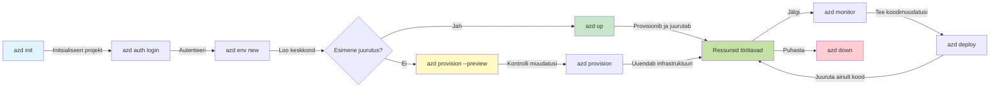
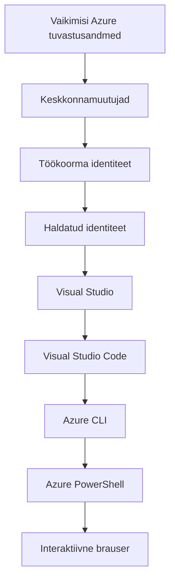

# AZD Basics - Understanding Azure Developer CLI

# AZD Basics - Core Concepts and Fundamentals

**Chapter Navigation:**
- **📚 Course Home**: [AZD For Beginners](../../README.md)
- **📖 Current Chapter**: Chapter 1 - Foundation & Quick Start
- **⬅️ Previous**: [Course Overview](../../README.md#-chapter-1-foundation--quick-start)
- **➡️ Next**: [Installation & Setup](installation.md)
- **🚀 Next Chapter**: [Chapter 2: AI-First Development](../chapter-02-ai-development/microsoft-foundry-integration.md)

## Introduction

This lesson introduces you to Azure Developer CLI (azd), a powerful command-line tool that accelerates your journey from local development to Azure deployment. You'll learn the fundamental concepts, core features, and understand how azd simplifies cloud-native application deployment.

## Learning Goals

By the end of this lesson, you will:
- Understand what Azure Developer CLI is and its primary purpose
- Learn the core concepts of templates, environments, and services
- Explore key features including template-driven development and Infrastructure as Code
- Understand the azd project structure and workflow
- Be prepared to install and configure azd for your development environment

## Learning Outcomes

After completing this lesson, you will be able to:
- Explain the role of azd in modern cloud development workflows
- Identify the components of an azd project structure
- Describe how templates, environments, and services work together
- Understand the benefits of Infrastructure as Code with azd
- Recognize different azd commands and their purposes

## What is Azure Developer CLI (azd)?

Azure Developer CLI (azd) is a command-line tool designed to accelerate your journey from local development to Azure deployment. It simplifies the process of building, deploying, and managing cloud-native applications on Azure.

### 🎯 Why Use AZD? A Real-World Comparison

Let's compare deploying a simple web app with database:

#### ❌ WITHOUT AZD: Manual Azure Deployment (30+ minutes)

```bash
# Samm 1: Loo ressursirühm
az group create --name myapp-rg --location eastus

# Samm 2: Loo App Service'i plaan
az appservice plan create --name myapp-plan \
  --resource-group myapp-rg \
  --sku B1 --is-linux

# Samm 3: Loo veebirakendus
az webapp create --name myapp-web-unique123 \
  --resource-group myapp-rg \
  --plan myapp-plan \
  --runtime "NODE:18-lts"

# Samm 4: Loo Cosmos DB konto (10–15 minutit)
az cosmosdb create --name myapp-cosmos-unique123 \
  --resource-group myapp-rg \
  --kind MongoDB

# Samm 5: Loo andmebaas
az cosmosdb mongodb database create \
  --account-name myapp-cosmos-unique123 \
  --resource-group myapp-rg \
  --name tododb

# Samm 6: Loo kogum
az cosmosdb mongodb collection create \
  --account-name myapp-cosmos-unique123 \
  --resource-group myapp-rg \
  --database-name tododb \
  --name todos

# Samm 7: Hangi ühendusstring
CONN_STR=$(az cosmosdb keys list \
  --name myapp-cosmos-unique123 \
  --resource-group myapp-rg \
  --type connection-strings \
  --query "connectionStrings[0].connectionString" -o tsv)

# Samm 8: Konfigureeri rakenduse seaded
az webapp config appsettings set \
  --name myapp-web-unique123 \
  --resource-group myapp-rg \
  --settings MONGODB_URI="$CONN_STR"

# Samm 9: Luba logimine
az webapp log config --name myapp-web-unique123 \
  --resource-group myapp-rg \
  --application-logging filesystem \
  --detailed-error-messages true

# Samm 10: Seadista Application Insights
az monitor app-insights component create \
  --app myapp-insights \
  --location eastus \
  --resource-group myapp-rg

# Samm 11: Ühenda App Insights veebirakendusega
INSTRUMENTATION_KEY=$(az monitor app-insights component show \
  --app myapp-insights \
  --resource-group myapp-rg \
  --query "instrumentationKey" -o tsv)

az webapp config appsettings set \
  --name myapp-web-unique123 \
  --resource-group myapp-rg \
  --settings APPINSIGHTS_INSTRUMENTATIONKEY="$INSTRUMENTATION_KEY"

# Samm 12: Ehita rakendus lokaalselt
npm install
npm run build

# Samm 13: Loo juurutuspakett
zip -r app.zip . -x "*.git*" "node_modules/*"

# Samm 14: Juuruta rakendus
az webapp deployment source config-zip \
  --resource-group myapp-rg \
  --name myapp-web-unique123 \
  --src app.zip

# Samm 15: Oota ja palveta, et see töötab 🙏
# (Automaatset valideerimist ei ole, vajalik manuaalne testimine)
```

**Problems:**
- ❌ 15+ commands to remember and execute in order
- ❌ 30-45 minutes of manual work
- ❌ Easy to make mistakes (typos, wrong parameters)
- ❌ Connection strings exposed in terminal history
- ❌ No automated rollback if something fails
- ❌ Hard to replicate for team members
- ❌ Different every time (not reproducible)

#### ✅ WITH AZD: Automated Deployment (5 commands, 10-15 minutes)

```bash
# Samm 1: Alusta mallist
azd init --template todo-nodejs-mongo

# Samm 2: Autenteeri
azd auth login

# Samm 3: Loo keskkond
azd env new dev

# Samm 4: Eelvaata muudatusi (valikuline, kuid soovitatav)
azd provision --preview

# Samm 5: Juuruta kõik
azd up

# ✨ Valmis! Kõik on juurutatud, seadistatud ja jälgitud
```

**Benefits:**
- ✅ **5 commands** vs. 15+ manual steps
- ✅ **10-15 minutes** total time (mostly waiting for Azure)
- ✅ **Zero errors** - automated and tested
- ✅ **Secrets managed securely** via Key Vault
- ✅ **Automatic rollback** on failures
- ✅ **Fully reproducible** - same result every time
- ✅ **Team-ready** - anyone can deploy with same commands
- ✅ **Infrastructure as Code** - version controlled Bicep templates
- ✅ **Built-in monitoring** - Application Insights configured automatically

### 📊 Time & Error Reduction

| Metric | Manual Deployment | AZD Deployment | Improvement |
|:-------|:------------------|:---------------|:------------|
| **Commands** | 15+ | 5 | 67% fewer |
| **Time** | 30-45 min | 10-15 min | 60% faster |
| **Error Rate** | ~40% | <5% | 88% reduction |
| **Consistency** | Low (manual) | 100% (automated) | Perfect |
| **Team Onboarding** | 2-4 hours | 30 minutes | 75% faster |
| **Rollback Time** | 30+ min (manual) | 2 min (automated) | 93% faster |

## Core Concepts

### Templates
Templates are the foundation of azd. They contain:
- **Application code** - Your source code and dependencies
- **Infrastructure definitions** - Azure resources defined in Bicep or Terraform
- **Configuration files** - Settings and environment variables
- **Deployment scripts** - Automated deployment workflows

### Environments
Environments represent different deployment targets:
- **Development** - For testing and development
- **Staging** - Pre-production environment
- **Production** - Live production environment

Each environment maintains its own:
- Azure resource group
- Configuration settings
- Deployment state

### Services
Services are the building blocks of your application:
- **Frontend** - Web applications, SPAs
- **Backend** - APIs, microservices
- **Database** - Data storage solutions
- **Storage** - File and blob storage

## Key Features

### 1. Template-Driven Development
```bash
# Sirvi saadaolevaid malle
azd template list

# Initsialiseeri mallist
azd init --template <template-name>
```

### 2. Infrastructure as Code
- **Bicep** - Azure's domain-specific language
- **Terraform** - Multi-cloud infrastructure tool
- **ARM Templates** - Azure Resource Manager templates

### 3. Integrated Workflows
```bash
# Täielik juurutamise töövoog
azd up            # Provision + Deploy — see on käed-vabad esmakordse seadistuse jaoks

# 🧪 UUS: Vaata infrastruktuuri muudatusi enne juurutamist (OHUTU)
azd provision --preview    # Simuleeri infrastruktuuri juurutamist ilma muudatusi tegemata

azd provision     # Loo Azure'i ressursid; kui uuendad infrastruktuuri, kasuta seda
azd deploy        # Juuruta rakenduse kood või juuruta see uuesti pärast värskendust
azd down          # Eemalda ressursid
```

#### 🛡️ Safe Infrastructure Planning with Preview
The `azd provision --preview` command is a game-changer for safe deployments:
- **Dry-run analysis** - Shows what will be created, modified, or deleted
- **Zero risk** - No actual changes are made to your Azure environment
- **Team collaboration** - Share preview results before deployment
- **Cost estimation** - Understand resource costs before commitment

```bash
# Näidise eelvaate töövoog
azd provision --preview           # Vaata, mis muutub
# Vaata väljundit üle, aruta meeskonnaga
azd provision                     # Rakenda muudatused enesekindlalt
```

### 📊 Visual: AZD Development Workflow


**Workflow Explanation:**
1. **Init** - Start with template or new project
2. **Auth** - Authenticate with Azure
3. **Environment** - Create isolated deployment environment
4. **Preview** - 🆕 Always preview infrastructure changes first (safe practice)
5. **Provision** - Create/update Azure resources
6. **Deploy** - Push your application code
7. **Monitor** - Observe application performance
8. **Iterate** - Make changes and redeploy code
9. **Cleanup** - Remove resources when done

### 4. Environment Management
```bash
# Loo ja halda keskkondi
azd env new <environment-name>
azd env select <environment-name>
azd env list
```

## 📁 Project Structure

A typical azd project structure:
```
my-app/
├── .azd/                    # azd configuration
│   └── config.json
├── .azure/                  # Azure deployment artifacts
├── .devcontainer/          # Development container config
├── .github/workflows/      # GitHub Actions
├── .vscode/               # VS Code settings
├── infra/                 # Infrastructure code
│   ├── main.bicep        # Main infrastructure template
│   ├── main.parameters.json
│   └── modules/          # Reusable modules
├── src/                  # Application source code
│   ├── api/             # Backend services
│   └── web/             # Frontend application
├── azure.yaml           # azd project configuration
└── README.md
```

## 🔧 Configuration Files

### azure.yaml
The main project configuration file:
```yaml
name: my-awesome-app
metadata:
  template: my-template@1.0.0

services:
  web:
    project: ./src/web
    language: js
    host: appservice
  api:
    project: ./src/api
    language: js
    host: appservice

hooks:
  preprovision:
    shell: pwsh
    run: echo "Preparing to provision..."
```

### .azure/config.json
Environment-specific configuration:
```json
{
  "version": 1,
  "defaultEnvironment": "dev",
  "environments": {
    "dev": {
      "subscriptionId": "your-subscription-id",
      "location": "eastus"
    }
  }
}
```

## 🎪 Common Workflows with Hands-On Exercises

> **💡 Learning Tip:** Follow these exercises in order to build your AZD skills progressively.

### 🎯 Exercise 1: Initialize Your First Project

**Goal:** Create an AZD project and explore its structure

**Steps:**
```bash
# Kasuta tõestatud malli
azd init --template todo-nodejs-mongo

# Uuri genereeritud faile
ls -la  # Vaata kõiki faile, sealhulgas peidetud faile

# Peamised loodud failid:
# - azure.yaml (peamine konfiguratsioon)
# - infra/ (infrastruktuuri kood)
# - src/ (rakenduse kood)
```

**✅ Success:** You have azure.yaml, infra/, and src/ directories

---

### 🎯 Exercise 2: Deploy to Azure

**Goal:** Complete end-to-end deployment

**Steps:**
```bash
# 1. Autentige
az login && azd auth login

# 2. Looge keskkond
azd env new dev
azd env set AZURE_LOCATION eastus

# 3. Eelvaadake muudatusi (SOOVITATAV)
azd provision --preview

# 4. Rakendage kõik
azd up

# 5. Kontrollige juurutust
azd show    # Vaadake oma rakenduse URL-i
```

**Expected Time:** 10-15 minutes  
**✅ Success:** Application URL opens in browser

---

### 🎯 Exercise 3: Multiple Environments

**Goal:** Deploy to dev and staging

**Steps:**
```bash
# Dev on juba olemas, loo staging
azd env new staging
azd env set AZURE_LOCATION westus2
azd up

# Lülitu nende vahel
azd env list
azd env select dev
```

**✅ Success:** Two separate resource groups in Azure Portal

---

### 🛡️ Clean Slate: `azd down --force --purge`

When you need to completely reset:

```bash
azd down --force --purge
```

**What it does:**
- `--force`: No confirmation prompts
- `--purge`: Deletes all local state and Azure resources

**Use when:**
- Deployment failed mid-way
- Switching projects
- Need fresh start

---

## 🎪 Original Workflow Reference

### Starting a New Project
```bash
# Meetod 1: Kasuta olemasolevat malli
azd init --template todo-nodejs-mongo

# Meetod 2: Alusta algusest
azd init

# Meetod 3: Kasuta praegust kataloogi
azd init .
```

### Development Cycle
```bash
# Seadista arenduskeskkond
azd auth login
azd env new dev
azd env select dev

# Juuruta kõik
azd up

# Tee muudatusi ja juuruta uuesti
azd deploy

# Puhasta pärast lõpetamist
azd down --force --purge # käsk Azure Developer CLI-s on teie keskkonna jaoks **täielik lähtestus** — eriti kasulik, kui te tõrkeotsingul tegelete ebaõnnestunud juurutustega, puhastate hülgatud ressursse või valmistute uueks juurutamiseks.
```

## Understanding `azd down --force --purge`
The `azd down --force --purge` command is a powerful way to completely tear down your azd environment and all associated resources. Here's a breakdown of what each flag does:
```
--force
```
- Skips confirmation prompts.
- Useful for automation or scripting where manual input isn’t feasible.
- Ensures the teardown proceeds without interruption, even if the CLI detects inconsistencies.

```
--purge
```
Deletes **all associated metadata**, including:
Environment state
Local `.azure` folder
Cached deployment info
Prevents azd from "remembering" previous deployments, which can cause issues like mismatched resource groups or stale registry references.


### Why use both?
When you've hit a wall with `azd up` due to lingering state or partial deployments, this combo ensures a **clean slate**.

It’s especially helpful after manual resource deletions in the Azure portal or when switching templates, environments, or resource group naming conventions.


### Managing Multiple Environments
```bash
# Loo staging-keskkond
azd env new staging
azd env select staging
azd up

# Lülitu tagasi arenduskeskkonda
azd env select dev

# Võrdle keskkondi
azd env list
```

## 🔐 Authentication and Credentials

Understanding authentication is crucial for successful azd deployments. Azure uses multiple authentication methods, and azd leverages the same credential chain used by other Azure tools.

### Azure CLI Authentication (`az login`)

Before using azd, you need to authenticate with Azure. The most common method is using Azure CLI:

```bash
# Interaktiivne sisselogimine (avab brauseri)
az login

# Sisselogimine konkreetse üürniku kaudu
az login --tenant <tenant-id>

# Sisselogimine teenuse esindajana
az login --service-principal -u <app-id> -p <password> --tenant <tenant-id>

# Kontrolli praegust sisselogimisolekut
az account show

# Loetle saadaolevad tellimused
az account list --output table

# Määra vaikimisi tellimus
az account set --subscription <subscription-id>
```

### Authentication Flow
1. **Interactive Login**: Opens your default browser for authentication
2. **Device Code Flow**: For environments without browser access
3. **Service Principal**: For automation and CI/CD scenarios
4. **Managed Identity**: For Azure-hosted applications

### DefaultAzureCredential Chain

`DefaultAzureCredential` is a credential type that provides a simplified authentication experience by automatically trying multiple credential sources in a specific order:

#### Credential Chain Order

#### 1. Environment Variables
```bash
# Määra keskkonnamuutujad teenusekonto jaoks
export AZURE_CLIENT_ID="<app-id>"
export AZURE_CLIENT_SECRET="<password>"
export AZURE_TENANT_ID="<tenant-id>"
```

#### 2. Workload Identity (Kubernetes/GitHub Actions)
Used automatically in:
- Azure Kubernetes Service (AKS) with Workload Identity
- GitHub Actions with OIDC federation
- Other federated identity scenarios

#### 3. Managed Identity
For Azure resources like:
- Virtual Machines
- App Service
- Azure Functions
- Container Instances

```bash
# Kontrolli, kas töötab Azure'i ressursil, millel on hallatud identiteet
az account show --query "user.type" --output tsv
# Tagastab: "servicePrincipal", kui kasutatakse hallatud identiteeti
```

#### 4. Developer Tools Integration
- **Visual Studio**: Automatically uses signed-in account
- **VS Code**: Uses Azure Account extension credentials
- **Azure CLI**: Uses `az login` credentials (most common for local development)

### AZD Authentication Setup

```bash
# Meetod 1: Kasutage Azure CLI-d (soovitatav arendamiseks)
az login
azd auth login  # Kasutab olemasolevaid Azure CLI volitusi

# Meetod 2: Otsene azd-autentimine
azd auth login --use-device-code  # Graafilise kasutajaliideseta keskkondade jaoks

# Meetod 3: Kontrollige autentimise olekut
azd auth login --check-status

# Meetod 4: Logige välja ja autentige uuesti
azd auth logout
azd auth login
```

### Authentication Best Practices

#### For Local Development
```bash
# 1. Logi sisse Azure CLI abil
az login

# 2. Kontrolli, et kasutatav tellimus on õige
az account show
az account set --subscription "Your Subscription Name"

# 3. Kasuta azd olemasolevate autentimisandmetega
azd auth login
```

#### For CI/CD Pipelines
```yaml
# GitHub Actions example
- name: Azure Login
  uses: azure/login@v1
  with:
    creds: ${{ secrets.AZURE_CREDENTIALS }}

- name: Deploy with azd
  run: |
    azd auth login --client-id ${{ secrets.AZURE_CLIENT_ID }} \
                    --client-secret ${{ secrets.AZURE_CLIENT_SECRET }} \
                    --tenant-id ${{ secrets.AZURE_TENANT_ID }}
    azd up --no-prompt
```

#### For Production Environments
- Use **Managed Identity** when running on Azure resources
- Use **Service Principal** for automation scenarios
- Avoid storing credentials in code or configuration files
- Use **Azure Key Vault** for sensitive configuration

### Common Authentication Issues and Solutions

#### Issue: "No subscription found"
```bash
# Lahendus: Määra vaikimisi tellimus
az account list --output table
az account set --subscription "<subscription-id>"
azd env set AZURE_SUBSCRIPTION_ID "<subscription-id>"
```

#### Issue: "Insufficient permissions"
```bash
# Lahendus: kontrolli ja määra vajalikud rollid
az role assignment list --assignee $(az account show --query user.name --output tsv)

# Tavalised vajalikud rollid:
# - Contributor (ressursside haldamiseks)
# - User Access Administrator (rollide määramiseks)
```

#### Issue: "Token expired"
```bash
# Lahendus: Logi uuesti sisse
az logout
az login
azd auth logout
azd auth login
```

### Authentication in Different Scenarios

#### Local Development
```bash
# Isikliku arengu konto
az login
azd auth login
```

#### Team Development
```bash
# Kasuta organisatsiooni jaoks konkreetset üürnikku.
az login --tenant contoso.onmicrosoft.com
azd auth login
```

#### Multi-tenant Scenarios
```bash
# Lülitu üürnike vahel
az login --tenant tenant1.onmicrosoft.com
# Juuruta üürnikule 1
azd up

az login --tenant tenant2.onmicrosoft.com  
# Juuruta üürnikule 2
azd up
```

### Security Considerations

1. **Credential Storage**: Never store credentials in source code
2. **Scope Limitation**: Use least-privilege principle for service principals
3. **Token Rotation**: Regularly rotate service principal secrets
4. **Audit Trail**: Monitor authentication and deployment activities
5. **Network Security**: Use private endpoints when possible

### Troubleshooting Authentication

```bash
# Autentimisprobleemide tõrkeotsing
azd auth login --check-status
az account show
az account get-access-token

# Üldised diagnostikakäsud
whoami                          # Praeguse kasutaja kontekst
az ad signed-in-user show      # Azure AD kasutaja üksikasjad
az group list                  # Ressursi juurdepääsu testimine
```

## Understanding `azd down --force --purge`

### Discovery
```bash
azd template list              # Sirvi malle
azd template show <template>   # Malli üksikasjad
azd init --help               # Initsialiseerimise valikud
```

### Project Management
```bash
azd show                     # Projekti ülevaade
azd env show                 # Praegune keskkond
azd config list             # Konfiguratsiooniseaded
```

### Monitoring
```bash
azd monitor                  # Ava Azure'i portaali jälgimine
azd monitor --logs           # Vaata rakenduse logisid
azd monitor --live           # Vaata reaalajas mõõdikuid
azd pipeline config          # Seadista CI/CD
```

## Best Practices

### 1. Use Meaningful Names
```bash
# Hea
azd env new production-east
azd init --template web-app-secure

# Väldi
azd env new env1
azd init --template template1
```

### 2. Leverage Templates
- Start with existing templates
- Customize for your needs
- Create reusable templates for your organization

### 3. Environment Isolation
- Use separate environments for dev/staging/prod
- Never deploy directly to production from local machine
- Use CI/CD pipelines for production deployments

### 4. Configuration Management
- Use environment variables for sensitive data
- Keep configuration in version control
- Document environment-specific settings

## Learning Progression

### Beginner (Week 1-2)
1. Install azd and authenticate
2. Deploy a simple template
3. Understand project structure
4. Learn basic commands (up, down, deploy)

### Intermediate (Week 3-4)
1. Customize templates
2. Manage multiple environments
3. Understand infrastructure code
4. Set up CI/CD pipelines

### Advanced (Week 5+)
1. Create custom templates
2. Advanced infrastructure patterns
3. Multi-region deployments
4. Enterprise-grade configurations

## Next Steps

**📖 Continue Chapter 1 Learning:**
- [Installimine ja seadistamine](installation.md) - Paigalda ja seadista azd
- [Teie esimene projekt](first-project.md) - Täielik praktiline juhend
- [Konfiguratsioonijuhend](configuration.md) - Täpsemad konfiguratsioonivõimalused

**🎯 Valmis järgmise peatüki jaoks?**
- [Peatükk 2: AI-esmane arendus](../chapter-02-ai-development/microsoft-foundry-integration.md) - Alusta AI-rakenduste loomist

## Lisamaterjalid

- [Azure Developer CLI ülevaade](https://learn.microsoft.com/en-us/azure/developer/azure-developer-cli/)
- [Malligalerii](https://azure.github.io/awesome-azd/)
- [Kogukonna näited](https://github.com/Azure-Samples)

---

## 🙋 Korduma kippuvad küsimused

### Üldised küsimused

**Q: Mis vahe on AZD-l ja Azure CLI-l?**

A: Azure CLI (`az`) on mõeldud üksikute Azure'i ressursside haldamiseks. AZD (`azd`) on mõeldud kogu rakenduste haldamiseks:

```bash
# Azure CLI - madala taseme ressursside haldus
az webapp create --name myapp --resource-group rg
az sql server create --name myserver --resource-group rg
# ...vajatakse veel palju käske

# AZD - rakenduse taseme haldus
azd up  # Juurutab kogu rakenduse koos kõigi ressurssidega
```

**Mõtle sellele nii:**
- `az` = Töötamine üksikute Lego klotsidega
- `azd` = Töötamine tervete Lego komplektidega

---

**Q: Kas ma pean AZD kasutamiseks teadma Bicepit või Terraformi?**

A: Ei! Alusta mallidest:
```bash
# Kasutage olemasolevat malli - IaC-i teadmisi pole vaja
azd init --template todo-nodejs-mongo
azd up
```

Hiljem võid Bicepit õppida infrastruktuuri kohandamiseks. Mallid pakuvad töökorras näiteid, millest õppida.

---

**Q: Kui palju maksab AZD mallide käitamine?**

A: Kulud sõltuvad mallist. Enamik arenduse malle maksab $50-150 kuus:

```bash
# Kulude eelvaade enne juurutamist
azd provision --preview

# Puhasta alati, kui seda ei kasutata
azd down --force --purge  # Eemaldab kõik ressursid
```

**Pro-nõuanne:** Kasuta tasuta tasemeid, kui need on saadaval:
- App Service: F1 (tasuta) tase
- Azure OpenAI: 50,000 tokenit/kuu tasuta
- Cosmos DB: 1000 RU/s tasuta tase

---

**Q: Kas ma saan AZD-d kasutada olemasolevate Azure'i ressurssidega?**

A: Jah, kuid on lihtsam alustada puhtalt. AZD töötab kõige paremini, kui see haldab kogu elutsüklit. Olemasolevate ressursside puhul:

```bash
# Valik 1: Impordi olemasolevad ressursid (edasijõudnutele)
azd init
# Seejärel muuda infra/ nii, et see viitaks olemasolevatele ressurssidele

# Valik 2: Alusta nullist (soovitatav)
azd init --template matching-your-stack
azd up  # Luuakse uus keskkond
```

---

**Q: Kuidas jagada oma projekti meeskonnakaaslastega?**

A: Pane AZD projekt Git'i (AGA MITTE `.azure` kausta):

```bash
# Juba vaikimisi .gitignore'is
.azure/        # Sisaldab salasõnu ja keskkonnaandmeid
*.env          # Keskkonnamuutujad

# Meeskonnaliikmed siis:
git clone <your-repo>
azd auth login
azd env new <their-name>-dev
azd up
```

Kõik saavad identsed infrastruktuurid samadest mallidest.

---

### Tõrkeotsingu küsimused

**Q: "azd up" ebaõnnestus poole peal. Mida teha?**

A: Kontrolli viga, paranda see ja proovi uuesti:

```bash
# Kuva üksikasjalikke logisid
azd show

# Levinumad lahendused:

# 1. Kui limiit on ületatud:
azd env set AZURE_LOCATION "westus2"  # Proovi teist piirkonda

# 2. Kui ressursi nime konflikt tekib:
azd down --force --purge  # Alusta nullist
azd up  # Proovi uuesti

# 3. Kui autentimine on aegunud:
az login
azd auth login
azd up
```

**Levinum probleem:** Valitud on vale Azure'i tellimus
```bash
az account list --output table
az account set --subscription "<correct-subscription>"
```

---

**Q: Kuidas ma saan juurutada ainult koodimuudatusi ilma infrastruktuuri uuesti provisioneerimata?**

A: Kasuta `azd deploy` asemel `azd up`:

```bash
azd up          # Esimene kord: provisioneerimine + juurutamine (aeglane)

# Tee koodimuudatusi...

azd deploy      # Järgnevatel kordadel: ainult juurutamine (kiire)
```

Kiiruse võrdlus:
- `azd up`: 10-15 minutit (provisioneerib infrastruktuuri)
- `azd deploy`: 2-5 minutit (ainult kood)

---

**Q: Kas ma saan infrastruktuuri malle kohandada?**

A: Jah! Muuda Bicep-faile kaustas `infra/`:

```bash
# Pärast azd init
cd infra/
code main.bicep  # Redigeeri VS Code'is

# Muudatuste eelvaade
azd provision --preview

# Rakenda muudatused
azd provision
```

**Nipp:** Alusta väikselt - muuda esmalt SKU-sid:
```bicep
// infra/main.bicep
sku: {
  name: 'B1'  // Change to 'P1V2' for production
}
```

---

**Q: Kuidas ma kustutan kõik, mida AZD lõi?**

A: Üks käsk kustutab kõik ressursid:

```bash
azd down --force --purge

# See kustutab:
# - Kõik Azure'i ressursid
# - Ressursigrupp
# - Kohaliku keskkonna olek
# - Vahemällu salvestatud juurutamise andmed
```

**Käivita see alati, kui:**
- Malli testimine lõpetatud
- Üleminek teisele projektile
- Tahad alustada uuesti

**Kulukokkuhoid:** Kasutamata ressursside kustutamine = $0

---

**Q: Mis juhtub, kui ma kogemata kustutasin ressursse Azure'i portaalis?**

A: AZD olek võib sünkroonist välja minna. Puhas lähtesta lähenemine:

```bash
# 1. Eemalda kohalik olek
azd down --force --purge

# 2. Alusta puhtalt
azd up

# Alternatiiv: Lase AZD-il tuvastada ja parandada
azd provision  # Loob puuduolevad ressursid
```

---

### Täiustatud küsimused

**Q: Kas ma saan AZD-d kasutada CI/CD torudes?**

A: Jah! Näide GitHub Actions'ist:

```yaml
# .github/workflows/deploy.yml
name: Deploy with AZD

on:
  push:
    branches: [main]

jobs:
  deploy:
    runs-on: ubuntu-latest
    steps:
      - uses: actions/checkout@v2
      
      - name: Install azd
        run: curl -fsSL https://aka.ms/install-azd.sh | bash
      
      - name: Azure Login
        run: |
          azd auth login \
            --client-id ${{ secrets.AZURE_CLIENT_ID }} \
            --client-secret ${{ secrets.AZURE_CLIENT_SECRET }} \
            --tenant-id ${{ secrets.AZURE_TENANT_ID }}
      
      - name: Deploy
        run: azd up --no-prompt
```

---

**Q: Kuidas ma käsitlen salasid ja tundlikke andmeid?**

A: AZD integreerub automaatselt Azure Key Vaultiga:

```bash
# Saladused hoitakse Key Vaultis, mitte koodis
azd env set DATABASE_PASSWORD "$(openssl rand -base64 32)"

# AZD teeb automaatselt:
# 1. Loob Key Vaulti
# 2. Salvestab saladuse
# 3. Annab rakendusele juurdepääsu hallatud identiteedi kaudu
# 4. Süstib käituse ajal
```

**Ära kunagi lisa versioonihaldusse:**
- `.azure/` kaust (sisaldab keskkonnaandmeid)
- `.env` failid (kohalikud salajased andmed)
- Connection strings

---

**Q: Kas ma saan juurutada mitmesse regioonisse?**

A: Jah, loo iga regiooni jaoks eraldi keskkond:

```bash
# Ida-USA keskkond
azd env new prod-eastus
azd env set AZURE_LOCATION eastus
azd up

# Lääne-Euroopa keskkond
azd env new prod-westeurope
azd env set AZURE_LOCATION westeurope
azd up

# Iga keskkond on sõltumatu
azd env list
```

Tõeliste mitme regiooni rakenduste jaoks kohanda Bicep-malle, et korraga juurutada mitmesse regiooni.

---

**Q: Kust ma saan abi, kui jään hätta?**

1. **AZD dokumentatsioon:** https://learn.microsoft.com/azure/developer/azure-developer-cli/
2. **GitHubi Issues:** https://github.com/Azure/azure-dev/issues
3. **Discord:** [Azure Discord](https://discord.gg/microsoft-azure) - #azure-developer-cli kanal
4. **Stack Overflow:** Märgista silt `azure-developer-cli`
5. **See kursus:** [Tõrkeotsingu juhend](../chapter-07-troubleshooting/common-issues.md)

**Pro-nõuanne:** Enne küsimist käivita:
```bash
azd show       # Näitab praegust olekut
azd version    # Näitab teie versiooni
```
Lisage see teave oma küsimusse kiirema abi saamiseks.

---

## 🎓 Mis järgmiseks?

Nüüd mõistate AZD põhialuseid. Valige oma tee:

### 🎯 Algajatele:
1. **Järgmine:** [Installimine ja seadistamine](installation.md) - Paigalda AZD oma arvutisse
2. **Siis:** [Teie esimene projekt](first-project.md) - Juuruta oma esimene rakendus
3. **Harjuta:** Täida kõik 3 harjutust selles õppetunnis

### 🚀 AI-arendajatele:
1. **Mine otse:** [Peatükk 2: AI-esmane arendus](../chapter-02-ai-development/microsoft-foundry-integration.md)
2. **Juuruta:** Alusta käsuga `azd init --template get-started-with-ai-chat`
3. **Õpi:** Ehita, samal ajal kui juurutad

### 🏗️ Kogenud arendajatele:
1. **Vaata üle:** [Konfiguratsioonijuhend](configuration.md) - Täpsemad seaded
2. **Uuri:** [Infrastruktuur kui kood](../chapter-04-infrastructure/provisioning.md) - Bicep süvaülevaade
3. **Loo:** Loo kohandatud mallid oma stacki jaoks

---

**Peatüki navigeerimine:**
- **📚 Kursuse avaleht**: [AZD algajatele](../../README.md)
- **📖 Praegune peatükk**: Peatükk 1 - Alused ja kiire algus  
- **⬅️ Eelmine**: [Kursuse ülevaade](../../README.md#-chapter-1-foundation--quick-start)
- **➡️ Järgmine**: [Installimine ja seadistamine](installation.md)
- **🚀 Järgmine peatükk**: [Peatükk 2: AI-esmane arendus](../chapter-02-ai-development/microsoft-foundry-integration.md)

---

<!-- CO-OP TRANSLATOR DISCLAIMER START -->
Vastutusest loobumine:
See dokument on tõlgitud tehisintellekti tõlketeenuse Co-op Translator (https://github.com/Azure/co-op-translator) abil. Kuigi me püüame tagada täpsust, palun arvestage, et automatiseeritud tõlked võivad sisaldada vigu või ebatäpsusi. Algset dokumenti selle algkeeles tuleks pidada autoriteetseks allikaks. Kriitilise teabe puhul soovitatakse professionaalset inimtõlget. Me ei vastuta ühegi arusaamatuse ega valesti tõlgendamise eest, mis tuleneb selle tõlke kasutamisest.
<!-- CO-OP TRANSLATOR DISCLAIMER END -->