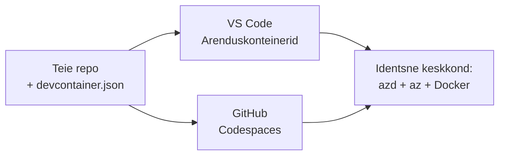

# Dev Containerid & GitHub Codespaces azd jaoks

**Chapter Navigation:**
- **📚 Kursuse avaleht**: [AZD algajatele](../../README.md)
- **📖 Praegune peatükk**: Peatükk 1 - Alused & Kiirkäivitus
- **⬅️ Eelmine**: [Too oma rakendus](bring-your-own-app.md)
- **🚀 Järgmine peatükk**: [Peatükk 2: AI-esmane arendus](../chapter-02-ai-development/README.md)

> Kinnitatud `azd 1.25.6` seisuga juunis 2026.

## Sissejuhatus

Azdi, õige keele täitmisaja, Dockeri ja Azure CLI iga masina peale installimine on vaev—and see on peamine põhjus, miks juhend, mis "töötab minu masinas", ei pruugi kellegi teise juures töötada. Arenduskonteiner (dev container) lahendab selle, kirjeldades kogu tööriistaketi ühes failis. Igaüks, kes avab projekti VS Code'is või GitHub Codespaces'is, saab täpselt sama keskkonna koos eelinstalleeritud azd-ga. See õppetund näitab, kuidas ühe lisada.

## Õpieesmärgid

Lõpusõnumina sellest õppetunnist sa:
- Mõistad, mis on arenduskonteiner ja miks see azd puhul kasulik on
- Lisad minimaalse `.devcontainer/devcontainer.json` faili projekti
- Kaasad azd, Azure CLI ja Docker Dev Container *funktsioonide* kaudu
- Avad projekti GitHub Codespaces'is või VS Code'is

## Õppimise tulemused

Pärast selle õppetunni läbimist suudad sa:
- Koostada `devcontainer.json` faili azd projektile
- Lisada azd ja Azure tööriistad ilma manuaalsete installideta
- Käivitada `azd up` konteineri või Codespace'i seest

---

## Mis on arenduskonteiner?

Arenduskonteiner on Docker-põhine arenduskeskkond, mis on määratletud sinu repositooriumi `.devcontainer/devcontainer.json` failis. Kui avad projekti:

- **VS Code** (koos Dev Containers laiendusega) ehitab konteineri ja liitub sellega.
- **GitHub Codespaces** ehitab sama konteineri pilves ja annab sulle brauseripõhise redaktori.

Mõlemal juhul saavad kõik panustajad identsed tööriistad—pole "kas sa installisid azd?" vigu.



---

## Samm 1: Loo devcontainer-fail

Loo `.devcontainer/devcontainer.json` oma projekti juurkausta:

```json
{
  "name": "azd-project",
  "image": "mcr.microsoft.com/devcontainers/base:bookworm",
  "features": {
    "ghcr.io/devcontainers/features/azure-cli:1": {},
    "ghcr.io/azure/azure-dev/azd:latest": {},
    "ghcr.io/devcontainers/features/docker-in-docker:2": {},
    "ghcr.io/devcontainers/features/node:1": {}
  },
  "customizations": {
    "vscode": {
      "extensions": [
        "ms-azuretools.azure-dev",
        "ms-azuretools.vscode-bicep"
      ]
    }
  },
  "forwardPorts": [3000],
  "postCreateCommand": "azd version"
}
```

Mida iga osa teeb:

| Võti | Eesmärk |
|-----|---------|
| `image` | Konteineri aluseks olev OS |
| `features` | Eelnevalt koostatud installijad — siin: Azure CLI, **azd**, Docker ja Node.js |
| `customizations.vscode.extensions` | Installib automaatselt azd ja Bicep VS Code laiendused |
| `forwardPorts` | Teeb teie rakenduse pordi brauseri jaoks kättesaadavaks |
| `postCreateCommand` | Käivitatakse üks kord pärast konteineri ehitamist (siin, lihtne kontroll) |

> Funktsioon `ghcr.io/azure/azure-dev/azd:latest` on ametlik viis azd hankimiseks konteinerisse. Kui vajate reprodutseeritavust, lukustage konkreetne versioon (näiteks `azd:1.25.6`).

---

## Samm 2: Kohanda funktsioon vastavalt rakenduse keelele

Vaheta `node` funktsioon selle vastu, mida sinu rakendus kasutab:

```jsonc
// Python project
"ghcr.io/devcontainers/features/python:1": {},

// .NET project
"ghcr.io/devcontainers/features/dotnet:2": {},

// Java project
"ghcr.io/devcontainers/features/java:1": {},

// Go project
"ghcr.io/devcontainers/features/go:1": {}
```

Hoia `docker-in-docker`, kui sinu `host` on `containerapp`, `aks` või mõni muu, mis ehitab konteineripilti — azd vajab Dockerit piltide ehitamiseks ja pushimiseks.

---

## Samm 3: Ava see

**VS Code'is:**
1. Paigalda **Dev Containers** laiendus.
2. Ava projektikaust.
3. Klõpsa küsides **Reopen in Container** (või käivita *Dev Containers: Reopen in Container*).

**GitHub Codespaces'is:**
1. Lükka repo GitHubi.
2. Klõpsa **Code → Codespaces → Create codespace on main**.
3. Oota konteineri ehitust—azd on terminalis valmis.

---

## Samm 4: Hõlma juurutamine konteineri seest

Konteineris on azd eelinstalleeritud, nii et tavaline töövoog töötab lihtsalt:

```bash
azd auth login --use-device-code   # seadmekood on Codespacesis mugav
azd up
```

> **Miks `--use-device-code`?** Kauges konteineris või Codespace'is puudub lokaalne brauser, kuhu suunata, nii et device-code sisselogimine on usaldusväärne tee. Kleepida tuleb kood brauseri vahekaardile, et lõpetada sisselogimine.

---

## Levinud lõksud

| Probleem | Lahendus |
|---------|-----|
| `azd up` ei saa pildi ehitada | Lisa `docker-in-docker` funktsioon |
| Brauseri sisselogimine jääb Codespaces'is hanguma | Kasuta `azd auth login --use-device-code` |
| Tööriistad erinevad meeskonnaliikmete vahel | Lukusta funktsioonide versioonid (nt `azd:1.25.6`) |
| Rakendus pole brauserist ligipääsetav | Lisa port `forwardPorts`-i |

---

## Kokkuvõte

- Arenduskonteiner muudab sinu azd tööriistaketi kõigile reprodutseeritavaks.
- Lisa azd, Azure CLI ja Docker Dev Container *funktsioonide* kaudu.
- Sobita keelefunktsioon oma rakendusega ja säilita `docker-in-docker` konteineripõhiste hostide puhul.
- Kasuta device-code sisselogimist, kui töötad Codespaces'is.

---

## 🔗 Navigatsioon

| Suund | Ressurss |
|-----------|----------|
| **Eelmine** | [Too oma rakendus](bring-your-own-app.md) |
| **Peatüki avaleht** | [Peatükk 1: Alused & Kiirkäivitus](README.md) |
| **Järgmine peatükk** | [Peatükk 2: AI-esmane arendus](../chapter-02-ai-development/README.md) |

## 📖 Seotud ressursid

- [Paigaldus ja seadistamine](installation.md)
- [Käskude kiirviide](../../resources/cheat-sheet.md)
- [Ametlik Dev Containers spetsifikatsioon](https://containers.dev/)
- [azd Dev Container funktsioon](https://github.com/Azure/azure-dev/tree/main/ext/devcontainer)

---

<!-- CO-OP TRANSLATOR DISCLAIMER START -->
**Lahtiütlus**:
See dokument on tõlgitud kasutades AI tõlketeenust [Co-op Translator](https://github.com/Azure/co-op-translator). Kuigi me püüdleme täpsuse poole, palun pange tähele, et automatiseeritud tõlgetes võib esineda vigu või ebatäpsusi. Originaaldokument selle emakeeles tuleks pidada autoriteetseks allikaks. Olulise teabe puhul soovitatakse kasutada professionaalset inimtõlget. Me ei vastuta selle tõlkega seotud eksimustest või valesti mõistmistest.
<!-- CO-OP TRANSLATOR DISCLAIMER END -->