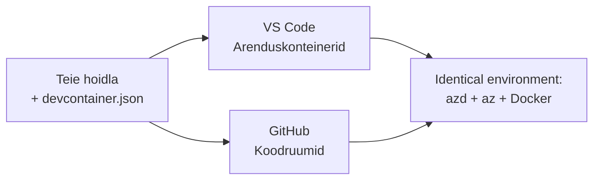

# Arenduskonteinerid & GitHub Codespaces azd jaoks

**Peatüki navigeerimine:**
- **📚 Kursuse avaleht**: [AZD algajatele](../../README.md)
- **📖 Praegune peatükk**: Peatükk 1 - Alused ja kiire algus
- **⬅️ Eelmine**: [Too oma rakendus](bring-your-own-app.md)
- **🚀 Järgmine peatükk**: [Peatükk 2: AI-esmase arendus](../chapter-02-ai-development/README.md)

> Kontrollitud `azd 1.27.1` vastu juulis 2026.

## Sissejuhatus

azd, õige keeleruntime, Dockeri ja Azure CLI installimine igale masinale on vaev—ja see on peamine põhjus, miksõpetus, mis "töötab minu masinas", ei tööta kellegi teise puhul. **Arenduskonteiner** lahendab selle, kirjeldades teie kogu tööriistakomplekti ühes failis. Igaüks, kes avab projekti VS Code'is või GitHub Codespaces'is, saab täpselt sama keskkonna, kus azd on juba installitud. See õppetükk näitab, kuidas üks lisada.

## Õpieesmärgid

Selle õppetüki lõpuks sa:
- Mõistad, mis on arenduskonteiner ja miks see azd puhul abiks on
- Lisad projekti minimaalne `.devcontainer/devcontainer.json`
- Sisaldad azd, Azure CLI ja Dockeri arenduskonteineri *funktsioonide* kaudu
- Avad projekti GitHub Codespaces'is või VS Code'is

## Õpitulemused

Selle õppetüki läbimisel saad:
- Kirjutada `devcontainer.json` azd projektile
- Lisada azd ja Azure tööriistad ilma käsitsi installimata
- Käivitada `azd up` konteinerist või Codespace'ist

---

## Mis on arenduskonteiner?

Arenduskonteiner on Dockeri-põhine arenduskeskkond, mis on määratletud sinu hoidla `.devcontainer/devcontainer.json` failis. Kui sa avad projekti:

- **VS Code** (Dev Containers laiendusega) ehitab konteineri ja ühendub sellega.
- **GitHub Codespaces** ehitab sama konteineri pilves ja annab sulle brauseripõhise redaktori.

Mõlemal juhul saavad kõik kaastöötajad identsed tööriistad—ei mingit "kas sa installisid azd?" tõrkeotsingut.



---

## 1. samm: Loo devcontainer fail

Loo `.devcontainer/devcontainer.json` oma projekti juurkausta:

```json
{
  "name": "azd-project",
  "image": "mcr.microsoft.com/devcontainers/base:bookworm",
  "features": {
    "ghcr.io/devcontainers/features/azure-cli:1": {},
    "ghcr.io/azure/azure-dev/azd:latest": {},
    "ghcr.io/devcontainers/features/docker-in-docker:2": {},
    "ghcr.io/devcontainers/features/node:1": {}
  },
  "customizations": {
    "vscode": {
      "extensions": [
        "ms-azuretools.azure-dev",
        "ms-azuretools.vscode-bicep"
      ]
    }
  },
  "forwardPorts": [3000],
  "postCreateCommand": "azd version"
}
```

Mida iga osa teeb:

| Võti | Eesmärk |
|-----|---------|
| `image` | Konteineri alus-OS |
| `features` | Eelinstallitud tööriistad—siin: Azure CLI, **azd**, Docker ja Node.js |
| `customizations.vscode.extensions` | Paigaldab automaatselt azd ja Bicep VS Code laiendused |
| `forwardPorts` | Avab sinu rakenduse pordi brauserile |
| `postCreateCommand` | Käivitub üks kord pärast konteineri ehitamist (siin, kontrolliks) |

> `ghcr.io/azure/azure-dev/azd:latest` funktsioon on ametlik viis saada azd konteinerisse. Spetsiifilise versiooni fikseerimiseks (näiteks `azd:1.27.1`) kasuta kindlat versiooni.

---

## 2. samm: Vasta funktsioon oma rakenduse keelele

Asenda `node` funktsioon millegagi, mida sinu rakendus kasutab:

```jsonc
// Python project
"ghcr.io/devcontainers/features/python:1": {},

// .NET project
"ghcr.io/devcontainers/features/dotnet:2": {},

// Java project
"ghcr.io/devcontainers/features/java:1": {},

// Go project
"ghcr.io/devcontainers/features/go:1": {}
```

Hoia `docker-in-docker`, kui sinu `host` on `containerapp`, `aks` või mis iganes, mis ehitab konteineripilti—azd vajab Dockeri piltide ehitamiseks ja lükkamiseks.

---

## 3. samm: Ava see

**VS Code'is:**
1. Paigalda **Dev Containers** laiendus.
2. Ava projekti kaust.
3. Klõpsa **Reopen in Container**, kui küsitakse (või käivita *Dev Containers: Reopen in Container*).

**GitHub Codespaces'is:**
1. Lükka repo GitHubi.
2. Klõpsa **Code → Codespaces → Create codespace on main**.
3. Oota konteineri ehitamist—azd on terminalis valmis.

---

## 4. samm: Käivita konteinerist välja juurutamine

Konteineril on azd eelinstallitud, nii et tavapärane töövoog töötab lihtsalt:

```bash
azd auth login --use-device-code   # seadme kood on Codespaces'is käepärane
azd up
```

> **Miks `--use-device-code`?** Kaugkonteineris või Codespace'is pole kohalikku brauserit, kuhu ümber suunata, nii et seadme-koodi sisselogimine on usaldusväärne tee. Sa kleebid koodi brauseri vahekaardile, et sisselogimise lõpetada.

---

## Levinumad lõksud

| Lõks | Lahendus |
|---------|-----|
| `azd up` ei saa pilti ehitada | Lisa `docker-in-docker` funktsioon |
| Brauseri sisselogimine hangub Codespaces'is | Kasuta `azd auth login --use-device-code` |
| Tööriistad erinevad meeskondade vahel | Fixeri funktsiooni versioonid (nt `azd:1.27.1`) |
| Rakendus pole brauserist ligipääsetav | Lisa port `forwardPorts` loendisse |

---

## Kokkuvõte

- Arenduskonteiner teeb sinu azd tööriistakomplekti kõigile korratavaks.
- Lisa azd, Azure CLI ja Docker Dev Container *funktsioonide* kaudu.
- Vasta keele funktsioon oma rakendusele ja hoia `docker-in-docker`, kui hostiks on konteiner.
- Kasuta seadme-koodi sisselogimist Codespaces'is töötades.

---

## 🔗 Navigeerimine

| Suund | Ressurss |
|-----------|----------|
| **Eelmine** | [Too oma rakendus](bring-your-own-app.md) |
| **Peatüki avaleht** | [Peatükk 1: Alused ja kiire algus](README.md) |
| **Järgmine peatükk** | [Peatükk 2: AI-esmase arendus](../chapter-02-ai-development/README.md) |

## 📖 Seotud ressursid

- [Paigaldus & seadistus](installation.md)
- [Käsukomplekti leht](../../resources/cheat-sheet.md)
- [Ametlik arenduskonteinerite spetsifikatsioon](https://containers.dev/)
- [azd Arenduskonteineri funktsioon](https://github.com/Azure/azure-dev/tree/main/ext/devcontainer)

---

<!-- CO-OP TRANSLATOR DISCLAIMER START -->
**Lahtiütlus**:
See dokument on tõlgitud kasutades AI tõlketeenust [Co-op Translator](https://github.com/Azure/co-op-translator). Kuigi me püüdleme täpsuse poole, palun pange tähele, et automatiseeritud tõlgetes võib esineda vigu või ebatäpsusi. Originaaldokument selle emakeeles tuleks pidada autoriteetseks allikaks. Olulise teabe puhul soovitatakse kasutada professionaalset inimtõlget. Me ei vastuta selle tõlkega seotud eksimustest või valesti mõistmistest.
<!-- CO-OP TRANSLATOR DISCLAIMER END -->