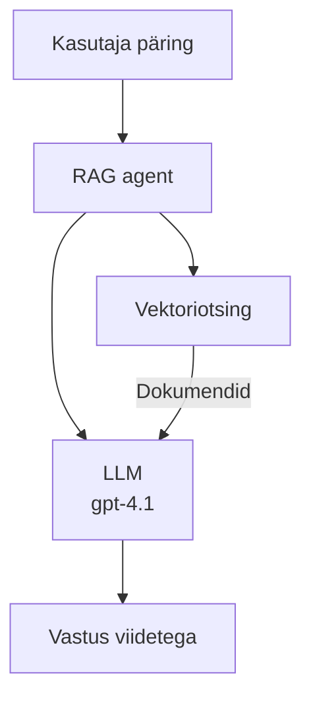
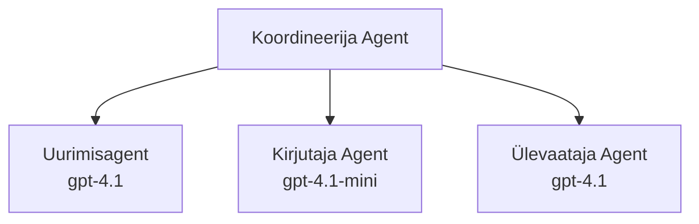

# AI agendid Azure Developer CLI-ga

**Peatüki navigeerimine:**
- **📚 Kursuse avaleht**: [AZD algajatele](../../README.md)
- **📖 Praegune peatükk**: Peatükk 2 - AI-eelnev arendus
- **⬅️ Eelmine**: [Microsoft Foundry integratsioon](microsoft-foundry-integration.md)
- **➡️ Järgmine**: [AI mudeli juurutamine](ai-model-deployment.md)
- **🚀 Täiustatud**: [Mitmeagendi lahendused](../../examples/retail-scenario.md)

---

## Sissejuhatus

AI agendid on autonoomsed programmid, mis suudavad tajuda oma keskkonda, teha otsuseid ja astuda samme kindlate eesmärkide saavutamiseks. Erinevalt lihtsatest vestlusrobotitest, mis vastavad käsklustele, saavad agendid:

- **Kasutada tööriistu** – Kutsuda API-sid, otsida andmebaasidest, täita koodi
- **Planeerida ja põhjendada** – Jagada keerulised ülesanded sammudeks
- **Õppida kontekstist** – Säilitada mälu ja kohandada käitumist
- **Tööd teha koostöös** – Töötada koos teiste agentidega (mitmeagendi süsteemid)

See juhend näitab, kuidas juurutada AI agente Azure’i abil Azure Developer CLI (azd) abil.

> **Kinnitustähis (2026-03-25):** Seda juhendit kontrolliti `azd` `1.23.12` ja `azure.ai.agents` `0.1.18-preview` vastu. `azd ai` funktsioon on endiselt eelvaates, seega kontrolli laienduse abi, kui sinu paigaldatud lipud erinevad.

## Õpieesmärgid

Selle juhendi lõpetamisega sa:
- Mõistad, mis on AI agendid ja kuidas need erinevad vestlusrobotitest
- Juhtid eelnevalt koostatud AI agendi malle AZD abil
- Konfigureerid Foundry Agente kohandatud agentide jaoks
- Rakendad põhilisi agendi mustreid (tööriistade kasutamine, RAG, mitmeagentne)
- Jälgid ja silud juurutatud agente

## Õpitulemused

Juhendi lõpetamisel suudad:
- Juurutada AI agendi rakendusi Azure’i ühekordse käsuga
- Konfigureerida agendi tööriistu ja võimeid
- Rakendada otsingupõhist generaatorit (RAG) agentidega
- Kujundada mitmeagentseid arhitektuure keerukate töövoogude jaoks
- Lahendada tavapäraseid agentide juurutamise probleeme

---

## 🤖 Mis teeb agendist erineva vestlusrobotist?

| Omadus | Vestlusrobot | AI Agent |
|---------|--------------|----------|
| **Käitumine** | Vastab päringutele | Võtab autonoomseid samme |
| **Tööriistad** | Puuduvad | Saab kutsuda API-sid, otsida, täita koodi |
| **Mälu** | Ainult sessioonipõhine | Püsiv mälu sessioonide vahel |
| **Planeerimine** | Ühes vastuses | Mitmesammuline põhjendus |
| **Koostöö** | Üksik üksus | Saab töötada koos teiste agentidega |

### Lihtne analoogia

- **Vestlusrobot** = Abivalmis inimene infolauas küsimustele vastamas
- **AI Agent** = Isiklik assistent, kes saab helistada, broneerida kohtumisi ja täita ülesandeid sinu eest

---

## 🚀 Kiire algus: Juuruta oma esimene agent

### Variant 1: Foundry Agendi mall (Soovitatav)

```bash
# Algata tehisintellekti agentide mall
azd init --template get-started-with-ai-agents

# Rakenda Azure'i keskkonda
azd up
```

**Mida juurutatakse:**
- ✅ Foundry Agendid
- ✅ Microsoft Foundry mudelid (gpt-4.1)
- ✅ Azure AI Search (RAG jaoks)
- ✅ Azure Container Apps (veebiliides)
- ✅ Application Insights (jälgimine)

**Aeg:** ~15-20 minutit
**Kulu:** ~$100-150 kuus (arendus)

### Variant 2: OpenAI agent koos Promptyga

```bash
# Initsialiseeri Prompty-põhine agentide mall
azd init --template agent-openai-python-prompty

# Paigalda Azure'i
azd up
```

**Mida juurutatakse:**
- ✅ Azure Functions (serverivaba agendi käitamine)
- ✅ Microsoft Foundry mudelid
- ✅ Prompty konfiguratsioonifailid
- ✅ Näidise agendi rakendus

**Aeg:** ~10-15 minutit
**Kulu:** ~$50-100 kuus (arendus)

### Variant 3: RAG vestlusagent

```bash
# Algatage RAG vestluse mall
azd init --template azure-search-openai-demo

# Pange kasutusele Azure'is
azd up
```

**Mida juurutatakse:**
- ✅ Microsoft Foundry mudelid
- ✅ Azure AI Search näidandmetega
- ✅ Dokumendi töötlemise voog
- ✅ Vestlusliides viidetega

**Aeg:** ~15-25 minutit
**Kulu:** ~$80-150 kuus (arendus)

### Variant 4: AZD AI Agent Init (Manifesti- või mallipõhine eelvaade)

Kui sul on agendi manifestifail, saad kasutada käsku `azd ai` Foundry Agent Service projekti otse luua. Hiljutised eelvaateversioonid on lisanud ka mallipõhise initsialiseerimise toe, seega võib täpne käsupõhine voog veidi erineda sõltuvalt sinu paigaldatud laiendusversioonist.

```bash
# Paigalda AI agentide laiendus
azd extension install azure.ai.agents

# Valikuline: kontrolli paigaldatud eelvaate versiooni
azd extension show azure.ai.agents

# Algata agentide manifestist
azd ai agent init -m agent-manifest.yaml

# Deploy Azure'i
azd up

# Testi deployitud agenti (näitab latentsust ja esimese baitini kuluvat aega)
azd ai agent invoke
```

**Millal kasutada `azd ai agent init` vs `azd init --template`:**

| Lähenemine | Sobib kõige paremini | Kuidas töötab |
|------------|----------------------|---------------|
| `azd init --template` | Töötava näidise rakenduse alustamiseks | Kloneerib täismalli hoidla koos koodi ja infrastruktuuriga |
| `azd ai agent init -m` | Oma agendi manifesti alusel ehitamiseks | Koostab projekti struktuuri sinu agendi definitsioonist |

> **Vihje:** Kasuta `azd init --template`, kui õpid (Variants 1-3 ülal). Kasuta `azd ai agent init` tootmisagentide loomisel oma manifestidega.

Pärast `azd up` juhib sama laiendus sind ülejäänud agendi elutsükli läbi: `azd ai agent invoke` testimiseks, `azd ai agent eval generate` ja `azd ai agent optimize` kvaliteedi mõõtmiseks ja parandamiseks ning `azd ai agent delete` puhastamiseks. Vaata [AZD AI CLI käsud](../chapter-08-production/production-ai-practices.md#azd-ai-cli-commands-and-extensions) täielikku ülevaadet.

---

## 🏗️ Agendi arhitektuuri mustrid

### Muster 1: Üks agent tööriistadega

Kõige lihtsam agendi muster – üks agent, kes saab kasutada mitut tööriista.


**Sobib:**
- Klienditoe botid
- Uurimisassistendid
- Andmeanalüüsi agendid

**AZD Mall:** `azure-search-openai-demo`

### Muster 2: RAG agent (otsingupõhine genereerimine)

Agent, kes otsib enne vastamist asjakohaseid dokumente.



**Sobib:**
- Ettevõtte teadmistebaasid
- Dokumentide K&V süsteemid
- Vastavuse ja juriidilise uurimise lahendused

**AZD Mall:** `azure-search-openai-demo`

### Muster 3: Mitmeagentne süsteem

Mitmed spetsialiseerunud agendid töötavad koos keeruliste ülesannete kallal.



**Sobib:**
- Keeruline sisuloome
- Mitmesammulised töövood
- Ülesanded, mis nõuavad erinevat spetsialiseerumist

**Loe edasi:** [Mitmeagendi koordineerimismustrid](../chapter-06-pre-deployment/coordination-patterns.md)

---

## ⚙️ Agentide tööriistade konfigureerimine

Agentide võimsus tuleb kasutamisest tööriistadega. Siin on, kuidas konfigureerida levinud tööriistu:

### Tööriistade seadistamine Foundry Agentides

```python
# agent_config.py
from azure.ai.projects import AIProjectClient
from azure.ai.projects.models import FunctionTool, CodeInterpreterTool

# Määratle kohandatud tööriistad
search_tool = FunctionTool(
    name="search_knowledge_base",
    description="Search the company knowledge base for relevant documents",
    parameters={
        "type": "object",
        "properties": {
            "query": {
                "type": "string",
                "description": "The search query"
            }
        },
        "required": ["query"]
    }
)

# Loo agent tööriistadega
agent = project_client.agents.create_agent(
    model="gpt-4.1",
    name="Support Agent",
    instructions="You are a helpful support agent. Use the search tool to find relevant information.",
    tools=[search_tool, CodeInterpreterTool()]
)
```

### Keskkonna seadistus

```bash
# Määrake agendi-spetsiifilised keskkonnamuutujad
azd env set AZURE_OPENAI_MODEL "gpt-4.1"
azd env set AGENT_INSTRUCTIONS "You are a helpful assistant..."
azd env set ENABLE_CODE_INTERPRETER "true"
azd env set ENABLE_FILE_SEARCH "true"

# Paigaldage uuendatud konfiguratsiooniga
azd deploy
```

---

## 📊 Agentide jälgimine

### Application Insights integreerimine

Kõik AZD agendi mallid sisaldavad Application Insightsi jälgimiseks:

```bash
# Ava jälgimise armatuurlaud
azd monitor --overview

# Vaata reaalajas logisid
azd monitor --logs

# Vaata reaalajas mõõdikuid
azd monitor --live
```

### Põhimõõdikud jälgimiseks

| Mõõdik | Kirjeldus | Eesmärk |
|--------|-----------|---------|
| Vastuse latentsus | Vastuse genereerimise aeg | < 5 sekundit |
| Tokenite kasutus | Tokenite arv päringu kohta | Jälgi kulusid |
| Tööriistakõne edukus | Edukalt täidetud tööriistakutsed % | > 95% |
| Vea määr | Ebaõnnestunud agendi päringud | < 1% |
| Kasutajate rahulolu | Tagasiside skoorid | > 4.0/5.0 |

### Kohandatud logimine agentide jaoks

```python
import os
from azure.monitor.opentelemetry import configure_azure_monitor
from opentelemetry import trace

# Konfigureeri Azure Monitor OpenTelemetry'ga
configure_azure_monitor(
    connection_string=os.environ["APPLICATIONINSIGHTS_CONNECTION_STRING"]
)

tracer = trace.get_tracer(__name__)

def log_agent_interaction(user_query, agent_response, tools_used, latency_ms):
    with tracer.start_as_current_span("agent_interaction") as span:
        span.set_attributes({
            "user_query": user_query,
            "response_length": len(agent_response),
            "tools_used": tools_used,
            "latency_ms": latency_ms
        })
```

> **Märkus:** Paigalda vajalikud paketid: `pip install azure-monitor-opentelemetry opentelemetry`

---

## 💰 Kulude kaalutlused

### Hinnangulised kuukulud mustrite kaupa

| Muster | Arenduskeskkond | Tootmine |
|---------|----------------|----------|
| Üks agent | $50-100 | $200-500 |
| RAG agent | $80-150 | $300-800 |
| Mitmeagentne (2-3 agenti) | $150-300 | $500-1,500 |
| Ettevõtte mitmeagentne | $300-500 | $1,500-5,000+ |

### Kulude optimeerimise näpunäited

1. **Kasuta gpt-4.1-mini lihtsateks ülesanneteks**
   ```bash
   azd env set AZURE_OPENAI_MODEL "gpt-4.1-mini"
   ```

2. **Rakenda vahemälu korduvate päringute jaoks**
   ```python
   from functools import lru_cache
   
   @lru_cache(maxsize=1000)
   def get_cached_response(query_hash):
       return agent.run(query_hash)
   ```

3. **Sea tokenite piirangud iga jooksu kohta**
   ```python
   # Määra max_completion_tokens agendi käivitamisel, mitte loomise ajal
   run = project_client.agents.create_run(
       thread_id=thread.id,
       agent_id=agent.id,
       max_completion_tokens=1000  # Piira vastuse pikkust
   )
   ```

4. **Skaaleeri nulli, kui pole kasutusel**
   ```bash
   # Container Apps skaleeruvad automaatselt nulli
   azd env set MIN_REPLICAS "0"
   ```

---

## 🔧 Agendi tõrkeotsing

### Sageli esinevad probleemid ja lahendused

<details>
<summary><strong>❌ Agent ei vasta tööriistakutsetele</strong></summary>

```bash
# Kontrolli, kas tööriistad on õigesti registreeritud
azd show

# Kontrolli OpenAI juurutust
az cognitiveservices account deployment list \
  --name $AZURE_OPENAI_NAME \
  --resource-group $RG_NAME

# Kontrolli agendi logisid
azd monitor --logs
```

**Tüüpilised põhjused:**
- Tööriistafunktsiooni signatuuri sobimatus
- Puuduvad vajalikud õigused
- API lõpp-punkt pole ligipääsetav
</details>

<details>
<summary><strong>❌ Agentide vastuste suur latentsus</strong></summary>

```bash
# Kontrolli rakenduse Insightsi kitsaskohti
azd monitor --live

# Kaalu kiiremalt mudeli kasutamist
azd env set AZURE_OPENAI_MODEL "gpt-4.1-mini"
azd deploy
```

**Optimeerimisnõuanded:**
- Kasuta voogedastusega vastuseid
- Rakenda vastuste vahemällu salvestamist
- Vähenda konteksti akna suurust
</details>

<details>
<summary><strong>❌ Agent tagastab vale või hallutsinatsioonne info</strong></summary>

```python
# Paranda parematega süsteemi vihjete abil
instructions = """
You are a helpful assistant. IMPORTANT:
- Only answer based on provided context
- If you don't know, say "I don't know"
- Always cite your sources
- Never make up information
"""

# Lisa taastekasu maandamiseks
agent = project_client.agents.create_agent(
    model="gpt-4.1",
    instructions=instructions,
    tools=[FileSearchTool()]  # Põhista vastused dokumentidel
)
```
</details>

<details>
<summary><strong>❌ Tokenite limiidi ületamise vead</strong></summary>

```python
# Rakenda konteksti akna haldamine
def truncate_context(messages, max_tokens=8000, model="gpt-4.1"):
    """Keep only recent messages within token limit."""
    import tiktoken
    encoding = tiktoken.encoding_for_model(model)
    total_tokens = 0
    truncated = []
    
    for msg in reversed(messages):
        msg_tokens = len(encoding.encode(msg.content))
        if total_tokens + msg_tokens > max_tokens:
            break
        truncated.insert(0, msg)
        total_tokens += msg_tokens
    
    return truncated
```
</details>

---

## 🎓 Praktilised harjutused

### Harjutus 1: Baasagendi juurutamine (20 minutit)

**Eesmärk:** Juuruta oma esimene AI agent AZD abil

```bash
# Samm 1: Initsialiseeri mall
azd init --template get-started-with-ai-agents

# Samm 2: Logi sisse Azure'i
azd auth login
# Kui töötad mitme üürnikuga, lisa --tenant-id <tenant-id>

# Samm 3: Käivita juurutus
azd up

# Samm 4: Testi agenti
# Oodatav väljund pärast juurutust:
#   Juurutus lõpetatud!
#   Lõpp-punkt: https://<app-name>.<region>.azurecontainerapps.io
# Ava väljundis näidatud URL ja proovi esitada küsimus

# Samm 5: Vaata jälgimist
azd monitor --overview

# Samm 6: Puhasta üles
azd down --force --purge
```

**Õnnestumise kriteeriumid:**
- [ ] Agent vastab küsimustele
- [ ] Saab kasutada jälgimisdashboardi käsuga `azd monitor`
- [ ] Ressursid puhastatud edukalt

### Harjutus 2: Lisa kohandatud tööriist (30 minutit)

**Eesmärk:** Laiendada agenti kohandatud tööriistaga

1. Juuruta agendi mall:
   ```bash
   azd init --template get-started-with-ai-agents
   azd up
   ```
2. Loo uus tööriistafunktsioon oma agendi koodis:
   ```python
   def get_weather(location: str) -> str:
       """Get current weather for a location."""
       # API kõne ilmateenistusele
       return f"Weather in {location}: Sunny, 72°F"
   ```
3. Registreeri tööriist agenti sees:
   ```python
   from azure.ai.projects.models import FunctionTool

   weather_tool = FunctionTool(
       name="get_weather",
       description="Get current weather for a location",
       parameters={
           "type": "object",
           "properties": {
               "location": {"type": "string", "description": "City name"}
           },
           "required": ["location"]
       }
   )

   agent = project_client.agents.create_agent(
       model="gpt-4.1",
       name="Weather Agent",
       tools=[weather_tool]
   )
   ```
4. Juuruta uuesti ja testi:
   ```bash
   azd deploy
   # Küsi: "Milline on ilm Seattle'is?"
   # Oodatud: Agent kutsub funktsiooni get_weather("Seattle") ja tagastab ilmainfo
   ```

**Õnnestumise kriteeriumid:**
- [ ] Agent tunneb ära ilmaga seotud päringud
- [ ] Tööriist kutsutakse õigesti
- [ ] Vastus sisaldab ilmainfot

### Harjutus 3: RAG agendi loomine (45 minutit)

**Eesmärk:** Loo agent, mis vastab küsimustele sinu dokumentide põhjal

```bash
# Samm 1: Paigalda RAG mall
azd init --template azure-search-openai-demo
azd up

# Samm 2: Laadi üles oma dokumendid
# Aseta PDF/TXT failid kataloogi data/, seejärel käivita:
python scripts/prepdocs.py

# Samm 3: Testi domeenispetsiifiliste küsimustega
# Ava veebirakenduse URL azd up väljundist
# Esita küsimusi oma üleslaaditud dokumentide kohta
# Vastused peaksid sisaldama tsitaatide viiteid nagu [doc.pdf]
```

**Õnnestumise kriteeriumid:**
- [ ] Agent vastab üleslaaditud dokumentidest
- [ ] Vastustes on viited
- [ ] Ei esine hallutsinatsioone väljaspool ulatust

---

## 📚 Järgmised sammud

Nüüd, kui sa tead, mis on AI agendid, uurige neid täiustatud teemasid:

| Teema | Kirjeldus | Link |
|-------|-----------|------|
| **Mitmeagentne süsteem** | Ehita süsteeme, kus mitu agenti koostööd teevad | [Jaemüügi mitmeagentne näide](../../examples/retail-scenario.md) |
| **Koordineerimismustrid** | Õpi orkestreerimise ja suhtluse mustreid | [Koordineerimismustrid](../chapter-06-pre-deployment/coordination-patterns.md) |
| **Tootejuurutus** | Ettevõttevalmis agentide juurutus | [Tootmise AI praktikad](../chapter-08-production/production-ai-practices.md) |
| **Agendi hindamine** | Testi ja hinda agendi toimivust | [AI tõrkeotsing](../chapter-07-troubleshooting/ai-troubleshooting.md) |
| **AI töötuba** | Praktika: muuda AI lahendus AZD-valmis | [AI töötuba](ai-workshop-lab.md) |

---

## 📖 Täiendavad ressursid

### Ametlik dokumentatsioon
- [Microsoft Foundry Agendi teenus](https://learn.microsoft.com/azure/ai-services/agents/)
- [Microsoft Foundry Agendi teenuse kiire alustamine](https://learn.microsoft.com/azure/ai-services/agents/quickstart)
- [Semantic Kernel agendi raamistiku dokumentatsioon](https://learn.microsoft.com/semantic-kernel/)

### AZD mallid agentide jaoks
- [Alusta AI agentidega](https://github.com/Azure-Samples/get-started-with-ai-agents)
- [Agent OpenAI Python Prompty](https://github.com/Azure-Samples/agent-openai-python-prompty)
- [Azure Search OpenAI demo](https://github.com/Azure-Samples/azure-search-openai-demo)

### Ühiskonna ressursid
- [Awesome AZD - Agendi mallid](https://azure.github.io/awesome-azd/?tags=ai-agents)
- [Azure AI Discord](https://discord.gg/microsoft-azure)
- [Microsoft Foundry Discord](https://discord.gg/nTYy5BXMWG)

### Redaktori jaoks agendi oskused
- [**Microsoft Azure agendi oskused**](https://skills.sh/microsoft/github-copilot-for-azure) – Paigalda korduvkasutatavad AI agendi oskused Azure arenduseks GitHub Copilotis, Cursoris või mõnes toetatud agendis. Sisaldab oskusi [Azure AI](https://skills.sh/microsoft/github-copilot-for-azure/azure-ai), [Microsoft Foundry](https://skills.sh/microsoft/github-copilot-for-azure/microsoft-foundry), [juurutus](https://skills.sh/microsoft/github-copilot-for-azure/azure-deploy) ja [diagnoosimise](https://skills.sh/microsoft/github-copilot-for-azure/azure-diagnostics) jaoks:
  ```bash
  npx skills add microsoft/github-copilot-for-azure
  ```

---

**Navigeerimine**
- **Eelmine õppetund**: [Microsoft Foundry integratsioon](microsoft-foundry-integration.md)
- **Järgmine õppetund**: [AI mudeli juurutamine](ai-model-deployment.md)

---

<!-- CO-OP TRANSLATOR DISCLAIMER START -->
**Lahtiütlus**:
See dokument on tõlgitud kasutades AI tõlketeenust [Co-op Translator](https://github.com/Azure/co-op-translator). Kuigi me püüdleme täpsuse poole, palun pange tähele, et automatiseeritud tõlgetes võib esineda vigu või ebatäpsusi. Originaaldokument selle emakeeles tuleks pidada autoriteetseks allikaks. Olulise teabe puhul soovitatakse kasutada professionaalset inimtõlget. Me ei vastuta selle tõlkega seotud eksimustest või valesti mõistmistest.
<!-- CO-OP TRANSLATOR DISCLAIMER END -->