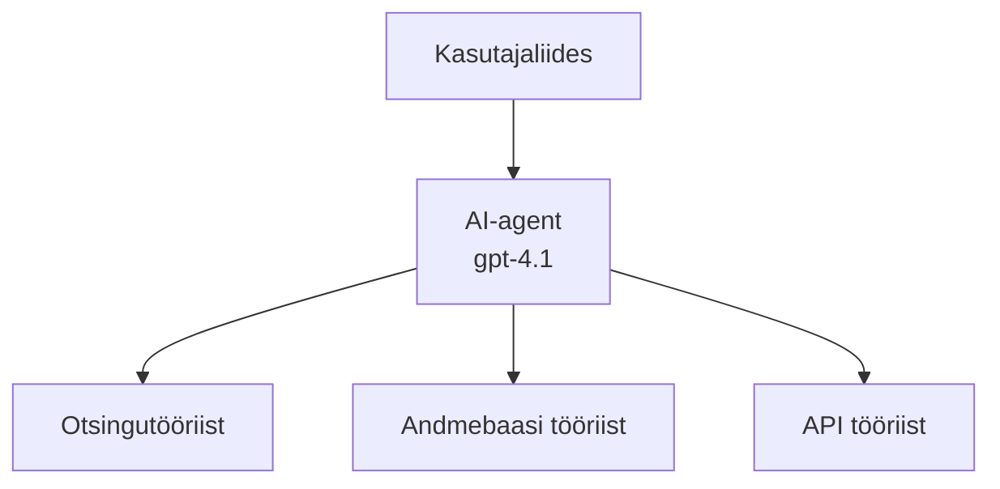
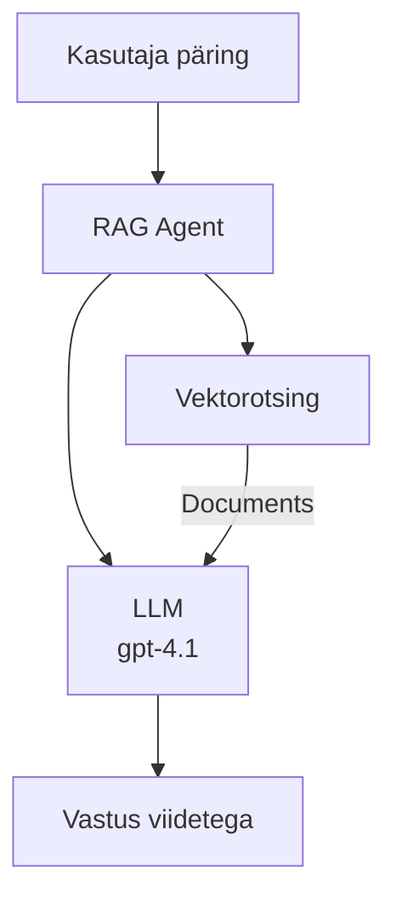
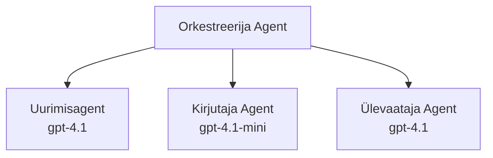

# Tehisintellekti agendid Azure Developer CLI-ga

**Peatüki navigatsioon:**
- **📚 Kursuse avaleht**: [AZD algajatele](../../README.md)
- **📖 Praegune peatükk**: Peatükk 2 - AI-esimene arendus
- **⬅️ Eelmine**: [Microsoft Foundry integratsioon](microsoft-foundry-integration.md)
- **➡️ Järgmine**: [AI mudeli juurutamine](ai-model-deployment.md)
- **🚀 Edasijõudnutele**: [Mitme agendi lahendused](../../examples/retail-scenario.md)

---

## Sissejuhatus

Tehisintellekti agendid on autonoomsed programmid, mis suudavad tajuda oma keskkonda, teha otsuseid ja võtta meetmeid kindlate eesmärkide saavutamiseks. Erinevalt lihtsatest vestlusrobotitest, mis vastavad vaid päringutele, suudavad agendid:

- **Kasutada tööriistu** - Kutsuda API-sid, otsida andmebaasidest, käivitada koodi
- **Plaanimine ja põhjendamine** - Jagada keerulisi ülesandeid sammudeks
- **Õppida kontekstist** - Säilitada mälu ja kohandada käitumist
- **Koostööd teha** - Töötada koos teiste agentidega (mitme agendi süsteemid)

See juhend näitab, kuidas juurutada AI agente Azures Azure Developer CLI (azd) abil.

> **Kontrollimärkus (2026-07-13):** Seda juhendit vaadati üle `azd` `1.27.1` ja `azure.ai.agents` `1.0.0-beta.5` versioonide põhjal. `azd ai` kogemus on endiselt eelvaatefaasis, seega kontrolli laienduse abi, kui sinu paigaldatud lipud erinevad.

## Õpieesmärgid

Selle juhendi lõpuks sa:
- Mõistad, mis on AI agendid ja kuidas nad erinevad vestlusrobotitest
- Juurutad eelvalmistatud AI agentide malle AZD-ga
- Konfigureerid Foundry agente kohandatud agentide jaoks
- Rakendad põhilisi agendi mustreid (tööriistade kasutamine, RAG, mitme agenti süsteem)
- Jälgid ja silud juurutatud agente

## Õpitulemused

Pärast lõpetamist suudad:
- Juurutada AI agendi rakendusi Azure'i ühe käsuga
- Konfigureerida agendi tööriistu ja võimeid
- Rakendada andmeteotsingupõhist genereerimist (RAG) agentidega
- Kujundada mitme agendi arhitektuure keerukate töövoogude jaoks
- Lahendada levinumaid agendi juurutamise probleeme

---

## 🤖 Mis teeb agendi erinevaks vestlusrobotist?

| Omadus | Vestlusrobot | AI Agent |
|---------|---------|----------|
| **Käitumine** | Vastab päringutele | Võtab autonoomseid meetmeid |
| **Tööriistad** | Puuduvad | Saab kutsuda API-sid, otsida, käivitada koodi |
| **Mälu** | Ainult sessioonipõhine | Püsiv mälu sessioonide vahel |
| **Planeerimine** | Ühe vastusega | Mitmesammuline põhjendus |
| **Koostöö** | Üksiküksus | Saab töötada koos teiste agentidega |

### Lihtne võrdlus

- **Vestlusrobot** = Abivalmis inimene infolauas küsimustele vastamas
- **AI agent** = Isiklik assistent, kes saab teha kõnesid, broneerida kohtumisi ja täita ülesandeid sinu eest

---

## 🚀 Kiire algus: juuruta oma esimene agent

### Valik 1: Foundry agentide mall (soovitatav)

```bash
# Algatage AI-agentide mall
azd init --template get-started-with-ai-agents

# Paigaldage Azure'i
azd up
```

**Mida juurutatakse:**
- ✅ Foundry agendid
- ✅ Microsoft Foundry mudelid (gpt-4.1)
- ✅ Azure AI Search (RAG jaoks)
- ✅ Azure Container Apps (veebiliides)
- ✅ Application Insights (jälgimine)

**Aeg:** ~15-20 minutit
**Kulu:** ~$100-150/kuu (arendus)

### Valik 2: OpenAI agent koos Promptyga

```bash
# Initsialiseeri Prompty-põhine agendi mall
azd init --template agent-openai-python-prompty

# Rooli Azure'i
azd up
```

**Mida juurutatakse:**
- ✅ Azure Functions (serverivaba agendi täitmine)
- ✅ Microsoft Foundry mudelid
- ✅ Prompty konfiguratsioonifailid
- ✅ Näidisagendi rakendus

**Aeg:** ~10-15 minutit
**Kulu:** ~$50-100/kuu (arendus)

### Valik 3: RAG vestlusagent

```bash
# Algatage RAG vestlusmall
azd init --template azure-search-openai-demo

# Paigaldage Azure'i
azd up
```

**Mida juurutatakse:**
- ✅ Microsoft Foundry mudelid
- ✅ Azure AI Search koos näidandmetega
- ✅ Dokumentide töötlemise torujuhe
- ✅ Vestlusliides viidetega

**Aeg:** ~15-25 minutit
**Kulu:** ~$80-150/kuu (arendus)

### Valik 4: AZD AI agendi initsialiseerimine (manifesti- või malli-põhine eelvaade)

Kui sul on agendi manifestifail, saad kasutada `azd ai` käsku, et otse Foundry Agent Service projekti luua. Viimased eelvaateväljaanded lisasid ka malli-põhise initsialiseerimise toe, seega täpne juhiste järjekord võib sõltuvalt paigaldatud laienduse versioonist mõnevõrra erineda.

```bash
# Paigalda AI agentide laiendus
azd extension install azure.ai.agents

# Valikuline: kontrolli paigaldatud eelvaate versiooni
azd extension show azure.ai.agents

# Algata agendimanifestist
azd ai agent init -m agent-manifest.yaml

# Paiguta Azure'i
azd up

# Testi paigaldatud agenti (näitab latentsust + esimese baidi aega)
azd ai agent invoke
```

**Millal kasutada `azd ai agent init` ja millal `azd init --template`:**

| Lähenemine | Sobib kõige paremini | Kuidas see töötab |
|----------|----------|------|
| `azd init --template` | Töötavast näidisrakendusest alustamiseks | Kopeerib kogu malli repo koos koodi ja infrastruktuuriga |
| `azd ai agent init -m` | Oma agendi manifestist alustades | Loob projekti struktuuri agendi definitsiooni põhjal |

> **Nipp:** Kasuta `azd init --template`, kui õpid (üksused 1–3 eespool). Kasuta `azd ai agent init`, kui ehitad tootmises olevaid agente oma manifestidega.

Pärast `azd up` käsku juhib sama laiendus sind ülejäänud agendi elutsükli: testi `azd ai agent invoke` abil, mõõda ja paranda kvaliteeti `azd ai agent eval generate` ja `azd ai agent optimize` abil ning puhasta allesjäänud käsuga `azd ai agent delete`. Täispõhivõimaluste kirjeldus on saadaval [AZD AI CLI käskudes](../chapter-08-production/production-ai-practices.md#azd-ai-cli-commands-and-extensions).

---

## 🏗️ Agendi arhitektuurimustrid

### Muster 1: Üksik agent tööriistadega

Kõige lihtsam agentide muster — üks agent, kes saab kasutada mitut tööriista.



**Parim järgmiste jaoks:**
- Klienditoe robotid
- Uurimisassistendid
- Andmeanalüüsi agendid

**AZD mall:** `azure-search-openai-demo`

### Muster 2: RAG agent (otsinguga täiustatud genereerimine)

Agent, kes hangib asjakohased dokumendid enne vastuse genereerimist.



**Parim järgmiste jaoks:**
- Ettevõtte teadmiste baasid
- Dokumentide küsimuste ja vastuste süsteemid
- Vastavuse ja õiguslike uuringute jaoks

**AZD mall:** `azure-search-openai-demo`

### Muster 3: Mitme-agendi süsteem

Mitmed spetsialiseerunud agendid töötavad koos keerukate ülesannete kallal.



**Parim järgmiste jaoks:**
- Keerukas sisuloome
- Mitme sammu töövood
- Ülesanded, mis nõuavad erinevat erialast pädevust

**Lisalugemist:** [Mitme agendi koordineerimise mustrid](../chapter-06-pre-deployment/coordination-patterns.md)

---

## ⚙️ Agendi tööriistade seadistamine

Agendid muutuvad võimsaks, kui nad saavad kasutada tööriistu. Siin on, kuidas seadistada levinumaid tööriistu:

### Tööriista seadistamine Foundry agentides

```python
# agent_config.py
from azure.ai.projects import AIProjectClient
from azure.ai.projects.models import FunctionTool, CodeInterpreterTool

# Kohandatud tööriistade defineerimine
search_tool = FunctionTool(
    name="search_knowledge_base",
    description="Search the company knowledge base for relevant documents",
    parameters={
        "type": "object",
        "properties": {
            "query": {
                "type": "string",
                "description": "The search query"
            }
        },
        "required": ["query"]
    }
)

# Agendi loomine tööriistadega
agent = project_client.agents.create_agent(
    model="gpt-4.1",
    name="Support Agent",
    instructions="You are a helpful support agent. Use the search tool to find relevant information.",
    tools=[search_tool, CodeInterpreterTool()]
)
```

### Keskkonna seadistamine

```bash
# Määrake agendi-spetsiifilised keskkonnamuutujad
azd env set AZURE_OPENAI_MODEL "gpt-4.1"
azd env set AGENT_INSTRUCTIONS "You are a helpful assistant..."
azd env set ENABLE_CODE_INTERPRETER "true"
azd env set ENABLE_FILE_SEARCH "true"

# Käivitage värskendatud konfiguratsiooniga lõpptarvik
azd deploy
```

---

## 📊 Agentide jälgimine

### Application Insights integratsioon

Kõik AZD agendi mallid sisaldavad Application Insightsi jälgimiseks:

```bash
# Ava monitooringu armatuurlaud
azd monitor --overview

# Vaata reaalajas logisid
azd monitor --logs

# Vaata reaalajas mõõdikuid
azd monitor --live
```

### Põhimõõdikud jälgimiseks

| Mõõdik | Kirjeldus | Sihtväärtus |
|--------|-------------|--------|
| Vastuse latentsus | Aeg vastuse genereerimiseks | < 5 sekundit |
| Tokenite kasutus | Tokenite arv päringu kohta | Jälgi kulusid |
| Tööriista väljakutsete õnnestumusprotsent | Õnnestunud tööriistakutsed % | > 95% |
| Vea määr | Ebaõnnestunud agentide päringud | < 1% |
| Kasutajate rahulolu | Tagasiside skoorid | > 4.0/5.0 |

### Kohandatud logimine agentidele

```python
import os
from azure.monitor.opentelemetry import configure_azure_monitor
from opentelemetry import trace

# Konfigureeri Azure Monitor kasutades OpenTelemetry't
configure_azure_monitor(
    connection_string=os.environ["APPLICATIONINSIGHTS_CONNECTION_STRING"]
)

tracer = trace.get_tracer(__name__)

def log_agent_interaction(user_query, agent_response, tools_used, latency_ms):
    with tracer.start_as_current_span("agent_interaction") as span:
        span.set_attributes({
            "user_query": user_query,
            "response_length": len(agent_response),
            "tools_used": tools_used,
            "latency_ms": latency_ms
        })
```

> **Märkus:** Paigalda vajalikud paketid: `pip install azure-monitor-opentelemetry opentelemetry`

---

## 💰 Kulude kaalutlused

### Hinnangulised kuukulud mustrite kaupa

| Muster | Arenduskeskkond | Tootmine |
|---------|-----------------|------------|
| Üksik agent | $50-100 | $200-500 |
| RAG agent | $80-150 | $300-800 |
| Mitme agenti (2–3 agenti) | $150-300 | $500-1,500 |
| Ettevõtte mitme agenti | $300-500 | $1,500-5,000+ |

### Kulude optimeerimise näpunäited

1. **Kasuta gpt-4.1-mini lihtsate ülesannete jaoks**
   ```bash
   azd env set AZURE_OPENAI_MODEL "gpt-4.1-mini"
   ```

2. **Rakenda vahemällu salvestamine korduvate päringute jaoks**
   ```python
   from functools import lru_cache
   
   @lru_cache(maxsize=1000)
   def get_cached_response(query_hash):
       return agent.run(query_hash)
   ```

3. **Sea tokeni piirangud jooksu kohta**
   ```python
   # Määra max_completion_tokens agendi käivitamisel, mitte loomise ajal
   run = project_client.agents.create_run(
       thread_id=thread.id,
       agent_id=agent.id,
       max_completion_tokens=1000  # Piira vastuse pikkust
   )
   ```

4. **Skaala nullini, kui ei kasutata**
   ```bash
   # Container Apps skaleeruvad automaatselt nulli
   azd env set MIN_REPLICAS "0"
   ```

---

## 🔧 Agendi probleemide lahendamine

### Levinud probleemid ja lahendused

<details>
<summary><strong>❌ Agent ei vasta tööriistakutsedele</strong></summary>

```bash
# Kontrolli, kas tööriistad on õigesti registreeritud
azd show

# Kontrolli OpenAI juurutust
az cognitiveservices account deployment list \
  --name $AZURE_OPENAI_NAME \
  --resource-group $RG_NAME

# Kontrolli agendi logisid
azd monitor --logs
```

**Tavalised põhjused:**
- Tööriista funktsiooni signatuuri vastuolu
- Puuduvad vajalikud load
- API lõpp-punkt pole ligipääsetav
</details>

<details>
<summary><strong>❌ Agendi vastuste kõrge latentsus</strong></summary>

```bash
# Kontrolli pudelikaelu Application Insightsis
azd monitor --live

# Kaalu kiirema mudeli kasutamist
azd env set AZURE_OPENAI_MODEL "gpt-4.1-mini"
azd deploy
```

**Optimeerimisnipid:**
- Kasuta voogesitust vastustes
- Rakenda vastuste vahemällu salvestamist
- Vähenda konteksti akna suurust
</details>

<details>
<summary><strong>❌ Agent tagastab ebatäpset või kahtlast infot</strong></summary>

```python
# Paranda paremate süsteemi viipadega
instructions = """
You are a helpful assistant. IMPORTANT:
- Only answer based on provided context
- If you don't know, say "I don't know"
- Always cite your sources
- Never make up information
"""

# Lisa taasteenistus kinnitamiseks
agent = project_client.agents.create_agent(
    model="gpt-4.1",
    instructions=instructions,
    tools=[FileSearchTool()]  # Too vastused dokumentidesse
)
```
</details>

<details>
<summary><strong>❌ Tokenipiirangute ületamise vead</strong></summary>

```python
# Rakenda konteksti akna haldamine
def truncate_context(messages, max_tokens=8000, model="gpt-4.1"):
    """Keep only recent messages within token limit."""
    import tiktoken
    encoding = tiktoken.encoding_for_model(model)
    total_tokens = 0
    truncated = []
    
    for msg in reversed(messages):
        msg_tokens = len(encoding.encode(msg.content))
        if total_tokens + msg_tokens > max_tokens:
            break
        truncated.insert(0, msg)
        total_tokens += msg_tokens
    
    return truncated
```
</details>

---

## 🎓 Praktilised harjutused

### Harjutus 1: Lihtsa agendi juurutamine (20 minutit)

**Eesmärk:** Juuruta oma esimene AI agent AZD abil

```bash
# Samm 1: Initsialiseeri mall
azd init --template get-started-with-ai-agents

# Samm 2: Logi sisse Azure'i
azd auth login
# Kui töötad mitme üürnikuga, lisa --tenant-id <tenant-id>

# Samm 3: Deploy'i
azd up

# Samm 4: Testi agenti
# Oodatav väljund pärast deploy'd:
#   Deploy lõpetatud!
#   Lõpp-punkt: https://<app-name>.<region>.azurecontainerapps.io
# Ava väljundis näidatud URL ja proovi esitada küsimus

# Samm 5: Vaata monitooringut
azd monitor --overview

# Samm 6: Tee puhastus
azd down --force --purge
```

**Õnnestumise kriteeriumid:**
- [ ] Agent vastab küsimustele
- [ ] Saab ligi jälgimisarmatuurlauale `azd monitor` kaudu
- [ ] Ressursid puhastati edukalt

### Harjutus 2: Kohandatud tööriista lisamine (30 minutit)

**Eesmärk:** Laienda agenti kohandatud tööriistaga

1. Juuruta agendi mall:
   ```bash
   azd init --template get-started-with-ai-agents
   azd up
   ```
2. Loo agendi koodi uus tööriistafunktsioon:
   ```python
   def get_weather(location: str) -> str:
       """Get current weather for a location."""
       # API kõne ilmateenistusele
       return f"Weather in {location}: Sunny, 72°F"
   ```
3. Registreeri tööriist agendi juures:
   ```python
   from azure.ai.projects.models import FunctionTool

   weather_tool = FunctionTool(
       name="get_weather",
       description="Get current weather for a location",
       parameters={
           "type": "object",
           "properties": {
               "location": {"type": "string", "description": "City name"}
           },
           "required": ["location"]
       }
   )

   agent = project_client.agents.create_agent(
       model="gpt-4.1",
       name="Weather Agent",
       tools=[weather_tool]
   )
   ```
4. Juuruta uuesti ja testi:
   ```bash
   azd deploy
   # Küsi: "Milline on ilm Seattle'is?"
   # Oodatud: Agent kutsub get_weather("Seattle") ja tagastab ilmaandmed
   ```

**Õnnestumise kriteeriumid:**
- [ ] Agent tunneb ära ilmateemalised päringud
- [ ] Tööriist kutsutakse korrektselt
- [ ] Vastuses on ilmainfo

### Harjutus 3: RAG agendi loomine (45 minutit)

**Eesmärk:** Loo agent, kes vastab küsimustele sinu dokumentidest

```bash
# Samm 1: Käivita RAG mall
azd init --template azure-search-openai-demo
azd up

# Samm 2: Laadi üles oma dokumendid
# Paiguta PDF/TXT failid kataloogi data/, seejärel käivita:
python scripts/prepdocs.py

# Samm 3: Testi valdkonnapõhiste küsimustega
# Ava veebirakenduse URL azd up väljundist
# Esita küsimusi oma üles laaditud dokumentide kohta
# Vastustes peaksid olema viited allikatele, näiteks [doc.pdf]
```

**Õnnestumise kriteeriumid:**
- [ ] Agent vastab üleslaaditud dokumentidest
- [ ] Vastustes on viited
- [ ] Ei esine hallutsinatsioonilisi vastuseid väljaspool ulatust

---

## 📚 Järgmised sammud

Nüüd, kui tead AI agentidest, uuri neid edasijõudnud teemasid:

| Teema | Kirjeldus | Link |
|-------|-------------|------|
| **Mitme-agendi süsteemid** | Ehita süsteeme mitme koostööd tegevaga | [Jaemüügi mitme-agendi näide](../../examples/retail-scenario.md) |
| **Koordineerimise mustrid** | Õpi orkestreerimise ja suhtlusmustreid | [Koordineerimise mustrid](../chapter-06-pre-deployment/coordination-patterns.md) |
| **Tootmisesse juurutamine** | Ettevõttevalmis agendi juurutamine | [Tootmise AI praktika](../chapter-08-production/production-ai-practices.md) |
| **Agendi hindamine** | Testi ja hinda agendi jõudlust | [AI probleemide lahendamine](../chapter-07-troubleshooting/ai-troubleshooting.md) |
| **AI töötoa labor** | Praktiline: tee oma AI lahendus AZD-valmis | [AI töötoa labor](ai-workshop-lab.md) |

---

## 📖 Lisamaterjalid

### Ametlik dokumentatsioon
- [Microsoft Foundry Agent Service](https://learn.microsoft.com/azure/ai-services/agents/)
- [Microsoft Foundry Agent Service kiire stardijuhend](https://learn.microsoft.com/azure/ai-services/agents/quickstart)
- [Semantic Kernel agendi raamistik](https://learn.microsoft.com/semantic-kernel/)

### AZD mallid agentide jaoks
- [Alusta AI agentidega](https://github.com/Azure-Samples/get-started-with-ai-agents)
- [Agent OpenAI Python Prompty](https://github.com/Azure-Samples/agent-openai-python-prompty)
- [Azure Search OpenAI demo](https://github.com/Azure-Samples/azure-search-openai-demo)

### Kogukonna ressursid
- [Vinge AZD - agendi mallid](https://azure.github.io/awesome-azd/?tags=ai-agents)
- [Azure AI Discord](https://discord.gg/microsoft-azure)
- [Microsoft Foundry Discord](https://discord.gg/nTYy5BXMWG)

### Agendi oskused sinu redaktori jaoks
- [**Microsoft Azure agendi oskused**](https://skills.sh/microsoft/github-copilot-for-azure) - Paigalda taaskasutatavad tehisintellekti agendi oskused Azure arenduseks GitHub Copiloti, Cursori või mõne muu toetatud agendi jaoks. Sisaldab oskusi [Azure AI](https://skills.sh/microsoft/github-copilot-for-azure/azure-ai), [Microsoft Foundry](https://skills.sh/microsoft/github-copilot-for-azure/microsoft-foundry), [juurutamine](https://skills.sh/microsoft/github-copilot-for-azure/azure-deploy) ja [diagnoosimine](https://skills.sh/microsoft/github-copilot-for-azure/azure-diagnostics):
  ```bash
  npx skills add microsoft/github-copilot-for-azure
  ```

---

**Navigatsioon**
- **Eelmine õppetund**: [Microsoft Foundry integratsioon](microsoft-foundry-integration.md)
- **Järgmine õppetund**: [AI mudeli juurutamine](ai-model-deployment.md)

---

<!-- CO-OP TRANSLATOR DISCLAIMER START -->
**Lahtiütlus**:
See dokument on tõlgitud kasutades AI tõlketeenust [Co-op Translator](https://github.com/Azure/co-op-translator). Kuigi me püüdleme täpsuse poole, palun pange tähele, et automatiseeritud tõlgetes võib esineda vigu või ebatäpsusi. Originaaldokument selle emakeeles tuleks pidada autoriteetseks allikaks. Olulise teabe puhul soovitatakse kasutada professionaalset inimtõlget. Me ei vastuta selle tõlkega seotud eksimustest või valesti mõistmistest.
<!-- CO-OP TRANSLATOR DISCLAIMER END -->