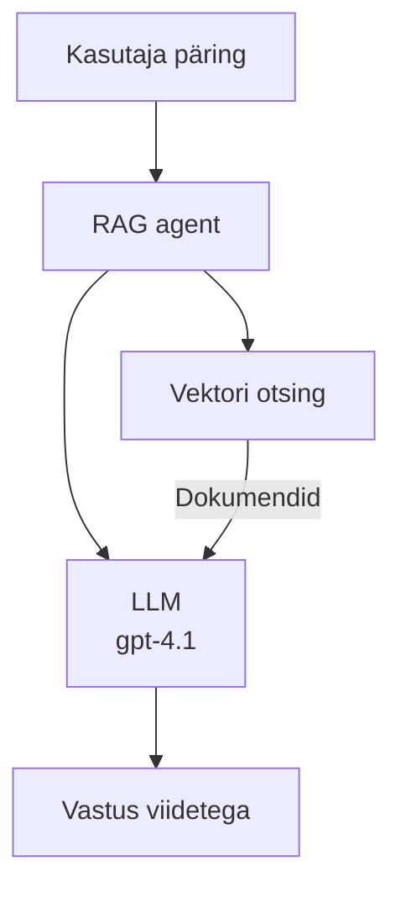
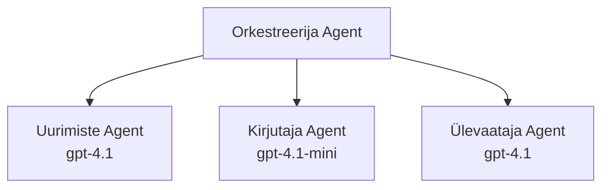

# AI-agendid Azure Developer CLI abil

**Peatüki navigeerimine:**
- **📚 Kursuse avaleht**: [AZD algajatele](../../README.md)
- **📖 Käesolev peatükk**: Peatükk 2 - AI-esimene arendus
- **⬅️ Eelmine**: [Microsoft Foundry integratsioon](microsoft-foundry-integration.md)
- **➡️ Järgmine**: [AI mudelite kasutuselevõtt](ai-model-deployment.md)
- **🚀 Täiustatud**: [Mitme-agendi lahendused](../../examples/retail-scenario.md)

---

## Sissejuhatus

AI-agendid on autonoomsed programmid, mis suudavad tajuda oma keskkonda, teha otsuseid ja tegutseda kindlate eesmärkide saavutamiseks. Erinevalt lihtsatest juturobotitest, mis vastavad käsuridadele, suudavad agendid:

- **Kasutada tööriistu** – kutsuda API-sid, otsida andmebaase, käivitada koodi
- **Planeerida ja põhjendada** – jagada keerukaid ülesandeid sammudeks
- **Õppida kontekstist** – säilitada mälu ja kohandada käitumist
- **Koostööd teha** – töötada koos teiste agentidega (mitme-agendi süsteemid)

See juhend näitab, kuidas juurutada AI-agente Azure’is, kasutades Azure Developer CLI-d (azd).

## Õpieesmärgid

Selle juhendi läbimisel:
- Mõistate, mis on AI-agendid ja kuidas nad erinevad juturobotitest
- Juurutate enamasti valmis AI-agendi malle AZD abil
- Konfigureerite Foundry agente kohandatud agentide jaoks
- Rakendate põhilisi agendi mustreid (tööriistade kasutamine, RAG, mitme-agendi süsteem)
- Jälgite ja silute juurutatud agente

## Õpitulemused

Juhendi lõppedes suudate:
- Juurutada AI-agendi rakendusi Azure’i ühe käsuga
- Konfigureerida agendi tööriistu ja võimeid
- Rakendada otsingupõhist generatsiooni (RAG) agentidega
- Kujundada mitme-agendi arhitektuure keerukate töövoogude jaoks
- Lahendada tavalisi agentide juurutamise probleeme

---

## 🤖 Mis teeb agendi erinevaks juturobotist?

| Funktsioon | Juturobot | AI-agents |
|------------|-----------|-----------|
| **Käitumine** | Vastab päringutele | Võtab autonoomseid toiminguid |
| **Tööriistad** | Puuduvad | Suudab kutsuda API-sid, otsida, käivitada koodi |
| **Mälu** | Ainult seansipõhine | Püsiv mälu mitme seansi vahel |
| **Planeerimine** | Ühe vastusega | Mitme sammu pikkune põhjendus |
| **Koostöö** | Üks isik | Suudab töötada koos teiste agentidega |

### Lihtne võrdlus

- **Juturobot** = Abivalmis inimene infolaudas küsimustele vastamas
- **AI-agent** = Isiklik assistent, kes võib teha kõnesid, broneerida kohtumisi ja täita ülesandeid teie eest

---

## 🚀 Kiirstart: Juhtige oma esimene agent

### Variant 1: Foundry agentide mall (Soovitatav)

```bash
# Algatage AI agentide mall
azd init --template get-started-with-ai-agents

# Paigaldage Azure'i
azd up
```

**Mida juurutatakse:**
- ✅ Foundry agentid
- ✅ Microsoft Foundry mudelid (gpt-4.1)
- ✅ Azure AI Search (RAG jaoks)
- ✅ Azure Container Apps (veebiliides)
- ✅ Application Insights (jälgimine)

**Aeg:** ~15-20 minutit  
**Kulu:** ~$100-150/kuus (arendus)

### Variant 2: OpenAI agent Promptyga

```bash
# Algatage Prompty-põhine agendi mall
azd init --template agent-openai-python-prompty

# Paigalda Azure'i
azd up
```

**Mida juurutatakse:**
- ✅ Azure Functions (serverita agentide täitmine)
- ✅ Microsoft Foundry mudelid
- ✅ Prompty konfiguratsioonifailid
- ✅ Näidistekst agentide rakendamiseks

**Aeg:** ~10-15 minutit  
**Kulu:** ~$50-100/kuus (arendus)

### Variant 3: RAG juturobot

```bash
# Algata RAG vestlusmall
azd init --template azure-search-openai-demo

# Paigalda Azure‘i keskkonda
azd up
```

**Mida juurutatakse:**
- ✅ Microsoft Foundry mudelid
- ✅ Azure AI Search koos näidisandmetega
- ✅ Dokumentide töötlemise töövoog
- ✅ Jutuliides allikaviidetega

**Aeg:** ~15-25 minutit  
**Kulu:** ~$80-150/kuus (arendus)

### Variant 4: AZD AI Agent Init (Manifesti-põhine)

Kui teil on agendi manifestifail, saate kasutada käsku `azd ai`, et otse luua Foundry Agent Service projekt:

```bash
# Paigalda tehisintellekti agentide laiendus
azd extension install azure.ai.agents

# Algata agentide manifestist
azd ai agent init -m agent-manifest.yaml

# Kasuta Azure'i keskkonda
azd up
```

**Millal kasutada `azd ai agent init` vs `azd init --template`:**

| Lähenemine | Sobib kõige paremini | Kuidas töötab |
|------------|---------------------|---------------|
| `azd init --template` | Töötava näidisarenduse alustamiseks | Kopeerib terve malli repositooriumi koos koodi ja infrastruktuuriga |
| `azd ai agent init -m` | Oma agendi manifestist ehitamiseks | Korrastab projekti struktuuri agenti definitsiooni põhjal |

> **Näpunäide:** Kasutage `azd init --template`, kui õpite (üleval Variandid 1–3). Kasutage `azd ai agent init` tootmisagentide ehitamiseks oma manifestidega. Täielik viide: [AZD AI CLI käsud](../chapter-08-production/production-ai-practices.md#azd-ai-cli-commands-and-extensions).

---

## 🏗️ Agendi arhitektuuri mustrid

### Muster 1: Üksagent tööriistadega

Lihtsaim agendi muster – üks agent, kes suudab kasutada mitu tööriista.


**Sobib:**
- Klienditoe robotid
- Uurimisassistendid
- Andmeanalüüsi agendid

**AZD mall:** `azure-search-openai-demo`

### Muster 2: RAG agent (otsingupõhine generatsioon)

Agent, kes otsib enne vastuste koostamist asjakohaseid dokumente.


**Sobib:**
- Ettevõtte teadmusbaasid
- Dokumendipõhised Q&A süsteemid
- Vastavus- ja õigusuurimine

**AZD mall:** `azure-search-openai-demo`

### Muster 3: Mitme-agendi süsteem

Mitmed spetsialiseerunud agendid, kes töötavad koos keeruliste ülesannete kallal.


**Sobib:**
- Keerukate sisu loomine
- Mitme sammu pikkused töövood
- Erinevate spetsialiseerumistega ülesanded

**Õpi rohkem:** [Mitme-agendi koordineerimise mustrid](../chapter-06-pre-deployment/coordination-patterns.md)

---

## ⚙️ Agentide tööriistade konfigureerimine

Agendid muutuvad võimsaks, kui nad suudavad tööriistu kasutada. Siin on juhised levinumate tööriistade seadistamiseks:

### Tööriistade seadistamine Foundry agentides

```python
# agent_config.py
from azure.ai.projects import AIProjectClient
from azure.ai.projects.models import FunctionTool, CodeInterpreterTool

# Määra kohandatud tööriistad
search_tool = FunctionTool(
    name="search_knowledge_base",
    description="Search the company knowledge base for relevant documents",
    parameters={
        "type": "object",
        "properties": {
            "query": {
                "type": "string",
                "description": "The search query"
            }
        },
        "required": ["query"]
    }
)

# Loo agent tööriistadega
agent = project_client.agents.create_agent(
    model="gpt-4.1",
    name="Support Agent",
    instructions="You are a helpful support agent. Use the search tool to find relevant information.",
    tools=[search_tool, CodeInterpreterTool()]
)
```

### Keskkonna seadistamine

```bash
# Määra agendi-spetsiifilised keskkonnamuutujad
azd env set AZURE_OPENAI_MODEL "gpt-4.1"
azd env set AGENT_INSTRUCTIONS "You are a helpful assistant..."
azd env set ENABLE_CODE_INTERPRETER "true"
azd env set ENABLE_FILE_SEARCH "true"

# Käivita uuendatud konfiguratsiooniga deployment
azd deploy
```

---

## 📊 Agentide jälgimine

### Application Insights integratsioon

Kõik AZD agendi mallid sisaldavad Application Insights jälgimist:

```bash
# Ava jälgimise armatuurlaud
azd monitor --overview

# Vaata reaalajas logisid
azd monitor --logs

# Vaata reaalajas mõõdikuid
azd monitor --live
```

### Olulised mõõdikud jälgimiseks

| Mõõdik | Kirjeldus | Sihtväärtus |
|--------|-----------|-------------|
| Vastuse latentsus | Vastuse genereerimise aeg | < 5 sekundit |
| Sümbolite kasutus | Sümbolite arv päringu kohta | Kulude jälgimiseks |
| Tööriistakutsete edukuse määr | Eduka tööriistakutse protsent | > 95% |
| Viga määr | Ebaõnnestunud agendi päringud | < 1% |
| Kasutajate rahulolu | Tagasiside skoorid | > 4.0/5.0 |

### Kohandatud logimine agentidele

```python
import os
from azure.monitor.opentelemetry import configure_azure_monitor
from opentelemetry import trace

# Konfigureeri Azure Monitor OpenTelemetry abil
configure_azure_monitor(
    connection_string=os.environ["APPLICATIONINSIGHTS_CONNECTION_STRING"]
)

tracer = trace.get_tracer(__name__)

def log_agent_interaction(user_query, agent_response, tools_used, latency_ms):
    with tracer.start_as_current_span("agent_interaction") as span:
        span.set_attributes({
            "user_query": user_query,
            "response_length": len(agent_response),
            "tools_used": tools_used,
            "latency_ms": latency_ms
        })
```

> **Märkus:** Paigaldage vajalikud paketid: `pip install azure-monitor-opentelemetry opentelemetry`

---

## 💰 Kuluarvestus

### Hinnangulised kuukulud mustrite kaupa

| Muster | Arenduskeskkond | Tootmine |
|--------|------------------|----------|
| Üksagent | $50-100 | $200-500 |
| RAG agent | $80-150 | $300-800 |
| Mitme-agent (2-3 agenti) | $150-300 | $500-1,500 |
| Ettevõtte mitme-agent | $300-500 | $1,500-5,000+ |

### Kulu optimeerimise näpunäited

1. **Kasuta gpt-4.1-mini lihtsate ülesannete jaoks**
   ```bash
   azd env set AZURE_OPENAI_MODEL "gpt-4.1-mini"
   ```

2. **Rakenda vahemälu korduvatele päringutele**
   ```python
   from functools import lru_cache
   
   @lru_cache(maxsize=1000)
   def get_cached_response(query_hash):
       return agent.run(query_hash)
   ```

3. **Määra sümbolite limiidid ühe käivituse kohta**
   ```python
   # Määra max_completion_tokens agenti käivitades, mitte loomisel
   run = project_client.agents.create_run(
       thread_id=thread.id,
       agent_id=agent.id,
       max_completion_tokens=1000  # Piira vastuse pikkust
   )
   ```

4. **Mastaapige nullini, kui agent pole kasutuses**
   ```bash
   # konteineri rakendused skaleeruvad automaatselt nulli
   azd env set MIN_REPLICAS "0"
   ```

---

## 🔧 Agentide tõrkeotsing

### Levinumad probleemid ja lahendused

<details>
<summary><strong>❌ Agent ei vasta tööriista kutsetele</strong></summary>

```bash
# Kontrolli, kas tööriistad on korralikult registreeritud
azd show

# Kontrolli OpenAI juurutust
az cognitiveservices account deployment list \
  --name $AZURE_OPENAI_NAME \
  --resource-group $RG_NAME

# Kontrolli agendi logisid
azd monitor --logs
```

**Tavalised põhjused:**
- Tööriista funktsiooni signatuuri mittesobivus
- Puuduvad vajalikud load
- API lõpp-punkt pole kättesaadav
</details>

<details>
<summary><strong>❌ Kõrge latentsus agendi vastustes</strong></summary>

```bash
# Kontrolli rakenduse Insightsi kitsaskohti
azd monitor --live

# Kaalu kiirema mudeli kasutamist
azd env set AZURE_OPENAI_MODEL "gpt-4.1-mini"
azd deploy
```

**Optimeerimisnõuanded:**
- Kasuta voogedastusega vastuseid
- Rakenda vastuse vahemälu
- Vähenda konteksti akna suurust
</details>

<details>
<summary><strong>❌ Agent tagastab valesid või hallutsineerituid andmeid</strong></summary>

```python
# Paranda paremate süsteemi üleskutsetega
instructions = """
You are a helpful assistant. IMPORTANT:
- Only answer based on provided context
- If you don't know, say "I don't know"
- Always cite your sources
- Never make up information
"""

# Lisa taastekkimise võimalus põhendamiseks
agent = project_client.agents.create_agent(
    model="gpt-4.1",
    instructions=instructions,
    tools=[FileSearchTool()]  # Põhenda vastuseid dokumentides
)
```
</details>

<details>
<summary><strong>❌ Sümbolite limiidi ületamise vead</strong></summary>

```python
# Rakenda konteksti akna haldamist
def truncate_context(messages, max_tokens=8000, model="gpt-4.1"):
    """Keep only recent messages within token limit."""
    import tiktoken
    encoding = tiktoken.encoding_for_model(model)
    total_tokens = 0
    truncated = []
    
    for msg in reversed(messages):
        msg_tokens = len(encoding.encode(msg.content))
        if total_tokens + msg_tokens > max_tokens:
            break
        truncated.insert(0, msg)
        total_tokens += msg_tokens
    
    return truncated
```
</details>

---

## 🎓 Praktilised harjutused

### Harjutus 1: Lihtsa agendi juurutamine (20 minutit)

**Eesmärk:** Juurutada oma esimene AI agent AZD abil

```bash
# Samm 1: Algata mall
azd init --template get-started-with-ai-agents

# Samm 2: Logi sisse Azure'i
azd auth login

# Samm 3: Käivita juurutus
azd up

# Samm 4: Testi agenti
# Oodatav väljund pärast juurutust:
#   Juurutus lõpetatud!
#   Lõpp-punkt: https://<app-name>.<region>.azurecontainerapps.io
# Ava väljundis kuvatud URL ja proovi esitada küsimus

# Samm 5: Vaata jälgimist
azd monitor --overview

# Samm 6: Puhasta üles
azd down --force --purge
```

**Õnnestumise kriteeriumid:**
- [ ] Agent vastab küsimustele
- [ ] Juurdepääs jälgimisinfo paneelile käsuga `azd monitor`
- [ ] Ressursid puhastatakse edukalt

### Harjutus 2: Lisa kohandatud tööriist (30 minutit)

**Eesmärk:** Laiendada agenti kohandatud tööriistaga

1. Juuruta agendi mall:
   ```bash
   azd init --template get-started-with-ai-agents
   azd up
   ```
2. Loo uus tööriista funktsioon agendi koodis:
   ```python
   def get_weather(location: str) -> str:
       """Get current weather for a location."""
       # API kõne ilmaportaali poole
       return f"Weather in {location}: Sunny, 72°F"
   ```
3. Registreeri tööriist agendi juures:
   ```python
   from azure.ai.projects.models import FunctionTool

   weather_tool = FunctionTool(
       name="get_weather",
       description="Get current weather for a location",
       parameters={
           "type": "object",
           "properties": {
               "location": {"type": "string", "description": "City name"}
           },
           "required": ["location"]
       }
   )

   agent = project_client.agents.create_agent(
       model="gpt-4.1",
       name="Weather Agent",
       tools=[weather_tool]
   )
   ```
4. Juuruta uuesti ja testi:
   ```bash
   azd deploy
   # Küsige: „Milline on ilm Seattle'is?“
   # Oodatav: Agent kutsub välja get_weather("Seattle") ja tagastab ilmteabe
   ```

**Õnnestumise kriteeriumid:**
- [ ] Agent tunnistab ilmateemalisi päringuid
- [ ] Tööriist kutsutakse korrektselt
- [ ] Vastused sisaldavad ilmainfot

### Harjutus 3: Ehita RAG agent (45 minutit)

**Eesmärk:** Loo agent, mis vastab küsimustele sinu dokumentide põhjal

```bash
# Samm 1: RAG-malli juurutamine
azd init --template azure-search-openai-demo
azd up

# Samm 2: Laadige oma dokumendid üles
# Paigutage PDF/TXT failid kausta data/, seejärel käivitage:
python scripts/prepdocs.py

# Samm 3: Testige domeenispetsiifiliste küsimustega
# Avage veebirakenduse URL azd up väljundist
# Esitage küsimusi oma üleslaaditud dokumentide kohta
# Vastustes peaksid olema tsiteeringuviited nagu [doc.pdf]
```

**Õnnestumise kriteeriumid:**
- [ ] Agent vastab üleslaaditud dokumentidest
- [ ] Vastustes on viited allikatele
- [ ] Ei ole eksitavaid või valeinfot sisaldavaid vastuseid

---

## 📚 Järgmised sammud

Nüüd, kui mõistate AI-agente, uurige neid täiustatud teemasid:

| Teema | Kirjeldus | Link |
|-------|-----------|------|
| **Mitme-agendi süsteemid** | Ehita süsteeme, kus mitu agenti teevad koostööd | [Jaemüügi mitme-agenti näide](../../examples/retail-scenario.md) |
| **Koordineerimise mustrid** | Õpi orkestreerimise ja suhtlemise mustreid | [Koordineerimise mustrid](../chapter-06-pre-deployment/coordination-patterns.md) |
| **Tootmises kasutuselevõtt** | Ettevõttevalmidusega agentide juurutus | [Tootmises AI praktika](../chapter-08-production/production-ai-practices.md) |
| **Agendi hindamine** | Testi ja hinda agendi tulemuslikkust | [AI tõrkeotsing](../chapter-07-troubleshooting/ai-troubleshooting.md) |
| **AI töötoa labor** | Käed-külge lähenemine: tee oma AI lahendus AZD-valmis | [AI töötoa labor](ai-workshop-lab.md) |

---

## 📖 Täiendavad ressursid

### Ametlik dokumentatsioon
- [Azure AI Agendi teenus](https://learn.microsoft.com/azure/ai-services/agents/)
- [Azure AI Foundry Agent teenuse kiire algus](https://learn.microsoft.com/azure/ai-services/agents/quickstart)
- [Semantic Kernel agendi raamistik](https://learn.microsoft.com/semantic-kernel/)

### AZD mallid agentide jaoks
- [Alustamine AI agentidega](https://github.com/Azure-Samples/get-started-with-ai-agents)
- [Agent OpenAI Python Prompty](https://github.com/Azure-Samples/agent-openai-python-prompty)
- [Azure Search OpenAI demo](https://github.com/Azure-Samples/azure-search-openai-demo)

### Ühiskonna ressursid
- [Awesome AZD – agendi mallid](https://azure.github.io/awesome-azd/?tags=ai-agents)
- [Azure AI Discord](https://discord.gg/microsoft-azure)
- [Microsoft Foundry Discord](https://discord.gg/nTYy5BXMWG)

### Agendi oskused sinu redaktori jaoks
- [**Microsoft Azure agendi oskused**](https://skills.sh/microsoft/github-copilot-for-azure) – Paigalda korduvkasutatavad AI agendi oskused Azure arenduseks GitHub Copilot, Cursor või mõne toetatud agendi jaoks. Sisaldab oskusi [Azure AI](https://skills.sh/microsoft/github-copilot-for-azure/azure-ai), [Microsoft Foundry](https://skills.sh/microsoft/github-copilot-for-azure/microsoft-foundry), [juurutus](https://skills.sh/microsoft/github-copilot-for-azure/azure-deploy) ja [diagnostika](https://skills.sh/microsoft/github-copilot-for-azure/azure-diagnostics) jaoks:
  ```bash
  npx skills add microsoft/github-copilot-for-azure
  ```

---

**Navigeerimine**
- **Eelmine õppetund**: [Microsoft Foundry integratsioon](microsoft-foundry-integration.md)
- **Järgmine õppetund**: [AI mudelite kasutuselevõtt](ai-model-deployment.md)

---

<!-- CO-OP TRANSLATOR DISCLAIMER START -->
**Vastutusest loobumine**:  
See dokument on tõlgitud AI tõlketeenuse [Co-op Translator](https://github.com/Azure/co-op-translator) abil. Kuigi me püüame täpsust, tuleb arvestada, et automatiseeritud tõlked võivad sisaldada vigu või ebatäpsusi. Originaaldokument oma emakeeles tuleks pidada autoriteetseks allikaks. Kriitilise teabe puhul soovitatakse kasutada professionaalset inimtõlget. Me ei vastuta selle tõlke kasutamisest tingitud arusaamatuste ega valesti mõistmiste eest.
<!-- CO-OP TRANSLATOR DISCLAIMER END -->