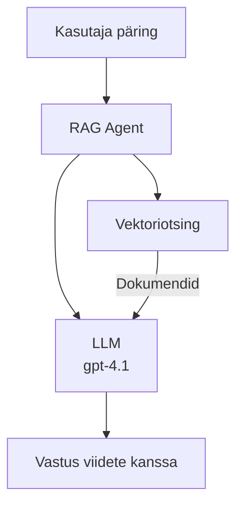
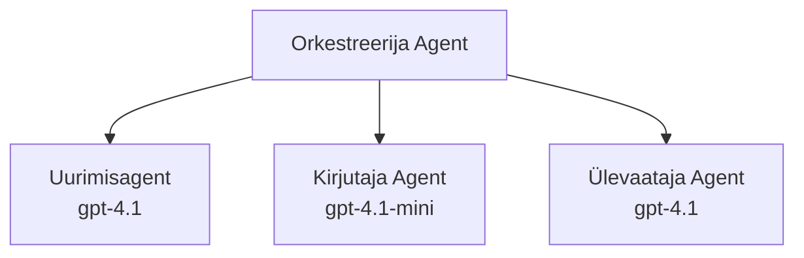

# Tehisintellekti agendid Azure Developer CLI abil

**Peatüki navigeerimine:**
- **📚 Kursuse avaleht**: [AZD algajatele](../../README.md)
- **📖 Praegune peatükk**: Peatükk 2 - AI-esmane arendus
- **⬅️ Eelmine**: [Microsoft Foundry integratsioon](microsoft-foundry-integration.md)
- **➡️ Järgmine**: [AI mudeli juurutamine](ai-model-deployment.md)
- **🚀 Edasijõudnutele**: [Mitme agendi lahendused](../../examples/retail-scenario.md)

---

## Sissejuhatus

Tehisintellekti agendid on autonoomsed programmid, mis suudavad tajuda oma keskkonda, teha otsuseid ja võtta samme konkreetsete eesmärkide saavutamiseks. Erinevalt lihtsatest vestlusrobotitest, mis vastavad ainult sisenditele, suudavad agendid:

- **Kasutada tööriistu** - Kutsub API-sid, otsib andmebaasidest, käivitab koodi
- **Planeerida ja arutleda** - Jagada keerukaid ülesandeid sammudeks
- **Õppida kontekstist** - Säilitada mälu ja kohandada käitumist
- **Koostööd teha** - Töö teha teiste agentidega (mitme agendi süsteemid)

See juhend näitab, kuidas juurutada AI agente Azure’i kasutades Azure Developer CLI-d (azd).

> **Kinnituse märkus (2026-03-25):** Käesolevat juhendit on testitud `azd` `1.23.12` ja `azure.ai.agents` `0.1.18-preview` versioonidega. `azd ai` kasutuskogemus on endiselt eelvaatefaasis, nii et kui sinu installitud lipud erinevad, vaata laienduse abi.

## Õpieesmärgid

Selle juhendi läbimisel:
- Mõistad, mis on AI agendid ja kuidas nad erinevad vestlusrobotitest
- Juurutad eelhoonestatud AI agendi malle AZD abil
- Konfigureerid Foundry agendid kohandatud agentide jaoks
- Rakendad põhilisi agendi mustreid (tööriistad, RAG, multi-agent)
- Jälgid ja silud juurutanud agente

## Õpitulemused

Pärast juhendi läbimist suudad:
- Ühe käsuga juurutada AI agentide rakendusi Azure’is
- Konfigureerida agendi tööriistu ja võimeid
- Rakendada nendega päringu-põhist genereerimist (RAG)
- Disainida mitme agendi arhitektuure keerukate töövoogude jaoks
- Lahendada sagedasi agentide juurutamise probleeme

---

## 🤖 Mis teeb agendi erinevaks vestlusrobotist?

| Omadus | Vestlusrobot | AI agent |
|---------|--------------|----------|
| **Käitumine** | Vastab sisenditele | Võtab autonoomseid samme |
| **Tööriistad** | Puuduvad | Suudab kutsuda API-sid, otsida, käivitada koodi |
| **Mälu** | Ainult sessioonipõhine | Püsiv mälu sessioonide vahel |
| **Planeerimine** | Ühekordne vastus | Mitmesammuline arutlemine |
| **Koostöö** | Üksik üksus | Saab töötada teiste agentidega |

### Lihtne analoogia

- **Vestlusrobot** = Abivalmis inimene teabekeskustes, kes vastab küsimustele
- **AI agent** = Isiklik assistent, kes saab teha kõnesid, broneerida kohtumisi ja täita ülesandeid sinu eest

---

## 🚀 Kiire algus: juuruta oma esimene agent

### Variant 1: Foundry agentide mall (soovitatav)

```bash
# Initsialiseeri tehisintellekti agendide mall
azd init --template get-started-with-ai-agents

# Paiguta Azure'i
azd up
```

**Mis juurutatakse:**
- ✅ Foundry agendid
- ✅ Microsoft Foundry mudelid (gpt-4.1)
- ✅ Azure AI otsing (RAG jaoks)
- ✅ Azure Container Apps (veebi liides)
- ✅ Application Insights (jälgimine)

**Aeg:** ~15-20 minutit  
**Kulu:** ~$100-150 kuus (arendus)

### Variant 2: OpenAI agent Promptyga

```bash
# Algatage Prompty-põhine agendi mall
azd init --template agent-openai-python-prompty

# Paigaldage Azure'i
azd up
```

**Mis juurutatakse:**
- ✅ Azure Functions (serverita agentide täideviimine)
- ✅ Microsoft Foundry mudelid
- ✅ Prompty konfiguratsioonifailid
- ✅ Näidisagendi implementeerimine

**Aeg:** ~10-15 minutit  
**Kulu:** ~$50-100 kuus (arendus)

### Variant 3: RAG vestlusagent

```bash
# Initsialiseeri RAG vestluse mall
azd init --template azure-search-openai-demo

# Paiguta Azure'i
azd up
```

**Mis juurutatakse:**
- ✅ Microsoft Foundry mudelid
- ✅ Azure AI otsing näidisandmetega
- ✅ Dokumentide töötlemise torujuhe
- ✅ Vestlusliides viidetega

**Aeg:** ~15-25 minutit  
**Kulu:** ~$80-150 kuus (arendus)

### Variant 4: AZD AI agent algatamine (manifest- või malli-põhine eelvaade)

Kui sul on agendi manifestifail, saad kasutada käsku `azd ai`, et otse Foundry agentide teenuse projekti tekitada. Viimased eelvaateversioonid on lisanud ka mallipõhise initsialiseerimise toe, nii et täpne juhiste voog võib veidi erineda sõltuvalt sinu installitud laiendusversioonist.

```bash
# Paigalda tehisintellekti agendide laiendus
azd extension install azure.ai.agents

# Valikuline: kontrolli paigaldatud eelvaate versiooni
azd extension show azure.ai.agents

# Algatamine agendi manifestist
azd ai agent init -m agent-manifest.yaml

# Paigalda Azure'i
azd up
```

**Millal kasutada `azd ai agent init` vs `azd init --template`:**

| Lähenemine | Sobib | Kuidas töötab |
|------------|--------|--------------|
| `azd init --template` | Töötava näidrakenduse baasil alustamiseks | Kloonib terve malli repository koos koodi ja infrastruktuuriga |
| `azd ai agent init -m` | Oma agendi manifestist alustamiseks | Teeb projekti struktuuri vastavalt sinu agendi definitsioonile |

> **Näpunäide:** Kasuta `azd init --template` õppetööks (üleval variandid 1-3). Kasuta `azd ai agent init`, kui ehitad tootmisagente oma manifestidega. Vaata [AZD AI CLI käsud](../chapter-08-production/production-ai-practices.md#azd-ai-cli-commands-and-extensions) täielikku viidet.

---

## 🏗️ Agentide arhitektuuri mustrid

### Muster 1: Ühe agendi tööriistadega

Lihtsaim agendi muster - üks agent, kes saab kasutada mitut tööriista.


**Sobib:**
- Klienditoe botid
- Uurimisabilised
- Andmete analüüsi agendid

**AZD mall:** `azure-search-openai-demo`

### Muster 2: RAG agent (päringpõhine genereerimine)

Agent, kes otsib asjakohaseid dokumente enne vastuste genereerimist.


**Sobib:**
- Ettevõtte teadmistebaasid
- Dokumendipõhised küsimuste-vastuste süsteemid
- Vastavus- ja õiguslik uurimine

**AZD mall:** `azure-search-openai-demo`

### Muster 3: Mitme agendi süsteem

Mitu spetsialiseerunud agenti töötavad koos keerukate ülesannete kallal.


**Sobib:**
- Keeruka sisu loomine
- Mitmesammulised töövood
- Ülesanded, mis vajavad erinevaid teadmisi

**Lisateave:** [Mitme agendi koordineerimise mustrid](../chapter-06-pre-deployment/coordination-patterns.md)

---

## ⚙️ Agendi tööriistade seadistamine

Agendid muutuvad võimsaks, kui nad saavad kasutusele võtta tööriistu. Siin on, kuidas konfigureerida levinud tööriistu:

### Tööriista seadistamine Foundry agentides

```python
# agent_config.py
from azure.ai.projects import AIProjectClient
from azure.ai.projects.models import FunctionTool, CodeInterpreterTool

# Määratle kohandatud tööriistad
search_tool = FunctionTool(
    name="search_knowledge_base",
    description="Search the company knowledge base for relevant documents",
    parameters={
        "type": "object",
        "properties": {
            "query": {
                "type": "string",
                "description": "The search query"
            }
        },
        "required": ["query"]
    }
)

# Loo agent tööriistadega
agent = project_client.agents.create_agent(
    model="gpt-4.1",
    name="Support Agent",
    instructions="You are a helpful support agent. Use the search tool to find relevant information.",
    tools=[search_tool, CodeInterpreterTool()]
)
```

### Keskkonna seadistamine

```bash
# Määrake agendipõhised keskkonnamuutujad
azd env set AZURE_OPENAI_MODEL "gpt-4.1"
azd env set AGENT_INSTRUCTIONS "You are a helpful assistant..."
azd env set ENABLE_CODE_INTERPRETER "true"
azd env set ENABLE_FILE_SEARCH "true"

# Käivitage uuendatud konfiguratsiooniga
azd deploy
```

---

## 📊 Agenti jälgimine

### Application Insights integratsioon

Kõik AZD agentide mallid sisaldavad Application Insights jälgimist:

```bash
# Ava jälgimise armatuurlaud
azd monitor --overview

# Vaata reaalajas logisid
azd monitor --logs

# Vaata reaalajas mõõdikuid
azd monitor --live
```

### Olulised jälgitavad mõõdikud

| Mõõdik | Kirjeldus | Eesmärk |
|--------|------------|---------|
| Vastuse latentsus | Aeg vastuse genereerimiseks | < 5 sekundit |
| Tokenite kasutus | Tokenid päringu kohta | Jälgi kulusid |
| Tööriistakutsete edenemisprotsent | Töötavate tööriistakutsete % | > 95% |
| Vigade protsent | Ebaõnnestunud agendi päringud | < 1% |
| Kasutajate rahulolu | Tagasiside skoorid | > 4.0/5.0 |

### Kohandatud logimine agentidele

```python
import os
from azure.monitor.opentelemetry import configure_azure_monitor
from opentelemetry import trace

# Konfigureeri Azure Monitor OpenTelemetryga
configure_azure_monitor(
    connection_string=os.environ["APPLICATIONINSIGHTS_CONNECTION_STRING"]
)

tracer = trace.get_tracer(__name__)

def log_agent_interaction(user_query, agent_response, tools_used, latency_ms):
    with tracer.start_as_current_span("agent_interaction") as span:
        span.set_attributes({
            "user_query": user_query,
            "response_length": len(agent_response),
            "tools_used": tools_used,
            "latency_ms": latency_ms
        })
```

> **Märkus:** Paigalda vajalikud paketid: `pip install azure-monitor-opentelemetry opentelemetry`

---

## 💰 Kulu kaalutlused

### Hinnangulised kuukulud mustrite järgi

| Muster | Arenduskeskkond | Tootmine |
|---------|-----------------|----------|
| Üks agent | $50-100 | $200-500 |
| RAG agent | $80-150 | $300-800 |
| Mitme agendi süsteem (2-3 agenti) | $150-300 | $500-1,500 |
| Ettevõtte mitme agendi süsteem | $300-500 | $1,500-5,000+ |

### Kulu optimeerimise näpunäited

1. **Kasuta gpt-4.1-mini lihtsateks ülesanneteks**
   ```bash
   azd env set AZURE_OPENAI_MODEL "gpt-4.1-mini"
   ```

2. **Rakenda vahemällu salvestust korduvate päringute jaoks**
   ```python
   from functools import lru_cache
   
   @lru_cache(maxsize=1000)
   def get_cached_response(query_hash):
       return agent.run(query_hash)
   ```

3. **Sea tokenite limiidid ühe jooksu kohta**
   ```python
   # Määra max_completion_tokens agendi käivitamisel, mitte loomise ajal
   run = project_client.agents.create_run(
       thread_id=thread.id,
       agent_id=agent.id,
       max_completion_tokens=1000  # Piira vastuse pikkust
   )
   ```

4. **Säästa kulusid, lülitades skaleerimise nulli mitte kasutamise ajal**
   ```bash
   # Container Apps skaleeruvad automaatselt nullini
   azd env set MIN_REPLICAS "0"
   ```

---

## 🔧 Agendi tõrkeotsing

### Levinumad probleemid ja lahendused

<details>
<summary><strong>❌ Agent ei vasta tööriistakutsetele</strong></summary>

```bash
# Kontrolli, kas tööriistad on korralikult registreeritud
azd show

# Kontrolli OpenAI juurutust
az cognitiveservices account deployment list \
  --name $AZURE_OPENAI_NAME \
  --resource-group $RG_NAME

# Kontrolli agendi logisid
azd monitor --logs
```

**Levinumad põhjused:**
- Tööriista funktsiooni signatuuri mittevastavus
- Puuduvad vajalikud õigused
- API lõpp-punkt pole ligipääsetav
</details>

<details>
<summary><strong>❌ Agentide vastuste kõrge latentsus</strong></summary>

```bash
# Kontrolli rakenduse Insightsi kitsaskohti
azd monitor --live

# Kaalu kiirrama mudeli kasutamist
azd env set AZURE_OPENAI_MODEL "gpt-4.1-mini"
azd deploy
```

**Optimeerimisnõuanded:**
- Kasuta voogesituse vastuseid
- Rakenda vastuse vahemällu salvestust
- Vähenda konteksti akna suurust
</details>

<details>
<summary><strong>❌ Agent tagastab vale või hallutsineeritud infot</strong></summary>

```python
# Paranda paremate süsteemipõhiste juhistega
instructions = """
You are a helpful assistant. IMPORTANT:
- Only answer based on provided context
- If you don't know, say "I don't know"
- Always cite your sources
- Never make up information
"""

# Lisa otsing kõrvalealusena
agent = project_client.agents.create_agent(
    model="gpt-4.1",
    instructions=instructions,
    tools=[FileSearchTool()]  # Seo vastused dokumentidega
)
```
</details>

<details>
<summary><strong>❌ Tokenite limiidi ületamise vead</strong></summary>

```python
# Rakenda kontekstiakna haldamine
def truncate_context(messages, max_tokens=8000, model="gpt-4.1"):
    """Keep only recent messages within token limit."""
    import tiktoken
    encoding = tiktoken.encoding_for_model(model)
    total_tokens = 0
    truncated = []
    
    for msg in reversed(messages):
        msg_tokens = len(encoding.encode(msg.content))
        if total_tokens + msg_tokens > max_tokens:
            break
        truncated.insert(0, msg)
        total_tokens += msg_tokens
    
    return truncated
```
</details>

---

## 🎓 Praktilised harjutused

### Harjutus 1: Põhilise agendi juurutamine (20 minutit)

**Eesmärk:** Juurutada oma esimene AI agent AZD abil

```bash
# Samm 1: Algata mall
azd init --template get-started-with-ai-agents

# Samm 2: Logi sisse Azure'i
azd auth login
# Kui töötad üle rentnike, lisa --tenant-id <tenant-id>

# Samm 3: Paigalda
azd up

# Samm 4: Testi agenti
# Oodatav väljund pärast paigaldamist:
#   Paigaldamine lõpetatud!
#   Lõpp-punkt: https://<app-name>.<region>.azurecontainerapps.io
# Ava väljundis kuvatud URL ja proovi esitada küsimus

# Samm 5: Vaata seiret
azd monitor --overview

# Samm 6: Puhasta üles
azd down --force --purge
```

**Õnnestumise kriteeriumid:**
- [ ] Agent vastab küsimustele
- [ ] Juurdepääs jälgimisarmatuurlaudadele `azd monitor` abil
- [ ] Ressursid puhastatakse edukalt

### Harjutus 2: Kohandatud tööriista lisamine (30 minutit)

**Eesmärk:** Laiendada agenti kohandatud tööriistaga

1. Juuruta agendi mall:
   ```bash
   azd init --template get-started-with-ai-agents
   azd up
   ```
2. Loo oma agendi koodi uus tööriista funktsioon:
   ```python
   def get_weather(location: str) -> str:
       """Get current weather for a location."""
       # API kõne ilmateenistusele
       return f"Weather in {location}: Sunny, 72°F"
   ```
3. Registreeri tööriist agendi juures:
   ```python
   from azure.ai.projects.models import FunctionTool

   weather_tool = FunctionTool(
       name="get_weather",
       description="Get current weather for a location",
       parameters={
           "type": "object",
           "properties": {
               "location": {"type": "string", "description": "City name"}
           },
           "required": ["location"]
       }
   )

   agent = project_client.agents.create_agent(
       model="gpt-4.1",
       name="Weather Agent",
       tools=[weather_tool]
   )
   ```
4. Juuruta uuesti ja testi:
   ```bash
   azd deploy
   # Küsi: "Milline ilm on Seattle'is?"
   # Oodatav: Agent kutsub funktsiooni get_weather("Seattle") ja tagastab ilmateabe
   ```

**Õnnestumise kriteeriumid:**
- [ ] Agent tunneb ära ilma-küsimused
- [ ] Tööriista kutsutakse korrektselt
- [ ] Vastus sisaldab ilmainfot

### Harjutus 3: RAG agendi loomine (45 minutit)

**Eesmärk:** Luua agent, kes vastab sinu dokumentidest tulevatele küsimustele

```bash
# Samm 1: Paigalda RAG malli
azd init --template azure-search-openai-demo
azd up

# Samm 2: Laadi üles oma dokumendid
# Paiguta PDF/TXT failid kataloogi data/, seejärel käivita:
python scripts/prepdocs.py

# Samm 3: Testi domeenispetsiifiliste küsimustega
# Ava veebirakenduse URL azd up väljundist
# Küsige küsimusi oma üles laaditud dokumentide kohta
# Vastused peaksid sisaldama viiteid nagu [doc.pdf]
```

**Õnnestumise kriteeriumid:**
- [ ] Agent vastab üleslaetud dokumentide põhjal
- [ ] Vastused sisaldavad allika viiteid
- [ ] Väljaspoole ulatuse küsimustele ei teki hallutsinatsioone

---

## 📚 Edasised sammud

Nüüd kui mõistad AI agente, avasta neid edasijõudnute teemasid:

| Teema | Kirjeldus | Link |
|-------|------------|-------|
| **Mitme agendi süsteemid** | Ehita süsteeme, kus mitu agenti teevad koostööd | [Jaemüügi mitme agendi näide](../../examples/retail-scenario.md) |
| **Koordineerimismustrid** | Õpi orkestreerimise ja suhtlusmustreid | [Koordineerimismustrid](../chapter-06-pre-deployment/coordination-patterns.md) |
| **Tootmisse juurutamine** | Ettevõttevalmis agentide juurutamine | [Tootmise AI praktika](../chapter-08-production/production-ai-practices.md) |
| **Agendi hindamine** | Testi ja hinda agendi jõudlust | [AI tõrkeotsing](../chapter-07-troubleshooting/ai-troubleshooting.md) |
| **AI töötoa labor** | Praktiline: tee oma AI lahendus AZD-valmis | [AI töötoa labor](ai-workshop-lab.md) |

---

## 📖 Täiendavad ressursid

### Ametlik dokumentatsioon
- [Azure AI agentide teenus](https://learn.microsoft.com/azure/ai-services/agents/)
- [Azure AI Foundry agendi teenuse kiire algus](https://learn.microsoft.com/azure/ai-services/agents/quickstart)
- [Semantic Kernel agendi raamistik](https://learn.microsoft.com/semantic-kernel/)

### AZD mallid agentidele
- [Alusta AI agentidega](https://github.com/Azure-Samples/get-started-with-ai-agents)
- [Agent OpenAI Python Prompty](https://github.com/Azure-Samples/agent-openai-python-prompty)
- [Azure Search OpenAI Demo](https://github.com/Azure-Samples/azure-search-openai-demo)

### Kogukonna ressursid
- [Awesome AZD - agendi mallid](https://azure.github.io/awesome-azd/?tags=ai-agents)
- [Azure AI Discord](https://discord.gg/microsoft-azure)
- [Microsoft Foundry Discord](https://discord.gg/nTYy5BXMWG)

### Agendi oskused sinu redaktorile
- [**Microsoft Azure Agent Skills**](https://skills.sh/microsoft/github-copilot-for-azure) - Paigalda korduvkasutatavad AI agendi oskused Azure arenduseks GitHub Copilot, Cursor või mis iganes toetatud agendi seadmetesse. Sisaldab oskusi [Azure AI](https://skills.sh/microsoft/github-copilot-for-azure/azure-ai), [Microsoft Foundry](https://skills.sh/microsoft/github-copilot-for-azure/microsoft-foundry), [juurutamise](https://skills.sh/microsoft/github-copilot-for-azure/azure-deploy) ja [diagnoosimise](https://skills.sh/microsoft/github-copilot-for-azure/azure-diagnostics) jaoks:
  ```bash
  npx skills add microsoft/github-copilot-for-azure
  ```

---

**Navigeerimine**
- **Eelmine õppetund**: [Microsoft Foundry integratsioon](microsoft-foundry-integration.md)
- **Järgmine õppetund**: [AI mudeli juurutamine](ai-model-deployment.md)

---

<!-- CO-OP TRANSLATOR DISCLAIMER START -->
**Vastutusest loobumine**:  
See dokument on tõlgitud tehisintellekti tõlketeenuse [Co-op Translator](https://github.com/Azure/co-op-translator) abil. Kuigi püüdleme täpsuse poole, tuleb arvestada, et automatiseeritud tõlked võivad sisaldada vigu või ebatäpsusi. Originaaldokument selle emakeeles tuleks pidada autoriteetseks allikaks. Kõrgtähtsusega teabe puhul soovitatakse professionaalset inimtõlget. Me ei vastuta selle tõlke kasutamisest tulenevate arusaamatuste või valesti mõistmiste eest.
<!-- CO-OP TRANSLATOR DISCLAIMER END -->