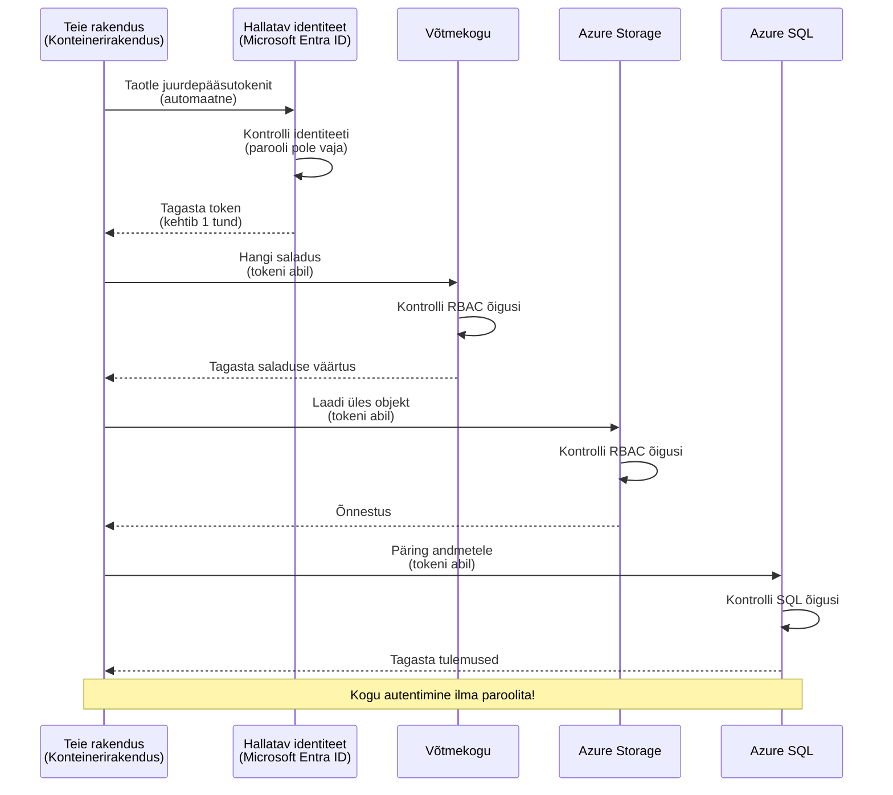
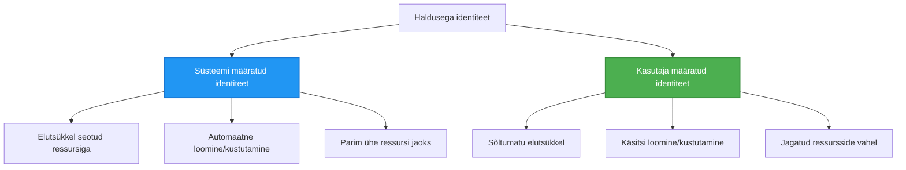

# Autentimismustrid ja hallatud identiteet

⏱️ **Hinnanguline aeg**: 45-60 minutit | 💰 **Kulu mõju**: Tasuta (ilma täiendavate tasudeta) | ⭐ **Keerukus**: Kesktase

**📚 Õppeteek:**
- ← Eelmine: [Konfiguratsiooni haldamine](configuration.md) - keskkonnamuutujate ja saladuste haldamine
- 🎯 **Oled siin**: Autentimine & turvalisus (hallatud identiteet, Key Vault, turvalised mustrid)
- → Järgmine: [Esimene projekt](first-project.md) - Ehita oma esimene AZD rakendus
- 🏠 [Kursuse avaleht](../../README.md)

---

## Mida sa õpid

Selle õppetunni läbimisega:
- Mõistad Azure autentimismustreid (võtmed, ühendusstringid, hallatud identiteet)
- Rakendad **hallatud identiteeti** paroolivabaks autentimiseks
- Kaitsed saladusi **Azure Key Vault** integratsiooni abil
- Konfigureerid **rollipõhist juurdepääsu kontrolli (RBAC)** AZD juurutuste jaoks
- Rakendad turvalisuse parimaid tavasid Container Apps ja Azure teenustes
- Teed ülemineku võtmepõhiselt identiteedipõhisele autentimisele

## Miks hallatud identiteet on oluline

### Probleem: Traditsiooniline autentimine

**Enne hallatud identiteeti:**
```javascript
// ❌ TURVARISK: Koodis kõvakodeeritud saladused
const connectionString = "Server=mydb.database.windows.net;User=admin;Password=P@ssw0rd123";
const storageKey = "xK7mN9pQ2wR5tY8uI0oP3aS6dF1gH4jK...";
const cosmosKey = "C2x7B9n4M1p8Q5w3E6r0T2y5U8i1O4p7...";
```

**Probleemid:**
- 🔴 **Avalikustatud saladused** koodis, konfiguratsioonifailides, keskkonnamuutujates
- 🔴 **Mandaatide vahetus** nõuab koodi muutmist ja taaskäivitus
- 🔴 **Auditi õudusunenäod** - kes, mida ja millal kasutas?
- 🔴 **Levinuš** - saladused hajutatud mitmesse süsteemi
- 🔴 **Vastavusriskid** - läbi kukutakse turvaaudititel

### Lahendus: Hallatud identiteet

**Pärast hallatud identiteeti:**
```javascript
// ✅ TURVALINE: Koodis pole saladusi
const credential = new DefaultAzureCredential();
const client = new BlobServiceClient(
  "https://mystorageaccount.blob.core.windows.net",
  credential  // Azure haldab autentimist automaatselt
);
```

**Eelised:**
- ✅ **Null saladusi** koodis või konfiguratsioonis
- ✅ **Automaatne vahetus** - Azure haldab seda
- ✅ **Täielik auditeerimisjälg** Microsoft Entra ID logides
- ✅ **Keskne turvalisus** - halda Azure portaalis
- ✅ **Vastavus valmis** - vastab turvastandarditele

**Analüüs:** Traditsiooniline autentimine on nagu kanda mitut füüsilist võtit eri ustele. Hallatud identiteet on nagu turvakaart, mis automaatselt lubab juurdepääsu sõltuvalt sinu identiteedist — võtit pole vaja kaotada, kopeerida ega vahetada.

---

## Arhitektuuri ülevaade

### Autentimise voog hallatud identiteediga



### Hallatud identiteetide tüübid



| Omadus | Süsteemi määratud | Kasutaja määratud |
|---------|----------------|---------------|
| **Elutsükkel** | Ressursiga seotud | Sõltumatu |
| **Loomine** | Automaatne ressursiga | Käsitsi loomine |
| **Kustutamine** | Kustutatakse koos ressursiga | Püsib ka pärast ressursi kustutamist |
| **Jagamine** | Ainult üks ressurss | Mitmele ressursile |
| **Kasutusjuhtum** | Lihtsad stsenaariumid | Komplekssemad mitmeressursilised stsenaariumid |
| **AZD vaikimisi** | ✅ Soovitatud | Valikuline |

---

## Eeltingimused

### Nõutavad tööriistad

Neid peaks sul olema juba paigaldatud eelmistest õppetundidest:

```bash
# Kontrolli Azure Developer CLI-d
azd version
# ✅ Oodatud: azd versioon 1.0.0 või uuem

# Kontrolli Azure CLI-d
az --version
# ✅ Oodatud: azure-cli 2.50.0 või uuem
```

### Azure nõuded

- Aktiivne Azure tellimus
- Õigused:
  - Hallatud identiteetide loomine
  - RBAC rollide määramine
  - Key Vault ressursside loomine
  - Container Apps juurutamine

### Teadmiste eeldused

Pead olema lõpetanud:
- [Paigaldusjuhend](installation.md) - AZD seadistus
- [AZD põhialused](azd-basics.md) - Põhikontseptsioonid
- [Konfiguratsiooni haldamine](configuration.md) - Keskkonnamuutujad

---

## Õppetund 1: Autentimismustrite mõistmine

### Muster 1: Ühendusstringid (pärand - väldi)

**Kuidas see toimib:**
```bash
# Ühendusstring sisaldab mandaate
STORAGE_CONNECTION_STRING="DefaultEndpointsProtocol=https;AccountName=myaccount;AccountKey=xK7mN9pQ2wR5..."
COSMOS_CONNECTION_STRING="AccountEndpoint=https://myaccount.documents.azure.com:443/;AccountKey=C2x7..."
SQL_CONNECTION_STRING="Server=myserver.database.windows.net;User=admin;Password=P@ssw0rd..."
```

**Probleemid:**
- ❌ Saladused nähtavad keskkonnamuutujates
- ❌ Logitakse juurutussüsteemides
- ❌ Raske vahetada
- ❌ Puudub juurdepääsu auditeerimine

**Millal kasutada:** Ainult kohalikus arenduses, mitte kunagi tootmises.

---

### Muster 2: Key Vaulti viited (parem)

**Kuidas see toimib:**
```bicep
// Store secret in Key Vault
resource keyVault 'Microsoft.KeyVault/vaults@2023-02-01' = {
  name: 'mykv'
  properties: {
    enableRbacAuthorization: true
  }
}

// Reference in Container App
env: [
  {
    name: 'STORAGE_KEY'
    secretRef: 'storage-key'  // References Key Vault
  }
]
```

**Eelised:**
- ✅ Saladused salvestatud turvaliselt Key Vaultis
- ✅ Keskne saladuste haldus
- ✅ Vahetus ilma koodi muutmata

**Piirangud:**
- ⚠️ Endiselt kasutatakse võtmeid/paroolisid
- ⚠️ Peab haldama Key Vaulti juurdepääsu

**Millal kasutada:** Üleminekutapp ühendusstringidelt hallatud identiteedile.

---

### Muster 3: Hallatud identiteet (parim tava)

**Kuidas see toimib:**
```bicep
// Enable managed identity
resource containerApp 'Microsoft.App/containerApps@2023-05-01' = {
  name: 'myapp'
  identity: {
    type: 'SystemAssigned'  // Automatically creates identity
  }
}

// Grant permissions
resource roleAssignment 'Microsoft.Authorization/roleAssignments@2022-04-01' = {
  scope: storageAccount
  properties: {
    roleDefinitionId: storageBlobDataContributorRole
    principalId: containerApp.identity.principalId
  }
}
```

**Rakenduse kood:**
```javascript
// Salajasi pole vaja!
const { DefaultAzureCredential } = require('@azure/identity');
const { BlobServiceClient } = require('@azure/storage-blob');

const credential = new DefaultAzureCredential();
const blobServiceClient = new BlobServiceClient(
  'https://mystorageaccount.blob.core.windows.net',
  credential
);
```

**Eelised:**
- ✅ Null saladusi koodis/konfiguratsioonis
- ✅ Automaatne mandaatide vahetus
- ✅ Täielik auditeerimisjälg
- ✅ RBAC-põhised õigused
- ✅ Vastavus valmis

**Millal kasutada:** Alati tootmiserakendustes.

---

### Muster 4: Teenusepõhised volitused (CI/CD ja automatiseerimine)

Hallatud identiteet on kuldstandard *Azure sees töötavatele ressurssidele*. Aga mis saab neist, mis töötavad **Azure väljaspool** — näiteks CI/CD torujuhtmel build-agentil või süsteemi skriptil, mis ei saa interaktiivselt sisse logida? Selleks on olemas **teenuse põhiidentiteet**: mitte-inimlik identiteet oma mandaadiga, millega automatiseeritud protsess saab sisse logida.

**Kuidas see toimib:**

Loo teenusepõhine ID ressursigrupile (vähema õigusega):

```bash
az ad sp create-for-rbac \
  --name "myapp-cicd" \
  --role contributor \
  --scopes /subscriptions/<sub-id>/resourceGroups/<rg-name>
```

See prindib välja kliendi ID, kliendi saladuse ja rentniku ID. azd saab neid kasutada mitteinteraktiivselt:

```bash
azd auth login \
  --client-id "<appId>" \
  --client-secret "<password>" \
  --tenant-id "<tenant>"
```

**Eelista federatiivseid mandaate (OIDC) võtmete asemel.** Selle asemel, et hoida pikaajalist kliendi saladust, seadista federatiivne mandaat, nii et torujuhe vahetab lühikese eluajaga tokenit — pole saladust, mida lekkida või vahetada:

```bash
azd auth login \
  --client-id "<appId>" \
  --federated-credential-provider "github" \
  --tenant-id "<tenant>"
```

> `azd pipeline config` seab selle sinu eest automaatselt üles. Vaata CI/CD läbivaateid [8. peatükis](../chapter-08-production/production-ai-practices.md).

**Eelised:**
- ✅ Töötavad väljaspool Azure (build-agentid, kohapeal, teised pilved)
- ✅ Saab piirata ühe ressursigrupiga ja ühe rolliga
- ✅ Federatiivne (OIDC) variatsioon ei kasuta salvestatud saladust

**Kompromissid:**
- ⚠️ Saladusel põhinev variatsioon vajab hoolikat hoiustamist ja vahetust
- ⚠️ Lekkinud saladus annab kõik, mida SP suudab teha — hoia õigused kitsad

**Millal kasutada:** CI/CD torujuhtmed ja automatiseerimine, mis ei saa kasutada hallatud identiteeti. Eelista alati **federatiivset/OIDC** varianti tavapärasele kliendi saladusele ja kasuta hallatud identiteeti, kui töökoormus jookseb Azure sees.

**Mandaatide turvaline hoiustamine:**
- Ära kunagi salvesta saladusi lähtekoodi — kasuta oma torujuhtme saladuste hoidlat (GitHub Actions secrets, Azure DevOps muutuja grupid / Key Vault).
- Piira SP vähima vajalikku rolli ja ressursigrupiga.
- Sea aegumistähtaeg ja vaheta või kaota saladus täielikult OIDC-ga.

---

## Õppetund 2: Hallatud identiteedi rakendamine AZD-ga

### Samm-sammult juhis

Loome turvalise Container App-i, mis kasutab hallatud identiteeti Azure Storage ja Key Vaulti ligipääsuks.

### Projekti struktuur

```
secure-app/
├── azure.yaml                 # AZD configuration
├── infra/
│   ├── main.bicep            # Main infrastructure
│   ├── core/
│   │   ├── identity.bicep    # Managed identity setup
│   │   ├── keyvault.bicep    # Key Vault configuration
│   │   └── storage.bicep     # Storage with RBAC
│   └── app/
│       └── container-app.bicep
└── src/
    ├── app.js                # Application code
    ├── package.json
    └── Dockerfile
```

### 1. Konfigureeri AZD (azure.yaml)

```yaml
name: secure-app
metadata:
  template: secure-app@1.0.0

services:
  api:
    project: ./src
    language: js
    host: containerapp

# Enable managed identity (AZD handles this automatically)
```

### 2. Taristu: Luba hallatud identiteet

**Fail: `infra/main.bicep`**

```bicep
targetScope = 'subscription'

param environmentName string
param location string = 'eastus'

var tags = { 'azd-env-name': environmentName }

// Resource group
resource rg 'Microsoft.Resources/resourceGroups@2021-04-01' = {
  name: 'rg-${environmentName}'
  location: location
  tags: tags
}

// Storage Account
module storage './core/storage.bicep' = {
  name: 'storage'
  scope: rg
  params: {
    name: 'st${uniqueString(rg.id)}'
    location: location
    tags: tags
  }
}

// Key Vault
module keyVault './core/keyvault.bicep' = {
  name: 'keyvault'
  scope: rg
  params: {
    name: 'kv-${uniqueString(rg.id)}'
    location: location
    tags: tags
  }
}

// Container App with Managed Identity
module containerApp './app/container-app.bicep' = {
  name: 'container-app'
  scope: rg
  params: {
    name: 'ca-${environmentName}'
    location: location
    tags: tags
    storageAccountName: storage.outputs.name
    keyVaultName: keyVault.outputs.name
  }
}

// Grant Container App access to Storage
module storageRoleAssignment './core/role-assignment.bicep' = {
  name: 'storage-role'
  scope: rg
  params: {
    principalId: containerApp.outputs.identityPrincipalId
    roleDefinitionId: 'ba92f5b4-2d11-453d-a403-e96b0029c9fe'  // Storage Blob Data Contributor
    targetResourceId: storage.outputs.id
  }
}

// Grant Container App access to Key Vault
module kvRoleAssignment './core/role-assignment.bicep' = {
  name: 'kv-role'
  scope: rg
  params: {
    principalId: containerApp.outputs.identityPrincipalId
    roleDefinitionId: '4633458b-17de-408a-b874-0445c86b69e6'  // Key Vault Secrets User
    targetResourceId: keyVault.outputs.id
  }
}

// Outputs
output AZURE_STORAGE_ACCOUNT_NAME string = storage.outputs.name
output AZURE_KEY_VAULT_NAME string = keyVault.outputs.name
output APP_URL string = containerApp.outputs.url
```

### 3. Container App süsteemi määratud identiteediga

**Fail: `infra/app/container-app.bicep`**

```bicep
param name string
param location string
param tags object = {}
param storageAccountName string
param keyVaultName string

resource containerApp 'Microsoft.App/containerApps@2023-05-01' = {
  name: name
  location: location
  tags: tags
  identity: {
    type: 'SystemAssigned'  // 🔑 Enable managed identity
  }
  properties: {
    configuration: {
      ingress: {
        external: true
        targetPort: 3000
      }
    }
    template: {
      containers: [
        {
          name: 'api'
          image: 'myregistry.azurecr.io/api:latest'
          resources: {
            cpu: json('0.5')
            memory: '1Gi'
          }
          env: [
            {
              name: 'AZURE_STORAGE_ACCOUNT_NAME'
              value: storageAccountName
            }
            {
              name: 'AZURE_KEY_VAULT_NAME'
              value: keyVaultName
            }
            // 🔑 No secrets - managed identity handles authentication!
          ]
        }
      ]
    }
  }
}

// Output the identity for RBAC assignments
output identityPrincipalId string = containerApp.identity.principalId
output id string = containerApp.id
output url string = 'https://${containerApp.properties.configuration.ingress.fqdn}'
```

### 4. RBAC rolli määramise moodul

**Fail: `infra/core/role-assignment.bicep`**

```bicep
param principalId string
param roleDefinitionId string  // Azure built-in role ID
param targetResourceId string

resource roleAssignment 'Microsoft.Authorization/roleAssignments@2022-04-01' = {
  name: guid(principalId, roleDefinitionId, targetResourceId)
  scope: resourceId('Microsoft.Resources/resourceGroups', resourceGroup().name)
  properties: {
    roleDefinitionId: subscriptionResourceId('Microsoft.Authorization/roleDefinitions', roleDefinitionId)
    principalId: principalId
    principalType: 'ServicePrincipal'
  }
}

output id string = roleAssignment.id
```

### 5. Rakenduse kood hallatud identiteediga

**Fail: `src/app.js`**

```javascript
const express = require('express');
const { DefaultAzureCredential } = require('@azure/identity');
const { BlobServiceClient } = require('@azure/storage-blob');
const { SecretClient } = require('@azure/keyvault-secrets');

const app = express();
const PORT = process.env.PORT || 3000;

// 🔑 Initsialiseeri tõend (töötab automaatselt koos hallatud identiteediga)
const credential = new DefaultAzureCredential();

// Azure Storage seadistamine
const storageAccountName = process.env.AZURE_STORAGE_ACCOUNT_NAME;
const blobServiceClient = new BlobServiceClient(
  `https://${storageAccountName}.blob.core.windows.net`,
  credential  // Võtmeid pole vaja!
);

// Key Vaulti seadistamine
const keyVaultName = process.env.AZURE_KEY_VAULT_NAME;
const secretClient = new SecretClient(
  `https://${keyVaultName}.vault.azure.net`,
  credential  // Võtmeid pole vaja!
);

// Tervisekontroll
app.get('/health', (req, res) => {
  res.json({ status: 'healthy', authentication: 'managed-identity' });
});

// Lae fail üles blob-salvestusse
app.post('/upload', async (req, res) => {
  try {
    const containerClient = blobServiceClient.getContainerClient('uploads');
    await containerClient.createIfNotExists();
    
    const blobName = `file-${Date.now()}.txt`;
    const blockBlobClient = containerClient.getBlockBlobClient(blobName);
    
    await blockBlobClient.upload('Hello from managed identity!', 30);
    
    res.json({
      success: true,
      blobName: blobName,
      message: 'File uploaded using managed identity!'
    });
  } catch (error) {
    console.error('Upload error:', error);
    res.status(500).json({ error: error.message });
  }
});

// Hangi saladus Key Vaultist
app.get('/secret/:name', async (req, res) => {
  try {
    const secretName = req.params.name;
    const secret = await secretClient.getSecret(secretName);
    
    res.json({
      name: secretName,
      value: secret.value,
      message: 'Secret retrieved using managed identity!'
    });
  } catch (error) {
    console.error('Secret error:', error);
    res.status(500).json({ error: error.message });
  }
});

// Loetle blob-konteinerid (näitab lugemisõigust)
app.get('/containers', async (req, res) => {
  try {
    const containers = [];
    for await (const container of blobServiceClient.listContainers()) {
      containers.push(container.name);
    }
    
    res.json({
      containers: containers,
      count: containers.length,
      message: 'Containers listed using managed identity!'
    });
  } catch (error) {
    console.error('List error:', error);
    res.status(500).json({ error: error.message });
  }
});

app.listen(PORT, () => {
  console.log(`Secure API listening on port ${PORT}`);
  console.log('Authentication: Managed Identity (passwordless)');
});
```

**Fail: `src/package.json`**

```json
{
  "name": "secure-app",
  "version": "1.0.0",
  "dependencies": {
    "express": "^4.18.2",
    "@azure/identity": "^4.0.0",
    "@azure/storage-blob": "^12.17.0",
    "@azure/keyvault-secrets": "^4.7.0"
  },
  "scripts": {
    "start": "node app.js"
  }
}
```

### 6. Juuruta ja testi

```bash
# Initsialiseeri AZD keskkond
azd init

# Paigalda infrastruktuur ja rakendus
azd up

# Saa rakenduse URL
APP_URL=$(azd env get-values | grep APP_URL | cut -d '=' -f2 | tr -d '"')

# Testi tervisekontrolli
curl $APP_URL/health
```

**✅ Oodatav väljund:**
```json
{
  "status": "healthy",
  "authentication": "managed-identity"
}
```

**Testi blobide üleslaadimist:**
```bash
curl -X POST $APP_URL/upload
```

**✅ Oodatav väljund:**
```json
{
  "success": true,
  "blobName": "file-1700404800000.txt",
  "message": "File uploaded using managed identity!"
}
```

**Testi konteinerite nimekirja:**
```bash
curl $APP_URL/containers
```

**✅ Oodatav väljund:**
```json
{
  "containers": ["uploads"],
  "count": 1,
  "message": "Containers listed using managed identity!"
}
```

---

## Tavalised Azure RBAC rollid

### Sisseehitatud rolli ID-d hallatud identiteedile

| Teenus | Rolli nimi | Rolli ID | Õigused |
|---------|------------|----------|---------|
| **Storage** | Storage Blob Data Reader | `2a2b9908-6b94-4a3d-8e5a-a7d8f8cc8a12` | Loe blobe ja konteinerit |
| **Storage** | Storage Blob Data Contributor | `ba92f5b4-2d11-453d-a403-e96b0029c9fe` | Loe, kirjuta, kustuta blobe |
| **Storage** | Storage Queue Data Contributor | `974c5e8b-45b9-4653-ba55-5f855dd0fb88` | Loe, kirjuta, kustuta järjekorrateateid |
| **Key Vault** | Key Vault Secrets User | `4633458b-17de-408a-b874-0445c86b69e6` | Loe saladusi |
| **Key Vault** | Key Vault Secrets Officer | `b86a8fe4-44ce-4948-aee5-eccb2c155cd7` | Loe, kirjuta, kustuta saladusi |
| **Cosmos DB** | Cosmos DB Built-in Data Reader | `00000000-0000-0000-0000-000000000001` | Loe Cosmos DB andmeid |
| **Cosmos DB** | Cosmos DB Built-in Data Contributor | `00000000-0000-0000-0000-000000000002` | Loe, kirjuta Cosmos DB andmeid |
| **SQL Database** | SQL DB Contributor | `9b7fa17d-e63e-47b0-bb0a-15c516ac86ec` | Halda SQL andmebaase |
| **Service Bus** | Azure Service Bus Data Owner | `090c5cfd-751d-490a-894a-3ce6f1109419` | Saada, võta vastu, halda sõnumeid |

### Kuidas leida rolli ID-sid

```bash
# Loetle kõik sisseehitatud rollid
az role definition list --query "[].{Name:roleName, ID:name}" --output table

# Otsi konkreetset rolli
az role definition list --query "[?contains(roleName, 'Storage Blob')].{Name:roleName, ID:name}" --output table

# Hangi rolli üksikasjad
az role definition list --name "Storage Blob Data Contributor"
```

---

## Praktilised harjutused

### Harjutus 1: Luba hallatud identiteet olemasolevale rakendusele ⭐⭐ (Kesktase)

**Eesmärk**: Lisa hallatud identiteet olemasolevale Container App juurutusele

**Stsenaarium**: Sul on Container App, mis kasutab ühendusstringe. Muuda see hallatud identiteediks.

**Alguspunkt**: Container App selle konfiguratsiooniga:

```bicep
// ❌ Current: Using connection string
env: [
  {
    name: 'STORAGE_CONNECTION_STRING'
    secretRef: 'storage-connection'
  }
]
```

**Sammud**:

1. **Luba hallatud identiteet Bicep'is:**

```bicep
resource containerApp 'Microsoft.App/containerApps@2023-05-01' = {
  name: 'myapp'
  identity: {
    type: 'SystemAssigned'  // Add this
  }
  // ... rest of configuration
}
```

2. **Luba Storage juurdepääs:**

```bicep
// Get storage account reference
resource storageAccount 'Microsoft.Storage/storageAccounts@2023-01-01' existing = {
  name: storageAccountName
}

// Assign role
resource roleAssignment 'Microsoft.Authorization/roleAssignments@2022-04-01' = {
  name: guid(containerApp.id, 'ba92f5b4-2d11-453d-a403-e96b0029c9fe', storageAccount.id)
  scope: storageAccount
  properties: {
    roleDefinitionId: subscriptionResourceId('Microsoft.Authorization/roleDefinitions', 'ba92f5b4-2d11-453d-a403-e96b0029c9fe')
    principalId: containerApp.identity.principalId
    principalType: 'ServicePrincipal'
  }
}
```

3. **Uuenda rakenduse kood:**

**Enne (ühendusstring):**
```javascript
const { BlobServiceClient } = require('@azure/storage-blob');

const blobServiceClient = BlobServiceClient.fromConnectionString(
  process.env.STORAGE_CONNECTION_STRING
);
```

**Pärast (hallatud identiteet):**
```javascript
const { DefaultAzureCredential } = require('@azure/identity');
const { BlobServiceClient } = require('@azure/storage-blob');

const credential = new DefaultAzureCredential();
const blobServiceClient = new BlobServiceClient(
  `https://${process.env.STORAGE_ACCOUNT_NAME}.blob.core.windows.net`,
  credential
);
```

4. **Uuenda keskkonnamuutujaid:**

```bicep
env: [
  {
    name: 'STORAGE_ACCOUNT_NAME'
    value: storageAccountName  // Just the name, no secrets!
  }
  // Remove STORAGE_CONNECTION_STRING
]
```

5. **Juuruta ja testi:**

```bash
# Taaskäivita
azd up

# Testi, kas see ikka töötab
curl https://myapp.azurecontainerapps.io/upload
```

**✅ Edu nõuded:**
- ✅ Rakendus juurutub ilma vigadeta
- ✅ Storage toimingud toimivad (üleslaadimine, nimekirja koostamine, allalaadimine)
- ✅ Keskkonnamuutujates pole ühendusstringe
- ✅ Identiteet on nähtav Azure portalil vahekaardil "Identity"

**Kontroll:**

```bash
# Kontrolli, kas hallatud identiteet on lubatud
az containerapp show \
  --name myapp \
  --resource-group rg-myapp \
  --query "identity.type"
# ✅ Oodatud: "SystemAssigned"

# Kontrolli rolli määramist
az role assignment list \
  --assignee $(az containerapp show --name myapp --resource-group rg-myapp --query "identity.principalId" -o tsv) \
  --scope /subscriptions/{sub-id}/resourceGroups/rg-myapp/providers/Microsoft.Storage/storageAccounts/mystorageaccount
# ✅ Oodatud: Kuvatakse roll "Storage Blob Data Contributor"
```

**Aeg**: 20-30 minutit

---

### Harjutus 2: Mitme teenuse juurdepääs kasutaja määratud identiteediga ⭐⭐⭐ (Edasijõudnud)

**Eesmärk**: Loo kasutaja määratud identiteet, mida jagatakse mitme Container App vahel

**Stsenaarium**: Sul on 3 mikroteenust, mis kõik vajavad ligipääsu samale Storage kontole ja Key Vaultile.

**Sammud**:

1. **Loo kasutaja määratud identiteet:**

**Fail: `infra/core/identity.bicep`**

```bicep
param name string
param location string
param tags object = {}

resource userAssignedIdentity 'Microsoft.ManagedIdentity/userAssignedIdentities@2023-01-31' = {
  name: name
  location: location
  tags: tags
}

output id string = userAssignedIdentity.id
output principalId string = userAssignedIdentity.properties.principalId
output clientId string = userAssignedIdentity.properties.clientId
```

2. **Määra rollid kasutaja määratud identiteedile:**

```bicep
// In main.bicep
module userIdentity './core/identity.bicep' = {
  name: 'user-identity'
  scope: rg
  params: {
    name: 'id-${environmentName}'
    location: location
    tags: tags
  }
}

// Grant Storage access
resource storageRoleAssignment 'Microsoft.Authorization/roleAssignments@2022-04-01' = {
  name: guid(userIdentity.outputs.principalId, 'storage-contributor')
  scope: storageAccount
  properties: {
    roleDefinitionId: subscriptionResourceId('Microsoft.Authorization/roleDefinitions', 'ba92f5b4-2d11-453d-a403-e96b0029c9fe')
    principalId: userIdentity.outputs.principalId
    principalType: 'ServicePrincipal'
  }
}

// Grant Key Vault access
resource kvRoleAssignment 'Microsoft.Authorization/roleAssignments@2022-04-01' = {
  name: guid(userIdentity.outputs.principalId, 'kv-secrets-user')
  scope: keyVault
  properties: {
    roleDefinitionId: subscriptionResourceId('Microsoft.Authorization/roleDefinitions', '4633458b-17de-408a-b874-0445c86b69e6')
    principalId: userIdentity.outputs.principalId
    principalType: 'ServicePrincipal'
  }
}
```

3. **Määra identiteet mitmele Container Applikatsioonile:**

```bicep
resource apiGateway 'Microsoft.App/containerApps@2023-05-01' = {
  name: 'api-gateway'
  identity: {
    type: 'UserAssigned'
    userAssignedIdentities: {
      '${userIdentity.outputs.id}': {}
    }
  }
  // ... rest of config
}

resource productService 'Microsoft.App/containerApps@2023-05-01' = {
  name: 'product-service'
  identity: {
    type: 'UserAssigned'
    userAssignedIdentities: {
      '${userIdentity.outputs.id}': {}
    }
  }
  // ... rest of config
}

resource orderService 'Microsoft.App/containerApps@2023-05-01' = {
  name: 'order-service'
  identity: {
    type: 'UserAssigned'
    userAssignedIdentities: {
      '${userIdentity.outputs.id}': {}
    }
  }
  // ... rest of config
}
```

4. **Rakenduse kood (kõik teenused kasutavad sama mustrit):**

```javascript
const { DefaultAzureCredential, ManagedIdentityCredential } = require('@azure/identity');

// Kasutaja määratud identiteedi puhul täpsustage kliendi ID
const credential = new ManagedIdentityCredential(
  process.env.AZURE_CLIENT_ID  // Kasutaja määratud identiteedi kliendi ID
);

// Või kasutage DefaultAzureCredential (tuvastab automaatselt)
const credential = new DefaultAzureCredential();

const blobServiceClient = new BlobServiceClient(
  `https://${process.env.STORAGE_ACCOUNT_NAME}.blob.core.windows.net`,
  credential
);
```

5. **Juuruta ja kontrolli:**

```bash
azd up

# Testi, kas kõik teenused pääsevad salvestusruumile ligi
curl https://api-gateway.azurecontainerapps.io/upload
curl https://product-service.azurecontainerapps.io/upload
curl https://order-service.azurecontainerapps.io/upload
```

**✅ Edu nõuded:**
- ✅ Üks identiteet jagatud kolme teenuse vahel
- ✅ Kõik teenused pääsevad juurde Storage ja Key Vaultile
- ✅ Identiteet püsib, kui üks teenus kustutatakse
- ✅ Keskne õiguste haldus

**Kasutaja määratud identiteedi eelised:**
- Üks identiteet haldamiseks
- Ühtsed õigused teenuste vahel
- Püsib teenuse kustutamisel
- Sobib keeruliseks arhitektuuriks

**Aeg**: 30-40 minutit

---

### Harjutus 3: Key Vaulti saladuste vahetuse rakendamine ⭐⭐⭐ (Edasijõudnud)

**Eesmärk**: Salvesta kolmanda osapoole API võtmeid Key Vaulti ja kasuta neid hallatud identiteedi abil

**Stsenaarium**: Sinu rakendus vajab välise API (OpenAI, Stripe, SendGrid) kutsumiseks API võtmeid.

**Sammud**:

1. **Loo Key Vault koos RBAC-ga:**

**Fail: `infra/core/keyvault.bicep`**

```bicep
param name string
param location string
param tags object = {}

resource keyVault 'Microsoft.KeyVault/vaults@2023-02-01' = {
  name: name
  location: location
  tags: tags
  properties: {
    enableRbacAuthorization: true  // Use RBAC instead of access policies
    sku: {
      family: 'A'
      name: 'standard'
    }
    tenantId: subscription().tenantId
    enableSoftDelete: true
    softDeleteRetentionInDays: 90
  }
}

// Allow Container App to read secrets
output id string = keyVault.id
output name string = keyVault.name
output uri string = keyVault.properties.vaultUri
```

2. **Salvesta saladused Key Vaulti:**

```bash
# Hangi võtmehoidla nimi
KV_NAME=$(azd env get-values | grep AZURE_KEY_VAULT_NAME | cut -d '=' -f2 | tr -d '"')

# Salvesta kolmanda osapoole API-võtmed
az keyvault secret set \
  --vault-name $KV_NAME \
  --name "OpenAI-ApiKey" \
  --value "sk-proj-xxxxxxxxxxxxx"

az keyvault secret set \
  --vault-name $KV_NAME \
  --name "Stripe-ApiKey" \
  --value "sk_live_xxxxxxxxxxxxx"

az keyvault secret set \
  --vault-name $KV_NAME \
  --name "SendGrid-ApiKey" \
  --value "SG.xxxxxxxxxxxxx"
```

3. **Rakenduse kood saladuste hankimiseks:**

**Fail: `src/config.js`**

```javascript
const { DefaultAzureCredential } = require('@azure/identity');
const { SecretClient } = require('@azure/keyvault-secrets');

class Config {
  constructor() {
    this.credential = new DefaultAzureCredential();
    this.secretClient = new SecretClient(
      `https://${process.env.AZURE_KEY_VAULT_NAME}.vault.azure.net`,
      this.credential
    );
    this.cache = {};
  }

  async getSecret(secretName) {
    // Esiteks kontrolli vahemälu
    if (this.cache[secretName]) {
      return this.cache[secretName];
    }

    try {
      const secret = await this.secretClient.getSecret(secretName);
      this.cache[secretName] = secret.value;
      console.log(`✅ Retrieved secret: ${secretName}`);
      return secret.value;
    } catch (error) {
      console.error(`❌ Failed to get secret ${secretName}:`, error.message);
      throw error;
    }
  }

  async getOpenAIKey() {
    return this.getSecret('OpenAI-ApiKey');
  }

  async getStripeKey() {
    return this.getSecret('Stripe-ApiKey');
  }

  async getSendGridKey() {
    return this.getSecret('SendGrid-ApiKey');
  }
}

module.exports = new Config();
```

4. **Kasuta saladusi rakenduses:**

**Fail: `src/app.js`**

```javascript
const express = require('express');
const config = require('./config');
const { OpenAI } = require('openai');

const app = express();

// Algata OpenAI võtmehoidlast saadud võtmega
let openaiClient;

async function initializeServices() {
  const openaiKey = await config.getOpenAIKey();
  openaiClient = new OpenAI({ apiKey: openaiKey });
  console.log('✅ Services initialized with secrets from Key Vault');
}

// Kutsu käivitamisel
initializeServices().catch(console.error);

app.post('/chat', async (req, res) => {
  try {
    const completion = await openaiClient.chat.completions.create({
      model: 'gpt-4.1',
      messages: [{ role: 'user', content: 'Hello!' }]
    });
    
    res.json({
      response: completion.choices[0].message.content,
      authentication: 'Key from Key Vault via Managed Identity'
    });
  } catch (error) {
    res.status(500).json({ error: error.message });
  }
});

app.listen(3000, () => {
  console.log('Secure API with Key Vault integration running');
});
```

5. **Juuruta ja testi:**

```bash
azd up

# Testi, et API võtmed töötavad
curl -X POST https://myapp.azurecontainerapps.io/chat \
  -H "Content-Type: application/json" \
  -d '{"message":"Hello AI"}'
```

**✅ Edu nõuded:**
- ✅ Puuduvad API võtmed koodis või keskkonnamuutujates
- ✅ Rakendus hangib võtmed Key Vaultist
- ✅ Kolmanda osapoole API-d töötavad korrektselt
- ✅ Võtmete pööramine ilma koodi muutmata

**Salajase andme pööramine:**

```bash
# Uuenda saladust Key Vaultis
az keyvault secret set \
  --vault-name $KV_NAME \
  --name "OpenAI-ApiKey" \
  --value "sk-proj-NEW_KEY_HERE"

# Taaskäivita rakendus, et uus võti üles leiaks
az containerapp revision restart \
  --name myapp \
  --resource-group rg-myapp
```

**Aeg**: 25-35 minutit

---

## Teadmiste kontrollpunkt

### 1. Autentimismustrid ✓

Testi oma arusaamist:

- [ ] **K1**: Millised on kolm peamist autentimismustrit?  
  - **V**: Ühendusstringid (pärandus), Key Vaulti viited (üleminek), Haldusega identiteet (parim)

- [ ] **K2**: Miks on haldusega identiteet parem kui ühendusstringid?  
  - **V**: Salajased andmed puuduvad koodis, automaatne pööramine, täielik auditeerimislogi, RBAC õigused

- [ ] **K3**: Millal kasutad kasutaja määratud identiteeti süsteemi määratud asemel?  
  - **V**: Kui identiteeti jagatakse mitme ressursi vahel või kui identiteedi elutsükkel on ressursi elutsüklist sõltumatu

**Käsitsi kontroll:**
```bash
# Kontrolli, millist tüüpi identiteeti su rakendus kasutab
az containerapp show \
  --name myapp \
  --resource-group rg-myapp \
  --query "identity.type"

# Loe välja kõik rollimäärangud selle identiteedi kohta
az role assignment list \
  --assignee $(az containerapp show --name myapp --resource-group rg-myapp --query "identity.principalId" -o tsv)
```

---

### 2. RBAC ja õigused ✓

Testi oma arusaamist:

- [ ] **K1**: Mis on "Storage Blob Data Contributor" rolli ID?  
  - **V**: `ba92f5b4-2d11-453d-a403-e96b0029c9fe`

- [ ] **K2**: Millised õigused annab "Key Vault Secrets User"?  
  - **V**: Lugemisõigus saladustele (ei saa luua, uuendada ega kustutada)

- [ ] **K3**: Kuidas anda Container Appile ligipääs Azure SQL-ile?  
  - **V**: Määra "SQL DB Contributor" roll või konfigureeri Microsoft Entra ID autentimine SQL jaoks

**Käsitsi kontroll:**
```bash
# Leia kindel roll
az role definition list --name "Storage Blob Data Contributor"

# Kontrolli, millised rollid on sinu isikule määratud
PRINCIPAL_ID=$(az containerapp show --name myapp --resource-group rg-myapp --query "identity.principalId" -o tsv)
az role assignment list --assignee $PRINCIPAL_ID --output table
```

---

### 3. Key Vaulti integratsioon ✓

Testi oma arusaamist:

- [ ] **K1**: Kuidas lubada RBAC Key Vaultis õiguste poliitikate asemel?  
  - **V**: Määra Bicepis `enableRbacAuthorization: true`

- [ ] **K2**: Milline Azure SDK teek haldab haldusega identiteedi autentimist?  
  - **V**: `@azure/identity` koos `DefaultAzureCredential` klassiga

- [ ] **K3**: Kui kaua püsivad Key Vaulti saladused vahemälus?  
  - **V**: Sõltub rakendusest; rakenda oma vahemälustamisestrateegia

**Käsitsi kontroll:**
```bash
# Testi Key Vaulti juurdepääsu
az keyvault secret show \
  --vault-name $KV_NAME \
  --name "OpenAI-ApiKey" \
  --query "value"

# Kontrolli, kas RBAC on lubatud
az keyvault show \
  --name $KV_NAME \
  --query "properties.enableRbacAuthorization"
# ✅ Oodatud: tõene
```

---

## Turvalisuse parimad praktikad

### ✅ Tee nii:

1. **Kasuta tootmises alati haldusega identiteeti**
   ```bicep
   identity: {
     type: 'SystemAssigned'
   }
   ```

2. **Kasuta põhimõtet miinimumõigustest RBAC rollides**  
   - Kasuta "Reader" rolle, kus võimalik  
   - Väldi "Owner" või "Contributor" rolle, kui pole vajalik

3. **Hoia kolmanda osapoole võtmed Key Vaultis**
   ```javascript
   const apiKey = await secretClient.getSecret('ThirdPartyApiKey');
   ```

4. **Luba auditeerimist**
   ```bicep
   diagnosticSettings: {
     logs: [{ category: 'AuditEvent', enabled: true }]
   }
   ```

5. **Kasuta dev/staging/prod jaoks erinevaid identiteete**
   ```bash
   azd env new dev
   azd env new staging
   azd env new prod
   ```

6. **Pööra saladusi regulaarselt**  
   - Sea Key Vaulti saladustele aegumiskuupäevad  
   - Automaatne pööramine Azure Functions abil

### ❌ ÄRA tee:

1. **Ära kunagi jäta saladusi koodi kõvakodeeritud**
   ```javascript
   // ❌ HALB
   const apiKey = "sk-proj-xxxxxxxxxxxxx";
   ```

2. **Ära kasuta tootmises ühendusstringe**
   ```javascript
   // ❌ HALB
   BlobServiceClient.fromConnectionString(process.env.STORAGE_CONNECTION_STRING)
   ```

3. **Ära anna üleliigseid õigusi**
   ```bicep
   // ❌ BAD - too much access
   roleDefinitionId: 'Owner'
   
   // ✅ GOOD - least privilege
   roleDefinitionId: 'Storage Blob Data Reader'
   ```

4. **Ära logi saladusi**
   ```javascript
   // ❌ HALB
   console.log('API Key:', apiKey);
   
   // ✅ HEA
   console.log('API Key retrieved successfully');
   ```

5. **Ära jaga tootmise identiteete keskkondade vahel**
   ```bicep
   // ❌ BAD - same identity for dev and prod
   // ✅ GOOD - separate identities per environment
   ```

---

## Tõrkeotsingu juhend

### Probleem: "Unauthorized" Azure Storage'i kasutamisel

**Sümptomid:**
```
Error: Unauthorized (403)
AuthorizationPermissionMismatch: This request is not authorized to perform this operation
```

**Diagnoos:**

```bash
# Kontrolli, kas hallatud identiteet on lubatud
az containerapp show \
  --name myapp \
  --resource-group rg-myapp \
  --query "identity.type"
# ✅ Oodatav: "SystemAssigned" või "UserAssigned"

# Kontrolli rolli määramisi
PRINCIPAL_ID=$(az containerapp show --name myapp --resource-group rg-myapp --query "identity.principalId" -o tsv)
az role assignment list --assignee $PRINCIPAL_ID

# Oodatav: Tuleb näha "Storage Blob Data Contributor" või sarnast rolli
```

**Lahendused:**

1. **Anna õige RBAC roll:**
```bash
STORAGE_ID=$(az storage account show --name mystorageaccount --resource-group rg-myapp --query "id" -o tsv)
az role assignment create \
  --assignee $PRINCIPAL_ID \
  --role "Storage Blob Data Contributor" \
  --scope $STORAGE_ID
```

2. **Oota levitamist (võib võtta 5-10 minutit):**
```bash
# Kontrolli rolli määramise olekut
az role assignment list --assignee $PRINCIPAL_ID --scope $STORAGE_ID
```

3. **Kontrolli, et rakenduskood kasutab õiget mandaatikut:**
```javascript
// Veenduge, et kasutate DefaultAzureCredentiali
const credential = new DefaultAzureCredential();
```

---

### Probleem: Ligipääs Key Vaultile keelatud

**Sümptomid:**
```
Error: Forbidden (403)
The user, group or application does not have secrets get permission
```

**Diagnoos:**

```bash
# Kontrolli, kas Key Vault RBAC on lubatud
az keyvault show \
  --name $KV_NAME \
  --query "properties.enableRbacAuthorization"
# ✅ Oodatud: tõene

# Kontrolli rolli määramisi
az role assignment list \
  --assignee $PRINCIPAL_ID \
  --scope /subscriptions/{sub-id}/resourceGroups/rg-myapp/providers/Microsoft.KeyVault/vaults/$KV_NAME
```

**Lahendused:**

1. **Luba RBAC Key Vaultis:**
```bash
az keyvault update \
  --name $KV_NAME \
  --enable-rbac-authorization true
```

2. **Anna Key Vault Secrets User roll:**
```bash
KV_ID=$(az keyvault show --name $KV_NAME --query "id" -o tsv)
az role assignment create \
  --assignee $PRINCIPAL_ID \
  --role "Key Vault Secrets User" \
  --scope $KV_ID
```

---

### Probleem: DefaultAzureCredential ei tööta lokaalselt

**Sümptomid:**
```
Error: DefaultAzureCredential failed to retrieve a token
CredentialUnavailableError: No credential available
```

**Diagnoos:**

```bash
# Kontrolli, kas oled sisse logitud
az account show

# Kontrolli Azure CLI autentimist
az ad signed-in-user show
```

**Lahendused:**

1. **Logi sisse Azure CLI-sse:**
```bash
az login
```

2. **Sea Azure tellimus:**
```bash
az account set --subscription "Your Subscription Name"
```

3. **Lokaalse arenduse jaoks kasuta keskkonnamuutujaid:**
```bash
export AZURE_TENANT_ID="your-tenant-id"
export AZURE_CLIENT_ID="your-client-id"
export AZURE_CLIENT_SECRET="your-client-secret"
```

4. **Või kasuta lokaalselt teist mandaatikut:**
```javascript
const { DefaultAzureCredential, AzureCliCredential } = require('@azure/identity');

// Kasuta kohalikuks arendamiseks AzureCliCredential'i
const credential = process.env.NODE_ENV === 'production' 
  ? new DefaultAzureCredential()
  : new AzureCliCredential();
```

---

### Probleem: Rolli määramine levib aeglaselt

**Sümptomid:**
- Roll määratud edukalt  
- Saab ikka kätte 403 vead  
- Vahelduv ligipääs (mõnikord töötab, mõnikord mitte)

**Selgitus:**
Azure RBAC muudatuste levitamine võib võtta üle maailma 5-10 minutit.

**Lahendus:**

```bash
# Oota ja proovi uuesti
echo "Waiting for RBAC propagation..."
sleep 300  # Oota 5 minutit

# Testi ligipääsu
curl https://myapp.azurecontainerapps.io/upload

# Kui ikka ei tööta, taaskäivita rakendus
az containerapp revision restart \
  --name myapp \
  --resource-group rg-myapp
```

---

## Kuluaspektid

### Haldusega identiteedi kulud

| Ressurss | Kulu |
|----------|------|
| **Haldusega identiteet** | 🆓 **TASUTA** - Ei lisakulusid |
| **RBAC rollide määramine** | 🆓 **TASUTA** - Ei lisakulusid |
| **Microsoft Entra ID tokeni päringud** | 🆓 **TASUTA** - Kaasas |
| **Key Vault operatsioonid** | $0.03 iga 10 000 operatsiooni kohta |
| **Key Vault salvestus** | $0.024 saladuse kohta kuus |

**Haldusega identiteet säästab raha, sest:**  
- ✅ Väldib Key Vaulti operatsioone teenustevahelise autentimiseks  
- ✅ Vähendab turvaintsidente (puhkenud mandaadid puuduvad)  
- ✅ Vähendab halduskoormust (pole käsitsi pööramist)

**Näidiskulude võrdlus (kuus):**

| Stsenaarium | Ühendusstringid | Haldusega identiteet | Sääst |
|-------------|-----------------|---------------------|-------|
| Väike rakendus (1M päringut) | ~$50 (Key Vault + ops) | ~$0 | $50/kuus |
| Keskmine rakendus (10M päringut) | ~$200 | ~$0 | $200/kuus |
| Suur rakendus (100M päringut) | ~$1,500 | ~$0 | $1,500/kuus |

---

## Rohkem õppimist

### Ametlik dokumentatsioon
- [Azure haldusega identiteet](https://learn.microsoft.com/entra/identity/managed-identities-azure-resources/overview)
- [Azure RBAC](https://learn.microsoft.com/azure/role-based-access-control/overview)
- [Azure Key Vault](https://learn.microsoft.com/azure/key-vault/general/overview)
- [DefaultAzureCredential](https://learn.microsoft.com/dotnet/api/azure.identity.defaultazurecredential)

### SDK dokumentatsioon
- [@azure/identity (Node.js)](https://www.npmjs.com/package/@azure/identity)
- [Azure.Identity (C#)](https://www.nuget.org/packages/Azure.Identity/)
- [azure-identity (Python)](https://pypi.org/project/azure-identity/)

### Järgmised sammud selles kursuses
- ← Eelmine: [Konfiguratsiooni haldus](configuration.md)
- → Järgmine: [Esimene projekt](first-project.md)
- 🏠 [Kursuse avaleht](../../README.md)

### Seotud näited
- [Microsoft Foundry mudelite vestlusnäide](../../../../examples/azure-openai-chat) - Kasutab haldusega identiteeti Microsoft Foundry mudelite jaoks
- [Mikroteenuste näide](../../../../examples/microservices) - Mitme teenuse autentimismustrid

---

## Kokkuvõte

**Oled õppinud:**  
- ✅ Kolm autentimismustrit (ühendusstringid, Key Vault, haldusega identiteet)  
- ✅ Kuidas lubada ja konfigureerida haldusega identiteeti AZD-s  
- ✅ RBAC rollide määramised Azure teenustele  
- ✅ Key Vaulti integreerimine kolmanda osapoole saladustega  
- ✅ Kasutaja määratud vs süsteemi määratud identiteedid  
- ✅ Turvalisuse parimad praktikad ja tõrkeotsing

**Peamised võtmed:**  
1. **Kasuta tootmises alati haldusega identiteeti** – null saladusi, automaatne pööramine  
2. **Kasuta miinimumõigustega RBAC rolle** – anna vaid vajalikud õigused  
3. **Hoia kolmanda osapoole võtmed Key Vaultis** – tsentraliseeritud saladuste haldus  
4. **Kasuta keskkonna kohta eraldi identiteete** – arendus, test, tootmine eraldatud  
5. **Luba auditeerimine** – jälgi, kes mida kasutas

**Järgmised sammud:**  
1. Täida eesolevad praktilised ülesanded  
2. Migreeri olemasolev rakendus ühendusstringidelt haldusega identiteedile  
3. Koosta oma esimene AZD projekt turvapõhimõtetest alates: [Esimene projekt](first-project.md)

---

<!-- CO-OP TRANSLATOR DISCLAIMER START -->
**Lahtiütlus**:
See dokument on tõlgitud kasutades AI tõlketeenust [Co-op Translator](https://github.com/Azure/co-op-translator). Kuigi me püüdleme täpsuse poole, palun pange tähele, et automatiseeritud tõlgetes võib esineda vigu või ebatäpsusi. Originaaldokument selle emakeeles tuleks pidada autoriteetseks allikaks. Olulise teabe puhul soovitatakse kasutada professionaalset inimtõlget. Me ei vastuta selle tõlkega seotud eksimustest või valesti mõistmistest.
<!-- CO-OP TRANSLATOR DISCLAIMER END -->