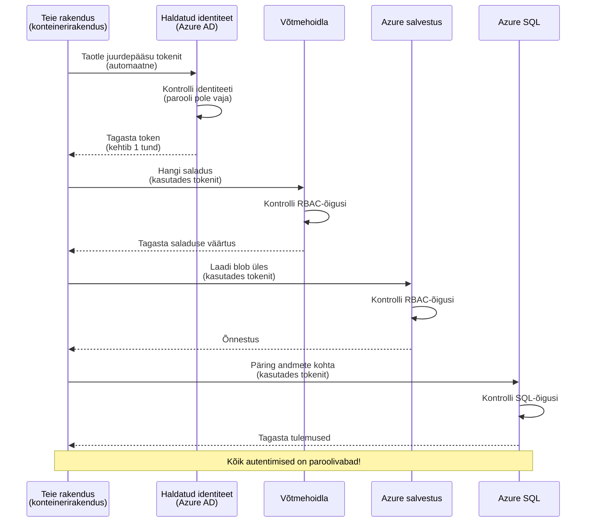
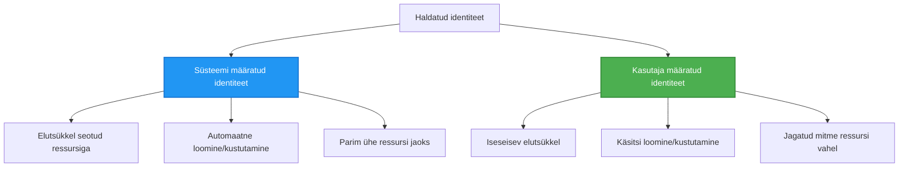

# Autentimise mustrid ja hallatud identiteet

⏱️ **Hinnanguline aeg**: 45-60 minutit | 💰 **Kulud**: Tasuta (lisatasusid puuduvad) | ⭐ **Keerukus**: Keskmine

**📚 Õppeteekond:**
- ← Eelmine: [Konfiguratsiooni haldamine](configuration.md) - Keskkonnamuutujate ja saladuste haldamine
- 🎯 **Oled siin**: Autentimine & Turvalisus (hallatud identiteet, Key Vault, turvalised mustrid)
- → Järgmine: [Esimene projekt](first-project.md) - Ehita oma esimene AZD rakendus
- 🏠 [Kursuse avaleht](../../README.md)

---

## Mida sa õpid

Selle õppetunni läbimisel:
- Mõista Azure'i autentimise mustreid (võtmed, ühendusstringid, hallatud identiteet)
- Rakenda **hallatud identiteet** paroolideta autentimiseks
- Turvata saladusi integratsiooniga **Azure Key Vault**
- Konfigureeri **rollipõhine juurdepääsukontroll (RBAC)** AZD juurutuste jaoks
- Rakenda turvalisuse parimaid tavasid Container Apps ja Azure teenuste puhul
- Migreeri võtmepõhiselt identiteedipõhisele autentimisele

## Miks hallatud identiteet on oluline

### Probleem: Traditsiooniline autentimine

**Enne hallatud identiteeti:**
```javascript
// ❌ TURVARISK: Koodis kõvakodeeritud saladused
const connectionString = "Server=mydb.database.windows.net;User=admin;Password=P@ssw0rd123";
const storageKey = "xK7mN9pQ2wR5tY8uI0oP3aS6dF1gH4jK...";
const cosmosKey = "C2x7B9n4M1p8Q5w3E6r0T2y5U8i1O4p7...";
```

**Probleemid:**
- 🔴 **Paljastunud saladused** koodis, konfiguratsioonifailides, keskkonnamuutujates
- 🔴 **Tunnuste pöörlemine** nõuab koodi muutmist ja uuesti juurutamist
- 🔴 **Auditimine on õudusunenägu** - kes pääses millesse ja millal?
- 🔴 **Hajumine** - saladused laiali erinevates süsteemides
- 🔴 **Vastavusriskid** - ebaõnnestub turvauditites

### Lahendus: Hallatud identiteet

**Pärast hallatud identiteeti:**
```javascript
// ✅ TURVALINE: Koodis pole saladusi
const credential = new DefaultAzureCredential();
const client = new BlobServiceClient(
  "https://mystorageaccount.blob.core.windows.net",
  credential  // Azure haldab autentimist automaatselt
);
```

**Eelised:**
- ✅ **Pole saladusi** koodis ega konfiguratsioonis
- ✅ **Automaatne pöörlemine** - Azure haldab seda
- ✅ **Täielik auditeerimisjälg** Azure AD logides
- ✅ **Keskne turvalisus** - halda Azure Portaalis
- ✅ **Vastavuseks valmis** - vastab turvastandarditele

**Analogia**: Traditsiooniline autentimine on nagu mitme füüsilise võtme kaasas kandmine erinevate uste jaoks. Hallatud identiteet on nagu turvakaart, mis automaatselt annab juurdepääsu selle põhjal, kes sa oled—pole võtmeid, mida kaotada, kopeerida või vahetada.

---

## Arhitektuuri ülevaade

### Autentimisvoog hallatud identiteediga


### Hallatud identiteetide tüübid


| Funktsioon | Süsteemi määratud | Kasutaja määratud |
|---------|----------------|---------------|
| **Elutsükkel** | Seotud ressursiga | Iseseisev |
| **Loomine** | Automaatne koos ressursiga | Käsitsi loomine |
| **Kustutamine** | Kustutatakse koos ressursiga | Püsib pärast ressursi kustutamist |
| **Jagamine** | Ainult üks ressurss | Mitmele ressursile |
| **Kasutusjuhtum** | Lihtsad stsenaariumid | Keerukad mitme ressursiga stsenaariumid |
| **AZD vaikimisi** | ✅ Soovitatav | Valikuline |

---

## Eeltingimused

### Nõutavad tööriistad

Neid tööriistu peaksid eelmistest õppetundidest juba paigaldanud olema:

```bash
# Kontrolli Azure Developer CLI
azd version
# ✅ Oodatav: azd versioon 1.0.0 või uuem

# Kontrolli Azure CLI
az --version
# ✅ Oodatav: azure-cli 2.50.0 või uuem
```

### Azure'i nõuded

- Aktiivne Azure tellimus
- Õigused:
  - Luua hallatud identiteete
  - Määrata RBAC rolle
  - Luua Key Vault ressursse
  - Juurutada Container Apps

### Teadmiste eeltingimused

Peaksid olema lõpetanud:
- [Paigaldusjuhend](installation.md) - AZD seadistamine
- [AZD põhialused](azd-basics.md) - Põhikontseptsioonid
- [Konfiguratsiooni haldamine](configuration.md) - Keskkonnamuutujad

---

## Õppetund 1: Autentimise mustrite mõistmine

### Muster 1: Ühendusstringid (pärand - väldi)

**Kuidas see töötab:**
```bash
# Ühendusstring sisaldab sisselogimisandmeid
STORAGE_CONNECTION_STRING="DefaultEndpointsProtocol=https;AccountName=myaccount;AccountKey=xK7mN9pQ2wR5..."
COSMOS_CONNECTION_STRING="AccountEndpoint=https://myaccount.documents.azure.com:443/;AccountKey=C2x7..."
SQL_CONNECTION_STRING="Server=myserver.database.windows.net;User=admin;Password=P@ssw0rd..."
```

**Probleemid:**
- ❌ Saladused nähtavad keskkonnamuutujates
- ❌ Logitakse juurutussüsteemidesse
- ❌ Raskesti uuendatavad
- ❌ Puudub juurdepääsu auditeerimisjälg

**Millal kasutada:** Ainult lokaalse arenduse jaoks, mitte kunagi tootmises.

---

### Muster 2: Key Vault viited (parem)

**Kuidas see töötab:**
```bicep
// Store secret in Key Vault
resource keyVault 'Microsoft.KeyVault/vaults@2023-02-01' = {
  name: 'mykv'
  properties: {
    enableRbacAuthorization: true
  }
}

// Reference in Container App
env: [
  {
    name: 'STORAGE_KEY'
    secretRef: 'storage-key'  // References Key Vault
  }
]
```

**Eelised:**
- ✅ Saladused salvestatakse turvaliselt Key Vault'is
- ✅ Keskne saladuste haldus
- ✅ Uuendused ilma koodi muutmata

**Piirangud:**
- ⚠️ Endiselt kasutatakse võtmeid/paroole
- ⚠️ Tuleb hallata Key Vaulti juurdepääsu

**Millal kasutada:** Üleminekuetapp ühendusstringidest hallatud identiteedile.

---

### Muster 3: Hallatud identiteet (parim tava)

**Kuidas see töötab:**
```bicep
// Enable managed identity
resource containerApp 'Microsoft.App/containerApps@2023-05-01' = {
  name: 'myapp'
  identity: {
    type: 'SystemAssigned'  // Automatically creates identity
  }
}

// Grant permissions
resource roleAssignment 'Microsoft.Authorization/roleAssignments@2022-04-01' = {
  scope: storageAccount
  properties: {
    roleDefinitionId: storageBlobDataContributorRole
    principalId: containerApp.identity.principalId
  }
}
```

**Rakenduse kood:**
```javascript
// Saladusi pole vaja!
const { DefaultAzureCredential } = require('@azure/identity');
const { BlobServiceClient } = require('@azure/storage-blob');

const credential = new DefaultAzureCredential();
const blobServiceClient = new BlobServiceClient(
  'https://mystorageaccount.blob.core.windows.net',
  credential
);
```

**Eelised:**
- ✅ Pole saladusi koodis/konfigis
- ✅ Automaatne volituste pöörlemine
- ✅ Täielik auditeerimisjälg
- ✅ RBAC-põhised õigused
- ✅ Vastavuseks valmis

**Millal kasutada:** Alati, tootmisrakenduste puhul.

---

## Õppetund 2: Hallatud identiteedi rakendamine AZD-ga

### Samm-sammuline rakendamine

Loome turvalise Container App'i, mis kasutab hallatud identiteeti Azure Storage'i ja Key Vault'i juurde pääsemiseks.

### Projekti struktuur

```
secure-app/
├── azure.yaml                 # AZD configuration
├── infra/
│   ├── main.bicep            # Main infrastructure
│   ├── core/
│   │   ├── identity.bicep    # Managed identity setup
│   │   ├── keyvault.bicep    # Key Vault configuration
│   │   └── storage.bicep     # Storage with RBAC
│   └── app/
│       └── container-app.bicep
└── src/
    ├── app.js                # Application code
    ├── package.json
    └── Dockerfile
```

### 1. Konfigureeri AZD (azure.yaml)

```yaml
name: secure-app
metadata:
  template: secure-app@1.0.0

services:
  api:
    project: ./src
    language: js
    host: containerapp

# Enable managed identity (AZD handles this automatically)
```

### 2. Infrastruktuur: Luba hallatud identiteet

**Fail: `infra/main.bicep`**

```bicep
targetScope = 'subscription'

param environmentName string
param location string = 'eastus'

var tags = { 'azd-env-name': environmentName }

// Resource group
resource rg 'Microsoft.Resources/resourceGroups@2021-04-01' = {
  name: 'rg-${environmentName}'
  location: location
  tags: tags
}

// Storage Account
module storage './core/storage.bicep' = {
  name: 'storage'
  scope: rg
  params: {
    name: 'st${uniqueString(rg.id)}'
    location: location
    tags: tags
  }
}

// Key Vault
module keyVault './core/keyvault.bicep' = {
  name: 'keyvault'
  scope: rg
  params: {
    name: 'kv-${uniqueString(rg.id)}'
    location: location
    tags: tags
  }
}

// Container App with Managed Identity
module containerApp './app/container-app.bicep' = {
  name: 'container-app'
  scope: rg
  params: {
    name: 'ca-${environmentName}'
    location: location
    tags: tags
    storageAccountName: storage.outputs.name
    keyVaultName: keyVault.outputs.name
  }
}

// Grant Container App access to Storage
module storageRoleAssignment './core/role-assignment.bicep' = {
  name: 'storage-role'
  scope: rg
  params: {
    principalId: containerApp.outputs.identityPrincipalId
    roleDefinitionId: 'ba92f5b4-2d11-453d-a403-e96b0029c9fe'  // Storage Blob Data Contributor
    targetResourceId: storage.outputs.id
  }
}

// Grant Container App access to Key Vault
module kvRoleAssignment './core/role-assignment.bicep' = {
  name: 'kv-role'
  scope: rg
  params: {
    principalId: containerApp.outputs.identityPrincipalId
    roleDefinitionId: '4633458b-17de-408a-b874-0445c86b69e6'  // Key Vault Secrets User
    targetResourceId: keyVault.outputs.id
  }
}

// Outputs
output AZURE_STORAGE_ACCOUNT_NAME string = storage.outputs.name
output AZURE_KEY_VAULT_NAME string = keyVault.outputs.name
output APP_URL string = containerApp.outputs.url
```

### 3. Container App süsteemi määratud identiteediga

**Fail: `infra/app/container-app.bicep`**

```bicep
param name string
param location string
param tags object = {}
param storageAccountName string
param keyVaultName string

resource containerApp 'Microsoft.App/containerApps@2023-05-01' = {
  name: name
  location: location
  tags: tags
  identity: {
    type: 'SystemAssigned'  // 🔑 Enable managed identity
  }
  properties: {
    configuration: {
      ingress: {
        external: true
        targetPort: 3000
      }
    }
    template: {
      containers: [
        {
          name: 'api'
          image: 'myregistry.azurecr.io/api:latest'
          resources: {
            cpu: json('0.5')
            memory: '1Gi'
          }
          env: [
            {
              name: 'AZURE_STORAGE_ACCOUNT_NAME'
              value: storageAccountName
            }
            {
              name: 'AZURE_KEY_VAULT_NAME'
              value: keyVaultName
            }
            // 🔑 No secrets - managed identity handles authentication!
          ]
        }
      ]
    }
  }
}

// Output the identity for RBAC assignments
output identityPrincipalId string = containerApp.identity.principalId
output id string = containerApp.id
output url string = 'https://${containerApp.properties.configuration.ingress.fqdn}'
```

### 4. RBAC rolli määramise moodul

**Fail: `infra/core/role-assignment.bicep`**

```bicep
param principalId string
param roleDefinitionId string  // Azure built-in role ID
param targetResourceId string

resource roleAssignment 'Microsoft.Authorization/roleAssignments@2022-04-01' = {
  name: guid(principalId, roleDefinitionId, targetResourceId)
  scope: resourceId('Microsoft.Resources/resourceGroups', resourceGroup().name)
  properties: {
    roleDefinitionId: subscriptionResourceId('Microsoft.Authorization/roleDefinitions', roleDefinitionId)
    principalId: principalId
    principalType: 'ServicePrincipal'
  }
}

output id string = roleAssignment.id
```

### 5. Rakenduse kood hallatud identiteediga

**Fail: `src/app.js`**

```javascript
const express = require('express');
const { DefaultAzureCredential } = require('@azure/identity');
const { BlobServiceClient } = require('@azure/storage-blob');
const { SecretClient } = require('@azure/keyvault-secrets');

const app = express();
const PORT = process.env.PORT || 3000;

// 🔑 Initsialiseeri volitused (töötab automaatselt hallatud identiteediga)
const credential = new DefaultAzureCredential();

// Azure Storage'i seadistamine
const storageAccountName = process.env.AZURE_STORAGE_ACCOUNT_NAME;
const blobServiceClient = new BlobServiceClient(
  `https://${storageAccountName}.blob.core.windows.net`,
  credential  // Võtmeid pole vaja!
);

// Key Vault'i seadistamine
const keyVaultName = process.env.AZURE_KEY_VAULT_NAME;
const secretClient = new SecretClient(
  `https://${keyVaultName}.vault.azure.net`,
  credential  // Võtmeid pole vaja!
);

// Tervisekontroll
app.get('/health', (req, res) => {
  res.json({ status: 'healthy', authentication: 'managed-identity' });
});

// Laadi fail blob-salvestusse
app.post('/upload', async (req, res) => {
  try {
    const containerClient = blobServiceClient.getContainerClient('uploads');
    await containerClient.createIfNotExists();
    
    const blobName = `file-${Date.now()}.txt`;
    const blockBlobClient = containerClient.getBlockBlobClient(blobName);
    
    await blockBlobClient.upload('Hello from managed identity!', 30);
    
    res.json({
      success: true,
      blobName: blobName,
      message: 'File uploaded using managed identity!'
    });
  } catch (error) {
    console.error('Upload error:', error);
    res.status(500).json({ error: error.message });
  }
});

// Hangi salajane väärtus Key Vault'ist
app.get('/secret/:name', async (req, res) => {
  try {
    const secretName = req.params.name;
    const secret = await secretClient.getSecret(secretName);
    
    res.json({
      name: secretName,
      value: secret.value,
      message: 'Secret retrieved using managed identity!'
    });
  } catch (error) {
    console.error('Secret error:', error);
    res.status(500).json({ error: error.message });
  }
});

// Loetle blob-konteinerid (näitab lugemisõigust)
app.get('/containers', async (req, res) => {
  try {
    const containers = [];
    for await (const container of blobServiceClient.listContainers()) {
      containers.push(container.name);
    }
    
    res.json({
      containers: containers,
      count: containers.length,
      message: 'Containers listed using managed identity!'
    });
  } catch (error) {
    console.error('List error:', error);
    res.status(500).json({ error: error.message });
  }
});

app.listen(PORT, () => {
  console.log(`Secure API listening on port ${PORT}`);
  console.log('Authentication: Managed Identity (passwordless)');
});
```

**Fail: `src/package.json`**

```json
{
  "name": "secure-app",
  "version": "1.0.0",
  "dependencies": {
    "express": "^4.18.2",
    "@azure/identity": "^4.0.0",
    "@azure/storage-blob": "^12.17.0",
    "@azure/keyvault-secrets": "^4.7.0"
  },
  "scripts": {
    "start": "node app.js"
  }
}
```

### 6. Juuruta ja testi

```bash
# Initsialiseeri AZD-keskkond
azd init

# Juuruta infrastruktuur ja rakendus
azd up

# Hangi rakenduse URL
APP_URL=$(azd env get-values | grep APP_URL | cut -d '=' -f2 | tr -d '"')

# Testi tervisekontrolli
curl $APP_URL/health
```

**✅ Oodatav väljund:**
```json
{
  "status": "healthy",
  "authentication": "managed-identity"
}
```

**Blob-i üleslaadimise test:**
```bash
curl -X POST $APP_URL/upload
```

**✅ Oodatav väljund:**
```json
{
  "success": true,
  "blobName": "file-1700404800000.txt",
  "message": "File uploaded using managed identity!"
}
```

**Konteinerite loendamise test:**
```bash
curl $APP_URL/containers
```

**✅ Oodatav väljund:**
```json
{
  "containers": ["uploads"],
  "count": 1,
  "message": "Containers listed using managed identity!"
}
```

---

## Levinud Azure RBAC rollid

### Sisseehitatud rolli-ID-d hallatud identiteedile

| Teenus | Rolli nimi | Rolli ID | Õigused |
|---------|-----------|---------|-------------|
| **Storage** | Storage Blob Data Reader | `2a2b9908-6b94-4a3d-8e5a-a7d8f8cc8a12` | Lugemine blobidest ja konteineritest |
| **Storage** | Storage Blob Data Contributor | `ba92f5b4-2d11-453d-a403-e96b0029c9fe` | Lugemine, kirjutamine ja kustutamine blobidest |
| **Storage** | Storage Queue Data Contributor | `974c5e8b-45b9-4653-ba55-5f855dd0fb88` | Lugemine, kirjutamine ja kustutamine järjekonna sõnumitest |
| **Key Vault** | Key Vault Secrets User | `4633458b-17de-408a-b874-0445c86b69e6` | Saladuste lugemine |
| **Key Vault** | Key Vault Secrets Officer | `b86a8fe4-44ce-4948-aee5-eccb2c155cd7` | Saladuste lugemine, kirjutamine ja kustutamine |
| **Cosmos DB** | Cosmos DB Built-in Data Reader | `00000000-0000-0000-0000-000000000001` | Lugemine Cosmos DB andmetest |
| **Cosmos DB** | Cosmos DB Built-in Data Contributor | `00000000-0000-0000-0000-000000000002` | Lugemine ja kirjutamine Cosmos DB andmetesse |
| **SQL Database** | SQL DB Contributor | `9b7fa17d-e63e-47b0-bb0a-15c516ac86ec` | SQL andmebaaside haldamine |
| **Service Bus** | Azure Service Bus Data Owner | `090c5cfd-751d-490a-894a-3ce6f1109419` | Sõnumite saatmine, vastuvõtt ja haldamine |

### Kuidas leida rolli ID-sid

```bash
# Loetle kõik sisseehitatud rollid
az role definition list --query "[].{Name:roleName, ID:name}" --output table

# Otsi konkreetset rolli
az role definition list --query "[?contains(roleName, 'Storage Blob')].{Name:roleName, ID:name}" --output table

# Hangi rolli üksikasjad
az role definition list --name "Storage Blob Data Contributor"
```

---

## Praktilised harjutused

### Harjutus 1: Luba hallatud identiteet olemasolevale rakendusele ⭐⭐ (Keskmine)

**Eesmärk**: Lisa hallatud identiteet olemasolevale Container App juurutusele

**Stsenaarium**: Sul on Container App, mis kasutab ühendusstringe. Konverteeri see hallatud identiteedi kasutamiseks.

**Alguspunkt**: Container App selle konfiguratsiooniga:

```bicep
// ❌ Current: Using connection string
env: [
  {
    name: 'STORAGE_CONNECTION_STRING'
    secretRef: 'storage-connection'
  }
]
```

**Sammud**:

1. **Luba hallatud identiteet Bicep'is:**

```bicep
resource containerApp 'Microsoft.App/containerApps@2023-05-01' = {
  name: 'myapp'
  identity: {
    type: 'SystemAssigned'  // Add this
  }
  // ... rest of configuration
}
```

2. **Anna Storage'i juurdepääs:**

```bicep
// Get storage account reference
resource storageAccount 'Microsoft.Storage/storageAccounts@2023-01-01' existing = {
  name: storageAccountName
}

// Assign role
resource roleAssignment 'Microsoft.Authorization/roleAssignments@2022-04-01' = {
  name: guid(containerApp.id, 'ba92f5b4-2d11-453d-a403-e96b0029c9fe', storageAccount.id)
  scope: storageAccount
  properties: {
    roleDefinitionId: subscriptionResourceId('Microsoft.Authorization/roleDefinitions', 'ba92f5b4-2d11-453d-a403-e96b0029c9fe')
    principalId: containerApp.identity.principalId
    principalType: 'ServicePrincipal'
  }
}
```

3. **Uuenda rakenduse koodi:**

**Enne (ühendusstring):**
```javascript
const { BlobServiceClient } = require('@azure/storage-blob');

const blobServiceClient = BlobServiceClient.fromConnectionString(
  process.env.STORAGE_CONNECTION_STRING
);
```

**Pärast (hallatud identiteet):**
```javascript
const { DefaultAzureCredential } = require('@azure/identity');
const { BlobServiceClient } = require('@azure/storage-blob');

const credential = new DefaultAzureCredential();
const blobServiceClient = new BlobServiceClient(
  `https://${process.env.STORAGE_ACCOUNT_NAME}.blob.core.windows.net`,
  credential
);
```

4. **Uuenda keskkonnamuutujaid:**

```bicep
env: [
  {
    name: 'STORAGE_ACCOUNT_NAME'
    value: storageAccountName  // Just the name, no secrets!
  }
  // Remove STORAGE_CONNECTION_STRING
]
```

5. **Juuruta ja testi:**

```bash
# Juuruta uuesti
azd up

# Testi, et see ikka töötab
curl https://myapp.azurecontainerapps.io/upload
```

**✅ Õnnestumise kriteeriumid:**
- ✅ Rakendus juurutatakse ilma vigadeta
- ✅ Storage'i toimingud töötavad (üleslaadimine, loetelu, allalaadimine)
- ✅ Ühendusstringe ei ole keskkonnamuutujates
- ✅ Identiteet on nähtav Azure Portaalis vahekaardil "Identity"

**Kontroll:**

```bash
# Kontrolli, kas hallatud identiteet on lubatud
az containerapp show \
  --name myapp \
  --resource-group rg-myapp \
  --query "identity.type"
# ✅ Oodatav: "SystemAssigned"

# Kontrolli rolli määramist
az role assignment list \
  --assignee $(az containerapp show --name myapp --resource-group rg-myapp --query "identity.principalId" -o tsv) \
  --scope /subscriptions/{sub-id}/resourceGroups/rg-myapp/providers/Microsoft.Storage/storageAccounts/mystorageaccount
# ✅ Oodatav: Kuvab "Storage Blob Data Contributor" rolli
```

**Aeg**: 20-30 minutit

---

### Harjutus 2: Mitme teenuse juurdepääs kasutaja-määratud identiteediga ⭐⭐⭐ (Edasijõudnud)

**Eesmärk**: Loo kasutaja-määratud identiteet, mida jagatakse mitme Container Appi vahel

**Stsenaarium**: Sul on 3 mikroteenust, millel kõigil on vaja juurdepääsu samale Storage kontole ja Key Vault'ile.

**Sammud**:

1. **Loo kasutaja-määratud identiteet:**

**Fail: `infra/core/identity.bicep`**

```bicep
param name string
param location string
param tags object = {}

resource userAssignedIdentity 'Microsoft.ManagedIdentity/userAssignedIdentities@2023-01-31' = {
  name: name
  location: location
  tags: tags
}

output id string = userAssignedIdentity.id
output principalId string = userAssignedIdentity.properties.principalId
output clientId string = userAssignedIdentity.properties.clientId
```

2. **Määra rollid kasutaja-määratud identiteedile:**

```bicep
// In main.bicep
module userIdentity './core/identity.bicep' = {
  name: 'user-identity'
  scope: rg
  params: {
    name: 'id-${environmentName}'
    location: location
    tags: tags
  }
}

// Grant Storage access
resource storageRoleAssignment 'Microsoft.Authorization/roleAssignments@2022-04-01' = {
  name: guid(userIdentity.outputs.principalId, 'storage-contributor')
  scope: storageAccount
  properties: {
    roleDefinitionId: subscriptionResourceId('Microsoft.Authorization/roleDefinitions', 'ba92f5b4-2d11-453d-a403-e96b0029c9fe')
    principalId: userIdentity.outputs.principalId
    principalType: 'ServicePrincipal'
  }
}

// Grant Key Vault access
resource kvRoleAssignment 'Microsoft.Authorization/roleAssignments@2022-04-01' = {
  name: guid(userIdentity.outputs.principalId, 'kv-secrets-user')
  scope: keyVault
  properties: {
    roleDefinitionId: subscriptionResourceId('Microsoft.Authorization/roleDefinitions', '4633458b-17de-408a-b874-0445c86b69e6')
    principalId: userIdentity.outputs.principalId
    principalType: 'ServicePrincipal'
  }
}
```

3. **Määra identiteet mitmele Container Appile:**

```bicep
resource apiGateway 'Microsoft.App/containerApps@2023-05-01' = {
  name: 'api-gateway'
  identity: {
    type: 'UserAssigned'
    userAssignedIdentities: {
      '${userIdentity.outputs.id}': {}
    }
  }
  // ... rest of config
}

resource productService 'Microsoft.App/containerApps@2023-05-01' = {
  name: 'product-service'
  identity: {
    type: 'UserAssigned'
    userAssignedIdentities: {
      '${userIdentity.outputs.id}': {}
    }
  }
  // ... rest of config
}

resource orderService 'Microsoft.App/containerApps@2023-05-01' = {
  name: 'order-service'
  identity: {
    type: 'UserAssigned'
    userAssignedIdentities: {
      '${userIdentity.outputs.id}': {}
    }
  }
  // ... rest of config
}
```

4. **Rakenduse kood (kõik teenused kasutavad sama mustrit):**

```javascript
const { DefaultAzureCredential, ManagedIdentityCredential } = require('@azure/identity');

// Kasutaja määratud identiteedi puhul määrake kliendi ID
const credential = new ManagedIdentityCredential(
  process.env.AZURE_CLIENT_ID  // Kasutaja määratud identiteedi kliendi ID
);

// Või kasutage DefaultAzureCredentiali (tuvastab automaatselt)
const credential = new DefaultAzureCredential();

const blobServiceClient = new BlobServiceClient(
  `https://${process.env.STORAGE_ACCOUNT_NAME}.blob.core.windows.net`,
  credential
);
```

5. **Juuruta ja kontrolli:**

```bash
azd up

# Testi, et kõik teenused pääsevad salvestusruumile ligi.
curl https://api-gateway.azurecontainerapps.io/upload
curl https://product-service.azurecontainerapps.io/upload
curl https://order-service.azurecontainerapps.io/upload
```

**✅ Õnnestumise kriteeriumid:**
- ✅ Üks identiteet jagatud 3 teenuse vahel
- ✅ Kõik teenused pääsevad juurde Storage'ile ja Key Vault'ile
- ✅ Identiteet säilib, kui kustutad ühe teenuse
- ✅ Keskne õiguste haldus

**Kasutaja-määratud identiteedi eelised:**
- Üks identiteet, mida hallata
- Ühtsed õigused teenuste vahel
- Säilib teenuse kustutamisel
- Sobib paremini keerukate arhitektuuride jaoks

**Aeg**: 30-40 minutit

---

### Harjutus 3: Key Vault saladuste pöörlemise rakendamine ⭐⭐⭐ (Edasijõudnud)

**Eesmärk**: Salvesta kolmanda osapoole API võtmed Key Vault'i ja pääse neile juurde kasutades hallatud identiteeti

**Stsenaarium**: Sinu rakendus peab kutsuma välist API-t (OpenAI, Stripe, SendGrid), mis vajab API võtmeid.

**Sammud**:

1. **Loo Key Vault RBAC-iga:**

**Fail: `infra/core/keyvault.bicep`**

```bicep
param name string
param location string
param tags object = {}

resource keyVault 'Microsoft.KeyVault/vaults@2023-02-01' = {
  name: name
  location: location
  tags: tags
  properties: {
    enableRbacAuthorization: true  // Use RBAC instead of access policies
    sku: {
      family: 'A'
      name: 'standard'
    }
    tenantId: subscription().tenantId
    enableSoftDelete: true
    softDeleteRetentionInDays: 90
  }
}

// Allow Container App to read secrets
output id string = keyVault.id
output name string = keyVault.name
output uri string = keyVault.properties.vaultUri
```

2. **Salvesta saladused Key Vault'i:**

```bash
# Hangi Key Vaulti nimi
KV_NAME=$(azd env get-values | grep AZURE_KEY_VAULT_NAME | cut -d '=' -f2 | tr -d '"')

# Salvesta kolmanda osapoole API-võtmed
az keyvault secret set \
  --vault-name $KV_NAME \
  --name "OpenAI-ApiKey" \
  --value "sk-proj-xxxxxxxxxxxxx"

az keyvault secret set \
  --vault-name $KV_NAME \
  --name "Stripe-ApiKey" \
  --value "sk_live_xxxxxxxxxxxxx"

az keyvault secret set \
  --vault-name $KV_NAME \
  --name "SendGrid-ApiKey" \
  --value "SG.xxxxxxxxxxxxx"
```

3. **Rakenduse kood saladuste hankimiseks:**

**Fail: `src/config.js`**

```javascript
const { DefaultAzureCredential } = require('@azure/identity');
const { SecretClient } = require('@azure/keyvault-secrets');

class Config {
  constructor() {
    this.credential = new DefaultAzureCredential();
    this.secretClient = new SecretClient(
      `https://${process.env.AZURE_KEY_VAULT_NAME}.vault.azure.net`,
      this.credential
    );
    this.cache = {};
  }

  async getSecret(secretName) {
    // Kontrolli esmalt vahemälu
    if (this.cache[secretName]) {
      return this.cache[secretName];
    }

    try {
      const secret = await this.secretClient.getSecret(secretName);
      this.cache[secretName] = secret.value;
      console.log(`✅ Retrieved secret: ${secretName}`);
      return secret.value;
    } catch (error) {
      console.error(`❌ Failed to get secret ${secretName}:`, error.message);
      throw error;
    }
  }

  async getOpenAIKey() {
    return this.getSecret('OpenAI-ApiKey');
  }

  async getStripeKey() {
    return this.getSecret('Stripe-ApiKey');
  }

  async getSendGridKey() {
    return this.getSecret('SendGrid-ApiKey');
  }
}

module.exports = new Config();
```

4. **Kasuta saladusi rakenduses:**

**Fail: `src/app.js`**

```javascript
const express = require('express');
const config = require('./config');
const { OpenAI } = require('openai');

const app = express();

// Algusta OpenAI kasutamist Key Vaultist pärineva võtmega
let openaiClient;

async function initializeServices() {
  const openaiKey = await config.getOpenAIKey();
  openaiClient = new OpenAI({ apiKey: openaiKey });
  console.log('✅ Services initialized with secrets from Key Vault');
}

// Kutsu käivitamisel
initializeServices().catch(console.error);

app.post('/chat', async (req, res) => {
  try {
    const completion = await openaiClient.chat.completions.create({
      model: 'gpt-4',
      messages: [{ role: 'user', content: 'Hello!' }]
    });
    
    res.json({
      response: completion.choices[0].message.content,
      authentication: 'Key from Key Vault via Managed Identity'
    });
  } catch (error) {
    res.status(500).json({ error: error.message });
  }
});

app.listen(3000, () => {
  console.log('Secure API with Key Vault integration running');
});
```

5. **Juuruta ja testi:**

```bash
azd up

# Testi, et API-võtmed töötavad
curl -X POST https://myapp.azurecontainerapps.io/chat \
  -H "Content-Type: application/json" \
  -d '{"message":"Hello AI"}'
```

**✅ Õnnestumise kriteeriumid:**
- ✅ API võtmeid ei ole koodis ega keskkonnamuutujates
- ✅ Rakendus hangib võtmed Key Vault'ist
- ✅ Kolmanda osapoole API-d toimivad korrektselt
- ✅ Võtmeid saab uuendada ilma koodi muutmata

**Uuenda saladust:**

```bash
# Uuenda salajast väärtust Key Vaultis
az keyvault secret set \
  --vault-name $KV_NAME \
  --name "OpenAI-ApiKey" \
  --value "sk-proj-NEW_KEY_HERE"

# Taaskäivita rakendus, et see võtaks kasutusele uue võtme
az containerapp revision restart \
  --name myapp \
  --resource-group rg-myapp
```

**Aeg**: 25-35 minutit

---

## Teadmiste kontrollpunkt

### 1. Autentimise mustrid ✓

Testi oma arusaamist:

- [ ] **Q1**: Millised on kolm peamist autentimise mustrit? 
  - **A**: Ühendusstringid (pärand), Key Vault viited (üleminek), Hallatud identiteet (parim)

- [ ] **Q2**: Miks on hallatud identiteet parem kui ühendusstringid?
  - **A**: Pole saladusi koodis, automaatne pöörlemine, täielik auditeerimisjälg, RBAC õigused

- [ ] **Q3**: Millal kasutaksite kasutaja-määratud identiteeti süsteemi-määratud asemel?
  - **A**: Kui identiteeti jagatakse mitme ressursi vahel või kui identiteedi elutsükkel on iseseisev ressursi elutsüklist

**Praktiline kontroll:**
```bash
# Kontrollige, millist tüüpi identiteeti teie rakendus kasutab
az containerapp show \
  --name myapp \
  --resource-group rg-myapp \
  --query "identity.type"

# Loetlege kõik selle identiteedi rolli määramised
az role assignment list \
  --assignee $(az containerapp show --name myapp --resource-group rg-myapp --query "identity.principalId" -o tsv)
```

---

### 2. RBAC ja õigused ✓

Testi oma arusaamist:

- [ ] **Q1**: Mis on rolli ID "Storage Blob Data Contributor" jaoks?
  - **A**: `ba92f5b4-2d11-453d-a403-e96b0029c9fe`

- [ ] **Q2**: Milliseid õigusi annab "Key Vault Secrets User"?
  - **A**: Ainult lugemisõigus saladustele (ei saa luua, uuendada ega kustutada)

- [ ] **Q3**: Kuidas annad Container App-ile juurdepääsu Azure SQL-ile?
  - **A**: Määra "SQL DB Contributor" roll või konfigureeri Azure AD autentimine SQL-ile

**Praktiline kontroll:**
```bash
# Leia konkreetne roll
az role definition list --name "Storage Blob Data Contributor"

# Kontrolli, millised rollid on teie identiteedile määratud
PRINCIPAL_ID=$(az containerapp show --name myapp --resource-group rg-myapp --query "identity.principalId" -o tsv)
az role assignment list --assignee $PRINCIPAL_ID --output table
```

---

### 3. Key Vault integratsioon ✓
- [ ] **Q1**: Kuidas lubada Key Vault'is RBAC-i, mitte juurdepääsupoliitikaid?
  - **A**: Set `enableRbacAuthorization: true` in Bicep

- [ ] **Q2**: Milline Azure SDK teek haldab haldatud identiteedi autentimist?
  - **A**: `@azure/identity` with `DefaultAzureCredential` class

- [ ] **Q3**: Kui kaua Key Vaulti saladused püsivad vahemälus?
  - **A**: Rakendusest sõltuv; implementeeri oma vahemälustrateegia

**Praktiline kontroll:**
```bash
# Testi Key Vaulti juurdepääsu
az keyvault secret show \
  --vault-name $KV_NAME \
  --name "OpenAI-ApiKey" \
  --query "value"

# Kontrolli, kas RBAC on lubatud
az keyvault show \
  --name $KV_NAME \
  --query "properties.enableRbacAuthorization"
# ✅ Oodatav: true
```

---

## Turvalisuse parimad tavad

### ✅ TEE:

1. **Kasuta tootmises alati haldatud identiteeti**
   ```bicep
   identity: {
     type: 'SystemAssigned'
   }
   ```

2. **Kasuta minimaalsete õigustega RBAC rolle**
   - Kasuta võimaluse korral "Reader" rolle
   - Vältida "Owner" või "Contributor" rolle, kui need pole vajalikud

3. **Salvesta kolmanda osapoole võtmed Azure Key Vault'i**
   ```javascript
   const apiKey = await secretClient.getSecret('ThirdPartyApiKey');
   ```

4. **Lülita sisse auditeerimise logimine**
   ```bicep
   diagnosticSettings: {
     logs: [{ category: 'AuditEvent', enabled: true }]
   }
   ```

5. **Kasuta erinevaid identiteete arenduses/staging/tootmises**
   ```bash
   azd env new dev
   azd env new staging
   azd env new prod
   ```

6. **Vaheta saladusi regulaarselt**
   - Sea Key Vaulti saladustele aegumiskuupäevad
   - Automatiseeri vahetus Azure Functionsiga

### ❌ ÄRA:

1. **Ära kunagi kõvakodeeri saladusi**
   ```javascript
   // ❌ HALB
   const apiKey = "sk-proj-xxxxxxxxxxxxx";
   ```

2. **Ära kasuta ühendusstringe tootmises**
   ```javascript
   // ❌ HALB
   BlobServiceClient.fromConnectionString(process.env.STORAGE_CONNECTION_STRING)
   ```

3. **Ära anna liigselt õigusi**
   ```bicep
   // ❌ BAD - too much access
   roleDefinitionId: 'Owner'
   
   // ✅ GOOD - least privilege
   roleDefinitionId: 'Storage Blob Data Reader'
   ```

4. **Ära logi saladusi**
   ```javascript
   // ❌ HALB
   console.log('API Key:', apiKey);
   
   // ✅ HEA
   console.log('API Key retrieved successfully');
   ```

5. **Ära jaga tootmise identiteete keskkondade vahel**
   ```bicep
   // ❌ BAD - same identity for dev and prod
   // ✅ GOOD - separate identities per environment
   ```

---

## Veaotsingu juhend

### Probleem: "Unauthorized" Azure Storage'ile juurdepääsu korral

**Sümptomid:**
```
Error: Unauthorized (403)
AuthorizationPermissionMismatch: This request is not authorized to perform this operation
```

**Diagnoos:**

```bash
# Kontrolli, kas hallatud identiteet on lubatud
az containerapp show \
  --name myapp \
  --resource-group rg-myapp \
  --query "identity.type"
# ✅ Oodatud: "SystemAssigned" või "UserAssigned"

# Kontrolli rolli määramisi
PRINCIPAL_ID=$(az containerapp show --name myapp --resource-group rg-myapp --query "identity.principalId" -o tsv)
az role assignment list --assignee $PRINCIPAL_ID

# Oodatud: peaks olema näha "Storage Blob Data Contributor" või sarnast rolli
```

**Lahendused:**

1. **Määra õige RBAC roll:**
```bash
STORAGE_ID=$(az storage account show --name mystorageaccount --resource-group rg-myapp --query "id" -o tsv)
az role assignment create \
  --assignee $PRINCIPAL_ID \
  --role "Storage Blob Data Contributor" \
  --scope $STORAGE_ID
```

2. **Oota levikut (võib võtta 5–10 minutit):**
```bash
# Kontrolli rolli määramise olekut
az role assignment list --assignee $PRINCIPAL_ID --scope $STORAGE_ID
```

3. **Kontrolli, et rakenduse kood kasutab õiget volitust:**
```javascript
// Veendu, et kasutad DefaultAzureCredentiali
const credential = new DefaultAzureCredential();
```

---

### Probleem: Key Vaulti juurdepääs keelatud

**Sümptomid:**
```
Error: Forbidden (403)
The user, group or application does not have secrets get permission
```

**Diagnoos:**

```bash
# Kontrolli, kas Key Vault RBAC on lubatud
az keyvault show \
  --name $KV_NAME \
  --query "properties.enableRbacAuthorization"
# ✅ Oodatav: true

# Kontrolli rolli määramisi
az role assignment list \
  --assignee $PRINCIPAL_ID \
  --scope /subscriptions/{sub-id}/resourceGroups/rg-myapp/providers/Microsoft.KeyVault/vaults/$KV_NAME
```

**Lahendused:**

1. **Lülita Key Vaultil sisse RBAC:**
```bash
az keyvault update \
  --name $KV_NAME \
  --enable-rbac-authorization true
```

2. **Määra Key Vault Secrets User roll:**
```bash
KV_ID=$(az keyvault show --name $KV_NAME --query "id" -o tsv)
az role assignment create \
  --assignee $PRINCIPAL_ID \
  --role "Key Vault Secrets User" \
  --scope $KV_ID
```

---

### Probleem: DefaultAzureCredential ebaõnnestub lokaalselt

**Sümptomid:**
```
Error: DefaultAzureCredential failed to retrieve a token
CredentialUnavailableError: No credential available
```

**Diagnoos:**

```bash
# Kontrolli, kas oled sisse logitud
az account show

# Kontrolli Azure CLI autentimist
az ad signed-in-user show
```

**Lahendused:**

1. **Logi sisse Azure CLI-ga:**
```bash
az login
```

2. **Sea Azure'i tellimus:**
```bash
az account set --subscription "Your Subscription Name"
```

3. **Lokaalse arenduse jaoks kasuta keskkonnamuutujaid:**
```bash
export AZURE_TENANT_ID="your-tenant-id"
export AZURE_CLIENT_ID="your-client-id"
export AZURE_CLIENT_SECRET="your-client-secret"
```

4. **Või kasuta lokaalselt teist volitust:**
```javascript
const { DefaultAzureCredential, AzureCliCredential } = require('@azure/identity');

// Kasuta AzureCliCredentiali kohaliku arenduse jaoks
const credential = process.env.NODE_ENV === 'production' 
  ? new DefaultAzureCredential()
  : new AzureCliCredential();
```

---

### Probleem: Rolli määramine võtab liiga kaua aega levimiseks

**Sümptomid:**
- Roll määrati edukalt
- Endiselt saab 403 vigu
- Pidev juurdepääsu vaheldumine (mõnikord töötab, mõnikord ei tööta)

**Selgitus:**
Azure RBAC-i muudatused võivad üle maailma levimiseks võtta 5–10 minutit.

**Lahendus:**

```bash
# Oota ja proovi uuesti
echo "Waiting for RBAC propagation..."
sleep 300  # Oota 5 minutit

# Kontrolli juurdepääsu
curl https://myapp.azurecontainerapps.io/upload

# Kui probleem püsib, taaskäivita rakendus
az containerapp revision restart \
  --name myapp \
  --resource-group rg-myapp
```

---

## Kuluaspektid

### Haldatud identiteedi kulud

| Resurss | Kulu |
|----------|------|
| **Haldatud identiteet** | 🆓 **TASUTA** - Ei võeta tasu |
| **RBAC rollide määramised** | 🆓 **TASUTA** - Ei võeta tasu |
| **Azure AD tokenipäringud** | 🆓 **TASUTA** - Sisaldatud |
| **Key Vault toimingud** | $0.03 per 10,000 operations |
| **Key Vault salvestus** | $0.024 per secret per month |

**Haldatud identiteet säästab raha, sest:**
- ✅ Eemaldab Key Vaulti toimingud teenustevahelise autentimise jaoks
- ✅ Vähendab turvasündmusi (puuduvad lekitatud volitused)
- ✅ Vähendab halduskulutusi (pole käsitsi vahetamist)

**Näide kulude võrdlusest (kuus):**

| Stsenaarium | Ühendusstringid | Haldatud identiteet | Sääst |
|----------|-------------------|-----------------|---------|
| Väike rakendus (1M päringut) | ~$50 (Key Vault + ops) | ~$0 | $50/month |
| Keskmine rakendus (10M päringut) | ~$200 | ~$0 | $200/month |
| Suur rakendus (100M päringut) | ~$1,500 | ~$0 | $1,500/month |

---

## Lisateave

### Ametlik dokumentatsioon
- [Azure'i haldatud identiteet](https://learn.microsoft.com/entra/identity/managed-identities-azure-resources/overview)
- [Azure RBAC](https://learn.microsoft.com/azure/role-based-access-control/overview)
- [Azure Key Vault](https://learn.microsoft.com/azure/key-vault/general/overview)
- [DefaultAzureCredential](https://learn.microsoft.com/dotnet/api/azure.identity.defaultazurecredential)

### SDK dokumentatsioon
- [@azure/identity (Node.js)](https://www.npmjs.com/package/@azure/identity)
- [Azure.Identity (C#)](https://www.nuget.org/packages/Azure.Identity/)
- [azure-identity (Python)](https://pypi.org/project/azure-identity/)

### Järgmised sammud selles kursuses
- ← Eelmine: [Configuration Management](configuration.md)
- → Järgmine: [Esimene projekt](first-project.md)
- 🏠 [Kursuse avaleht](../../README.md)

### Seotud näited
- [Azure OpenAI Chat Example](../../../../examples/azure-openai-chat) - Kasutab haldatud identiteeti Azure OpenAI jaoks
- [Microservices Example](../../../../examples/microservices) - Mitme teenuse autentimise mustrid

---

## Kokkuvõte

**Oled õppinud:**
- ✅ Kolm autentimismustrit (ühendusstringid, Key Vault, haldatud identiteet)
- ✅ Kuidas lubada ja konfigureerida haldatud identiteeti AZD-s
- ✅ RBAC rollide määramised Azure teenustele
- ✅ Key Vault integratsioon kolmanda osapoole saladuste jaoks
- ✅ Kasutaja määratud vs süsteemi määratud identiteedid
- ✅ Turvalisuse head tavad ja veaotsing

**Peamised järeldused:**
1. **Kasuta tootmises alati haldatud identiteeti** - Null salajasi andmeid, automaatne vahetus
2. **Kasuta minimaalsete õigustega RBAC rolle** - Anna ainult vajalikud õigused
3. **Salvesta kolmanda osapoole võtmed Key Vault'i** - Keskne saladuste haldus
4. **Eralda identiteedid keskkonniti** - arendus, staging, tootmine eraldatus
5. **Lülita sisse auditeerimise logimine** - Jälgi, kes millele ligi pääses

**Järgnevad sammud:**
1. Lõpeta eespool olevad praktilised harjutused
2. Migreeri olemasolev rakendus ühendusstringidelt haldatud identiteedile
3. Loo oma esimene AZD projekt, millel on algusest peale turvalisus: [Esimene projekt](first-project.md)

---

<!-- CO-OP TRANSLATOR DISCLAIMER START -->
Lahtiütlus:
See dokument on tõlgitud tehisintellektil põhineva tõlketeenuse Co-op Translator (https://github.com/Azure/co-op-translator) abil. Kuigi püüame tagada täpsust, tuleb arvestada, et automatiseeritud tõlked võivad sisaldada vigu või ebatäpsusi. Originaaldokumenti selle algkeeles tuleks pidada autoriteetseks allikaks. Olulise teabe puhul soovitatakse kasutada professionaalset inimtõlget. Me ei vastuta selle tõlke kasutamisest tulenevate arusaamatuste või valesti tõlgenduste eest.
<!-- CO-OP TRANSLATOR DISCLAIMER END -->