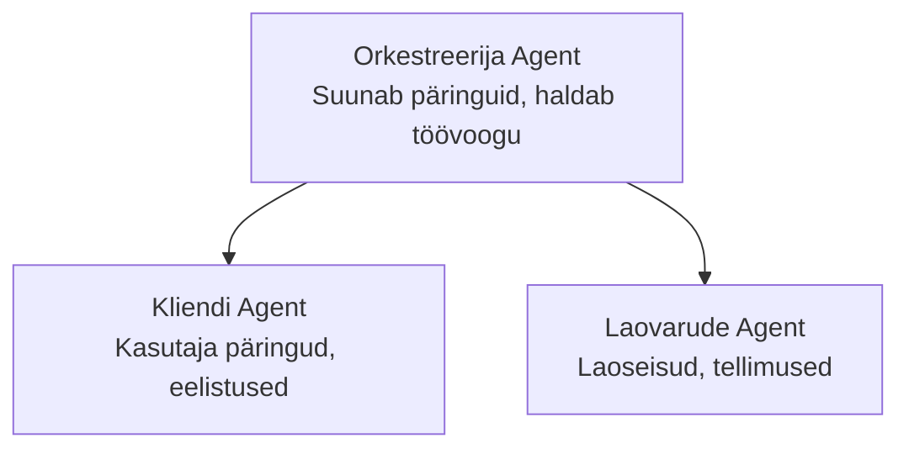

# Chapter 5: Mitme agendi AI lahendused

**📚 Kursus**: [AZD algajatele](../../README.md) | **⏱️ Kestus**: 2-3 tundi | **⭐ Tõsidusaste**: Edasijõudnu

---

## Ülevaade

See peatükk käsitleb täiustatud mitme agendi arhitektuuri mustreid, agendihaldust ja tootmiskõlblikke AI lahendusi keerukate stsenaariumide jaoks.

## Õpieesmärgid

Selle peatüki läbimise järel:
- Mõistate mitme agendi arhitektuuri mustreid
- Paigaldage koordineeritud AI agentide süsteemid
- Rakendage agentidevaheline suhtlus
- Ehitate tootmiskõlblikke mitme agendi lahendusi

---

## 📚 Õppetunnid

| # | Õppetund | Kirjeldus | Aeg |
|---|--------|-------------|------|
| 1 | [Jaekauplemise mitme agendi lahendus](../../examples/retail-scenario.md) | Täielik rakenduse samm-sammuline selgitus | 90 min |
| 2 | [Koordineerimise mustrid](../chapter-06-pre-deployment/coordination-patterns.md) | Agentide orkestreerimise strateegiad | 30 min |
| 3 | [ARM i mallide juurutamine](../../examples/retail-multiagent-arm-template/README.md) | Ühe klõpsuga juurutamine | 30 min |

---

## 🚀 Kiire algus

```bash
# Valik 1: Paigalda mallist
azd init --template agent-openai-python-prompty
azd up

# Valik 2: Paigalda agendi manifestist (nõuab azure.ai.agents laiendit)
azd extension install azure.ai.agents
azd ai agent init -m agent-manifest.yaml
azd up
```

> **Milline lähenemine?** Kasutage `azd init --template`, et alustada töökohast näidismallist. Kasutage `azd ai agent init`, kui teil on oma agendi manifest. Vaadake täielike juhiste saamiseks [AZD AI CLI viidet](../chapter-08-production/production-ai-practices.md#azd-ai-cli-commands-and-extensions).

---

## 🤖 Mitme agendi arhitektuur


---

## 🎯 Esile tõstetud lahendus: Jaekauplemise mitme agendi lahendus

[Jaekauplemise mitme agendi lahendus](../../examples/retail-scenario.md) demonstreerib:

- **Kliendiagent**: Haldab kasutajate interaktsioone ja eelistusi
- **Laohaldusagent**: Juhtimise all varud ja tellimuste töötlemine
- **Orkestreerija**: Koordineerib agentide tööd
- **Jagatud mälu**: Konteksti haldamine agentide vahel

### Kasutatud teenused

| Teenus | Otstarve |
|---------|---------|
| Microsoft Foundry mudelid | Keele mõistmine |
| Azure AI otsing | Tootekataloog |
| Cosmos DB | Agendi olek ja mälu |
| Container Apps | Agendi majutamine |
| Application Insights | Jälgimine |

---

## 🔗 Navigatsioon

| Suund | Peatükk |
|-----------|---------|
| **Eelmine** | [4. peatükk: Taristu](../chapter-04-infrastructure/README.md) |
| **Järgmine** | [6. peatükk: Eeljärkud](../chapter-06-pre-deployment/README.md) |

---

## 📖 Seotud ressursid

- [AI agendid: juhend](../chapter-02-ai-development/agents.md)
- [Tootmise AI praktikad](../chapter-08-production/production-ai-practices.md)
- [AI tõrkeotsing](../chapter-07-troubleshooting/ai-troubleshooting.md)

---

<!-- CO-OP TRANSLATOR DISCLAIMER START -->
**Vastutusest loobumine**:
See dokument on tõlgitud kasutades tehisintellektil põhinevat tõlketeenust [Co-op Translator](https://github.com/Azure/co-op-translator). Kuigi püüame tagada täpsust, olge teadlikud, et automaatsed tõlked võivad sisaldada vigu või ebatäpsusi. Originaaldokument oma emakeeles tuleks lugeda usaldusväärseks allikaks. Olulise info puhul soovitatakse kasutada professionaalset inimtõlget. Me ei vastuta tõlke kasutamisest tingitud arusaamatuste või valesti tõlgendamise eest.
<!-- CO-OP TRANSLATOR DISCLAIMER END -->