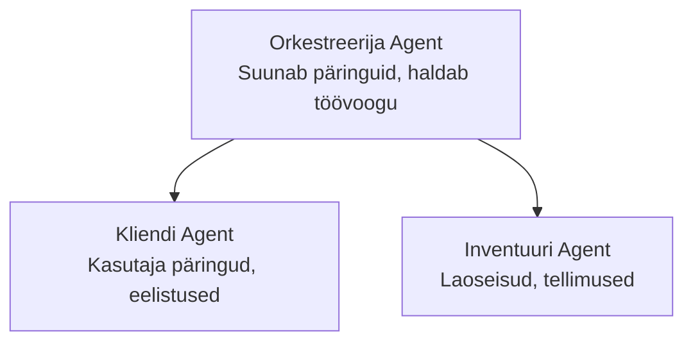

# Chapter 5: Mitmeagendilised AI lahendused

**📚 Kursus**: [AZD algajatele](../../README.md) | **⏱️ Kestus**: 2-3 tundi | **⭐ Tase**: Edasijõudnud

---

## Ülevaade

Selles peatükis käsitletakse keerukaid mitmeagendilise arhitektuuri mustreid, agentide orkestreerimist ja tootmiskõlblikke AI lahendusi keerukate stsenaariumide jaoks.

> Kontrollitud versiooniga `azd 1.25.6` 2026. aasta juunis.

## Õpieesmärgid

Selle peatüki läbimisel:
- Mõistate mitmeagendilisi arhitektuuri mustreid
- Teete kasutusele koordineeritud AI agentide süsteemi
- Rakendate agentide omavahelist suhtlust
- Loote tootmiskõlblikke mitmeagendilisi lahendusi

---

## 📚 Õppetunnid

| # | Õppetund | Kirjeldus | Aeg |
|---|----------|-----------|-----|
| 1 | [Mitmeagendiliste alused](multi-agent-basics.md) | Praktiline: töötava mitmeagendilise rakenduse juurutamine `azd up`-ga | 45 min |
| 2 | [Koordineerimisstrateegiad](../chapter-06-pre-deployment/coordination-patterns.md) | Agentide orkestreerimise strateegiad (jätkub peatükis 6) | 30 min |
| 3 | [ARM-malli juurutamine](../../examples/retail-multiagent-arm-template/README.md) | Ühe klõpsuga juurutamise näide | 30 min |

> **Alustage õppetunnist 1.** See on ainus täielikult praktiline ja juurutatav õppetund selles peatükis. Õppetund 2 asub peatükis 6 (jagatud eeljuurutuse planeerimisega) ja [Jaemüügi mitmeagendiline lahendus](../../examples/retail-scenario.md) on arhitektuuri mall — disainiviide, mitte ühe käsuga mall.

---

## 🚀 Kiire algus

```bash
# Valik 1: Paigalda mallist
azd init --template agent-openai-python-prompty
azd up

# Valik 2: Paigalda agendi manifestist (nõuab azure.ai.agents laiendust)
azd extension install azure.ai.agents
azd ai agent init -m agent-manifest.yaml
azd up
```

> **Millist lähenemist valida?** Kasutage `azd init --template`, et alustada töökäibivast näidisegist. Kasutage `azd ai agent init`, kui teil on oma agentide manifest. Täieliku ülevaate saamiseks vaadake [AZD AI CLI viidet](../chapter-08-production/production-ai-practices.md#azd-ai-cli-commands-and-extensions).

---

## 🤖 Mitmeagendiline arhitektuur



---

## 🎯 Esitletud lahendus: Jaemüügi mitmeagent

[Jaemüügi mitmeagent](../../examples/retail-scenario.md) demonstreerib:

- **Kliendiagent**: Halda kasutajate suhtlust ja eelistusi
- **Laoseis agent**: Haldab laoseisu ja tellimuste töötlemist
- **Orkestreerija**: Koordineerib agentide tegevusi
- **Jagatud mälu**: Agentidevaheline konteksti haldus

### Kasutatavad teenused

| Teenus | Eesmärk |
|--------|---------|
| Microsoft Foundry mudelid | Keele mõistmine |
| Azure AI Search | Tootekataloog |
| Cosmos DB | Agendi olek ja mälu |
| Container Apps | Agendi majutamine |
| Application Insights | Jälgimine |

---

## 🔗 Navigatsioon

| Suund | Peatükk |
|--------|---------|
| **Eelmine** | [Peatükk 4: Infrastruktuur](../chapter-04-infrastructure/README.md) |
| **Järgmine** | [Peatükk 6: Eeljuurutus](../chapter-06-pre-deployment/README.md) |

---

## 📖 Seotud ressursid

- [AI agentide juhend](../chapter-02-ai-development/agents.md)
- [Tootmise AI praktikad](../chapter-08-production/production-ai-practices.md)
- [AI tõrkeotsing](../chapter-07-troubleshooting/ai-troubleshooting.md)

---

<!-- CO-OP TRANSLATOR DISCLAIMER START -->
**Lahtiütlus**:
See dokument on tõlgitud kasutades AI tõlketeenust [Co-op Translator](https://github.com/Azure/co-op-translator). Kuigi me püüdleme täpsuse poole, palun pange tähele, et automatiseeritud tõlgetes võib esineda vigu või ebatäpsusi. Originaaldokument selle emakeeles tuleks pidada autoriteetseks allikaks. Olulise teabe puhul soovitatakse kasutada professionaalset inimtõlget. Me ei vastuta selle tõlkega seotud eksimustest või valesti mõistmistest.
<!-- CO-OP TRANSLATOR DISCLAIMER END -->