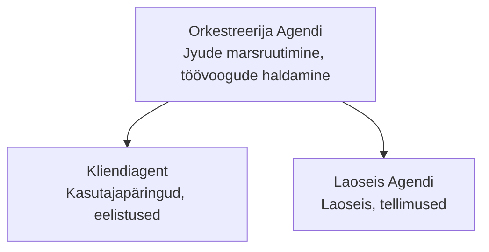

# 5. peatükk: Mitme agendi AI lahendused

**📚 Kursus**: [AZD algajatele](../../README.md) | **⏱️ Kestus**: 2–3 tundi | **⭐ Raskeusaste**: Edasijõudnud

---

## Ülevaade

See peatükk käsitleb keerukaid mitme agendi arhitektuurimustreid, agentide koordineerimist ja tootmiskõlblikke AI lahendusi keeruliste stsenaariumite jaoks.

> Kontrollitud versiooniga `azd 1.23.12` märts 2026.

## Õpieesmärgid

Selle peatüki lõpetamisega saad:
- Mõista mitme agendi arhitektuurimustreid
- Juurutada koordineeritud AI agendite süsteeme
- Rakendada agendi-agnedi suhtlust
- Luua tootmiskõlblikke mitme agendi lahendusi

---

## 📚 Tunnid

| # | Tund | Kirjeldus | Aeg |
|---|------|-----------|-----|
| 1 | [Jaekaubanduse mitme agendi lahendus](../../examples/retail-scenario.md) | Täielik rakenduse läbivaatus | 90 min |
| 2 | [Koordineerimise mustrid](../chapter-06-pre-deployment/coordination-patterns.md) | Agentide orkestreerimise strateegiad | 30 min |
| 3 | [ARM malle juurutamine](../../examples/retail-multiagent-arm-template/README.md) | Ühe klõpsuga juurutamine | 30 min |

---

## 🚀 Kiiralgus

```bash
# Valik 1: Paigalda mallist
azd init --template agent-openai-python-prompty
azd up

# Valik 2: Paigalda agendi manifestist (nõuab azure.ai.agents laiendit)
azd extension install azure.ai.agents
azd ai agent init -m agent-manifest.yaml
azd up
```

> **Millist lähenemist kasutada?** Kasuta `azd init --template`, et alustada toimiva näiteks. Kasuta `azd ai agent init`, kui sul on olemas oma agendi manifest. Täpse info saamiseks vaata [AZD AI CLI juhendit](../chapter-08-production/production-ai-practices.md#azd-ai-cli-commands-and-extensions).

---

## 🤖 Mitme agendi arhitektuur


---

## 🎯 Esiletõstetud lahendus: Jaekaubanduse mitme agendi lahendus

[Jaekaubanduse mitme agendi lahendus](../../examples/retail-scenario.md) demonstreerib:

- **Kliendi agent**: Käsitleb kasutajate suhtlust ja eelistusi
- **Varude agent**: Halda lao ja tellimuste töötlemist
- **Orkestreerija**: Koordineerib agentide tööd
- **Jagatud mälu**: Agenditevaheline konteksti haldus

### Kasutatud teenused

| Teenus | Eesmärk |
|--------|---------|
| Microsoft Foundry mudelid | Keele mõistmine |
| Azure AI Search | Toodete kataloog |
| Cosmos DB | Agendi seisund ja mälu |
| Container Apps | Agentide majutamine |
| Application Insights | Jälgimine |

---

## 🔗 Navigeerimine

| Suund | Peatükk |
|-------|---------|
| **Eelmine** | [4. peatükk: Taristu](../chapter-04-infrastructure/README.md) |
| **Järgmine** | [6. peatükk: Eeljätkusuunamine](../chapter-06-pre-deployment/README.md) |

---

## 📖 Seotud ressursid

- [AI agentide juhend](../chapter-02-ai-development/agents.md)
- [Tootmise AI tavad](../chapter-08-production/production-ai-practices.md)
- [AI tõrkeotsing](../chapter-07-troubleshooting/ai-troubleshooting.md)

---

<!-- CO-OP TRANSLATOR DISCLAIMER START -->
**Vastutusest loobumine**:
See dokument on tõlgitud kasutades AI tõlke teenust [Co-op Translator](https://github.com/Azure/co-op-translator). Kuigi me püüame täpsust, palun pidage meeles, et automatiseeritud tõlked võivad sisaldada vigu või ebatäpsusi. Originaaldokument selle emakeeles tuleks pidada autoriteetseks allikaks. Tähtsa teabe puhul on soovitatav kasutada professionaalset inimtõlget. Me ei vastuta selle tõlke kasutamisest tingitud arusaamatuste või valesti mõistmiste eest.
<!-- CO-OP TRANSLATOR DISCLAIMER END -->