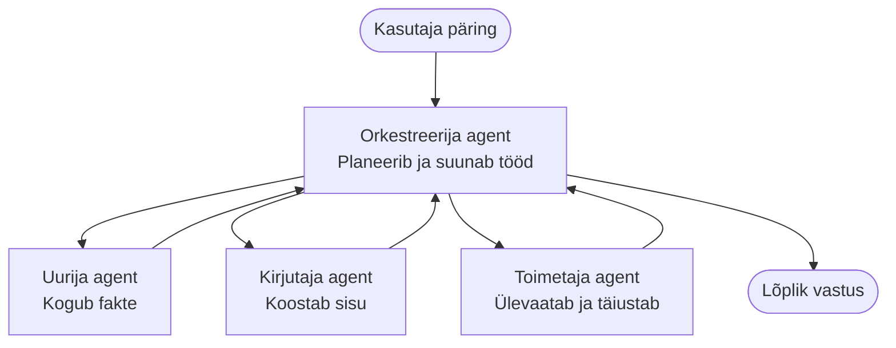

# Mitmeagendilise süsteemi põhitõed - juuruta oma esimene koordineeritud tehisintellekti süsteem

**Peatükkide navigeerimine:**
- **📚 Kursuse avaleht**: [AZD algajatele](../../README.md)
- **📖 Praegune peatükk**: Peatükk 5 - Mitmeagendilised tehisintellekti lahendused
- **⬅️ Eelmine**: [Peatükk 4: Infrastruktuur](../chapter-04-infrastructure/README.md)
- **➡️ Järgmine**: [Koordineerimismustrid](../chapter-06-pre-deployment/coordination-patterns.md)

> Kinnitatud `azd 1.25.6` abil juunis 2026.

## Sissejuhatus

Varem peatükkides juurutasite ühe rakenduse — ja peatükis 2 juurutasite ühe AI agendi. See õppetund teeb järgmise sammu: juurutab **mitmeagendilise süsteemi**, kus mitu spetsialiseerunud agenti töötavad koos, et lahendada probleemi, millega üks agent üksi hästi hakkama ei saaks.

Hea uudis algajatele: **teil pole vaja uusi käske.** Mitmeagendiline lahendus on endiselt azd projekt. Teete `azd init`, `azd up`, testite ja `azd down` — täpselt see töövoog, mida juba teate. Muutub see, mis on rakenduse sees.

## Õpieesmärgid

Selle õppetunni lõpuks:
- Saate aru, mida tähendab "mitmeagendiline" ja millal tasub lisakompleksust kasutada
- Tunnete ära mitmeagendilise süsteemi levinud rollid (koordinaator + spetsialistid)
- Juurutate reaalse, toimiva mitmeagendilise malli `azd up` abil
- Mõistate Azure'i ressursse, mis toetavad mitmeagendilist rakendust
- Teate, kuidas lahendust turvaliselt kontrollida, kohandada ja maha võtta

## Õpitulemused

Pärast selle õppetunni läbimist oskate:
- Selgitada erinevust ühe agendi ja mitmeagendilise süsteemi vahel
- Otsustada ühe agendi tööriistade ja tõelise mitmeagendi disaini vahel
- Juurutada ja testida azd abil lõpp-lõpuni mitmeagendilist malli
- Määrata, kus iga agent jookseb ja kuidas nad suhtlevad
- Puhastada kõik ressursid, et vältida jätkuvaid kulusid

---

## Mis on mitmeagendiline süsteem?

Üks AI agent on üks mudel koos juhiste kogumiga ja (valikuliselt) mõne tööriistaga. See toimib hästi fokuseeritud ülesannete puhul. Kuid kui ülesanne kasvab — uurimine, siis kirjutamine, siis redigeerimine, siis fakti kontrollimine — siis kõike ühte prompti toppides muutub agent aeglasemaks, vähem usaldusväärseks ja raskemini silutatavaks.

Mitmeagendiline süsteem jagab töö spetsialistideks, kes teevad igaüks ühe töö hästi, koordineerijaga:



### Kaks rolli, mida näed alati

| Roll | Töö | Näide |
|------|-----|-------|
| **Orkestreerija** | Otsustab *mis järgmisena juhtub* ja suunab tööd agentide vahel | "Esmalt uurimine, siis kirjutamine, siis redigeerimine" |
| **Spetsialist** | Teeb ühe keskse töö ja tagastab tulemuse | "uurija", kes kogub ainult fakte |

### Kas teil tegelikult on vaja mitut agenti?

Alustage lihtsalt. Pöörduge mitmeagendilise poole **ainult siis**, kui üks järgmistest on tõsi:

- ✅ Ülesandel on **erinevad etapid**, mis saavad kasu erinevatest juhistest (uurimine vs kirjutamine vs ülevaatus)
- ✅ Soovite, et spetsialistid töötaksid **paralleelselt**, et aega säästa
- ✅ Erinevad sammud vajavad **erinvaid tööriistu või andmeallikaid**
- ✅ Vajate, et iga samm oleks **eraldiseisvalt testitav ja silutatav**

Kui teie ülesanne on üks küsimus-vastus või lihtne tööriista kutsumine, on **üks agent tööriistadega** (peatükk 2) lihtsam, odavam ja hõlpsam kasutada.

> **Algaja näpunäide:** "Rohkem agente" ei ole automaatselt "parem." Iga agent lisab latentsust, kulu ja uue jälgitava osa. Lisage agente ainult siis, kui probleem jaguneb selgelt osadeks.

---

## Kaks viisi mitmeagendi ehitamiseks Azure'is

| Lähenemine | Mis see on | Parim kasutus |
|-----------|------------|---------------|
| **Üks agent + tööriistad** | Üks Foundry agent, mis kutsub funktsioone/tööriistu | Lihtsad töövood, alustamiseks |
| **Mitu koordineeritud agenti** | Mitmed agentid koos orkestreerijaga | Erinevad etapid, paralleelne töö, spetsialiseerumine |

See õppetund keskendub teisele lähenemisele, kasutades **valmis malli**, et saaksite enne oma lahenduse ehitamist näha reaalset mitmeagendilist süsteemi töötamas.

---

## Praktiline: juuruta töötav mitmeagendiline rakendus

Juurutame **Contoso Creative Writer**, ametliku Azure näidise, mis kasutab mitu agenti (uurija, kirjutaja, redaktor), koordineerituna artikli tootmiseks. See on suurepärane esimene mitmeagendiline rakendus, sest rollid on kergesti arusaadavad.

### Samm 1: Algata mall

```bash
# Loo töökaust
mkdir creative-writer && cd creative-writer

# Initsialiseeri ametliku mitmeagendi malli alusel
azd init --template contoso-creative-writer
```

> Sirvige rohkem mitmeagendilisi malle igal ajal [Awesome AZD AI galerii](https://azure.github.io/awesome-azd/?tags=ai). Teisteks algajasõbralikeks valikuteks on `get-started-with-ai-agents` ja `azure-ai-travel-agents`.

### Samm 2: Autentimine

```bash
# Nõutav azd töövoogude jaoks
azd auth login
```

### Samm 3: Loo keskkond

```bash
azd env new dev
```

### Samm 4: Eelvaade, seejärel juurutamine

```bash
# Vaata, mis luuakse, enne kui midagi kulutad (soovitatav)
azd provision --preview

# Provisionige infrastruktuur ja juurutage kõik agendid ühe sammuga
azd up
```

`azd up` küsib tellimust ja regiooni ning seejärel provisioneerib Azure'i ressursid ja juurutab rakenduse. AI juurutused võivad võtta kauem kui lihtne veebi-rakendus — kui juurutate suuremaid mudeleid, saate pikendada juurutamise ajapiirangut:

```bash
azd deploy --timeout 1800
```

> **Hoiatus kulude ja mahutavuse kohta:** Mitmeagendilised rakendused juurutavad AI mudeleid, mis tarbivad kvota ja tekitavad kulusid. Kui `azd up` ebaõnnestub mudeli kvota tõttu, vaadake [AI tõrkeotsing](../chapter-07-troubleshooting/ai-troubleshooting.md) regiooni ja kvota lahenduste kohta ning peatükk 6 [Mahutavuse planeerimine](../chapter-06-pre-deployment/capacity-planning.md).

---

## Mida te juurutasite

Tüüpiline mitmeagendiline rakendus nagu see provisioneerib hulga Azure'i ressursse, mis kaarduvad otse ülaltoodud vastutustega:

| Ressurss | Miks see olemas on |
|----------|-------------------|
| **Microsoft Foundry / mudelid** | Majutab keelemudeleid, mida iga agent kasutab |
| **Azure AI Search** | Pakub uurija agentile andmeid otsimiseks |
| **Container Apps** (või App Service) | Majutab orkestreerijat ja agentide koodi |
| **Cosmos DB** (mõnes näites) | Salvestab jagatud oleku/mälu, mida agentide vahel edastatakse |
| **Application Insights** | Jälgib päringuid *agentide vahel*, et saaksite voogu tõrkeotsinguks kasutada |

### Kuidas agentid omavahel suhtlevad

Enamikes azd mitmeagendilistes näidetes jookseb **orkestreerija teie rakenduse koodis** (näiteks kasutades raamistikku nagu Semantic Kernel või Microsoft Agent Framework). Orkestreerija kutsub iga spetsialistagenti kordamööda, edastab tulemusi ja koondab lõpliku vastuse. Agendid jagavad konteksti läbi:

- **Funktsiooni/tööriista kutsed** — orkestreerija kutsub spetsialisti ja saab tulemuse tagasi
- **Jagatud mälu** — andmebaas (sageli Cosmos DB) hoiab olekut, mida mõlemad agentid loevad
- **Sõnumid/sündmused** — lõdvemaks sidumiseks suhtlevad agentid järjekorra või Service Bus'i kaudu

> **Miks see tõrkeotsingu jaoks oluline on:** kuna iga samm on eraldiseisev, näitab Application Insights teile, milline agent oli aeglane või ebaõnnestus. See on peamine põhjus töö jagamiseks agentide vahel.

---

## Kontrolli juurutamist

Kinnitage, et süsteem töötab enne edasi liikumist:

```bash
# Kuva juurutatud lõpp-punktid
azd show

# Ava rakenduse seire juhtpaneel
azd monitor

# Jälgi logisid, kui midagi tundub paigast ära
azd monitor --logs
```

Seejärel avage `azd show` abil rakenduse URL ja testige päringut, mis koormab kõiki agente (Creative Writeri puhul paluge kirjutada lühike artikkel teemal). Application Insightsi **transaction search**'is peaksite nägema päringu laialijagunemist uurija, kirjutaja ja redaktori sammude vahel.

**Edu kriteeriumid:**
- ✅ `azd show` loetleb poolelesaadava lõpp-punkti
- ✅ Päring annab tulemuse, mis selgelt läbis mitu etappi
- ✅ Application Insights kuvab jälgi rohkem kui ühe agendi sammu kohta

---

## Kohanda: lisa või muuda agenti

Kuna iga agent on vaid juhised ja tööriistad, on kohandamine lähenemisväärne:

1. **Leia agentide definitsioonid** mallist (tavaliselt `prompts/`, `agents/` või `*.prompty` failid).
2. **Tuunige agendi juhiseid** — näiteks käsuge redaktori agenti järgida konkreetset tooni või sõnavõttu.
3. **Juurutage uuesti ainult kood** (infrastruktuur jääb muutmatuks):

   ```bash
   azd deploy
   ```

Sügavamaks minekuks ja agentide ehitamiseks oma *enda* manifestist kasutage agenti laiendust ja selle täis elutsüklit:

```bash
azd extension install azure.ai.agents
azd ai agent init -m agent-manifest.yaml
azd up
azd ai agent invoke      # test, vastuse aja mõõtmisega
```

Vaadake [Peatükk 2: Agendid](../chapter-02-ai-development/agents.md) ja [AZD AI CLI viide](../chapter-08-production/production-ai-practices.md#azd-ai-cli-commands-and-extensions) täieliku agendi elutsükli (`invoke`, `eval generate`, `optimize`, `delete`) kohta.

---

## Puhastamine

Mitmeagendilised rakendused kasutavad mitut arvestatavat teenust. Lõpetage kõik, kui olete valmis:

```bash
azd down --force --purge
```

Lipp `--purge` eemaldab ka pehmelt kustutatud AI ressursid (näiteks Foundry/Azure AI Services kontod), et need ei blokeeriks tulevast juurutust ega jätkaks kulude tekkimist.

---

## Märkus tootmises kasutatavate mitmeagendiliste süsteemide kohta

[Jaemüügi mitmeagendiline lahendus](../../examples/retail-scenario.md) selles repos on **arhitektuuri sinisekeem**, mitte ühe-käsu mall — see dokumenteerib, kuidas tootmises jaemüügi süsteem *võiks* üles ehitada (ja rõhutab, et täielik ehitus nõuab märkimisväärset pingutust). Kasutage seda disainiviitena *pärast* seda, kui olete siin juurutanud töötava näite. Tootmisega seotud küsimuste (resilientsus, kulud, jälgimine, juhtimine) kohta jätkake [Peatükk 8: Tootmise AI tavad](../chapter-08-production/production-ai-practices.md).

---

## Kokkuvõte

- Mitmeagendiline süsteem jagab tööd spetsialistide vahel, mida koordineerib orkestreerija.
- Kasutage seda ainult siis, kui ülesandel on eristuvad etapid, paralleelsus või erinevad tööriistad iga sammu jaoks — muidu eelistage ühte agenti.
- azd töövoog ei muutu: `azd init` → `azd up` → test → `azd down`.
- Reaalne mall nagu `contoso-creative-writer` võimaldab teil näha ja kohandada toimivat mitmeagendilist rakendust juba täna.
- Application Insightsi jälgimine agentide vahel on üks praktilisemaid eeliseid mitmeagendilises disainis.

---

## 🔗 Navigeerimine

| Suund | Õppetund |
|-------|----------|
| **Eelmine** | [Peatükk 4: Infrastruktuur](../chapter-04-infrastructure/README.md) |
| **Järgmine** | [Koordineerimismustrid](../chapter-06-pre-deployment/coordination-patterns.md) |

## 📖 Seotud ressursid

- [AI agentide juhend](../chapter-02-ai-development/agents.md)
- [Koordineerimismustrid](../chapter-06-pre-deployment/coordination-patterns.md)
- [Tootmise AI tavad](../chapter-08-production/production-ai-practices.md)
- [AI tõrkeotsing](../chapter-07-troubleshooting/ai-troubleshooting.md)

---

<!-- CO-OP TRANSLATOR DISCLAIMER START -->
**Lahtiütlus**:
See dokument on tõlgitud kasutades AI tõlketeenust [Co-op Translator](https://github.com/Azure/co-op-translator). Kuigi me püüdleme täpsuse poole, palun pange tähele, et automatiseeritud tõlgetes võib esineda vigu või ebatäpsusi. Originaaldokument selle emakeeles tuleks pidada autoriteetseks allikaks. Olulise teabe puhul soovitatakse kasutada professionaalset inimtõlget. Me ei vastuta selle tõlkega seotud eksimustest või valesti mõistmistest.
<!-- CO-OP TRANSLATOR DISCLAIMER END -->