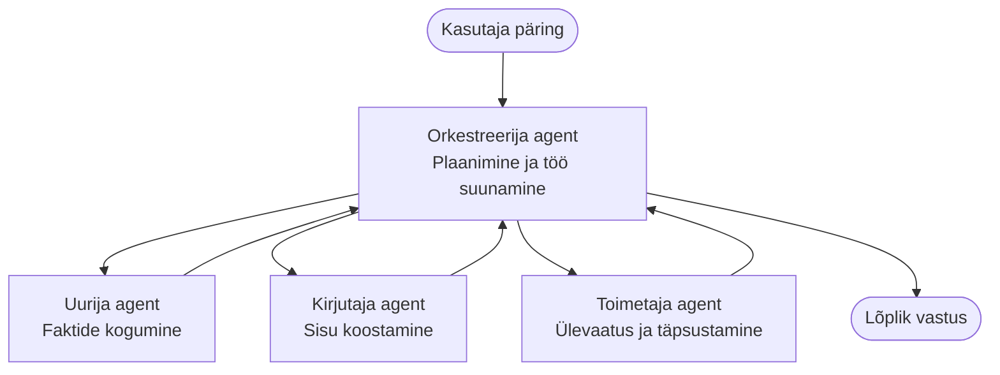

# Multiagentide põhialused – juuruta oma esimene koordineeritud tehisintellekti süsteem

**Kursuse navigeerimine:**
- **📚 Kursuse avaleht**: [AZD algajatele](../../README.md)
- **📖 Praegune peatükk**: Peatükk 5 – multiagentide tehisintellekti lahendused
- **⬅️ Eelmine**: [Peatükk 4: infrastruktuur](../chapter-04-infrastructure/README.md)
- **➡️ Järgmine**: [Koordineerimismustrid](../chapter-06-pre-deployment/coordination-patterns.md)

> Kontrollitud versiooniga `azd 1.27.1` 2026. aasta juulis.

## Sissejuhatus

Eelnevates peatükkides juurutasid ühe rakenduse — ja peatükis 2 ühe AI-agendi. See õppetund astub järgmise sammu: juurutades **multiagentide süsteemi**, kus mitu spetsialiseerunud agenti töötavad koos, et lahendada probleem, mida üks agent üksi hästi lahendada ei suudaks.

Hea uudis algajatele: **sul ei ole vaja uusi käske.** Multiagentide lahendus on ikka azd-projekt. Sa teed `azd init`, `azd up`, testid ja `azd down` — täpselt see töövoog, mida sa juba tead. Muutub ainult rakenduse *kuju* seespool.

## Õpieesmärgid

Selle õppetunni lõpuks sa:
- Mõistad, mida tähendab "multiagent" ja millal see lisakompleksus on kasulik
- Tunned ära tavalisi rolle multiagentide süsteemis (koordinaator + spetsialistid)
- Juurutad töötava multiagentide malli `azd up` abil
- Mõistad Azure ressursse, mis multiagentide rakendust toetavad
- Tead, kuidas lahendust turvaliselt kinnitada, kohandada ja maha võtta

## Õppe tulemused

Pärast selle õppetunni läbimist suudad:
- Selgitada erinevust ühe agendi ja multiagendi süsteemi vahel
- Valida ühe agendi koos tööriistade ja tõelise multiagendi disaini vahel
- Juurutada ja testida multiagentide malli algusest lõpuni `azd` abil
- Tuvastada, kus iga agent töötab ja kuidas nad suhtlevad
- Puhastada kõik ressursid, et vältida edasisi kulusid

---

## Mis on multiagentide süsteem?

Üksik AI agent on üks mudel koos juhisteseeriaga ja (valikuliselt) mõnede tööriistadega. See sobib hästi fookustatud ülesannete jaoks. Aga kui ülesanne kasvab — uurimustöö, siis kirjutamine, siis toimetamine, seejärel faktikontroll — kõike ühes juhises kokku surumine teeb agendi aeglasemaks, vähem usaldusväärseks ja raskemini silutavaks.

**Multiagentide süsteem** jagab töö spetsialistideks, kes teevad igaüks ühte asja hästi, juhib koordinaator:



### Kaks rolli, mida alati näed

| Roll | Ülesanne | Näide |
|------|----------|--------|
| **Koordinaator** | Otsustab *mis juhtub järgmisena* ja suunab tööd agentide vahel | "Esimene uurimus, siis kirjutamine, siis toimetamine" |
| **Spetsialist** | Teeb ühe fookustatud töö ja tagastab tulemuse | "Uurija", kes kogub vaid fakte |

### Kas sul on tegelikult vaja mitut agenti?

Alusta lihtsast. Kasuta multiagenti **ainult** kui üks järgmistest tingimustest kehtib:

- ✅ Ülesandel on **erinevad etapid**, mis vajavad eri juhiseid (uurimine vs kirjutamine vs ülevaatus)
- ✅ Soovid, et spetsialistid töötaksid **paralleelselt**, et aega säästa
- ✅ Erinevad sammud vajavad **erinevaid tööriistu või andmeallikaid**
- ✅ Iga sammu tuleb saaks eraldiseisvalt testida ja siluda

Kui sinu ülesanne on üks küsimus-vastus või lihtne tööriista kutsumine, siis **üks agent tööriistadega** (peatükk 2) on lihtsam, odavam ja kergem hallata.

> **Algaja nõuanne:** "Rohkem agente" ei tähenda "paremat". Iga agent lisab latentsust, kulu ja uue asja, mida jälgida. Lisa agente vaid siis, kui probleem jaguneb selgelt osadeks.

---

## Kaks viisi multiagentide ehitamiseks Azure'is

| Lähenemine | Mis see on | Parim kasutusala |
|----------|-----------|-----------------|
| **Üks agent + tööriistad** | Üks Foundry agent, kes kutsub funktsioone/tööriistu | Lihtsad töövood, alustamine |
| **Mitu koordineeritud agenti** | Mitmed agentid koos koordinaatoriga | Erinevad etapid, paralleelne töö, spetsialiseerumine |

See õppetund keskendub teisele lähenemisele kasutades **valmis malli**, et saaksid näha tõelist multiagentide süsteemi enne enda ehitamist.

---

## Praktiline: juuruta töötav multiagentide rakendus

Juurutame **Contoso Creative Writer** – ametliku Azure näidise, mis kasutab mitut agenti (uurija, kirjutaja, toimetaja), koordineeritult artikli tootmiseks. See on suurepärane esimene multiagentide rakendus, sest rollid on lihtsad mõista.

### 1. samm: mallide initsialiseerimine

```bash
# Loo töökaust
mkdir creative-writer && cd creative-writer

# Algata ametlikust mitmeagendi mallist
azd init --template contoso-creative-writer
```

> Vaata rohkem multiagentide malle igal ajal [Awesome AZD AI galeriist](https://azure.github.io/awesome-azd/?tags=ai). Teised algajasõbralikud valikud on `get-started-with-ai-agents` ja `azure-ai-travel-agents`.

### 2. samm: autentimine

```bash
# Vajalik azd töövoogude jaoks
azd auth login
```

### 3. samm: keskkonna loomine

```bash
azd env new dev
```

### 4. samm: eelvaade, siis juurutus

```bash
# Vaata, mis luuakse enne midagi kulutamist (soovitatav)
azd provision --preview

# Hangi infrastruktuur ja juhi kõik agendid sisse ühe sammuga
azd up
```

`azd up` küsib tellimust ja piirkonda, seejärel proviisib Azure ressursid ja juurutab rakenduse. AI juurutused võivad võtta rohkem aega kui lihtne veebiapp — kui juurutad suuremaid mudeleid, saad pikendada juurutuse ajatamist:

```bash
azd deploy --timeout 1800
```

> **Kulude ja mahu märkus:** multiagentide rakendused juurutavad AI mudeleid, mis kasutavad kvota ja tekitavad kulusid. Kui `azd up` ebaõnnestub mudeli kvota pärast, vaata [AI tõrkeotsingut](../chapter-07-troubleshooting/ai-troubleshooting.md) piirkonna ja kvota lahenduste jaoks ning peatükk 6 [mahu planeerimist](../chapter-06-pre-deployment/capacity-planning.md).

---

## Arusaamine, mida sa juurutasid

Tüüpiline selline multiagentide rakendus loob hulga Azure ressursse, mis vastavad otse ülaltoodud vastutusaladele:

| Ressurss | Miks see seal on |
|----------|----------------|
| **Microsoft Foundry / mudelid** | Hõivab keelemudeleid, mida iga agent kasutab |
| **Azure AI Search** | Annab uurija agendile otsinguandmed |
| **Container Apps** (või App Service) | Hõivab koordinaatori ja agendi koodi |
| **Cosmos DB** (mõnes näites) | Salvestab agentide vahel jagatud olekut/mälu |
| **Application Insights** | Jälgib päringuid *agentide vahel*, et saaksid sujuvust siluda |

### Kuidas agentid omavahel suhtlevad

Enamikes azd multiagentide näidistes jookseb **koordinaator sinu rakenduse koodis** (näiteks kasutades Semantic Kernel või Microsoft Agent Framework raamistikku). Koordinaator kutsub iga spetsialisti järjest, edastab tulemused ja kogub lõpliku vastuse kokku. Agendid jagavad konteksti läbi:

- **Funktsioonide/tööriistade kutsed** — koordinaator kutsub spetsialisti ja saab tulemuse tagasi
- **Jagatud mälu** — andmebaas (tihti Cosmos DB) hoiab olekut, mida mõlemad agentid loevad
- **Sõnumid/sündmused** — lõdvemaks ühendamiseks suhtlevad agentid järjekorra või Service Busi kaudu

> **Miks see on silumise jaoks oluline:** kuna iga samm on eraldiseisev, näitab Application Insights sulle *milline* agent oli aeglane või ebaõnnestus. See on suur põhjus töö agentide vahel jagada.

---

## Kontrolli juurutust

Veendu, et süsteem tõesti töötab enne edasi liikumist:

```bash
# Näita paigaldatud otspunktid
azd show

# Ava rakenduse jälgimise juhtpaneel
azd monitor

# Jälgi logisid, kui midagi tundub kahtlane
azd monitor --logs
```

Seejärel ava rakenduse aadress `azd show` käsklusest ja proovi päringut, mis kasutab kõiki agente (Creative Writeri puhul palu kirjutada lühike artikkel mingi teema kohta). Application Insights **tehingute otsingus** peaksid nägema päringu laialijagunemist uurija, kirjutaja ja toimetaja etappide vahel.

**Õnnestumise tingimused:**
- ✅ `azd show` näitab kättesaadavat lõpp-punkti
- ✅ Päring annab tulemuse, mis möödub selgelt mitmest etapist
- ✅ Application Insights näitab jälgi rohkem kui ühest agenti etapist

---

## Kohanda: lisa või muuda agenti

Kuna iga agent on lihtsalt juhised pluss tööriistad, on kohandamine ligipääsetav:

1. **Leia agendi definitsioonid** mallist (tihti `prompts/`, `agents/` või `*.prompty` failid).
2. **Säti agendi juhiseid** — näiteks käskida toimetaja agendil rakendada konkreetset stiili või sõnade arvu.
3. **Juuruta uuesti ainult kood** (infrastruktuur jääb muutumatuks):

   ```bash
   azd deploy
   ```

Edasi ja ehita agente oma *enda* manifesteerimise põhjal, kasutades agendi laiendust ja selle täis elutsüklit:

```bash
azd extension install azure.ai.agents
azd ai agent init -m agent-manifest.yaml
azd up
azd ai agent invoke      # test, koos reageerimisajaga
```

Vaata [Peatükk 2: Agendid](../chapter-02-ai-development/agents.md) ja [AZD AI CLI viidet](../chapter-08-production/production-ai-practices.md#azd-ai-cli-commands-and-extensions) agendi täis elutsükli kohta (`invoke`, `eval generate`, `optimize`, `delete`).

---

## Puhasta

Multiagentide rakendused kasutavad mitut arvestatavat teenust. Võta kõik alla, kui oled lõpetanud:

```bash
azd down --force --purge
```

Lipuga `--purge` eemaldatakse ka pehmel viisil kustutatud AI ressursid (näiteks Foundry/Azure AI Services kontod), et need ei blokeeriks tulevast juurutust ega tooks jätkuvalt kulusid.

---

## Märkus tootmises kasutatavate multiagentide süsteemide kohta

Selles repositooriumis olev [Retail Multi-Agent Solution](../../examples/retail-scenario.md) on **arhitektuuri lähtejoon**, mitte ühe käsu mall — see dokumenteerib, kuidas tootmislikes jaemüügisüsteeme *ehitatakse* (ja ütleb selgelt, et täielik ehitus on märkimisväärne töö). Kasuta seda disaini referentsina *pärast* töötava näidise juurutamist siin. Tootmisküsimuste (vastupidavus, kulud, jälgimine, haldus) jaoks vaata Peatükk 8: [Tootmispiirkonna tehisintellekti praktikad](../chapter-08-production/production-ai-practices.md).

---

## Kokkuvõte

- Multiagentide süsteem jagab töö spetsialistide vahel, mida koordineerib koordinaator.
- Kasuta seda ainult, kui ülesandel on eristatavad etapid, paralleelsus või igal sammul erinevad tööriistad — muidu eelistada ühte agenti.
- azd töövoog jääb muutumatuks: `azd init` → `azd up` → test → `azd down`.
- Tõeline mall nagu `contoso-creative-writer` laseb sul kohe näha ja kohandada töötavat multiagentide rakendust.
- Application Insightsi jälgimine agentide vahel on üks suurimaid praktilisi eeliseid multiagentide disainis.

---

## 🔗 Navigeerimine

| Suund | Õppetund |
|--------|----------|
| **Eelmine** | [Peatükk 4: infrastruktuur](../chapter-04-infrastructure/README.md) |
| **Järgmine** | [Koordineerimismustrid](../chapter-06-pre-deployment/coordination-patterns.md) |

## 📖 Seotud ressursid

- [AI Agentide juhend](../chapter-02-ai-development/agents.md)
- [Koordineerimismustrid](../chapter-06-pre-deployment/coordination-patterns.md)
- [Tootmise AI praktikad](../chapter-08-production/production-ai-practices.md)
- [AI tõrkeotsing](../chapter-07-troubleshooting/ai-troubleshooting.md)

---

<!-- CO-OP TRANSLATOR DISCLAIMER START -->
**Lahtiütlus**:
See dokument on tõlgitud kasutades AI tõlketeenust [Co-op Translator](https://github.com/Azure/co-op-translator). Kuigi me püüdleme täpsuse poole, palun pange tähele, et automatiseeritud tõlgetes võib esineda vigu või ebatäpsusi. Originaaldokument selle emakeeles tuleks pidada autoriteetseks allikaks. Olulise teabe puhul soovitatakse kasutada professionaalset inimtõlget. Me ei vastuta selle tõlkega seotud eksimustest või valesti mõistmistest.
<!-- CO-OP TRANSLATOR DISCLAIMER END -->