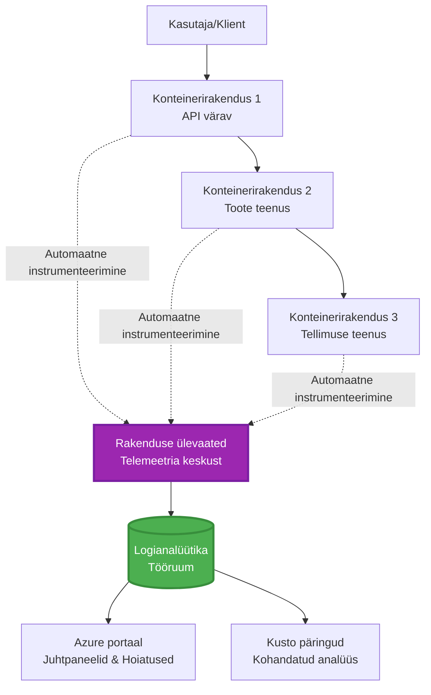
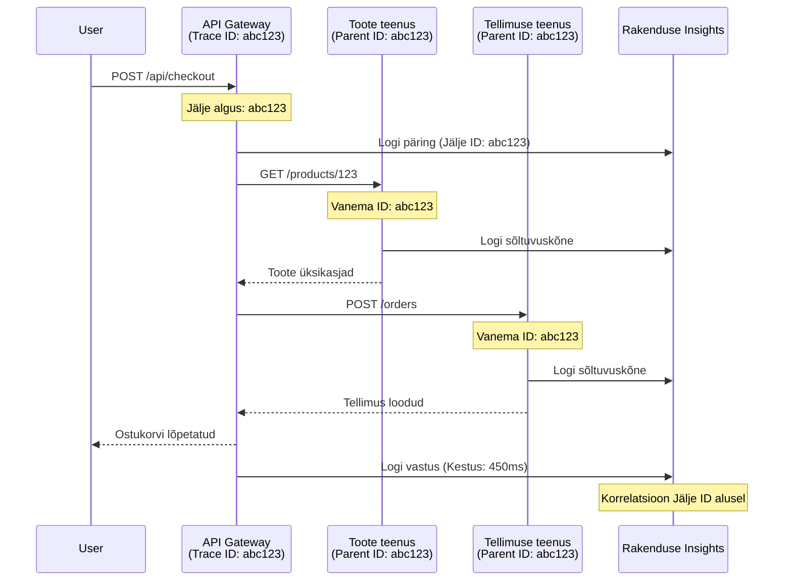

# Application Insightsi integratsioon AZD-ga

⏱️ **Eelnev aeg**: 40-50 minutit | 💰 **Kulu mõju**: ~$5-15/kuus | ⭐ **Keerukus**: Kesktase

**📚 Õppeteek:**
- ← Eelmine: [Preflight Checks](preflight-checks.md) - Eelpaigalduse valideerimine
- 🎯 **Oled siin**: Application Insightsi integratsioon (Monitooring, telemeetria, silumine)
- → Järgmine: [Deployment Guide](../chapter-04-infrastructure/deployment-guide.md) - Deploy Azure’i keskkonda
- 🏠 [Kursuse avaleht](../../README.md)

---

## Mida Sa Õpid

Selle õppetunni läbimisel:
- Integreerid **Application Insightsi** automaatselt AZD projektidesse
- Konfigureerid **jaotatud jälgimise** mikroteenuste jaoks
- Rakendad **kohandatud telemeetriat** (mõõdikud, sündmused, sõltuvused)
- Seadistad **reaalajas mõõdikud** otse jälgimiseks
- Loobid **hoiatused ja armatuurlaud** AZD deploydest
- Silud tootmisvead **telemeetria päringute** abil
- Optimeerid **kulusid ja proovivõtu strateegiaid**
- Monitoorid **AI/LLM rakendusi** (tokenid, latentsus, kulud)

## Miks on Application Insights koos AZD-ga oluline

### Väljakutse: tootmise jälgitavus

**Ilma Application Insightsita:**
```
❌ No visibility into production behavior
❌ Manual log aggregation across services
❌ Reactive debugging (wait for customer complaints)
❌ No performance metrics
❌ Cannot trace requests across services
❌ Unknown failure rates and bottlenecks
```

**Application Insightsiga + AZD-ga:**
```
✅ Automatic telemetry collection
✅ Centralized logs from all services
✅ Proactive issue detection
✅ End-to-end request tracing
✅ Performance metrics and insights
✅ Real-time dashboards
✅ AZD provisions everything automatically
```

**Analoogia**: Application Insights on nagu “must kasti” lennuandur + piloodi armatuurlaud sinu rakendusele. Sa näed kõike, mis toimub reaalajas ja saad igat intsidenti tagantjärele mängida.

---

## Arhitektuuri ülevaade

### Application Insights AZD arhitektuuris


### Mis jälgitakse automaatselt

| Telemeetria tüüp | Mida see hõlmab     | Kasutusjuhtum         |
|------------------|--------------------|-----------------------|
| **Päringud**     | HTTP päringud, staatuskoodid, kestvus | API jõudluse jälgimine |
| **Sõltuvused**   | Välised kõned (DB, APId, salvestus)   | Pudelikaelade tuvastamine |
| **Erandid**     | Käitlemata vead koos virnatrassiga      | Vigade silumine        |
| **Kohandatud sündmused** | Ärisündmused (registreerimine, ost) | Analüütika ja konverterid |
| **Mõõdikud**    | Jõudluse loendurid, kohandatud mõõdikud | Võimsusplaanimine      |
| **Jäljed**      | Logisõnumid raskuse astmega              | Silumine ja auditeerimine |
| **Saadavus**    | Uptime ja vastuseaegade testid            | SLA jälgimine          |

---

## Eeltingimused

### Vajalikud tööriistad

```bash
# Kontrolli Azure Developer CLI-d
azd version
# ✅ Oodatud: azd versioon 1.0.0 või uuem

# Kontrolli Azure CLI-d
az --version
# ✅ Oodatud: azure-cli 2.50.0 või uuem
```

### Azure nõuded

- Aktiivne Azure tellimus
- Õigused luua:
  - Application Insights ressursse
  - Log Analytics tööruume
  - Container Applikatsioone
  - Ressursigruppesid

### Teadmiste eeldused

Sul peaks olema tehtud:
- [AZD alused](../chapter-01-foundation/azd-basics.md) - AZD põhimõisted
- [Konfiguratsioon](../chapter-03-configuration/configuration.md) - Keskkonna seadistus
- [Esimene projekt](../chapter-01-foundation/first-project.md) - Põhjadeploy

---

## Õppetund 1: Automaatne Application Insights AZD-ga

### Kuidas AZD kuvab Application Insightsi

AZD loob ja konfigureerib Application Insightsi automaatselt, kui Sa deployd. Vaatame kuidas see töötab.

### Projektistruktuur

```
monitored-app/
├── azure.yaml                     # AZD configuration
├── infra/
│   ├── main.bicep                # Main infrastructure
│   ├── core/
│   │   └── monitoring.bicep      # Application Insights + Log Analytics
│   └── app/
│       └── api.bicep             # Container App with monitoring
└── src/
    ├── app.py                    # Application with telemetry
    ├── requirements.txt
    └── Dockerfile
```

---

### Samm 1: AZD konfiguratsioon (azure.yaml)

**Fail: `azure.yaml`**

```yaml
name: monitored-app
metadata:
  template: monitored-app@1.0.0

services:
  api:
    project: ./src
    language: python
    host: containerapp

# AZD automatically provisions monitoring!
```

**See ongi kõik!** AZD loob vaikimisi Application Insightsi. Lisakonfiguratsiooni pole vaja põhiliseks monitooringuks.

---

### Samm 2: Monitooringu infrastruktuur (Bicep)

**Fail: `infra/core/monitoring.bicep`**

```bicep
param logAnalyticsName string
param applicationInsightsName string
param location string = resourceGroup().location
param tags object = {}

// Log Analytics Workspace (required for Application Insights)
resource logAnalytics 'Microsoft.OperationalInsights/workspaces@2022-10-01' = {
  name: logAnalyticsName
  location: location
  tags: tags
  properties: {
    sku: {
      name: 'PerGB2018'  // Pay-as-you-go pricing
    }
    retentionInDays: 30  // Keep logs for 30 days
    features: {
      enableLogAccessUsingOnlyResourcePermissions: true
    }
  }
}

// Application Insights
resource applicationInsights 'Microsoft.Insights/components@2020-02-02' = {
  name: applicationInsightsName
  location: location
  tags: tags
  kind: 'web'
  properties: {
    Application_Type: 'web'
    WorkspaceResourceId: logAnalytics.id
    IngestionMode: 'LogAnalytics'
    publicNetworkAccessForIngestion: 'Enabled'
    publicNetworkAccessForQuery: 'Enabled'
  }
}

// Outputs for Container Apps
output logAnalyticsWorkspaceId string = logAnalytics.id
output logAnalyticsWorkspaceName string = logAnalytics.name
output applicationInsightsConnectionString string = applicationInsights.properties.ConnectionString
output applicationInsightsInstrumentationKey string = applicationInsights.properties.InstrumentationKey
output applicationInsightsName string = applicationInsights.name
```

---

### Samm 3: Ühenda Container App Application Insightsiga

**Fail: `infra/app/api.bicep`**

```bicep
param name string
param location string
param tags object = {}
param containerAppsEnvironmentName string
param applicationInsightsConnectionString string

resource containerApp 'Microsoft.App/containerApps@2023-05-01' = {
  name: name
  location: location
  tags: tags
  properties: {
    configuration: {
      ingress: {
        external: true
        targetPort: 8000
      }
      secrets: [
        {
          name: 'appinsights-connection-string'
          value: applicationInsightsConnectionString
        }
      ]
    }
    template: {
      containers: [
        {
          name: 'api'
          image: 'myregistry.azurecr.io/api:latest'
          resources: {
            cpu: json('0.5')
            memory: '1Gi'
          }
          env: [
            {
              name: 'APPLICATIONINSIGHTS_CONNECTION_STRING'
              secretRef: 'appinsights-connection-string'
            }
            {
              name: 'APPLICATIONINSIGHTS_ENABLED'
              value: 'true'
            }
          ]
        }
      ]
    }
  }
}

output uri string = 'https://${containerApp.properties.configuration.ingress.fqdn}'
```

---

### Samm 4: Rakenduskood koos Telemeetriaga

**Fail: `src/app.py`**

```python
from flask import Flask, request, jsonify
from opencensus.ext.azure.log_exporter import AzureLogHandler
from opencensus.ext.azure.trace_exporter import AzureExporter
from opencensus.ext.flask.flask_middleware import FlaskMiddleware
from opencensus.trace.samplers import ProbabilitySampler
import logging
import os

app = Flask(__name__)

# Hangi Application Insights ühendusstring
connection_string = os.environ.get('APPLICATIONINSIGHTS_CONNECTION_STRING')

if connection_string:
    # Konfigureeri hajutatud jälgimine
    middleware = FlaskMiddleware(
        app,
        exporter=AzureExporter(connection_string=connection_string),
        sampler=ProbabilitySampler(rate=1.0)  # 100% proovivõtt arenduseks
    )
    
    # Konfigureeri logimine
    logger = logging.getLogger(__name__)
    logger.addHandler(AzureLogHandler(connection_string=connection_string))
    logger.setLevel(logging.INFO)
    
    print("✅ Application Insights enabled")
else:
    logger = logging.getLogger(__name__)
    logger.setLevel(logging.INFO)
    print("⚠️ Application Insights not configured")

@app.route('/health')
def health():
    logger.info('Health check endpoint called')
    return jsonify({'status': 'healthy', 'monitoring': 'enabled'})

@app.route('/api/products')
def get_products():
    logger.info('Fetching products')
    
    # Simuleeri andmebaasi kõnet (tuvastatakse automaatselt sõltuvusena)
    products = [
        {'id': 1, 'name': 'Laptop', 'price': 999.99},
        {'id': 2, 'name': 'Mouse', 'price': 29.99},
        {'id': 3, 'name': 'Keyboard', 'price': 79.99}
    ]
    
    logger.info(f'Returned {len(products)} products')
    return jsonify(products)

@app.route('/api/error-test')
def error_test():
    """Test error tracking"""
    logger.error('Testing error tracking')
    try:
        raise ValueError('This is a test exception')
    except Exception as e:
        logger.exception('Exception occurred in error-test endpoint')
        return jsonify({'error': str(e)}), 500

@app.route('/api/slow')
def slow_endpoint():
    """Test performance tracking"""
    import time
    logger.info('Slow endpoint called')
    time.sleep(3)  # Simuleeri aeglast toimingut
    logger.warning('Endpoint took 3 seconds to respond')
    return jsonify({'message': 'Slow operation completed'})

if __name__ == '__main__':
    app.run(host='0.0.0.0', port=8000)
```

**Fail: `src/requirements.txt`**

```txt
Flask==3.0.0
opencensus-ext-azure==1.1.13
opencensus-ext-flask==0.8.1
gunicorn==21.2.0
```

---

### Samm 5: Deploy ja Kontrolli

```bash
# Algata AZD
azd init

# Käivita (pakub automaatselt Application Insightsi)
azd up

# Hangi rakenduse URL
APP_URL=$(azd env get-values | grep API_URL | cut -d '=' -f2 | tr -d '"')

# Loo telemeetria
curl $APP_URL/health
curl $APP_URL/api/products
curl $APP_URL/api/error-test
curl $APP_URL/api/slow
```

**✅ Oodatav väljund:**
```json
{
  "status": "healthy",
  "monitoring": "enabled"
}
```

---

### Samm 6: Telemeetria vaatamine Azure portaalis

```bash
# Hangi Application Insights'i üksikasjad
azd env get-values | grep APPLICATIONINSIGHTS

# Ava Azure'i portaalis
az monitor app-insights component show \
  --app $(azd env get-values | grep APPLICATIONINSIGHTS_NAME | cut -d '=' -f2 | tr -d '"') \
  --resource-group $(azd env get-values | grep AZURE_RESOURCE_GROUP | cut -d '=' -f2 | tr -d '"') \
  --query "appId" -o tsv
```

**Mine Azure portaal → Application Insights → Transaction Search**

Pead nägema:
- ✅ HTTP päringud staatuskoodidega
- ✅ Päringu kestvus (üle 3 sekundi `/api/slow` jaoks)
- ✅ Erandite detailid `/api/error-test` kaudu
- ✅ Kohandatud logisõnumid

---

## Õppetund 2: Kohandatud telemeetria ja sündmused

### Ärisündmuste jälgimine

Lisame kohandatud telemeetria ärikriitiliste sündmuste jaoks.

**Fail: `src/telemetry.py`**

```python
from opencensus.ext.azure import metrics_exporter
from opencensus.stats import aggregation as aggregation_module
from opencensus.stats import measure as measure_module
from opencensus.stats import stats as stats_module
from opencensus.stats import view as view_module
from opencensus.tags import tag_map as tag_map_module
from opencensus.ext.azure.log_exporter import AzureLogHandler
from opencensus.ext.azure.trace_exporter import AzureExporter
from opencensus.trace import tracer as tracer_module
import logging
import os

class TelemetryClient:
    """Custom telemetry client for Application Insights"""
    
    def __init__(self, connection_string=None):
        self.connection_string = connection_string or os.environ.get('APPLICATIONINSIGHTS_CONNECTION_STRING')
        
        if not self.connection_string:
            print("⚠️ Application Insights connection string not found")
            return
        
        # Logija seadistamine
        self.logger = logging.getLogger(__name__)
        self.logger.addHandler(AzureLogHandler(connection_string=self.connection_string))
        self.logger.setLevel(logging.INFO)
        
        # Mõõdikute eksportija seadistamine
        self.stats = stats_module.stats
        self.view_manager = self.stats.view_manager
        self.stats_recorder = self.stats.stats_recorder
        
        exporter = metrics_exporter.new_metrics_exporter(
            connection_string=self.connection_string
        )
        self.view_manager.register_exporter(exporter)
        
        # Jälgija seadistamine
        self.tracer = tracer_module.Tracer(
            exporter=AzureExporter(connection_string=self.connection_string)
        )
        
        print("✅ Custom telemetry client initialized")
    
    def track_event(self, event_name: str, properties: dict = None):
        """Track custom business event"""
        properties = properties or {}
        self.logger.info(
            f"CustomEvent: {event_name}",
            extra={
                'custom_dimensions': {
                    'event_name': event_name,
                    **properties
                }
            }
        )
    
    def track_metric(self, metric_name: str, value: float, properties: dict = None):
        """Track custom metric"""
        properties = properties or {}
        self.logger.info(
            f"CustomMetric: {metric_name} = {value}",
            extra={
                'custom_dimensions': {
                    'metric_name': metric_name,
                    'value': value,
                    **properties
                }
            }
        )
    
    def track_dependency(self, name: str, dependency_type: str, duration: float, success: bool):
        """Track external dependency call"""
        with self.tracer.span(name=name) as span:
            span.add_attribute('dependency.type', dependency_type)
            span.add_attribute('duration', duration)
            span.add_attribute('success', success)

# Globaalne telemeetria klient
telemetry = TelemetryClient()
```

### Rakenduse uuendus kohandatud sündmustega

**Fail: `src/app.py` (täiendatud)**

```python
from flask import Flask, request, jsonify
from telemetry import telemetry
import time
import random

app = Flask(__name__)

@app.route('/api/purchase', methods=['POST'])
def purchase():
    """Track purchase event with custom telemetry"""
    data = request.json
    product_id = data.get('product_id')
    quantity = data.get('quantity', 1)
    price = data.get('price', 0)
    
    # Jälgi ärisündmust
    telemetry.track_event('Purchase', {
        'product_id': product_id,
        'quantity': quantity,
        'total_amount': price * quantity,
        'user_id': request.headers.get('X-User-Id', 'anonymous')
    })
    
    # Jälgi tulu mõõdikut
    telemetry.track_metric('Revenue', price * quantity, {
        'product_id': product_id,
        'currency': 'USD'
    })
    
    return jsonify({
        'order_id': f'ORD-{random.randint(1000, 9999)}',
        'status': 'confirmed',
        'total': price * quantity
    })

@app.route('/api/search')
def search():
    """Track search queries"""
    query = request.args.get('q', '')
    
    start_time = time.time()
    
    # Simuleeri otsingut (oleks päris andmebaasi päring)
    results = [{'id': 1, 'name': f'Result for {query}'}]
    
    duration = (time.time() - start_time) * 1000  # Muuda millisekunditeks
    
    # Jälgi otsingusündmust
    telemetry.track_event('Search', {
        'query': query,
        'results_count': len(results),
        'duration_ms': duration
    })
    
    # Jälgi otsingu jõudlusmõõdikut
    telemetry.track_metric('SearchDuration', duration, {
        'query_length': len(query)
    })
    
    return jsonify({'results': results, 'count': len(results)})

@app.route('/api/external-call')
def external_call():
    """Track external API dependency"""
    import requests
    
    start_time = time.time()
    success = True
    
    try:
        # Simuleeri välist API kõnet
        response = requests.get('https://api.example.com/data', timeout=5)
        result = response.json()
    except Exception as e:
        success = False
        result = {'error': str(e)}
    
    duration = (time.time() - start_time) * 1000
    
    # Jälgi sõltuvust
    telemetry.track_dependency(
        name='ExternalAPI',
        dependency_type='HTTP',
        duration=duration,
        success=success
    )
    
    return jsonify(result)

if __name__ == '__main__':
    app.run(host='0.0.0.0', port=8000)
```

### Katseta kohandatud telemeetriat

```bash
# Jälgi ostusündmust
curl -X POST $APP_URL/api/purchase \
  -H "Content-Type: application/json" \
  -H "X-User-Id: user123" \
  -d '{"product_id": 1, "quantity": 2, "price": 29.99}'

# Jälgi otsingusündmust
curl "$APP_URL/api/search?q=laptop"

# Jälgi välist sõltuvust
curl $APP_URL/api/external-call
```

**Vaata Azure portaalis:**

Mine Application Insights → Logs ja käivita päring:

```kusto
// View purchase events
traces
| where customDimensions.event_name == "Purchase"
| project 
    timestamp,
    product_id = tostring(customDimensions.product_id),
    total_amount = todouble(customDimensions.total_amount),
    user_id = tostring(customDimensions.user_id)
| order by timestamp desc

// View revenue metrics
traces
| where customDimensions.metric_name == "Revenue"
| summarize TotalRevenue = sum(todouble(customDimensions.value)) by bin(timestamp, 1h)
| render timechart

// View search performance
traces
| where customDimensions.event_name == "Search"
| summarize 
    AvgDuration = avg(todouble(customDimensions.duration_ms)),
    SearchCount = count()
  by bin(timestamp, 5m)
| render timechart
```

---

## Õppetund 3: Jaotatud jälgimine mikroteenuste jaoks

### Võta kasutusele ristteenuste jälgimine

Mikroteenuste puhul korreleerib Application Insights automaatselt päringuid teenuste vahel.

**Fail: `infra/main.bicep`**

```bicep
targetScope = 'subscription'

param environmentName string
param location string = 'eastus'

var tags = { 'azd-env-name': environmentName }

resource rg 'Microsoft.Resources/resourceGroups@2021-04-01' = {
  name: 'rg-${environmentName}'
  location: location
  tags: tags
}

// Monitoring (shared by all services)
module monitoring './core/monitoring.bicep' = {
  name: 'monitoring'
  scope: rg
  params: {
    logAnalyticsName: 'log-${environmentName}'
    applicationInsightsName: 'appi-${environmentName}'
    location: location
    tags: tags
  }
}

// API Gateway
module apiGateway './app/api-gateway.bicep' = {
  name: 'api-gateway'
  scope: rg
  params: {
    name: 'ca-gateway-${environmentName}'
    location: location
    tags: union(tags, { 'azd-service-name': 'gateway' })
    applicationInsightsConnectionString: monitoring.outputs.applicationInsightsConnectionString
  }
}

// Product Service
module productService './app/product-service.bicep' = {
  name: 'product-service'
  scope: rg
  params: {
    name: 'ca-products-${environmentName}'
    location: location
    tags: union(tags, { 'azd-service-name': 'products' })
    applicationInsightsConnectionString: monitoring.outputs.applicationInsightsConnectionString
  }
}

// Order Service
module orderService './app/order-service.bicep' = {
  name: 'order-service'
  scope: rg
  params: {
    name: 'ca-orders-${environmentName}'
    location: location
    tags: union(tags, { 'azd-service-name': 'orders' })
    applicationInsightsConnectionString: monitoring.outputs.applicationInsightsConnectionString
  }
}

output APPLICATIONINSIGHTS_CONNECTION_STRING string = monitoring.outputs.applicationInsightsConnectionString
output GATEWAY_URL string = apiGateway.outputs.uri
```

### Vaata lõpp-lõpuni tehingut


**Lõpp-lõpuni jälje päring:**

```kusto
// Find complete request flow
let traceId = "abc123...";  // Get from response header
dependencies
| union requests
| where operation_Id == traceId
| project 
    timestamp,
    type = itemType,
    name,
    duration,
    success,
    cloud_RoleName
| order by timestamp asc
```

---

## Õppetund 4: Reaalajas mõõdikud ja otsemonitooring

### Luba Live Metrics Stream

Live Metrics näitab telemeetriat reaalajas alla ühe sekundi viiteajaga.

**Ligipääs Live Metricsile:**

```bash
# Hangi Application Insightsi ressurss
APPI_NAME=$(azd env get-values | grep APPLICATIONINSIGHTS_NAME | cut -d '=' -f2 | tr -d '"')

# Hangi ressursside grupp
RG_NAME=$(azd env get-values | grep AZURE_RESOURCE_GROUP | cut -d '=' -f2 | tr -d '"')

echo "Navigate to: Azure Portal → Resource Groups → $RG_NAME → $APPI_NAME → Live Metrics"
```

**Mida Sa reaalajas näed:**
- ✅ Saabuvate päringute hulk (päringut sekundis)
- ✅ Väljaminevate sõltuvuste kõned
- ✅ Erandite arv
- ✅ CPU ja mälu kasutus
- ✅ Aktiivsete serverite arv
- ✅ Proovtelemeetria

### Tooke koormust testimiseks

```bash
# Genereeri koormus, et näha reaalajas mõõdikuid
for i in {1..100}; do
  curl $APP_URL/api/products &
  curl $APP_URL/api/search?q=test$i &
done

# Vaata reaalajas mõõdikuid Azure'i portaalis
# Sa peaksid nägema päringute arvu tõusu
```

---

## Praktilised harjutused

### Harjutus 1: Seadista hoiatused ⭐⭐ (Keskmine)

**Eesmärk**: Loo hoiatused kõrgete vigade määrade ja aeglaste vastuste jaoks.

**Sammud:**

1. **Loo hoiatus veamäära jaoks:**

```bash
# Hangi Application Insightsi ressursi ID
APPI_ID=$(az monitor app-insights component show \
  --app $APPI_NAME \
  --resource-group $RG_NAME \
  --query "id" -o tsv)

# Loo mõõtmelüliti ebaõnnestunud päringute jaoks
az monitor metrics alert create \
  --name "High-Error-Rate" \
  --resource-group $RG_NAME \
  --scopes $APPI_ID \
  --condition "count requests/failed > 10" \
  --window-size 5m \
  --evaluation-frequency 1m \
  --description "Alert when error rate exceeds 10 per 5 minutes"
```

2. **Loo hoiatus aeglaste vastuste jaoks:**

```bash
az monitor metrics alert create \
  --name "Slow-Responses" \
  --resource-group $RG_NAME \
  --scopes $APPI_ID \
  --condition "avg requests/duration > 3000" \
  --window-size 5m \
  --evaluation-frequency 1m \
  --description "Alert when average response time exceeds 3 seconds"
```

3. **Loo hoiatus Bicepiga (eelistatud AZD jaoks):**

**Fail: `infra/core/alerts.bicep`**

```bicep
param applicationInsightsId string
param actionGroupId string = ''
param location string = resourceGroup().location

// High error rate alert
resource errorRateAlert 'Microsoft.Insights/metricAlerts@2018-03-01' = {
  name: 'high-error-rate'
  location: 'global'
  properties: {
    description: 'Alert when error rate exceeds threshold'
    severity: 2
    enabled: true
    scopes: [
      applicationInsightsId
    ]
    evaluationFrequency: 'PT1M'
    windowSize: 'PT5M'
    criteria: {
      'odata.type': 'Microsoft.Azure.Monitor.SingleResourceMultipleMetricCriteria'
      allOf: [
        {
          name: 'Error rate'
          metricName: 'requests/failed'
          operator: 'GreaterThan'
          threshold: 10
          timeAggregation: 'Count'
        }
      ]
    }
    actions: actionGroupId != '' ? [
      {
        actionGroupId: actionGroupId
      }
    ] : []
  }
}

// Slow response alert
resource slowResponseAlert 'Microsoft.Insights/metricAlerts@2018-03-01' = {
  name: 'slow-responses'
  location: 'global'
  properties: {
    description: 'Alert when response time is too high'
    severity: 3
    enabled: true
    scopes: [
      applicationInsightsId
    ]
    evaluationFrequency: 'PT1M'
    windowSize: 'PT5M'
    criteria: {
      'odata.type': 'Microsoft.Azure.Monitor.SingleResourceMultipleMetricCriteria'
      allOf: [
        {
          name: 'Response duration'
          metricName: 'requests/duration'
          operator: 'GreaterThan'
          threshold: 3000
          timeAggregation: 'Average'
        }
      ]
    }
  }
}

output errorAlertId string = errorRateAlert.id
output slowResponseAlertId string = slowResponseAlert.id
```

4. **Testi hoiatusi:**

```bash
# Tekita vigu
for i in {1..20}; do
  curl $APP_URL/api/error-test
done

# Tekita aeglaseid vastuseid
for i in {1..10}; do
  curl $APP_URL/api/slow
done

# Kontrolli häiresaadet (oota 5-10 minutit)
az monitor metrics alert list \
  --resource-group $RG_NAME \
  --query "[].{Name:name, Enabled:enabled, State:properties.enabled}" \
  --output table
```

**✅ Edu kriteeriumid:**
- ✅ Hoiatused loodi edukalt
- ✅ Hoiatused käivituvad künniste ületamisel
- ✅ Saad vaadata hoiatusajaloo Azure portaalis
- ✅ Integreeritud AZD deployga

**Aeg**: 20-25 minutit

---

### Harjutus 2: Loo kohandatud armatuurlaud ⭐⭐ (Keskmine)

**Eesmärk**: Ehita armatuurlaud, mis kuvab olulisi rakenduse mõõdikuid.

**Sammud:**

1. **Loo armatuurlaud Azure portaali kaudu:**

Mine: Azure portaal → Armatuurlauad → Uus armatuurlaud

2. **Lisa oluliste mõõdikute plokid:**

- Päringute arv (viimase 24 tunni jooksul)
- Keskmine vastuse aeg
- Veamäär
- 5 aeglaseimat toimingut
- Kasutajate geograafiline jaotus

3. **Loo armatuurlaud Bicepiga:**

**Fail: `infra/core/dashboard.bicep`**

```bicep
param dashboardName string
param applicationInsightsId string
param location string = resourceGroup().location

resource dashboard 'Microsoft.Portal/dashboards@2020-09-01-preview' = {
  name: dashboardName
  location: location
  properties: {
    lenses: [
      {
        order: 0
        parts: [
          // Request count
          {
            position: { x: 0, y: 0, rowSpan: 4, colSpan: 6 }
            metadata: {
              type: 'Extension/Microsoft_OperationsManagementSuite_Workspace/PartType/LogsDashboardPart'
              inputs: [
                {
                  name: 'resourceId'
                  value: applicationInsightsId
                }
                {
                  name: 'query'
                  value: '''
                    requests
                    | summarize RequestCount = count() by bin(timestamp, 1h)
                    | render timechart
                  '''
                }
              ]
            }
          }
          // Error rate
          {
            position: { x: 6, y: 0, rowSpan: 4, colSpan: 6 }
            metadata: {
              type: 'Extension/Microsoft_OperationsManagementSuite_Workspace/PartType/LogsDashboardPart'
              inputs: [
                {
                  name: 'resourceId'
                  value: applicationInsightsId
                }
                {
                  name: 'query'
                  value: '''
                    requests
                    | summarize 
                        Total = count(),
                        Failed = countif(success == false)
                    | extend ErrorRate = (Failed * 100.0) / Total
                    | project ErrorRate
                  '''
                }
              ]
            }
          }
        ]
      }
    ]
  }
}

output dashboardId string = dashboard.id
```

4. **Deploy armatuurlaud:**

```bash
# Lisa main.bicep faili
module dashboard './core/dashboard.bicep' = {
  name: 'dashboard'
  scope: rg
  params: {
    dashboardName: 'dashboard-${environmentName}'
    applicationInsightsId: monitoring.outputs.applicationInsightsId
    location: location
  }
}

# Käivita juurutus
azd up
```

**✅ Edu kriteeriumid:**
- ✅ Armatuurlaud kuvab olulised mõõdikud
- ✅ Saab kinnitada Azure portaali avalehele
- ✅ Uuendab reaalajas
- ✅ Deploydav AZD-ga

**Aeg**: 25-30 minutit

---

### Harjutus 3: Monitoori AI/LLM rakendust ⭐⭐⭐ (Edasijõudnu)

**Eesmärk**: Jälgi Microsoft Foundry mudelite kasutust (tokenid, kulud, latentsus).

**Sammud:**

1. **Loo AI monitooringu wrapper:**

**Fail: `src/ai_telemetry.py`**

```python
from telemetry import telemetry
from openai import AzureOpenAI
import time

class MonitoredAzureOpenAI:
    """Microsoft Foundry Models client with automatic telemetry"""
    
    def __init__(self, api_key, endpoint, api_version="2024-02-01"):
        self.client = AzureOpenAI(
            api_key=api_key,
            api_version=api_version,
            azure_endpoint=endpoint
        )
    
    def chat_completion(self, model: str, messages: list, **kwargs):
        """Track chat completion with telemetry"""
        start_time = time.time()
        
        try:
            # Kutsu Microsoft Foundry mudeleid
            response = self.client.chat.completions.create(
                model=model,
                messages=messages,
                **kwargs
            )
            
            duration = (time.time() - start_time) * 1000  # ms
            
            # Kasutuse väljavõte
            usage = response.usage
            prompt_tokens = usage.prompt_tokens
            completion_tokens = usage.completion_tokens
            total_tokens = usage.total_tokens
            
            # Arvuta kulu (gpt-4.1 hinnakirja alusel)
            prompt_cost = (prompt_tokens / 1000) * 0.03  # $0.03 1000 tokeni kohta
            completion_cost = (completion_tokens / 1000) * 0.06  # $0.06 1000 tokeni kohta
            total_cost = prompt_cost + completion_cost
            
            # Jälgi kohandatud sündmust
            telemetry.track_event('OpenAI_Request', {
                'model': model,
                'prompt_tokens': prompt_tokens,
                'completion_tokens': completion_tokens,
                'total_tokens': total_tokens,
                'duration_ms': duration,
                'cost_usd': total_cost,
                'success': True
            })
            
            # Jälgi mõõdikuid
            telemetry.track_metric('OpenAI_Tokens', total_tokens, {
                'model': model,
                'type': 'total'
            })
            
            telemetry.track_metric('OpenAI_Cost', total_cost, {
                'model': model,
                'currency': 'USD'
            })
            
            telemetry.track_metric('OpenAI_Duration', duration, {
                'model': model
            })
            
            return response
            
        except Exception as e:
            duration = (time.time() - start_time) * 1000
            
            telemetry.track_event('OpenAI_Request', {
                'model': model,
                'duration_ms': duration,
                'success': False,
                'error': str(e)
            })
            
            raise
```

2. **Kasuta jälgitud klienti:**

```python
from flask import Flask, request, jsonify
from ai_telemetry import MonitoredAzureOpenAI
import os

app = Flask(__name__)

# Algata jälgitav OpenAI klient
openai_client = MonitoredAzureOpenAI(
    api_key=os.environ['AZURE_OPENAI_API_KEY'],
    endpoint=os.environ['AZURE_OPENAI_ENDPOINT']
)

@app.route('/api/chat', methods=['POST'])
def chat():
    data = request.json
    user_message = data.get('message')
    
    # Kutsu automaatse jälgimisega
    response = openai_client.chat_completion(
        model='gpt-4.1',
        messages=[
            {'role': 'user', 'content': user_message}
        ]
    )
    
    return jsonify({
        'response': response.choices[0].message.content,
        'tokens': response.usage.total_tokens
    })
```

3. **Päringu AI mõõdikud:**

```kusto
// Total AI spend over time
traces
| where customDimensions.event_name == "OpenAI_Request"
| where customDimensions.success == "True"
| summarize TotalCost = sum(todouble(customDimensions.cost_usd)) by bin(timestamp, 1h)
| render timechart

// Token usage by model
traces
| where customDimensions.event_name == "OpenAI_Request"
| summarize 
    TotalTokens = sum(toint(customDimensions.total_tokens)),
    RequestCount = count()
  by Model = tostring(customDimensions.model)

// Average latency
traces
| where customDimensions.event_name == "OpenAI_Request"
| summarize AvgDuration = avg(todouble(customDimensions.duration_ms))
| project AvgDurationSeconds = AvgDuration / 1000

// Cost per request
traces
| where customDimensions.event_name == "OpenAI_Request"
| extend Cost = todouble(customDimensions.cost_usd)
| summarize 
    TotalCost = sum(Cost),
    RequestCount = count(),
    AvgCostPerRequest = avg(Cost)
```

**✅ Edu kriteeriumid:**
- ✅ Iga OpenAI kõne jälgitakse automaatselt
- ✅ Tokeni kasutus ja kulud on nähtavad
- ✅ Latentsust monitooritakse
- ✅ Võimalik seadistada eelarvehoiatusi

**Aeg**: 35-45 minutit

---

## Kulu optimeerimine

### Proovivõtustrateegiad

Kontrolli kulusid, proovides osalist telemeetria salvestust:

```python
from opencensus.trace.samplers import ProbabilitySampler

# Arendus: 100% proovivõtt
sampler = ProbabilitySampler(rate=1.0)

# Tootmine: 10% proovivõtt (kulude vähendamine 90%)
sampler = ProbabilitySampler(rate=0.1)

# Adaptiivne proovivõtt (kohandub automaatselt)
from opencensus.trace.samplers import AdaptiveSampler
sampler = AdaptiveSampler()
```

**Bicepis:**

```bicep
resource applicationInsights 'Microsoft.Insights/components@2020-02-02' = {
  name: applicationInsightsName
  properties: {
    SamplingPercentage: 10  // 10% sampling
  }
}
```

### Andmete säilitus

```bicep
resource logAnalytics 'Microsoft.OperationalInsights/workspaces@2022-10-01' = {
  name: logAnalyticsName
  properties: {
    retentionInDays: 30  // Minimum (cheapest)
    // Options: 30, 31, 60, 90, 120, 180, 270, 365, 550, 730
  }
}
```

### Kulusõltuvuse tabel

| Andmemaht | Säilitus | Kuukulu |
|-----------|----------|---------|
| 1 GB/kuu  | 30 päeva | ~$2-5   |
| 5 GB/kuu  | 30 päeva | ~$10-15 |
| 10 GB/kuu | 90 päeva | ~$25-40 |
| 50 GB/kuu | 90 päeva | ~$100-150 |

**Tasuta tase**: 5 GB/kuu inbegrepen

---

## Teadmiste kontrollpunkt

### 1. Põhiline integratsioon ✓

Testi oma mõistmist:

- [ ] **K1**: Kuidas AZD loob Application Insightsi?
  - **V**: Automaatselt Bicep mallide kaudu `infra/core/monitoring.bicep`

- [ ] **K2**: Milline keskkonnamuutuja lubab Application Insightsi?
  - **V**: `APPLICATIONINSIGHTS_CONNECTION_STRING`

- [ ] **K3**: Millised on kolm peamist telemeetriatüüpi?
  - **V**: Päringud (HTTP kõned), Sõltuvused (välised kõned), Erandid (vead)

**Praktiline kontroll:**
```bash
# Kontrolli, kas Application Insights on konfigureeritud
azd env get-values | grep APPLICATIONINSIGHTS

# Kinnita, et telemeetria voolab
az monitor app-insights metrics show \
  --app $APPI_NAME \
  --resource-group $RG_NAME \
  --metric "requests/count"
```

---

### 2. Kohandatud telemeetria ✓

Testi oma mõistmist:

- [ ] **K1**: Kuidas jälgitakse kohandatud ärisündmusi?
  - **V**: Kasutades loggerit koos `custom_dimensions` või `TelemetryClient.track_event()`

- [ ] **K2**: Mis vahe on sündmustel ja mõõdikutel?
  - **V**: Sündmused on eraldi juhtumid, mõõdikud on numbrilised väärtused

- [ ] **K3**: Kuidas korreleeritakse telemeetria teenuste vahel?
  - **V**: Application Insights kasutab automaatselt `operation_Id` korrelatsiooniks

**Praktiline kontroll:**
```kusto
// Verify custom events
traces
| where customDimensions.event_name != ""
| summarize count() by tostring(customDimensions.event_name)
```

---

### 3. Tootmise monitooring ✓

Testi oma mõistmist:

- [ ] **K1**: Mis on proovivõtt ja miks seda kasutatakse?
  - **V**: Proovivõtt vähendab andmemahtu (ja kulusid) valimi võtmisel telemeetriast

- [ ] **K2**: Kuidas seadistada hoiatusi?
  - **V**: Kasuta mõõdikutel põhinevaid hoiatusi Bicepis või Azure portaalis

- [ ] **K3**: Mis vahe on Log Analyticsil ja Application Insightsil?
  - **V**: Application Insights salvestab andmed Log Analyticsi tööruumi; App Insights pakub rakenduse spetsiifilisi vaateid

**Praktiline kontroll:**
```bash
# Kontrolli proovivõtu seadistust
az monitor app-insights component show \
  --app $APPI_NAME \
  --resource-group $RG_NAME \
  --query "properties.SamplingPercentage"
```

---

## Parimad tavad

### ✅ TEE:

1. **Kasuta korrelatsioonitähiseid**
   ```python
   logger.info('Processing order', extra={
       'custom_dimensions': {
           'order_id': order_id,
           'user_id': user_id
       }
   })
   ```

2. **Seadista kriitiliste mõõdikute hoiatused**
   ```bicep
   // Error rate, slow responses, availability
   ```

3. **Kasuta struktureeritud logimist**
   ```python
   # ✅ HEA: Struktureeritud
   logger.info('User signup', extra={'custom_dimensions': {'user_id': 123}})
   
   # ❌ HALB: Struktureerimata
   logger.info(f'User 123 signed up')
   ```

4. **Monitoori sõltuvusi**
   ```python
   # Automaatselt jälgida andmebaasi päringuid, HTTP-päringuid jne.
   ```

5. **Kasuta Live Metricsit deployduste ajal**

### ❌ ÄRA TEE:

1. **Ära logi tundlikke andmeid**
   ```python
   # ❌ HALB
   logger.info(f'Login: {username}:{password}')
   
   # ✅ HEA
   logger.info('Login attempt', extra={'custom_dimensions': {'username': username}})
   ```

2. **Ära kasuta tootmises 100% proovivõttu**
   ```python
   # ❌ Kallis
   sampler = ProbabilitySampler(rate=1.0)
   
   # ✅ Kuluefektiivne
   sampler = ProbabilitySampler(rate=0.1)
   ```

3. **Ära ignoreeri “dead letter” järjekordi**

4. **Ära unusta andmete säilituse limiite**

---

## Tõrkeotsing

### Probleem: Telemeetria ei ilmu

**Diagnostika:**
```bash
# Kontrolli, kas ühendusstring on määratud
azd env get-values | grep APPLICATIONINSIGHTS

# Kontrolli rakenduse logisid Azure Monitori kaudu
azd monitor --logs

# Või kasuta Azure CLI-d konteinerirakenduste jaoks:
az containerapp logs show --name $APP_NAME --resource-group $RG_NAME --tail 50
```

**Lahendus:**
```bash
# Kontrolli ühendusstringi Container Appis
az containerapp show \
  --name $APP_NAME \
  --resource-group $RG_NAME \
  --query "properties.template.containers[0].env" \
  | grep -i applicationinsights
```

---

### Probleem: Kõrged kulud

**Diagnostika:**
```bash
# Kontrolli andmete sisselugemist
az monitor app-insights metrics show \
  --app $APPI_NAME \
  --resource-group $RG_NAME \
  --metric "availabilityResults/count"
```

**Lahendus:**
- Vähenda proovivõtu määra
- Lühenda säilitusaega
- Eemalda liigne logimine

---

## Lisa õppematerjalid

### Ametlik dokumentatsioon
- [Application Insights ülevaade](https://learn.microsoft.com/azure/azure-monitor/app/app-insights-overview)
- [Application Insights Pythonile](https://learn.microsoft.com/azure/azure-monitor/app/opencensus-python)
- [Kusto päringukeel](https://learn.microsoft.com/azure/data-explorer/kusto/query/)
- [AZD monitooring](https://learn.microsoft.com/azure/developer/azure-developer-cli/monitor-your-app)

### Järgmised sammud selles kursuses
- ← Eelmine: [Preflight Checks](preflight-checks.md)
- → Järgmine: [Deployment Guide](../chapter-04-infrastructure/deployment-guide.md)
- 🏠 [Kursuse avaleht](../../README.md)

### Seotud näited
- [Microsoft Foundry mudelite näide](../../../../examples/azure-openai-chat) - AI telemeetria
- [Mikroteenuste näide](../../../../examples/microservices) - Jaotatud jälgimine

---

## Kokkuvõte

**Õppisid:**
- ✅ Automaatne Application Insightsi loomine AZD-ga
- ✅ Kohandatud telemeetria (sündmused, mõõdikud, sõltuvused)
- ✅ Jaotatud jälgimine mikroteenuste vahel
- ✅ Reaalajas mõõdikud ja otsemonitooring
- ✅ Hoiatused ja armatuurlaudade loomine
- ✅ AI/LLM rakenduste jälgimine
- ✅ Kulusäästu strateegiad

**Olulised võtmed:**
1. **AZD provisjonide jälgimine automaatselt** - Ei mingit käsitsi seadistamist  
2. **Kasuta struktureeritud logimist** - Muudab päringud lihtsamaks  
3. **Jälgi ärisündmusi** - Mitte ainult tehnilisi mõõdikuid  
4. **Jälgi tehisintellekti kulusid** - Jälgi märke ja kulutusi  
5. **Sea üles hoiatused** - Ole proaktiivne, mitte reaktiivne  
6. **Optimeeri kulusid** - Kasuta proovivõtmist ja säilitamispiiranguid  

**Järgmised sammud:**  
1. Lõpeta praktilised harjutused  
2. Lisa Application Insights oma AZD projektidesse  
3. Loo enda meeskonnale kohandatud juhtpaneelid  
4. Õpi [Deployment Guide](../chapter-04-infrastructure/deployment-guide.md)

---

<!-- CO-OP TRANSLATOR DISCLAIMER START -->
**Vastutusest loobumine**:
See dokument on tõlgitud tehisintellekti tõlketeenuse [Co-op Translator](https://github.com/Azure/co-op-translator) abil. Kuigi me püüame tagada täpsust, tuleb arvestada, et automaatsed tõlked võivad sisaldada vigu või ebatäpsusi. Algset dokumenti selle emakeeles tuleks pidada autoriteetseks allikaks. Olulise teabe puhul on soovitatav kasutada professionaalset inimtõlget. Me ei vastuta selle tõlke kasutamisest tingitud arusaamatuste või valesti mõistmiste eest.
<!-- CO-OP TRANSLATOR DISCLAIMER END -->