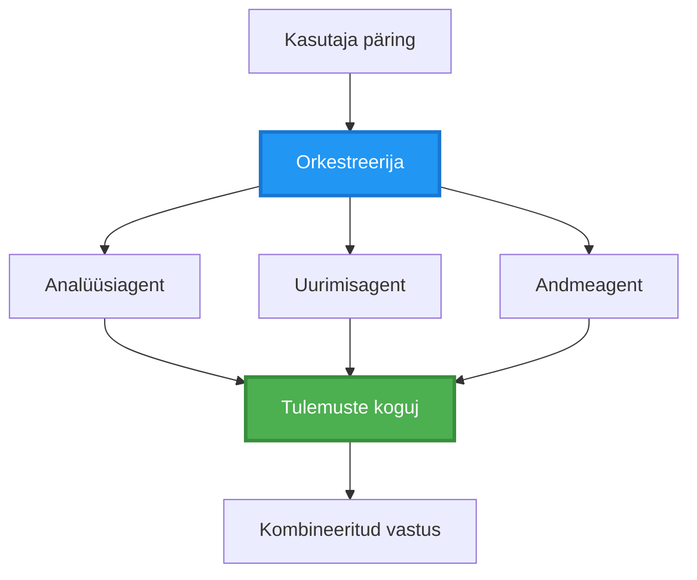
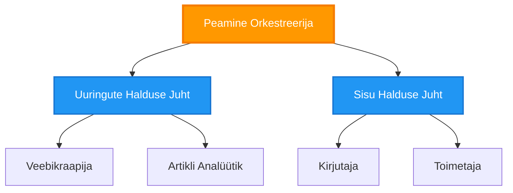
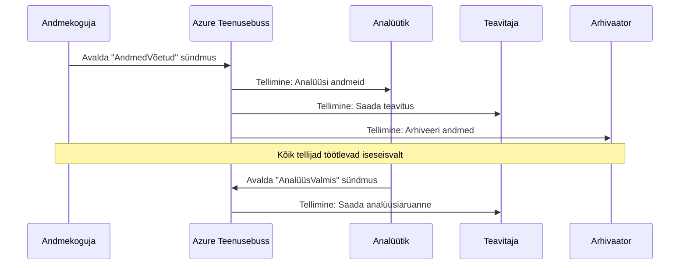
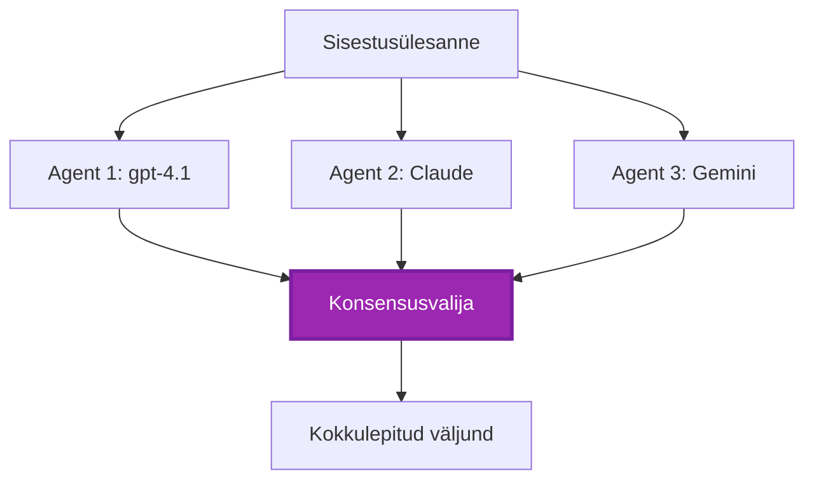
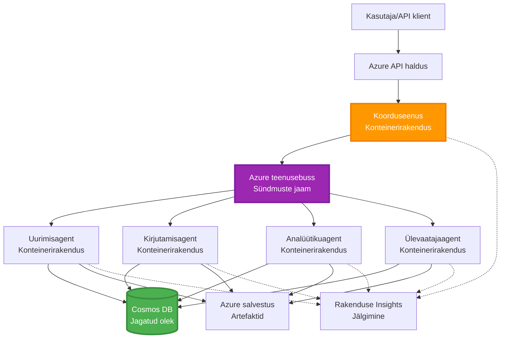

# Mitmeagendi koordineerimise mustrid

⏱️ **Eeldatav aeg**: 60–75 minutit | 💰 **Eeldatav maksumus**: ~$100-300/kuus | ⭐ **Kompleksus**: Täiustatud

**📚 Õppeteek:**
- ← Eelmine: [Võimsuse planeerimine](capacity-planning.md) – Ressursside mõõtmise ja skaleerimise strateegiad
- 🎯 **Sa oled siin**: Mitmeagendi koordineerimise mustrid (orkestreerimine, suhtlus, oleku haldus)
- → Järgmine: [SKU valik](sku-selection.md) – Õigete Azure teenuste valimine
- 🏠 [Kursuse avaleht](../../README.md)

---

## Mida sa õpid

Selle tunni läbimisel:
- Mõistad **mitmeagendi arhitektuuri** mustreid ja millal neid kasutada
- Rakendad **orkestreerimise mustreid** (tsentraliseeritud, detsentraliseeritud, hierarhiline)
- Kujundad **agentide suhtluse** strateegiaid (sünkroonne, asünkroonne, sündmuspõhine)
- Haldate **jagatud olekut** hajutatud agentide vahel
- Paigaldad **mitmeagendi süsteeme** Azure’is AZD abil
- Rakendad **koordineerimise mustreid** pärismaailma tehisintellekti stsenaariumide jaoks
- Jälgid ja silud hajutatud agentide süsteeme

## Miks mitmeagendi koordineerimine on oluline

### Evolutsioon: Ühe agendi süsteemilt mitme agendi süsteemile

**Üks agent (lihtne):**
```
User → Agent → Response
```
- ✅ Lihtne mõista ja rakendada
- ✅ Kiire lihtsate ülesannete jaoks
- ❌ Piiratud ühe mudeli võimekusega
- ❌ Ei saa keerukaid ülesandeid paralleelselt töödelda
- ❌ Puudub spetsialiseerumine

**Mitme agendi süsteem (edasijõudnud):**
```mermaid
graph TD
    Orchestrator[Orchestrator] --> Agent1[Agent1<br/>Plaani]
    Orchestrator --> Agent2[Agent2<br/>Kood]
    Orchestrator --> Agent3[Agent3<br/>Ülevaata]
```- ✅ Spetsialiseerunud agentid konkreetseteks ülesanneteks
- ✅ Paralleelne täitmine kiiruse jaoks
- ✅ Modulaarne ja hooldatav
- ✅ Väga tõhus keerukate töövoogude puhul
- ⚠️ Vajab koordineerimisloogikat

**Analoogia**: Üks agent on nagu üks inimene, kes teeb kõik tööd. Mitme agenti süsteem on nagu meeskond, kus iga liige on spetsialist (uurija, programmeerija, ülevaataja, kirjanik) ja nad teevad koostööd.

---

## Põhilised koordineerimise mustrid

### Muster 1: Järjestikune koordineerimine (Vastutusahela muster)

**Millal kasutada**: ülesanded peavad valmima kindlas järjekorras, iga agent kasutab eelneva väljundit.

```mermaid
sequenceDiagram
    participant User
    participant Orchestrator
    participant Agent1 as Uurimisagent
    participant Agent2 as Kirjutamisagent
    participant Agent3 as Toimetamisagent
    
    User->>Orchestrator: "Kirjuta artikkel tehisintellektist"
    Orchestrator->>Agent1: Uuri teemat
    Agent1-->>Orchestrator: Uurimistulemused
    Orchestrator->>Agent2: Kirjuta mustand (kasutades uurimist)
    Agent2-->>Orchestrator: Artikli mustand
    Orchestrator->>Agent3: Toimeta ja paranda
    Agent3-->>Orchestrator: Lõplik artikkel
    Orchestrator-->>User: Viimistletud artikkel
    
    Note over User,Agent3: Järjestikune: Iga samm ootab eelmist
```
**Eelised:**
- ✅ Selge andmevoog
- ✅ Lihtne siluda
- ✅ Ennustatav täitmise järjekord

**Piirangud:**
- ❌ Aeglasem (puudub paralleelsus)
- ❌ Üks tõrge blokeerib kogu ahela
- ❌ Ei suuda töödelda omavahel sõltuvaid ülesandeid

**Näited:**
- Sisutootmise torujuhe (uurimine → kirjutamine → toimetamine → avaldamine)
- Koodi genereerimine (planeerimine → rakendamine → testimine → juurutamine)
- Aruannete koostamine (andmete kogumine → analüüs → visualiseerimine → kokkuvõte)

---

### Muster 2: Paralleelne koordineerimine (Ventilaator-väljaminek/ventilaator-sissevool)

**Millal kasutada**: sõltumatud ülesanded võivad samaaegselt toimuda, tulemused koondatakse lõpus.


**Eelised:**
- ✅ Kiire (paralleelne täitmine)
- ✅ Tõrketaluvus (osalised tulemused aktsepteeritavad)
- ✅ Horisontaalne skaleerimine

**Piirangud:**
- ⚠️ Tulemused võivad saabuda vales järjekorras
- ⚠️ Vajab agregaadi loogikat
- ⚠️ Keerukas oleku haldus

**Näited:**
- Mitme allika andmete kogumine (API-d + andmebaasid + veebikraapimine)
- Konkurentsianalüüs (mitmed mudelid genereerivad lahendusi, valitakse parim)
- Tõlketeenused (samal ajal mitmesse keelde tõlkimine)

---

### Muster 3: Hierarhiline koordineerimine (Juht-tööline)

**Millal kasutada**: keerukad töövood koos alamülesannetega, vaja delegeerimist.


**Eelised:**
- ✅ Suudab hallata keerukaid töövooge
- ✅ Modulaarne ja hooldatav
- ✅ Selged vastutuspiirid

**Piirangud:**
- ⚠️ Keerulisem arhitektuur
- ⚠️ Kõrgem latentsus (mitu koordineerimise tasandit)
- ⚠️ Nõuab keerukat orkestreerimist

**Näited:**
- Ettevõtte dokumenditöötlus (klasifitseeri → suuna → töödelda → arhiveeri)
- Mitmeastmelised andmepildid (ingestimine → puhastamine → transformeerimine → analüüs → aruanne)
- Keerukad automatiseerimise töövood (planeerimine → ressursside jaotus → täitmine → jälgimine)

---

### Muster 4: Sündmusjuhitud koordineerimine (Avalda- telli)

**Millal kasutada**: agentidel tuleb reageerida sündmustele, soovitav lahtine sidusus.


**Eelised:**
- ✅ Agentide vaheline lahtine sidusus
- ✅ Lihtne lisada uusi agente (lihtsalt telli)
- ✅ Asünkroonne töötlemine
- ✅ Vastupidavus (sõnumite püsivus)

**Piirangud:**
- ⚠️ Lõppjärguline järjepidevus
- ⚠️ Keeruline silumine
- ⚠️ Sõnumite järjekorra probleemid

**Näited:**
- Reaalajas jälgimissüsteemid (häired, infomonitorid, logid)
- Mitme kanaliga teavitused (e-post, SMS, push, Slack)
- Andmetöötluse torud (mitmed sama andme tarbijad)

---

### Muster 5: Konsensuspõhine koordineerimine (Hääletus/kvorum)

**Millal kasutada**: vaja on mitme agendi kokkulepet enne jätkamist.


**Eelised:**
- ✅ Kõrgem täpsus (mitmed arvamused)
- ✅ Tõrketaluvus (väiksemad rikete osakaalud aktsepteeritavad)
- ✅ Sisseehitatud kvaliteedi tagamine

**Piirangud:**
- ❌ Kulukas (mitmeid mudelitöötlusi)
- ❌ Aeglasem (ootab kõiki agente)
- ⚠️ Vajab konfliktide lahendamist

**Näited:**
- Sisu modereerimine (mitmed mudelid hindavad sisu)
- Koodülevaatus (mitmed linters/analyüsid)
- Meditsiiniline diagnoos (mitmed tehisintellekti mudelid, ekspertide valideerimine)

---

## Arhitektuuri ülevaade

### Täielik mitme agendi süsteem Azure’is


**Peamised komponendid:**

| Komponent | Eesmärk | Azure teenus |
|-----------|---------|--------------|
| **API värav** | Sissepääsupunkt, kiiruse piiramine, autentimine | API Management |
| **Orkestreerija** | Agentide töövoogude koordineerimine | Container Apps |
| **Sõnumijärjekord** | Asünkroonne suhtlus | Service Bus / Event Hubs |
| **Agentid** | Spetsialiseerunud tehisintellekti töötajad | Container Apps / Functions |
| **Olekuhoidla** | Jagatud olek, ülesannete jälgimine | Cosmos DB |
| **Artefaktide hoidla** | Dokumendid, tulemused, logid | Blob Storage |
| **Monitooring** | Hajutatud jälgimine, logid | Application Insights |

---

## Eeldused

### Nõutavad tööriistad

```bash
# Kontrolli Azure arendaja CLI
azd version
# ✅ Oodatud: azd versioon 1.0.0 või kõrgem

# Kontrolli Azure CLI
az --version
# ✅ Oodatud: azure-cli 2.50.0 või kõrgem

# Kontrolli Dockerit (kohalikuks testimiseks)
docker --version
# ✅ Oodatud: Docker versioon 20.10 või kõrgem
```

### Azure nõudmised

- Aktiivne Azure tellimus
- Õigused luua:
  - Container Apps
  - Service Bus nimedepesad
  - Cosmos DB kontod
  - Salvesta kontod
  - Application Insights

### Eelteadmised

Peaksid olema läbinud:
- [Konfiguratsiooni haldus](../chapter-03-configuration/configuration.md)
- [Autentimine ja turvalisus](../chapter-03-configuration/authsecurity.md)
- [Mikroteenuste näide](../../../../examples/microservices)

---

## Rakendamise juhend

### Projekti struktuur

```
multi-agent-system/
├── azure.yaml                    # AZD configuration
├── infra/
│   ├── main.bicep               # Main infrastructure
│   ├── core/
│   │   ├── servicebus.bicep     # Message queue
│   │   ├── cosmos.bicep         # State store
│   │   ├── storage.bicep        # Artifact storage
│   │   └── monitoring.bicep     # Application Insights
│   └── app/
│       ├── orchestrator.bicep   # Orchestrator service
│       └── agent.bicep          # Agent template
└── src/
    ├── orchestrator/            # Orchestration logic
    │   ├── app.py
    │   ├── workflows.py
    │   └── Dockerfile
    ├── agents/
    │   ├── research/            # Research agent
    │   ├── writer/              # Writer agent
    │   ├── analyst/             # Analyst agent
    │   └── reviewer/            # Reviewer agent
    └── shared/
        ├── state_manager.py     # Shared state logic
        └── message_handler.py   # Message handling
```

---

## Õppetund 1: Järjestikuse koordineerimise muster

### Rakendamine: sisutootmise torujuhe

Loom terve järjestikune torujuhe: Uurimine → Kirjutamine → Toimetamine → Avaldamine

### 1. AZD konfiguratsioon

**Fail: `azure.yaml`**

```yaml
name: content-pipeline
metadata:
  template: multi-agent-sequential@1.0.0

services:
  orchestrator:
    project: ./src/orchestrator
    language: python
    host: containerapp
  
  research-agent:
    project: ./src/agents/research
    language: python
    host: containerapp
  
  writer-agent:
    project: ./src/agents/writer
    language: python
    host: containerapp
  
  editor-agent:
    project: ./src/agents/editor
    language: python
    host: containerapp
```

### 2. Taristu: Service Bus koordineerimiseks

**Fail: `infra/core/servicebus.bicep`**

```bicep
param name string
param location string
param tags object = {}

resource serviceBusNamespace 'Microsoft.ServiceBus/namespaces@2022-10-01-preview' = {
  name: name
  location: location
  tags: tags
  sku: {
    name: 'Standard'
    tier: 'Standard'
  }
  properties: {
    minimumTlsVersion: '1.2'
  }
}

// Queue for orchestrator → research agent
resource researchQueue 'Microsoft.ServiceBus/namespaces/queues@2022-10-01-preview' = {
  parent: serviceBusNamespace
  name: 'research-tasks'
  properties: {
    maxDeliveryCount: 3
    lockDuration: 'PT5M'
    deadLetteringOnMessageExpiration: true
  }
}

// Queue for research agent → writer agent
resource writerQueue 'Microsoft.ServiceBus/namespaces/queues@2022-10-01-preview' = {
  parent: serviceBusNamespace
  name: 'writer-tasks'
  properties: {
    maxDeliveryCount: 3
    lockDuration: 'PT5M'
  }
}

// Queue for writer agent → editor agent
resource editorQueue 'Microsoft.ServiceBus/namespaces/queues@2022-10-01-preview' = {
  parent: serviceBusNamespace
  name: 'editor-tasks'
  properties: {
    maxDeliveryCount: 3
    lockDuration: 'PT5M'
  }
}

output namespace string = serviceBusNamespace.name
output connectionString string = listKeys('${serviceBusNamespace.id}/AuthorizationRules/RootManageSharedAccessKey', serviceBusNamespace.apiVersion).primaryConnectionString
```

### 3. Jagatud olekuga haldur

**Fail: `src/shared/state_manager.py`**

```python
from azure.cosmos import CosmosClient, PartitionKey
from datetime import datetime
import os

class StateManager:
    """Manages shared state across agents using Cosmos DB"""
    
    def __init__(self):
        endpoint = os.environ['COSMOS_ENDPOINT']
        key = os.environ['COSMOS_KEY']
        
        self.client = CosmosClient(endpoint, key)
        self.database = self.client.get_database_client('agent-state')
        self.container = self.database.get_container_client('tasks')
    
    def create_task(self, task_id: str, task_type: str, input_data: dict):
        """Create a new task"""
        task = {
            'id': task_id,
            'type': task_type,
            'status': 'pending',
            'input': input_data,
            'created_at': datetime.utcnow().isoformat(),
            'steps': []
        }
        self.container.create_item(task)
        return task
    
    def update_task_step(self, task_id: str, step_name: str, result: dict):
        """Update task with completed step"""
        task = self.container.read_item(task_id, partition_key=task_id)
        
        task['steps'].append({
            'name': step_name,
            'completed_at': datetime.utcnow().isoformat(),
            'result': result
        })
        
        self.container.replace_item(task_id, task)
        return task
    
    def complete_task(self, task_id: str, final_result: dict):
        """Mark task as complete"""
        task = self.container.read_item(task_id, partition_key=task_id)
        task['status'] = 'completed'
        task['result'] = final_result
        task['completed_at'] = datetime.utcnow().isoformat()
        self.container.replace_item(task_id, task)
        return task
    
    def get_task(self, task_id: str):
        """Retrieve task state"""
        return self.container.read_item(task_id, partition_key=task_id)
```

### 4. Orkestreerija teenus

**Fail: `src/orchestrator/app.py`**

```python
from flask import Flask, request, jsonify
from azure.servicebus import ServiceBusClient, ServiceBusMessage
import json
import uuid
import os
from shared.state_manager import StateManager

app = Flask(__name__)
state_manager = StateManager()

# Teenuse bussi ühendus
servicebus_connection_str = os.environ['SERVICEBUS_CONNECTION_STRING']
servicebus_client = ServiceBusClient.from_connection_string(servicebus_connection_str)

@app.route('/health', methods=['GET'])
def health():
    return jsonify({'status': 'healthy', 'service': 'orchestrator'})

@app.route('/create-content', methods=['POST'])
def create_content():
    """
    Sequential workflow: Research → Write → Edit → Publish
    """
    data = request.json
    topic = data.get('topic')
    
    if not topic:
        return jsonify({'error': 'Topic required'}), 400
    
    # Loo ülesanne olekute poes
    task_id = str(uuid.uuid4())
    task = state_manager.create_task(
        task_id=task_id,
        task_type='content_creation',
        input_data={'topic': topic}
    )
    
    # Saada sõnum uurimisagendile (esimene samm)
    sender = servicebus_client.get_queue_sender('research-tasks')
    message = ServiceBusMessage(
        body=json.dumps({
            'task_id': task_id,
            'topic': topic,
            'next_queue': 'writer-tasks'  # Kuhu tulemused saata
        }),
        content_type='application/json'
    )
    
    with sender:
        sender.send_messages(message)
    
    return jsonify({
        'task_id': task_id,
        'status': 'started',
        'workflow': 'sequential',
        'steps': ['research', 'write', 'edit', 'publish'],
        'message': 'Content creation pipeline initiated'
    }), 202

@app.route('/task/<task_id>', methods=['GET'])
def get_task_status(task_id):
    """Check task status"""
    try:
        task = state_manager.get_task(task_id)
        return jsonify(task)
    except Exception as e:
        return jsonify({'error': str(e)}), 404

if __name__ == '__main__':
    app.run(host='0.0.0.0', port=8080)
```

### 5. Uurija agent

**Fail: `src/agents/research/app.py`**

```python
from azure.servicebus import ServiceBusClient, ServiceBusMessage
from openai import AzureOpenAI
import json
import os
import time
from shared.state_manager import StateManager

# Algatage kliendid
state_manager = StateManager()
servicebus_client = ServiceBusClient.from_connection_string(
    os.environ['SERVICEBUS_CONNECTION_STRING']
)

openai_client = AzureOpenAI(
    api_key=os.environ['AZURE_OPENAI_API_KEY'],
    api_version="2024-02-01",
    azure_endpoint=os.environ['AZURE_OPENAI_ENDPOINT']
)

def process_research_task(message_data):
    """Process research request and pass to writer"""
    task_id = message_data['task_id']
    topic = message_data['topic']
    next_queue = message_data['next_queue']
    
    print(f"🔬 Researching: {topic}")
    
    # Helistage Microsoft Foundry mudelitele uurimiseks
    response = openai_client.chat.completions.create(
        model="gpt-4.1",
        messages=[
            {"role": "system", "content": "You are a research assistant. Provide comprehensive research on the given topic."},
            {"role": "user", "content": f"Research this topic thoroughly: {topic}"}
        ],
        max_tokens=1500
    )
    
    research_results = response.choices[0].message.content
    
    # Uuendage olekut
    state_manager.update_task_step(
        task_id=task_id,
        step_name='research',
        result={'research': research_results}
    )
    
    # Saada järgmisele agendile (kirjutaja)
    sender = servicebus_client.get_queue_sender(next_queue)
    message = ServiceBusMessage(
        body=json.dumps({
            'task_id': task_id,
            'topic': topic,
            'research': research_results,
            'next_queue': 'editor-tasks'
        }),
        content_type='application/json'
    )
    
    with sender:
        sender.send_messages(message)
    
    print(f"✅ Research complete for task {task_id}")

def main():
    """Listen to research queue"""
    receiver = servicebus_client.get_queue_receiver('research-tasks')
    
    print("🔬 Research Agent started, listening for tasks...")
    
    with receiver:
        while True:
            messages = receiver.receive_messages(max_wait_time=5)
            for message in messages:
                try:
                    message_data = json.loads(str(message))
                    process_research_task(message_data)
                    receiver.complete_message(message)
                except Exception as e:
                    print(f"❌ Error processing message: {e}")
                    receiver.abandon_message(message)

if __name__ == '__main__':
    main()
```

### 6. Kirjutaja agent

**Fail: `src/agents/writer/app.py`**

```python
from azure.servicebus import ServiceBusClient, ServiceBusMessage
from openai import AzureOpenAI
import json
import os
from shared.state_manager import StateManager

state_manager = StateManager()
servicebus_client = ServiceBusClient.from_connection_string(
    os.environ['SERVICEBUS_CONNECTION_STRING']
)

openai_client = AzureOpenAI(
    api_key=os.environ['AZURE_OPENAI_API_KEY'],
    api_version="2024-02-01",
    azure_endpoint=os.environ['AZURE_OPENAI_ENDPOINT']
)

def process_writing_task(message_data):
    """Write article based on research"""
    task_id = message_data['task_id']
    topic = message_data['topic']
    research = message_data['research']
    next_queue = message_data['next_queue']
    
    print(f"✍️ Writing article: {topic}")
    
    # Helista Microsoft Foundry mudelitele artikli kirjutamiseks
    response = openai_client.chat.completions.create(
        model="gpt-4.1",
        messages=[
            {"role": "system", "content": "You are a professional writer. Write engaging, well-structured articles."},
            {"role": "user", "content": f"Based on this research:\n\n{research}\n\nWrite a comprehensive article about: {topic}"}
        ],
        max_tokens=2000
    )
    
    article_draft = response.choices[0].message.content
    
    # Uuenda olekut
    state_manager.update_task_step(
        task_id=task_id,
        step_name='writing',
        result={'draft': article_draft}
    )
    
    # Saada toimetajale
    sender = servicebus_client.get_queue_sender(next_queue)
    message = ServiceBusMessage(
        body=json.dumps({
            'task_id': task_id,
            'topic': topic,
            'draft': article_draft
        }),
        content_type='application/json'
    )
    
    with sender:
        sender.send_messages(message)
    
    print(f"✅ Article draft complete for task {task_id}")

def main():
    """Listen to writer queue"""
    receiver = servicebus_client.get_queue_receiver('writer-tasks')
    
    print("✍️ Writer Agent started, listening for tasks...")
    
    with receiver:
        while True:
            messages = receiver.receive_messages(max_wait_time=5)
            for message in messages:
                try:
                    message_data = json.loads(str(message))
                    process_writing_task(message_data)
                    receiver.complete_message(message)
                except Exception as e:
                    print(f"❌ Error: {e}")
                    receiver.abandon_message(message)

if __name__ == '__main__':
    main()
```

### 7. Toimetaja agent

**Fail: `src/agents/editor/app.py`**

```python
from azure.servicebus import ServiceBusClient
from openai import AzureOpenAI
import json
import os
from shared.state_manager import StateManager

state_manager = StateManager()
servicebus_client = ServiceBusClient.from_connection_string(
    os.environ['SERVICEBUS_CONNECTION_STRING']
)

openai_client = AzureOpenAI(
    api_key=os.environ['AZURE_OPENAI_API_KEY'],
    api_version="2024-02-01",
    azure_endpoint=os.environ['AZURE_OPENAI_ENDPOINT']
)

def process_editing_task(message_data):
    """Edit and finalize article"""
    task_id = message_data['task_id']
    topic = message_data['topic']
    draft = message_data['draft']
    
    print(f"📝 Editing article: {topic}")
    
    # Helistage Microsoft Foundry mudelitele redigeerimiseks
    response = openai_client.chat.completions.create(
        model="gpt-4.1",
        messages=[
            {"role": "system", "content": "You are an expert editor. Improve grammar, clarity, and structure."},
            {"role": "user", "content": f"Edit and improve this article:\n\n{draft}"}
        ],
        max_tokens=2000
    )
    
    final_article = response.choices[0].message.content
    
    # Märkige ülesanne lõpetatuks
    state_manager.complete_task(
        task_id=task_id,
        final_result={
            'topic': topic,
            'final_article': final_article,
            'word_count': len(final_article.split())
        }
    )
    
    print(f"✅ Article finalized for task {task_id}")

def main():
    """Listen to editor queue"""
    receiver = servicebus_client.get_queue_receiver('editor-tasks')
    
    print("📝 Editor Agent started, listening for tasks...")
    
    with receiver:
        while True:
            messages = receiver.receive_messages(max_wait_time=5)
            for message in messages:
                try:
                    message_data = json.loads(str(message))
                    process_editing_task(message_data)
                    receiver.complete_message(message)
                except Exception as e:
                    print(f"❌ Error: {e}")
                    receiver.abandon_message(message)

if __name__ == '__main__':
    main()
```

### 8. Paigalda ja testi

```bash
# Valik A: Mallipõhine juurutamine
azd init
azd up

# Valik B: Agendi manifesti juurutamine (nõuab laiendust)
azd extension install azure.ai.agents
azd ai agent init -m agent-manifest.yaml
azd up
```

> Vaata [AZD AI CLI käsud](../chapter-08-production/production-ai-practices.md#azd-ai-cli-commands-and-extensions) kõiki `azd ai` lippude ja võimaluste kohta.

```bash
# Hangi orkestreerija URL
ORCHESTRATOR_URL=$(azd env get-values | grep ORCHESTRATOR_URL | cut -d '=' -f2 | tr -d '"')

# Loo sisu
curl -X POST $ORCHESTRATOR_URL/create-content \
  -H "Content-Type: application/json" \
  -d '{"topic": "The Future of AI in Healthcare"}'
```

**✅ Oodatav väljund:**
```json
{
  "task_id": "a1b2c3d4-e5f6-7890-abcd-ef1234567890",
  "status": "started",
  "workflow": "sequential",
  "steps": ["research", "write", "edit", "publish"],
  "message": "Content creation pipeline initiated"
}
```

**Jälgi ülesande edenemist:**
```bash
TASK_ID="a1b2c3d4-e5f6-7890-abcd-ef1234567890"
curl $ORCHESTRATOR_URL/task/$TASK_ID
```

**✅ Oodatav väljund (valmis):**
```json
{
  "id": "a1b2c3d4-e5f6-7890-abcd-ef1234567890",
  "type": "content_creation",
  "status": "completed",
  "steps": [
    {
      "name": "research",
      "completed_at": "2025-11-19T10:30:00Z",
      "result": {"research": "..."}
    },
    {
      "name": "writing",
      "completed_at": "2025-11-19T10:32:00Z",
      "result": {"draft": "..."}
    }
  ],
  "result": {
    "topic": "The Future of AI in Healthcare",
    "final_article": "...",
    "word_count": 1500
  }
}
```

---

## Õppetund 2: Paralleelse koordineerimise muster

### Rakendamine: mitme allika uurimisagregaat

Loom paralleelne süsteem, mis kogub infot mitmelt allikalt samaaegselt.

### Paralleelne orkestreerija

**Fail: `src/orchestrator/parallel_workflow.py`**

```python
from flask import Flask, request, jsonify
from azure.servicebus import ServiceBusClient, ServiceBusMessage
import json
import uuid
import os
from shared.state_manager import StateManager

app = Flask(__name__)
state_manager = StateManager()

servicebus_client = ServiceBusClient.from_connection_string(
    os.environ['SERVICEBUS_CONNECTION_STRING']
)

@app.route('/research-parallel', methods=['POST'])
def research_parallel():
    """
    Parallel workflow: Multiple agents work simultaneously
    """
    data = request.json
    query = data.get('query')
    
    task_id = str(uuid.uuid4())
    task = state_manager.create_task(
        task_id=task_id,
        task_type='parallel_research',
        input_data={
            'query': query,
            'agents': ['web', 'academic', 'news', 'social']
        }
    )
    
    # Fänniväljund: Saada samaaegselt kõigile agendidele
    agents = [
        ('web-research-queue', 'web'),
        ('academic-research-queue', 'academic'),
        ('news-research-queue', 'news'),
        ('social-research-queue', 'social')
    ]
    
    for queue_name, agent_type in agents:
        sender = servicebus_client.get_queue_sender(queue_name)
        message = ServiceBusMessage(
            body=json.dumps({
                'task_id': task_id,
                'query': query,
                'agent_type': agent_type,
                'result_queue': 'aggregation-queue'
            }),
            content_type='application/json'
        )
        
        with sender:
            sender.send_messages(message)
    
    return jsonify({
        'task_id': task_id,
        'status': 'started',
        'workflow': 'parallel',
        'agents_dispatched': 4,
        'message': 'Parallel research initiated'
    }), 202

if __name__ == '__main__':
    app.run(host='0.0.0.0', port=8080)
```

### Agregaadilogiika

**Fail: `src/agents/aggregator/app.py`**

```python
from azure.servicebus import ServiceBusClient
import json
import os
from collections import defaultdict
from shared.state_manager import StateManager

state_manager = StateManager()
servicebus_client = ServiceBusClient.from_connection_string(
    os.environ['SERVICEBUS_CONNECTION_STRING']
)

# Jälgi tulemusi iga ülesande kohta
task_results = defaultdict(list)
expected_agents = 4  # veeb, akadeemiline, uudised, sotsiaalne

def process_result(message_data):
    """Aggregate results from parallel agents"""
    task_id = message_data['task_id']
    agent_type = message_data['agent_type']
    result = message_data['result']
    
    # Salvesta tulemus
    task_results[task_id].append({
        'agent': agent_type,
        'data': result
    })
    
    print(f"📊 Received result from {agent_type} agent ({len(task_results[task_id])}/{expected_agents})")
    
    # Kontrolli, kas kõik agendid on lõpetanud (koondus)
    if len(task_results[task_id]) == expected_agents:
        print(f"✅ All agents completed for task {task_id}. Aggregating...")
        
        # Koonda tulemused
        aggregated = {
            'query': message_data['query'],
            'sources': task_results[task_id],
            'summary': generate_summary(task_results[task_id])
        }
        
        # Märgi lõpetatuks
        state_manager.complete_task(task_id, aggregated)
        
        # Puhasta üles
        del task_results[task_id]
        
        print(f"✅ Aggregation complete for task {task_id}")

def generate_summary(results):
    """Generate summary from all sources"""
    summaries = [r['data'].get('summary', '') for r in results]
    return '\n\n'.join(summaries)

def main():
    """Listen to aggregation queue"""
    receiver = servicebus_client.get_queue_receiver('aggregation-queue')
    
    print("📊 Aggregator started, listening for results...")
    
    with receiver:
        while True:
            messages = receiver.receive_messages(max_wait_time=5)
            for message in messages:
                try:
                    message_data = json.loads(str(message))
                    process_result(message_data)
                    receiver.complete_message(message)
                except Exception as e:
                    print(f"❌ Error: {e}")
                    receiver.abandon_message(message)

if __name__ == '__main__':
    main()
```

**Paralleelse mustri eelised:**
- ⚡ **4x kiirem** (agentide samaaegne töö)
- 🔄 **Tõrketaluv** (osalised tulemused aktsepteeritavad)
- 📈 **Skaalautuv** (lisa lihtsalt rohkem agente)

---

## Praktilised harjutused

### Harjutus 1: Lisa ajapiirangu haldus ⭐⭐ (keskmine)

**Eesmärk**: Rakendada ajapiirangu loogika, et agregaat ei ootaks lõputult aeglaseid agente.

**Sammud**:

1. **Lisa ajapiirangu jälgimine agregaati:**

```python
from datetime import datetime, timedelta

task_timeouts = {}  # task_id -> aegumisaeg

def process_result(message_data):
    task_id = message_data['task_id']
    
    # Määra ajalimiit esimesele tulemusele
    if task_id not in task_timeouts:
        task_timeouts[task_id] = datetime.utcnow() + timedelta(seconds=30)
    
    task_results[task_id].append({
        'agent': message_data['agent_type'],
        'data': message_data['result']
    })
    
    # Kontrolli, kas lõpetatud VÕI aeg on otsa saanud
    if len(task_results[task_id]) == expected_agents or \
       datetime.utcnow() > task_timeouts[task_id]:
        
        print(f"📊 Aggregating with {len(task_results[task_id])}/{expected_agents} results")
        
        aggregated = {
            'query': message_data['query'],
            'sources': task_results[task_id],
            'completed_agents': len(task_results[task_id]),
            'timed_out': len(task_results[task_id]) < expected_agents
        }
        
        state_manager.complete_task(task_id, aggregated)
        
        # Puhasta üles
        del task_results[task_id]
        del task_timeouts[task_id]
```

2. **Testi tehislike viivitustega:**

```python
# Ühes agendis lisa viivitust aeglase töötlemise simuleerimiseks
import time
time.sleep(35)  # Ületab 30-sekundilise ajalõpu
```

3. **Paigalda ja kontrolli:**

```bash
azd deploy aggregator

# Esita ülesanne
curl -X POST $ORCHESTRATOR_URL/research-parallel \
  -H "Content-Type: application/json" \
  -d '{"query": "AI safety research"}'

# Kontrolli tulemusi 30 sekundi pärast
curl $ORCHESTRATOR_URL/task/$TASK_ID
```

**✅ Edu kriteeriumid:**
- ✅ Ülesanne lõpetatakse 30 sekundi pärast ka täitmata agentide puhul
- ✅ Vastus näitab osalist tulemit (`"timed_out": true`)
- ✅ Tagastatakse olemasolevad tulemused (3 neljast agendist)

**Aeg**: 20–25 minutit

---

### Harjutus 2: Rakenda uuenemise loogika ⭐⭐⭐ (edasijõudnud)

**Eesmärk**: Ebaõnnestunud agentide ülesanded taaskäivitatakse automaatselt enne loobumist.

**Sammud**:

1. **Lisa uuenemise jälgimine orkestreerijale:**

```python
from dataclasses import dataclass
from typing import Dict

@dataclass
class RetryConfig:
    max_retries: int = 3
    backoff_seconds: int = 5

retry_counts: Dict[str, int] = {}  # sõnumi_id -> korduskatsete_arv

def send_with_retry(queue_name: str, message_data: dict, retry_config: RetryConfig):
    """Send message with retry metadata"""
    message_id = message_data.get('message_id', str(uuid.uuid4()))
    message_data['message_id'] = message_id
    message_data['retry_count'] = retry_counts.get(message_id, 0)
    message_data['max_retries'] = retry_config.max_retries
    
    sender = servicebus_client.get_queue_sender(queue_name)
    message = ServiceBusMessage(
        body=json.dumps(message_data),
        content_type='application/json',
        message_id=message_id
    )
    
    with sender:
        sender.send_messages(message)
```

2. **Lisa taaskäivituse haldur agentidele:**

```python
def process_with_retry(message, receiver, process_func):
    """Process message with automatic retry on failure"""
    try:
        message_data = json.loads(str(message))
        
        # Töötle sõnumit
        process_func(message_data)
        
        # Õnnestus - lõpetatud
        receiver.complete_message(message)
        
    except Exception as e:
        message_id = message.message_id
        retry_count = message_data.get('retry_count', 0)
        max_retries = message_data.get('max_retries', 3)
        
        if retry_count < max_retries:
            # Proovi uuesti: loobu ja pane järjekorda nö. arvuga
            print(f"⚠️ Retry {retry_count + 1}/{max_retries} for message {message_id}")
            
            message_data['retry_count'] = retry_count + 1
            
            # Saada tagasi samale järjekorrale viivitusega
            time.sleep(5 * (retry_count + 1))  # Eksponentsiaalne tagasilükkamine
            send_with_retry(queue_name, message_data, RetryConfig())
            
            receiver.complete_message(message)  # Eemalda algne
        else:
            # Maksimaalse próbide arv ületatud - vii surnud sõnumite järjekorda
            print(f"❌ Max retries exceeded for message {message_id}")
            receiver.dead_letter_message(
                message,
                reason="MaxRetriesExceeded",
                error_description=str(e)
            )
```

3. **Jälgi surnud kirja järjekorda:**

```python
def monitor_dead_letters():
    """Check dead letter queue for failed messages"""
    receiver = servicebus_client.get_queue_receiver(
        'research-queue',
        sub_queue='deadletter'
    )
    
    with receiver:
        messages = receiver.receive_messages(max_wait_time=5)
        for message in messages:
            print(f"☠️ Dead letter: {message.message_id}")
            print(f"Reason: {message.dead_letter_reason}")
            print(f"Description: {message.dead_letter_error_description}")
```

**✅ Edu kriteeriumid:**
- ✅ Ebaõnnestunud ülesanded taaskäivitatakse automaatselt (kuni 3 korda)
- ✅ Eksponentsiaalne tagasilöök taaskäivituste vahel (5s, 10s, 15s)
- ✅ Maksimaalsete ürituste järel sõnumid lähevad surnud kirja järjekorda
- ✅ Surnud kirja järjekorda saab jälgida ja vajadusel uuesti esitada

**Aeg**: 30–40 minutit

---

### Harjutus 3: Rakenda katkestuslüliti ⭐⭐⭐ (edasijõudnud)

**Eesmärk**: Vältida järjestikuseid rikete levikut, peatades päringud rikete korral agentidele.

**Sammud**:

1. **Loo katkestuslüliti klass:**

```python
from enum import Enum
from datetime import datetime, timedelta

class CircuitState(Enum):
    CLOSED = "closed"      # Tavaline toimimine
    OPEN = "open"          # Ebaõnnestub, keelduda taotlustest
    HALF_OPEN = "half_open"  # Testimine, kas taastunud

class CircuitBreaker:
    def __init__(self, failure_threshold=5, timeout_seconds=60):
        self.failure_threshold = failure_threshold
        self.timeout_seconds = timeout_seconds
        self.failure_count = 0
        self.last_failure_time = None
        self.state = CircuitState.CLOSED
    
    def call(self, func):
        """Execute function with circuit breaker protection"""
        if self.state == CircuitState.OPEN:
            # Kontrolli, kas aegumine on möödunud
            if datetime.utcnow() - self.last_failure_time > timedelta(seconds=self.timeout_seconds):
                self.state = CircuitState.HALF_OPEN
                print("🔄 Circuit breaker: HALF_OPEN (testing)")
            else:
                raise Exception(f"Circuit breaker OPEN for agent. Try again in {self.timeout_seconds}s")
        
        try:
            result = func()
            
            # Õnnestus
            if self.state == CircuitState.HALF_OPEN:
                self.state = CircuitState.CLOSED
                self.failure_count = 0
                print("✅ Circuit breaker: CLOSED (recovered)")
            
            return result
            
        except Exception as e:
            self.failure_count += 1
            self.last_failure_time = datetime.utcnow()
            
            if self.failure_count >= self.failure_threshold:
                self.state = CircuitState.OPEN
                print(f"🔴 Circuit breaker: OPEN (too many failures)")
            
            raise e
```

2. **Rakenda agente kutsudes:**

```python
# Orkestreerijas
agent_circuits = {
    'web': CircuitBreaker(failure_threshold=5, timeout_seconds=60),
    'academic': CircuitBreaker(failure_threshold=5, timeout_seconds=60),
    'news': CircuitBreaker(failure_threshold=5, timeout_seconds=60),
    'social': CircuitBreaker(failure_threshold=5, timeout_seconds=60)
}

def send_to_agent(agent_type, message_data):
    """Send with circuit breaker protection"""
    circuit = agent_circuits[agent_type]
    
    try:
        circuit.call(lambda: send_message(agent_type, message_data))
    except Exception as e:
        print(f"⚠️ Skipping {agent_type} agent: {e}")
        # Jätka teiste agentidega
```

3. **Testi katkestuslülitit:**

```bash
# Simuleeri korduvaid tõrkeid (peata üks agent)
az containerapp stop --name web-research-agent --resource-group rg-agents

# Saada mitu päringut
for i in {1..10}; do
  curl -X POST $ORCHESTRATOR_URL/research-parallel \
    -H "Content-Type: application/json" \
    -d '{"query": "test query '$i'"}'
  sleep 2
done

# Kontrolli logisid - pärast 5 ebaõnnestumist peaks nägema avatud vooluringi
# Kasuta Azure CLI-d konteinerirakenduse logide jaoks:
az containerapp logs show --name orchestrator --resource-group $RG_NAME --tail 50
```

**✅ Edu kriteeriumid:**
- ✅ Pärast 5 ebaõnnestumist lülitub katkestuslüliti avatud olekusse (keeldub päringutest)
- ✅ Pärast 60 sekundit läheb katkestuslüliti poolavasse olekusse (testib taastumist)
- ✅ Teised agentid jätkavad tavapärast tööd
- ✅ Katkestuslüliti sulgub automaatselt, kui agent taastub

**Aeg**: 40–50 minutit

---

## Jälgimine ja silumine

### Hajutatud jälgimine Application Insightsiga

**Fail: `src/shared/tracing.py`**

```python
from opencensus.ext.azure.log_exporter import AzureLogHandler
from opencensus.ext.azure.trace_exporter import AzureExporter
from opencensus.trace import config_integration
from opencensus.trace.tracer import Tracer
from opencensus.trace.samplers import AlwaysOnSampler
import logging
import os

# Konfigureeri jälgimine
config_integration.trace_integrations(['requests', 'logging'])

connection_string = os.environ.get('APPLICATIONINSIGHTS_CONNECTION_STRING')

# Loo jälgija
tracer = Tracer(
    exporter=AzureExporter(connection_string=connection_string),
    sampler=AlwaysOnSampler()
)

# Konfigureeri logimine
logger = logging.getLogger(__name__)
logger.addHandler(AzureLogHandler(connection_string=connection_string))
logger.setLevel(logging.INFO)

def trace_agent_call(agent_name, task_id, operation):
    """Trace agent operations"""
    with tracer.span(name=f'{agent_name}.{operation}') as span:
        span.add_attribute('agent', agent_name)
        span.add_attribute('task_id', task_id)
        span.add_attribute('operation', operation)
        
        try:
            result = operation()
            span.add_attribute('status', 'success')
            return result
        except Exception as e:
            span.add_attribute('status', 'error')
            span.add_attribute('error', str(e))
            raise
```

### Application Insights päringud

**Jälgi mitme agendi töövooge:**

```kusto
// Trace complete workflow for a task
traces
| where customDimensions.task_id == "a1b2c3d4-..."
| project timestamp, message, customDimensions.agent, customDimensions.operation
| order by timestamp asc
```

**Agentide jõudluse võrdlus:**

```kusto
// Compare agent execution times
dependencies
| where name contains "agent"
| summarize 
    avg_duration = avg(duration),
    p95_duration = percentile(duration, 95),
    count = count()
  by agent = tostring(customDimensions.agent)
| order by avg_duration desc
```

**Riketuvastus:**

```kusto
// Find which agents fail most
exceptions
| where customDimensions.agent != ""
| summarize 
    failure_count = count(),
    unique_errors = dcount(outerMessage)
  by agent = tostring(customDimensions.agent)
| order by failure_count desc
```

---

## Kulude analüüs

### Mitmeagendi süsteemi kulud (kuised hinnangud)

| Komponent | Konfiguratsioon | Kulu |
|-----------|-----------------|------|
| **Orkestreerija** | 1 Container App (1 vCPU, 2GB) | $30-50 |
| **4 Agent** | 4 Container Apps (0.5 vCPU, 1GB iga) | $60-120 |
| **Service Bus** | Standard tase, 10M sõnumit | $10-20 |
| **Cosmos DB** | Serverless, 5 GB salvestus, 1M RU-d | $25-50 |
| **Blob Storage** | 10 GB salvestus, 100K operatsiooni | $5-10 |
| **Application Insights** | 5 GB andmete vastuvõtt | $10-15 |
| **Microsoft Foundry mudelid** | gpt-4.1, 10M tokenit | $100-300 |
| **Kokku** | | **$240-565/kuus** |

### Kulude optimeerimise strateegiad

1. **Kasuta serverless-tehnoloogiaid, kus võimalik:**
   ```bicep
   // Cosmos DB serverless (no minimum cost)
   properties: {
     databaseAccountOfferType: 'Standard'
     capabilities: [{ name: 'EnableServerless' }]
   }
   ```

2. **Skaleeri agentide arv nullini, kui nad on passiivsed:**
   ```bicep
   scale: {
     minReplicas: 0  // Scale to zero when no messages
     maxReplicas: 10
   }
   ```

3. **Kasuta Service Bus vahendusel partiide saatmist:**
   ```python
   # Saada sõnumeid partiidena (odavam)
   sender.send_messages([message1, message2, message3])
   ```

4. **Vahemälu kasutamine sagedasti kasutatavate tulemuste jaoks:**
   ```python
   # Kasutage Azure Cache for Redis'i
   if cache.exists(query_hash):
       return cache.get(query_hash)
   ```

---

## Parimad praktikad

### ✅ Tee järgmist:

1. **Kasuta idempotentseid operatsioone**
   ```python
   # Agent saab sama sõnumit mitu korda turvaliselt töödelda
   def process_task(task_id):
       if state_manager.task_exists(task_id):
           print(f"Task {task_id} already processed, skipping")
           return
       # Töötle ülesannet...
   ```

2. **Rakenda põhjalik logimine**
   ```python
   logger.info(f"Agent: {agent_name}, Task: {task_id}, Action: {action}")
   ```

3. **Kasuta korrelatsiooni ID-sid**
   ```python
   # Edasta task_id kogu töövoo jooksul
   message_data = {
       'task_id': task_id,  # Sõltuvuse ID
       'timestamp': datetime.utcnow().isoformat()
   }
   ```

4. **Määra sõnumi kehtivusaeg (TTL)**
   ```bicep
   properties: {
     defaultMessageTimeToLive: 'PT1H'  // 1 hour max
   }
   ```

5. **Jälgi surnud kirja järjekordi**
   ```python
   # Ebaõnnestunud sõnumite regulaarne jälgimine
   monitor_dead_letters()
   ```

### ❌ Ära tee järgmist:

1. **Ära loo tsirkulaarseid sõltuvusi**
   ```python
   # ❌ HALB: Agent A → Agent B → Agent A (lõpmatu tsükkel)
   # ✅ HEA: Määratle selge suunaga tsüklivaba graaf (DAG)
   ```

2. **Ära blokeeri agentide töötluslõime**
   ```python
   # ❌ HALB: Sünkroonne ootamine
   while not task_complete:
       time.sleep(1)
   
   # ✅ HEA: Kasuta sõnumijärjekorra tagasikutsumisi
   ```

3. **Ära ignoreeri osalisi ebaõnnestumisi**
   ```python
   # ❌ HALB: Tõrge kogu töövoos, kui üks agent ebaõnnestub
   # ✅ HEA: Tagasta osalised tulemused koos veateadetega
   ```

4. **Ärge kasutage lõpmatut kordust**
   ```python
   # ❌ HALB: proovi uuesti igavesti
   # ✅ HEA: max_retries = 3, siis surmakiri
   ```

---

## Tõrkeotsingu juhend

### Probleem: Sõnumid kinni järjekorras

**Sümptomid:**
- Sõnumid kogunevad järjekorda
- Agendid ei tööta sõnumeid läbi
- Ülesande olek jääb "ootavale"

**Diagnoos:**
```bash
# Kontrolli järjekorra sügavust
az servicebus queue show \
  --namespace-name mybus \
  --name research-tasks \
  --query "countDetails"

# Kontrolli agendi logisid Azure CLI abil
az containerapp logs show --name research-agent --resource-group $RG_NAME --tail 50
```

**Lahendused:**

1. **Suurendage agentide koopiate arvu:**
   ```bash
   az containerapp update \
     --name research-agent \
     --min-replicas 3 \
     --max-replicas 10
   ```

2. **Kontrollige surnud kirja järjekorda:**
   ```bash
   az servicebus queue show \
     --namespace-name mybus \
     --name research-tasks \
     --query "countDetails.deadLetterMessageCount"
   ```

---

### Probleem: Ülesande aegumine/ei lõpeta kunagi

**Sümptomid:**
- Ülesande olek püsib "täitmisel"
- Mõned agendid lõpetavad, teised mitte
- Vigu ei ilmu

**Diagnoos:**
```bash
# Kontrolli ülesande olekut
curl $ORCHESTRATOR_URL/task/$TASK_ID

# Kontrolli Application Insightsi
# Käivita päring: traces | kus customDimensions.task_id == "..."
```

**Lahendused:**

1. **Rakendage aggregeerijas ajapiirang (Harjutus 1)**

2. **Kontrollige agentide tõrkeid Azure Monitoriga:**
   ```bash
   # Vaadake logisid azd monitori kaudu
   azd monitor --logs
   
   # Või kasutage Azure CLI-d konkreetsete konteinerirakenduse logide kontrollimiseks
   az containerapp logs show --name <agent-name> --resource-group $RG_NAME --follow | grep "ERROR\|FAIL"
   ```

3. **Veenduge, et kõik agendid töötavad:**
   ```bash
   az containerapp list \
     --resource-group rg-agents \
     --query "[].{name:name, status:properties.runningStatus}"
   ```

---

## Lisateave

### Ametlik dokumentatsioon
- [Azure Service Bus](https://learn.microsoft.com/azure/service-bus-messaging/service-bus-messaging-overview)
- [Cosmos DB](https://learn.microsoft.com/azure/cosmos-db/introduction)
- [Container Apps DAPR](https://learn.microsoft.com/azure/container-apps/dapr-overview)
- [Mitme agendi disainimustrid](https://learn.microsoft.com/azure/architecture/guide/ai/multi-agent-systems)

### Järgmisena kursusel
- ← Eelmine: [Võimsuse planeerimine](capacity-planning.md)
- → Järgmine: [SKU valik](sku-selection.md)
- 🏠 [Kursus kodu](../../README.md)

### Seotud näited
- [Mikroteenuste näide](../../../../examples/microservices) - Teenuste suhtlusmustrid
- [Microsoft Foundry mudelite näide](../../../../examples/azure-openai-chat) - Tehisintellekti integreerimine

---

## Kokkuvõte

**Õppisite:**
- ✅ Viis koordineerimismustrit (järjestikune, paralleelne, hierarhiline, sündmustepõhine, konsensus)
- ✅ Mitme agendi arhitektuur Azure’is (Service Bus, Cosmos DB, Container Apps)
- ✅ Oleku haldamist jaotatud agentide vahel
- ✅ Aegumiskäsitlust, kordusi ja lülitusseadmeid
- ✅ Jaotatud süsteemide jälgimist ja silumist
- ✅ Kulude optimeerimise strateegiaid

**Peamised õppetunnid:**
1. **Vali õige muster** – Järjestikune tellitud töövoo jaoks, paralleelne kiiruse jaoks, sündmustepõhine paindlikkuse jaoks
2. **Halda olekut hoolikalt** – Kasuta Cosmos DB-d või sarnast jagatud oleku jaoks
3. **Käsitle tõrkeid sujuvalt** – Aegumised, kordused, lülitid, surnud kirja järjekorrad
4. **Jälgi kõike** – Jaotatud jälgimine on silumise jaoks hädavajalik
5. **Optimeeri kulusid** – Skaala nullini, kasuta serverivaba ja vahemällu salvestamist

**Järgmised sammud:**
1. Tee praktilised harjutused lõpuni
2. Ehita mitme agendi süsteem oma kasutusjuhtumile
3. Õpi [SKU valik](sku-selection.md) optimaalse jõudluse ja kulu saavutamiseks

---

<!-- CO-OP TRANSLATOR DISCLAIMER START -->
**Tähelepanek**:
See dokument on tõlgitud kasutades AI tõlke teenust [Co-op Translator](https://github.com/Azure/co-op-translator). Kuigi püüame olla täpsed, palun arvestage, et automaatsed tõlked võivad sisaldada vigu või ebatäpsusi. Originaaldokument selle emakeeles tuleks pidada autoriteetseks allikaks. Olulise informatsiooni puhul soovitatakse kasutada professionaalset inimtõlget. Me ei vastuta selle tõlke kasutamisest tulenevate arusaamatuste või valesti tõlgendamise eest.
<!-- CO-OP TRANSLATOR DISCLAIMER END -->