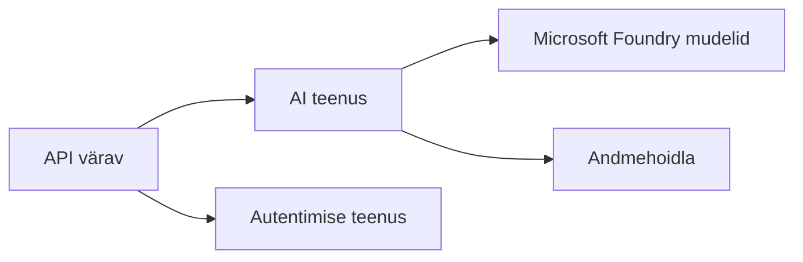
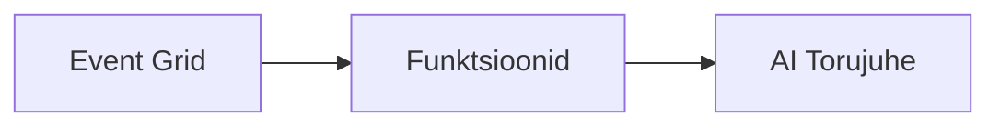

# 8. peatükk: Tootmine ja ettevõtte mustrid

**📚 Kursus**: [AZD algajatele](../../README.md) | **⏱️ Kestus**: 2-3 tundi | **⭐ Keerukus**: Edasijõudnud

---

## Ülevaade

Selles peatükis käsitletakse ettevõttevalmis juurutusmustrid, turvamineerimist, jälgimist ja kulude optimeerimist tootmis-AI töökoormuste jaoks.

> Kontrollitud `azd 1.23.12` vastu märtsis 2026.

## Õpieesmärgid

Selle peatüki läbimisel õpite:
- Juurutama mitme regiooni vastupidavaid rakendusi
- Rakendama ettevõtte turvamustreid
- Konfigureerima põhjalikku jälgimist
- Optimeerima kulusid suures mahus
- Seadistama CI/CD torujaamu AZD-ga

---

## 📚 Õppetunnid

| # | Õppetund | Kirjeldus | Aeg |
|---|----------|-----------|-----|
| 1 | [Tootmis-AI tavad](production-ai-practices.md) | Ettevõtte juurutusmustrid | 90 min |

---

## 🚀 Tootmise kontrollnimekiri

- [ ] Mitme regiooni juurutus vastupidavuse tagamiseks
- [ ] Haldusega identiteet autentimiseks (ilma võtmeteta)
- [ ] Application Insights jälgimiseks
- [ ] Kulueelarved ja hoiatused seadistatud
- [ ] Turvaskaneerimine lubatud
- [ ] CI/CD torujaama integreerimine
- [ ] Katastroofide taastamise plaan

---

## 🏗️ Arhitektuurimustrid

### Muster 1: Mikroteenused AI


### Muster 2: Sündmuspõhine AI


---

## 🔐 Turva parimad praktikad

```bicep
// Use managed identity
identity: {
  type: 'SystemAssigned'
}

// Private endpoints for AI services
properties: {
  publicNetworkAccess: 'Disabled'
  networkAcls: {
    defaultAction: 'Deny'
  }
}
```

---

## 💰 Kulu optimeerimine

| Strateegia | Sääst |
|------------|--------|
| Skaala nulli (Container Apps) | 60-80% |
| Kasuta tarbimiskihte arenduseks | 50-70% |
| Ajastatud skaala muutmine | 30-50% |
| Reserveeritud mahtuvus | 20-40% |

```bash
# Määra eelarvehoiatused
az consumption budget create \
  --budget-name "AI-Budget" \
  --amount 500 \
  --category Cost \
  --time-grain Monthly
```

---

## 📊 Jälgimise seadistamine

```bash
# Voogesita logisid
azd monitor --logs

# Kontrolli Application Insightsi
azd monitor --overview

# Vaata mõõdikuid
az monitor metrics list --resource <resource-id>
```

---

## 🔗 Navigeerimine

| Suund | Peatükk |
|-------|----------|
| **Eelmine** | [7. peatükk: Tõrkeotsing](../chapter-07-troubleshooting/README.md) |
| **Kursus lõpetatud** | [Kursuse avaaken](../../README.md) |

---

## 📖 Seotud ressursid

- [AI Agendid juhend](../chapter-02-ai-development/agents.md)
- [Application Insights](../chapter-06-pre-deployment/application-insights.md)
- [Mitme agendi lahendused](../chapter-05-multi-agent/README.md)
- [Mikroteenuste näide](../../examples/microservices/README.md)

---

<!-- CO-OP TRANSLATOR DISCLAIMER START -->
**Vastutusest vabastamine**:  
See dokument on tõlgitud tehisintellektil põhineva tõlketeenuse [Co-op Translator](https://github.com/Azure/co-op-translator) abil. Kuigi püüame tagada täpsust, palun arvestage, et automaatsed tõlked võivad sisaldada vigu või ebatäpsusi. Originaaldokument selle algkeeles tuleks pidada autoriteetseks allikaks. Kriitilise teabe jaoks soovitatakse professionaalset inimtõlget. Me ei vastuta selle tõlke kasutamisest tekkivate arusaamatuste või moonutuste eest.
<!-- CO-OP TRANSLATOR DISCLAIMER END -->