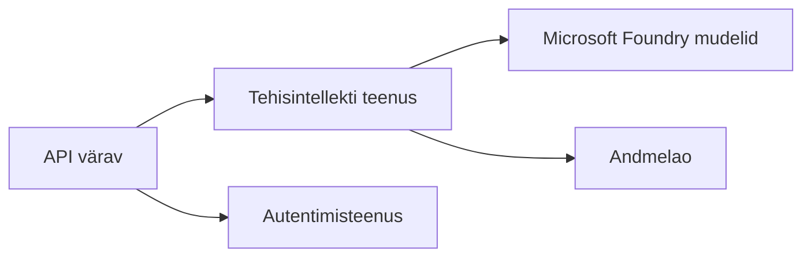
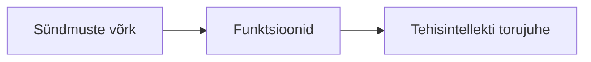

# 8. peatükk: Tootmine ja ettevõtte mustrid

**📚 Kursus**: [AZD algajatele](../../README.md) | **⏱️ Kestus**: 2-3 tundi | **⭐ Tase**: Edasijõudnud

---

## Ülevaade

Selles peatükis käsitletakse ettevõtetele sobivaid juurutusmustreid, turvalisuse tugevdamist, jälgimist ja kulude optimeerimist tootmise AI töökoormustele.

> Kinnitatud `azd 1.27.1` versiooni alusel juulis 2026.

## Õpieesmärgid

Selle peatüki lõpetamisel suudad:
- Juurutada mitme regiooni vastupidavaid rakendusi
- Rakendada ettevõtte turbe mustreid
- Konfigureerida ulatuslikku jälgimist
- Optimeerida kulusid suures mahus
- Seada üles AZD abil CI/CD torujuhtmeid

---

## 📚 Õppetunnid

| # | Õppetund | Kirjeldus | Aeg |
|---|----------|-----------|-----|
| 1 | [Tootmise AI praktikad](production-ai-practices.md) | Ettevõtte juurutusmustrid | 90 min |

---

## 🚀 Tootmise kontrollnimekiri

- [ ] Vastupidavuse tagamiseks mitmeregionaalselt juurutamine
- [ ] Halda identiteeti autentimiseks (võtmete puudumine)
- [ ] Rakenduse sissevaade jälgimiseks
- [ ] Kulueelarved ja hoiatused seadistatud
- [ ] Turvaskaneerimine lubatud
- [ ] CI/CD torujuhtme integreerimine
- [ ] Katastroofide taastamise plaan

---

## 🏗️ Arhitektuursed mustrid

### Muster 1: Mikroteenused AI



### Muster 2: Sündmuspõhine AI



---

## 🔐 Parimad turbetavad

```bicep
// Use managed identity
identity: {
  type: 'SystemAssigned'
}

// Private endpoints for AI services
properties: {
  publicNetworkAccess: 'Disabled'
  networkAcls: {
    defaultAction: 'Deny'
  }
}
```

---

## 💰 Kulude optimeerimine

| Strateegia | Sääst |
|----------|--------|
| Nullini skaleerimine (Container Apps) | 60-80% |
| Tarbimisvõimaluste kasutamine arendamisel | 50-70% |
| Ajastatud skaleerimine | 30-50% |
| Reserveeritud maht | 20-40% |

```bash
# Määra eelarve hoiatused
az consumption budget create \
  --budget-name "AI-Budget" \
  --amount 500 \
  --category Cost \
  --time-grain Monthly
```

---

## 📊 Jälgimise seadistamine

```bash
# Voogesita logisid
azd monitor --logs

# Kontrolli Application Insightsi
azd monitor --overview

# Vaata mõõdikuid
az monitor metrics list --resource <resource-id>
```

---

## 🔗 Navigeerimine

| Suund | Peatükk |
|-------|---------|
| **Eelmine** | [7. peatükk: Tõrkeotsing](../chapter-07-troubleshooting/README.md) |
| **Kursus lõpetatud** | [Kursuse avaleht](../../README.md) |

---

## 📖 Seotud ressursid

- [AI agentide juhend](../chapter-02-ai-development/agents.md)
- [Rakenduse sissevaade](../chapter-06-pre-deployment/application-insights.md)
- [Mitme-agendi lahendused](../chapter-05-multi-agent/README.md)
- [Mikroteenuste näide](../../examples/microservices/README.md)

---

<!-- CO-OP TRANSLATOR DISCLAIMER START -->
**Lahtiütlus**:
See dokument on tõlgitud kasutades AI tõlketeenust [Co-op Translator](https://github.com/Azure/co-op-translator). Kuigi me püüdleme täpsuse poole, palun pange tähele, et automatiseeritud tõlgetes võib esineda vigu või ebatäpsusi. Originaaldokument selle emakeeles tuleks pidada autoriteetseks allikaks. Olulise teabe puhul soovitatakse kasutada professionaalset inimtõlget. Me ei vastuta selle tõlkega seotud eksimustest või valesti mõistmistest.
<!-- CO-OP TRANSLATOR DISCLAIMER END -->