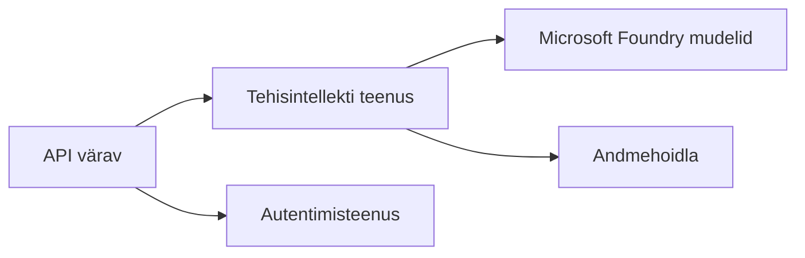
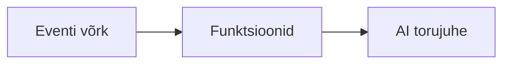

# 8. peatükk: Tootmise ja ettevõtte mustrid

**📚 Kursus**: [AZD algajatele](../../README.md) | **⏱️ Kestus**: 2–3 tundi | **⭐ keerukusaste**: Edasijõudnud

---

## Ülevaade

See peatükk käsitleb ettevõttele valmis juurutamise mustreid, turvalisuse tugevdamist, jälgimist ja kulude optimeerimist tootmise tehisintellekti töökoormuste jaoks.

## Õpieesmärgid

Selle peatüki lõpetamisega:
- Juurutate mitmeregioonilisi vastupidavaid rakendusi
- Rakendate ettevõtte turbemustreid
- Konfigureerite põhjaliku jälgimise
- Optimeerite kulusid suures mahus
- Seate üles CI/CD torujuhtmed koos AZD-ga

---

## 📚 Õppetunnid

| # | Õppetund | Kirjeldus | Aeg |
|---|----------|-----------|-----|
| 1 | [Tootmise tehisintellekti tavad](production-ai-practices.md) | Ettevõtte juurutamise mustrid | 90 min |

---

## 🚀 Tootmise kontrollnimekiri

- [ ] Mitmeregiooniline juurutus vastupidavuse tagamiseks
- [ ] Hallatud identiteet autentimiseks (ilma võtiteta)
- [ ] Application Insights jälgimiseks
- [ ] Kulueelarved ja teavitused konfigureeritud
- [ ] Turbeskaneerimine lubatud
- [ ] CI/CD torujuhtme integratsioon
- [ ] Katastroofide taastamise plaan

---

## 🏗️ Arhitektuuri mustrid

### Muster 1: Mikroteenused ja tehisintellekt


### Muster 2: Sündmuspõhine tehisintellekt


---

## 🔐 Turbe parimad tavad

```bicep
// Use managed identity
identity: {
  type: 'SystemAssigned'
}

// Private endpoints for AI services
properties: {
  publicNetworkAccess: 'Disabled'
  networkAcls: {
    defaultAction: 'Deny'
  }
}
```

---

## 💰 Kulude optimeerimine

| Strateegia | Sääst |
|------------|-------|
| Skaleeri nulli (Container Apps) | 60–80% |
| Kasuta tarbimispõhiseid tasemeid arenduseks | 50–70% |
| Ajastatud skaleerimine | 30–50% |
| Reserveeritud maht | 20–40% |

```bash
# Määra eelarvehoiatused
az consumption budget create \
  --budget-name "AI-Budget" \
  --amount 500 \
  --category Cost \
  --time-grain Monthly
```

---

## 📊 Jälgimise seadistamine

```bash
# Voogesita logisid
azd monitor --logs

# Kontrolli Application Insightsi
azd monitor

# Vaata mõõdikuid
az monitor metrics list --resource <resource-id>
```

---

## 🔗 Navigeerimine

| Suund | Peatükk |
|-------|---------|
| **Eelmine** | [7. peatükk: Tõrkeotsing](../chapter-07-troubleshooting/README.md) |
| **Kursus lõpetatud** | [Kursuse avaleht](../../README.md) |

---

## 📖 Seotud ressursid

- [Tehisintellekti agendid juhend](../chapter-02-ai-development/agents.md)
- [Application Insights](../chapter-06-pre-deployment/application-insights.md)
- [Mitme agendi lahendused](../chapter-05-multi-agent/README.md)
- [Mikroteenuste näide](../../examples/microservices/README.md)

---

<!-- CO-OP TRANSLATOR DISCLAIMER START -->
**Täiendav teave**:
Seda dokumenti on tõlgitud kasutades tehisintellektil põhinevat tõlketeenust [Co-op Translator](https://github.com/Azure/co-op-translator). Kuigi püüdleme täpsuse poole, tuleb arvestada, et automatiseeritud tõlked võivad sisaldada vigu või ebatäpsusi. Algne dokument selle emakeeles tuleks pidada usaldusväärseks allikaks. Olulise teabe puhul soovitame kasutada professionaalset inimtõlget. Me ei vastuta selle tõlke kasutamisest tulenevate arusaamatuste või valesti mõistmiste eest.
<!-- CO-OP TRANSLATOR DISCLAIMER END -->