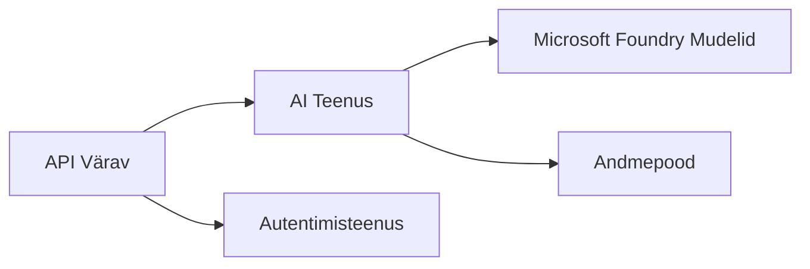
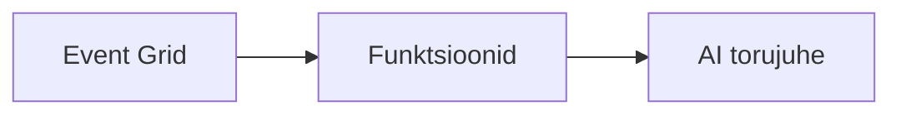

# 8. peatükk: Tootmine ja ettevõtte mustrid

**📚 Kursus**: [AZD alustajatele](../../README.md) | **⏱️ Kestus**: 2-3 tundi | **⭐ Tase**: Täiustatud

---

## Ülevaade

Selles peatükis käsitletakse ettevõttevalmis juurutusmustreid, turvalisuse tugevdamist, jälgimist ja kulude optimeerimist tootmise AI töökoormustele.

> Kontrollitud versiooniga `azd 1.25.6` 2026. aasta juunis.

## Õppe eesmärgid

Selle peatüki lõpetamisel oskad:
- Juurutada mitme regiooniga vastupidavaid rakendusi
- Rakendada ettevõtte turvamustreid
- Konfigureerida põhjalikku jälgimist
- Optimeerida kulusid suures mahus
- Seadistada AZD abil CI/CD torujuhtmeid

---

## 📚 Tunnid

| # | Õppetükk | Kirjeldus | Aeg |
|---|----------|-----------|-----|
| 1 | [Tootmise AI praktikad](production-ai-practices.md) | Ettevõtte juurutusmustrid | 90 min |

---

## 🚀 Tootmise kontrollnimekiri

- [ ] Mitme regiooni juurutus vastupidavuse tagamiseks
- [ ] Halduse identiteet autentimiseks (võtmeid mitte)
- [ ] Application Insights jälgimiseks
- [ ] Kulude eelarved ja hoiatused seadistatud
- [ ] Turvaskannimine lubatud
- [ ] CI/CD torujuhtme integreerimine
- [ ] Katastroofide taastamise plaan

---

## 🏗️ Arhitektuuri mustrid

### Muster 1: Mikroteenused AI



### Muster 2: Sündmustepõhine AI



---

## 🔐 Turbe parimad praktikad

```bicep
// Use managed identity
identity: {
  type: 'SystemAssigned'
}

// Private endpoints for AI services
properties: {
  publicNetworkAccess: 'Disabled'
  networkAcls: {
    defaultAction: 'Deny'
  }
}
```

---

## 💰 Kuluoptimeerimine

| Strateegia | Sääst |
|------------|-------|
| Skaala nullini (Container Apps) | 60-80% |
| Kasuta tarbimiskihte arenduseks | 50-70% |
| Ajakavastatud skaleerimine | 30-50% |
| Reserveeritud maht | 20-40% |

```bash
# Sea eelarvehoiatused
az consumption budget create \
  --budget-name "AI-Budget" \
  --amount 500 \
  --category Cost \
  --time-grain Monthly
```

---

## 📊 Jälgimise seadistamine

```bash
# Voogesita logisid
azd monitor --logs

# Kontrolli Application Insightsi
azd monitor --overview

# Vaata meetrikaid
az monitor metrics list --resource <resource-id>
```

---

## 🔗 Navigatsioon

| Suund | Peatükk |
|-------|---------|
| **Eelmine** | [7. peatükk: Tõrkeotsing](../chapter-07-troubleshooting/README.md) |
| **Kursus lõpetatud** | [Kursuse avaleht](../../README.md) |

---

## 📖 Seotud ressursid

- [AI agendid juhend](../chapter-02-ai-development/agents.md)
- [Application Insights](../chapter-06-pre-deployment/application-insights.md)
- [Mitme agendi lahendused](../chapter-05-multi-agent/README.md)
- [Mikroteenuste näide](../../examples/microservices/README.md)

---

<!-- CO-OP TRANSLATOR DISCLAIMER START -->
**Lahtiütlus**:
See dokument on tõlgitud kasutades AI tõlketeenust [Co-op Translator](https://github.com/Azure/co-op-translator). Kuigi me püüdleme täpsuse poole, palun pange tähele, et automatiseeritud tõlgetes võib esineda vigu või ebatäpsusi. Originaaldokument selle emakeeles tuleks pidada autoriteetseks allikaks. Olulise teabe puhul soovitatakse kasutada professionaalset inimtõlget. Me ei vastuta selle tõlkega seotud eksimustest või valesti mõistmistest.
<!-- CO-OP TRANSLATOR DISCLAIMER END -->