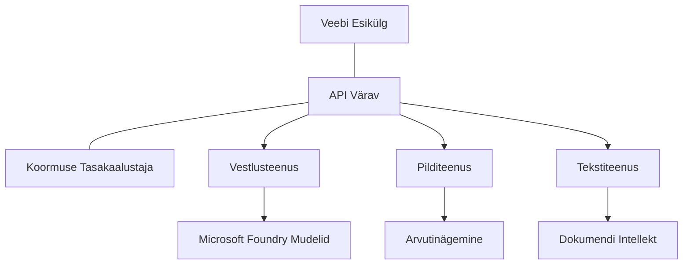

# Tootevalmis AI töökoormuse parimad praktikad AZD-ga

**Peatüki navigeerimine:**
- **📚 Kursuse avaleht**: [AZD algajatele](../../README.md)
- **📖 Praegune peatükk**: Peatükk 8 - Toodang & Ettevõtte mustrid
- **⬅️ Eelmine peatükk**: [Peatükk 7: Tõrkeotsing](../chapter-07-troubleshooting/debugging.md)
- **⬅️ Samuti seotud**: [AI töötuba labor](ai-workshop-lab.md)
- **🎯 Kursus lõpetatud**: [AZD algajatele](../../README.md)

## Ülevaade

See juhend pakub põhjalikke parimaid praktikaid tootmiskõlblike AI töökoormuste juurutamiseks, kasutades Azure Developer CLI-d (AZD). Tuginedes Microsoft Foundry Discordi kogukonna tagasisidele ja pärismaailma klientide juurutustele, käsitlevad need praktikad kõige tavalisemaid väljakutseid tootmis AI süsteemides.

## Peamised lahendatavad väljakutsed

Kogukonna küsitluse tulemuste põhjal on need arendajate peamised väljakutsed:

- **45%** võitleb mitme teenuse AI juurutustega
- **38%** seisab silmitsi mandaadi- ja saladuste halduse probleemidega  
- **35%** leiavad tootmiskõlblikkuse ja skaleerimise keerulisena
- **32%** vajavad paremaid kulude optimeerimise strateegiaid
- **29%** soovivad parendatud jälgimise ja tõrkeotsingu lahendusi

## Tootmis AI arhitektuurimustrid

### Muster 1: Mikroteenuste AI arhitektuur

**Millal kasutada**: keerukad AI rakendused mitme võimekusega


**AZD rakendus:**

```yaml
# azure.yaml
name: enterprise-ai-platform
services:
  web:
    project: ./web
    host: staticwebapp
  api-gateway:
    project: ./api-gateway
    host: containerapp
  chat-service:
    project: ./services/chat
    host: containerapp
  vision-service:
    project: ./services/vision
    host: containerapp
  text-service:
    project: ./services/text
    host: containerapp
```

### Muster 2: Sündmuspõhine AI töötlemine

**Millal kasutada**: partiitöötlus, dokumendianalüüs, asünkroonsed töövood

```bicep
// Event Hub for AI processing pipeline
resource eventHub 'Microsoft.EventHub/namespaces@2023-01-01-preview' = {
  name: eventHubNamespaceName
  location: location
  sku: {
    name: 'Standard'
    tier: 'Standard'
    capacity: 1
  }
}

// Service Bus for reliable message processing
resource serviceBus 'Microsoft.ServiceBus/namespaces@2022-10-01-preview' = {
  name: serviceBusNamespaceName
  location: location
  sku: {
    name: 'Premium'
    tier: 'Premium'
    capacity: 1
  }
}

// Function App for processing
resource functionApp 'Microsoft.Web/sites@2023-01-01' = {
  name: functionAppName
  location: location
  kind: 'functionapp,linux'
  properties: {
    siteConfig: {
      appSettings: [
        {
          name: 'FUNCTIONS_EXTENSION_VERSION'
          value: '~4'
        }
        {
          name: 'AZURE_OPENAI_ENDPOINT'
          value: '@Microsoft.KeyVault(VaultName=${keyVault.name};SecretName=openai-endpoint)'
        }
      ]
    }
  }
}
```

## Mõtiskledes AI agendi tervise üle

Kui traditsiooniline veebirakendus rikub, on sümptomid tuntud: leht ei laadi, API tagastab vea või juurutus ebaõnnestub. AI-põhised rakendused võivad puruneda kõigis neis samades viisides — kuid võivad käituda ka peenetemalt, ilma ilmsete veateadeteta.

See jaotis aitab teil luua mentaliteedi AI töökoormuste jälgimiseks, et te teaksite, kuhu vaadata, kui midagi tundub valesti.

### Kuidas AI agendi tervis erineb traditsioonilise rakenduse tervisest

Traditsiooniline rakendus kas töötab või ei tööta. AI agent võib näida töötavat, kuid anda kehva tulemust. Mõelge agendi tervisele kahe kihina:

| Kiht | Mida jälgida | Kuhu vaadata |
|-------|--------------|--------------|
| **Taristu tervis** | Kas teenus töötab? Kas ressursid on provisioneeritud? Kas lõpp-punktid on kättesaadavad? | `azd monitor`, Azure portaalressursside tervis, konteineri/rakenduse logid |
| **Käitumise tervis** | Kas agent reageerib täpselt? Kas vastused on aegsad? Kas mudelit kutsutakse õigesti? | Application Insights jäljed, mudeli kõnede latentsusmeetmed, vastuse kvaliteedi logid |

Taristu tervis on tuttav—see on sama iga azd rakenduse puhul. Käitumise tervis on uus kiht, mille AI töökoormused lisavad.

### Kuhu vaadata, kui AI rakendused ei käitu ootuspäraselt

Kui teie AI rakendus ei anna oodatud tulemusi, on siin kontseptuaalne kontrollnimekiri:

1. **Alustage põhiasjadest.** Kas rakendus töötab? Kas ta pääseb oma sõltuvustele ligi? Kontrollige `azd monitor` ja ressursside tervist nagu iga tavalise rakenduse puhul.
2. **Kontrollige mudeli ühendust.** Kas teie rakendus kutsub edukalt AI mudelit? Ebaõnnestunud või aegunud mudeli kõned on AI rakenduste probleemide kõige tavalisem põhjus ja ilmuvad rakenduse logides.
3. **Vaadake, mida mudel sai.** AI vastused sõltuvad sisendist (käsklus ja kõik leitud kontekst). Kui väljund on vale, on tavaliselt sisend vale. Kontrollige, kas teie rakendus saadab mudelile õigeid andmeid.
4. **Vaadake vastuse latentsust.** AI mudeli kõned on tavapärastest API kõnedest aeglasemad. Kui teie rakendus tundub aeglane, kontrollige, kas mudeli vastuse aeg on kasvanud—see võib viidata piirangutele, mahtudele või regiooni tasandi ummikutele.
5. **Jälgige kulusignaale.** Ettearvamatud kõikumised märksõnade kasutamises või API kõnedes võivad viidata tsüklile, valesti seadistatud käsklusele või liigsetele kordustele.

Te ei pea kohe olekusnähtavuse tööriistu valdavaks õppima. Peamine on see, et AI rakendustel on jälgitav lisakäitumise kiht ja azd sisseehitatud jälgimine (`azd monitor`) annab teile lähtepunkti mõlema kihi uurimiseks.

---

## Turvalisuse parimad praktikad

### 1. Nullusaldusmudel (Zero-Trust)

**Rakendusstrateegia:**
- Teenustevaheline suhtlus ainult autentimisega
- Kõik API kõned kasutavad juhitud identiteete
- Võrgu isolatsioon privaatsete lõpp-punktidega
- Väikseimad õigused ligipääsu kontrollides

```bicep
// Managed Identity for each service
resource chatServiceIdentity 'Microsoft.ManagedIdentity/userAssignedIdentities@2023-01-31' = {
  name: 'chat-service-identity'
  location: location
}

// Role assignments with minimal permissions
resource openAIUserRole 'Microsoft.Authorization/roleAssignments@2022-04-01' = {
  scope: openAIAccount
  name: guid(openAIAccount.id, chatServiceIdentity.id, openAIUserRoleDefinitionId)
  properties: {
    roleDefinitionId: subscriptionResourceId('Microsoft.Authorization/roleDefinitions', '5e0bd9bd-7b93-4f28-af87-19fc36ad61bd')
    principalId: chatServiceIdentity.properties.principalId
    principalType: 'ServicePrincipal'
  }
}
```

### 2. Turvaline saladuste haldus

**Key Vault integreerimismuster**:

```bicep
// Key Vault with proper access policies
resource keyVault 'Microsoft.KeyVault/vaults@2023-02-01' = {
  name: keyVaultName
  location: location
  properties: {
    tenantId: tenant().tenantId
    sku: {
      family: 'A'
      name: 'premium'  // Use premium for production
    }
    enableRbacAuthorization: true  // Use RBAC instead of access policies
    enablePurgeProtection: true    // Prevent accidental deletion
    enableSoftDelete: true
    softDeleteRetentionInDays: 90
  }
}

// Store all AI service credentials
resource openAIKeySecret 'Microsoft.KeyVault/vaults/secrets@2023-02-01' = {
  parent: keyVault
  name: 'openai-api-key'
  properties: {
    value: openAIAccount.listKeys().key1
    attributes: {
      enabled: true
    }
  }
}
```

### 3. Võrgu turvalisus

**Privaatse lõpp-punkti seadistamine**:

```bicep
// Virtual Network for AI services
resource virtualNetwork 'Microsoft.Network/virtualNetworks@2023-04-01' = {
  name: vnetName
  location: location
  properties: {
    addressSpace: {
      addressPrefixes: ['10.0.0.0/16']
    }
    subnets: [
      {
        name: 'ai-services-subnet'
        properties: {
          addressPrefix: '10.0.1.0/24'
          privateEndpointNetworkPolicies: 'Disabled'
        }
      }
      {
        name: 'app-services-subnet'
        properties: {
          addressPrefix: '10.0.2.0/24'
          delegations: [
            {
              name: 'Microsoft.Web/serverFarms'
              properties: {
                serviceName: 'Microsoft.Web/serverFarms'
              }
            }
          ]
        }
      }
    ]
  }
}

// Private endpoints for all AI services
resource openAIPrivateEndpoint 'Microsoft.Network/privateEndpoints@2023-04-01' = {
  name: '${openAIAccountName}-pe'
  location: location
  properties: {
    subnet: {
      id: virtualNetwork.properties.subnets[0].id
    }
    privateLinkServiceConnections: [
      {
        name: 'openai-connection'
        properties: {
          privateLinkServiceId: openAIAccount.id
          groupIds: ['account']
        }
      }
    ]
  }
}
```

## Jõudlus ja skaleerimine

### 1. Automaatskaleerimise strateegiad

**Konteinerite rakenduste automaatskaleerimine**:

```bicep
resource containerApp 'Microsoft.App/containerApps@2023-05-01' = {
  name: containerAppName
  location: location
  properties: {
    configuration: {
      ingress: {
        external: true
        targetPort: 8000
        transport: 'http'
      }
    }
    template: {
      scale: {
        minReplicas: 2  // Always have 2 instances minimum
        maxReplicas: 50 // Scale up to 50 for high load
        rules: [
          {
            name: 'http-scaling'
            http: {
              metadata: {
                concurrentRequests: '20'  // Scale when >20 concurrent requests
              }
            }
          }
          {
            name: 'cpu-scaling'
            custom: {
              type: 'cpu'
              metadata: {
                type: 'Utilization'
                value: '70'  // Scale when CPU >70%
              }
            }
          }
        ]
      }
    }
  }
}
```

### 2. Vahemälu strateegiad

**Redis vahemälu AI vastustele**:

```bicep
// Redis Premium for production workloads
resource redisCache 'Microsoft.Cache/redis@2023-04-01' = {
  name: redisCacheName
  location: location
  properties: {
    sku: {
      name: 'Premium'
      family: 'P'
      capacity: 1
    }
    enableNonSslPort: false
    minimumTlsVersion: '1.2'
    redisConfiguration: {
      'maxmemory-policy': 'allkeys-lru'
    }
    // Enable clustering for high availability
    redisVersion: '6.0'
    shardCount: 2
  }
}

// Cache configuration in application
var cacheConnectionString = '${redisCache.properties.hostName}:6380,password=${redisCache.listKeys().primaryKey},ssl=True,abortConnect=False'
```

### 3. Koormuse tasakaalustamine ja liikluse juhtimine

**Rakenduse värav koos WAF-iga**:

```bicep
// Application Gateway with Web Application Firewall
resource applicationGateway 'Microsoft.Network/applicationGateways@2023-04-01' = {
  name: appGatewayName
  location: location
  properties: {
    sku: {
      name: 'WAF_v2'
      tier: 'WAF_v2'
      capacity: 2
    }
    webApplicationFirewallConfiguration: {
      enabled: true
      firewallMode: 'Prevention'
      ruleSetType: 'OWASP'
      ruleSetVersion: '3.2'
    }
    // Backend pools for AI services
    backendAddressPools: [
      {
        name: 'ai-services-pool'
        properties: {
          backendAddresses: [
            {
              fqdn: '${containerApp.properties.configuration.ingress.fqdn}'
            }
          ]
        }
      }
    ]
  }
}
```

## 💰 Kuluoptimeerimine

### 1. Ressursside sobitamine

**Keskkonnapõhised konfiguratsioonid**:

```bash
# Arenduskeskkond
azd env new development
azd env set AZURE_OPENAI_SKU "S0"
azd env set AZURE_OPENAI_CAPACITY 10
azd env set AZURE_SEARCH_SKU "basic"
azd env set CONTAINER_CPU 0.5
azd env set CONTAINER_MEMORY 1.0

# Tootmiskeskkond
azd env new production
azd env set AZURE_OPENAI_SKU "S0"
azd env set AZURE_OPENAI_CAPACITY 100
azd env set AZURE_SEARCH_SKU "standard"
azd env set CONTAINER_CPU 2.0
azd env set CONTAINER_MEMORY 4.0
```

### 2. Kulu jälgimine ja eelarved

```bicep
// Cost management and budgets
resource budget 'Microsoft.Consumption/budgets@2023-05-01' = {
  name: 'ai-workload-budget'
  properties: {
    timePeriod: {
      startDate: '2024-01-01'
      endDate: '2024-12-31'
    }
    timeGrain: 'Monthly'
    amount: 2000  // $2000 monthly budget
    category: 'Cost'
    notifications: {
      warning: {
        enabled: true
        operator: 'GreaterThan'
        threshold: 80
        contactEmails: [
          'finance@company.com'
          'engineering@company.com'
        ]
        contactRoles: [
          'Owner'
          'Contributor'
        ]
      }
      critical: {
        enabled: true
        operator: 'GreaterThan'
        threshold: 95
        contactEmails: [
          'cto@company.com'
        ]
      }
    }
  }
}
```

### 3. Märksõnade kasutuse optimeerimine

**OpenAI kulu haldus**:

```typescript
// Rakenduse taseme märgisoptimeerimine
class TokenOptimizer {
  private readonly maxTokens = 4000;
  private readonly reserveTokens = 500;
  
  optimizePrompt(userInput: string, context: string): string {
    const availableTokens = this.maxTokens - this.reserveTokens;
    const estimatedTokens = this.estimateTokens(userInput + context);
    
    if (estimatedTokens > availableTokens) {
      // Lühenda konteksti, mitte kasutaja sisendit
      context = this.truncateContext(context, availableTokens - this.estimateTokens(userInput));
    }
    
    return `${context}\n\nUser: ${userInput}`;
  }
  
  private estimateTokens(text: string): number {
    // Umbkaudne hinnang: 1 märgis ≈ 4 tähemärki
    return Math.ceil(text.length / 4);
  }
}
```

## Jälgimine ja olekusnähtavus

### 1. Põhjalik Application Insights

```bicep
// Application Insights with advanced features
resource applicationInsights 'Microsoft.Insights/components@2020-02-02' = {
  name: applicationInsightsName
  location: location
  kind: 'web'
  properties: {
    Application_Type: 'web'
    WorkspaceResourceId: logAnalyticsWorkspace.id
    SamplingPercentage: 100  // Full sampling for AI apps
    DisableIpMasking: false  // Enable for security
  }
}

// Custom metrics for AI operations
resource aiMetricAlerts 'Microsoft.Insights/metricAlerts@2018-03-01' = {
  name: 'ai-high-error-rate'
  location: 'global'
  properties: {
    description: 'Alert when AI service error rate is high'
    severity: 2
    enabled: true
    scopes: [
      applicationInsights.id
    ]
    evaluationFrequency: 'PT1M'
    windowSize: 'PT5M'
    criteria: {
      'odata.type': 'Microsoft.Azure.Monitor.SingleResourceMultipleMetricCriteria'
      allOf: [
        {
          name: 'high-error-rate'
          metricName: 'requests/failed'
          operator: 'GreaterThan'
          threshold: 10
          timeAggregation: 'Count'
        }
      ]
    }
  }
}
```

### 2. AI spetsiifiline jälgimine

**Kohandatud armatuurlaudad AI meetmetele**:

```json
// Dashboard configuration for AI workloads
{
  "dashboard": {
    "name": "AI Application Monitoring",
    "tiles": [
      {
        "name": "OpenAI Request Volume",
        "query": "requests | where name contains 'openai' | summarize count() by bin(timestamp, 5m)"
      },
      {
        "name": "AI Response Latency",
        "query": "requests | where name contains 'openai' | summarize avg(duration) by bin(timestamp, 5m)"
      },
      {
        "name": "Token Usage",
        "query": "customMetrics | where name == 'openai_tokens_used' | summarize sum(value) by bin(timestamp, 1h)"
      },
      {
        "name": "Cost per Hour",
        "query": "customMetrics | where name == 'openai_cost' | summarize sum(value) by bin(timestamp, 1h)"
      }
    ]
  }
}
```

### 3. Tervisekontrollid ja tööaja jälgimine

```bicep
// Application Insights availability tests
resource availabilityTest 'Microsoft.Insights/webtests@2022-06-15' = {
  name: 'ai-app-availability-test'
  location: location
  tags: {
    'hidden-link:${applicationInsights.id}': 'Resource'
  }
  properties: {
    SyntheticMonitorId: 'ai-app-availability-test'
    Name: 'AI Application Availability Test'
    Description: 'Tests AI application endpoints'
    Enabled: true
    Frequency: 300  // 5 minutes
    Timeout: 120    // 2 minutes
    Kind: 'ping'
    Locations: [
      {
        Id: 'us-east-2-azr'
      }
      {
        Id: 'us-west-2-azr'
      }
    ]
    Configuration: {
      WebTest: '''
        <WebTest Name="AI Health Check" 
                 Id="8d2de8d2-a2b0-4c2e-9a0d-8f9c9a0b8c8d" 
                 Enabled="True" 
                 CssProjectStructure="" 
                 CssIteration="" 
                 Timeout="120" 
                 WorkItemIds="" 
                 xmlns="http://microsoft.com/schemas/VisualStudio/TeamTest/2010" 
                 Description="" 
                 CredentialUserName="" 
                 CredentialPassword="" 
                 PreAuthenticate="True" 
                 Proxy="default" 
                 StopOnError="False" 
                 RecordedResultFile="" 
                 ResultsLocale="">
          <Items>
            <Request Method="GET" 
                     Guid="a5f10126-e4cd-570d-961c-cea43999a200" 
                     Version="1.1" 
                     Url="${webApp.properties.defaultHostName}/health" 
                     ThinkTime="0" 
                     Timeout="120" 
                     ParseDependentRequests="True" 
                     FollowRedirects="True" 
                     RecordResult="True" 
                     Cache="False" 
                     ResponseTimeGoal="0" 
                     Encoding="utf-8" 
                     ExpectedHttpStatusCode="200" 
                     ExpectedResponseUrl="" 
                     ReportingName="" 
                     IgnoreHttpStatusCode="False" />
          </Items>
        </WebTest>
      '''
    }
  }
}
```

## Katastroofitaastamine ja kõrge kättesaadavus

### 1. Mitmeregiooni juurutus

```yaml
# azure.yaml - Multi-region configuration
name: ai-app-multiregion
services:
  api-primary:
    project: ./api
    host: containerapp
    env:
      - AZURE_REGION=eastus
  api-secondary:
    project: ./api
    host: containerapp
    env:
      - AZURE_REGION=westus2
```

```bicep
// Traffic Manager for global load balancing
resource trafficManager 'Microsoft.Network/trafficManagerProfiles@2022-04-01' = {
  name: trafficManagerProfileName
  location: 'global'
  properties: {
    profileStatus: 'Enabled'
    trafficRoutingMethod: 'Priority'
    dnsConfig: {
      relativeName: trafficManagerProfileName
      ttl: 30
    }
    monitorConfig: {
      protocol: 'HTTPS'
      port: 443
      path: '/health'
      intervalInSeconds: 30
      toleratedNumberOfFailures: 3
      timeoutInSeconds: 10
    }
    endpoints: [
      {
        name: 'primary-endpoint'
        type: 'Microsoft.Network/trafficManagerProfiles/azureEndpoints'
        properties: {
          targetResourceId: primaryAppService.id
          endpointStatus: 'Enabled'
          priority: 1
        }
      }
      {
        name: 'secondary-endpoint'
        type: 'Microsoft.Network/trafficManagerProfiles/azureEndpoints'
        properties: {
          targetResourceId: secondaryAppService.id
          endpointStatus: 'Enabled'
          priority: 2
        }
      }
    ]
  }
}
```

### 2. Andmete varundamine ja taastamine

```bicep
// Backup configuration for critical data
resource backupVault 'Microsoft.DataProtection/backupVaults@2023-05-01' = {
  name: backupVaultName
  location: location
  identity: {
    type: 'SystemAssigned'
  }
  properties: {
    storageSettings: [
      {
        datastoreType: 'VaultStore'
        type: 'LocallyRedundant'
      }
    ]
  }
}

// Backup policy for AI models and data
resource backupPolicy 'Microsoft.DataProtection/backupVaults/backupPolicies@2023-05-01' = {
  parent: backupVault
  name: 'ai-data-backup-policy'
  properties: {
    policyRules: [
      {
        backupParameters: {
          backupType: 'Full'
          objectType: 'AzureBackupParams'
        }
        trigger: {
          schedule: {
            repeatingTimeIntervals: [
              'R/2024-01-01T02:00:00+00:00/P1D'  // Daily at 2 AM
            ]
          }
          objectType: 'ScheduleBasedTriggerContext'
        }
        dataStore: {
          datastoreType: 'VaultStore'
          objectType: 'DataStoreInfoBase'
        }
        name: 'BackupDaily'
        objectType: 'AzureBackupRule'
      }
    ]
  }
}
```

## DevOps ja CI/CD integratsioon

### 1. GitHub Actions töövoog

```yaml
# .github/workflows/deploy-ai-app.yml
name: Deploy AI Application

on:
  push:
    branches: [main]
  pull_request:
    branches: [main]

jobs:
  test:
    runs-on: ubuntu-latest
    steps:
      - uses: actions/checkout@v4
      
      - name: Setup Python
        uses: actions/setup-python@v4
        with:
          python-version: '3.11'
          
      - name: Install dependencies
        run: |
          pip install -r requirements.txt
          pip install pytest
          
      - name: Run tests
        run: pytest tests/
        
      - name: AI Safety Tests
        run: |
          python scripts/test_ai_safety.py
          python scripts/validate_prompts.py

  deploy-staging:
    needs: test
    if: github.event_name == 'pull_request'
    runs-on: ubuntu-latest
    steps:
      - uses: actions/checkout@v4
      
      - name: Setup AZD
        uses: Azure/setup-azd@v1.0.0
        
      - name: Login to Azure
        uses: azure/login@v1
        with:
          creds: ${{ secrets.AZURE_CREDENTIALS }}
          
      - name: Deploy to Staging
        run: |
          azd env select staging
          azd deploy

  deploy-production:
    needs: test
    if: github.ref == 'refs/heads/main'
    runs-on: ubuntu-latest
    steps:
      - uses: actions/checkout@v4
      
      - name: Setup AZD
        uses: Azure/setup-azd@v1.0.0
        
      - name: Login to Azure
        uses: azure/login@v1
        with:
          creds: ${{ secrets.AZURE_CREDENTIALS }}
          
      - name: Deploy to Production
        run: |
          azd env select production
          azd deploy
          
      - name: Run Production Health Checks
        run: |
          python scripts/health_check.py --env production
```

### 2. Taristu valideerimine

```bash
# scripts/validate_infrastructure.sh
#!/bin/bash

echo "Validating AI infrastructure deployment..."

# Kontrolli, kas kõik nõutud teenused töötavad
services=("openai" "search" "storage" "keyvault")
for service in "${services[@]}"; do
    echo "Checking $service..."
    if ! az resource list --resource-type "Microsoft.CognitiveServices/accounts" --query "[?contains(name, '$service')]" -o tsv; then
        echo "ERROR: $service not found"
        exit 1
    fi
done

# Kontrolli OpenAI mudelite juurutusi
echo "Validating OpenAI model deployments..."
models=$(az cognitiveservices account deployment list --name $AZURE_OPENAI_NAME --resource-group $AZURE_RESOURCE_GROUP --query "[].name" -o tsv)
if [[ ! $models == *"gpt-35-turbo"* ]]; then
    echo "ERROR: Required model gpt-35-turbo not deployed"
    exit 1
fi

# Testi tehisintellekti teenuse ühenduvust
echo "Testing AI service connectivity..."
python scripts/test_connectivity.py

echo "Infrastructure validation completed successfully!"
```

## Tootmiskõlblikkuse kontrollnimekiri

### Turvalisus ✅
- [ ] Kõik teenused kasutavad juhitud identiteete
- [ ] Saladused hoiustatud Key Vaultis
- [ ] Privaatseid lõpp-punkte seadistatud
- [ ] Rakendatud võrgu turvagruppide reeglid
- [ ] RBAC väikseimate privileegidega
- [ ] WAF lubatud avalikel lõpp-punktidel

### Jõudlus ✅
- [ ] Automaatskaleerimine seadistatud
- [ ] Vahemälu rakendatud
- [ ] Koormuse tasakaalustamine seadistatud
- [ ] CDN staatilise sisu jaoks
- [ ] Andmebaasi ühenduste puhvrites
- [ ] Märksõnade kasutuse optimeerimine

### Jälgimine ✅
- [ ] Application Insights konfigureeritud
- [ ] Kohandatud mõõdikud määratletud
- [ ] Hoiatusreeglid seadistatud
- [ ] Armatuurlaud loodud
- [ ] Tervisekontrollid rakendatud
- [ ] Logide säilituspoliitikad

### Usaldusväärsus ✅
- [ ] Mitmeregiooni juurutus
- [ ] Varundamise ja taastamise plaan
- [ ] Elektrikäivitite rakendamine
- [ ] Taastuskatsed seadistatud
- [ ] Pehme degradeerimine
- [ ] Tervisekontrolli lõpp-punktid

### Kulujuhtimine ✅
- [ ] Eelarvehüüded seadistatud
- [ ] Ressursside sobiv suurus
- [ ] Arendus/test soodustused rakendatud
- [ ] Reserveeritud instantsid ostetud
- [ ] Kulu jälgimise armatuurlaud
- [ ] Regulaarne kulu ülevaatus

### Vastavus ✅
- [ ] Andmete asukohanõuded täidetud
- [ ] Auditilogimine lubatud
- [ ] Vastavuspõhimõtted rakendatud
- [ ] Turvapõhimõtete alused kehtestatud
- [ ] Regulaarne turvalisuse hindamine
- [ ] Intsidendijuhtimise plaan

## Jõudluse mõõdikud

### Tüüpilised tootmisnäitajad

| Näitaja | Eesmärk | Jälgimine |
|--------|--------|------------|
| **Vastuse aeg** | < 2 sekundit | Application Insights |
| **Saadavus** | 99.9% | Tööaja jälgimine |
| **Vigade määr** | < 0.1% | Rakenduse logid |
| **Märksõnade kasutus** | < 500$/kuu | Kulujuhtimine |
| **Samaaegsed kasutajad** | 1000+ | Koormustestimine |
| **Taasteaeg** | < 1 tund | Katastroofitaaste testid |

### Koormustestimine

```bash
# AI-rakenduste laadimistestimise skript
python scripts/load_test.py \
  --endpoint https://your-ai-app.azurewebsites.net \
  --concurrent-users 100 \
  --duration 300 \
  --ramp-up 60
```

## 🤝 Kogukonna parimad praktikad

Põhinedes Microsoft Foundry Discordi kogukonna tagasisidel:

### Kogukonna peamised soovitused:

1. **Alustage väikeselt, skaleeruge järk-järgult**: alustage põhiliste SKU-dega ja skaleerige tegeliku kasutuse põhjal
2. **Jälgige kõike**: seadistage põhjalik jälgimine juba esimesest päevast
3. **Automatiseerige turvalisus**: kasutage infrastruktuuri koodina järjepideva turvalisuse tagamiseks
4. **Testige põhjalikult**: kaasake AI-spetsiifilised testid oma töövoogu
5. **Planeerige kulud**: jälgige märksõnade kasutust ja seadke varakult eelarvehüüded

### Vältida tuleks tavapäraseid lõkse:

- ❌ API võtmete kõvakodeerimine koodis
- ❌ Ebapiisav jälgimissüsteem
- ❌ Kuluoptimeerimise ignoreerimine
- ❌ Ebaõnnestumise stsenaariumite mitte testimine
- ❌ Juurutus ilma tervisekontrollita

## AZD AI CLI käsud ja laiendused

AZD sisaldab kasvavat hulka AI-spetsiifilisi käske ja laiendusi, mis lihtsustavad tootmiskõlblikke AI töövooge. Need tööriistad sillutavad teed kohaliku arenduse ja tootmisjuurutuse vahel AI töökoormustes.

### AI laiendused AZD jaoks

AZD kasutab laiendussüsteemi AI-spetsiifiliste võimete lisamiseks. Laienduste installimiseks ja haldamiseks kasutage:

```bash
# Loetle kõik saadaolevad laiendused (sh AI)
azd extension list

# Paigalda Foundry agentide laiendus
azd extension install azure.ai.agents

# Paigalda täpsustamise laiendus
azd extension install azure.ai.finetune

# Paigalda kohandatud mudelite laiendus
azd extension install azure.ai.models

# Uuenda kõiki paigaldatud laiendusi
azd extension upgrade --all
```

**Saadaval olevad AI laiendused:**

| Laiendus | Eesmärk | Staatus |
|----------|---------|---------|
| `azure.ai.agents` | Foundry agenditeenuse haldus | Eelvaade |
| `azure.ai.finetune` | Foundry mudelite peenhäälestus | Eelvaade |
| `azure.ai.models` | Foundry kohandatud mudelid | Eelvaade |
| `azure.coding-agent` | Koodiakendi konfiguratsioon | Saadaval |

### Agendiprojektide algatamine käsuga `azd ai agent init`

Käsk `azd ai agent init` loob tootmiskõlbuliku AI agendi projekti, mis on integreeritud Microsoft Foundry Agent Teenusega:

```bash
# Algata uus agendi projekt agendi manifestist
azd ai agent init -m <manifest-path-or-uri>

# Algata ja sihi kindlat Foundry projekti
azd ai agent init -m agent-manifest.yaml --project-id <foundry-project-id>

# Algata kohandatud allika kataloogiga
azd ai agent init -m agent-manifest.yaml --src ./agents/my-agent

# Sihi hostina Container Apps'i
azd ai agent init -m agent-manifest.yaml --host containerapp
```

**Olulised lipud:**

| Lipp | Kirjeldus |
|------|-----------|
| `-m, --manifest` | Tee või URI agendi manifestile, mida lisada projekti |
| `-p, --project-id` | Olemasolev Microsoft Foundry projekti ID teie azd keskkonnale |
| `-s, --src` | Kaust, kuhu agent definitsioon alla laaditakse (vaikeväärtus `src/<agent-id>`) |
| `--host` | Vaikimisi host'i ülekirjutus (nt `containerapp`) |
| `-e, --environment` | Kasutatav azd keskkond |

**Tootmisnipinurk**: Kasutage `--project-id`, et ühendada otse olemasoleva Foundry projektiga, hoides nii agent koodi ja pilveresursse alates algusest sidusana.

### Mudeli konteksti protokoll (MCP) käsuga `azd mcp`

AZD sisaldab sisseehitatud MCP serveri tuge (Alfa), mis võimaldab AI agentidel ja tööriistadel suhelda teie Azure ressurssidega standardiseeritud protokolli kaudu:

```bash
# Käivita oma projekti MCP server
azd mcp start

# Halda tööriista nõusolekut MCP toiminguteks
azd mcp consent
```

MCP server avaldab teie azd projekti konteksti — keskkonnad, teenused ja Azure ressursid — AI-põhistele arendustööriistadele. See võimaldab:

- **AI abistatud juurutus**: lasta koodiaagentidel pärida teie projekti olekut ja käivitada juurutusi
- **Resursside avastamine**: AI tööriistad saavad avastada, milliseid Azure ressursse teie projekt kasutab
- **Keskkonna haldus**: agendid saavad vahetada arendus-/test-/tootmiskeskkondade vahel

### Infrastruktuuri genereerimine käsuga `azd infra generate`

Tootmiskõlblike AI töökoormuste jaoks saate generaatorite abil luua ja kohandada infrastruktuuri koodina, asemel et toetuda automaatsele provisioningule:

```bash
# Genereeri Bicep/Terraform failid oma projekti definitsioonist
azd infra generate
```

See kirjutab IaC kettale, et saaksite:
- Taristut üle vaadata ja auditeerida enne juurutust
- Lisada kohandatud turvapoliitikaid (võrgureeglid, privaatseid lõpp-punkte)
- Integreerida olemasolevate IaC ülevaatusprotsessidega
- Versioonikontrollida taristu muudatusi eraldiseisvalt rakenduskoodist

### Tootmistsükli konksud

AZD konksud lubavad teil süstida kohandatud loogikat juurutustsükli igas etapis — kriitiline tootmis AI töövoogudes:

```yaml
# azure.yaml - Production hooks example
name: ai-production-app
hooks:
  preprovision:
    shell: sh
    run: scripts/validate-quotas.sh    # Check AI model quota before provisioning
  postprovision:
    shell: sh
    run: scripts/configure-networking.sh  # Set up private endpoints
  predeploy:
    shell: sh
    run: scripts/run-ai-safety-tests.sh  # Run prompt safety checks
  postdeploy:
    shell: sh
    run: scripts/smoke-test.sh           # Verify agent responses post-deploy
services:
  agent-api:
    project: ./src/agent
    host: containerapp
    hooks:
      predeploy:
        shell: sh
        run: scripts/validate-model-access.sh  # Per-service hook
```

```bash
# Käivita arendamise ajal käsitsi kindel konks
azd hooks run predeploy
```

**Soovitatavad tootmis konksud AI töökoormustele:**

| Kork | Kasutusjuhtum |
|------|---------------|
| `preprovision` | Kontrolli tellimuse ressurssid ja piirangud AI mudelite mahule |
| `postprovision` | Privaatsete lõpp-punktide seadistamine, mudeli kaalude juurutus |
| `predeploy` | Käivita AI ohutustestid, valideeri käsklusmallid |
| `postdeploy` | Pistikutest agentide vastused, kontrolli mudeli ühenduvust |

### CI/CD torujuhtme konfiguratsioon

Kasutage `azd pipeline config`, et ühendada projekt GitHub Actions või Azure Pipelines-ga turvalise Azure autentimisega:

```bash
# Konfigureeri CI/CD torujuhe (interaktiivne)
azd pipeline config

# Konfigureeri kindla pakkujaga
azd pipeline config --provider github
```

See käsk:
- Loob teenuse kontoga väikseimate privileegidega juurdepääsu
- Seadistab föderatsioonitud mandaadid (ilma salvestatud saladusteta)
- Genereerib või uuendab teie torujuhtme definitsioonifaili
- Määrab vajalikud keskkonnamuutujad teie CI/CD süsteemis

**Tootmistöövoog torujuhtme konfiguratsiooniga:**

```bash
# 1. Seadista tootmiskeskkond
azd env new production
azd env set AZURE_OPENAI_CAPACITY 100

# 2. Konfigureeri torujuhe
azd pipeline config --provider github

# 3. Torujuhe käivitab azd deploy iga kord, kui tehakse push main harusse
```

### Komponentide lisamine käsuga `azd add`

Järk-järgult lisage Azure teenuseid olemasolevasse projekti:

```bash
# Lisa uus teenusekomponent interaktiivselt
azd add
```

See on eriti kasulik tootmiskõlblike AI rakenduste laiendamiseks — näiteks vektoriotsingu teenuse lisamine, uue agendi lõpp-punkti rajamine või jälgimiskomponendi lisamine olemasolevale juurutusele.

## Täiendavad ressursid
- **Azure hästi arhitektuuritud raamistik**: [AI töökoormuse juhised](https://learn.microsoft.com/azure/well-architected/ai/)
- **Microsoft Foundry dokumentatsioon**: [Ametlikud juhendid](https://learn.microsoft.com/azure/ai-studio/)
- **Kogukonna mallid**: [Azure näited](https://github.com/Azure-Samples)
- **Discordi kogukond**: [#Azure kanal](https://discord.gg/microsoft-azure)
- **Agentide oskused Azure jaoks**: [microsoft/github-copilot-for-azure on skills.sh](https://skills.sh/microsoft/github-copilot-for-azure) - 37 avatud agentide oskust Azure AI, Foundry, paigalduse, kulude optimeerimise ja diagnostika jaoks. Paigalda oma redaktoris:
  ```bash
  npx skills add microsoft/github-copilot-for-azure
  ```

---

**Peatüki navigeerimine:**
- **📚 Kursuse avaleht**: [AZD Algajatele](../../README.md)
- **📖 Praegune peatükk**: Peatükk 8 - Tootmine ja ettevõtte mustrid
- **⬅️ Eelmine peatükk**: [Peatükk 7: Tõrkeotsing](../chapter-07-troubleshooting/debugging.md)
- **⬅️ Samuti seotud**: [AI töötuba](ai-workshop-lab.md)
- **� Kursus lõpetatud**: [AZD Algajatele](../../README.md)

**Pea meeles**: Tootmisvalmid AI töökoormused nõuavad hoolikat planeerimist, jälgimist ja pidevat optimeerimist. Alusta nende mustritega ja kohanda need vastavalt oma konkreetsetele nõudmistele.

---

<!-- CO-OP TRANSLATOR DISCLAIMER START -->
**Vastutusest loobumine**:
See dokument on tõlgitud AI tõlketeenuse [Co-op Translator](https://github.com/Azure/co-op-translator) abil. Kuigi püüame saavutada täpsust, palun arvestage, et automaatsed tõlked võivad sisaldada vigu või ebatäpsusi. Originaaldokument tema emakeeles tuleks pidada autoriteetseks allikaks. Olulise teabe puhul soovitatakse kasutada professionaalset inimtõlget. Me ei vastuta selle tõlke kasutamisest tulenevate arusaamatuste või valesti mõistmiste eest.
<!-- CO-OP TRANSLATOR DISCLAIMER END -->