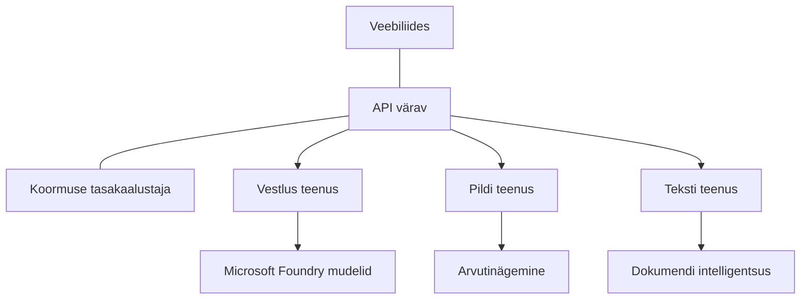

# Tootmisvalmis AI töökoormuste parimad praktikad koos AZD-ga

**Lõigu navigeerimine:**
- **📚 Kursuse avaleht**: [AZD algajatele](../../README.md)
- **📖 Praegune lõik**: Lõik 8 - Tootmine ja ettevõtluse mustrid
- **⬅️ Eelmine lõik**: [Lõik 7: Tõrkeotsing](../chapter-07-troubleshooting/debugging.md)
- **⬅️ Ka seotud**: [AI töötuba](ai-workshop-lab.md)
- **🎯 Kursuse lõpetamine**: [AZD algajatele](../../README.md)

## Ülevaade

See juhend pakub põhjalikke parimaid praktikaid tootmisvalmis AI töökoormuste juurutamiseks Azure Developer CLI (AZD) abil. Tuginedes Microsoft Foundry Discord kogukonna tagasisidele ja reaalses maailmas klientide juurutustele, käsitlevad need praktikad kõige levinumaid väljakutseid tootmise AI süsteemides.

## Olulised väljakutsed

Põhinedes meie kogukonna küsitluse tulemustel, on need arendajate peamised väljakutsed:

- **45%** võitleb mitme teenusega AI juurutustega
- **38%** on probleeme tõendite ja saladuste haldamisega  
- **35%** leiab tootmisvalmiduse ja skaleerimise keeruliseks
- **32%** vajab paremaid kulude optimeerimise strateegiaid
- **29%** nõuab täiustatud monitooringut ja tõrkeotsingut

## Tootmisvalmis AI arhitektuurimustrid

### Muster 1: Mikroteenuste AI arhitektuur

**Millal kasutada**: keerukate AI rakenduste puhul mitmete võimekustega



**AZD rakendus**:

```yaml
# azure.yaml
name: enterprise-ai-platform
services:
  web:
    project: ./web
    host: staticwebapp
  api-gateway:
    project: ./api-gateway
    host: containerapp
  chat-service:
    project: ./services/chat
    host: containerapp
  vision-service:
    project: ./services/vision
    host: containerapp
  text-service:
    project: ./services/text
    host: containerapp
```

### Muster 2: Sündmuspõhine AI töötlemine

**Millal kasutada**: partitöötlus, dokumentide analüüs, asünkroonsed töövood

```bicep
// Event Hub for AI processing pipeline
resource eventHub 'Microsoft.EventHub/namespaces@2023-01-01-preview' = {
  name: eventHubNamespaceName
  location: location
  sku: {
    name: 'Standard'
    tier: 'Standard'
    capacity: 1
  }
}

// Service Bus for reliable message processing
resource serviceBus 'Microsoft.ServiceBus/namespaces@2022-10-01-preview' = {
  name: serviceBusNamespaceName
  location: location
  sku: {
    name: 'Premium'
    tier: 'Premium'
    capacity: 1
  }
}

// Function App for processing
resource functionApp 'Microsoft.Web/sites@2023-01-01' = {
  name: functionAppName
  location: location
  kind: 'functionapp,linux'
  properties: {
    siteConfig: {
      appSettings: [
        {
          name: 'FUNCTIONS_EXTENSION_VERSION'
          value: '~4'
        }
        {
          name: 'AZURE_OPENAI_ENDPOINT'
          value: '@Microsoft.KeyVault(VaultName=${keyVault.name};SecretName=openai-endpoint)'
        }
      ]
    }
  }
}
```

## Mõtiskledes AI agendi tervise üle

Kui traditsiooniline veebirakendus laguneb, on sümptomid tuttavad: lehte ei laadita, API tagastab vea või juurutus ebaõnnestub. AI-põhised rakendused võivad laguneda kõigil neil viisidel — aga nad võivad ka käituda peenemal moel, mis ei tekita ilmseid veateateid.

See lõik aitab teil luua vaimse mudeli AI töökoormuste monitoorimiseks, et te teaksite, kuhu vaadata, kui asjad ei tundu korras.

### Kuidas agendi tervis erineb traditsioonilise rakenduse tervisest

Tavapärane rakendus kas töötab või ei tööta. AI agent võib tunduda töötavat, kuid toota halbu tulemusi. Mõelge agendi tervisele kahel tasandil:

| Tase | Millele tähelepanu pöörata | Kuhu vaadata |
|-------|-----------------------------|-------------|
| **Taristu tervis** | Kas teenus töötab? Kas ressursid on olemas? Kas lõpp-punktid on kättesaadavad? | `azd monitor`, Azure Portali ressursside tervis, konteineri/rakenduse logid |
| **Käitumise tervis** | Kas agent vastab täpselt? Kas vastused on õigeaegsed? Kas mudelit kutsutakse õigesti? | Application Insights jäljed, mudeli kutsumise latentsusmõõdikud, vastuse kvaliteedi logid |

Taristu tervis on tuttav – see on sama iga azd rakenduse puhul. Käitumise tervis on uus kiht, mida AI töökoormused lisavad.

### Kuhu vaadata, kui AI rakendused ei käitu ootuspäraselt

Kui teie AI rakendus ei anna soovitud tulemusi, siis siin on kontseptuaalne kontrollnimekiri:

1. **Alustage põhitõdedest.** Kas rakendus töötab? Kas see jõuab oma sõltuvusteni? Kontrollige `azd monitor` ja ressursside tervist nagu iga tavalise rakenduse puhul.
2. **Kontrollige mudeliga ühendust.** Kas teie rakendus kutsub edukalt AI mudelit? Ebaõnnestunud või ajale ületäitumisega mudeli kutsed on kõige tavalisemad AI rakenduste probleemide põhjused ja ilmnevad rakenduse logides.
3. **Vaadake, mida mudel sai.** AI vastused sõltuvad sisendist (käsklus ja mis tahes päringukontekst). Kui väljund on vale, on tavaliselt sisend vale. Kontrollige, kas teie rakendus saadab mudelile õigeid andmeid.
4. **Vaadake vastuse latentsust.** AI mudelite kutsed on aeglasemad kui tüüpilised API kutsed. Kui teie rakendus tundub aeglane, kontrollige, kas mudeli vastuste aeg on kasvanud — see võib viidata piirangutele, mahupiirangutele või piirkondlikule ummikule.
5. **Jälgige kulusignaale.** Ootamatud märkimisväärsed üleskerkimised märksõnade tarbimises või API kutses võivad tähendada silmust, valesti konfigureeritud käsukäsku või liigset taaskatsetamist.

Te ei pea kohe observability tööriistu valdavaks saama. Peamine mõte on, et AI rakendustel on lisakiht käitumise jälgimiseks ja azd sisseehitatud monitooring (`azd monitor`) annab hea lähtepunkti mõlema tasandi uurimiseks.

---

## Turvalisuse parimad praktikad

### 1. Nullusaldus (Zero-Trust) turbemudel

**Rakendusstrateegia**:
- Teenuste vaheline side ainult autentimisega
- Kõik API kõned kasutavad hallatud identiteete
- Võrgu isolatsioon privaatsete lõpp-punktidega
- Vähemprivileegilise juurdepääsu kontrollid

```bicep
// Managed Identity for each service
resource chatServiceIdentity 'Microsoft.ManagedIdentity/userAssignedIdentities@2023-01-31' = {
  name: 'chat-service-identity'
  location: location
}

// Role assignments with minimal permissions
resource openAIUserRole 'Microsoft.Authorization/roleAssignments@2022-04-01' = {
  scope: openAIAccount
  name: guid(openAIAccount.id, chatServiceIdentity.id, openAIUserRoleDefinitionId)
  properties: {
    roleDefinitionId: subscriptionResourceId('Microsoft.Authorization/roleDefinitions', '5e0bd9bd-7b93-4f28-af87-19fc36ad61bd')
    principalId: chatServiceIdentity.properties.principalId
    principalType: 'ServicePrincipal'
  }
}
```

### 2. Turvaline saladuste haldamine

**Key Vaulti integreerimisprotsess**:

```bicep
// Key Vault with proper access policies
resource keyVault 'Microsoft.KeyVault/vaults@2023-02-01' = {
  name: keyVaultName
  location: location
  properties: {
    tenantId: tenant().tenantId
    sku: {
      family: 'A'
      name: 'premium'  // Use premium for production
    }
    enableRbacAuthorization: true  // Use RBAC instead of access policies
    enablePurgeProtection: true    // Prevent accidental deletion
    enableSoftDelete: true
    softDeleteRetentionInDays: 90
  }
}

// Store all AI service credentials
resource openAIKeySecret 'Microsoft.KeyVault/vaults/secrets@2023-02-01' = {
  parent: keyVault
  name: 'openai-api-key'
  properties: {
    value: openAIAccount.listKeys().key1
    attributes: {
      enabled: true
    }
  }
}
```

### 3. Võrgu turvalisus

**Privaatse lõpp-punkti konfiguratsioon**:

```bicep
// Virtual Network for AI services
resource virtualNetwork 'Microsoft.Network/virtualNetworks@2023-04-01' = {
  name: vnetName
  location: location
  properties: {
    addressSpace: {
      addressPrefixes: ['10.0.0.0/16']
    }
    subnets: [
      {
        name: 'ai-services-subnet'
        properties: {
          addressPrefix: '10.0.1.0/24'
          privateEndpointNetworkPolicies: 'Disabled'
        }
      }
      {
        name: 'app-services-subnet'
        properties: {
          addressPrefix: '10.0.2.0/24'
          delegations: [
            {
              name: 'Microsoft.Web/serverFarms'
              properties: {
                serviceName: 'Microsoft.Web/serverFarms'
              }
            }
          ]
        }
      }
    ]
  }
}

// Private endpoints for all AI services
resource openAIPrivateEndpoint 'Microsoft.Network/privateEndpoints@2023-04-01' = {
  name: '${openAIAccountName}-pe'
  location: location
  properties: {
    subnet: {
      id: virtualNetwork.properties.subnets[0].id
    }
    privateLinkServiceConnections: [
      {
        name: 'openai-connection'
        properties: {
          privateLinkServiceId: openAIAccount.id
          groupIds: ['account']
        }
      }
    ]
  }
}
```

## Jõudlus ja skaleerimine

### 1. Automaatse skaleerimise strateegiad

**Konteinerite rakenduste automaatne skaleerimine**:

```bicep
resource containerApp 'Microsoft.App/containerApps@2023-05-01' = {
  name: containerAppName
  location: location
  properties: {
    configuration: {
      ingress: {
        external: true
        targetPort: 8000
        transport: 'http'
      }
    }
    template: {
      scale: {
        minReplicas: 2  // Always have 2 instances minimum
        maxReplicas: 50 // Scale up to 50 for high load
        rules: [
          {
            name: 'http-scaling'
            http: {
              metadata: {
                concurrentRequests: '20'  // Scale when >20 concurrent requests
              }
            }
          }
          {
            name: 'cpu-scaling'
            custom: {
              type: 'cpu'
              metadata: {
                type: 'Utilization'
                value: '70'  // Scale when CPU >70%
              }
            }
          }
        ]
      }
    }
  }
}
```

### 2. Vahemällu salvestamise strateegiad

**Redis vahemälu AI vastuste jaoks**:

```bicep
// Redis Premium for production workloads
resource redisCache 'Microsoft.Cache/redis@2023-04-01' = {
  name: redisCacheName
  location: location
  properties: {
    sku: {
      name: 'Premium'
      family: 'P'
      capacity: 1
    }
    enableNonSslPort: false
    minimumTlsVersion: '1.2'
    redisConfiguration: {
      'maxmemory-policy': 'allkeys-lru'
    }
    // Enable clustering for high availability
    redisVersion: '6.0'
    shardCount: 2
  }
}

// Cache configuration in application
var cacheConnectionString = '${redisCache.properties.hostName}:6380,password=${redisCache.listKeys().primaryKey},ssl=True,abortConnect=False'
```

### 3. Koormuse tasakaalustamine ja liikluse juhtimine

**Rakenduse lüüs WAF-iga**:

```bicep
// Application Gateway with Web Application Firewall
resource applicationGateway 'Microsoft.Network/applicationGateways@2023-04-01' = {
  name: appGatewayName
  location: location
  properties: {
    sku: {
      name: 'WAF_v2'
      tier: 'WAF_v2'
      capacity: 2
    }
    webApplicationFirewallConfiguration: {
      enabled: true
      firewallMode: 'Prevention'
      ruleSetType: 'OWASP'
      ruleSetVersion: '3.2'
    }
    // Backend pools for AI services
    backendAddressPools: [
      {
        name: 'ai-services-pool'
        properties: {
          backendAddresses: [
            {
              fqdn: '${containerApp.properties.configuration.ingress.fqdn}'
            }
          ]
        }
      }
    ]
  }
}
```

## 💰 Kuluoptimeerimine

### 1. Ressursside õige suuruse määramine

**Keskkonnapõhised konfiguratsioonid**:

```bash
# Arenduskeskkond
azd env new development
azd env set AZURE_OPENAI_SKU "S0"
azd env set AZURE_OPENAI_CAPACITY 10
azd env set AZURE_SEARCH_SKU "basic"
azd env set CONTAINER_CPU 0.5
azd env set CONTAINER_MEMORY 1.0

# Tootmiskeskkond
azd env new production
azd env set AZURE_OPENAI_SKU "S0"
azd env set AZURE_OPENAI_CAPACITY 100
azd env set AZURE_SEARCH_SKU "standard"
azd env set CONTAINER_CPU 2.0
azd env set CONTAINER_MEMORY 4.0
```

### 2. Kulu jälgimine ja eelarved

```bicep
// Cost management and budgets
resource budget 'Microsoft.Consumption/budgets@2023-05-01' = {
  name: 'ai-workload-budget'
  properties: {
    timePeriod: {
      startDate: '2024-01-01'
      endDate: '2024-12-31'
    }
    timeGrain: 'Monthly'
    amount: 2000  // $2000 monthly budget
    category: 'Cost'
    notifications: {
      warning: {
        enabled: true
        operator: 'GreaterThan'
        threshold: 80
        contactEmails: [
          'finance@company.com'
          'engineering@company.com'
        ]
        contactRoles: [
          'Owner'
          'Contributor'
        ]
      }
      critical: {
        enabled: true
        operator: 'GreaterThan'
        threshold: 95
        contactEmails: [
          'cto@company.com'
        ]
      }
    }
  }
}
```

### 3. Märksõnade kasutamise optimeerimine

**OpenAI kulude haldamine**:

```typescript
// Rakenduse taseme tokeni optimeerimine
class TokenOptimizer {
  private readonly maxTokens = 4000;
  private readonly reserveTokens = 500;
  
  optimizePrompt(userInput: string, context: string): string {
    const availableTokens = this.maxTokens - this.reserveTokens;
    const estimatedTokens = this.estimateTokens(userInput + context);
    
    if (estimatedTokens > availableTokens) {
      // Lühenda konteksti, mitte kasutaja sisendit
      context = this.truncateContext(context, availableTokens - this.estimateTokens(userInput));
    }
    
    return `${context}\n\nUser: ${userInput}`;
  }
  
  private estimateTokens(text: string): number {
    // Umbkaudne hinnang: 1 token ≈ 4 tähemärki
    return Math.ceil(text.length / 4);
  }
}
```

## Monitooring ja jälgitavus

### 1. Põhjalik Application Insights

```bicep
// Application Insights with advanced features
resource applicationInsights 'Microsoft.Insights/components@2020-02-02' = {
  name: applicationInsightsName
  location: location
  kind: 'web'
  properties: {
    Application_Type: 'web'
    WorkspaceResourceId: logAnalyticsWorkspace.id
    SamplingPercentage: 100  // Full sampling for AI apps
    DisableIpMasking: false  // Enable for security
  }
}

// Custom metrics for AI operations
resource aiMetricAlerts 'Microsoft.Insights/metricAlerts@2018-03-01' = {
  name: 'ai-high-error-rate'
  location: 'global'
  properties: {
    description: 'Alert when AI service error rate is high'
    severity: 2
    enabled: true
    scopes: [
      applicationInsights.id
    ]
    evaluationFrequency: 'PT1M'
    windowSize: 'PT5M'
    criteria: {
      'odata.type': 'Microsoft.Azure.Monitor.SingleResourceMultipleMetricCriteria'
      allOf: [
        {
          name: 'high-error-rate'
          metricName: 'requests/failed'
          operator: 'GreaterThan'
          threshold: 10
          timeAggregation: 'Count'
        }
      ]
    }
  }
}
```

### 2. AI-spetsiifiline monitooring

**Kohandatud juhtpaneelid AI mõõdikute jaoks**:

```json
// Dashboard configuration for AI workloads
{
  "dashboard": {
    "name": "AI Application Monitoring",
    "tiles": [
      {
        "name": "OpenAI Request Volume",
        "query": "requests | where name contains 'openai' | summarize count() by bin(timestamp, 5m)"
      },
      {
        "name": "AI Response Latency",
        "query": "requests | where name contains 'openai' | summarize avg(duration) by bin(timestamp, 5m)"
      },
      {
        "name": "Token Usage",
        "query": "customMetrics | where name == 'openai_tokens_used' | summarize sum(value) by bin(timestamp, 1h)"
      },
      {
        "name": "Cost per Hour",
        "query": "customMetrics | where name == 'openai_cost' | summarize sum(value) by bin(timestamp, 1h)"
      }
    ]
  }
}
```

### 3. Tervisekontrollid ja tööaja jälgimine

```bicep
// Application Insights availability tests
resource availabilityTest 'Microsoft.Insights/webtests@2022-06-15' = {
  name: 'ai-app-availability-test'
  location: location
  tags: {
    'hidden-link:${applicationInsights.id}': 'Resource'
  }
  properties: {
    SyntheticMonitorId: 'ai-app-availability-test'
    Name: 'AI Application Availability Test'
    Description: 'Tests AI application endpoints'
    Enabled: true
    Frequency: 300  // 5 minutes
    Timeout: 120    // 2 minutes
    Kind: 'ping'
    Locations: [
      {
        Id: 'us-east-2-azr'
      }
      {
        Id: 'us-west-2-azr'
      }
    ]
    Configuration: {
      WebTest: '''
        <WebTest Name="AI Health Check" 
                 Id="8d2de8d2-a2b0-4c2e-9a0d-8f9c9a0b8c8d" 
                 Enabled="True" 
                 CssProjectStructure="" 
                 CssIteration="" 
                 Timeout="120" 
                 WorkItemIds="" 
                 xmlns="http://microsoft.com/schemas/VisualStudio/TeamTest/2010" 
                 Description="" 
                 CredentialUserName="" 
                 CredentialPassword="" 
                 PreAuthenticate="True" 
                 Proxy="default" 
                 StopOnError="False" 
                 RecordedResultFile="" 
                 ResultsLocale="">
          <Items>
            <Request Method="GET" 
                     Guid="a5f10126-e4cd-570d-961c-cea43999a200" 
                     Version="1.1" 
                     Url="${webApp.properties.defaultHostName}/health" 
                     ThinkTime="0" 
                     Timeout="120" 
                     ParseDependentRequests="True" 
                     FollowRedirects="True" 
                     RecordResult="True" 
                     Cache="False" 
                     ResponseTimeGoal="0" 
                     Encoding="utf-8" 
                     ExpectedHttpStatusCode="200" 
                     ExpectedResponseUrl="" 
                     ReportingName="" 
                     IgnoreHttpStatusCode="False" />
          </Items>
        </WebTest>
      '''
    }
  }
}
```

## Katastroofide taastamine ja kõrge kättesaadavus

### 1. Mitmeregioniline juurutus

```yaml
# azure.yaml - Multi-region configuration
name: ai-app-multiregion
services:
  api-primary:
    project: ./api
    host: containerapp
    env:
      - AZURE_REGION=eastus
  api-secondary:
    project: ./api
    host: containerapp
    env:
      - AZURE_REGION=westus2
```

```bicep
// Traffic Manager for global load balancing
resource trafficManager 'Microsoft.Network/trafficManagerProfiles@2022-04-01' = {
  name: trafficManagerProfileName
  location: 'global'
  properties: {
    profileStatus: 'Enabled'
    trafficRoutingMethod: 'Priority'
    dnsConfig: {
      relativeName: trafficManagerProfileName
      ttl: 30
    }
    monitorConfig: {
      protocol: 'HTTPS'
      port: 443
      path: '/health'
      intervalInSeconds: 30
      toleratedNumberOfFailures: 3
      timeoutInSeconds: 10
    }
    endpoints: [
      {
        name: 'primary-endpoint'
        type: 'Microsoft.Network/trafficManagerProfiles/azureEndpoints'
        properties: {
          targetResourceId: primaryAppService.id
          endpointStatus: 'Enabled'
          priority: 1
        }
      }
      {
        name: 'secondary-endpoint'
        type: 'Microsoft.Network/trafficManagerProfiles/azureEndpoints'
        properties: {
          targetResourceId: secondaryAppService.id
          endpointStatus: 'Enabled'
          priority: 2
        }
      }
    ]
  }
}
```

### 2. Andmete varundamine ja taastamine

```bicep
// Backup configuration for critical data
resource backupVault 'Microsoft.DataProtection/backupVaults@2023-05-01' = {
  name: backupVaultName
  location: location
  identity: {
    type: 'SystemAssigned'
  }
  properties: {
    storageSettings: [
      {
        datastoreType: 'VaultStore'
        type: 'LocallyRedundant'
      }
    ]
  }
}

// Backup policy for AI models and data
resource backupPolicy 'Microsoft.DataProtection/backupVaults/backupPolicies@2023-05-01' = {
  parent: backupVault
  name: 'ai-data-backup-policy'
  properties: {
    policyRules: [
      {
        backupParameters: {
          backupType: 'Full'
          objectType: 'AzureBackupParams'
        }
        trigger: {
          schedule: {
            repeatingTimeIntervals: [
              'R/2024-01-01T02:00:00+00:00/P1D'  // Daily at 2 AM
            ]
          }
          objectType: 'ScheduleBasedTriggerContext'
        }
        dataStore: {
          datastoreType: 'VaultStore'
          objectType: 'DataStoreInfoBase'
        }
        name: 'BackupDaily'
        objectType: 'AzureBackupRule'
      }
    ]
  }
}
```

## DevOps ja CI/CD integratsioon

### 1. GitHub Actions töövoog

```yaml
# .github/workflows/deploy-ai-app.yml
name: Deploy AI Application

on:
  push:
    branches: [main]
  pull_request:
    branches: [main]

jobs:
  test:
    runs-on: ubuntu-latest
    steps:
      - uses: actions/checkout@v4
      
      - name: Setup Python
        uses: actions/setup-python@v4
        with:
          python-version: '3.11'
          
      - name: Install dependencies
        run: |
          pip install -r requirements.txt
          pip install pytest
          
      - name: Run tests
        run: pytest tests/
        
      - name: AI Safety Tests
        run: |
          python scripts/test_ai_safety.py
          python scripts/validate_prompts.py

  deploy-staging:
    needs: test
    if: github.event_name == 'pull_request'
    runs-on: ubuntu-latest
    steps:
      - uses: actions/checkout@v4
      
      - name: Setup AZD
        uses: Azure/setup-azd@v2
        
      - name: Login to Azure
        uses: azure/login@v1
        with:
          creds: ${{ secrets.AZURE_CREDENTIALS }}
          
      - name: Deploy to Staging
        run: |
          azd env select staging
          azd deploy

  deploy-production:
    needs: test
    if: github.ref == 'refs/heads/main'
    runs-on: ubuntu-latest
    steps:
      - uses: actions/checkout@v4
      
      - name: Setup AZD
        uses: Azure/setup-azd@v2
        
      - name: Login to Azure
        uses: azure/login@v1
        with:
          creds: ${{ secrets.AZURE_CREDENTIALS }}
          
      - name: Deploy to Production
        run: |
          azd env select production
          azd deploy
          
      - name: Run Production Health Checks
        run: |
          python scripts/health_check.py --env production
```

### 2. Taristu valideerimine

```bash
# scripts/validate_infrastructure.sh
#!/bin/bash

echo "Validating AI infrastructure deployment..."

# Kontrolli, kas kõik vajalikud teenused töötavad
services=("openai" "search" "storage" "keyvault")
for service in "${services[@]}"; do
    echo "Checking $service..."
    if ! az resource list --resource-type "Microsoft.CognitiveServices/accounts" --query "[?contains(name, '$service')]" -o tsv; then
        echo "ERROR: $service not found"
        exit 1
    fi
done

# Kontrolli OpenAI mudelite juurutusi
echo "Validating OpenAI model deployments..."
models=$(az cognitiveservices account deployment list --name $AZURE_OPENAI_NAME --resource-group $AZURE_RESOURCE_GROUP --query "[].name" -o tsv)
if [[ ! $models == *"gpt-4.1-mini"* ]]; then
  echo "ERROR: Required model gpt-4.1-mini not deployed"
    exit 1
fi

# Testi tehisintellekti teenuse ühenduvust
echo "Testing AI service connectivity..."
python scripts/test_connectivity.py

echo "Infrastructure validation completed successfully!"
```

## Tootmisvalmiduse kontrollnimekiri

### Turvalisus ✅
- [ ] Kõik teenused kasutavad hallatud identiteete
- [ ] Saladused hoitakse Key Vaultis
- [ ] Privaatseid lõpp-punkte on konfigureeritud
- [ ] Võrgu turvagrupid rakendatud
- [ ] RBAC minimaalsete privileegidega
- [ ] WAF avalikel lõpp-punktidel lubatud

### Jõudlus ✅
- [ ] Automaatne skaleerimine konfigureeritud
- [ ] Vahemällu salvestamine rakendatud
- [ ] Koormuse tasakaalustamine seadistatud
- [ ] Staatilistele sisudele CDN
- [ ] Andmebaasi ühenduste puhverdamine
- [ ] Märksõnade kasutamise optimeerimine

### Monitooring ✅
- [ ] Application Insights seadistatud
- [ ] Kohandatud mõõdikud määratletud
- [ ] Häiresätted konfigureeritud
- [ ] Juhtpaneel loodud
- [ ] Tervisekontrollid kasutusele võetud
- [ ] Logide säilitamise poliitikad

### Usaldusväärsus ✅
- [ ] Mitmeregioniline juurutus
- [ ] Varundamise ja taasteplaani olemasolu
- [ ] Kaitselülitite rakendamine
- [ ] Taaskatsete poliitikate seadistus
- [ ] Sujuv degradsioon
- [ ] Tervisekontrolli lõpp-punktid

### Kulujuhtimine ✅
- [ ] Eelarvehoiatused seadistatud
- [ ] Ressursside õige suuruse määramine
- [ ] Arenduse/testimise allahindlused rakendatud
- [ ] Reserveeritud eksemplaride ostmine
- [ ] Kulu jälgimise juhtpaneel
- [ ] Regulaarne kuluülevaatus

### Vastavus ✅
- [ ] Andmete asukohanõuded täidetud
- [ ] Auditeerimise logimine lubatud
- [ ] Vastavuspoliitikad rakendatud
- [ ] Turbe alustalad kasutusel
- [ ] Regulaarne turvatestimine
- [ ] Juhtumite reageerimisplaan

## Jõudluse võrdlusuuringud

### Tüüpilised tootmismõõdikud

| Mõõdik | Eesmärk | Jälgimine |
|--------|---------|-----------|
| **Vastuse aeg** | < 2 sekundit | Application Insights |
| **Kättesaadavus** | 99,9% | Töötamise aja jälgimine |
| **Veaprotsent** | < 0,1% | Rakenduse logid |
| **Märksõnade kasutus** | < $500/kuu | Kulujuhtimine |
| **Samaaegsed kasutajad** | 1000+ | Koormustestid |
| **Taastumisaeg** | < 1 tund | Katastroofide taastamise testid |

### Koormustestimine

```bash
# Laadimistesti skript tehisintellekti rakendustele
python scripts/load_test.py \
  --endpoint https://your-ai-app.azurewebsites.net \
  --concurrent-users 100 \
  --duration 300 \
  --ramp-up 60
```

## 🤝 Kogukonna parimad praktikad

Põhinedes Microsoft Foundry Discord kogukonna tagasisidel:

### Kogukonna peamised soovitused:

1. **Alustage väikeselt, skaleerige järk-järgult**: alustage põhiliste SKU-dega ja suurendage vastavalt tegelikule kasutusele
2. **Monitoorige kõike**: seadistage põhjalik monitooring esimesest päevast alates
3. **Automatiseerige turvalisus**: kasutage infrastruktuuri koodina järjepidevuse tagamiseks
4. **Testige põhjalikult**: lisage AI-spetsiifiline testimine oma töövoogu
5. **Planeerige kulud**: jälgige märksõnade kasutamist ja seadistage eelarvehoiatused varakult

### Levinud lõksud, mida vältida:

- ❌ API-võtmete kõvakodeerimine koodis
- ❌ Monitooringu puudumine
- ❌ Kuluoptimeerimise ignoreerimine
- ❌ Rikke stsenaariumite mitte testimine
- ❌ Juurutamine ilma tervisekontrollideta

## AZD AI CLI käsud ja laiendused

AZD sisaldab kasvavat AI-spetsiifiliste käskude ja laienduste komplekti, mis lihtsustavad tootmisvalmis AI töökoormusi. Need tööriistad loovad silla kohalikust arendusest tootmisjuurutuseni AI töökoormuste jaoks.

### AZD laiendused AI jaoks

AZD kasutab laiendussüsteemi AI-spetsiifiliste võimete lisamiseks. Paigaldage ja administreerige laiendusi käsuga:

```bash
# Loetle kõik saadaolevad laiendused (sh AI)
azd extension list

# Kontrolli paigaldatud laienduste üksikasju
azd extension show azure.ai.agents

# Paigalda Foundry agentide laiendus
azd extension install azure.ai.agents

# Paigalda peenhäälestamise laiendus
azd extension install azure.ai.finetune

# Paigalda kohandatud mudelite laiendus
azd extension install azure.ai.models

# Uuenda kõik paigaldatud laiendused
azd extension upgrade --all
```

**Saadaval AI laiendused:**

| Laiendus | Eesmärk | Staatus |
|----------|---------|---------|
| `azure.ai.agents` | Foundry agendi teenuse haldus | Eelvaade |
| `azure.ai.skills` | Taaskasutatavad agendi oskused | Eelvaade |
| `azure.ai.connections` | Foundry ühendused (andmeallikad, tööriistad) | Eelvaade |
| `azure.ai.finetune` | Foundry mudelite täpsustamine | Eelvaade |
| `azure.ai.models` | Foundry kohandatud mudelid | Eelvaade |
| `azure.coding-agent` | Kodeerimisagendi konfiguratsioon | Saadaval |

> `azure.ai.agents` laiendus areneb kiiresti. See kursus on valideeritud versioonile `0.1.40-preview`. Käivitage `azd extension upgrade --all`, et saada uusim käsustik, ja `azd extension show azure.ai.agents`, et kontrollida paigaldatud versiooni.

**Mis on uuemad `skills` ja `connections` laiendused?**

Kaks eelvaate laiendust ilmusid agendi tööriistade kõrval ja on kasulikud mõista isegi algajana:

- **`azure.ai.skills`** — **oskused** on taaskasutatavad võimekused (pakitud tööriistad või käitumised), mida saab kinnitada ühele või mitmele agentidele selle asemel, et neid igal korral uuesti rakendada. Mõelge sellele kui jagatud ehitusplokile: defineerige ühe korra „otsi dokumentatsiooni“ või „vaata tellimust“ oskus ja kasutage seda erinevate agentide seas. See hoiab mitme agendi süsteemid (Lõik 5) ühtsena ja väldib kopeerimist.
- **`azure.ai.connections`** — **ühendus** on hallatud link teie Foundry projekti ja välishalduse vahel, mida teie agendid vajavad — andmeallikas (nt Azure AI Search), tööriista lõpp-punkt või mõni muu teenus. Ühendused tsentraliseerivad *kuhu* ja *kuidas* agendid andmetele ligi pääsevad, nii et mandaadid ja lõpp-punktid on ühes juhitud kohas, mitte hajutatud koodi sees.

Te ei vaja neid oma esimeste agentide juurutamiseks — alustage `azure.ai.agents`-ga õppides. Kasutage `skills`, kui märkate, et kordate sama tööriista paljude agentide vahel, ja `connections`, kui mitu agenti kasutavad sama andmeallikat.

### Agendiprojektide algatamine käsuga `azd ai agent init`

Käsk `azd ai agent init` loob tootmisvalmis AI agendi projekti, mis on integreeritud Microsoft Foundry agendi teenusega:

```bash
# Algata uus agendi projekt agentide manifestist
azd ai agent init -m <manifest-path-or-uri>

# Algata ja sihita konkreetset Foundry projekti
azd ai agent init -m agent-manifest.yaml --project-id <foundry-project-id>

# Algata kohandatud allikakataloogiga
azd ai agent init -m agent-manifest.yaml --src ./agents/my-agent

# Sihita Container Apps majutajana
azd ai agent init -m agent-manifest.yaml --host containerapp
```

**Põhivipud:**

| Vipp | Kirjeldus |
|------|-----------|
| `-m, --manifest` | Agendi manifesti tee või URI, mis lisatakse projekti |
| `-p, --project-id` | Olemasolev Microsoft Foundry projekti ID teie azd keskkonna jaoks |
| `-s, --src` | Kaust agendi definitsiooni allalaadimiseks (vaikimisi `src/<agent-id>`) |
| `--host` | Eirab vaikimisi hosti (nt `containerapp`) |
| `-e, --environment` | Kasutatav azd keskkond |

**Tootmisnipp**: Kasutage `--project-id`, et ühendada otse olemasoleva Foundry projektiga, sidudes kohe lähtekoodi ja pilveressursid.

### Agendi elutsükli haldus

Peale `init` pakub `azure.ai.agents` laiendus täieliku hostitud agendi elutsükli käske — testimine, hindamine, optimeerimine ja pensionile saatmine:

```bash
# Käivita kasutusele võetud agent ja vaata serveri vastuse aega
# (kokkuviivitus ja esimese baidi aeg)
azd ai agent invoke

# Näita muudatuse tegemise eelset elavat lõpp-punkti konfiguratsiooni
azd ai agent endpoint show

# Loo agendi hindamise andmestik
azd ai agent eval generate --dataset ./eval/dataset.jsonl

# Optimeeri agendi juhised oma hindamisandmete põhjal
# (nõuab optimeerimismudelit agendi projektis)
azd ai agent optimize

# Laadi alla kasutusele võetud koodipõhise majutatud agendi allikas
# (SHA-256 kontrollsumma kinnitusega)
azd ai agent code download

# Kustuta majutatud agent koos kõigi selle versioonidega
# (--force lõpetab aktiivsed sessioonid)
azd ai agent delete --force
```

**Elutsükkel ülevaatlikult:**

| Etapp | Käsk | Tootmiskasutus |
|-------|-------|----------------|
| Testimine | `azd ai agent invoke` | Kontrollige vastuseid ja latentsust enne väljaandmist |
| Kontrollimine | `azd ai agent endpoint show` | Uurige lõpp-punkti autentimist/konfiguratsiooni; märkige defekte varakult |
| Mõõtmine | `azd ai agent eval generate` | Looge korduvhindamiste kogum reaalsete liikmete põhjal |
| Parendamine | `azd ai agent optimize` | Häälestage juhiseid mõõdetud kvaliteedi põhjal |
| Taastamine | `azd ai agent code download` | Hangi täpne juurutatud lähtekood auditiks/taastamiseks |
| Pensionile saatmine | `azd ai agent delete --force` | Eemaldage agent ja tema versioonid korrektselt |

> Need on eelvaate käsud ja võivad laienduste versioonide vahel muutuda. Vaadake täpseid alamkäske, käivitades `azd ai agent --help` oma paigaldatud versioonis.

### Mudelikonteksti protokoll (MCP) käsuga `azd mcp`
AZD sisaldab sisseehitatud MCP-serveri tuge (Alpha), mis võimaldab AI-agentidel ja tööriistadel suhelda teie Azure ressurssidega standardiseeritud protokolli kaudu:

```bash
# Käivitage oma projekti MCP server
azd mcp start

# Vaadake üle praegused Copiloti nõusolekureeglid tööriista täitmiseks
azd copilot consent list
```

MCP-server avaldab teie azd projekti konteksti—keskkonnad, teenused ja Azure ressursid—AI-toega arendustööriistadele. See võimaldab:

- **AI abistatud juurutamine**: Laske programmeerimisagentidel pärida teie projekti olekut ja vallandada juurutamisi
- **Ressursside avastamine**: AI tööriistad saavad avastada, milliseid Azure ressursse teie projekt kasutab
- **Keskkonna haldus**: Agendid saavad vahetada arendus-/katse-/tootmiskeskkondade vahel

### Infrastruktuuri genereerimine käsuga `azd infra generate`

Tootmis-AI töökoormuste jaoks saate genereerida ja kohandada infrastruktuuri koodi asemel tugineda automaatsele provideerimisele:

```bash
# Genereeri Bicep/Terraform failid oma projekti definitsioonist
azd infra generate
```

See kirjutab IaC failid kettale, et saaksite:
- Infrastruktuuri enne juurutamist üle vaadata ja auditeerida
- Lisada kohandatud turvapoliitikaid (võrgu reeglid, privaatotsad)
- Integreerida olemasolevate IaC ülevaatusprotsessidega
- Haldada infrastruktuuri muudatusi versioonikontrollis eraldi rakenduse koodist

### Tootmise elutsükli konksud

AZD konksud võimaldavad teil lisada kohandatud loogikat juurutamise igas etapis—oluline tootmis-AI töövoogude puhul:

```yaml
# azure.yaml - Production hooks example
name: ai-production-app
hooks:
  preprovision:
    shell: sh
    run: scripts/validate-quotas.sh    # Check AI model quota before provisioning
  postprovision:
    shell: sh
    run: scripts/configure-networking.sh  # Set up private endpoints
  predeploy:
    shell: sh
    run: scripts/run-ai-safety-tests.sh  # Run prompt safety checks
  postdeploy:
    shell: sh
    run: scripts/smoke-test.sh           # Verify agent responses post-deploy
services:
  agent-api:
    project: ./src/agent
    host: containerapp
    hooks:
      predeploy:
        shell: sh
        run: scripts/validate-model-access.sh  # Per-service hook
```

```bash
# Käivita kindel konks käsitsi arendamise ajal
azd hooks run predeploy
```

**Soovitatavad tootmise konksud AI töökoormustele:**

| Konks | Kasutusjuhtum |
|-------|---------------|
| `preprovision` | Tellimuse mahupiirangute valideerimine AI mudeli jaoks |
| `postprovision` | Privaatotsade konfigureerimine, mudeli kaalude juurutamine |
| `predeploy` | AI turvatestide käivitamine, prompt-mallide valideerimine |
| `postdeploy` | Agendi vastuste suitsutestimine, mudeli ühenduvuse kontroll |

### CI/CD torujuhtme konfiguratsioon

Kasutage `azd pipeline config` oma projekti ühendamiseks GitHub Actions või Azure Pipelines’iga turvalise Azure autentimisega:

```bash
# Konfigureeri CI/CD torujuhe (interaktiivne)
azd pipeline config

# Konfigureeri konkreetse pakkujaga
azd pipeline config --provider github
```

See käsk:
- Loob teenuspriintsliga miinimumõigustega juurdepääsu
- Konfigureerib födereeritud mandaadid (ilma salvestatud saladusteta)
- Genereerib või uuendab teie torujuhtme definitsioonifaili
- Määrab vajalikud keskkonnamuutujad teie CI/CD süsteemis

#### Samm-sammult: teie esimene GitHub Actions torujuhe

Siin on täielik juhend töökorraga azd projektist automaatsete juurutamisteni iga push‘i korral.

**1. Veenduge, et teie projekt on GitHubis**

```bash
git init
git add .
git commit -m "Initial azd project"
gh repo create my-ai-app --private --source=. --push
```

**2. Käivitage pipeline config**

```bash
azd pipeline config --provider github
```

azd küsib interaktiivselt:
- Millise Azure tellimuse ja keskkonna sihtida
- Loob Entra **rakenduse registreerimise + teenuspriintsliga** pipeline’i jaoks
- Seadistab **födereeritud mandaadid (OIDC)**—nii autentib GitHub Azure’i lühiajaliste tokenitega ja **saladusi ei salvestata**
- Lisab vajalikud **muutujad** teie GitHubi repo’sse (`AZURE_CLIENT_ID`, `AZURE_TENANT_ID`, `AZURE_SUBSCRIPTION_ID`, `AZURE_ENV_NAME`, `AZURE_LOCATION`)

**3. Mõistke genereeritud töövoogu**

azd lisab `.github/workflows/azure-dev.yml`. Põhiosa näeb välja selline:

```yaml
# .github/workflows/azure-dev.yml
on:
  push:
    branches: [ main ]
  workflow_dispatch:        # lets you run it manually too

permissions:
  id-token: write           # required for OIDC federated login
  contents: read

jobs:
  build:
    runs-on: ubuntu-latest
    env:
      AZURE_CLIENT_ID: ${{ vars.AZURE_CLIENT_ID }}
      AZURE_TENANT_ID: ${{ vars.AZURE_TENANT_ID }}
      AZURE_SUBSCRIPTION_ID: ${{ vars.AZURE_SUBSCRIPTION_ID }}
      AZURE_ENV_NAME: ${{ vars.AZURE_ENV_NAME }}
      AZURE_LOCATION: ${{ vars.AZURE_LOCATION }}
    steps:
      - uses: actions/checkout@v4
      - name: Install azd
        uses: Azure/setup-azd@v2
      - name: Log in with OIDC
        run: azd auth login --client-id "$AZURE_CLIENT_ID" --federated-credential-provider "github" --tenant-id "$AZURE_TENANT_ID"
      - name: Provision infrastructure
        run: azd provision --no-prompt
      - name: Deploy application
        run: azd deploy --no-prompt
```

**4. Kontrollige, et see töötab**

```bash
# Tõuke muudatus, et käivitada torujuhe
git commit -am "Trigger pipeline" --allow-empty
git push
```

Avage oma GitHubi repo **Actions** vahekaart ja jälgige, kuidas töövoog käivitab automaatselt `azd provision` ja `azd deploy`.

> **Miks födereeritud mandaadid on olulised:** varasemad torujuhtmed säilitasid kliendi saladuse GitHubis. OIDC födereeritud mandaadid eemaldavad selle saladuse täielikult—GitHub küsib käitusajal lühiajalist tokenit, mis on nii turvalisem ega vaja rotaati ega lekkimist. See on vaikimisi seadistus, mida `azd pipeline config` kasutusele võtab.

> **Saladused vs. muutujad:** mittetundlikud identifikaatorid (`AZURE_CLIENT_ID` jms) tulevad repo **muutujatena**. Kui teie rakendus vajab ehitusajal saladust, lisage see GitHubi **saladusena** ja viidake sellele `${{ secrets.NAME }}` abil—eelistage runtime’is aga Key Vault + haldatu identiteeti (vt [3. peatükk](../chapter-03-configuration/authsecurity.md)).

**Tootmise töövoog koos pipeline config’uga:**

```bash
# 1. Seadista tootmiskeskkond
azd env new production
azd env set AZURE_OPENAI_CAPACITY 100

# 2. Konfigureeri töövoog
azd pipeline config --provider github

# 3. Töövoog käivitab azd deploy iga kord, kui pushitakse main harule
```

#### Samm-sammult: Azure DevOps Pipelines

Eelistate Azure DevOps‘i GitHub Actions’i asemel? azd toetab seda natiivsemalt `azdo` provideriga. Voog on peaaegu identne—azd genereerib torujuhtme faili, loob teenuseühenduse ja seadistab autentimise.

**1. Veenduge, et teil on Azure DevOps projekt**

Teil peab olema organisatsioon ja projekt aadressil `https://dev.azure.com/<your-org>`. Genereerige isiklik ligipääsutoken (PAT), millel on õigused **Build (Lugemine & käivitamine)**, **Code (Lugemine & kirjutamine)** ja **Service Connections (Lugemine, päringud & haldus)**—azd küsib teilt seda.

**2. Konfigureerige torujuhe**

```bash
azd pipeline config --provider azdo
```

azd:
- küsib Azure DevOpsi organisatsiooni ja projekti
- loob (või kasutab uuesti) Azure teenuseühenduse teenuspriintsli abil
- seadistab **töökoormuse identiteedi föderatsiooni (OIDC)** nii, et kliendi saladust ei salvestata
- commit’ib `azure-dev.yml` pipelini definitsiooni teie reposse

**3. Vaadake üle genereeritud `azure-dev.yml`**

azd kirjutab torujuhtme, mis provideerib ja juurutab iga push‘i korral `main` harule:

```yaml
# azure-dev.yml
trigger:
  - main

pool:
  vmImage: ubuntu-latest

steps:
  - task: setup-azd@1
    displayName: Install azd

  - script: azd provision --no-prompt
    displayName: Provision Infrastructure
    env:
      AZURE_SUBSCRIPTION_ID: $(AZURE_SUBSCRIPTION_ID)
      AZURE_ENV_NAME: $(AZURE_ENV_NAME)
      AZURE_LOCATION: $(AZURE_LOCATION)

  - script: azd deploy --no-prompt
    displayName: Deploy Application
    env:
      AZURE_SUBSCRIPTION_ID: $(AZURE_SUBSCRIPTION_ID)
      AZURE_ENV_NAME: $(AZURE_ENV_NAME)
      AZURE_LOCATION: $(AZURE_LOCATION)
```

**4. Kust muutujad tulevad**

azd hoiab keskkonna väärtusi (`AZURE_ENV_NAME`, `AZURE_LOCATION`, `AZURE_SUBSCRIPTION_ID`) Azure DevOpsis **muutujate grupina**, et pipeline saaks need lugeda. Vaadake ja muutke neid **Pipelines → Library** alt.

> **Sama OIDC eelis nagu GitHubis:** `azdo` provider seadistab vaikimisi töökoormuse identiteedi föderatsiooni, seega kliendi saladust teenuseühenduses ei salvestata—Azure DevOps vahetab käitusajal lühiajalise tokeni. Kasutage `--auth-type client-credentials` ainult, kui teie organisatsioon ei saa OIDC-d veel kasutada.

**5. Käivitage see**

```bash
git commit -am "Add Azure DevOps pipeline" --allow-empty
git push
```

Avage Azure DevOpsi **Pipelines**, et jälgida `azd provision` ja `azd deploy` käivitumist.

### Komponentide lisamine käsuga `azd add`

Lisage järk-järgult Azure teenuseid olemasolevasse projekti:

```bash
# Lisa uus teenuse komponent interaktiivselt
azd add
```

See on eriti kasulik tootmis-AI rakenduste laiendamiseks—näiteks vektorotsingu teenuse, uue agendi lõpp-punkti või järelevalvemehhanismi lisamiseks olemasolevale juurutusele.

## Täiendavad ressursid

- **Azure hea arhitektuuri raamistik**: [AI töökoormuse juhised](https://learn.microsoft.com/azure/well-architected/ai/)
- **Microsoft Foundry dokumentatsioon**: [Ametlik dokumentatsioon](https://learn.microsoft.com/azure/ai-studio/)
- **Kogukonna mallid**: [Azure näited](https://github.com/Azure-Samples)
- **Discordi kogukond**: [#Azure kanal](https://discord.gg/microsoft-azure)
- **Agentide oskused Azure jaoks**: [microsoft/github-copilot-for-azure lehel skills.sh](https://skills.sh/microsoft/github-copilot-for-azure) – 37 avatud agentide oskust Azure AI, Foundry, juurutamise, kulude optimeerimise ja diagnostika jaoks. Paigaldage oma redaktorisse:
  ```bash
  npx skills add microsoft/github-copilot-for-azure
  ```

---

**Peatüki navigeerimine:**
- **📚 Kursuse avaleht**: [AZD algajatele](../../README.md)
- **📖 Praegune peatükk**: Peatükk 8 - Tootmine ja ettevõtte mustrid
- **⬅️ Eelmine peatükk**: [Peatükk 7: tõrkeotsing](../chapter-07-troubleshooting/debugging.md)
- **⬅️ Samuti seotud**: [AI töökoda](ai-workshop-lab.md)
- **� Kursus läbitud**: [AZD algajatele](../../README.md)

**Pea meeles**: tootmis-AI töökoormused nõuavad hoolikat planeerimist, järelevalvet ja pidevat optimeerimist. Alusta nende mustritega ja kohanda neid vastavalt oma konkreetsetele nõudmistele.

---

<!-- CO-OP TRANSLATOR DISCLAIMER START -->
**Lahtiütlus**:
See dokument on tõlgitud kasutades AI tõlketeenust [Co-op Translator](https://github.com/Azure/co-op-translator). Kuigi me püüdleme täpsuse poole, palun pange tähele, et automatiseeritud tõlgetes võib esineda vigu või ebatäpsusi. Originaaldokument selle emakeeles tuleks pidada autoriteetseks allikaks. Olulise teabe puhul soovitatakse kasutada professionaalset inimtõlget. Me ei vastuta selle tõlkega seotud eksimustest või valesti mõistmistest.
<!-- CO-OP TRANSLATOR DISCLAIMER END -->