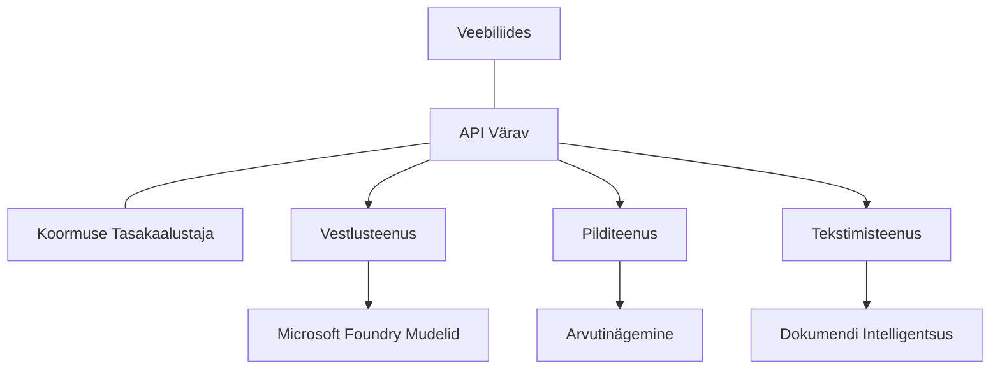

# Tootmise AI töökoormuste parimad tavad AZD-ga

**Kursuse navigeerimine:**
- **📚 Kursuse koduleht**: [AZD algajatele](../../README.md)
- **📖 Praegune peatükk**: Peatükk 8 - Tootmine & Ettevõtte mustrid
- **⬅️ Eelmine peatükk**: [Peatükk 7: Tõrkeotsing](../chapter-07-troubleshooting/debugging.md)
- **⬅️ Samuti seotud**: [AI töötoa labor](ai-workshop-lab.md)
- **🎯 Kursus lõpetatud**: [AZD algajatele](../../README.md)

## Ülevaade

See juhend annab põhjalikke parimaid tavasid tootmisvalmis AI töökoormuste juurutamiseks kasutades Azure Developer CLI-d (AZD). Tuginedes Microsoft Foundry Discord kogukonna tagasisidele ja päris klientide juurutustele, käsitlevad need tavad kõige tavalisemaid väljakutseid tootmis-AI süsteemides.

## Peamised käsitletud väljakutsed

Meie kogukonna küsitluse tulemustel on arendajatel järgmised peamised väljakutsed:

- **45%** võitlevad mitme teenusega AI juurutustega
- **38%** on probleeme volituste ja saladuste haldamisega  
- **35%** leiavad tootmisvalmiduse ja skaleerimise keeruliseks
- **32%** vajavad paremaid kulude optimeerimise strateegiaid
- **29%** nõuavad paremat jälgimist ja tõrkeotsingut

## Tootmis-AI arhitektuurimustrid

### Muster 1: Mikroteenused AI arhitektuur

**Millal kasutada**: Mitme võimekusega keerulised AI rakendused


**AZD rakendus**:

```yaml
# azure.yaml
name: enterprise-ai-platform
services:
  web:
    project: ./web
    host: staticwebapp
  api-gateway:
    project: ./api-gateway
    host: containerapp
  chat-service:
    project: ./services/chat
    host: containerapp
  vision-service:
    project: ./services/vision
    host: containerapp
  text-service:
    project: ./services/text
    host: containerapp
```

### Muster 2: Sündmustepõhine AI töötlemine

**Millal kasutada**: Pakettprotsessid, dokumendianalüüs, asünkroonsed töövood

```bicep
// Event Hub for AI processing pipeline
resource eventHub 'Microsoft.EventHub/namespaces@2023-01-01-preview' = {
  name: eventHubNamespaceName
  location: location
  sku: {
    name: 'Standard'
    tier: 'Standard'
    capacity: 1
  }
}

// Service Bus for reliable message processing
resource serviceBus 'Microsoft.ServiceBus/namespaces@2022-10-01-preview' = {
  name: serviceBusNamespaceName
  location: location
  sku: {
    name: 'Premium'
    tier: 'Premium'
    capacity: 1
  }
}

// Function App for processing
resource functionApp 'Microsoft.Web/sites@2023-01-01' = {
  name: functionAppName
  location: location
  kind: 'functionapp,linux'
  properties: {
    siteConfig: {
      appSettings: [
        {
          name: 'FUNCTIONS_EXTENSION_VERSION'
          value: '~4'
        }
        {
          name: 'AZURE_OPENAI_ENDPOINT'
          value: '@Microsoft.KeyVault(VaultName=${keyVault.name};SecretName=openai-endpoint)'
        }
      ]
    }
  }
}
```

## Mõtlemine AI agendi tervise üle

Kui traditsiooniline veebirakendus katki läheb, on sümptomid tuttavad: leht ei laadi, API annab vea või juurutus ebaõnnestub. AI-põhised rakendused võivad katki minna kõigil neil viisidel — kuid võivad käituda ka peenemalt, ilma ilmsete veateadeteta.

See lõik aitab sul luua vaimse mudeli AI töökoormuste jälgimiseks, et sa teaksid, kuhu vaadata, kui tundub, et midagi on paigast ära.

### Kuidas agentide tervis erineb traditsioonilise rakenduse tervisest

Tavaline rakendus kas töötab või ei tööta. AI agent võib tunduda töötavat, kuid anda halbu tulemusi. Mõtle agendi tervisele kahe kihina:

| Kiht | Mida jälgida | Kuhu vaadata |
|-------|--------------|--------------|
| **Tarkvara- ja infrastruktuuri tervis** | Kas teenus töötab? Kas ressursid on eraldatud? Kas lõpp-punktid on kättesaadavad? | `azd monitor`, Azure portaali ressursi tervis, konteineri/rakenduse logid |
| **Käitumise tervis** | Kas agent vastab täpselt? Kas vastused on õigeaegsed? Kas mudelit kutsutakse korrektselt? | Application Insights jäljed, mudeli kutsumise latentsuse mõõdikud, vastuste kvaliteedi logid |

Infrastruktuuri tervis on tuttav — see on sama mis igas azd rakenduses. Käitumise tervis on uus kiht, mida AI töökoormused lisavad.

### Kuhu vaadata, kui AI rakendused ei käitu ettenähtud moel

Kui sinu AI rakendus ei anna ootuspäraseid tulemusi, on siin kontseptuaalne kontrollnimekiri:

1. **Alusta põhitõdedest.** Kas rakendus töötab? Kas see pääseb ligi sõltuvustele? Kontrolli `azd monitorit` ja ressursi tervist nagu iga teise rakenduse puhul.
2. **Kontrolli mudeli ühendust.** Kas rakendus kutsub AI mudelit edukalt? Ebaõnnestunud või ajapiiranguga mudeli kutsed on kõige sagedasem AI rakenduse probleemide põhjus ning ilmnevad sinu rakenduse logides.
3. **Vaata, mida mudel sai.** AI vastused sõltuvad sisendist (käsklus ja saanud kontekst). Kui väljund on vale, on sisend tavaliselt vale. Kontrolli, kas su rakendus saadab mudelile õigeid andmeid.
4. **Vaata vastuste latentsust.** AI mudeli kutsed on aeglasemad kui tavalised API kutse. Kui rakendus tundub aeglane, kontrolli, kas mudeli vastuse aeg on kasvanud — see võib viidata piirangutele, mahupiiridele või piirkonnale omasele ummikule.
5. **Jälgi kulusignaale.** Ootamatud märkimisväärsed tõusud tokeni kasutuses või API kutsudes võivad viidata lõimule, valesti seadistatud käsule või liigselt korduvatele katsetele.

Sul ei ole vaja kohe kohe observability tööriistu päris meisterlikult osata. Peamine on, et AI rakendustel on täiendav käitumiskihi jälgimine ja azd sisseehitatud jälgimine (`azd monitor`) annab alust mõlema kihi uurimiseks.

---

## Turvalisuse parimad tavad

### 1. Nullus usaldus turvamudel

**Rakendamise strateegia**:
- Teenustevaheline suhtlus ainult autentimisega
- Kõik API kutsed kasutavad haldussubjekti (managed identity)
- Võrgu isoleerimine privaatsete lõpp-punktidega
- Vähemtähtsuse juurdepääsuõigused

```bicep
// Managed Identity for each service
resource chatServiceIdentity 'Microsoft.ManagedIdentity/userAssignedIdentities@2023-01-31' = {
  name: 'chat-service-identity'
  location: location
}

// Role assignments with minimal permissions
resource openAIUserRole 'Microsoft.Authorization/roleAssignments@2022-04-01' = {
  scope: openAIAccount
  name: guid(openAIAccount.id, chatServiceIdentity.id, openAIUserRoleDefinitionId)
  properties: {
    roleDefinitionId: subscriptionResourceId('Microsoft.Authorization/roleDefinitions', '5e0bd9bd-7b93-4f28-af87-19fc36ad61bd')
    principalId: chatServiceIdentity.properties.principalId
    principalType: 'ServicePrincipal'
  }
}
```

### 2. Turvaline saladuste haldus

**Key Vault integratsiooni muster**:

```bicep
// Key Vault with proper access policies
resource keyVault 'Microsoft.KeyVault/vaults@2023-02-01' = {
  name: keyVaultName
  location: location
  properties: {
    tenantId: tenant().tenantId
    sku: {
      family: 'A'
      name: 'premium'  // Use premium for production
    }
    enableRbacAuthorization: true  // Use RBAC instead of access policies
    enablePurgeProtection: true    // Prevent accidental deletion
    enableSoftDelete: true
    softDeleteRetentionInDays: 90
  }
}

// Store all AI service credentials
resource openAIKeySecret 'Microsoft.KeyVault/vaults/secrets@2023-02-01' = {
  parent: keyVault
  name: 'openai-api-key'
  properties: {
    value: openAIAccount.listKeys().key1
    attributes: {
      enabled: true
    }
  }
}
```

### 3. Võrgu turvalisus

**Privaatsete lõpp-punktide seadistus**:

```bicep
// Virtual Network for AI services
resource virtualNetwork 'Microsoft.Network/virtualNetworks@2023-04-01' = {
  name: vnetName
  location: location
  properties: {
    addressSpace: {
      addressPrefixes: ['10.0.0.0/16']
    }
    subnets: [
      {
        name: 'ai-services-subnet'
        properties: {
          addressPrefix: '10.0.1.0/24'
          privateEndpointNetworkPolicies: 'Disabled'
        }
      }
      {
        name: 'app-services-subnet'
        properties: {
          addressPrefix: '10.0.2.0/24'
          delegations: [
            {
              name: 'Microsoft.Web/serverFarms'
              properties: {
                serviceName: 'Microsoft.Web/serverFarms'
              }
            }
          ]
        }
      }
    ]
  }
}

// Private endpoints for all AI services
resource openAIPrivateEndpoint 'Microsoft.Network/privateEndpoints@2023-04-01' = {
  name: '${openAIAccountName}-pe'
  location: location
  properties: {
    subnet: {
      id: virtualNetwork.properties.subnets[0].id
    }
    privateLinkServiceConnections: [
      {
        name: 'openai-connection'
        properties: {
          privateLinkServiceId: openAIAccount.id
          groupIds: ['account']
        }
      }
    ]
  }
}
```

## Jõudluse ja skaleerimise tavad

### 1. Automaatse skaleerimise strateegiad

**Container Apps automaatne skaleerimine**:

```bicep
resource containerApp 'Microsoft.App/containerApps@2023-05-01' = {
  name: containerAppName
  location: location
  properties: {
    configuration: {
      ingress: {
        external: true
        targetPort: 8000
        transport: 'http'
      }
    }
    template: {
      scale: {
        minReplicas: 2  // Always have 2 instances minimum
        maxReplicas: 50 // Scale up to 50 for high load
        rules: [
          {
            name: 'http-scaling'
            http: {
              metadata: {
                concurrentRequests: '20'  // Scale when >20 concurrent requests
              }
            }
          }
          {
            name: 'cpu-scaling'
            custom: {
              type: 'cpu'
              metadata: {
                type: 'Utilization'
                value: '70'  // Scale when CPU >70%
              }
            }
          }
        ]
      }
    }
  }
}
```

### 2. Vahemälu strateegiad

**Redis vahemälu AI vastustele**:

```bicep
// Redis Premium for production workloads
resource redisCache 'Microsoft.Cache/redis@2023-04-01' = {
  name: redisCacheName
  location: location
  properties: {
    sku: {
      name: 'Premium'
      family: 'P'
      capacity: 1
    }
    enableNonSslPort: false
    minimumTlsVersion: '1.2'
    redisConfiguration: {
      'maxmemory-policy': 'allkeys-lru'
    }
    // Enable clustering for high availability
    redisVersion: '6.0'
    shardCount: 2
  }
}

// Cache configuration in application
var cacheConnectionString = '${redisCache.properties.hostName}:6380,password=${redisCache.listKeys().primaryKey},ssl=True,abortConnect=False'
```

### 3. Koormuse tasakaalustamine ja liikluse juhtimine

**Application Gateway koos WAF-iga**:

```bicep
// Application Gateway with Web Application Firewall
resource applicationGateway 'Microsoft.Network/applicationGateways@2023-04-01' = {
  name: appGatewayName
  location: location
  properties: {
    sku: {
      name: 'WAF_v2'
      tier: 'WAF_v2'
      capacity: 2
    }
    webApplicationFirewallConfiguration: {
      enabled: true
      firewallMode: 'Prevention'
      ruleSetType: 'OWASP'
      ruleSetVersion: '3.2'
    }
    // Backend pools for AI services
    backendAddressPools: [
      {
        name: 'ai-services-pool'
        properties: {
          backendAddresses: [
            {
              fqdn: '${containerApp.properties.configuration.ingress.fqdn}'
            }
          ]
        }
      }
    ]
  }
}
```

## 💰 Kulude optimeerimine

### 1. Resursside õigesti suurendamine

**Keskkonnapõhised konfiguratsioonid**:

```bash
# Arenduskeskkond
azd env new development
azd env set AZURE_OPENAI_SKU "S0"
azd env set AZURE_OPENAI_CAPACITY 10
azd env set AZURE_SEARCH_SKU "basic"
azd env set CONTAINER_CPU 0.5
azd env set CONTAINER_MEMORY 1.0

# Tootmiskeskkond
azd env new production
azd env set AZURE_OPENAI_SKU "S0"
azd env set AZURE_OPENAI_CAPACITY 100
azd env set AZURE_SEARCH_SKU "standard"
azd env set CONTAINER_CPU 2.0
azd env set CONTAINER_MEMORY 4.0
```

### 2. Kulude jälgimine ja eelarved

```bicep
// Cost management and budgets
resource budget 'Microsoft.Consumption/budgets@2023-05-01' = {
  name: 'ai-workload-budget'
  properties: {
    timePeriod: {
      startDate: '2024-01-01'
      endDate: '2024-12-31'
    }
    timeGrain: 'Monthly'
    amount: 2000  // $2000 monthly budget
    category: 'Cost'
    notifications: {
      warning: {
        enabled: true
        operator: 'GreaterThan'
        threshold: 80
        contactEmails: [
          'finance@company.com'
          'engineering@company.com'
        ]
        contactRoles: [
          'Owner'
          'Contributor'
        ]
      }
      critical: {
        enabled: true
        operator: 'GreaterThan'
        threshold: 95
        contactEmails: [
          'cto@company.com'
        ]
      }
    }
  }
}
```

### 3. Tokeni kasutuse optimeerimine

**OpenAI kulude haldus**:

```typescript
// Rakenduse tasandi tokenite optimeerimine
class TokenOptimizer {
  private readonly maxTokens = 4000;
  private readonly reserveTokens = 500;
  
  optimizePrompt(userInput: string, context: string): string {
    const availableTokens = this.maxTokens - this.reserveTokens;
    const estimatedTokens = this.estimateTokens(userInput + context);
    
    if (estimatedTokens > availableTokens) {
      // Lühenda konteksti, mitte kasutaja sisendit
      context = this.truncateContext(context, availableTokens - this.estimateTokens(userInput));
    }
    
    return `${context}\n\nUser: ${userInput}`;
  }
  
  private estimateTokens(text: string): number {
    // Umbkõige hinnang: 1 token ≈ 4 tähemärki
    return Math.ceil(text.length / 4);
  }
}
```

## Jälgimine ja nähtavus

### 1. Põhjalik Application Insights

```bicep
// Application Insights with advanced features
resource applicationInsights 'Microsoft.Insights/components@2020-02-02' = {
  name: applicationInsightsName
  location: location
  kind: 'web'
  properties: {
    Application_Type: 'web'
    WorkspaceResourceId: logAnalyticsWorkspace.id
    SamplingPercentage: 100  // Full sampling for AI apps
    DisableIpMasking: false  // Enable for security
  }
}

// Custom metrics for AI operations
resource aiMetricAlerts 'Microsoft.Insights/metricAlerts@2018-03-01' = {
  name: 'ai-high-error-rate'
  location: 'global'
  properties: {
    description: 'Alert when AI service error rate is high'
    severity: 2
    enabled: true
    scopes: [
      applicationInsights.id
    ]
    evaluationFrequency: 'PT1M'
    windowSize: 'PT5M'
    criteria: {
      'odata.type': 'Microsoft.Azure.Monitor.SingleResourceMultipleMetricCriteria'
      allOf: [
        {
          name: 'high-error-rate'
          metricName: 'requests/failed'
          operator: 'GreaterThan'
          threshold: 10
          timeAggregation: 'Count'
        }
      ]
    }
  }
}
```

### 2. AI-spetsiifiline jälgimine

**Kohandatud armatuurlauad AI mõõdikutele**:

```json
// Dashboard configuration for AI workloads
{
  "dashboard": {
    "name": "AI Application Monitoring",
    "tiles": [
      {
        "name": "OpenAI Request Volume",
        "query": "requests | where name contains 'openai' | summarize count() by bin(timestamp, 5m)"
      },
      {
        "name": "AI Response Latency",
        "query": "requests | where name contains 'openai' | summarize avg(duration) by bin(timestamp, 5m)"
      },
      {
        "name": "Token Usage",
        "query": "customMetrics | where name == 'openai_tokens_used' | summarize sum(value) by bin(timestamp, 1h)"
      },
      {
        "name": "Cost per Hour",
        "query": "customMetrics | where name == 'openai_cost' | summarize sum(value) by bin(timestamp, 1h)"
      }
    ]
  }
}
```

### 3. Tervisekontrollid ja tööaja jälgimine

```bicep
// Application Insights availability tests
resource availabilityTest 'Microsoft.Insights/webtests@2022-06-15' = {
  name: 'ai-app-availability-test'
  location: location
  tags: {
    'hidden-link:${applicationInsights.id}': 'Resource'
  }
  properties: {
    SyntheticMonitorId: 'ai-app-availability-test'
    Name: 'AI Application Availability Test'
    Description: 'Tests AI application endpoints'
    Enabled: true
    Frequency: 300  // 5 minutes
    Timeout: 120    // 2 minutes
    Kind: 'ping'
    Locations: [
      {
        Id: 'us-east-2-azr'
      }
      {
        Id: 'us-west-2-azr'
      }
    ]
    Configuration: {
      WebTest: '''
        <WebTest Name="AI Health Check" 
                 Id="8d2de8d2-a2b0-4c2e-9a0d-8f9c9a0b8c8d" 
                 Enabled="True" 
                 CssProjectStructure="" 
                 CssIteration="" 
                 Timeout="120" 
                 WorkItemIds="" 
                 xmlns="http://microsoft.com/schemas/VisualStudio/TeamTest/2010" 
                 Description="" 
                 CredentialUserName="" 
                 CredentialPassword="" 
                 PreAuthenticate="True" 
                 Proxy="default" 
                 StopOnError="False" 
                 RecordedResultFile="" 
                 ResultsLocale="">
          <Items>
            <Request Method="GET" 
                     Guid="a5f10126-e4cd-570d-961c-cea43999a200" 
                     Version="1.1" 
                     Url="${webApp.properties.defaultHostName}/health" 
                     ThinkTime="0" 
                     Timeout="120" 
                     ParseDependentRequests="True" 
                     FollowRedirects="True" 
                     RecordResult="True" 
                     Cache="False" 
                     ResponseTimeGoal="0" 
                     Encoding="utf-8" 
                     ExpectedHttpStatusCode="200" 
                     ExpectedResponseUrl="" 
                     ReportingName="" 
                     IgnoreHttpStatusCode="False" />
          </Items>
        </WebTest>
      '''
    }
  }
}
```

## Katastroofide taastumine ja kõrge kättesaadavus

### 1. Mitme regiooni juurutus

```yaml
# azure.yaml - Multi-region configuration
name: ai-app-multiregion
services:
  api-primary:
    project: ./api
    host: containerapp
    env:
      - AZURE_REGION=eastus
  api-secondary:
    project: ./api
    host: containerapp
    env:
      - AZURE_REGION=westus2
```

```bicep
// Traffic Manager for global load balancing
resource trafficManager 'Microsoft.Network/trafficManagerProfiles@2022-04-01' = {
  name: trafficManagerProfileName
  location: 'global'
  properties: {
    profileStatus: 'Enabled'
    trafficRoutingMethod: 'Priority'
    dnsConfig: {
      relativeName: trafficManagerProfileName
      ttl: 30
    }
    monitorConfig: {
      protocol: 'HTTPS'
      port: 443
      path: '/health'
      intervalInSeconds: 30
      toleratedNumberOfFailures: 3
      timeoutInSeconds: 10
    }
    endpoints: [
      {
        name: 'primary-endpoint'
        type: 'Microsoft.Network/trafficManagerProfiles/azureEndpoints'
        properties: {
          targetResourceId: primaryAppService.id
          endpointStatus: 'Enabled'
          priority: 1
        }
      }
      {
        name: 'secondary-endpoint'
        type: 'Microsoft.Network/trafficManagerProfiles/azureEndpoints'
        properties: {
          targetResourceId: secondaryAppService.id
          endpointStatus: 'Enabled'
          priority: 2
        }
      }
    ]
  }
}
```

### 2. Andmete varundamine ja taastamine

```bicep
// Backup configuration for critical data
resource backupVault 'Microsoft.DataProtection/backupVaults@2023-05-01' = {
  name: backupVaultName
  location: location
  identity: {
    type: 'SystemAssigned'
  }
  properties: {
    storageSettings: [
      {
        datastoreType: 'VaultStore'
        type: 'LocallyRedundant'
      }
    ]
  }
}

// Backup policy for AI models and data
resource backupPolicy 'Microsoft.DataProtection/backupVaults/backupPolicies@2023-05-01' = {
  parent: backupVault
  name: 'ai-data-backup-policy'
  properties: {
    policyRules: [
      {
        backupParameters: {
          backupType: 'Full'
          objectType: 'AzureBackupParams'
        }
        trigger: {
          schedule: {
            repeatingTimeIntervals: [
              'R/2024-01-01T02:00:00+00:00/P1D'  // Daily at 2 AM
            ]
          }
          objectType: 'ScheduleBasedTriggerContext'
        }
        dataStore: {
          datastoreType: 'VaultStore'
          objectType: 'DataStoreInfoBase'
        }
        name: 'BackupDaily'
        objectType: 'AzureBackupRule'
      }
    ]
  }
}
```

## DevOps ja CI/CD integratsioon

### 1. GitHub Actions töövoog

```yaml
# .github/workflows/deploy-ai-app.yml
name: Deploy AI Application

on:
  push:
    branches: [main]
  pull_request:
    branches: [main]

jobs:
  test:
    runs-on: ubuntu-latest
    steps:
      - uses: actions/checkout@v4
      
      - name: Setup Python
        uses: actions/setup-python@v4
        with:
          python-version: '3.11'
          
      - name: Install dependencies
        run: |
          pip install -r requirements.txt
          pip install pytest
          
      - name: Run tests
        run: pytest tests/
        
      - name: AI Safety Tests
        run: |
          python scripts/test_ai_safety.py
          python scripts/validate_prompts.py

  deploy-staging:
    needs: test
    if: github.event_name == 'pull_request'
    runs-on: ubuntu-latest
    steps:
      - uses: actions/checkout@v4
      
      - name: Setup AZD
        uses: Azure/setup-azd@v2
        
      - name: Login to Azure
        uses: azure/login@v1
        with:
          creds: ${{ secrets.AZURE_CREDENTIALS }}
          
      - name: Deploy to Staging
        run: |
          azd env select staging
          azd deploy

  deploy-production:
    needs: test
    if: github.ref == 'refs/heads/main'
    runs-on: ubuntu-latest
    steps:
      - uses: actions/checkout@v4
      
      - name: Setup AZD
        uses: Azure/setup-azd@v2
        
      - name: Login to Azure
        uses: azure/login@v1
        with:
          creds: ${{ secrets.AZURE_CREDENTIALS }}
          
      - name: Deploy to Production
        run: |
          azd env select production
          azd deploy
          
      - name: Run Production Health Checks
        run: |
          python scripts/health_check.py --env production
```

### 2. Infrastruktuuri valideerimine

```bash
# scripts/validate_infrastructure.sh
#!/bin/bash

echo "Validating AI infrastructure deployment..."

# Kontrolli, kas kõik vajalikud teenused töötavad
services=("openai" "search" "storage" "keyvault")
for service in "${services[@]}"; do
    echo "Checking $service..."
    if ! az resource list --resource-type "Microsoft.CognitiveServices/accounts" --query "[?contains(name, '$service')]" -o tsv; then
        echo "ERROR: $service not found"
        exit 1
    fi
done

# Kontrolli OpenAI mudelite juurutusi
echo "Validating OpenAI model deployments..."
models=$(az cognitiveservices account deployment list --name $AZURE_OPENAI_NAME --resource-group $AZURE_RESOURCE_GROUP --query "[].name" -o tsv)
if [[ ! $models == *"gpt-4.1-mini"* ]]; then
  echo "ERROR: Required model gpt-4.1-mini not deployed"
    exit 1
fi

# Testi AI teenuse ühenduvust
echo "Testing AI service connectivity..."
python scripts/test_connectivity.py

echo "Infrastructure validation completed successfully!"
```

## Tootmise valmisoleku kontrollnimekiri

### Turvalisus ✅
- [ ] Kõik teenused kasutavad haldussubjekte
- [ ] Saladused salvestatud Key Vaultis
- [ ] Privaatseid lõpp-punkte konfigureeritud
- [ ] Rakendatud võrgu turvarühmad
- [ ] RBAC vähima õigusega
- [ ] WAF avalikel lõpp-punktidel lubatud

### Jõudlus ✅
- [ ] Automaatne skaleerimine seadistatud
- [ ] Vahemällu salvestamine kasutusel
- [ ] Koormuse tasakaalustamine seatud
- [ ] CDN staatilise sisu jaoks
- [ ] Andmebaasi ühenduste grupeerimine
- [ ] Tokeni kasutuse optimeerimine

### Jälgimine ✅
- [ ] Application Insights seadistatud
- [ ] Kohandatud mõõdikud määratletud
- [ ] Häire reeglid seadistatud
- [ ] Armatuurlaud loodud
- [ ] Tervisekontrollid rakendatud
- [ ] Logide säilituspoliitikad

### Usaldusväärsus ✅
- [ ] Mitme regiooni juurutus
- [ ] Varundamise ja taastamise plaan
- [ ] Katkestusskeemid rakendatud
- [ ] Korduskatsete poliitikad seadistatud
- [ ] Graatsiline degradeerumine
- [ ] Tervisekontrolli lõpp-punktid

### Kulujuhtimine ✅
- [ ] Eelarvehäired konfigureeritud
- [ ] Ressursside õige suurus
- [ ] Arendus/test allahindlused rakendatud
- [ ] Eeldatud instantsid ostetud
- [ ] Kulude jälgimise armatuurlaud
- [ ] Regulaarne kulude ülevaatus

### Vastavus ✅
- [ ] Andmekohalolu nõuded täidetud
- [ ] Auditlogimine lubatud
- [ ] Vastavuspoliitikad rakendatud
- [ ] Turvabaasid rakendatud
- [ ] Regulaarne turva-audit
- [ ] Intsidentidele reageerimise plaan

## Jõudlustestide näitajad

### Tüüpilised tootmismõõdikud

| Mõõdik | Siht | Jälgimine |
|--------|-------|-----------|
| **Vastus aeg** | < 2 sekundit | Application Insights |
| **Kättesaadavus** | 99,9% | Tööaja jälgimine |
| **Vigade määr** | < 0,1% | Rakenduse logid |
| **Tokenite kasutus** | < 500 $ kuus | Kulude haldus |
| **Samaaegsed kasutajad** | 1000+ | Koormustestimine |
| **Taastumisaeg** | < 1 tund | Katastroofi taastamise testid |

### Koormustestimine

```bash
# Laadimise testimise skript tehisintellekti rakenduste jaoks
python scripts/load_test.py \
  --endpoint https://your-ai-app.azurewebsites.net \
  --concurrent-users 100 \
  --duration 300 \
  --ramp-up 60
```

## 🤝 Kogukonna parimad tavad

Põhinedes Microsoft Foundry Discord kogukonna tagasisidel:

### Kogukonna peamised soovitused:

1. **Alusta väikeselt, skaleeri järk-järgult**: Alusta põhiliste SKU-dega ja skaleeri vastavalt tegelikule kasutusele
2. **Jälgi kõike**: Loo põhjalik jälgimine esimesest päevast
3. **Automatiseeri turvalisus**: Kasuta infrastruktuuri koodina järjepideva turvalisuse tagamiseks
4. **Testi põhjalikult**: Kaasa AI-spetsiifilised testid oma töövoogu
5. **Plaani kulud**: Jälgi tokeni kasutust ja sea varakult eelarvehäired

### Sageli vältimatud vead:

- ❌ API võtmepõhised väärtused koodis
- ❌ Ebapiisava jälgimise seadistamine
- ❌ Kulude optimeerimise ignoreerimine
- ❌ Ebaõnnestumise stsenaariumite testimata jätmine
- ❌ Juurutus ilma tervisekontrollideta

## AZD AI CLI käsud ja laiendused

AZD sisaldab kasvavat komplekti AI-spetsiifilisi käske ja laiendusi, mis sujuvdavad tootmise AI töövooge. Need tööriistad täidavad silda lokaalse arenduse ja tootmise juurutuse vahel AI töökoormustele.

### AI laiendused AZD jaoks

AZD kasutab laiendussüsteemi AI-spetsiifiliste funktsioonide lisamiseks. Paigalda ja halda laiendusi käsuga:

```bash
# Loetle kõik saadaolevad laiendused (sh tehisintellekt)
azd extension list

# Uuri paigaldatud laienduse üksikasju
azd extension show azure.ai.agents

# Paigalda Foundry agentide laiendus
azd extension install azure.ai.agents

# Paigalda peenhäälestamise laiendus
azd extension install azure.ai.finetune

# Paigalda kohandatud mudelite laiendus
azd extension install azure.ai.models

# Uuenda kõiki paigaldatud laiendusi
azd extension upgrade --all
```

**Saadaval olevad AI laiendused:**

| Laiendus | Eesmärk | Staatus |
|-----------|---------|---------|
| `azure.ai.agents` | Foundry agendi teenuse haldus | Eelvaade |
| `azure.ai.finetune` | Foundry mudeli peenhäälestus | Eelvaade |
| `azure.ai.models` | Foundry kohandatud mudelid | Eelvaade |
| `azure.coding-agent` | Koodimise agendi seadistamine | Saadaval |

### Agentide projektide initsialiseerimine käsuga `azd ai agent init`

`azd ai agent init` käsk genereerib tootmisvalmis AI agendi projekti, mis on integreeritud Microsoft Foundry Agent Teenusega:

```bash
# Algata uus agendi projekt agendi manifestist
azd ai agent init -m <manifest-path-or-uri>

# Algata ja suuna konkreetsele Foundry projektile
azd ai agent init -m agent-manifest.yaml --project-id <foundry-project-id>

# Algata kohandatud lähtekaustaga
azd ai agent init -m agent-manifest.yaml --src ./agents/my-agent

# Suuna Container Appsidele hostina
azd ai agent init -m agent-manifest.yaml --host containerapp
```

**Olulised lipud:**

| Lipp | Kirjeldus |
|------|-----------|
| `-m, --manifest` | Tee või URI agendi manifestile, mida lisada projekti |
| `-p, --project-id` | Olemasoleva Microsoft Foundry projekti ID sinu azd keskkonna jaoks |
| `-s, --src` | Kaust agendi definitsiooni allalaadimiseks (vaikimisi `src/<agent-id>`) |
| `--host` | Vaheta vaikimisi hosti (nt `containerapp`) |
| `-e, --environment` | Kasutatav azd keskkond |

**Tootmise näpunäide**: Kasuta `--project-id`, et otse ühendada olemasoleva Foundry projektiga, hoides oma agendi koodi ja pilveressursid algusest sidusana.

### Mudeli konteksti protokoll (MCP) käsuga `azd mcp`

AZD sisaldab sisseehitatud MCP serveri tuge (Alfa), mis võimaldab AI agentidel ja tööriistadel suhelda sinu Azure ressurssidega standardiseeritud protokolli kaudu:

```bash
# Käivita MCP server oma projekti jaoks
azd mcp start

# Ülevaatamine kehtivatest Copiloti nõusoleku reeglitest tööriista käivitamiseks
azd copilot consent list
```

MCP server eksponeerib sinu azd projekti konteksti — keskkonnad, teenused ja Azure ressursid — AI-põhistele arendustööriistadele. See võimaldab:

- **AI abistatud juurutus**: Las koodimise agentidel on võimalik pärida sinu projekti olekut ja käivitada juurutusi
- **Ressursside avastamine**: AI tööriistad saavad avastada, mida sinu projekt Azure's kasutab
- **Keskkondade haldus**: Agendid saavad lülituda arendus-/testimis-/tootmiskeskkondade vahel

### Infrastruktuuri genereerimine käsuga `azd infra generate`

Tootmisvalmis AI töökoormuste jaoks võid genereerida ja kohandada Infrastructure as Code'i, selle asemel et toetuda automaatsele provisjonimisele:

```bash
# Genereeri Bicep/Terraform failid oma projekti definitsioonist
azd infra generate
```

See kirjutab IaC kõvakettale, et sa saaksid:
- Ülevaadata ja auditeerida infrastruktuuri enne juurutust
- Lisada kohandatud turvapoliitikaid (võrgu reeglid, privaatväljad)
- Integreerida olemasolevatesse IaC ülevaatusprotsessidesse
- Versioonikontrollida infrastruktuuri muudatusi eraldi rakenduse koodist

### Tootmise elutsükli konksud

AZD konksud lubavad sul süstida kohandatud loogikat iga juurutusetapi ajal — mis on kriitiline tootmise AI töövoogudes:

```yaml
# azure.yaml - Production hooks example
name: ai-production-app
hooks:
  preprovision:
    shell: sh
    run: scripts/validate-quotas.sh    # Check AI model quota before provisioning
  postprovision:
    shell: sh
    run: scripts/configure-networking.sh  # Set up private endpoints
  predeploy:
    shell: sh
    run: scripts/run-ai-safety-tests.sh  # Run prompt safety checks
  postdeploy:
    shell: sh
    run: scripts/smoke-test.sh           # Verify agent responses post-deploy
services:
  agent-api:
    project: ./src/agent
    host: containerapp
    hooks:
      predeploy:
        shell: sh
        run: scripts/validate-model-access.sh  # Per-service hook
```

```bash
# Käivitage konkreetne konks käsitsi arendamise ajal
azd hooks run predeploy
```

**Soovitatud tootmise konksud AI töökoormustele:**

| Konks | Kasutusjuhtum |
|-------|---------------|
| `preprovision` | Kontrolli tellimuse kvotasid AI mudeli mahtude jaoks |
| `postprovision` | Konfigureeri privaatpäised, juuruta mudeli kaalu failid |
| `predeploy` | Käivita AI ohutustestid, valideeri käsklustemplatid |
| `postdeploy` | Tee suitsutest agendi vastustele, kontrolli mudeli ühenduvust |

### CI/CD torujuhtme seadistamine

Kasuta `azd pipeline config` oma projekti ühendamiseks GitHub Actions või Azure Pipelines'iga, turvalise Azure autentimisega:

```bash
# Konfigureeri CI/CD torujuhe (interaktiivne)
azd pipeline config

# Konfigureeri konkreetse pakkujaga
azd pipeline config --provider github
```

See käsk:
- Loob teenusobjekti vähima õigusega ligipääsuga
- Seadistab föderatiivsed volitused (ilma salvestatud salasõnadeta)
- Genereerib või uuendab torujuhtme definitsiooni faili
- Seadistab vajalikke keskkonnamuutujaid su CI/CD süsteemis

**Tootmise töövoog koos torujuhtme seadistusega:**

```bash
# 1. Seadistage tootmiskeskkond
azd env new production
azd env set AZURE_OPENAI_CAPACITY 100

# 2. Konfigureerige pipeline
azd pipeline config --provider github

# 3. Pipeline käivitab azd deploy iga kord, kui tehakse push main harusse
```

### Komponentide lisamine käsuga `azd add`

Lisa järk-järgult Azure teenuseid olemasolevale projektile:

```bash
# Lisa uus teenusekomponent interaktiivselt
azd add
```

See on eriti kasulik tootmis-AI rakenduste laiendamisel — näiteks vektoriotsingu teenuse, uue agendi lõpp-punkti või jälgimise komponendi lisamiseks olemasolevale juurutusele.

## Lisamaterjalid
- **Azure hästi arhitektuurne raamistik**: [AI töökoormuse juhised](https://learn.microsoft.com/azure/well-architected/ai/)
- **Microsoft Foundry dokumentatsioon**: [Ametlikud dokumendid](https://learn.microsoft.com/azure/ai-studio/)
- **Kogukonna mallid**: [Azure näidised](https://github.com/Azure-Samples)
- **Discordi kogukond**: [#Azure kanal](https://discord.gg/microsoft-azure)
- **Agentide oskused Azure jaoks**: [microsoft/github-copilot-for-azure aadressil skills.sh](https://skills.sh/microsoft/github-copilot-for-azure) - 37 avatud agendi oskust Azure AI, Foundry, juurutamise, kulude optimeerimise ja diagnostika jaoks. Paigalda oma redaktoris:
  ```bash
  npx skills add microsoft/github-copilot-for-azure
  ```

---

**Peatüki navigeerimine:**
- **📚 Kursuse avaleht**: [AZD algajatele](../../README.md)
- **📖 Praegune peatükk**: Peatükk 8 - Tootmise ja ettevõtte mustrid
- **⬅️ Eelmine peatükk**: [Peatükk 7: Probleemide lahendamine](../chapter-07-troubleshooting/debugging.md)
- **⬅️ Samuti seotud**: [AI töötuba labor](ai-workshop-lab.md)
- **� Kursus lõpetatud**: [AZD algajatele](../../README.md)

**Pea meeles**: tootmises kasutatavad AI töökoormused vajavad hoolikat planeerimist, jälgimist ja pidevat optimeerimist. Alusta nende mustritega ja kohanda neid oma konkreetsetele nõuetele.

---

<!-- CO-OP TRANSLATOR DISCLAIMER START -->
**Vastutusest loobumine**:  
See dokument on tõlgitud tehisintellekti tõlketeenuse [Co-op Translator](https://github.com/Azure/co-op-translator) abil. Kuigi püüame tagada täpsuse, palun arvestage, et automaatsed tõlked võivad sisaldada vigu või ebatäpsusi. Originaaldokument selle emakeeles tuleks pidada autoriteetseks allikaks. Olulise info korral soovitatakse kasutada professionaalset inimtõlget. Me ei vastuta tõlkest tulenevate arusaamatuste või valesti mõistmiste eest.
<!-- CO-OP TRANSLATOR DISCLAIMER END -->