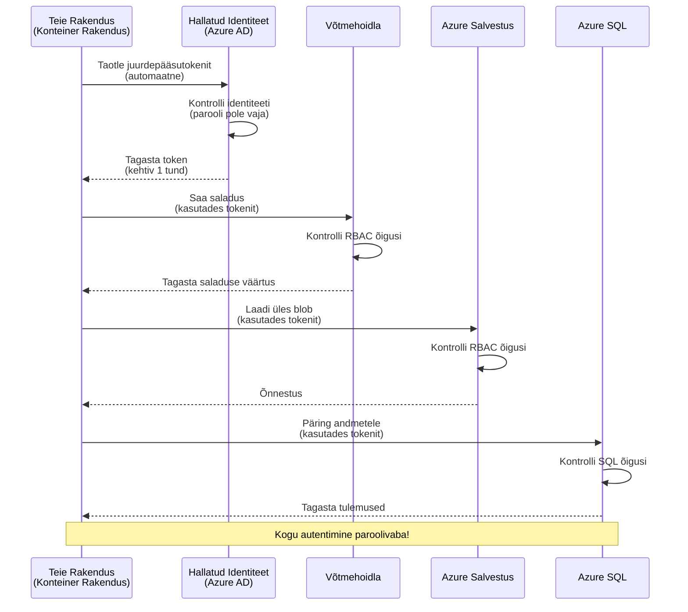
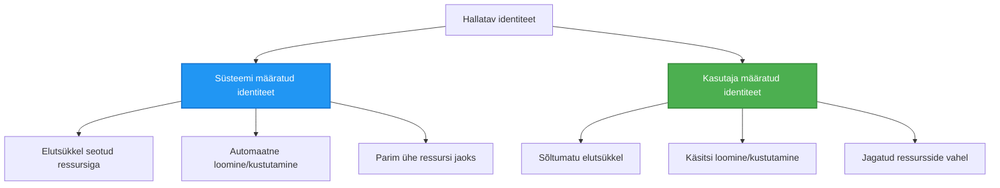

<!--
CO_OP_TRANSLATOR_METADATA:
{
  "original_hash": "e13ff6e1197e0a7462ed0aede7df9f23",
  "translation_date": "2025-11-24T15:40:47+00:00",
  "source_file": "docs/getting-started/authsecurity.md",
  "language_code": "et"
}
-->
# Autentimismustrid ja hallatud identiteet

⏱️ **Hinnanguline aeg**: 45-60 minutit | 💰 **Kulude mõju**: Tasuta (lisakulusid pole) | ⭐ **Keerukus**: Keskmine

**📚 Õppeteekond:**
- ← Eelmine: [Konfiguratsioonihaldus](configuration.md) - Keskkonnamuutujate ja saladuste haldamine
- 🎯 **Oled siin**: Autentimine ja turvalisus (hallatud identiteet, Key Vault, turvalised mustrid)
- → Järgmine: [Esimene projekt](first-project.md) - Loo oma esimene AZD rakendus
- 🏠 [Kursuse avaleht](../../README.md)

---

## Mida sa õpid

Selle õppetunni läbimisel:
- Saad aru Azure autentimismustritest (võtmed, ühendusstringid, hallatud identiteet)
- Rakendad **hallatud identiteeti** paroolivabaks autentimiseks
- Kaitsed saladusi **Azure Key Vault** integratsiooniga
- Konfigureerid **rollipõhise juurdepääsukontrolli (RBAC)** AZD juurutuste jaoks
- Rakendad turvalisuse parimaid tavasid konteinerirakendustes ja Azure teenustes
- Viid võtmetel põhineva autentimise üle identiteedipõhisele autentimisele

## Miks hallatud identiteet on oluline

### Probleem: Traditsiooniline autentimine

**Enne hallatud identiteeti:**
```javascript
// ❌ TURVARISK: Koodis kõvakodeeritud saladused
const connectionString = "Server=mydb.database.windows.net;User=admin;Password=P@ssw0rd123";
const storageKey = "xK7mN9pQ2wR5tY8uI0oP3aS6dF1gH4jK...";
const cosmosKey = "C2x7B9n4M1p8Q5w3E6r0T2y5U8i1O4p7...";
```

**Probleemid:**
- 🔴 **Paljastatud saladused** koodis, konfiguratsioonifailides, keskkonnamuutujates
- 🔴 **Mandaatide uuendamine** nõuab koodimuudatusi ja uuesti juurutamist
- 🔴 **Auditiprobleemid** - kes pääses ligi ja millal?
- 🔴 **Kaos** - saladused hajutatud mitmesse süsteemi
- 🔴 **Vastavusprobleemid** - ei vasta turvanõuetele

### Lahendus: Hallatud identiteet

**Pärast hallatud identiteeti:**
```javascript
// ✅ TURVALINE: Koodis pole saladusi
const credential = new DefaultAzureCredential();
const client = new BlobServiceClient(
  "https://mystorageaccount.blob.core.windows.net",
  credential  // Azure haldab autentimist automaatselt
);
```

**Eelised:**
- ✅ **Null saladust** koodis või konfiguratsioonis
- ✅ **Automaatne uuendamine** - Azure haldab seda
- ✅ **Täielik auditeerimisjälg** Azure AD logides
- ✅ **Keskne turvalisus** - haldamine Azure portaalis
- ✅ **Vastavusvalmis** - vastab turvastandarditele

**Võrdlus**: Traditsiooniline autentimine on nagu mitme füüsilise võtme kaasaskandmine erinevate uste jaoks. Hallatud identiteet on nagu turvakaart, mis annab automaatselt juurdepääsu vastavalt sellele, kes sa oled – pole võtmeid, mida kaotada, kopeerida või uuendada.

---

## Arhitektuuri ülevaade

### Autentimisvoog hallatud identiteediga


### Hallatud identiteetide tüübid


| Funktsioon | Süsteemiga seotud | Kasutajaga seotud |
|------------|-------------------|-------------------|
| **Elutsükkel** | Seotud ressursiga | Sõltumatu |
| **Loomine** | Automaatne ressursiga | Käsitsi loomine |
| **Kustutamine** | Kustutatakse koos ressursiga | Säilib pärast ressursi kustutamist |
| **Jagamine** | Ainult üks ressurss | Mitu ressurssi |
| **Kasutusjuhtum** | Lihtsad stsenaariumid | Keerukad mitme ressursi stsenaariumid |
| **AZD vaikevalik** | ✅ Soovitatav | Valikuline |

---

## Eeltingimused

### Vajalikud tööriistad

Sul peaksid olema need tööriistad juba eelmistest õppetundidest paigaldatud:

```bash
# Kontrolli Azure Developer CLI-d
azd version
# ✅ Oodatav: azd versioon 1.0.0 või uuem

# Kontrolli Azure CLI-d
az --version
# ✅ Oodatav: azure-cli 2.50.0 või uuem
```

### Azure'i nõuded

- Aktiivne Azure'i tellimus
- Õigused:
  - Hallatud identiteetide loomine
  - RBAC rollide määramine
  - Key Vault ressursside loomine
  - Konteinerirakenduste juurutamine

### Teadmiste eeldused

Sa peaksid olema läbinud:
- [Paigaldusjuhend](installation.md) - AZD seadistamine
- [AZD põhialused](azd-basics.md) - Põhimõisted
- [Konfiguratsioonihaldus](configuration.md) - Keskkonnamuutujad

---

## Õppetund 1: Autentimismustrite mõistmine

### Muster 1: Ühendusstringid (pärand - vältida)

**Kuidas see töötab:**
```bash
# Ühenduse string sisaldab mandaate
STORAGE_CONNECTION_STRING="DefaultEndpointsProtocol=https;AccountName=myaccount;AccountKey=xK7mN9pQ2wR5..."
COSMOS_CONNECTION_STRING="AccountEndpoint=https://myaccount.documents.azure.com:443/;AccountKey=C2x7..."
SQL_CONNECTION_STRING="Server=myserver.database.windows.net;User=admin;Password=P@ssw0rd..."
```

**Probleemid:**
- ❌ Saladused nähtavad keskkonnamuutujates
- ❌ Logitakse juurutussüsteemides
- ❌ Raske uuendada
- ❌ Pole juurdepääsu auditeerimisjälge

**Millal kasutada:** Ainult kohalikuks arenduseks, mitte kunagi tootmises.

---

### Muster 2: Key Vault viited (parem)

**Kuidas see töötab:**
```bicep
// Store secret in Key Vault
resource keyVault 'Microsoft.KeyVault/vaults@2023-02-01' = {
  name: 'mykv'
  properties: {
    enableRbacAuthorization: true
  }
}

// Reference in Container App
env: [
  {
    name: 'STORAGE_KEY'
    secretRef: 'storage-key'  // References Key Vault
  }
]
```

**Eelised:**
- ✅ Saladused on turvaliselt salvestatud Key Vaultis
- ✅ Keskne saladuste haldamine
- ✅ Uuendamine ilma koodimuudatusteta

**Piirangud:**
- ⚠️ Ikka kasutatakse võtmeid/paroolid
- ⚠️ Key Vaulti juurdepääsu haldamine vajalik

**Millal kasutada:** Üleminekuetapp ühendusstringidelt hallatud identiteedile.

---

### Muster 3: Hallatud identiteet (parim praktika)

**Kuidas see töötab:**
```bicep
// Enable managed identity
resource containerApp 'Microsoft.App/containerApps@2023-05-01' = {
  name: 'myapp'
  identity: {
    type: 'SystemAssigned'  // Automatically creates identity
  }
}

// Grant permissions
resource roleAssignment 'Microsoft.Authorization/roleAssignments@2022-04-01' = {
  scope: storageAccount
  properties: {
    roleDefinitionId: storageBlobDataContributorRole
    principalId: containerApp.identity.principalId
  }
}
```

**Rakenduse kood:**
```javascript
// Saladusi pole vaja!
const { DefaultAzureCredential } = require('@azure/identity');
const { BlobServiceClient } = require('@azure/storage-blob');

const credential = new DefaultAzureCredential();
const blobServiceClient = new BlobServiceClient(
  'https://mystorageaccount.blob.core.windows.net',
  credential
);
```

**Eelised:**
- ✅ Null saladust koodis/konfiguratsioonis
- ✅ Automaatne mandaadi uuendamine
- ✅ Täielik auditeerimisjälg
- ✅ RBAC-põhised õigused
- ✅ Vastavusvalmis

**Millal kasutada:** Alati, tootmisrakenduste jaoks.

---

## Õppetund 2: Hallatud identiteedi rakendamine AZD-ga

### Samm-sammuline juhend

Loome turvalise konteinerirakenduse, mis kasutab hallatud identiteeti Azure Storage'i ja Key Vaulti juurde pääsemiseks.

### Projekti struktuur

```
secure-app/
├── azure.yaml                 # AZD configuration
├── infra/
│   ├── main.bicep            # Main infrastructure
│   ├── core/
│   │   ├── identity.bicep    # Managed identity setup
│   │   ├── keyvault.bicep    # Key Vault configuration
│   │   └── storage.bicep     # Storage with RBAC
│   └── app/
│       └── container-app.bicep
└── src/
    ├── app.js                # Application code
    ├── package.json
    └── Dockerfile
```

### 1. Konfigureeri AZD (azure.yaml)

```yaml
name: secure-app
metadata:
  template: secure-app@1.0.0

services:
  api:
    project: ./src
    language: js
    host: containerapp

# Enable managed identity (AZD handles this automatically)
```

### 2. Infrastruktuur: Luba hallatud identiteet

**Fail: `infra/main.bicep`**

```bicep
targetScope = 'subscription'

param environmentName string
param location string = 'eastus'

var tags = { 'azd-env-name': environmentName }

// Resource group
resource rg 'Microsoft.Resources/resourceGroups@2021-04-01' = {
  name: 'rg-${environmentName}'
  location: location
  tags: tags
}

// Storage Account
module storage './core/storage.bicep' = {
  name: 'storage'
  scope: rg
  params: {
    name: 'st${uniqueString(rg.id)}'
    location: location
    tags: tags
  }
}

// Key Vault
module keyVault './core/keyvault.bicep' = {
  name: 'keyvault'
  scope: rg
  params: {
    name: 'kv-${uniqueString(rg.id)}'
    location: location
    tags: tags
  }
}

// Container App with Managed Identity
module containerApp './app/container-app.bicep' = {
  name: 'container-app'
  scope: rg
  params: {
    name: 'ca-${environmentName}'
    location: location
    tags: tags
    storageAccountName: storage.outputs.name
    keyVaultName: keyVault.outputs.name
  }
}

// Grant Container App access to Storage
module storageRoleAssignment './core/role-assignment.bicep' = {
  name: 'storage-role'
  scope: rg
  params: {
    principalId: containerApp.outputs.identityPrincipalId
    roleDefinitionId: 'ba92f5b4-2d11-453d-a403-e96b0029c9fe'  // Storage Blob Data Contributor
    targetResourceId: storage.outputs.id
  }
}

// Grant Container App access to Key Vault
module kvRoleAssignment './core/role-assignment.bicep' = {
  name: 'kv-role'
  scope: rg
  params: {
    principalId: containerApp.outputs.identityPrincipalId
    roleDefinitionId: '4633458b-17de-408a-b874-0445c86b69e6'  // Key Vault Secrets User
    targetResourceId: keyVault.outputs.id
  }
}

// Outputs
output AZURE_STORAGE_ACCOUNT_NAME string = storage.outputs.name
output AZURE_KEY_VAULT_NAME string = keyVault.outputs.name
output APP_URL string = containerApp.outputs.url
```

### 3. Konteinerirakendus süsteemiga seotud identiteediga

**Fail: `infra/app/container-app.bicep`**

```bicep
param name string
param location string
param tags object = {}
param storageAccountName string
param keyVaultName string

resource containerApp 'Microsoft.App/containerApps@2023-05-01' = {
  name: name
  location: location
  tags: tags
  identity: {
    type: 'SystemAssigned'  // 🔑 Enable managed identity
  }
  properties: {
    configuration: {
      ingress: {
        external: true
        targetPort: 3000
      }
    }
    template: {
      containers: [
        {
          name: 'api'
          image: 'myregistry.azurecr.io/api:latest'
          resources: {
            cpu: json('0.5')
            memory: '1Gi'
          }
          env: [
            {
              name: 'AZURE_STORAGE_ACCOUNT_NAME'
              value: storageAccountName
            }
            {
              name: 'AZURE_KEY_VAULT_NAME'
              value: keyVaultName
            }
            // 🔑 No secrets - managed identity handles authentication!
          ]
        }
      ]
    }
  }
}

// Output the identity for RBAC assignments
output identityPrincipalId string = containerApp.identity.principalId
output id string = containerApp.id
output url string = 'https://${containerApp.properties.configuration.ingress.fqdn}'
```

### 4. RBAC rollide määramise moodul

**Fail: `infra/core/role-assignment.bicep`**

```bicep
param principalId string
param roleDefinitionId string  // Azure built-in role ID
param targetResourceId string

resource roleAssignment 'Microsoft.Authorization/roleAssignments@2022-04-01' = {
  name: guid(principalId, roleDefinitionId, targetResourceId)
  scope: resourceId('Microsoft.Resources/resourceGroups', resourceGroup().name)
  properties: {
    roleDefinitionId: subscriptionResourceId('Microsoft.Authorization/roleDefinitions', roleDefinitionId)
    principalId: principalId
    principalType: 'ServicePrincipal'
  }
}

output id string = roleAssignment.id
```

### 5. Rakenduse kood hallatud identiteediga

**Fail: `src/app.js`**

```javascript
const express = require('express');
const { DefaultAzureCredential } = require('@azure/identity');
const { BlobServiceClient } = require('@azure/storage-blob');
const { SecretClient } = require('@azure/keyvault-secrets');

const app = express();
const PORT = process.env.PORT || 3000;

// 🔑 Algata mandaadi (töötab automaatselt hallatud identiteediga)
const credential = new DefaultAzureCredential();

// Azure Storage'i seadistamine
const storageAccountName = process.env.AZURE_STORAGE_ACCOUNT_NAME;
const blobServiceClient = new BlobServiceClient(
  `https://${storageAccountName}.blob.core.windows.net`,
  credential  // Võtmeid pole vaja!
);

// Key Vault'i seadistamine
const keyVaultName = process.env.AZURE_KEY_VAULT_NAME;
const secretClient = new SecretClient(
  `https://${keyVaultName}.vault.azure.net`,
  credential  // Võtmeid pole vaja!
);

// Tervisekontroll
app.get('/health', (req, res) => {
  res.json({ status: 'healthy', authentication: 'managed-identity' });
});

// Laadi fail üles blob-salvestusse
app.post('/upload', async (req, res) => {
  try {
    const containerClient = blobServiceClient.getContainerClient('uploads');
    await containerClient.createIfNotExists();
    
    const blobName = `file-${Date.now()}.txt`;
    const blockBlobClient = containerClient.getBlockBlobClient(blobName);
    
    await blockBlobClient.upload('Hello from managed identity!', 30);
    
    res.json({
      success: true,
      blobName: blobName,
      message: 'File uploaded using managed identity!'
    });
  } catch (error) {
    console.error('Upload error:', error);
    res.status(500).json({ error: error.message });
  }
});

// Hangi saladus Key Vault'ist
app.get('/secret/:name', async (req, res) => {
  try {
    const secretName = req.params.name;
    const secret = await secretClient.getSecret(secretName);
    
    res.json({
      name: secretName,
      value: secret.value,
      message: 'Secret retrieved using managed identity!'
    });
  } catch (error) {
    console.error('Secret error:', error);
    res.status(500).json({ error: error.message });
  }
});

// Loetle blob-konteinerid (näitab lugemisõigust)
app.get('/containers', async (req, res) => {
  try {
    const containers = [];
    for await (const container of blobServiceClient.listContainers()) {
      containers.push(container.name);
    }
    
    res.json({
      containers: containers,
      count: containers.length,
      message: 'Containers listed using managed identity!'
    });
  } catch (error) {
    console.error('List error:', error);
    res.status(500).json({ error: error.message });
  }
});

app.listen(PORT, () => {
  console.log(`Secure API listening on port ${PORT}`);
  console.log('Authentication: Managed Identity (passwordless)');
});
```

**Fail: `src/package.json`**

```json
{
  "name": "secure-app",
  "version": "1.0.0",
  "dependencies": {
    "express": "^4.18.2",
    "@azure/identity": "^4.0.0",
    "@azure/storage-blob": "^12.17.0",
    "@azure/keyvault-secrets": "^4.7.0"
  },
  "scripts": {
    "start": "node app.js"
  }
}
```

### 6. Juuruta ja testi

```bash
# Initsialiseeri AZD keskkond
azd init

# Paigalda infrastruktuur ja rakendus
azd up

# Hangi rakenduse URL
APP_URL=$(azd env get-values | grep APP_URL | cut -d '=' -f2 | tr -d '"')

# Testi tervisekontrolli
curl $APP_URL/health
```

**✅ Oodatav väljund:**
```json
{
  "status": "healthy",
  "authentication": "managed-identity"
}
```

**Testi blobide üleslaadimist:**
```bash
curl -X POST $APP_URL/upload
```

**✅ Oodatav väljund:**
```json
{
  "success": true,
  "blobName": "file-1700404800000.txt",
  "message": "File uploaded using managed identity!"
}
```

**Testi konteinerite loetlemist:**
```bash
curl $APP_URL/containers
```

**✅ Oodatav väljund:**
```json
{
  "containers": ["uploads"],
  "count": 1,
  "message": "Containers listed using managed identity!"
}
```

---

## Levinud Azure RBAC rollid

### Hallatud identiteedi sisseehitatud rolli ID-d

| Teenus | Rolli nimi | Rolli ID | Õigused |
|--------|------------|----------|---------|
| **Storage** | Storage Blob Data Reader | `2a2b9908-6b94-4a3d-8e5a-a7d8f8cc8a12` | Lugeda blobe ja konteinereid |
| **Storage** | Storage Blob Data Contributor | `ba92f5b4-2d11-453d-a403-e96b0029c9fe` | Lugeda, kirjutada, kustutada blobe |
| **Storage** | Storage Queue Data Contributor | `974c5e8b-45b9-4653-ba55-5f855dd0fb88` | Lugeda, kirjutada, kustutada järjekorrasõnumeid |
| **Key Vault** | Key Vault Secrets User | `4633458b-17de-408a-b874-0445c86b69e6` | Lugeda saladusi |
| **Key Vault** | Key Vault Secrets Officer | `b86a8fe4-44ce-4948-aee5-eccb2c155cd7` | Lugeda, kirjutada, kustutada saladusi |
| **Cosmos DB** | Cosmos DB Built-in Data Reader | `00000000-0000-0000-0000-000000000001` | Lugeda Cosmos DB andmeid |
| **Cosmos DB** | Cosmos DB Built-in Data Contributor | `00000000-0000-0000-0000-000000000002` | Lugeda, kirjutada Cosmos DB andmeid |
| **SQL Database** | SQL DB Contributor | `9b7fa17d-e63e-47b0-bb0a-15c516ac86ec` | Hallata SQL andmebaase |
| **Service Bus** | Azure Service Bus Data Owner | `090c5cfd-751d-490a-894a-3ce6f1109419` | Saata, vastu võtta, hallata sõnumeid |

### Kuidas leida rolli ID-sid

```bash
# Loetle kõik sisseehitatud rollid
az role definition list --query "[].{Name:roleName, ID:name}" --output table

# Otsi konkreetset rolli
az role definition list --query "[?contains(roleName, 'Storage Blob')].{Name:roleName, ID:name}" --output table

# Hankige rolli üksikasjad
az role definition list --name "Storage Blob Data Contributor"
```

---

## Praktilised harjutused

### Harjutus 1: Luba hallatud identiteet olemasolevale rakendusele ⭐⭐ (Keskmine)

**Eesmärk**: Lisa hallatud identiteet olemasolevale konteinerirakenduse juurutusele

**Stsenaarium**: Sul on konteinerirakendus, mis kasutab ühendusstringe. Muuda see hallatud identiteediks.

**Alguspunkt**: Konteinerirakendus järgmise konfiguratsiooniga:

```bicep
// ❌ Current: Using connection string
env: [
  {
    name: 'STORAGE_CONNECTION_STRING'
    secretRef: 'storage-connection'
  }
]
```

**Sammud**:

1. **Luba hallatud identiteet Bicepis:**

```bicep
resource containerApp 'Microsoft.App/containerApps@2023-05-01' = {
  name: 'myapp'
  identity: {
    type: 'SystemAssigned'  // Add this
  }
  // ... rest of configuration
}
```

2. **Anna Storage'i juurdepääs:**

```bicep
// Get storage account reference
resource storageAccount 'Microsoft.Storage/storageAccounts@2023-01-01' existing = {
  name: storageAccountName
}

// Assign role
resource roleAssignment 'Microsoft.Authorization/roleAssignments@2022-04-01' = {
  name: guid(containerApp.id, 'ba92f5b4-2d11-453d-a403-e96b0029c9fe', storageAccount.id)
  scope: storageAccount
  properties: {
    roleDefinitionId: subscriptionResourceId('Microsoft.Authorization/roleDefinitions', 'ba92f5b4-2d11-453d-a403-e96b0029c9fe')
    principalId: containerApp.identity.principalId
    principalType: 'ServicePrincipal'
  }
}
```

3. **Uuenda rakenduse koodi:**

**Enne (ühendusstring):**
```javascript
const { BlobServiceClient } = require('@azure/storage-blob');

const blobServiceClient = BlobServiceClient.fromConnectionString(
  process.env.STORAGE_CONNECTION_STRING
);
```

**Pärast (hallatud identiteet):**
```javascript
const { DefaultAzureCredential } = require('@azure/identity');
const { BlobServiceClient } = require('@azure/storage-blob');

const credential = new DefaultAzureCredential();
const blobServiceClient = new BlobServiceClient(
  `https://${process.env.STORAGE_ACCOUNT_NAME}.blob.core.windows.net`,
  credential
);
```

4. **Uuenda keskkonnamuutujaid:**

```bicep
env: [
  {
    name: 'STORAGE_ACCOUNT_NAME'
    value: storageAccountName  // Just the name, no secrets!
  }
  // Remove STORAGE_CONNECTION_STRING
]
```

5. **Juuruta ja testi:**

```bash
# Uuesti juurutada
azd up

# Testi, kas see ikka töötab
curl https://myapp.azurecontainerapps.io/upload
```

**✅ Edukuse kriteeriumid:**
- ✅ Rakendus juurutatakse ilma vigadeta
- ✅ Storage'i operatsioonid töötavad (üleslaadimine, loetlemine, allalaadimine)
- ✅ Keskkonnamuutujates pole ühendusstringe
- ✅ Identiteet nähtav Azure'i portaalis "Identity" vahekaardil

**Kinnitus:**

```bash
# Kontrolli, kas hallatud identiteet on lubatud
az containerapp show \
  --name myapp \
  --resource-group rg-myapp \
  --query "identity.type"
# ✅ Oodatav: "SystemAssigned"

# Kontrolli rolli määramist
az role assignment list \
  --assignee $(az containerapp show --name myapp --resource-group rg-myapp --query "identity.principalId" -o tsv) \
  --scope /subscriptions/{sub-id}/resourceGroups/rg-myapp/providers/Microsoft.Storage/storageAccounts/mystorageaccount
# ✅ Oodatav: Näitab rolli "Storage Blob Data Contributor"
```

**Aeg**: 20-30 minutit

---

### Harjutus 2: Mitme teenuse juurdepääs kasutajaga seotud identiteediga ⭐⭐⭐ (Edasijõudnud)

**Eesmärk**: Loo kasutajaga seotud identiteet, mida jagatakse mitme konteinerirakenduse vahel

**Stsenaarium**: Sul on 3 mikroteenust, mis kõik vajavad juurdepääsu samale Storage kontole ja Key Vaultile.

**Sammud**:

1. **Loo kasutajaga seotud identiteet:**

**Fail: `infra/core/identity.bicep`**

```bicep
param name string
param location string
param tags object = {}

resource userAssignedIdentity 'Microsoft.ManagedIdentity/userAssignedIdentities@2023-01-31' = {
  name: name
  location: location
  tags: tags
}

output id string = userAssignedIdentity.id
output principalId string = userAssignedIdentity.properties.principalId
output clientId string = userAssignedIdentity.properties.clientId
```

2. **Määra rollid kasutajaga seotud identiteedile:**

```bicep
// In main.bicep
module userIdentity './core/identity.bicep' = {
  name: 'user-identity'
  scope: rg
  params: {
    name: 'id-${environmentName}'
    location: location
    tags: tags
  }
}

// Grant Storage access
resource storageRoleAssignment 'Microsoft.Authorization/roleAssignments@2022-04-01' = {
  name: guid(userIdentity.outputs.principalId, 'storage-contributor')
  scope: storageAccount
  properties: {
    roleDefinitionId: subscriptionResourceId('Microsoft.Authorization/roleDefinitions', 'ba92f5b4-2d11-453d-a403-e96b0029c9fe')
    principalId: userIdentity.outputs.principalId
    principalType: 'ServicePrincipal'
  }
}

// Grant Key Vault access
resource kvRoleAssignment 'Microsoft.Authorization/roleAssignments@2022-04-01' = {
  name: guid(userIdentity.outputs.principalId, 'kv-secrets-user')
  scope: keyVault
  properties: {
    roleDefinitionId: subscriptionResourceId('Microsoft.Authorization/roleDefinitions', '4633458b-17de-408a-b874-0445c86b69e6')
    principalId: userIdentity.outputs.principalId
    principalType: 'ServicePrincipal'
  }
}
```

3. **Määra identiteet mitmele konteinerirakendusele:**

```bicep
resource apiGateway 'Microsoft.App/containerApps@2023-05-01' = {
  name: 'api-gateway'
  identity: {
    type: 'UserAssigned'
    userAssignedIdentities: {
      '${userIdentity.outputs.id}': {}
    }
  }
  // ... rest of config
}

resource productService 'Microsoft.App/containerApps@2023-05-01' = {
  name: 'product-service'
  identity: {
    type: 'UserAssigned'
    userAssignedIdentities: {
      '${userIdentity.outputs.id}': {}
    }
  }
  // ... rest of config
}

resource orderService 'Microsoft.App/containerApps@2023-05-01' = {
  name: 'order-service'
  identity: {
    type: 'UserAssigned'
    userAssignedIdentities: {
      '${userIdentity.outputs.id}': {}
    }
  }
  // ... rest of config
}
```

4. **Rakenduse kood (kõik teenused kasutavad sama mustrit):**

```javascript
const { DefaultAzureCredential, ManagedIdentityCredential } = require('@azure/identity');

// Kasutaja määratud identiteedi jaoks määrake kliendi ID
const credential = new ManagedIdentityCredential(
  process.env.AZURE_CLIENT_ID  // Kasutaja määratud identiteedi kliendi ID
);

// Või kasutage DefaultAzureCredential (automaattuvastus)
const credential = new DefaultAzureCredential();

const blobServiceClient = new BlobServiceClient(
  `https://${process.env.STORAGE_ACCOUNT_NAME}.blob.core.windows.net`,
  credential
);
```

5. **Juuruta ja kinnita:**

```bash
azd up

# Testi, kas kõik teenused pääsevad salvestusruumile juurde
curl https://api-gateway.azurecontainerapps.io/upload
curl https://product-service.azurecontainerapps.io/upload
curl https://order-service.azurecontainerapps.io/upload
```

**✅ Edukuse kriteeriumid:**
- ✅ Üks identiteet jagatud 3 teenuse vahel
- ✅ Kõik teenused pääsevad Storage'ile ja Key Vaultile
- ✅ Identiteet säilib, kui kustutad ühe teenuse
- ✅ Keskne õiguste haldamine

**Kasutajaga seotud identiteedi eelised:**
- Üks identiteet haldamiseks
- Järjepidevad õigused teenuste vahel
- Säilib teenuse kustutamisel
- Sobib keerukamate arhitektuuride jaoks

**Aeg**: 30-40 minutit

---

### Harjutus 3: Key Vaulti saladuste pöörlemise rakendamine ⭐⭐⭐ (Edasijõudnud)

**Eesmärk**: Salvestada kolmanda osapoole API võtmed Key Vaultis ja pääseda neile ligi hallatud identiteedi abil

**Stsenaarium**: Sinu rakendus peab kutsuma välist API-d (OpenAI, Stripe, SendGrid), mis nõuab API võtmeid.

**Sammud**:

1. **Loo Key Vault RBAC-iga:**

**Fail: `infra/core/keyvault.bicep`**

```bicep
param name string
param location string
param tags object = {}

resource keyVault 'Microsoft.KeyVault/vaults@2023-02-01' = {
  name: name
  location: location
  tags: tags
  properties: {
    enableRbacAuthorization: true  // Use RBAC instead of access policies
    sku: {
      family: 'A'
      name: 'standard'
    }
    tenantId: subscription().tenantId
    enableSoftDelete: true
    softDeleteRetentionInDays: 90
  }
}

// Allow Container App to read secrets
output id string = keyVault.id
output name string = keyVault.name
output uri string = keyVault.properties.vaultUri
```

2. **Salvesta saladused Key Vaultis:**

```bash
# Hangi Key Vaulti nimi
KV_NAME=$(azd env get-values | grep AZURE_KEY_VAULT_NAME | cut -d '=' -f2 | tr -d '"')

# Salvesta kolmanda osapoole API võtmed
az keyvault secret set \
  --vault-name $KV_NAME \
  --name "OpenAI-ApiKey" \
  --value "sk-proj-xxxxxxxxxxxxx"

az keyvault secret set \
  --vault-name $KV_NAME \
  --name "Stripe-ApiKey" \
  --value "sk_live_xxxxxxxxxxxxx"

az keyvault secret set \
  --vault-name $KV_NAME \
  --name "SendGrid-ApiKey" \
  --value "SG.xxxxxxxxxxxxx"
```

3. **Rakenduse kood saladuste toomiseks:**

**Fail: `src/config.js`**

```javascript
const { DefaultAzureCredential } = require('@azure/identity');
const { SecretClient } = require('@azure/keyvault-secrets');

class Config {
  constructor() {
    this.credential = new DefaultAzureCredential();
    this.secretClient = new SecretClient(
      `https://${process.env.AZURE_KEY_VAULT_NAME}.vault.azure.net`,
      this.credential
    );
    this.cache = {};
  }

  async getSecret(secretName) {
    // Kontrolli kõigepealt vahemälu
    if (this.cache[secretName]) {
      return this.cache[secretName];
    }

    try {
      const secret = await this.secretClient.getSecret(secretName);
      this.cache[secretName] = secret.value;
      console.log(`✅ Retrieved secret: ${secretName}`);
      return secret.value;
    } catch (error) {
      console.error(`❌ Failed to get secret ${secretName}:`, error.message);
      throw error;
    }
  }

  async getOpenAIKey() {
    return this.getSecret('OpenAI-ApiKey');
  }

  async getStripeKey() {
    return this.getSecret('Stripe-ApiKey');
  }

  async getSendGridKey() {
    return this.getSecret('SendGrid-ApiKey');
  }
}

module.exports = new Config();
```

4. **Kasuta saladusi rakenduses:**

**Fail: `src/app.js`**

```javascript
const express = require('express');
const config = require('./config');
const { OpenAI } = require('openai');

const app = express();

// Initsialiseeri OpenAI võtmega Key Vaultist
let openaiClient;

async function initializeServices() {
  const openaiKey = await config.getOpenAIKey();
  openaiClient = new OpenAI({ apiKey: openaiKey });
  console.log('✅ Services initialized with secrets from Key Vault');
}

// Käivita käivitamisel
initializeServices().catch(console.error);

app.post('/chat', async (req, res) => {
  try {
    const completion = await openaiClient.chat.completions.create({
      model: 'gpt-4',
      messages: [{ role: 'user', content: 'Hello!' }]
    });
    
    res.json({
      response: completion.choices[0].message.content,
      authentication: 'Key from Key Vault via Managed Identity'
    });
  } catch (error) {
    res.status(500).json({ error: error.message });
  }
});

app.listen(3000, () => {
  console.log('Secure API with Key Vault integration running');
});
```

5. **Juuruta ja testi:**

```bash
azd up

# Testi, kas API võtmed töötavad
curl -X POST https://myapp.azurecontainerapps.io/chat \
  -H "Content-Type: application/json" \
  -d '{"message":"Hello AI"}'
```

**✅ Edukuse kriteeriumid:**
- ✅ Pole API võtmeid koodis või keskkonnamuutujates
- ✅ Rakendus toob võtmed Key Vaultist
- ✅ Kolmanda osapoole API-d töötavad korrektselt
- ✅ Võtmeid saab pöörata ilma koodimuudatusteta

**Saladuse pööramine:**

```bash
# Uuenda saladus Key Vaultis
az keyvault secret set \
  --vault-name $KV_NAME \
  --name "OpenAI-ApiKey" \
  --value "sk-proj-NEW_KEY_HERE"

# Taaskäivita rakendus, et võtta uus võti kasutusele
az containerapp revision restart \
  --name myapp \
  --resource-group rg-myapp
```

**Aeg**: 25-35 minutit

---

## Teadmiste kontroll

### 1. Autentimismustrid ✓

Testi oma arusaamist:

- [ ] **K1**: Millised on kolm peamist autentimismustrit? 
  - **V**: Ühendusstringid (pärand), Key Vault viited (üleminek), Hallatud identiteet (parim)

- [ ] **K2**: Miks on hallatud identiteet parem kui ühendusstringid?
  - **V**: Pole saladusi koodis, automaatne uuendamine, täielik auditeerimisjälg, RBAC õigused

- [ ] **K3**: Millal kasutada kasutajaga seotud identiteeti süsteemiga seotud asemel?
  - **V**: Kui identiteeti jagatakse mitme ressursi vahel või kui identiteedi elutsükkel on ressursist sõltumatu

**Praktiline kinnitus:**
```bash
# Kontrolli, millist identiteedi tüüpi sinu rakendus kasutab
az containerapp show \
  --name myapp \
  --resource-group rg-myapp \
  --query "identity.type"

# Loetle kõik rolli määramised identiteedi jaoks
az role assignment list \
  --assignee $(az containerapp show --name myapp --resource-group rg-myapp --query "identity.principalId" -o tsv)
```

---

### 2. RBAC ja õigused ✓

Testi oma arusaamist:

- [ ] **K1**: Mis on "Storage Blob Data Contributor" rolli ID?
  - **V**: `ba92f5b4-2d11-453d-a403-e96b0029c9fe`

- [ ] **K2**: Milliseid õigusi annab "Key Vault Secrets User"?
  - **V**: Ainult lugemisõigus saladustele (ei saa luua, uuendada ega kustutada)

- [ ] **K3**: Kuidas anda konteinerirakendusele juurdepääs Azure SQL-ile?
  - **V**: Määra "SQL DB Contributor" roll või konfigureeri Azure AD autentimine SQL jaoks

**Praktiline kinnitus:**
```bash
# Leia konkreetne roll
az role definition list --name "Storage Blob Data Contributor"

# Kontrolli, millised rollid on sinu identiteedile määratud
PRINCIPAL_ID=$(az containerapp show --name myapp --resource-group rg-myapp --query "identity.principalId" -o tsv)
az role assignment list --assignee $PRINCIPAL_ID --output table
```

---

### 3. Key Vaulti integratsioon ✓

Testi oma arusaamist:
- [ ] **K1**: Kuidas lubada Key Vaulti jaoks RBAC juurdepääsupoliitikate asemel?
  - **V**: Määra `enableRbacAuthorization: true` Bicepis

- [ ] **K2**: Milline Azure SDK teek haldab hallatud identiteedi autentimist?
  - **V**: `@azure/identity` koos `DefaultAzureCredential` klassiga

- [ ] **K3**: Kui kaua jäävad Key Vaulti saladused vahemällu?
  - **V**: Sõltub rakendusest; rakenda oma vahemälu strateegia

**Praktiline kontroll:**
```bash
# Testi Key Vaulti juurdepääsu
az keyvault secret show \
  --vault-name $KV_NAME \
  --name "OpenAI-ApiKey" \
  --query "value"

# Kontrolli, kas RBAC on lubatud
az keyvault show \
  --name $KV_NAME \
  --query "properties.enableRbacAuthorization"
# ✅ Oodatav: tõene
```

---

## Turvalisuse parimad tavad

### ✅ TEE:

1. **Kasuta tootmises alati hallatud identiteeti**
   ```bicep
   identity: {
     type: 'SystemAssigned'
   }
   ```

2. **Kasuta vähima privileegiga RBAC rolle**
   - Kasuta võimalusel "Reader" rolle
   - Väldi "Owner" või "Contributor" rolle, kui see pole hädavajalik

3. **Salvesta kolmanda osapoole võtmed Key Vaultis**
   ```javascript
   const apiKey = await secretClient.getSecret('ThirdPartyApiKey');
   ```

4. **Luba auditeerimislogid**
   ```bicep
   diagnosticSettings: {
     logs: [{ category: 'AuditEvent', enabled: true }]
   }
   ```

5. **Kasuta erinevaid identiteete arenduse/testimise/tootmise jaoks**
   ```bash
   azd env new dev
   azd env new staging
   azd env new prod
   ```

6. **Pööra saladusi regulaarselt**
   - Määra Key Vaulti saladustele aegumiskuupäevad
   - Automatiseeri pööramine Azure Functions abil

### ❌ ÄRA TEE:

1. **Ära kunagi kodeeri saladusi otse koodi**
   ```javascript
   // ❌ HALB
   const apiKey = "sk-proj-xxxxxxxxxxxxx";
   ```

2. **Ära kasuta ühenduse stringe tootmises**
   ```javascript
   // ❌ HALB
   BlobServiceClient.fromConnectionString(process.env.STORAGE_CONNECTION_STRING)
   ```

3. **Ära anna liigseid õigusi**
   ```bicep
   // ❌ BAD - too much access
   roleDefinitionId: 'Owner'
   
   // ✅ GOOD - least privilege
   roleDefinitionId: 'Storage Blob Data Reader'
   ```

4. **Ära logi saladusi**
   ```javascript
   // ❌ HALB
   console.log('API Key:', apiKey);
   
   // ✅ HEA
   console.log('API Key retrieved successfully');
   ```

5. **Ära jaga tootmise identiteete erinevate keskkondade vahel**
   ```bicep
   // ❌ BAD - same identity for dev and prod
   // ✅ GOOD - separate identities per environment
   ```

---

## Tõrkeotsingu juhend

### Probleem: "Unauthorized" Azure Storage'i kasutamisel

**Sümptomid:**
```
Error: Unauthorized (403)
AuthorizationPermissionMismatch: This request is not authorized to perform this operation
```

**Diagnoos:**

```bash
# Kontrolli, kas hallatud identiteet on lubatud
az containerapp show \
  --name myapp \
  --resource-group rg-myapp \
  --query "identity.type"
# ✅ Oodatav: "SystemAssigned" või "UserAssigned"

# Kontrolli rolli määramisi
PRINCIPAL_ID=$(az containerapp show --name myapp --resource-group rg-myapp --query "identity.principalId" -o tsv)
az role assignment list --assignee $PRINCIPAL_ID

# Oodatav: Peaks nägema "Storage Blob Data Contributor" või sarnast rolli
```

**Lahendused:**

1. **Anna õige RBAC roll:**
```bash
STORAGE_ID=$(az storage account show --name mystorageaccount --resource-group rg-myapp --query "id" -o tsv)
az role assignment create \
  --assignee $PRINCIPAL_ID \
  --role "Storage Blob Data Contributor" \
  --scope $STORAGE_ID
```

2. **Oota levimist (võib võtta 5-10 minutit):**
```bash
# Kontrolli rolli määramise olekut
az role assignment list --assignee $PRINCIPAL_ID --scope $STORAGE_ID
```

3. **Kontrolli, et rakenduskood kasutab õiget mandaati:**
```javascript
// Veenduge, et kasutate DefaultAzureCredential
const credential = new DefaultAzureCredential();
```

---

### Probleem: Key Vaulti juurdepääs keelatud

**Sümptomid:**
```
Error: Forbidden (403)
The user, group or application does not have secrets get permission
```

**Diagnoos:**

```bash
# Kontrolli, kas Key Vault RBAC on lubatud
az keyvault show \
  --name $KV_NAME \
  --query "properties.enableRbacAuthorization"
# ✅ Oodatav: tõene

# Kontrolli rollide määramisi
az role assignment list \
  --assignee $PRINCIPAL_ID \
  --scope /subscriptions/{sub-id}/resourceGroups/rg-myapp/providers/Microsoft.KeyVault/vaults/$KV_NAME
```

**Lahendused:**

1. **Luba RBAC Key Vaultis:**
```bash
az keyvault update \
  --name $KV_NAME \
  --enable-rbac-authorization true
```

2. **Anna Key Vault Secrets User roll:**
```bash
KV_ID=$(az keyvault show --name $KV_NAME --query "id" -o tsv)
az role assignment create \
  --assignee $PRINCIPAL_ID \
  --role "Key Vault Secrets User" \
  --scope $KV_ID
```

---

### Probleem: DefaultAzureCredential ei tööta kohapeal

**Sümptomid:**
```
Error: DefaultAzureCredential failed to retrieve a token
CredentialUnavailableError: No credential available
```

**Diagnoos:**

```bash
# Kontrolli, kas oled sisse logitud
az account show

# Kontrolli Azure CLI autentimist
az ad signed-in-user show
```

**Lahendused:**

1. **Logi sisse Azure CLI-sse:**
```bash
az login
```

2. **Määra Azure'i tellimus:**
```bash
az account set --subscription "Your Subscription Name"
```

3. **Kohalikuks arenduseks kasuta keskkonnamuutujaid:**
```bash
export AZURE_TENANT_ID="your-tenant-id"
export AZURE_CLIENT_ID="your-client-id"
export AZURE_CLIENT_SECRET="your-client-secret"
```

4. **Või kasuta kohapeal teist mandaati:**
```javascript
const { DefaultAzureCredential, AzureCliCredential } = require('@azure/identity');

// Kasuta AzureCliCredential kohaliku arenduse jaoks
const credential = process.env.NODE_ENV === 'production' 
  ? new DefaultAzureCredential()
  : new AzureCliCredential();
```

---

### Probleem: Rolli määramine võtab liiga kaua aega

**Sümptomid:**
- Roll määratud edukalt
- Ikka saadakse 403 veateateid
- Juurdepääs on vahelduv (mõnikord töötab, mõnikord mitte)

**Selgitus:**
Azure RBAC muudatuste levimine võib võtta 5-10 minutit.

**Lahendus:**

```bash
# Oota ja proovi uuesti
echo "Waiting for RBAC propagation..."
sleep 300  # Oota 5 minutit

# Testi ligipääsu
curl https://myapp.azurecontainerapps.io/upload

# Kui ikka ei tööta, taaskäivita rakendus
az containerapp revision restart \
  --name myapp \
  --resource-group rg-myapp
```

---

## Kulude kaalutlused

### Hallatud identiteedi kulud

| Ressurss | Kulu |
|----------|------|
| **Hallatud identiteet** | 🆓 **TASUTA** - Ei mingeid kulusid |
| **RBAC rollide määramised** | 🆓 **TASUTA** - Ei mingeid kulusid |
| **Azure AD tokeni päringud** | 🆓 **TASUTA** - Kaasatud |
| **Key Vaulti operatsioonid** | $0.03 iga 10 000 operatsiooni kohta |
| **Key Vaulti salvestus** | $0.024 iga saladuse kohta kuus |

**Hallatud identiteet säästab raha:**
- ✅ Vähendades Key Vaulti operatsioone teenustevahelise autentimise jaoks
- ✅ Vähendades turvaintsidente (pole lekkinud mandaate)
- ✅ Vähendades operatiivkulusid (pole käsitsi pööramist)

**Näide kulude võrdlusest (kuus):**

| Stsenaarium | Ühenduse stringid | Hallatud identiteet | Sääst |
|-------------|-------------------|---------------------|-------|
| Väike rakendus (1M päringut) | ~$50 (Key Vault + operatsioonid) | ~$0 | $50/kuus |
| Keskmine rakendus (10M päringut) | ~$200 | ~$0 | $200/kuus |
| Suur rakendus (100M päringut) | ~$1,500 | ~$0 | $1,500/kuus |

---

## Lisainfo

### Ametlik dokumentatsioon
- [Azure Managed Identity](https://learn.microsoft.com/entra/identity/managed-identities-azure-resources/overview)
- [Azure RBAC](https://learn.microsoft.com/azure/role-based-access-control/overview)
- [Azure Key Vault](https://learn.microsoft.com/azure/key-vault/general/overview)
- [DefaultAzureCredential](https://learn.microsoft.com/dotnet/api/azure.identity.defaultazurecredential)

### SDK dokumentatsioon
- [@azure/identity (Node.js)](https://www.npmjs.com/package/@azure/identity)
- [Azure.Identity (C#)](https://www.nuget.org/packages/Azure.Identity/)
- [azure-identity (Python)](https://pypi.org/project/azure-identity/)

### Järgmised sammud selles kursuses
- ← Eelmine: [Konfiguratsioonihaldus](configuration.md)
- → Järgmine: [Esimene projekt](first-project.md)
- 🏠 [Kursuse avaleht](../../README.md)

### Seotud näited
- [Azure OpenAI vestluse näide](../../../../examples/azure-openai-chat) - Kasutab hallatud identiteeti Azure OpenAI jaoks
- [Mikroteenuste näide](../../../../examples/microservices) - Mitme teenuse autentimismustrid

---

## Kokkuvõte

**Sa õppisid:**
- ✅ Kolm autentimismustrit (ühenduse stringid, Key Vault, hallatud identiteet)
- ✅ Kuidas lubada ja konfigureerida hallatud identiteeti AZD-s
- ✅ RBAC rollide määramised Azure'i teenustele
- ✅ Key Vaulti integreerimine kolmanda osapoole saladuste jaoks
- ✅ Kasutaja määratud vs süsteemi määratud identiteedid
- ✅ Turvalisuse parimad tavad ja tõrkeotsing

**Peamised järeldused:**
1. **Kasuta tootmises alati hallatud identiteeti** - Pole saladusi, automaatne pööramine
2. **Kasuta vähima privileegiga RBAC rolle** - Anna ainult vajalikud õigused
3. **Salvesta kolmanda osapoole võtmed Key Vaultis** - Keskne saladuste haldus
4. **Eralda identiteedid keskkondade kaupa** - Arendus, testimine, tootmine eraldi
5. **Luba auditeerimislogid** - Jälgi, kes millele ligi pääses

**Järgmised sammud:**
1. Täida ülaltoodud praktilised harjutused
2. Migreeri olemasolev rakendus ühenduse stringidelt hallatud identiteedile
3. Loo oma esimene AZD projekt turvalisusega esimesest päevast alates: [Esimene projekt](first-project.md)

---

<!-- CO-OP TRANSLATOR DISCLAIMER START -->
**Lahtiütlus**:  
See dokument on tõlgitud AI tõlketeenuse [Co-op Translator](https://github.com/Azure/co-op-translator) abil. Kuigi püüame tagada täpsust, palume arvestada, et automaatsed tõlked võivad sisaldada vigu või ebatäpsusi. Algne dokument selle algses keeles tuleks pidada autoriteetseks allikaks. Olulise teabe puhul soovitame kasutada professionaalset inimtõlget. Me ei vastuta selle tõlke kasutamisest tulenevate arusaamatuste või valesti tõlgenduste eest.
<!-- CO-OP TRANSLATOR DISCLAIMER END -->