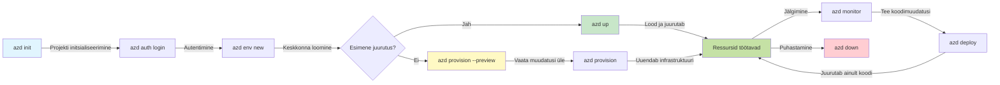
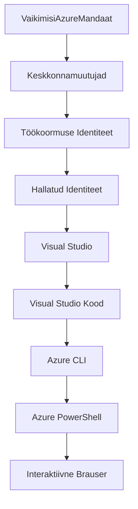

<!--
CO_OP_TRANSLATOR_METADATA:
{
  "original_hash": "e855e899d2705754fe85b04190edd0f0",
  "translation_date": "2025-11-24T13:09:24+00:00",
  "source_file": "docs/getting-started/azd-basics.md",
  "language_code": "et"
}
-->
# AZD Alused - Azure Developer CLI mõistmine

# AZD Alused - Põhimõisted ja põhialused

**Peatüki navigeerimine:**
- **📚 Kursuse avaleht**: [AZD Algajatele](../../README.md)
- **📖 Praegune peatükk**: Peatükk 1 - Alused ja Kiirstart
- **⬅️ Eelmine**: [Kursuse ülevaade](../../README.md#-chapter-1-foundation--quick-start)
- **➡️ Järgmine**: [Paigaldamine ja seadistamine](installation.md)
- **🚀 Järgmine peatükk**: [Peatükk 2: AI-põhine arendus](../microsoft-foundry/microsoft-foundry-integration.md)

## Sissejuhatus

Selles õppetükis tutvustatakse Azure Developer CLI-d (azd), võimsat käsurea tööriista, mis kiirendab teie teekonda kohalikust arendusest Azure'i juurutamiseni. Õpite tundma põhikontseptsioone, peamisi funktsioone ja mõistate, kuidas azd lihtsustab pilvepõhiste rakenduste juurutamist.

## Õpieesmärgid

Selle õppetüki lõpuks te:
- Mõistate, mis on Azure Developer CLI ja selle peamine eesmärk
- Õpite tundma põhikontseptsioone nagu mallid, keskkonnad ja teenused
- Avastate võtmefunktsioone, sealhulgas mallipõhist arendust ja infrastruktuuri kui koodi
- Mõistate azd projekti struktuuri ja töövoogu
- Olete valmis azd paigaldamiseks ja seadistamiseks oma arenduskeskkonnas

## Õpitulemused

Pärast selle õppetüki läbimist suudate:
- Selgitada azd rolli kaasaegsetes pilvearenduse töövoogudes
- Tuvastada azd projekti struktuuri komponente
- Kirjeldada, kuidas mallid, keskkonnad ja teenused koos töötavad
- Mõista infrastruktuuri kui koodi eeliseid azd abil
- Tunda erinevaid azd käske ja nende eesmärke

## Mis on Azure Developer CLI (azd)?

Azure Developer CLI (azd) on käsurea tööriist, mis on loodud kiirendama teie teekonda kohalikust arendusest Azure'i juurutamiseni. See lihtsustab pilvepõhiste rakenduste loomise, juurutamise ja haldamise protsessi Azure'is.

### 🎯 Miks kasutada AZD-d? Reaalne võrdlus

Võrdleme lihtsa veebirakenduse juurutamist koos andmebaasiga:

#### ❌ ILMA AZD-ta: Käsitsi Azure'i juurutamine (30+ minutit)

```bash
# Samm 1: Loo ressursigrupp
az group create --name myapp-rg --location eastus

# Samm 2: Loo App Service'i plaan
az appservice plan create --name myapp-plan \
  --resource-group myapp-rg \
  --sku B1 --is-linux

# Samm 3: Loo veebirakendus
az webapp create --name myapp-web-unique123 \
  --resource-group myapp-rg \
  --plan myapp-plan \
  --runtime "NODE:18-lts"

# Samm 4: Loo Cosmos DB konto (10-15 minutit)
az cosmosdb create --name myapp-cosmos-unique123 \
  --resource-group myapp-rg \
  --kind MongoDB

# Samm 5: Loo andmebaas
az cosmosdb mongodb database create \
  --account-name myapp-cosmos-unique123 \
  --resource-group myapp-rg \
  --name tododb

# Samm 6: Loo kollektsioon
az cosmosdb mongodb collection create \
  --account-name myapp-cosmos-unique123 \
  --resource-group myapp-rg \
  --database-name tododb \
  --name todos

# Samm 7: Hangi ühenduse string
CONN_STR=$(az cosmosdb keys list \
  --name myapp-cosmos-unique123 \
  --resource-group myapp-rg \
  --type connection-strings \
  --query "connectionStrings[0].connectionString" -o tsv)

# Samm 8: Konfigureeri rakenduse seaded
az webapp config appsettings set \
  --name myapp-web-unique123 \
  --resource-group myapp-rg \
  --settings MONGODB_URI="$CONN_STR"

# Samm 9: Luba logimine
az webapp log config --name myapp-web-unique123 \
  --resource-group myapp-rg \
  --application-logging filesystem \
  --detailed-error-messages true

# Samm 10: Seadista Application Insights
az monitor app-insights component create \
  --app myapp-insights \
  --location eastus \
  --resource-group myapp-rg

# Samm 11: Seo App Insights veebirakendusega
INSTRUMENTATION_KEY=$(az monitor app-insights component show \
  --app myapp-insights \
  --resource-group myapp-rg \
  --query "instrumentationKey" -o tsv)

az webapp config appsettings set \
  --name myapp-web-unique123 \
  --resource-group myapp-rg \
  --settings APPINSIGHTS_INSTRUMENTATIONKEY="$INSTRUMENTATION_KEY"

# Samm 12: Ehita rakendus lokaalselt
npm install
npm run build

# Samm 13: Loo juurutuspakett
zip -r app.zip . -x "*.git*" "node_modules/*"

# Samm 14: Juuruta rakendus
az webapp deployment source config-zip \
  --resource-group myapp-rg \
  --name myapp-web-unique123 \
  --src app.zip

# Samm 15: Oota ja looda, et see töötab 🙏
# (Automaatset valideerimist pole, vajalik käsitsi testimine)
```

**Probleemid:**
- ❌ 15+ käsku, mida tuleb meeles pidada ja õiges järjekorras täita
- ❌ 30-45 minutit käsitsi tööd
- ❌ Lihtne teha vigu (trükivead, valed parameetrid)
- ❌ Ühendusstringid jäävad terminali ajalukku
- ❌ Ebaõnnestumise korral pole automaatset tagasipööramist
- ❌ Raske meeskonnaliikmetele reprodutseerida
- ❌ Iga kord erinev (pole korduvkasutatav)

#### ✅ AZD-ga: Automatiseeritud juurutamine (5 käsku, 10-15 minutit)

```bash
# Samm 1: Initsialiseeri mallist
azd init --template todo-nodejs-mongo

# Samm 2: Autendi
azd auth login

# Samm 3: Loo keskkond
azd env new dev

# Samm 4: Eelvaata muudatusi (valikuline, kuid soovitatav)
azd provision --preview

# Samm 5: Paigalda kõik
azd up

# ✨ Valmis! Kõik on paigaldatud, seadistatud ja jälgitud
```

**Eelised:**
- ✅ **5 käsku** vs. 15+ käsitsi sammu
- ✅ **10-15 minutit** koguaeg (peamiselt Azure'i ooteaeg)
- ✅ **Null vigu** - automatiseeritud ja testitud
- ✅ **Saladused hallatud turvaliselt** Key Vaulti kaudu
- ✅ **Automaatne tagasipööramine** ebaõnnestumiste korral
- ✅ **Täielikult korduvkasutatav** - sama tulemus iga kord
- ✅ **Meeskonnale valmis** - igaüks saab samade käskudega juurutada
- ✅ **Infrastruktuur kui kood** - versioonikontrollitud Bicep mallid
- ✅ **Sisseehitatud monitooring** - Application Insights seadistatud automaatselt

### 📊 Aja ja vigade vähendamine

| Metrika | Käsitsi juurutamine | AZD juurutamine | Parandus |
|:-------|:--------------------|:----------------|:---------|
| **Käsud** | 15+ | 5 | 67% vähem |
| **Aeg** | 30-45 min | 10-15 min | 60% kiirem |
| **Vigade määr** | ~40% | <5% | 88% vähenemine |
| **Järjepidevus** | Madal (käsitsi) | 100% (automatiseeritud) | Täiuslik |
| **Meeskonna sisseelamine** | 2-4 tundi | 30 minutit | 75% kiirem |
| **Tagasipööramise aeg** | 30+ min (käsitsi) | 2 min (automatiseeritud) | 93% kiirem |

## Põhikontseptsioonid

### Mallid
Mallid on azd alus. Need sisaldavad:
- **Rakenduse kood** - Teie lähtekood ja sõltuvused
- **Infrastruktuuri määratlused** - Azure'i ressursid, mis on määratletud Bicep või Terraformiga
- **Konfiguratsioonifailid** - Seaded ja keskkonnamuutujad
- **Juurutusskriptid** - Automatiseeritud juurutustöövood

### Keskkonnad
Keskkonnad esindavad erinevaid juurutamise sihtmärke:
- **Arendus** - Testimiseks ja arendamiseks
- **Staging** - Eeltootmise keskkond
- **Tootmine** - Reaalajas tootmiskeskkond

Igal keskkonnal on oma:
- Azure'i ressursigrupp
- Konfiguratsiooniseaded
- Juurutamise olek

### Teenused
Teenused on teie rakenduse ehituskivid:
- **Frontend** - Veebirakendused, SPAd
- **Backend** - API-d, mikroteenused
- **Andmebaas** - Andmesalvestuslahendused
- **Salvestus** - Faili- ja blobisalvestus

## Peamised funktsioonid

### 1. Mallipõhine arendus
```bash
# Sirvi saadaolevaid malle
azd template list

# Initsialiseeri mallist
azd init --template <template-name>
```

### 2. Infrastruktuur kui kood
- **Bicep** - Azure'i domeenispetsiifiline keel
- **Terraform** - Mitme pilve infrastruktuuri tööriist
- **ARM mallid** - Azure Resource Manager mallid

### 3. Integreeritud töövood
```bash
# Täielik juurutamise töövoog
azd up            # Ettevalmistamine + juurutamine, see on esmakordsel seadistamisel automaatne

# 🧪 UUS: Eelvaade infrastruktuuri muudatustest enne juurutamist (TURVALINE)
azd provision --preview    # Simuleeri infrastruktuuri juurutamist ilma muudatusi tegemata

azd provision     # Loo Azure'i ressursid, kui uuendad infrastruktuuri, kasuta seda
azd deploy        # Juuruta rakenduse kood või juuruta uuesti rakenduse kood pärast uuendamist
azd down          # Puhasta ressursid
```

#### 🛡️ Turvaline infrastruktuuri planeerimine eelvaatega
Käsk `azd provision --preview` on murranguline turvaliste juurutuste jaoks:
- **Kuivkäivituse analüüs** - Näitab, mida luuakse, muudetakse või kustutatakse
- **Null risk** - Azure'i keskkonnas tegelikke muudatusi ei tehta
- **Meeskonna koostöö** - Jagage eelvaate tulemusi enne juurutamist
- **Kulude hindamine** - Mõistke ressursikulusid enne pühendumist

```bash
# Näidis eelvaate töövoog
azd provision --preview           # Vaata, mis muutub
# Vaata üle tulemus, aruta meeskonnaga
azd provision                     # Rakenda muudatused kindlusega
```

### 📊 Visuaal: AZD arendustöövoog


**Töövoo selgitus:**
1. **Init** - Alustage malliga või uue projektiga
2. **Auth** - Autentige Azure'iga
3. **Keskkond** - Looge isoleeritud juurutuskeskkond
4. **Eelvaade** - 🆕 Alati eelvaadake infrastruktuuri muudatusi esmalt (turvaline praktika)
5. **Provision** - Looge/uuendage Azure'i ressursse
6. **Deploy** - Lükake oma rakenduse kood üles
7. **Monitor** - Jälgige rakenduse jõudlust
8. **Iterate** - Tehke muudatusi ja juurutage kood uuesti
9. **Cleanup** - Eemaldage ressursid, kui olete valmis

### 4. Keskkonna haldamine
```bash
# Loo ja halda keskkondi
azd env new <environment-name>
azd env select <environment-name>
azd env list
```

## 📁 Projekti struktuur

Tüüpiline azd projekti struktuur:
```
my-app/
├── .azd/                    # azd configuration
│   └── config.json
├── .azure/                  # Azure deployment artifacts
├── .devcontainer/          # Development container config
├── .github/workflows/      # GitHub Actions
├── .vscode/               # VS Code settings
├── infra/                 # Infrastructure code
│   ├── main.bicep        # Main infrastructure template
│   ├── main.parameters.json
│   └── modules/          # Reusable modules
├── src/                  # Application source code
│   ├── api/             # Backend services
│   └── web/             # Frontend application
├── azure.yaml           # azd project configuration
└── README.md
```

## 🔧 Konfiguratsioonifailid

### azure.yaml
Peamine projekti konfiguratsioonifail:
```yaml
name: my-awesome-app
metadata:
  template: my-template@1.0.0

services:
  web:
    project: ./src/web
    language: js
    host: appservice
  api:
    project: ./src/api
    language: js
    host: appservice

hooks:
  preprovision:
    shell: pwsh
    run: echo "Preparing to provision..."
```

### .azure/config.json
Keskkonnaspetsiifiline konfiguratsioon:
```json
{
  "version": 1,
  "defaultEnvironment": "dev",
  "environments": {
    "dev": {
      "subscriptionId": "your-subscription-id",
      "location": "eastus"
    }
  }
}
```

## 🎪 Tavalised töövood praktiliste harjutustega

> **💡 Õppimisnipp:** Järgige neid harjutusi järjekorras, et arendada oma AZD oskusi järk-järgult.

### 🎯 Harjutus 1: Looge oma esimene projekt

**Eesmärk:** Looge AZD projekt ja uurige selle struktuuri

**Sammud:**
```bash
# Kasuta tõestatud malli
azd init --template todo-nodejs-mongo

# Uuri genereeritud faile
ls -la  # Vaata kõiki faile, sealhulgas peidetud faile

# Loodud võtmefailid:
# - azure.yaml (peamine konfiguratsioon)
# - infra/ (infrastruktuuri kood)
# - src/ (rakenduse kood)
```

**✅ Edu:** Teil on azure.yaml, infra/ ja src/ kaustad

---

### 🎯 Harjutus 2: Juurutage Azure'i

**Eesmärk:** Viige lõpule otsast lõpuni juurutamine

**Sammud:**
```bash
# 1. Autendi
az login && azd auth login

# 2. Loo keskkond
azd env new dev
azd env set AZURE_LOCATION eastus

# 3. Eelvaata muudatusi (SOOVITATAV)
azd provision --preview

# 4. Paigalda kõik
azd up

# 5. Kontrolli paigaldust
azd show    # Vaata oma rakenduse URL-i
```

**Eeldatav aeg:** 10-15 minutit  
**✅ Edu:** Rakenduse URL avaneb brauseris

---

### 🎯 Harjutus 3: Mitu keskkonda

**Eesmärk:** Juurutage arendusse ja staging'usse

**Sammud:**
```bash
# Juba on dev, loo staging
azd env new staging
azd env set AZURE_LOCATION westus2
azd up

# Lülitu nende vahel
azd env list
azd env select dev
```

**✅ Edu:** Kaks eraldi ressursigruppi Azure'i portaalis

---

### 🛡️ Puhas algus: `azd down --force --purge`

Kui vajate täielikku lähtestamist:

```bash
azd down --force --purge
```

**Mida see teeb:**
- `--force`: Ei küsi kinnitusi
- `--purge`: Kustutab kogu kohaliku oleku ja Azure'i ressursid

**Kasutage, kui:**
- Juurutamine ebaõnnestus poole peal
- Projekte vahetatakse
- Vajate värsket algust

---

## 🎪 Algne töövoo viide

### Uue projekti alustamine
```bash
# Meetod 1: Kasuta olemasolevat mall
azd init --template todo-nodejs-mongo

# Meetod 2: Alusta nullist
azd init

# Meetod 3: Kasuta praegust kataloogi
azd init .
```

### Arendustsükkel
```bash
# Seadista arenduskeskkond
azd auth login
azd env new dev
azd env select dev

# Paigalda kõik
azd up

# Tee muudatused ja paigalda uuesti
azd deploy

# Korista pärast lõpetamist
azd down --force --purge # käsk Azure Developer CLI-s on **kõva lähtestamine** teie keskkonnale—eriti kasulik, kui tõrkeotsite ebaõnnestunud paigaldusi, puhastate orvuks jäänud ressursse või valmistute värskeks uuesti paigaldamiseks.
```

## `azd down --force --purge` mõistmine
Käsk `azd down --force --purge` on võimas viis azd keskkonna ja kõigi seotud ressursside täielikuks eemaldamiseks. Siin on ülevaade, mida iga lipp teeb:
```
--force
```
- Jätab kinnitusküsimused vahele.
- Kasulik automatiseerimisel või skriptimisel, kus käsitsi sisend pole võimalik.
- Tagab, et eemaldamine jätkub katkestusteta, isegi kui CLI tuvastab vastuolusid.

```
--purge
```
Kustutab **kogu seotud metaandmed**, sealhulgas:
Keskkonna olek
Kohalik `.azure` kaust
Vahemällu salvestatud juurutusinfo
Vältib azd "mäletamast" varasemaid juurutusi, mis võivad põhjustada probleeme, nagu ressursigruppide mittevastavus või vananenud registriviited.

### Miks kasutada mõlemat?
Kui olete `azd up`-iga ummikusse jooksnud jääkseisundi või osaliste juurutuste tõttu, tagab see kombinatsioon **puhta alguse**.

See on eriti kasulik pärast käsitsi ressursside kustutamist Azure'i portaalis või mallide, keskkondade või ressursigruppide nimetamiskonventsioonide vahetamisel.

### Mitme keskkonna haldamine
```bash
# Loo lavastuskeskkond
azd env new staging
azd env select staging
azd up

# Lülitu tagasi arenduskeskkonda
azd env select dev

# Võrdle keskkondi
azd env list
```

## 🔐 Autentimine ja mandaadid

Autentimise mõistmine on eduka azd juurutamise jaoks ülioluline. Azure kasutab mitmeid autentimismeetodeid ja azd kasutab samu mandaadiahelaid, mida teised Azure'i tööriistad.

### Azure CLI autentimine (`az login`)

Enne azd kasutamist peate Azure'iga autentima. Kõige tavalisem meetod on Azure CLI kasutamine:

```bash
# Interaktiivne sisselogimine (avab brauseri)
az login

# Sisselogimine konkreetse rentnikuga
az login --tenant <tenant-id>

# Sisselogimine teenuse põhimõttega
az login --service-principal -u <app-id> -p <password> --tenant <tenant-id>

# Kontrolli praegust sisselogimise olekut
az account show

# Loetle saadaval olevad tellimused
az account list --output table

# Määra vaikimisi tellimus
az account set --subscription <subscription-id>
```

### Autentimisvoog
1. **Interaktiivne sisselogimine**: Avab teie vaikimisi brauseri autentimiseks
2. **Seadme koodi voog**: Keskkondade jaoks, kus brauseri juurdepääs puudub
3. **Teenusepõhimõte**: Automatiseerimise ja CI/CD stsenaariumide jaoks
4. **Hallatud identiteet**: Azure'is hostitud rakenduste jaoks

### DefaultAzureCredential ahel

`DefaultAzureCredential` on mandaaditüüp, mis pakub lihtsustatud autentimiskogemust, proovides automaatselt mitmeid mandaadiallikaid kindlas järjekorras:

#### Mandaadiahela järjekord

#### 1. Keskkonnamuutujad
```bash
# Määra teenuse põhimõtte keskkonnamuutujad
export AZURE_CLIENT_ID="<app-id>"
export AZURE_CLIENT_SECRET="<password>"
export AZURE_TENANT_ID="<tenant-id>"
```

#### 2. Töökoormuse identiteet (Kubernetes/GitHub Actions)
Kasutatakse automaatselt:
- Azure Kubernetes Service (AKS) koos töökoormuse identiteediga
- GitHub Actions koos OIDC federatsiooniga
- Muud federatiivse identiteedi stsenaariumid

#### 3. Hallatud identiteet
Azure'i ressursside jaoks nagu:
- Virtuaalmasinad
- Rakendusteenus
- Azure Functions
- Konteineriteenused

```bash
# Kontrolli, kas töötab Azure'i ressursil hallatud identiteediga
az account show --query "user.type" --output tsv
# Tagastab: "servicePrincipal", kui kasutatakse hallatud identiteeti
```

#### 4. Arendustööriistade integreerimine
- **Visual Studio**: Kasutab automaatselt sisse logitud kontot
- **VS Code**: Kasutab Azure Account laienduse mandaate
- **Azure CLI**: Kasutab `az login` mandaate (kõige tavalisem kohalikuks arenduseks)

### AZD autentimise seadistamine

```bash
# Meetod 1: Kasuta Azure CLI-d (soovitatav arenduseks)
az login
azd auth login  # Kasutab olemasolevaid Azure CLI mandaate

# Meetod 2: Otsene azd autentimine
azd auth login --use-device-code  # Peataustata keskkondade jaoks

# Meetod 3: Kontrolli autentimise staatust
azd auth login --check-status

# Meetod 4: Logi välja ja autentige uuesti
azd auth logout
azd auth login
```

### Autentimise parimad tavad

#### Kohalikuks arenduseks
```bash
# 1. Logi sisse Azure CLI-ga
az login

# 2. Kontrolli õiget tellimust
az account show
az account set --subscription "Your Subscription Name"

# 3. Kasuta azd olemasolevate mandaadidega
azd auth login
```

#### CI/CD torujuhtmete jaoks
```yaml
# GitHub Actions example
- name: Azure Login
  uses: azure/login@v1
  with:
    creds: ${{ secrets.AZURE_CREDENTIALS }}

- name: Deploy with azd
  run: |
    azd auth login --client-id ${{ secrets.AZURE_CLIENT_ID }} \
                    --client-secret ${{ secrets.AZURE_CLIENT_SECRET }} \
                    --tenant-id ${{ secrets.AZURE_TENANT_ID }}
    azd up --no-prompt
```

#### Tootmiskeskkondade jaoks
- Kasutage **hallatud identiteeti**, kui töötate Azure'i ressurssidel
- Kasutage **teenusepõhimõtet** automatiseerimise stsenaariumide jaoks
- Vältige mandaate koodi või konfiguratsioonifailidesse salvestamist
- Kasutage **Azure Key Vaulti** tundlike konfiguratsioonide jaoks

### Tavalised autentimisprobleemid ja lahendused

#### Probleem: "Tellimust ei leitud"
```bash
# Lahendus: Määra vaikimisi tellimus
az account list --output table
az account set --subscription "<subscription-id>"
azd env set AZURE_SUBSCRIPTION_ID "<subscription-id>"
```

#### Probleem: "Ebapiisavad õigused"
```bash
# Lahendus: Kontrolli ja määra vajalikud rollid
az role assignment list --assignee $(az account show --query user.name --output tsv)

# Üldised vajalikud rollid:
# - Kaastööline (ressursside haldamiseks)
# - Kasutaja juurdepääsu administraator (rollide määramiseks)
```

#### Probleem: "Mandaadi aegumine"
```bash
# Lahendus: Autendi uuesti
az logout
az login
azd auth logout
azd auth login
```

### Autentimine erinevates stsenaariumides

#### Kohalik arendus
```bash
# Isikliku arengu konto
az login
azd auth login
```

#### Meeskonna arendus
```bash
# Kasuta konkreetset rentnikku organisatsiooni jaoks
az login --tenant contoso.onmicrosoft.com
azd auth login
```

#### Mitme rentniku stsenaariumid
```bash
# Vaheta üürnike vahel
az login --tenant tenant1.onmicrosoft.com
# Paigalda üürnikule 1
azd up

az login --tenant tenant2.onmicrosoft.com  
# Paigalda üürnikule 2
azd up
```

### Turvalisuse kaalutlused

1. **Mandaadi salvestamine**: Ärge kunagi salvestage mandaate lähtekoodi
2. **Ulatuspiirang**: Kasutage teenusepõhimõtete jaoks vähima õiguse põhimõtet
3. **Mandaadi rotatsioon**: Pöörake regulaarselt teenusepõhimõtte saladusi
4. **Auditijälg**: Jälgige autentimis- ja juurutustegevusi
5. **Võrguturve**: Kasutage võimalusel privaatseid lõpp-punkte

### Autentimise tõrkeotsing

```bash
# Silu autentimisprobleeme
azd auth login --check-status
az account show
az account get-access-token

# Levinud diagnostikakäsud
whoami                          # Praegune kasutajakontekst
az ad signed-in-user show      # Azure AD kasutaja üksikasjad
az group list                  # Testi ressursi juurdepääsu
```

## `azd down --force --purge` mõistmine

### Avastamine
```bash
azd template list              # Sirvi malle
azd template show <template>   # Malli üksikasjad
azd init --help               # Initsialiseerimise valikud
```

### Projekti haldamine
```bash
azd show                     # Projekti ülevaade
azd env show                 # Praegune keskkond
azd config list             # Konfiguratsiooni seaded
```

### Monitooring
```bash
azd monitor                  # Ava Azure portaal
azd pipeline config          # Seadista CI/CD
azd logs                     # Vaata rakenduse logisid
```

## Parimad tavad

### 1. Kasutage tähenduslikke nimesid
```bash
# Hea
azd env new production-east
azd init --template web-app-secure

# Vältida
azd env new env1
azd init --template template1
```

### 2. Kasutage malle
- Alustage olemasolevate mallidega
- Kohandage vastavalt oma vajadustele
- Looge oma organisatsiooni jaoks korduvkasutatavad mallid

### 3. Keskkonna isoleerimine
- Kasutage eraldi keskkondi arenduse/staging/tootmise jaoks
- Ärge kunagi juurutage otse tootmisesse kohalikust masinast
- Kasutage tootmisesse juurutamiseks CI/CD torujuhtmeid

### 4. Konfiguratsiooni haldamine
- Kasutage tundlike andmete jaoks keskkonnamuutujaid
- Hoidke konfiguratsiooni versioonikontrollis
- Dokumenteerige keskkonnaspetsiifilised seaded

## Õppimise edenemine

### Algaja (1.-2. nädal)
1. Paigaldage azd ja autentige
2. Juurutage lihtne mall
3. Mõistke projekti struktuuri
4. Õppige põhilisi käske (up, down, deploy)

### Kesktase (3.-4. nädal)
1. Kohandage malle
2. Hallake mitut keskkonda
3. Mõistke infrastruktuuri koodi
4. Seadistage CI/CD torujuhtmeid

### Edasijõ
- [Paigaldamine ja seadistamine](installation.md) - Paigalda ja konfigureeri azd
- [Sinu esimene projekt](first-project.md) - Praktiline juhend
- [Konfiguratsiooni juhend](configuration.md) - Täiustatud konfiguratsiooni valikud

**🎯 Valmis järgmise peatüki jaoks?**
- [Peatükk 2: AI-põhine arendus](../microsoft-foundry/microsoft-foundry-integration.md) - Alusta AI-rakenduste loomist

## Täiendavad ressursid

- [Azure Developer CLI ülevaade](https://learn.microsoft.com/en-us/azure/developer/azure-developer-cli/)
- [Mallide galerii](https://azure.github.io/awesome-azd/)
- [Kogukonna näidised](https://github.com/Azure-Samples)

---

## 🙋 Korduma kippuvad küsimused

### Üldised küsimused

**K: Mis vahe on AZD-l ja Azure CLI-l?**

V: Azure CLI (`az`) on mõeldud üksikute Azure'i ressursside haldamiseks. AZD (`azd`) haldab tervet rakendust:

```bash
# Azure CLI - madala taseme ressursside haldamine
az webapp create --name myapp --resource-group rg
az sql server create --name myserver --resource-group rg
# ...vajalikud on palju rohkem käske

# AZD - rakenduse taseme haldamine
azd up  # Paigaldab kogu rakenduse koos kõigi ressurssidega
```

**Mõtle sellele nii:**
- `az` = Töö üksikute Lego klotsidega
- `azd` = Töö terviklike Lego komplektidega

---

**K: Kas ma pean AZD kasutamiseks teadma Bicep'i või Terraform'i?**

V: Ei! Alusta mallidega:
```bash
# Kasuta olemasolevat mall - IaC teadmisi pole vaja
azd init --template todo-nodejs-mongo
azd up
```

Sa võid hiljem õppida Bicep'i, et infrastruktuuri kohandada. Mallid pakuvad töötavaid näiteid, millest õppida.

---

**K: Kui palju maksab AZD mallide käitamine?**

V: Kulud sõltuvad mallist. Enamik arendusmalle maksab $50-150 kuus:

```bash
# Eelvaata kulusid enne juurutamist
azd provision --preview

# Korista alati, kui ei kasuta
azd down --force --purge  # Eemaldab kõik ressursid
```

**Pro nõuanne:** Kasuta tasuta tasemeid, kui need on saadaval:
- App Service: F1 (tasuta) tase
- Azure OpenAI: 50,000 tokenit kuus tasuta
- Cosmos DB: 1000 RU/s tasuta tase

---

**K: Kas ma saan AZD-d kasutada olemasolevate Azure'i ressurssidega?**

V: Jah, kuid lihtsam on alustada puhtalt lehelt. AZD töötab kõige paremini, kui see haldab kogu elutsüklit. Olemasolevate ressursside jaoks:

```bash
# Valik 1: Impordi olemasolevad ressursid (edasijõudnutele)
azd init
# Seejärel muuda infra/, et viidata olemasolevatele ressurssidele

# Valik 2: Alusta uuesti (soovitatav)
azd init --template matching-your-stack
azd up  # Loob uue keskkonna
```

---

**K: Kuidas jagada oma projekti meeskonnakaaslastega?**

V: Salvesta AZD projekt Git'i (kuid MITTE .azure kausta):

```bash
# Juba vaikimisi .gitignore'is
.azure/        # Sisaldab saladusi ja keskkonnaandmeid
*.env          # Keskkonnamuutujad

# Meeskonnaliikmed siis:
git clone <your-repo>
azd auth login
azd env new <their-name>-dev
azd up
```

Kõik saavad identse infrastruktuuri samadest mallidest.

---

### Tõrkeotsingu küsimused

**K: "azd up" ebaõnnestus poole peal. Mida teha?**

V: Kontrolli viga, paranda see ja proovi uuesti:

```bash
# Vaata üksikasjalikke logisid
azd show

# Levinud parandused:

# 1. Kui kvoot on ületatud:
azd env set AZURE_LOCATION "westus2"  # Proovi teist piirkonda

# 2. Kui ressursi nime konflikt:
azd down --force --purge  # Puhas leht
azd up  # Proovi uuesti

# 3. Kui autentimine aegus:
az login
azd auth login
azd up
```

**Kõige tavalisem probleem:** Vale Azure'i tellimus valitud
```bash
az account list --output table
az account set --subscription "<correct-subscription>"
```

---

**K: Kuidas juurutada ainult koodimuudatusi ilma infrastruktuuri uuesti ette valmistamata?**

V: Kasuta `azd deploy` asemel `azd up`:

```bash
azd up          # Esimene kord: ettevalmistus + juurutamine (aeglane)

# Tee koodimuudatusi...

azd deploy      # Järgnevad korrad: ainult juurutamine (kiire)
```

Kiiruse võrdlus:
- `azd up`: 10-15 minutit (ettevalmistab infrastruktuuri)
- `azd deploy`: 2-5 minutit (ainult kood)

---

**K: Kas ma saan infrastruktuuri malle kohandada?**

V: Jah! Muuda Bicep faile kaustas `infra/`:

```bash
# Pärast azd init
cd infra/
code main.bicep  # Muuda VS Code'is

# Eelvaade muudatustest
azd provision --preview

# Rakenda muudatused
azd provision
```

**Nõuanne:** Alusta väikestest muudatustest - muuda esmalt SKU-sid:
```bicep
// infra/main.bicep
sku: {
  name: 'B1'  // Change to 'P1V2' for production
}
```

---

**K: Kuidas kustutada kõik AZD loodud ressursid?**

V: Üks käsk eemaldab kõik ressursid:

```bash
azd down --force --purge

# See kustutab:
# - Kõik Azure'i ressursid
# - Ressursigrupp
# - Kohaliku keskkonna olek
# - Vahemällu salvestatud juurutamise andmed
```

**Alati kasuta seda, kui:**
- Oled lõpetanud malli testimise
- Vahetad projekti
- Tahad alustada puhtalt lehelt

**Kulude kokkuhoid:** Kasutamata ressursside kustutamine = $0 kulud

---

**K: Mis juhtub, kui ma kogemata kustutan ressursid Azure'i portaalis?**

V: AZD olek võib minna sünkroonist välja. Kasuta puhta lehe lähenemist:

```bash
# 1. Eemalda kohalik olek
azd down --force --purge

# 2. Alusta uuesti
azd up

# Alternatiiv: Lase AZD tuvastada ja parandada
azd provision  # Loob puuduvad ressursid
```

---

### Täiustatud küsimused

**K: Kas ma saan AZD-d kasutada CI/CD torustikes?**

V: Jah! GitHub Actions näide:

```yaml
# .github/workflows/deploy.yml
name: Deploy with AZD

on:
  push:
    branches: [main]

jobs:
  deploy:
    runs-on: ubuntu-latest
    steps:
      - uses: actions/checkout@v2
      
      - name: Install azd
        run: curl -fsSL https://aka.ms/install-azd.sh | bash
      
      - name: Azure Login
        run: |
          azd auth login \
            --client-id ${{ secrets.AZURE_CLIENT_ID }} \
            --client-secret ${{ secrets.AZURE_CLIENT_SECRET }} \
            --tenant-id ${{ secrets.AZURE_TENANT_ID }}
      
      - name: Deploy
        run: azd up --no-prompt
```

---

**K: Kuidas käsitleda salasõnu ja tundlikke andmeid?**

V: AZD integreerub automaatselt Azure Key Vault'iga:

```bash
# Saladused salvestatakse Key Vaultis, mitte koodis
azd env set DATABASE_PASSWORD "$(openssl rand -base64 32)"

# AZD teeb automaatselt:
# 1. Loob Key Vaulti
# 2. Salvestab saladuse
# 3. Annab rakendusele juurdepääsu hallatud identiteedi kaudu
# 4. Süstitakse käitamise ajal
```

**Ära kunagi salvesta:**
- `.azure/` kausta (sisaldab keskkonna andmeid)
- `.env` faile (kohalikud salasõnad)
- Ühenduse stringe

---

**K: Kas ma saan juurutada mitmesse piirkonda?**

V: Jah, loo keskkond iga piirkonna jaoks:

```bash
# Ida-USA keskkond
azd env new prod-eastus
azd env set AZURE_LOCATION eastus
azd up

# Lääne-Euroopa keskkond
azd env new prod-westeurope
azd env set AZURE_LOCATION westeurope
azd up

# Iga keskkond on sõltumatu
azd env list
```

Tõeliste mitme piirkonna rakenduste jaoks kohanda Bicep malle, et juurutada mitmesse piirkonda samaaegselt.

---

**K: Kust saan abi, kui jään hätta?**

1. **AZD dokumentatsioon:** https://learn.microsoft.com/azure/developer/azure-developer-cli/
2. **GitHub probleemid:** https://github.com/Azure/azure-dev/issues
3. **Discord:** [Azure Discord](https://discord.gg/microsoft-azure) - #azure-developer-cli kanal
4. **Stack Overflow:** Märksõna `azure-developer-cli`
5. **See kursus:** [Tõrkeotsingu juhend](../troubleshooting/common-issues.md)

**Pro nõuanne:** Enne küsimist käivita:
```bash
azd show       # Näitab praegust olekut
azd version    # Näitab teie versiooni
```
Lisa see info oma küsimusse, et saada kiiremat abi.

---

## 🎓 Mis edasi?

Sa mõistad nüüd AZD põhialuseid. Vali oma tee:

### 🎯 Algajatele:
1. **Järgmine:** [Paigaldamine ja seadistamine](installation.md) - Paigalda AZD oma arvutisse
2. **Seejärel:** [Sinu esimene projekt](first-project.md) - Juuruta oma esimene rakendus
3. **Harjuta:** Täida kõik 3 harjutust selles õppetükis

### 🚀 AI arendajatele:
1. **Jätka:** [Peatükk 2: AI-põhine arendus](../microsoft-foundry/microsoft-foundry-integration.md)
2. **Juuruta:** Alusta `azd init --template get-started-with-ai-chat`
3. **Õpi:** Loo ja juuruta samal ajal

### 🏗️ Kogenud arendajatele:
1. **Vaata üle:** [Konfiguratsiooni juhend](configuration.md) - Täiustatud seaded
2. **Uuri:** [Infrastruktuur kui kood](../deployment/provisioning.md) - Süvitsi Bicep
3. **Loo:** Loo oma stack'i jaoks kohandatud mallid

---

**Peatüki navigeerimine:**
- **📚 Kursuse avaleht**: [AZD algajatele](../../README.md)
- **📖 Praegune peatükk**: Peatükk 1 - Alused ja kiire algus  
- **⬅️ Eelmine**: [Kursuse ülevaade](../../README.md#-chapter-1-foundation--quick-start)
- **➡️ Järgmine**: [Paigaldamine ja seadistamine](installation.md)
- **🚀 Järgmine peatükk**: [Peatükk 2: AI-põhine arendus](../microsoft-foundry/microsoft-foundry-integration.md)

---

<!-- CO-OP TRANSLATOR DISCLAIMER START -->
**Lahtiütlus**:  
See dokument on tõlgitud AI tõlketeenuse [Co-op Translator](https://github.com/Azure/co-op-translator) abil. Kuigi püüame tagada täpsust, palume arvestada, et automaatsed tõlked võivad sisaldada vigu või ebatäpsusi. Algne dokument selle algses keeles tuleks pidada autoriteetseks allikaks. Olulise teabe puhul soovitame kasutada professionaalset inimtõlget. Me ei vastuta selle tõlke kasutamisest tulenevate arusaamatuste või valesti tõlgenduste eest.
<!-- CO-OP TRANSLATOR DISCLAIMER END -->