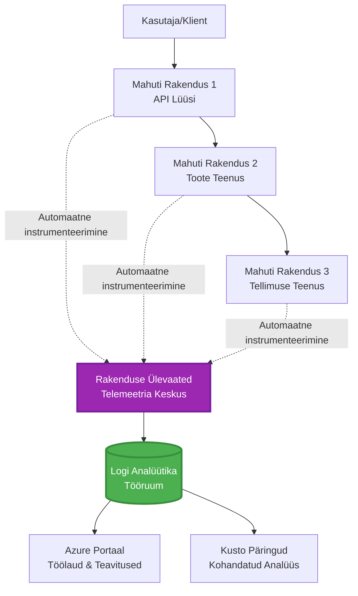
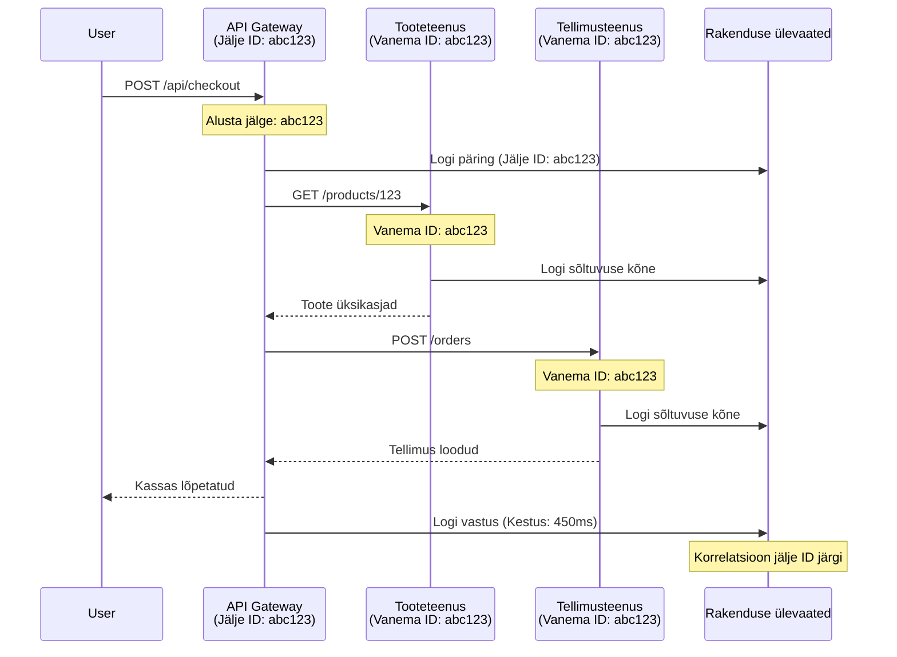

# Rakenduse Insights integratsioon AZD-ga

⏱️ **Hinnanguline aeg**: 40-50 minutit | 💰 **Kulude mõju**: ~5-15 $/kuus | ⭐ **Keerukus**: Keskmine

**📚 Õppeplaan:**
- ← Eelmine: [Eelkontrollid](preflight-checks.md) - Enne juurutamist tehtavad kontrollid
- 🎯 **Oled siin**: Rakenduse Insights integratsioon (jälgimine, telemeetria, silumine)
- → Järgmine: [Juurutamise juhend](../deployment/deployment-guide.md) - Juurutamine Azure'i
- 🏠 [Kursuse avaleht](../../README.md)

---

## Mida õpid

Selle õppetunni läbimisel:
- Integreerid **Application Insights** automaatselt AZD projektidesse
- Konfigureerid **jaotatud jälgimise** mikroteenuste jaoks
- Rakendad **kohandatud telemeetriat** (mõõdikud, sündmused, sõltuvused)
- Seadistad **reaalajas mõõdikud** reaalajas jälgimiseks
- Lood **häireid ja juhtpaneele** AZD juurutustest
- Silud tootmisprobleeme **telemeetria päringutega**
- Optimeerid **kulusid ja proovivõtu strateegiaid**
- Jälgid **AI/LLM rakendusi** (tokenid, latentsus, kulud)

## Miks Application Insights AZD-ga on oluline

### Väljakutse: Tootmise jälgitavus

**Ilma Application Insightsita:**
```
❌ No visibility into production behavior
❌ Manual log aggregation across services
❌ Reactive debugging (wait for customer complaints)
❌ No performance metrics
❌ Cannot trace requests across services
❌ Unknown failure rates and bottlenecks
```

**Application Insights + AZD-ga:**
```
✅ Automatic telemetry collection
✅ Centralized logs from all services
✅ Proactive issue detection
✅ End-to-end request tracing
✅ Performance metrics and insights
✅ Real-time dashboards
✅ AZD provisions everything automatically
```

**Võrdlus**: Application Insights on nagu "must kast" lennuki salvestaja + kokpiti juhtpaneel sinu rakenduse jaoks. Näed kõike, mis toimub reaalajas, ja saad igat juhtumit uuesti läbi mängida.

---

## Arhitektuuri ülevaade

### Application Insights AZD arhitektuuris


### Mis jälgitakse automaatselt

| Telemeetria tüüp | Mida see salvestab | Kasutusjuhtum |
|------------------|--------------------|---------------|
| **Päringud** | HTTP päringud, staatusekoodid, kestus | API jõudluse jälgimine |
| **Sõltuvused** | Välised kõned (DB, API-d, salvestus) | Kitsaskohtade tuvastamine |
| **Erandid** | Käsitlemata vead koos stack trace'iga | Vigade silumine |
| **Kohandatud sündmused** | Ärisündmused (registreerimine, ost) | Analüütika ja lehtrid |
| **Mõõdikud** | Jõudluse loendurid, kohandatud mõõdikud | Mahu planeerimine |
| **Jäljed** | Logisõnumid koos tõsidusega | Silumine ja auditeerimine |
| **Saadavus** | Uptime ja vastuseaja testid | SLA jälgimine |

---

## Eeltingimused

### Vajalikud tööriistad

```bash
# Kontrolli Azure Developer CLI-d
azd version
# ✅ Oodatav: azd versioon 1.0.0 või uuem

# Kontrolli Azure CLI-d
az --version
# ✅ Oodatav: azure-cli 2.50.0 või uuem
```

### Azure'i nõuded

- Aktiivne Azure'i tellimus
- Õigused luua:
  - Application Insights ressursid
  - Log Analytics tööruumid
  - Container Apps
  - Ressursigrupid

### Teadmiste eeltingimused

Peaksid olema lõpetanud:
- [AZD põhialused](../getting-started/azd-basics.md) - AZD põhikontseptsioonid
- [Konfiguratsioon](../getting-started/configuration.md) - Keskkonna seadistamine
- [Esimene projekt](../getting-started/first-project.md) - Põhijuurutus

---

## Õppetund 1: Automaatne Application Insights AZD-ga

### Kuidas AZD loob Application Insights

AZD loob ja konfigureerib Application Insights automaatselt juurutamisel. Vaatame, kuidas see toimib.

### Projekti struktuur

```
monitored-app/
├── azure.yaml                     # AZD configuration
├── infra/
│   ├── main.bicep                # Main infrastructure
│   ├── core/
│   │   └── monitoring.bicep      # Application Insights + Log Analytics
│   └── app/
│       └── api.bicep             # Container App with monitoring
└── src/
    ├── app.py                    # Application with telemetry
    ├── requirements.txt
    └── Dockerfile
```

---

### Samm 1: AZD konfigureerimine (azure.yaml)

**Fail: `azure.yaml`**

```yaml
name: monitored-app
metadata:
  template: monitored-app@1.0.0

services:
  api:
    project: ./src
    language: python
    host: containerapp

# AZD automatically provisions monitoring!
```

**Ja ongi kõik!** AZD loob Application Insights vaikimisi. Põhijälgimiseks pole vaja täiendavat konfiguratsiooni.

---

### Samm 2: Jälgimisinfrastruktuur (Bicep)

**Fail: `infra/core/monitoring.bicep`**

```bicep
param logAnalyticsName string
param applicationInsightsName string
param location string = resourceGroup().location
param tags object = {}

// Log Analytics Workspace (required for Application Insights)
resource logAnalytics 'Microsoft.OperationalInsights/workspaces@2022-10-01' = {
  name: logAnalyticsName
  location: location
  tags: tags
  properties: {
    sku: {
      name: 'PerGB2018'  // Pay-as-you-go pricing
    }
    retentionInDays: 30  // Keep logs for 30 days
    features: {
      enableLogAccessUsingOnlyResourcePermissions: true
    }
  }
}

// Application Insights
resource applicationInsights 'Microsoft.Insights/components@2020-02-02' = {
  name: applicationInsightsName
  location: location
  tags: tags
  kind: 'web'
  properties: {
    Application_Type: 'web'
    WorkspaceResourceId: logAnalytics.id
    IngestionMode: 'LogAnalytics'
    publicNetworkAccessForIngestion: 'Enabled'
    publicNetworkAccessForQuery: 'Enabled'
  }
}

// Outputs for Container Apps
output logAnalyticsWorkspaceId string = logAnalytics.id
output logAnalyticsWorkspaceName string = logAnalytics.name
output applicationInsightsConnectionString string = applicationInsights.properties.ConnectionString
output applicationInsightsInstrumentationKey string = applicationInsights.properties.InstrumentationKey
output applicationInsightsName string = applicationInsights.name
```

---

### Samm 3: Ühendamine Container Appiga Application Insightsi jaoks

**Fail: `infra/app/api.bicep`**

```bicep
param name string
param location string
param tags object = {}
param containerAppsEnvironmentName string
param applicationInsightsConnectionString string

resource containerApp 'Microsoft.App/containerApps@2023-05-01' = {
  name: name
  location: location
  tags: tags
  properties: {
    configuration: {
      ingress: {
        external: true
        targetPort: 8000
      }
      secrets: [
        {
          name: 'appinsights-connection-string'
          value: applicationInsightsConnectionString
        }
      ]
    }
    template: {
      containers: [
        {
          name: 'api'
          image: 'myregistry.azurecr.io/api:latest'
          resources: {
            cpu: json('0.5')
            memory: '1Gi'
          }
          env: [
            {
              name: 'APPLICATIONINSIGHTS_CONNECTION_STRING'
              secretRef: 'appinsights-connection-string'
            }
            {
              name: 'APPLICATIONINSIGHTS_ENABLED'
              value: 'true'
            }
          ]
        }
      ]
    }
  }
}

output uri string = 'https://${containerApp.properties.configuration.ingress.fqdn}'
```

---

### Samm 4: Rakenduse kood telemeetria jaoks

**Fail: `src/app.py`**

```python
from flask import Flask, request, jsonify
from opencensus.ext.azure.log_exporter import AzureLogHandler
from opencensus.ext.azure.trace_exporter import AzureExporter
from opencensus.ext.flask.flask_middleware import FlaskMiddleware
from opencensus.trace.samplers import ProbabilitySampler
import logging
import os

app = Flask(__name__)

# Hankige Application Insights ühenduse string
connection_string = os.environ.get('APPLICATIONINSIGHTS_CONNECTION_STRING')

if connection_string:
    # Konfigureeri hajutatud jälgimine
    middleware = FlaskMiddleware(
        app,
        exporter=AzureExporter(connection_string=connection_string),
        sampler=ProbabilitySampler(rate=1.0)  # 100% proovivõtmine arenduse jaoks
    )
    
    # Konfigureeri logimine
    logger = logging.getLogger(__name__)
    logger.addHandler(AzureLogHandler(connection_string=connection_string))
    logger.setLevel(logging.INFO)
    
    print("✅ Application Insights enabled")
else:
    logger = logging.getLogger(__name__)
    logger.setLevel(logging.INFO)
    print("⚠️ Application Insights not configured")

@app.route('/health')
def health():
    logger.info('Health check endpoint called')
    return jsonify({'status': 'healthy', 'monitoring': 'enabled'})

@app.route('/api/products')
def get_products():
    logger.info('Fetching products')
    
    # Simuleeri andmebaasi kõnet (automaatselt jälgitakse sõltuvusena)
    products = [
        {'id': 1, 'name': 'Laptop', 'price': 999.99},
        {'id': 2, 'name': 'Mouse', 'price': 29.99},
        {'id': 3, 'name': 'Keyboard', 'price': 79.99}
    ]
    
    logger.info(f'Returned {len(products)} products')
    return jsonify(products)

@app.route('/api/error-test')
def error_test():
    """Test error tracking"""
    logger.error('Testing error tracking')
    try:
        raise ValueError('This is a test exception')
    except Exception as e:
        logger.exception('Exception occurred in error-test endpoint')
        return jsonify({'error': str(e)}), 500

@app.route('/api/slow')
def slow_endpoint():
    """Test performance tracking"""
    import time
    logger.info('Slow endpoint called')
    time.sleep(3)  # Simuleeri aeglast operatsiooni
    logger.warning('Endpoint took 3 seconds to respond')
    return jsonify({'message': 'Slow operation completed'})

if __name__ == '__main__':
    app.run(host='0.0.0.0', port=8000)
```

**Fail: `src/requirements.txt`**

```txt
Flask==3.0.0
opencensus-ext-azure==1.1.13
opencensus-ext-flask==0.8.1
gunicorn==21.2.0
```

---

### Samm 5: Juurutamine ja kontrollimine

```bash
# Initsialiseeri AZD
azd init

# Paigalda (rakendab automaatselt Application Insights)
azd up

# Hangi rakenduse URL
APP_URL=$(azd env get-values | grep API_URL | cut -d '=' -f2 | tr -d '"')

# Genereeri telemeetria
curl $APP_URL/health
curl $APP_URL/api/products
curl $APP_URL/api/error-test
curl $APP_URL/api/slow
```

**✅ Oodatav tulemus:**
```json
{
  "status": "healthy",
  "monitoring": "enabled"
}
```

---

### Samm 6: Telemeetria vaatamine Azure'i portaalis

```bash
# Hankige rakenduse Insights üksikasjad
azd env get-values | grep APPLICATIONINSIGHTS

# Avage Azure'i portaalis
az monitor app-insights component show \
  --app $(azd env get-values | grep APPLICATIONINSIGHTS_NAME | cut -d '=' -f2 | tr -d '"') \
  --resource-group $(azd env get-values | grep AZURE_RESOURCE_GROUP | cut -d '=' -f2 | tr -d '"') \
  --query "appId" -o tsv
```

**Liigu Azure'i portaal → Application Insights → Transaction Search**

Peaksid nägema:
- ✅ HTTP päringud koos staatusekoodidega
- ✅ Päringu kestus (3+ sekundit `/api/slow` jaoks)
- ✅ Erandi üksikasjad `/api/error-test` jaoks
- ✅ Kohandatud logisõnumid

---

## Õppetund 2: Kohandatud telemeetria ja sündmused

### Ärisündmuste jälgimine

Lisame kohandatud telemeetria ärikriitiliste sündmuste jaoks.

**Fail: `src/telemetry.py`**

```python
from opencensus.ext.azure import metrics_exporter
from opencensus.stats import aggregation as aggregation_module
from opencensus.stats import measure as measure_module
from opencensus.stats import stats as stats_module
from opencensus.stats import view as view_module
from opencensus.tags import tag_map as tag_map_module
from opencensus.ext.azure.log_exporter import AzureLogHandler
from opencensus.ext.azure.trace_exporter import AzureExporter
from opencensus.trace import tracer as tracer_module
import logging
import os

class TelemetryClient:
    """Custom telemetry client for Application Insights"""
    
    def __init__(self, connection_string=None):
        self.connection_string = connection_string or os.environ.get('APPLICATIONINSIGHTS_CONNECTION_STRING')
        
        if not self.connection_string:
            print("⚠️ Application Insights connection string not found")
            return
        
        # Seadista logija
        self.logger = logging.getLogger(__name__)
        self.logger.addHandler(AzureLogHandler(connection_string=self.connection_string))
        self.logger.setLevel(logging.INFO)
        
        # Seadista mõõdikute eksportija
        self.stats = stats_module.stats
        self.view_manager = self.stats.view_manager
        self.stats_recorder = self.stats.stats_recorder
        
        exporter = metrics_exporter.new_metrics_exporter(
            connection_string=self.connection_string
        )
        self.view_manager.register_exporter(exporter)
        
        # Seadista jälgija
        self.tracer = tracer_module.Tracer(
            exporter=AzureExporter(connection_string=self.connection_string)
        )
        
        print("✅ Custom telemetry client initialized")
    
    def track_event(self, event_name: str, properties: dict = None):
        """Track custom business event"""
        properties = properties or {}
        self.logger.info(
            f"CustomEvent: {event_name}",
            extra={
                'custom_dimensions': {
                    'event_name': event_name,
                    **properties
                }
            }
        )
    
    def track_metric(self, metric_name: str, value: float, properties: dict = None):
        """Track custom metric"""
        properties = properties or {}
        self.logger.info(
            f"CustomMetric: {metric_name} = {value}",
            extra={
                'custom_dimensions': {
                    'metric_name': metric_name,
                    'value': value,
                    **properties
                }
            }
        )
    
    def track_dependency(self, name: str, dependency_type: str, duration: float, success: bool):
        """Track external dependency call"""
        with self.tracer.span(name=name) as span:
            span.add_attribute('dependency.type', dependency_type)
            span.add_attribute('duration', duration)
            span.add_attribute('success', success)

# Globaalne telemeetria klient
telemetry = TelemetryClient()
```

### Rakenduse uuendamine kohandatud sündmustega

**Fail: `src/app.py` (täiustatud)**

```python
from flask import Flask, request, jsonify
from telemetry import telemetry
import time
import random

app = Flask(__name__)

@app.route('/api/purchase', methods=['POST'])
def purchase():
    """Track purchase event with custom telemetry"""
    data = request.json
    product_id = data.get('product_id')
    quantity = data.get('quantity', 1)
    price = data.get('price', 0)
    
    # Jälgi ärisündmust
    telemetry.track_event('Purchase', {
        'product_id': product_id,
        'quantity': quantity,
        'total_amount': price * quantity,
        'user_id': request.headers.get('X-User-Id', 'anonymous')
    })
    
    # Jälgi tulumõõdikut
    telemetry.track_metric('Revenue', price * quantity, {
        'product_id': product_id,
        'currency': 'USD'
    })
    
    return jsonify({
        'order_id': f'ORD-{random.randint(1000, 9999)}',
        'status': 'confirmed',
        'total': price * quantity
    })

@app.route('/api/search')
def search():
    """Track search queries"""
    query = request.args.get('q', '')
    
    start_time = time.time()
    
    # Simuleeri otsingut (oleks päris andmebaasi päring)
    results = [{'id': 1, 'name': f'Result for {query}'}]
    
    duration = (time.time() - start_time) * 1000  # Konverteeri millisekunditeks
    
    # Jälgi otsingusündmust
    telemetry.track_event('Search', {
        'query': query,
        'results_count': len(results),
        'duration_ms': duration
    })
    
    # Jälgi otsingu jõudluse mõõdikut
    telemetry.track_metric('SearchDuration', duration, {
        'query_length': len(query)
    })
    
    return jsonify({'results': results, 'count': len(results)})

@app.route('/api/external-call')
def external_call():
    """Track external API dependency"""
    import requests
    
    start_time = time.time()
    success = True
    
    try:
        # Simuleeri välise API kõnet
        response = requests.get('https://api.example.com/data', timeout=5)
        result = response.json()
    except Exception as e:
        success = False
        result = {'error': str(e)}
    
    duration = (time.time() - start_time) * 1000
    
    # Jälgi sõltuvust
    telemetry.track_dependency(
        name='ExternalAPI',
        dependency_type='HTTP',
        duration=duration,
        success=success
    )
    
    return jsonify(result)

if __name__ == '__main__':
    app.run(host='0.0.0.0', port=8000)
```

### Kohandatud telemeetria testimine

```bash
# Jälgi ostu sündmust
curl -X POST $APP_URL/api/purchase \
  -H "Content-Type: application/json" \
  -H "X-User-Id: user123" \
  -d '{"product_id": 1, "quantity": 2, "price": 29.99}'

# Jälgi otsingu sündmust
curl "$APP_URL/api/search?q=laptop"

# Jälgi välist sõltuvust
curl $APP_URL/api/external-call
```

**Vaata Azure'i portaalis:**

Liigu Application Insights → Logs ja käivita:

```kusto
// View purchase events
traces
| where customDimensions.event_name == "Purchase"
| project 
    timestamp,
    product_id = tostring(customDimensions.product_id),
    total_amount = todouble(customDimensions.total_amount),
    user_id = tostring(customDimensions.user_id)
| order by timestamp desc

// View revenue metrics
traces
| where customDimensions.metric_name == "Revenue"
| summarize TotalRevenue = sum(todouble(customDimensions.value)) by bin(timestamp, 1h)
| render timechart

// View search performance
traces
| where customDimensions.event_name == "Search"
| summarize 
    AvgDuration = avg(todouble(customDimensions.duration_ms)),
    SearchCount = count()
  by bin(timestamp, 5m)
| render timechart
```

---

## Õppetund 3: Jaotatud jälgimine mikroteenuste jaoks

### Ristteenuste jälgimise lubamine

Mikroteenuste jaoks korreleerib Application Insights automaatselt päringuid teenuste vahel.

**Fail: `infra/main.bicep`**

```bicep
targetScope = 'subscription'

param environmentName string
param location string = 'eastus'

var tags = { 'azd-env-name': environmentName }

resource rg 'Microsoft.Resources/resourceGroups@2021-04-01' = {
  name: 'rg-${environmentName}'
  location: location
  tags: tags
}

// Monitoring (shared by all services)
module monitoring './core/monitoring.bicep' = {
  name: 'monitoring'
  scope: rg
  params: {
    logAnalyticsName: 'log-${environmentName}'
    applicationInsightsName: 'appi-${environmentName}'
    location: location
    tags: tags
  }
}

// API Gateway
module apiGateway './app/api-gateway.bicep' = {
  name: 'api-gateway'
  scope: rg
  params: {
    name: 'ca-gateway-${environmentName}'
    location: location
    tags: union(tags, { 'azd-service-name': 'gateway' })
    applicationInsightsConnectionString: monitoring.outputs.applicationInsightsConnectionString
  }
}

// Product Service
module productService './app/product-service.bicep' = {
  name: 'product-service'
  scope: rg
  params: {
    name: 'ca-products-${environmentName}'
    location: location
    tags: union(tags, { 'azd-service-name': 'products' })
    applicationInsightsConnectionString: monitoring.outputs.applicationInsightsConnectionString
  }
}

// Order Service
module orderService './app/order-service.bicep' = {
  name: 'order-service'
  scope: rg
  params: {
    name: 'ca-orders-${environmentName}'
    location: location
    tags: union(tags, { 'azd-service-name': 'orders' })
    applicationInsightsConnectionString: monitoring.outputs.applicationInsightsConnectionString
  }
}

output APPLICATIONINSIGHTS_CONNECTION_STRING string = monitoring.outputs.applicationInsightsConnectionString
output GATEWAY_URL string = apiGateway.outputs.uri
```

### Vaata otsast lõpuni tehingut


**Päring otsast lõpuni jälje jaoks:**

```kusto
// Find complete request flow
let traceId = "abc123...";  // Get from response header
dependencies
| union requests
| where operation_Id == traceId
| project 
    timestamp,
    type = itemType,
    name,
    duration,
    success,
    cloud_RoleName
| order by timestamp asc
```

---

## Õppetund 4: Reaalajas mõõdikud ja jälgimine

### Reaalajas mõõdikute voo lubamine

Live Metrics pakub reaalajas telemeetriat <1 sekundi latentsusega.

**Juurdepääs Live Metricsile:**

```bash
# Hankige rakenduse Insights ressurss
APPI_NAME=$(azd env get-values | grep APPLICATIONINSIGHTS_NAME | cut -d '=' -f2 | tr -d '"')

# Hankige ressursigrupp
RG_NAME=$(azd env get-values | grep AZURE_RESOURCE_GROUP | cut -d '=' -f2 | tr -d '"')

echo "Navigate to: Azure Portal → Resource Groups → $RG_NAME → $APPI_NAME → Live Metrics"
```

**Mida näed reaalajas:**
- ✅ Sissetulevate päringute määr (päringud/sekundis)
- ✅ Väljaminevad sõltuvuskõned
- ✅ Erandite arv
- ✅ CPU ja mälu kasutus
- ✅ Aktiivsete serverite arv
- ✅ Näidistelemeetria

### Koormuse genereerimine testimiseks

```bash
# Loo koormus, et näha reaalajas mõõdikuid
for i in {1..100}; do
  curl $APP_URL/api/products &
  curl $APP_URL/api/search?q=test$i &
done

# Vaata reaalajas mõõdikuid Azure Portaalis
# Sa peaksid nägema päringute määra tõusu
```

---

## Praktilised harjutused

### Harjutus 1: Häirete seadistamine ⭐⭐ (Keskmine)

**Eesmärk**: Loo häired kõrgete veamäärade ja aeglaste vastuste jaoks.

**Sammud:**

1. **Loo häire veamäära jaoks:**

```bash
# Hankige rakenduse Insights ressursi ID
APPI_ID=$(az monitor app-insights component show \
  --app $APPI_NAME \
  --resource-group $RG_NAME \
  --query "id" -o tsv)

# Looge ebaõnnestunud päringute jaoks mõõdikuhoiatus
az monitor metrics alert create \
  --name "High-Error-Rate" \
  --resource-group $RG_NAME \
  --scopes $APPI_ID \
  --condition "count requests/failed > 10" \
  --window-size 5m \
  --evaluation-frequency 1m \
  --description "Alert when error rate exceeds 10 per 5 minutes"
```

2. **Loo häire aeglaste vastuste jaoks:**

```bash
az monitor metrics alert create \
  --name "Slow-Responses" \
  --resource-group $RG_NAME \
  --scopes $APPI_ID \
  --condition "avg requests/duration > 3000" \
  --window-size 5m \
  --evaluation-frequency 1m \
  --description "Alert when average response time exceeds 3 seconds"
```

3. **Loo häire Bicepiga (eelistatud AZD jaoks):**

**Fail: `infra/core/alerts.bicep`**

```bicep
param applicationInsightsId string
param actionGroupId string = ''
param location string = resourceGroup().location

// High error rate alert
resource errorRateAlert 'Microsoft.Insights/metricAlerts@2018-03-01' = {
  name: 'high-error-rate'
  location: 'global'
  properties: {
    description: 'Alert when error rate exceeds threshold'
    severity: 2
    enabled: true
    scopes: [
      applicationInsightsId
    ]
    evaluationFrequency: 'PT1M'
    windowSize: 'PT5M'
    criteria: {
      'odata.type': 'Microsoft.Azure.Monitor.SingleResourceMultipleMetricCriteria'
      allOf: [
        {
          name: 'Error rate'
          metricName: 'requests/failed'
          operator: 'GreaterThan'
          threshold: 10
          timeAggregation: 'Count'
        }
      ]
    }
    actions: actionGroupId != '' ? [
      {
        actionGroupId: actionGroupId
      }
    ] : []
  }
}

// Slow response alert
resource slowResponseAlert 'Microsoft.Insights/metricAlerts@2018-03-01' = {
  name: 'slow-responses'
  location: 'global'
  properties: {
    description: 'Alert when response time is too high'
    severity: 3
    enabled: true
    scopes: [
      applicationInsightsId
    ]
    evaluationFrequency: 'PT1M'
    windowSize: 'PT5M'
    criteria: {
      'odata.type': 'Microsoft.Azure.Monitor.SingleResourceMultipleMetricCriteria'
      allOf: [
        {
          name: 'Response duration'
          metricName: 'requests/duration'
          operator: 'GreaterThan'
          threshold: 3000
          timeAggregation: 'Average'
        }
      ]
    }
  }
}

output errorAlertId string = errorRateAlert.id
output slowResponseAlertId string = slowResponseAlert.id
```

4. **Testi häireid:**

```bash
# Tekita vigu
for i in {1..20}; do
  curl $APP_URL/api/error-test
done

# Tekita aeglaseid vastuseid
for i in {1..10}; do
  curl $APP_URL/api/slow
done

# Kontrolli häire olekut (oota 5-10 minutit)
az monitor metrics alert list \
  --resource-group $RG_NAME \
  --query "[].{Name:name, Enabled:enabled, State:properties.enabled}" \
  --output table
```

**✅ Edukriteeriumid:**
- ✅ Häired edukalt loodud
- ✅ Häired käivituvad, kui künnised ületatakse
- ✅ Saab vaadata häirete ajalugu Azure'i portaalis
- ✅ Integreeritud AZD juurutusega

**Aeg**: 20-25 minutit

---

### Harjutus 2: Kohandatud juhtpaneeli loomine ⭐⭐ (Keskmine)

**Eesmärk**: Loo juhtpaneel, mis kuvab rakenduse võtmemõõdikuid.

**Sammud:**

1. **Loo juhtpaneel Azure'i portaalis:**

Liigu: Azure'i portaal → Dashboards → New Dashboard

2. **Lisa võtmemõõdikute plaadid:**

- Päringute arv (viimased 24 tundi)
- Keskmine vastuseaeg
- Veamäär
- 5 kõige aeglasemat operatsiooni
- Kasutajate geograafiline jaotus

3. **Loo juhtpaneel Bicepiga:**

**Fail: `infra/core/dashboard.bicep`**

```bicep
param dashboardName string
param applicationInsightsId string
param location string = resourceGroup().location

resource dashboard 'Microsoft.Portal/dashboards@2020-09-01-preview' = {
  name: dashboardName
  location: location
  properties: {
    lenses: [
      {
        order: 0
        parts: [
          // Request count
          {
            position: { x: 0, y: 0, rowSpan: 4, colSpan: 6 }
            metadata: {
              type: 'Extension/Microsoft_OperationsManagementSuite_Workspace/PartType/LogsDashboardPart'
              inputs: [
                {
                  name: 'resourceId'
                  value: applicationInsightsId
                }
                {
                  name: 'query'
                  value: '''
                    requests
                    | summarize RequestCount = count() by bin(timestamp, 1h)
                    | render timechart
                  '''
                }
              ]
            }
          }
          // Error rate
          {
            position: { x: 6, y: 0, rowSpan: 4, colSpan: 6 }
            metadata: {
              type: 'Extension/Microsoft_OperationsManagementSuite_Workspace/PartType/LogsDashboardPart'
              inputs: [
                {
                  name: 'resourceId'
                  value: applicationInsightsId
                }
                {
                  name: 'query'
                  value: '''
                    requests
                    | summarize 
                        Total = count(),
                        Failed = countif(success == false)
                    | extend ErrorRate = (Failed * 100.0) / Total
                    | project ErrorRate
                  '''
                }
              ]
            }
          }
        ]
      }
    ]
  }
}

output dashboardId string = dashboard.id
```

4. **Juuruta juhtpaneel:**

```bash
# Lisa main.bicep-i
module dashboard './core/dashboard.bicep' = {
  name: 'dashboard'
  scope: rg
  params: {
    dashboardName: 'dashboard-${environmentName}'
    applicationInsightsId: monitoring.outputs.applicationInsightsId
    location: location
  }
}

# Paigalda
azd up
```

**✅ Edukriteeriumid:**
- ✅ Juhtpaneel kuvab võtmemõõdikuid
- ✅ Saab kinnitada Azure'i portaali avalehele
- ✅ Uuendused reaalajas
- ✅ Juurutatav AZD kaudu

**Aeg**: 25-30 minutit

---

### Harjutus 3: AI/LLM rakenduse jälgimine ⭐⭐⭐ (Edasijõudnud)

**Eesmärk**: Jälgi Azure OpenAI kasutust (tokenid, kulud, latentsus).

**Sammud:**

1. **Loo AI jälgimise wrapper:**

**Fail: `src/ai_telemetry.py`**

```python
from telemetry import telemetry
from openai import AzureOpenAI
import time

class MonitoredAzureOpenAI:
    """Azure OpenAI client with automatic telemetry"""
    
    def __init__(self, api_key, endpoint, api_version="2024-02-01"):
        self.client = AzureOpenAI(
            api_key=api_key,
            api_version=api_version,
            azure_endpoint=endpoint
        )
    
    def chat_completion(self, model: str, messages: list, **kwargs):
        """Track chat completion with telemetry"""
        start_time = time.time()
        
        try:
            # Helista Azure OpenAI
            response = self.client.chat.completions.create(
                model=model,
                messages=messages,
                **kwargs
            )
            
            duration = (time.time() - start_time) * 1000  # ms
            
            # Ekstrakti kasutus
            usage = response.usage
            prompt_tokens = usage.prompt_tokens
            completion_tokens = usage.completion_tokens
            total_tokens = usage.total_tokens
            
            # Arvuta maksumus (GPT-4 hinnakujundus)
            prompt_cost = (prompt_tokens / 1000) * 0.03  # $0.03 iga 1K tokeni kohta
            completion_cost = (completion_tokens / 1000) * 0.06  # $0.06 iga 1K tokeni kohta
            total_cost = prompt_cost + completion_cost
            
            # Jälgi kohandatud sündmust
            telemetry.track_event('OpenAI_Request', {
                'model': model,
                'prompt_tokens': prompt_tokens,
                'completion_tokens': completion_tokens,
                'total_tokens': total_tokens,
                'duration_ms': duration,
                'cost_usd': total_cost,
                'success': True
            })
            
            # Jälgi mõõdikuid
            telemetry.track_metric('OpenAI_Tokens', total_tokens, {
                'model': model,
                'type': 'total'
            })
            
            telemetry.track_metric('OpenAI_Cost', total_cost, {
                'model': model,
                'currency': 'USD'
            })
            
            telemetry.track_metric('OpenAI_Duration', duration, {
                'model': model
            })
            
            return response
            
        except Exception as e:
            duration = (time.time() - start_time) * 1000
            
            telemetry.track_event('OpenAI_Request', {
                'model': model,
                'duration_ms': duration,
                'success': False,
                'error': str(e)
            })
            
            raise
```

2. **Kasuta jälgitud klienti:**

```python
from flask import Flask, request, jsonify
from ai_telemetry import MonitoredAzureOpenAI
import os

app = Flask(__name__)

# Initsialiseeri jälgitav OpenAI klient
openai_client = MonitoredAzureOpenAI(
    api_key=os.environ['AZURE_OPENAI_API_KEY'],
    endpoint=os.environ['AZURE_OPENAI_ENDPOINT']
)

@app.route('/api/chat', methods=['POST'])
def chat():
    data = request.json
    user_message = data.get('message')
    
    # Kutsu automaatse jälgimisega
    response = openai_client.chat_completion(
        model='gpt-4',
        messages=[
            {'role': 'user', 'content': user_message}
        ]
    )
    
    return jsonify({
        'response': response.choices[0].message.content,
        'tokens': response.usage.total_tokens
    })
```

3. **Päring AI mõõdikute jaoks:**

```kusto
// Total AI spend over time
traces
| where customDimensions.event_name == "OpenAI_Request"
| where customDimensions.success == "True"
| summarize TotalCost = sum(todouble(customDimensions.cost_usd)) by bin(timestamp, 1h)
| render timechart

// Token usage by model
traces
| where customDimensions.event_name == "OpenAI_Request"
| summarize 
    TotalTokens = sum(toint(customDimensions.total_tokens)),
    RequestCount = count()
  by Model = tostring(customDimensions.model)

// Average latency
traces
| where customDimensions.event_name == "OpenAI_Request"
| summarize AvgDuration = avg(todouble(customDimensions.duration_ms))
| project AvgDurationSeconds = AvgDuration / 1000

// Cost per request
traces
| where customDimensions.event_name == "OpenAI_Request"
| extend Cost = todouble(customDimensions.cost_usd)
| summarize 
    TotalCost = sum(Cost),
    RequestCount = count(),
    AvgCostPerRequest = avg(Cost)
```

**✅ Edukriteeriumid:**
- ✅ Iga OpenAI kõne automaatselt jälgitud
- ✅ Tokenite kasutus ja kulud nähtavad
- ✅ Latentsus jälgitud
- ✅ Saab seadistada eelarvehäireid

**Aeg**: 35-45 minutit

---

## Kulude optimeerimine

### Proovivõtu strateegiad

Kontrolli kulusid telemeetria proovivõtuga:

```python
from opencensus.trace.samplers import ProbabilitySampler

# Arendus: 100% valim
sampler = ProbabilitySampler(rate=1.0)

# Tootmine: 10% valim (vähenda kulusid 90%)
sampler = ProbabilitySampler(rate=0.1)

# Kohanduv valim (kohandub automaatselt)
from opencensus.trace.samplers import AdaptiveSampler
sampler = AdaptiveSampler()
```

**Bicepis:**

```bicep
resource applicationInsights 'Microsoft.Insights/components@2020-02-02' = {
  name: applicationInsightsName
  properties: {
    SamplingPercentage: 10  // 10% sampling
  }
}
```

### Andmete säilitamine

```bicep
resource logAnalytics 'Microsoft.OperationalInsights/workspaces@2022-10-01' = {
  name: logAnalyticsName
  properties: {
    retentionInDays: 30  // Minimum (cheapest)
    // Options: 30, 31, 60, 90, 120, 180, 270, 365, 550, 730
  }
}
```

### Igakuised kuluhinnangud

| Andmemaht | Säilitamine | Igakuine kulu |
|-----------|-------------|---------------|
| 1 GB/kuus | 30 päeva | ~2-5 $ |
| 5 GB/kuus | 30 päeva | ~10-15 $ |
| 10 GB/kuus | 90 päeva | ~25-40 $ |
| 50 GB/kuus | 90 päeva | ~100-150 $ |

**Tasuta tase**: 5 GB/kuus kaasas

---

## Teadmiste kontrollpunkt

### 1. Põhiintegratsioon ✓

Testi oma arusaamist:

- [ ] **K1**: Kuidas AZD loob Application Insights?
  - **V**: Automaatselt Bicep mallide kaudu failis `infra/core/monitoring.bicep`

- [ ] **K2**: Milline keskkonnamuutuja lubab Application Insightsi?
  - **V**: `APPLICATIONINSIGHTS_CONNECTION_STRING`

- [ ] **K3**: Millised on kolm peamist telemeetria tüüpi?
  - **V**: Päringud (HTTP kõned), Sõltuvused (välised kõned), Erandid (vead)

**Praktiline kontroll:**
```bash
# Kontrolli, kas Application Insights on konfigureeritud
azd env get-values | grep APPLICATIONINSIGHTS

# Kontrolli, kas telemeetria töötab
az monitor app-insights metrics show \
  --app $APPI_NAME \
  --resource-group $RG_NAME \
  --metric "requests/count"
```

---

### 2. Kohandatud telemeetria ✓

Testi oma arusaamist:

- [ ] **K1**: Kuidas jälgida kohandatud ärisündmusi?
  - **V**: Kasuta loggerit koos `custom_dimensions` või `TelemetryClient.track_event()`

- [ ] **K2**: Mis vahe on sündmustel ja mõõdikutel?
  - **V**: Sündmused on diskreetsed juhtumid, mõõdikud on numbrilised mõõtmised

- [ ] **K3**: Kuidas korreleerida telemeetriat teenuste vahel?
  - **V**: Application Insights kasutab automaatselt `operation_Id` korrelatsiooniks

**Praktiline kontroll:**
```kusto
// Verify custom events
traces
| where customDimensions.event_name != ""
| summarize count() by tostring(customDimensions.event_name)
```

---

### 3. Tootmise jälgimine ✓

Testi oma arusaamist:

- [ ] **K1**: Mis on proovivõtt ja miks seda kasutada?
  - **V**: Proovivõtt vähendab andmemahtu (ja kulu), salvestades ainult osa telemeetriast

- [ ] **K2**: Kuidas seadistada häireid?
  - **V**: Kasuta mõõdikhäireid Bicepis või Azure'i portaalis Application Insightsi mõõdikute põhjal

- [ ] **K3**: Mis vahe on Log Analyticsil ja Application Insightsil?
  - **V**: Application Insights salvestab andmed Log Analyticsi tööruumi; App Insights pakub rakenduse-spetsiifilisi vaateid

**Praktiline kontroll:**
```bash
# Kontrolli proovivõtu konfiguratsiooni
az monitor app-insights component show \
  --app $APPI_NAME \
  --resource-group $RG_NAME \
  --query "properties.SamplingPercentage"
```

---

## Parimad praktikad

### ✅ TEE:

1. **Kasuta korrelatsiooni ID-sid**
   ```python
   logger.info('Processing order', extra={
       'custom_dimensions': {
           'order_id': order_id,
           'user_id': user_id
       }
   })
   ```

2. **Seadista häired kriitiliste mõõdikute jaoks**
   ```bicep
   // Error rate, slow responses, availability
   ```

3. **Kasuta struktureeritud logimist**
   ```python
   # ✅ HEA: Struktureeritud
   logger.info('User signup', extra={'custom_dimensions': {'user_id': 123}})
   
   # ❌ HALB: Struktureerimata
   logger.info(f'User 123 signed up')
   ```

4. **Jälgi sõltuvusi**
   ```python
   # Jälgi automaatselt andmebaasi päringuid, HTTP-päringuid jne.
   ```

5. **Kasuta Live Metricsit juurutamise ajal**

### ❌ ÄRA TEE:

1. **Ära logi tundlikke andmeid**
   ```python
   # ❌ HALB
   logger.info(f'Login: {username}:{password}')
   
   # ✅ HEA
   logger.info('Login attempt', extra={'custom_dimensions': {'username': username}})
   ```

2. **Ära kasuta 100% proovivõttu tootmises**
   ```python
   # ❌ Kallis
   sampler = ProbabilitySampler(rate=1.0)
   
   # ✅ Kulutõhus
   sampler = ProbabilitySampler(rate=0.1)
   ```

3. **Ära ignoreeri dead letter queue'sid**

4. **Ära unusta seadistada andmete säilitamise piiranguid**

---

## Tõrkeotsing

### Probleem: Telemeetria ei ilmu

**Diagnostika:**
```bash
# Kontrolli, kas ühenduse string on määratud
azd env get-values | grep APPLICATIONINSIGHTS

# Kontrolli rakenduse logisid
azd logs api --tail 50
```

**Lahendus:**
```bash
# Kontrolli ühenduse stringi konteineri rakenduses
az containerapp show \
  --name $APP_NAME \
  --resource-group $RG_NAME \
  --query "properties.template.containers[0].env" \
  | grep -i applicationinsights
```

---

### Probleem: Kõrged kulud

**Diagnostika:**
```bash
# Kontrolli andmete sisestamist
az monitor app-insights metrics show \
  --app $APPI_NAME \
  --resource-group $RG_NAME \
  --metric "availabilityResults/count"
```

**Lahendus:**
- Vähenda proovivõtu määra
- Lühenda säilitamise perioodi
- Eemalda liigne logimine

---

## Lisateave

### Ametlik dokumentatsioon
- [Application Insights ülevaade](https://learn.microsoft.com/azure/azure-monitor/app/app-insights-overview)
- [Application Insights Pythonile](https://learn.microsoft.com/azure/azure-monitor/app/opencensus-python)
- [Kusto päringukeel](https://learn.microsoft.com/azure/data-explorer/kusto/query/)
- [AZD jälgimine](https://learn.microsoft.com/azure/developer/azure-developer-cli/monitor-your-app)

### Järgmised sammud selles kursuses
- ← Eelmine: [Eelkontrollid](preflight-checks.md)
- → Järgmine: [Juurutamise juhend](../deployment/deployment-guide.md)
- 🏠 [Kursuse avaleht](../../README.md)

### Seotud näited
- [Azure OpenAI näide](../../../../examples/azure-openai-chat) - AI telemeetria
- [Mikroteenuste näide](../../../../examples/microservices) - Jaotatud jälgimine

---

## Kokkuvõte

**Oled õppinud:**
- ✅ Automaatne Application Insightsi loomine AZD-ga
- ✅ Kohandatud telemeetria (sündmused, mõõdikud, sõltuvused)
- ✅ Jaotatud jälgimine mikroteenuste vahel
- ✅ Reaalajas mõõdikud ja jälgimine
- ✅ Häired ja juhtpaneelid
- ✅ AI/LLM rakenduste jälgimine  
- ✅ Kulude optimeerimise strateegiad  

**Peamised punktid:**  
1. **AZD seadistab jälgimise automaatselt** - Pole vaja käsitsi seadistada  
2. **Kasuta struktureeritud logimist** - Lihtsustab päringute tegemist  
3. **Jälgi ärisündmusi** - Mitte ainult tehnilisi mõõdikuid  
4. **Jälgi AI kulusid** - Hoia silm peal tokenitel ja kulutustel  
5. **Seadista hoiatused** - Ole proaktiivne, mitte reaktiivne  
6. **Optimeeri kulusid** - Kasuta proovivõtmist ja säilitamise piiranguid  

**Järgmised sammud:**  
1. Täida praktilised harjutused  
2. Lisa Application Insights oma AZD projektidesse  
3. Loo oma tiimile kohandatud juhtpaneelid  
4. Õpi [Deployment Guide](../deployment/deployment-guide.md)

---

<!-- CO-OP TRANSLATOR DISCLAIMER START -->
**Vastutusest loobumine**:  
See dokument on tõlgitud AI tõlketeenuse [Co-op Translator](https://github.com/Azure/co-op-translator) abil. Kuigi püüame tagada täpsust, palume arvestada, et automaatsed tõlked võivad sisaldada vigu või ebatäpsusi. Algne dokument selle algses keeles tuleks pidada autoriteetseks allikaks. Olulise teabe puhul soovitame kasutada professionaalset inimtõlget. Me ei vastuta selle tõlke kasutamisest tulenevate arusaamatuste või valesti tõlgenduste eest.
<!-- CO-OP TRANSLATOR DISCLAIMER END -->