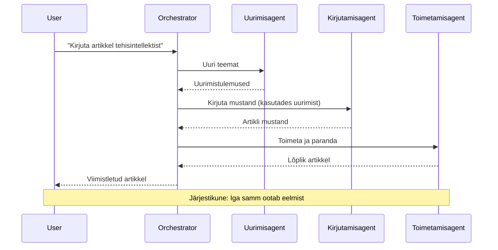
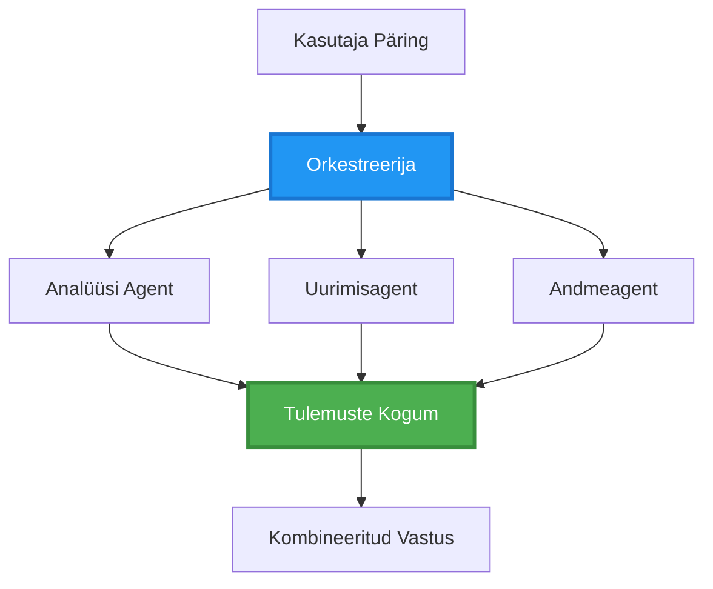
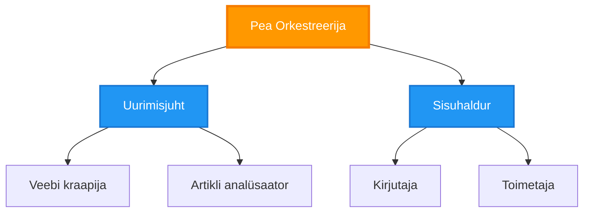
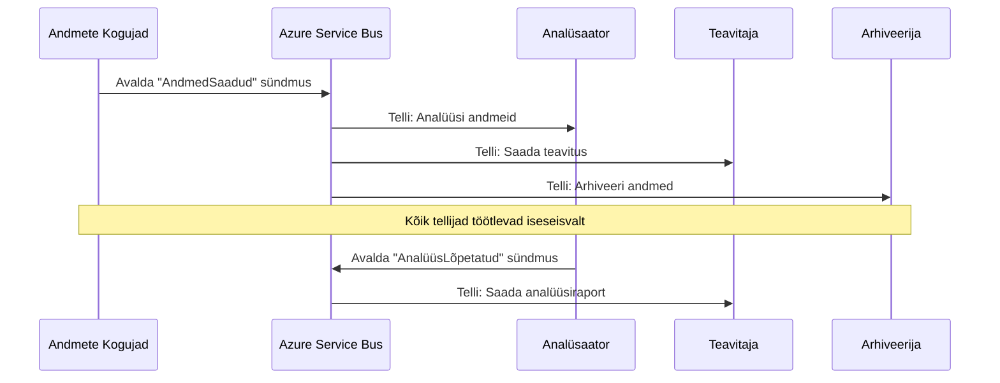
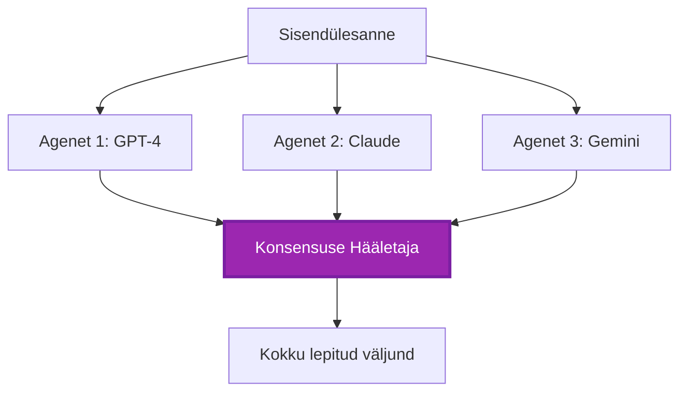
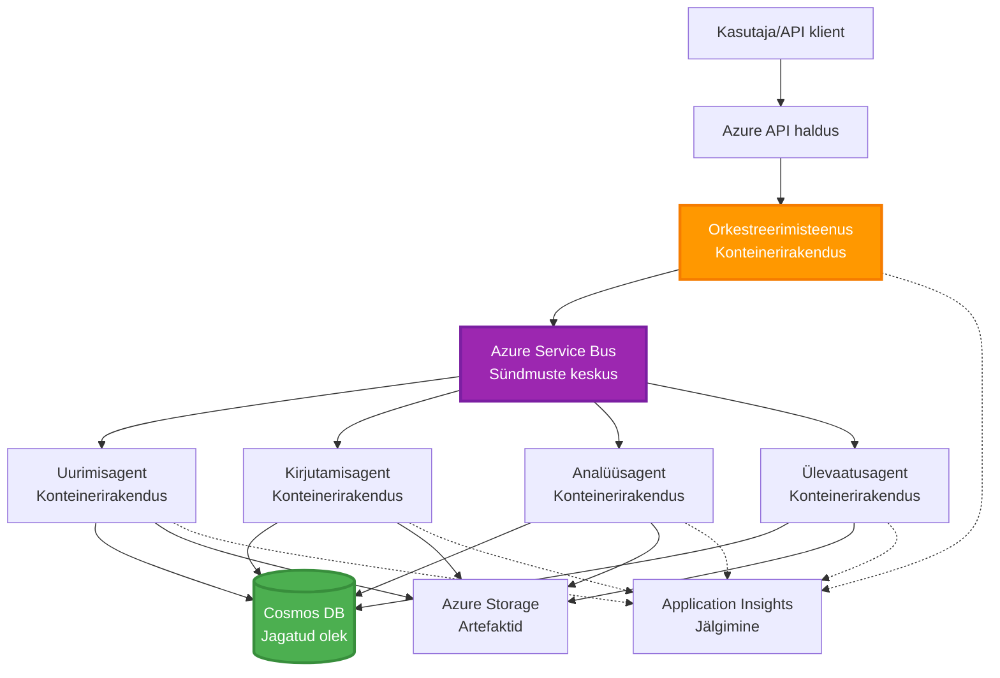

# Multiagentide Koordineerimismustrid

⏱️ **Hinnanguline aeg**: 60-75 minutit | 💰 **Hinnanguline kulu**: ~$100-300/kuus | ⭐ **Keerukus**: Edasijõudnud

**📚 Õppeteekond:**
- ← Eelmine: [Mahutavuse planeerimine](capacity-planning.md) - Ressursside suuruse ja skaleerimise strateegiad
- 🎯 **Oled siin**: Multiagentide koordineerimismustrid (orkestreerimine, suhtlus, oleku haldamine)
- → Järgmine: [SKU valik](sku-selection.md) - Õigete Azure teenuste valimine
- 🏠 [Kursuse avaleht](../../README.md)

---

## Mida õpid

Selle õppetunni läbimisega:
- Mõistad **multiagentide arhitektuuri** mustreid ja nende kasutusvõimalusi
- Rakendad **orkestreerimismustreid** (tsentraliseeritud, detsentraliseeritud, hierarhiline)
- Kujundad **agentide suhtlusstrateegiaid** (sünkroonne, asünkroonne, sündmuspõhine)
- Haldad **jagatud olekut** hajutatud agentide vahel
- Paigaldad **multiagentide süsteeme** Azure'i abil AZD-ga
- Rakendad **koordineerimismustreid** reaalsetes AI-situatsioonides
- Jälgid ja silud hajutatud agentide süsteeme

## Miks multiagentide koordineerimine on oluline

### Evolutsioon: Ühelt agendilt multiagentidele

**Üksik agent (lihtne):**
```
User → Agent → Response
```
- ✅ Lihtne mõista ja rakendada
- ✅ Kiire lihtsate ülesannete puhul
- ❌ Piiratud ühe mudeli võimekusega
- ❌ Ei saa keerulisi ülesandeid paralleelselt täita
- ❌ Ei ole spetsialiseerumist

**Multiagentide süsteem (edasijõudnud):**
```
           ┌─────────────┐
           │ Orchestrator│
           └──────┬──────┘
        ┌─────────┼─────────┐
        │         │         │
    ┌───▼──┐  ┌──▼───┐  ┌──▼────┐
    │Agent1│  │Agent2│  │Agent3 │
    │(Plan)│  │(Code)│  │(Review)│
    └──────┘  └──────┘  └───────┘
```
- ✅ Spetsialiseeritud agendid konkreetsete ülesannete jaoks
- ✅ Paralleelne täitmine kiiruse tagamiseks
- ✅ Modulaarne ja hooldatav
- ✅ Parem keerukate töövoogude puhul
- ⚠️ Vajab koordineerimisloogikat

**Võrdlus**: Üksik agent on nagu üks inimene, kes teeb kõiki ülesandeid. Multiagentide süsteem on nagu meeskond, kus igal liikmel on spetsialiseeritud oskused (uurija, koodikirjutaja, ülevaataja, kirjutaja), kes töötavad koos.

---

## Põhilised koordineerimismustrid

### Muster 1: Järjestikune koordineerimine (Vastutusahela muster)

**Millal kasutada**: Ülesanded peavad täituma kindlas järjekorras, iga agent tugineb eelmise väljundile.


**Eelised:**
- ✅ Selge andmevoog
- ✅ Lihtne siluda
- ✅ Ennustatav täitmisjärjekord

**Piirangud:**
- ❌ Aeglasem (paralleelsus puudub)
- ❌ Üks tõrge peatab kogu ahela
- ❌ Ei sobi omavahel sõltuvate ülesannete jaoks

**Näited kasutusjuhtudest:**
- Sisu loomise torujuhe (uurimine → kirjutamine → toimetamine → avaldamine)
- Koodi genereerimine (planeerimine → rakendamine → testimine → juurutamine)
- Aruannete loomine (andmete kogumine → analüüs → visualiseerimine → kokkuvõte)

---

### Muster 2: Paralleelne koordineerimine (Fan-Out/Fan-In)

**Millal kasutada**: Sõltumatud ülesanded saab täita samaaegselt, tulemused kombineeritakse lõpus.


**Eelised:**
- ✅ Kiire (paralleelne täitmine)
- ✅ Tõrketaluv (osalised tulemused aktsepteeritavad)
- ✅ Horisontaalselt skaleeritav

**Piirangud:**
- ⚠️ Tulemused võivad saabuda vales järjekorras
- ⚠️ Vajab koondamisloogikat
- ⚠️ Keeruline oleku haldamine

**Näited kasutusjuhtudest:**
- Mitme allika andmete kogumine (API-d + andmebaasid + veebikraapimine)
- Konkurentsianalüüs (mitu mudelit genereerivad lahendusi, parim valitakse)
- Tõlketeenused (tõlkimine mitmesse keelde samaaegselt)

---

### Muster 3: Hierarhiline koordineerimine (Juht-töötaja)

**Millal kasutada**: Keerukad töövood alamtöödega, vaja delegeerimist.


**Eelised:**
- ✅ Haldab keerukaid töövooge
- ✅ Modulaarne ja hooldatav
- ✅ Selged vastutuse piirid

**Piirangud:**
- ⚠️ Keerulisem arhitektuur
- ⚠️ Suurem latentsus (mitu koordineerimistasandit)
- ⚠️ Vajab keerukat orkestreerimist

**Näited kasutusjuhtudest:**
- Ettevõtte dokumenditöötlus (klassifitseerimine → suunamine → töötlemine → arhiveerimine)
- Mitmeastmelised andmetorud (sissevõtt → puhastamine → teisendamine → analüüs → aruandlus)
- Keerukad automatiseerimisvood (planeerimine → ressursside jaotamine → täitmine → jälgimine)

---

### Muster 4: Sündmuspõhine koordineerimine (Avalda-telli)

**Millal kasutada**: Agendid peavad reageerima sündmustele, soovitakse lahtist sidumist.


**Eelised:**
- ✅ Lahtine sidumine agentide vahel
- ✅ Lihtne lisada uusi agente (lihtsalt telli)
- ✅ Asünkroonne töötlemine
- ✅ Vastupidav (sõnumite püsivus)

**Piirangud:**
- ⚠️ Lõpuks saavutatud järjepidevus
- ⚠️ Keeruline silumine
- ⚠️ Sõnumite järjestuse probleemid

**Näited kasutusjuhtudest:**
- Reaalajas jälgimissüsteemid (hoiatused, juhtpaneelid, logid)
- Mitmekanalilised teavitused (e-post, SMS, push, Slack)
- Andmetöötlustorud (sama andme tarbijad)

---

### Muster 5: Konsensuspõhine koordineerimine (Hääletus/kvoorum)

**Millal kasutada**: Vajalik mitme agendi nõusolek enne edasiliikumist.


**Eelised:**
- ✅ Suurem täpsus (mitu arvamust)
- ✅ Tõrketaluv (vähemuse tõrked aktsepteeritavad)
- ✅ Kvaliteedikontroll sisse ehitatud

**Piirangud:**
- ❌ Kallis (mitu mudelikõnet)
- ❌ Aeglasem (ootab kõiki agente)
- ⚠️ Vajab konfliktide lahendamist

**Näited kasutusjuhtudest:**
- Sisu modereerimine (mitu mudelit vaatavad sisu üle)
- Koodikontroll (mitu linterit/analyüsaatorit)
- Meditsiiniline diagnoos (mitu AI mudelit, eksperdi valideerimine)

---

## Arhitektuuri ülevaade

### Täielik multiagentide süsteem Azure'is


**Põhikomponendid:**

| Komponent | Eesmärk | Azure'i teenus |
|-----------|---------|---------------|
| **API Gateway** | Sisenemispunkt, kiiruse piiramine, autentimine | API Management |
| **Orkestreerija** | Koordineerib agentide töövooge | Container Apps |
| **Sõnumijärjekord** | Asünkroonne suhtlus | Service Bus / Event Hubs |
| **Agendid** | Spetsialiseeritud AI töötajad | Container Apps / Functions |
| **Olekuhoidla** | Jagatud olek, ülesannete jälgimine | Cosmos DB |
| **Artefaktide hoidla** | Dokumendid, tulemused, logid | Blob Storage |
| **Jälgimine** | Hajutatud jälgimine, logid | Application Insights |

---

## Eeltingimused

### Vajalikud tööriistad

```bash
# Kontrolli Azure Developer CLI
azd version
# ✅ Oodatav: azd versioon 1.0.0 või uuem

# Kontrolli Azure CLI
az --version
# ✅ Oodatav: azure-cli 2.50.0 või uuem

# Kontrolli Dockeri (kohalikuks testimiseks)
docker --version
# ✅ Oodatav: Dockeri versioon 20.10 või uuem
```

### Azure'i nõuded

- Aktiivne Azure'i tellimus
- Õigused luua:
  - Container Apps
  - Service Bus nimed
  - Cosmos DB kontod
  - Salvestuskontod
  - Application Insights

### Teadmiste eeltingimused

Peaksid olema läbinud:
- [Konfiguratsiooni haldamine](../getting-started/configuration.md)
- [Autentimine ja turvalisus](../getting-started/authsecurity.md)
- [Mikroteenuste näide](../../../../examples/microservices)

---

## Rakendusjuhend

### Projekti struktuur

```
multi-agent-system/
├── azure.yaml                    # AZD configuration
├── infra/
│   ├── main.bicep               # Main infrastructure
│   ├── core/
│   │   ├── servicebus.bicep     # Message queue
│   │   ├── cosmos.bicep         # State store
│   │   ├── storage.bicep        # Artifact storage
│   │   └── monitoring.bicep     # Application Insights
│   └── app/
│       ├── orchestrator.bicep   # Orchestrator service
│       └── agent.bicep          # Agent template
└── src/
    ├── orchestrator/            # Orchestration logic
    │   ├── app.py
    │   ├── workflows.py
    │   └── Dockerfile
    ├── agents/
    │   ├── research/            # Research agent
    │   ├── writer/              # Writer agent
    │   ├── analyst/             # Analyst agent
    │   └── reviewer/            # Reviewer agent
    └── shared/
        ├── state_manager.py     # Shared state logic
        └── message_handler.py   # Message handling
```

---

## Õppetund 1: Järjestikune koordineerimismuster

### Rakendamine: Sisuloome torujuhe

Loome järjestikuse torujuhtme: Uurimine → Kirjutamine → Toimetamine → Avaldamine

### 1. AZD konfiguratsioon

**Fail: `azure.yaml`**

```yaml
name: content-pipeline
metadata:
  template: multi-agent-sequential@1.0.0

services:
  orchestrator:
    project: ./src/orchestrator
    language: python
    host: containerapp
  
  research-agent:
    project: ./src/agents/research
    language: python
    host: containerapp
  
  writer-agent:
    project: ./src/agents/writer
    language: python
    host: containerapp
  
  editor-agent:
    project: ./src/agents/editor
    language: python
    host: containerapp
```

### 2. Infrastruktuur: Service Bus koordineerimiseks

**Fail: `infra/core/servicebus.bicep`**

```bicep
param name string
param location string
param tags object = {}

resource serviceBusNamespace 'Microsoft.ServiceBus/namespaces@2022-10-01-preview' = {
  name: name
  location: location
  tags: tags
  sku: {
    name: 'Standard'
    tier: 'Standard'
  }
  properties: {
    minimumTlsVersion: '1.2'
  }
}

// Queue for orchestrator → research agent
resource researchQueue 'Microsoft.ServiceBus/namespaces/queues@2022-10-01-preview' = {
  parent: serviceBusNamespace
  name: 'research-tasks'
  properties: {
    maxDeliveryCount: 3
    lockDuration: 'PT5M'
    deadLetteringOnMessageExpiration: true
  }
}

// Queue for research agent → writer agent
resource writerQueue 'Microsoft.ServiceBus/namespaces/queues@2022-10-01-preview' = {
  parent: serviceBusNamespace
  name: 'writer-tasks'
  properties: {
    maxDeliveryCount: 3
    lockDuration: 'PT5M'
  }
}

// Queue for writer agent → editor agent
resource editorQueue 'Microsoft.ServiceBus/namespaces/queues@2022-10-01-preview' = {
  parent: serviceBusNamespace
  name: 'editor-tasks'
  properties: {
    maxDeliveryCount: 3
    lockDuration: 'PT5M'
  }
}

output namespace string = serviceBusNamespace.name
output connectionString string = listKeys('${serviceBusNamespace.id}/AuthorizationRules/RootManageSharedAccessKey', serviceBusNamespace.apiVersion).primaryConnectionString
```

### 3. Jagatud oleku haldur

**Fail: `src/shared/state_manager.py`**

```python
from azure.cosmos import CosmosClient, PartitionKey
from datetime import datetime
import os

class StateManager:
    """Manages shared state across agents using Cosmos DB"""
    
    def __init__(self):
        endpoint = os.environ['COSMOS_ENDPOINT']
        key = os.environ['COSMOS_KEY']
        
        self.client = CosmosClient(endpoint, key)
        self.database = self.client.get_database_client('agent-state')
        self.container = self.database.get_container_client('tasks')
    
    def create_task(self, task_id: str, task_type: str, input_data: dict):
        """Create a new task"""
        task = {
            'id': task_id,
            'type': task_type,
            'status': 'pending',
            'input': input_data,
            'created_at': datetime.utcnow().isoformat(),
            'steps': []
        }
        self.container.create_item(task)
        return task
    
    def update_task_step(self, task_id: str, step_name: str, result: dict):
        """Update task with completed step"""
        task = self.container.read_item(task_id, partition_key=task_id)
        
        task['steps'].append({
            'name': step_name,
            'completed_at': datetime.utcnow().isoformat(),
            'result': result
        })
        
        self.container.replace_item(task_id, task)
        return task
    
    def complete_task(self, task_id: str, final_result: dict):
        """Mark task as complete"""
        task = self.container.read_item(task_id, partition_key=task_id)
        task['status'] = 'completed'
        task['result'] = final_result
        task['completed_at'] = datetime.utcnow().isoformat()
        self.container.replace_item(task_id, task)
        return task
    
    def get_task(self, task_id: str):
        """Retrieve task state"""
        return self.container.read_item(task_id, partition_key=task_id)
```

### 4. Orkestreerija teenus

**Fail: `src/orchestrator/app.py`**

```python
from flask import Flask, request, jsonify
from azure.servicebus import ServiceBusClient, ServiceBusMessage
import json
import uuid
import os
from shared.state_manager import StateManager

app = Flask(__name__)
state_manager = StateManager()

# Service Busi ühendus
servicebus_connection_str = os.environ['SERVICEBUS_CONNECTION_STRING']
servicebus_client = ServiceBusClient.from_connection_string(servicebus_connection_str)

@app.route('/health', methods=['GET'])
def health():
    return jsonify({'status': 'healthy', 'service': 'orchestrator'})

@app.route('/create-content', methods=['POST'])
def create_content():
    """
    Sequential workflow: Research → Write → Edit → Publish
    """
    data = request.json
    topic = data.get('topic')
    
    if not topic:
        return jsonify({'error': 'Topic required'}), 400
    
    # Loo ülesanne olekuhoidlas
    task_id = str(uuid.uuid4())
    task = state_manager.create_task(
        task_id=task_id,
        task_type='content_creation',
        input_data={'topic': topic}
    )
    
    # Saada sõnum uurimisagendile (esimene samm)
    sender = servicebus_client.get_queue_sender('research-tasks')
    message = ServiceBusMessage(
        body=json.dumps({
            'task_id': task_id,
            'topic': topic,
            'next_queue': 'writer-tasks'  # Kuhu tulemused saata
        }),
        content_type='application/json'
    )
    
    with sender:
        sender.send_messages(message)
    
    return jsonify({
        'task_id': task_id,
        'status': 'started',
        'workflow': 'sequential',
        'steps': ['research', 'write', 'edit', 'publish'],
        'message': 'Content creation pipeline initiated'
    }), 202

@app.route('/task/<task_id>', methods=['GET'])
def get_task_status(task_id):
    """Check task status"""
    try:
        task = state_manager.get_task(task_id)
        return jsonify(task)
    except Exception as e:
        return jsonify({'error': str(e)}), 404

if __name__ == '__main__':
    app.run(host='0.0.0.0', port=8080)
```

### 5. Uurimisagent

**Fail: `src/agents/research/app.py`**

```python
from azure.servicebus import ServiceBusClient, ServiceBusMessage
from openai import AzureOpenAI
import json
import os
import time
from shared.state_manager import StateManager

# Initsialiseeri kliendid
state_manager = StateManager()
servicebus_client = ServiceBusClient.from_connection_string(
    os.environ['SERVICEBUS_CONNECTION_STRING']
)

openai_client = AzureOpenAI(
    api_key=os.environ['AZURE_OPENAI_API_KEY'],
    api_version="2024-02-01",
    azure_endpoint=os.environ['AZURE_OPENAI_ENDPOINT']
)

def process_research_task(message_data):
    """Process research request and pass to writer"""
    task_id = message_data['task_id']
    topic = message_data['topic']
    next_queue = message_data['next_queue']
    
    print(f"🔬 Researching: {topic}")
    
    # Kutsu Azure OpenAI uurimiseks
    response = openai_client.chat.completions.create(
        model="gpt-4",
        messages=[
            {"role": "system", "content": "You are a research assistant. Provide comprehensive research on the given topic."},
            {"role": "user", "content": f"Research this topic thoroughly: {topic}"}
        ],
        max_tokens=1500
    )
    
    research_results = response.choices[0].message.content
    
    # Uuenda olekut
    state_manager.update_task_step(
        task_id=task_id,
        step_name='research',
        result={'research': research_results}
    )
    
    # Saada järgmisele agendile (kirjutaja)
    sender = servicebus_client.get_queue_sender(next_queue)
    message = ServiceBusMessage(
        body=json.dumps({
            'task_id': task_id,
            'topic': topic,
            'research': research_results,
            'next_queue': 'editor-tasks'
        }),
        content_type='application/json'
    )
    
    with sender:
        sender.send_messages(message)
    
    print(f"✅ Research complete for task {task_id}")

def main():
    """Listen to research queue"""
    receiver = servicebus_client.get_queue_receiver('research-tasks')
    
    print("🔬 Research Agent started, listening for tasks...")
    
    with receiver:
        while True:
            messages = receiver.receive_messages(max_wait_time=5)
            for message in messages:
                try:
                    message_data = json.loads(str(message))
                    process_research_task(message_data)
                    receiver.complete_message(message)
                except Exception as e:
                    print(f"❌ Error processing message: {e}")
                    receiver.abandon_message(message)

if __name__ == '__main__':
    main()
```

### 6. Kirjutamisagent

**Fail: `src/agents/writer/app.py`**

```python
from azure.servicebus import ServiceBusClient, ServiceBusMessage
from openai import AzureOpenAI
import json
import os
from shared.state_manager import StateManager

state_manager = StateManager()
servicebus_client = ServiceBusClient.from_connection_string(
    os.environ['SERVICEBUS_CONNECTION_STRING']
)

openai_client = AzureOpenAI(
    api_key=os.environ['AZURE_OPENAI_API_KEY'],
    api_version="2024-02-01",
    azure_endpoint=os.environ['AZURE_OPENAI_ENDPOINT']
)

def process_writing_task(message_data):
    """Write article based on research"""
    task_id = message_data['task_id']
    topic = message_data['topic']
    research = message_data['research']
    next_queue = message_data['next_queue']
    
    print(f"✍️ Writing article: {topic}")
    
    # Kutsu Azure OpenAI artiklit kirjutama
    response = openai_client.chat.completions.create(
        model="gpt-4",
        messages=[
            {"role": "system", "content": "You are a professional writer. Write engaging, well-structured articles."},
            {"role": "user", "content": f"Based on this research:\n\n{research}\n\nWrite a comprehensive article about: {topic}"}
        ],
        max_tokens=2000
    )
    
    article_draft = response.choices[0].message.content
    
    # Uuenda olekut
    state_manager.update_task_step(
        task_id=task_id,
        step_name='writing',
        result={'draft': article_draft}
    )
    
    # Saada toimetajale
    sender = servicebus_client.get_queue_sender(next_queue)
    message = ServiceBusMessage(
        body=json.dumps({
            'task_id': task_id,
            'topic': topic,
            'draft': article_draft
        }),
        content_type='application/json'
    )
    
    with sender:
        sender.send_messages(message)
    
    print(f"✅ Article draft complete for task {task_id}")

def main():
    """Listen to writer queue"""
    receiver = servicebus_client.get_queue_receiver('writer-tasks')
    
    print("✍️ Writer Agent started, listening for tasks...")
    
    with receiver:
        while True:
            messages = receiver.receive_messages(max_wait_time=5)
            for message in messages:
                try:
                    message_data = json.loads(str(message))
                    process_writing_task(message_data)
                    receiver.complete_message(message)
                except Exception as e:
                    print(f"❌ Error: {e}")
                    receiver.abandon_message(message)

if __name__ == '__main__':
    main()
```

### 7. Toimetamisagent

**Fail: `src/agents/editor/app.py`**

```python
from azure.servicebus import ServiceBusClient
from openai import AzureOpenAI
import json
import os
from shared.state_manager import StateManager

state_manager = StateManager()
servicebus_client = ServiceBusClient.from_connection_string(
    os.environ['SERVICEBUS_CONNECTION_STRING']
)

openai_client = AzureOpenAI(
    api_key=os.environ['AZURE_OPENAI_API_KEY'],
    api_version="2024-02-01",
    azure_endpoint=os.environ['AZURE_OPENAI_ENDPOINT']
)

def process_editing_task(message_data):
    """Edit and finalize article"""
    task_id = message_data['task_id']
    topic = message_data['topic']
    draft = message_data['draft']
    
    print(f"📝 Editing article: {topic}")
    
    # Kutsu Azure OpenAI redigeerimiseks
    response = openai_client.chat.completions.create(
        model="gpt-4",
        messages=[
            {"role": "system", "content": "You are an expert editor. Improve grammar, clarity, and structure."},
            {"role": "user", "content": f"Edit and improve this article:\n\n{draft}"}
        ],
        max_tokens=2000
    )
    
    final_article = response.choices[0].message.content
    
    # Märgi ülesanne lõpetatuks
    state_manager.complete_task(
        task_id=task_id,
        final_result={
            'topic': topic,
            'final_article': final_article,
            'word_count': len(final_article.split())
        }
    )
    
    print(f"✅ Article finalized for task {task_id}")

def main():
    """Listen to editor queue"""
    receiver = servicebus_client.get_queue_receiver('editor-tasks')
    
    print("📝 Editor Agent started, listening for tasks...")
    
    with receiver:
        while True:
            messages = receiver.receive_messages(max_wait_time=5)
            for message in messages:
                try:
                    message_data = json.loads(str(message))
                    process_editing_task(message_data)
                    receiver.complete_message(message)
                except Exception as e:
                    print(f"❌ Error: {e}")
                    receiver.abandon_message(message)

if __name__ == '__main__':
    main()
```

### 8. Paigaldamine ja testimine

```bash
# Initsialiseeri ja juuruta
azd init
azd up

# Hangi orkestreerija URL
ORCHESTRATOR_URL=$(azd env get-values | grep ORCHESTRATOR_URL | cut -d '=' -f2 | tr -d '"')

# Loo sisu
curl -X POST $ORCHESTRATOR_URL/create-content \
  -H "Content-Type: application/json" \
  -d '{"topic": "The Future of AI in Healthcare"}'
```

**✅ Oodatav väljund:**
```json
{
  "task_id": "a1b2c3d4-e5f6-7890-abcd-ef1234567890",
  "status": "started",
  "workflow": "sequential",
  "steps": ["research", "write", "edit", "publish"],
  "message": "Content creation pipeline initiated"
}
```

**Kontrolli ülesande edenemist:**
```bash
TASK_ID="a1b2c3d4-e5f6-7890-abcd-ef1234567890"
curl $ORCHESTRATOR_URL/task/$TASK_ID
```

**✅ Oodatav väljund (valmis):**
```json
{
  "id": "a1b2c3d4-e5f6-7890-abcd-ef1234567890",
  "type": "content_creation",
  "status": "completed",
  "steps": [
    {
      "name": "research",
      "completed_at": "2025-11-19T10:30:00Z",
      "result": {"research": "..."}
    },
    {
      "name": "writing",
      "completed_at": "2025-11-19T10:32:00Z",
      "result": {"draft": "..."}
    }
  ],
  "result": {
    "topic": "The Future of AI in Healthcare",
    "final_article": "...",
    "word_count": 1500
  }
}
```

---

## Õppetund 2: Paralleelne koordineerimismuster

### Rakendamine: Mitmeallikate uurimisagregaator

Loome paralleelse süsteemi, mis kogub teavet mitmest allikast samaaegselt.

### Paralleelne orkestreerija

**Fail: `src/orchestrator/parallel_workflow.py`**

```python
from flask import Flask, request, jsonify
from azure.servicebus import ServiceBusClient, ServiceBusMessage
import json
import uuid
import os
from shared.state_manager import StateManager

app = Flask(__name__)
state_manager = StateManager()

servicebus_client = ServiceBusClient.from_connection_string(
    os.environ['SERVICEBUS_CONNECTION_STRING']
)

@app.route('/research-parallel', methods=['POST'])
def research_parallel():
    """
    Parallel workflow: Multiple agents work simultaneously
    """
    data = request.json
    query = data.get('query')
    
    task_id = str(uuid.uuid4())
    task = state_manager.create_task(
        task_id=task_id,
        task_type='parallel_research',
        input_data={
            'query': query,
            'agents': ['web', 'academic', 'news', 'social']
        }
    )
    
    # Fänn-välja: Saada kõigile agentidele samaaegselt
    agents = [
        ('web-research-queue', 'web'),
        ('academic-research-queue', 'academic'),
        ('news-research-queue', 'news'),
        ('social-research-queue', 'social')
    ]
    
    for queue_name, agent_type in agents:
        sender = servicebus_client.get_queue_sender(queue_name)
        message = ServiceBusMessage(
            body=json.dumps({
                'task_id': task_id,
                'query': query,
                'agent_type': agent_type,
                'result_queue': 'aggregation-queue'
            }),
            content_type='application/json'
        )
        
        with sender:
            sender.send_messages(message)
    
    return jsonify({
        'task_id': task_id,
        'status': 'started',
        'workflow': 'parallel',
        'agents_dispatched': 4,
        'message': 'Parallel research initiated'
    }), 202

if __name__ == '__main__':
    app.run(host='0.0.0.0', port=8080)
```

### Koondamisloogika

**Fail: `src/agents/aggregator/app.py`**

```python
from azure.servicebus import ServiceBusClient
import json
import os
from collections import defaultdict
from shared.state_manager import StateManager

state_manager = StateManager()
servicebus_client = ServiceBusClient.from_connection_string(
    os.environ['SERVICEBUS_CONNECTION_STRING']
)

# Jälgi tulemusi iga ülesande kohta
task_results = defaultdict(list)
expected_agents = 4  # veeb, akadeemiline, uudised, sotsiaal

def process_result(message_data):
    """Aggregate results from parallel agents"""
    task_id = message_data['task_id']
    agent_type = message_data['agent_type']
    result = message_data['result']
    
    # Salvesta tulemus
    task_results[task_id].append({
        'agent': agent_type,
        'data': result
    })
    
    print(f"📊 Received result from {agent_type} agent ({len(task_results[task_id])}/{expected_agents})")
    
    # Kontrolli, kas kõik agendid on lõpetanud (fan-in)
    if len(task_results[task_id]) == expected_agents:
        print(f"✅ All agents completed for task {task_id}. Aggregating...")
        
        # Kombineeri tulemused
        aggregated = {
            'query': message_data['query'],
            'sources': task_results[task_id],
            'summary': generate_summary(task_results[task_id])
        }
        
        # Märgi lõpetatuks
        state_manager.complete_task(task_id, aggregated)
        
        # Puhasta
        del task_results[task_id]
        
        print(f"✅ Aggregation complete for task {task_id}")

def generate_summary(results):
    """Generate summary from all sources"""
    summaries = [r['data'].get('summary', '') for r in results]
    return '\n\n'.join(summaries)

def main():
    """Listen to aggregation queue"""
    receiver = servicebus_client.get_queue_receiver('aggregation-queue')
    
    print("📊 Aggregator started, listening for results...")
    
    with receiver:
        while True:
            messages = receiver.receive_messages(max_wait_time=5)
            for message in messages:
                try:
                    message_data = json.loads(str(message))
                    process_result(message_data)
                    receiver.complete_message(message)
                except Exception as e:
                    print(f"❌ Error: {e}")
                    receiver.abandon_message(message)

if __name__ == '__main__':
    main()
```

**Paralleelse mustri eelised:**
- ⚡ **4x kiirem** (agendid töötavad samaaegselt)
- 🔄 **Tõrketaluv** (osalised tulemused aktsepteeritavad)
- 📈 **Skaleeritav** (lihtne lisada rohkem agente)

---

## Praktilised harjutused

### Harjutus 1: Lisa ajapiirang ⭐⭐ (Keskmine)

**Eesmärk**: Rakenda ajapiirang, et agregaator ei ootaks aeglaseid agente lõputult.

**Sammud**:

1. **Lisa ajapiirangu jälgimine agregaatorisse:**

```python
from datetime import datetime, timedelta

task_timeouts = {}  # ülesande_id -> aegumisaeg

def process_result(message_data):
    task_id = message_data['task_id']
    
    # Määra esimese tulemuse ajalõpp
    if task_id not in task_timeouts:
        task_timeouts[task_id] = datetime.utcnow() + timedelta(seconds=30)
    
    task_results[task_id].append({
        'agent': message_data['agent_type'],
        'data': message_data['result']
    })
    
    # Kontrolli, kas lõpetatud VÕI aegunud
    if len(task_results[task_id]) == expected_agents or \
       datetime.utcnow() > task_timeouts[task_id]:
        
        print(f"📊 Aggregating with {len(task_results[task_id])}/{expected_agents} results")
        
        aggregated = {
            'query': message_data['query'],
            'sources': task_results[task_id],
            'completed_agents': len(task_results[task_id]),
            'timed_out': len(task_results[task_id]) < expected_agents
        }
        
        state_manager.complete_task(task_id, aggregated)
        
        # Korista
        del task_results[task_id]
        del task_timeouts[task_id]
```

2. **Testi kunstlike viivitustega:**

```python
# Ühes agendis lisage viivitus, et simuleerida aeglast töötlemist
import time
time.sleep(35)  # Ületab 30-sekundilise ajapiirangu
```

3. **Paigalda ja kontrolli:**

```bash
azd deploy aggregator

# Esita ülesanne
curl -X POST $ORCHESTRATOR_URL/research-parallel \
  -H "Content-Type: application/json" \
  -d '{"query": "AI safety research"}'

# Kontrolli tulemusi 30 sekundi pärast
curl $ORCHESTRATOR_URL/task/$TASK_ID
```

**✅ Edukuse kriteeriumid:**
- ✅ Ülesanne lõpeb 30 sekundi pärast, isegi kui agendid ei lõpeta
- ✅ Vastus näitab osalisi tulemusi (`"timed_out": true`)
- ✅ Saadaval olevad tulemused tagastatakse (3 agenti 4-st)

**Aeg**: 20-25 minutit

---

### Harjutus 2: Rakenda uuesti proovimise loogika ⭐⭐⭐ (Edasijõudnud)

**Eesmärk**: Proovi automaatselt uuesti ebaõnnestunud agentide ülesandeid enne loobumist.

**Sammud**:

1. **Lisa uuesti proovimise jälgimine orkestreerijasse:**

```python
from dataclasses import dataclass
from typing import Dict

@dataclass
class RetryConfig:
    max_retries: int = 3
    backoff_seconds: int = 5

retry_counts: Dict[str, int] = {}  # sõnumi_id -> uuesti_katsete_arv

def send_with_retry(queue_name: str, message_data: dict, retry_config: RetryConfig):
    """Send message with retry metadata"""
    message_id = message_data.get('message_id', str(uuid.uuid4()))
    message_data['message_id'] = message_id
    message_data['retry_count'] = retry_counts.get(message_id, 0)
    message_data['max_retries'] = retry_config.max_retries
    
    sender = servicebus_client.get_queue_sender(queue_name)
    message = ServiceBusMessage(
        body=json.dumps(message_data),
        content_type='application/json',
        message_id=message_id
    )
    
    with sender:
        sender.send_messages(message)
```

2. **Lisa uuesti proovimise haldur agentidele:**

```python
def process_with_retry(message, receiver, process_func):
    """Process message with automatic retry on failure"""
    try:
        message_data = json.loads(str(message))
        
        # Töötle sõnumit
        process_func(message_data)
        
        # Edu - lõpetatud
        receiver.complete_message(message)
        
    except Exception as e:
        message_id = message.message_id
        retry_count = message_data.get('retry_count', 0)
        max_retries = message_data.get('max_retries', 3)
        
        if retry_count < max_retries:
            # Proovi uuesti: loobu ja järjekorda uuesti suurendatud loenduriga
            print(f"⚠️ Retry {retry_count + 1}/{max_retries} for message {message_id}")
            
            message_data['retry_count'] = retry_count + 1
            
            # Saada tagasi samasse järjekorda viivitusega
            time.sleep(5 * (retry_count + 1))  # Eksponentsiaalne tagasipõrge
            send_with_retry(queue_name, message_data, RetryConfig())
            
            receiver.complete_message(message)  # Eemalda originaal
        else:
            # Maksimaalne katsete arv ületatud - liigu surnud kirjade järjekorda
            print(f"❌ Max retries exceeded for message {message_id}")
            receiver.dead_letter_message(
                message,
                reason="MaxRetriesExceeded",
                error_description=str(e)
            )
```

3. **Jälgi surnud kirjade järjekorda:**

```python
def monitor_dead_letters():
    """Check dead letter queue for failed messages"""
    receiver = servicebus_client.get_queue_receiver(
        'research-queue',
        sub_queue='deadletter'
    )
    
    with receiver:
        messages = receiver.receive_messages(max_wait_time=5)
        for message in messages:
            print(f"☠️ Dead letter: {message.message_id}")
            print(f"Reason: {message.dead_letter_reason}")
            print(f"Description: {message.dead_letter_error_description}")
```

**✅ Edukuse kriteeriumid:**
- ✅ Ebaõnnestunud ülesanded proovivad automaatselt uuesti (kuni 3 korda)
- ✅ Eksponentsiaalne viivitus uuesti proovimiste vahel (5s, 10s, 15s)
- ✅ Pärast maksimaalset katset lähevad sõnumid surnud kirjade järjekorda
- ✅ Surnud kirjade järjekorda saab jälgida ja uuesti esitada

**Aeg**: 30-40 minutit

---

### Harjutus 3: Rakenda voolukatkesti ⭐⭐⭐ (Edasijõudnud)

**Eesmärk**: Väldi ahelreaktsiooni tõrkeid, peatades päringud ebaõnnestunud agentidele.

**Sammud**:

1. **Loo voolukatkesti klass:**

```python
from enum import Enum
from datetime import datetime, timedelta

class CircuitState(Enum):
    CLOSED = "closed"      # Tavaline töö
    OPEN = "open"          # Tõrge, taotlused tagasi lükata
    HALF_OPEN = "half_open"  # Testimine, kas taastunud

class CircuitBreaker:
    def __init__(self, failure_threshold=5, timeout_seconds=60):
        self.failure_threshold = failure_threshold
        self.timeout_seconds = timeout_seconds
        self.failure_count = 0
        self.last_failure_time = None
        self.state = CircuitState.CLOSED
    
    def call(self, func):
        """Execute function with circuit breaker protection"""
        if self.state == CircuitState.OPEN:
            # Kontrolli, kas ajavahemik on möödunud
            if datetime.utcnow() - self.last_failure_time > timedelta(seconds=self.timeout_seconds):
                self.state = CircuitState.HALF_OPEN
                print("🔄 Circuit breaker: HALF_OPEN (testing)")
            else:
                raise Exception(f"Circuit breaker OPEN for agent. Try again in {self.timeout_seconds}s")
        
        try:
            result = func()
            
            # Edu
            if self.state == CircuitState.HALF_OPEN:
                self.state = CircuitState.CLOSED
                self.failure_count = 0
                print("✅ Circuit breaker: CLOSED (recovered)")
            
            return result
            
        except Exception as e:
            self.failure_count += 1
            self.last_failure_time = datetime.utcnow()
            
            if self.failure_count >= self.failure_threshold:
                self.state = CircuitState.OPEN
                print(f"🔴 Circuit breaker: OPEN (too many failures)")
            
            raise e
```

2. **Rakenda agentide päringutele:**

```python
# Orkestreerijas
agent_circuits = {
    'web': CircuitBreaker(failure_threshold=5, timeout_seconds=60),
    'academic': CircuitBreaker(failure_threshold=5, timeout_seconds=60),
    'news': CircuitBreaker(failure_threshold=5, timeout_seconds=60),
    'social': CircuitBreaker(failure_threshold=5, timeout_seconds=60)
}

def send_to_agent(agent_type, message_data):
    """Send with circuit breaker protection"""
    circuit = agent_circuits[agent_type]
    
    try:
        circuit.call(lambda: send_message(agent_type, message_data))
    except Exception as e:
        print(f"⚠️ Skipping {agent_type} agent: {e}")
        # Jätka teiste agentidega
```

3. **Testi voolukatkestit:**

```bash
# Simuleeri korduvaid tõrkeid (peata üks agent)
az containerapp stop --name web-research-agent --resource-group rg-agents

# Saada mitu päringut
for i in {1..10}; do
  curl -X POST $ORCHESTRATOR_URL/research-parallel \
    -H "Content-Type: application/json" \
    -d '{"query": "test query '$i'"}'
  sleep 2
done

# Kontrolli logisid - pärast 5 tõrget peaks nägema avatud vooluringi
azd logs orchestrator --tail 50
```

**✅ Edukuse kriteeriumid:**
- ✅ Pärast 5 tõrget avaneb voolukatkesti (keeldub päringutest)
- ✅ Pärast 60 sekundit läheb voolukatkesti poolavatud olekusse (testib taastumist)
- ✅ Teised agendid töötavad normaalselt edasi
- ✅ Voolukatkesti sulgub automaatselt, kui agent taastub

**Aeg**: 40-50 minutit

---

## Jälgimine ja silumine

### Hajutatud jälgimine Application Insightsiga

**Fail: `src/shared/tracing.py`**

```python
from opencensus.ext.azure.log_exporter import AzureLogHandler
from opencensus.ext.azure.trace_exporter import AzureExporter
from opencensus.trace import config_integration
from opencensus.trace.tracer import Tracer
from opencensus.trace.samplers import AlwaysOnSampler
import logging
import os

# Konfigureeri jälgimine
config_integration.trace_integrations(['requests', 'logging'])

connection_string = os.environ.get('APPLICATIONINSIGHTS_CONNECTION_STRING')

# Loo jälgija
tracer = Tracer(
    exporter=AzureExporter(connection_string=connection_string),
    sampler=AlwaysOnSampler()
)

# Konfigureeri logimine
logger = logging.getLogger(__name__)
logger.addHandler(AzureLogHandler(connection_string=connection_string))
logger.setLevel(logging.INFO)

def trace_agent_call(agent_name, task_id, operation):
    """Trace agent operations"""
    with tracer.span(name=f'{agent_name}.{operation}') as span:
        span.add_attribute('agent', agent_name)
        span.add_attribute('task_id', task_id)
        span.add_attribute('operation', operation)
        
        try:
            result = operation()
            span.add_attribute('status', 'success')
            return result
        except Exception as e:
            span.add_attribute('status', 'error')
            span.add_attribute('error', str(e))
            raise
```

### Application Insights päringud

**Jälgi multiagentide töövooge:**

```kusto
// Trace complete workflow for a task
traces
| where customDimensions.task_id == "a1b2c3d4-..."
| project timestamp, message, customDimensions.agent, customDimensions.operation
| order by timestamp asc
```

**Agentide jõudluse võrdlus:**

```kusto
// Compare agent execution times
dependencies
| where name contains "agent"
| summarize 
    avg_duration = avg(duration),
    p95_duration = percentile(duration, 95),
    count = count()
  by agent = tostring(customDimensions.agent)
| order by avg_duration desc
```

**Tõrkeanalüüs:**

```kusto
// Find which agents fail most
exceptions
| where customDimensions.agent != ""
| summarize 
    failure_count = count(),
    unique_errors = dcount(outerMessage)
  by agent = tostring(customDimensions.agent)
| order by failure_count desc
```

---

## Kulude analüüs

### Multiagentide süsteemi kulud (kuised hinnangud)

| Komponent | Konfiguratsioon | Kulu |
|-----------|--------------|------|
| **Orkestreerija** | 1 Container App (1 vCPU, 2GB) | $30-50 |
| **4 agenti** | 4 Container Apps (0.5 vCPU, 1GB igaüks) | $60-120 |
| **Service Bus** | Standardtase, 10M sõnumit | $10-20 |
| **Cosmos DB** | Serverless, 5GB salvestus, 1M RUs | $25-50 |
| **Blob Storage** | 10GB salvestus, 100K operatsiooni | $5-10 |
| **Application Insights** | 5GB andmete kogumine | $10-15 |
| **Azure OpenAI** | GPT-4, 10M tokenit | $100-300 |
| **Kokku** | | **$240-565/kuus** |

### Kulude optimeerimise strateegiad

1. **Kasuta võimalusel serverless lahendusi:**
   ```bicep
   // Cosmos DB serverless (no minimum cost)
   properties: {
     databaseAccountOfferType: 'Standard'
     capabilities: [{ name: 'EnableServerless' }]
   }
   ```

2. **Skaleeri agendid nulli, kui need on jõude:**
   ```bicep
   scale: {
     minReplicas: 0  // Scale to zero when no messages
     maxReplicas: 10
   }
   ```

3. **Kasuta Service Bus jaoks partii töötlemist:**
   ```python
   # Saada sõnumeid partiidena (odavam)
   sender.send_messages([message1, message2, message3])
   ```

4. **Vahemälu sageli kasutatavatele tulemustele:**
   ```python
   # Kasuta Azure Cache for Redis
   if cache.exists(query_hash):
       return cache.get(query_hash)
   ```

---

## Parimad tavad

### ✅ TEE:

1. **Kasuta idempotentseid operatsioone**
   ```python
   # Agent võib turvaliselt töödelda sama sõnumit mitu korda
   def process_task(task_id):
       if state_manager.task_exists(task_id):
           print(f"Task {task_id} already processed, skipping")
           return
       # Töötle ülesannet...
   ```

2. **Rakenda põhjalik logimine**
   ```python
   logger.info(f"Agent: {agent_name}, Task: {task_id}, Action: {action}")
   ```

3. **Kasuta korrelatsiooni ID-sid**
   ```python
   # Edasta task_id kogu töövoo kaudu
   message_data = {
       'task_id': task_id,  # Korrelatsiooni ID
       'timestamp': datetime.utcnow().isoformat()
   }
   ```

4. **Määra sõnumitele aegumisaeg (TTL)**
   ```bicep
   properties: {
     defaultMessageTimeToLive: 'PT1H'  // 1 hour max
   }
   ```

5. **Jälgi surnud kirjade järjekordi**
   ```python
   # Regulaarselt ebaõnnestunud sõnumite jälgimine
   monitor_dead_letters()
   ```

### ❌ ÄRA TEE:

1. **Ära loo tsüklilisi sõltuvusi**
   ```python
   # ❌ HALB: Agent A → Agent B → Agent A (lõpmatu tsükkel)
   # ✅ HEA: Määratle selge suunatud tsüklitevaba graaf (DAG)
   ```

2. **Ära blokeeri agentide lõime**
   ```python
   # ❌ HALB: Sünkroonne ootamine
   while not task_complete:
       time.sleep(1)
   
   # ✅ HEA: Kasuta sõnumijärjekorra tagasisideid
   ```

3. **Ära ignoreeri osalisi tõrkeid**
   ```python
   # ❌ HALB: Tõrge kogu töövoos, kui üks agent ebaõnnestub
   # ✅ HEA: Tagasta osalised tulemused koos veanäitajatega
   ```

4. **Ära kasuta lõputuid uuesti proovimisi**
   ```python
   # ❌ HALB: proovi uuesti igavesti
   # ✅ HEA: max_retries = 3, siis surnud kiri
   ```

---
## Tõrkeotsingu juhend

### Probleem: Sõnumid jäävad järjekorda kinni

**Sümptomid:**
- Sõnumid kuhjuvad järjekorda
- Agendid ei töötle
- Ülesande olek jääb "ootel"

**Diagnoos:**
```bash
# Kontrolli järjekorra sügavust
az servicebus queue show \
  --namespace-name mybus \
  --name research-tasks \
  --query "countDetails"

# Kontrolli agendi tervist
azd logs research-agent --tail 50
```

**Lahendused:**

1. **Suurenda agentide koopiate arvu:**
   ```bash
   az containerapp update \
     --name research-agent \
     --min-replicas 3 \
     --max-replicas 10
   ```

2. **Kontrolli surnud kirjade järjekorda:**
   ```bash
   az servicebus queue show \
     --namespace-name mybus \
     --name research-tasks \
     --query "countDetails.deadLetterMessageCount"
   ```

---

### Probleem: Ülesande ajalõpp/ei lõpeta kunagi

**Sümptomid:**
- Ülesande olek jääb "töös"
- Mõned agendid lõpetavad, teised mitte
- Veateateid pole

**Diagnoos:**
```bash
# Kontrolli ülesande olekut
curl $ORCHESTRATOR_URL/task/$TASK_ID

# Kontrolli Application Insights'i
# Käivita päring: traces | where customDimensions.task_id == "..."
```

**Lahendused:**

1. **Rakenda ajalõpp koondajas (Harjutus 1)**

2. **Kontrolli agentide tõrkeid:**
   ```bash
   azd logs --follow | grep "ERROR\|FAIL"
   ```

3. **Veendu, et kõik agendid töötavad:**
   ```bash
   az containerapp list \
     --resource-group rg-agents \
     --query "[].{name:name, status:properties.runningStatus}"
   ```

---

## Lisainfo

### Ametlik dokumentatsioon
- [Azure Service Bus](https://learn.microsoft.com/azure/service-bus-messaging/service-bus-messaging-overview)
- [Cosmos DB](https://learn.microsoft.com/azure/cosmos-db/introduction)
- [Container Apps DAPR](https://learn.microsoft.com/azure/container-apps/dapr-overview)
- [Multi-Agent Design Patterns](https://learn.microsoft.com/azure/architecture/guide/ai/multi-agent-systems)

### Järgmised sammud selles kursuses
- ← Eelmine: [Mahutavuse planeerimine](capacity-planning.md)
- → Järgmine: [SKU valik](sku-selection.md)
- 🏠 [Kursuse avaleht](../../README.md)

### Seotud näited
- [Mikroteenuste näide](../../../../examples/microservices) - Teenuste suhtlusmustrid
- [Azure OpenAI näide](../../../../examples/azure-openai-chat) - AI integratsioon

---

## Kokkuvõte

**Olete õppinud:**
- ✅ Viis koordineerimismustrit (järjestikune, paralleelne, hierarhiline, sündmuspõhine, konsensus)
- ✅ Multi-agent arhitektuur Azure'is (Service Bus, Cosmos DB, Container Apps)
- ✅ Oleku haldamine hajutatud agentide vahel
- ✅ Ajalõppude käsitlemine, korduskatsetused ja voolukatkestid
- ✅ Hajutatud süsteemide jälgimine ja silumine
- ✅ Kulude optimeerimise strateegiad

**Peamised järeldused:**
1. **Vali õige muster** - Järjestikune korraldatud töövoogude jaoks, paralleelne kiiruse jaoks, sündmuspõhine paindlikkuse jaoks
2. **Halda olekut hoolikalt** - Kasuta Cosmos DB-d või sarnast jagatud oleku jaoks
3. **Käsitle tõrkeid sujuvalt** - Ajalõpp, korduskatsetused, voolukatkestid, surnud kirjade järjekorrad
4. **Jälgi kõike** - Hajutatud jälgimine on silumiseks hädavajalik
5. **Optimeeri kulusid** - Skaala nullini, kasuta serverless-lahendusi, rakenda vahemälu

**Järgmised sammud:**
1. Täida praktilised harjutused
2. Loo multi-agent süsteem oma kasutusjuhtumi jaoks
3. Uuri [SKU valikut](sku-selection.md), et optimeerida jõudlust ja kulusid

---

<!-- CO-OP TRANSLATOR DISCLAIMER START -->
**Lahtiütlus**:  
See dokument on tõlgitud AI tõlketeenuse [Co-op Translator](https://github.com/Azure/co-op-translator) abil. Kuigi püüame tagada täpsust, palume arvestada, et automaatsed tõlked võivad sisaldada vigu või ebatäpsusi. Algne dokument selle algses keeles tuleks pidada autoriteetseks allikaks. Olulise teabe puhul on soovitatav kasutada professionaalset inimtõlget. Me ei vastuta selle tõlke kasutamisest tulenevate arusaamatuste või valesti tõlgenduste eest.
<!-- CO-OP TRANSLATOR DISCLAIMER END -->