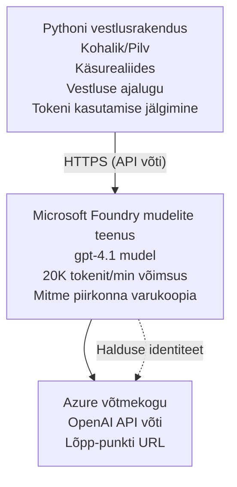

# Microsoft Foundry mudelite vestlusrakendus

**Õppeteekond:** Kesktase ⭐⭐ | **Aeg:** 35-45 minutit | **Kulu:** $50-200/kuus

Täielik Microsoft Foundry mudelite vestlusrakendus, mis on juurutatud kasutades Azure Developer CLI-t (azd). See näidis demonstreerib gpt-4.1 juurutamist, turvalist API ligipääsu ning lihtsat vestlusliidest.

## 🎯 Mida Sa Õpid

- Juurutada Microsoft Foundry mudelite teenus koos gpt-4.1 mudeliga  
- Turvata OpenAI API võtmed Key Vault abil  
- Ehita lihtne vestlusliides Pythoni abil  
- Jälgi tokenite kasutust ja kulusid  
- Rakenda piiranguid ja veakäsitlust  

## 📦 Mida Sisaldab

✅ **Microsoft Foundry mudelite teenus** - gpt-4.1 mudeli juurutus  
✅ **Python vestlusrakendus** - Lihtne käsurida vestlusliides  
✅ **Key Vault integratsioon** - Turvaline API võtmete hoiustamine  
✅ **ARM mallid** - Täielik infrastruktuur koodina  
✅ **Kulu jälgimine** - Tokeni kasutuse jälgimine  
✅ **Piirangud** - Kaitse kvotaaži ületamise eest  

## Arhitektuur



## Eeltingimused

### Nõutud

- **Azure Developer CLI (azd)** - [Paigaldusjuhend](https://learn.microsoft.com/azure/developer/azure-developer-cli/install-azd)  
- **Azure tellimus** koos OpenAI ligipääsuga - [Taotlemise leht](https://aka.ms/oai/access)  
- **Python 3.9+** - [Paigalda Python](https://www.python.org/downloads/)  

### Kontrolli Eeltingimusi

```bash
# Kontrolli azd versiooni (vajalik 1.5.0 või uuem)
azd version

# Kontrolli Azure sisselogimist
azd auth login

# Kontrolli Pythoni versiooni
python --version  # või python3 --version

# Kontrolli OpenAI ligipääsu (kontrolli Azure Portaalis)
az cognitiveservices account list-skus \
  --kind OpenAI \
  --location eastus
```

> **⚠️ Tähtis:** Microsoft Foundry mudelid vajavad rakenduse kinnitust. Kui sa pole taotlenud, külasta lehte [aka.ms/oai/access](https://aka.ms/oai/access). Kinnitamine võtab tavaliselt 1-2 tööpäeva.

## ⏱️ Juurutuse ajakava

| Etapp | Kestus | Mis Juhtub |
|-------|--------|------------|
| Eeltingimuste kontroll | 2-3 minutit | Kontrollib OpenAI kvotaaži kättesaadavust |
| Infrastruktuuri juurutus | 8-12 minutit | Loob OpenAI, Key Vault, mudeli juurutus |
| Rakenduse seadistamine | 2-3 minutit | Seadistab keskkonna ja sõltuvused |
| **Kokku** | **12-18 minutit** | Valmis vestlema gpt-4.1-ga |

**Märkus:** Esmane OpenAI juurutus võib võtta kauem mudeli ettevalmistamise tõttu.

## Kiire algus

```bash
# Navigeeri näitele
cd examples/azure-openai-chat

# Algata keskkond
azd env new myopenai

# Paigalda kõik (infrastruktuur + konfiguratsioon)
azd up
# Sinult küsitakse:
# 1. Vali Azure tellimus
# 2. Vali asukoht, kus on OpenAI saadavus (nt eastus, eastus2, westus)
# 3. Oota 12-18 minutit paigalduse lõpuleviimiseks

# Paigalda Python'i sõltuvused
pip install -r requirements.txt

# Alusta vestlust!
python chat.py
```

**Oodatav väljund:**
```
🤖 Microsoft Foundry Models Chat Application
Connected to: gpt-4.1 (eastus)
Type your message (or 'quit' to exit)

You: Hello! Tell me about Microsoft Foundry Models.
Assistant: Microsoft Foundry Models Service provides REST API access to OpenAI's powerful language models including gpt-4.1, GPT-3.5-Turbo, and Embeddings...

[Tokens used: 145 | Estimated cost: $0.0044]
```

## ✅ Kontrolli Juurutust

### Samm 1: Kontrolli Azure ressursse

```bash
# Kuvada juurutatud ressursid
azd show

# Oodatud väljund näitab:
# - OpenAI teenus: (ressursi nimi)
# - Võtmehoidla: (ressursi nimi)
# - Juurutamine: gpt-4.1
# - Asukoht: eastus (või teie valitud piirkond)
```

### Samm 2: Testi OpenAI API-t

```bash
# Hangi OpenAI lõpp-punkt ja võti
OPENAI_ENDPOINT=$(azd env get-value AZURE_OPENAI_ENDPOINT)
OPENAI_KEY=$(azd env get-value AZURE_OPENAI_API_KEY)

# Testi API kõne
curl "$OPENAI_ENDPOINT/openai/deployments/gpt-4.1/chat/completions?api-version=2024-08-01-preview" \
  -H "Content-Type: application/json" \
  -H "api-key: $OPENAI_KEY" \
  -d '{
    "messages": [{"role": "user", "content": "Say hello!"}],
    "max_tokens": 50
  }'
```

**Oodatud vastus:**
```json
{
  "choices": [
    {
      "message": {
        "role": "assistant",
        "content": "Hello! How can I assist you today?"
      }
    }
  ],
  "usage": {
    "prompt_tokens": 8,
    "completion_tokens": 9,
    "total_tokens": 17
  }
}
```

### Samm 3: Kontrolli Key Vault ligipääsu

```bash
# Loetle saladused Key Vaultis
KV_NAME=$(azd env get-value AZURE_KEY_VAULT_NAME)

az keyvault secret list \
  --vault-name $KV_NAME \
  --query "[].name" \
  --output table
```

**Oodatavad saladused:**
- `openai-api-key`  
- `openai-endpoint`  

**Edu kriteeriumid:**
- ✅ OpenAI teenus juurutatud gpt-4.1 mudeliga  
- ✅ API kõne tagastab kehtiva vastuse  
- ✅ Saladused salvestatud Key Vault'i  
- ✅ Tokenite kasutuse jälgimine toimib  

## Projekti struktuur

```
azure-openai-chat/
├── README.md                   ✅ This guide
├── azure.yaml                  ✅ AZD configuration
├── infra/                      ✅ Infrastructure as Code
│   ├── main.bicep             ✅ Main Bicep template
│   ├── main.parameters.json   ✅ Parameters
│   └── openai.bicep           ✅ OpenAI resource definition
├── src/                        ✅ Application code
│   ├── chat.py                ✅ Chat interface
│   ├── config.py              ✅ Configuration loader
│   └── requirements.txt       ✅ Python dependencies
└── .gitignore                  ✅ Git ignore rules
```

## Rakenduse omadused

### Vestlusliides (`chat.py`)

Vestlusrakendus sisaldab:

- **Vestluse ajalugu** - Säilitab konteksti sõnumite vahel  
- **Tokenite lugemine** - Jälgib kasutust ja hindab kulusid  
- **Veakäsitlus** - Ilmne piirangute ja API vigade korral  
- **Kulu hinnang** - Reaalajas sõnumi kulude arvutus  
- **Voogedastuse tugi** - Valikuline voogedastusvastuste võimalus  

### Käsud

Vesteldes saad kasutada:  
- `quit` või `exit` - Sessiooni lõpetamiseks  
- `clear` - Vestluse ajaloo tühjendamiseks  
- `tokens` - Näita tokenite kogukasutust  
- `cost` - Näita eeldatavat kogu kulu  

### Konfiguratsioon (`config.py`)

Laeb konfiguratsiooni keskkonnamuutujatest:  
```python
AZURE_OPENAI_ENDPOINT  # Võtmehoidlast
AZURE_OPENAI_API_KEY   # Võtmehoidlast
AZURE_OPENAI_MODEL     # Vaikimisi: gpt-4.1
AZURE_OPENAI_MAX_TOKENS # Vaikimisi: 800
```

## Kasutuse näited

### Lihtne vestlus

```bash
python chat.py
```

### Vestlus kohandatud mudeliga

```bash
export AZURE_OPENAI_MODEL=gpt-35-turbo
python chat.py
```

### Vestlus voogedastusega

```bash
python chat.py --stream
```

### Näidiskõne

```
You: Explain Microsoft Foundry Models Service in 3 sentences.
Assistant: Microsoft Foundry Models Service is Microsoft Azure's cloud platform offering 
that provides access to OpenAI's powerful language models. It enables developers 
to integrate capabilities like gpt-4.1 into their applications with enterprise-grade 
security and compliance. The service includes features for content filtering, 
abuse monitoring, and responsible AI practices.

[Tokens used: 89 | Estimated cost: $0.0027]

You: What models are available?
Assistant: Microsoft Foundry Models Service offers several model families including gpt-4.1 
(most capable), GPT-3.5-Turbo (faster and cost-effective), and Embeddings models 
for vector search. Each model has different capabilities, pricing, and token limits.

[Tokens used: 67 | Estimated cost: $0.0020]

Total session: 156 tokens | $0.0047
```

## Kulude haldamine

### Tokeni hinnakiri (gpt-4.1)

| Mudel | Sisend (1000 tokeni kohta) | Väljund (1000 tokeni kohta) |
|-------|----------------------------|-----------------------------|
| gpt-4.1 | $0.03 | $0.06 |
| GPT-3.5-Turbo | $0.0015 | $0.002 |

### Hinnangulised kuukulud

Tuginedes kasutusmustritele:

| Kasutusmaht | Sõnumeid päevas | Tokeneid päevas | Kuukulu |
|-------------|-----------------|-----------------|---------|
| **Keriline** | 20 sõnumit | 3,000 tokenit | $3-5 |
| **Mõõdukas** | 100 sõnumit | 15,000 tokenit | $15-25 |
| **Tugev** | 500 sõnumit | 75,000 tokenit | $75-125 |

**Baasinfrastruktuuri kulu:** $1-2/kuus (Key Vault + minimaalne arvutus)

### Kulude optimeerimise näpunäited

```bash
# 1. Kasuta lihtsamate ülesannete jaoks GPT-3.5-Turbo (20 korda odavam)
export AZURE_OPENAI_MODEL=gpt-35-turbo

# 2. Vähenda maksimaalset tokenite arvu lühemate vastuste jaoks
export AZURE_OPENAI_MAX_TOKENS=400

# 3. Jälgi tokenite kasutust
python chat.py --show-tokens

# 4. Sea eelarvehoiatused sisse
az consumption budget create \
  --budget-name "openai-budget" \
  --amount 50 \
  --time-grain Monthly
```

## Jälgimine

### Vaata tokeni kasutust

```bash
# Azure Portaali:
# OpenAI ressursid → Mõõdikud → Vali "Tokeni tehing"

# Või Azure CLI kaudu:
az monitor metrics list \
  --resource $(azd env get-value AZURE_OPENAI_RESOURCE_ID) \
  --metric "TokenTransaction" \
  --start-time $(date -u -d '1 hour ago' '+%Y-%m-%dT%H:%M:%S') \
  --interval PT1M
```

### Vaata API logisid

```bash
# Voogesita diagnostikapäevaraamatuid
az monitor diagnostic-settings create \
  --resource $(azd env get-value AZURE_OPENAI_RESOURCE_ID) \
  --name openai-logs \
  --logs '[{"category": "Audit", "enabled": true}]' \
  --workspace $(azd env get-value LOG_ANALYTICS_WORKSPACE_ID)

# Päringu päevikud
az monitor log-analytics query \
  --workspace $(azd env get-value LOG_ANALYTICS_WORKSPACE_ID) \
  --analytics-query "AzureDiagnostics | where Category == 'Audit' | top 10 by TimeGenerated"
```

## Veaotsing

### Probleem: "Ligipääs keelatud" viga

**Sümptomid:** 403 Keelatud API-kõne puhul

**Lahendused:**
```bash
# 1. Kontrolli, kas OpenAI ligipääs on heaks kiidetud
az cognitiveservices account show \
  --name $(azd env get-value AZURE_OPENAI_NAME) \
  --resource-group $(azd env get-value AZURE_RESOURCE_GROUP)

# 2. Kontrolli, kas API võti on õige
azd env get-value AZURE_OPENAI_API_KEY

# 3. Kontrolli lõpp-punkti URL-i formaati
azd env get-value AZURE_OPENAI_ENDPOINT
# Peaks olema: https://[nimi].openai.azure.com/
```

### Probleem: "Piirangu ületamine"

**Sümptomid:** 429 Liiga palju päringuid

**Lahendused:**
```bash
# 1. Kontrolli praegust limiiti
az cognitiveservices account deployment show \
  --name $(azd env get-value AZURE_OPENAI_NAME) \
  --resource-group $(azd env get-value AZURE_RESOURCE_GROUP) \
  --deployment-name gpt-4.1

# 2. Taotle limiidi suurendamist (vajadusel)
# Mine Azure Portaal → OpenAI Ressurss → Limiidid → Taotle suurendamist

# 3. Rakenda korduskatsete loogika (juba failis chat.py)
# Rakendus proovib automaatselt uuesti ekponentsiaalse viivitusega
```

### Probleem: "Mudel puudub"

**Sümptomid:** 404 viga juurutuse puhul

**Lahendused:**
```bash
# 1. Loetle saadaolevad juurutused
az cognitiveservices account deployment list \
  --name $(azd env get-value AZURE_OPENAI_NAME) \
  --resource-group $(azd env get-value AZURE_RESOURCE_GROUP)

# 2. Kinnita mudeli nimi keskkonnas
echo $AZURE_OPENAI_MODEL

# 3. Uuenda õige juurutuse nimeks
export AZURE_OPENAI_MODEL=gpt-4.1  # või gpt-35-turbo
```

### Probleem: Kõrge latentsus

**Sümptomid:** Aeglane vastus (>5 sekundit)

**Lahendused:**
```bash
# 1. Kontrolli piirkondlikku latentsust
# Paiguta piirkonda, mis on kasutajatele lähim

# 2. Vähenda max_tokens kiiremate vastuste saamiseks
export AZURE_OPENAI_MAX_TOKENS=400

# 3. Kasuta voogedastust parema kasutajakogemuse saavutamiseks
python chat.py --stream
```

## Turvalisuse parimad tavad

### 1. Kaitse API võtmeid

```bash
# Ärge kunagi hoidke võtmeid lähtekoodi halduses
# Kasutage Key Vaulti (juba konfigureeritud)

# Keerake võtmeid regulaarselt
az cognitiveservices account keys regenerate \
  --name $(azd env get-value AZURE_OPENAI_NAME) \
  --resource-group $(azd env get-value AZURE_RESOURCE_GROUP) \
  --key-name key1
```

### 2. Rakenda sisu filtreerimine

```python
# Microsoft Foundry Models sisaldab sisseehitatud sisufiltreerimist
# Konfigureeri Azure Portaalis:
# OpenAI ressurss → Sisufiltrid → Loo kohandatud filter

# Kategooriad: Viha, Seksuaalne, Vägivald, Enesevigastus
# Tasemed: Madal, Keskmine, Kõrge filtreerimine
```

### 3. Kasuta haldatud identiteeti (tootmiskeskkond)

```bash
# Tootmise valmiste paigalduste jaoks kasuta hallatud identiteeti
# API-võtmete asemel (nõuab rakenduse majutamist Azure'is)

# Uuenda infra/openai.bicep, et lisada:
# identity: { type: 'SystemAssigned' }
```

## Arendus

### Käivita lokaalselt

```bash
# Paigalda sõltuvused
pip install -r src/requirements.txt

# Määra keskkonnamuutujad
export AZURE_OPENAI_ENDPOINT="https://[name].openai.azure.com/"
export AZURE_OPENAI_API_KEY="your-api-key"
export AZURE_OPENAI_MODEL="gpt-4.1"

# Käivita rakendus
python src/chat.py
```

### Käivita testid

```bash
# Paigalda testimissõltuvused
pip install pytest pytest-cov

# Käivita testid
pytest tests/ -v

# Kaasatusega
pytest tests/ --cov=src --cov-report=html
```

### Uuenda mudeli juurutust

```bash
# Käivita erinev mudeliversioon
az cognitiveservices account deployment create \
  --name $(azd env get-value AZURE_OPENAI_NAME) \
  --resource-group $(azd env get-value AZURE_RESOURCE_GROUP) \
  --deployment-name gpt-35-turbo \
  --model-name gpt-35-turbo \
  --model-version "0613" \
  --model-format OpenAI \
  --sku-capacity 20 \
  --sku-name "Standard"
```

## Puhasta

```bash
# Kustuta kõik Azure ressursid
azd down --force --purge

# See eemaldab:
# - OpenAI teenuse
# - Võtmekogu (90-päevase pehme kustutusega)
# - Ressursigrupi
# - Kõik paigaldused ja konfiguratsioonid
```

## Järgmised sammud

### Laienda seda näidet

1. **Lisa veebiliides** - Ehita React/Vue esipaneel  
   ```bash
   # Lisa frontend teenus faili azure.yaml
   # Paiguta Azure Static Web Apps teenusesse
   ```

2. **Rakenda RAG** - Lisa dokumentide otsing Azure AI Search abil  
   ```python
   # Integreeri Azure AI otsing
   # Laadi üles dokumendid ja loo vektoriindeks
   ```

3. **Lisa funktsioonikõned** - Võimalda tööriistade kasutus  
   ```python
   # Määratle funktsioonid failis chat.py
   # Luba gpt-4.1-l kutsuda välishalduseid
   ```

4. **Mitme mudeli tugi** - Juuruta mitu mudelit  
   ```bash
   # Lisa gpt-35-turbo, sisendmudelid
   # Rakenda mudeli marsruutimise loogikat
   ```

### Seotud näited

- **[Jaemüük mitme agendiga](../retail-scenario.md)** - Täiustatud mitmeagendi arhitektuur  
- **[Andmebaasirakendus](../../../../examples/database-app)** - Lisa püsiv salvestus  
- **[Konteinerirakendused](../../../../examples/container-app)** - Juuruta konteineriteenuseks  

### Õppematerjalid

- 📚 [AZD algajatele kursus](../../README.md) - Peamine kursuse kodu  
- 📚 [Microsoft Foundry mudelite dokumentatsioon](https://learn.microsoft.com/azure/ai-services/openai/) - Ametlikud juhendid  
- 📚 [OpenAI API viide](https://platform.openai.com/docs/api-reference) - API üksikasjad  
- 📚 [Vastutustundlik AI](https://www.microsoft.com/ai/responsible-ai) - Parimad praktikad  

## Täiendavad ressursid

### Dokumentatsioon
- **[Microsoft Foundry mudelite teenus](https://learn.microsoft.com/azure/ai-services/openai/)** - Täielik juhend  
- **[gpt-4.1 mudelid](https://learn.microsoft.com/azure/ai-services/openai/concepts/models)** - Mudeli võimekused  
- **[Sisu filtreerimine](https://learn.microsoft.com/azure/ai-services/openai/concepts/content-filter)** - Turvafunktsioonid  
- **[Azure Developer CLI](https://learn.microsoft.com/azure/developer/azure-developer-cli/)** - azd viide  

### Õpetused
- **[OpenAI kiire algus](https://learn.microsoft.com/azure/ai-services/openai/quickstart)** - Esimene juurutus  
- **[Vestlus lõpetused](https://learn.microsoft.com/azure/ai-services/openai/how-to/chatgpt)** - Vestlusrakenduste ehitamine  
- **[Funktsioonikõned](https://learn.microsoft.com/azure/ai-services/openai/how-to/function-calling)** - Täiustatud funktsioonid  

### Tööriistad
- **[Microsoft Foundry mudelite stuudio](https://oai.azure.com/)** - Veebipõhine proovimisvõimalus  
- **[Promptide inseneri juhend](https://platform.openai.com/docs/guides/prompt-engineering)** - Paremate küsimuste koostamine  
- **[Tokeni kalkulaator](https://platform.openai.com/tokenizer)** - Hinda tokeni kasutust  

### Kogukond
- **[Azure AI Discord](https://discord.gg/azure)** - Kogukonna abi  
- **[GitHub arutelud](https://github.com/Azure-Samples/openai/discussions)** - KKK ja foorum  
- **[Azure blogi](https://azure.microsoft.com/blog/tag/azure-openai-service/)** - Viimased uuendused  

---

**🎉 Edu!** Sa oled juurutanud Microsoft Foundry mudelid ja loonud töökorras vestlusrakenduse. Alusta gpt-4.1 võimekuse avastamist ning katsetamist erinevate küsimuste ja kasutusjuhtudega.

**Küsimused?** [Ava probleem](https://github.com/microsoft/AZD-for-beginners/issues) või vaata [KKK](../../resources/faq.md)

**Kuluhoiatus:** Ära unusta pärast testimist käivitada `azd down`, et vältida pidevaid kulusid (~$50-100/kuus aktiivse kasutuse korral).

---

<!-- CO-OP TRANSLATOR DISCLAIMER START -->
**Lahtiütlus**:
See dokument on tõlgitud kasutades AI tõlketeenust [Co-op Translator](https://github.com/Azure/co-op-translator). Kuigi me püüdleme täpsuse poole, palun pange tähele, et automatiseeritud tõlgetes võib esineda vigu või ebatäpsusi. Originaaldokument selle emakeeles tuleks pidada autoriteetseks allikaks. Olulise teabe puhul soovitatakse kasutada professionaalset inimtõlget. Me ei vastuta selle tõlkega seotud eksimustest või valesti mõistmistest.
<!-- CO-OP TRANSLATOR DISCLAIMER END -->