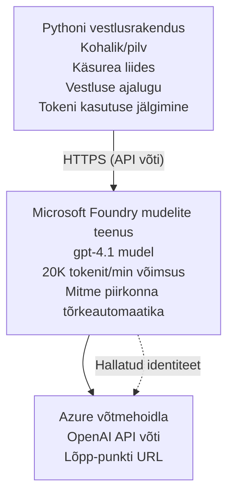

# Microsoft Foundry mudelite vestlusrakendus

**Õpitee:** Kesktase ⭐⭐ | **Aeg:** 35-45 minutit | **Kulu:** 50–200 USD/kuus

Täielik Microsoft Foundry mudelite vestlusrakendus, mis on juurutatud Azure Developer CLI (azd) abil. See näide demonstreerib gpt-4.1 juurutamist, turvalist API juurdepääsu ja lihtsat vestlusliidest.

## 🎯 Mida sa õpid

- Juurutada Microsoft Foundry mudelite teenust gpt-4.1 mudeliga
- Kaitsta OpenAI API võtmeid Key Vaulti abil
- Ehita lihtne vestlusliides Pythoniga
- Jälgida märgisõnumite kasutust ja kulusid
- Rakendada kiirusepiirangut ja veakäsitlust

## 📦 Mida sisaldab

✅ **Microsoft Foundry mudelite teenus** - gpt-4.1 mudeli juurutus  
✅ **Python vestlusrakendus** - Lihtne käsurea vestlusliides  
✅ **Key Vault Integratsioon** - Turvaline API võtmete salvestus  
✅ **ARM mallid** - Täielik infrastruktuur koodina  
✅ **Kulude jälgimine** - Märgisõnumite kasutamise jälgimine  
✅ **Kiirusepiirang** - Vältida limiidi ammendumist  

## Arhitektuur


## Eeltingimused

### Nõutavad

- **Azure Developer CLI (azd)** - [Paigaldusjuhend](https://learn.microsoft.com/azure/developer/azure-developer-cli/install-azd)  
- **Azure tellimus** koos OpenAI ligipääsuga - [Taotluse esitamine](https://aka.ms/oai/access)  
- **Python 3.9+** - [Paigalda Python](https://www.python.org/downloads/)  

### Eeltingimuste kontroll

```bash
# Kontrolli azd versiooni (vajalik 1.5.0 või uuem)
azd version

# Kontrolli Azure sisselogimist
azd auth login

# Kontrolli Pythoni versiooni
python --version  # või python3 --version

# Kontrolli OpenAI ligipääsu (vaata Azure portaali)
az cognitiveservices account list-skus \
  --kind OpenAI \
  --location eastus
```

> **⚠️ Tähtis:** Microsoft Foundry mudelid nõuavad rakenduse heakskiitu. Kui te pole veel taotlenud, külastage [aka.ms/oai/access](https://aka.ms/oai/access). Heakskiit võtab tavaliselt 1-2 tööpäeva.

## ⏱️ Juurutuse ajakava

| Etapp | Kestus | Mis toimub |
|-------|--------|------------|
| Eeltingimuste kontroll | 2-3 minutit | Kontrolli OpenAI limiidi olemasolu |
| Infrastruktuuri juurutus | 8-12 minutit | Loo OpenAI, Key Vault, mudeli juurutus |
| Rakenduse seadistamine | 2-3 minutit | Keskkonna ja sõltuvuste seadistamine |
| **Kokku** | **12-18 minutit** | Valmis vestlemiseks gpt-4.1-ga |

**Märkus:** Esmakordne OpenAI juurutus võib mudeli ettevalmistamise tõttu kauem aega võtta.

## Kiire algus

```bash
# Navigeeri näidiseni
cd examples/azure-openai-chat

# Algata keskkond
azd env new myopenai

# Hangi kõik paika (töökeskkond + konfiguratsioon)
azd up
# Sinult küsitakse:
# 1. Vali Azure’i tellimus
# 2. Vali asukoht, kus on OpenAI saadaval (nt eastus, eastus2, westus)
# 3. Oota 12-18 minutit paigalduseks

# Paigalda Python'i sõltuvused
pip install -r requirements.txt

# Alusta vestlust!
python chat.py
```

**Oodatav väljund:**
```
🤖 Microsoft Foundry Models Chat Application
Connected to: gpt-4.1 (eastus)
Type your message (or 'quit' to exit)

You: Hello! Tell me about Microsoft Foundry Models.
Assistant: Microsoft Foundry Models Service provides REST API access to OpenAI's powerful language models including gpt-4.1, GPT-3.5-Turbo, and Embeddings...

[Tokens used: 145 | Estimated cost: $0.0044]
```

## ✅ Kontrolli juurutust

### 1. samm: Kontrolli Azure ressursse

```bash
# Vaata juurutatud ressursse
azd show

# Oodatud väljund näitab:
# - OpenAI teenus: (ressursi nimi)
# - Võtmekomplekt: (ressursi nimi)
# - Juurutus: gpt-4.1
# - Asukoht: eastus (või teie valitud piirkond)
```

### 2. samm: Testi OpenAI API-t

```bash
# Hangi OpenAI lõpp-punkt ja võti
OPENAI_ENDPOINT=$(azd env get-value AZURE_OPENAI_ENDPOINT)
OPENAI_KEY=$(azd env get-value AZURE_OPENAI_API_KEY)

# Testi API kõnet
curl "$OPENAI_ENDPOINT/openai/deployments/gpt-4.1/chat/completions?api-version=2024-08-01-preview" \
  -H "Content-Type: application/json" \
  -H "api-key: $OPENAI_KEY" \
  -d '{
    "messages": [{"role": "user", "content": "Say hello!"}],
    "max_tokens": 50
  }'
```

**Oodatav vastus:**
```json
{
  "choices": [
    {
      "message": {
        "role": "assistant",
        "content": "Hello! How can I assist you today?"
      }
    }
  ],
  "usage": {
    "prompt_tokens": 8,
    "completion_tokens": 9,
    "total_tokens": 17
  }
}
```

### 3. samm: Kontrolli Key Vault'i juurdepääsu

```bash
# Loetle saladused võtmemahas
KV_NAME=$(azd env get-value AZURE_KEY_VAULT_NAME)

az keyvault secret list \
  --vault-name $KV_NAME \
  --query "[].name" \
  --output table
```

**Oodatavad saladused:**
- `openai-api-key`
- `openai-endpoint`

**Edu kriteeriumid:**
- ✅ OpenAI teenus juurutatud gpt-4.1 mudeliga
- ✅ API kutse tagastab kehtiva tulemuse
- ✅ Saladused salvestatud Key Vault'i
- ✅ Märgisõnumite kasutamise jälgimine toimib

## Projekti struktuur

```
azure-openai-chat/
├── README.md                   ✅ This guide
├── azure.yaml                  ✅ AZD configuration
├── infra/                      ✅ Infrastructure as Code
│   ├── main.bicep             ✅ Main Bicep template
│   ├── main.parameters.json   ✅ Parameters
│   └── openai.bicep           ✅ OpenAI resource definition
├── src/                        ✅ Application code
│   ├── chat.py                ✅ Chat interface
│   ├── config.py              ✅ Configuration loader
│   └── requirements.txt       ✅ Python dependencies
└── .gitignore                  ✅ Git ignore rules
```

## Rakenduse omadused

### Vestlusliides (`chat.py`)

Vestlusrakendus sisaldab:

- **Vestluse ajalugu** - Hoiab teavet sõnumite vahel
- **Märgiste lugemine** - Jälgib kasutust ja hindab kulusid
- **Vigade käsitlus** - Sujuv käitlemine kiirusepiirangute ja API vigade korral
- **Kulude hindamine** - Sõnumi reaalajas kulu arvutus
- **Voogesituse tugi** - Valikuline voogedastus vastustes

### Käsud

Vesteldes võid kasutada:
- `quit` või `exit` - Sessiooni lõpetamine
- `clear` - Vestluse ajaloo kustutamine
- `tokens` - Kokku kasutatud märgisõnumite arv
- `cost` - Hinnanguline kogukulu

### Seadistamine (`config.py`)

Laeb konfiguratsiooni keskkonnamuutujatest:
```python
AZURE_OPENAI_ENDPOINT  # Võtmehoidlast
AZURE_OPENAI_API_KEY   # Võtmehoidlast
AZURE_OPENAI_MODEL     # Vaikimisi: gpt-4.1
AZURE_OPENAI_MAX_TOKENS # Vaikimisi: 800
```

## Kasutusnäited

### Lihtne vestlus

```bash
python chat.py
```

### Vestlus kohandatud mudeliga

```bash
export AZURE_OPENAI_MODEL=gpt-35-turbo
python chat.py
```

### Vestlus voogesitusega

```bash
python chat.py --stream
```

### Näidiskõne

```
You: Explain Microsoft Foundry Models Service in 3 sentences.
Assistant: Microsoft Foundry Models Service is Microsoft Azure's cloud platform offering 
that provides access to OpenAI's powerful language models. It enables developers 
to integrate capabilities like gpt-4.1 into their applications with enterprise-grade 
security and compliance. The service includes features for content filtering, 
abuse monitoring, and responsible AI practices.

[Tokens used: 89 | Estimated cost: $0.0027]

You: What models are available?
Assistant: Microsoft Foundry Models Service offers several model families including gpt-4.1 
(most capable), GPT-3.5-Turbo (faster and cost-effective), and Embeddings models 
for vector search. Each model has different capabilities, pricing, and token limits.

[Tokens used: 67 | Estimated cost: $0.0020]

Total session: 156 tokens | $0.0047
```

## Kulude haldamine

### Märgistiku hinnakiri (gpt-4.1)

| Mudel | Sisend (1K märgistiku kohta) | Väljund (1K märgistiku kohta) |
|-------|------------------------------|-------------------------------|
| gpt-4.1 | 0,03 USD | 0,06 USD |
| GPT-3.5-Turbo | 0,0015 USD | 0,002 USD |

### Hinnanguline kuukulu

Põhineb kasutusmustritel:

| Kasutustase | Sõnumeid/päev | Märgiste arv/päev | Kuukulu |
|-------------|---------------|-------------------|---------|
| **Kerge** | 20 sõnumit | 3 000 märgist | 3–5 USD |
| **Mõõdukas** | 100 sõnumit | 15 000 märgist | 15–25 USD |
| **Tugev** | 500 sõnumit | 75 000 märgist | 75–125 USD |

**Põhitaristu kulu:** 1–2 USD/kuus (Key Vault + minimaalne arvutus)

### Kulude optimeerimise näpunäited

```bash
# 1. Kasutage lihtsamate ülesannete jaoks GPT-3.5-Turbo (20 korda odavam)
export AZURE_OPENAI_MODEL=gpt-35-turbo

# 2. Vähendage maksimaalseid tokeneid lühemate vastuste jaoks
export AZURE_OPENAI_MAX_TOKENS=400

# 3. Jälgige tokenite kasutust
python chat.py --show-tokens

# 4. Seadistage eelarvehoiatused
az consumption budget create \
  --budget-name "openai-budget" \
  --amount 50 \
  --time-grain Monthly
```

## Jälgimine

### Vaata märgiste kasutust

```bash
# Azure portaalis:
# OpenAI ressurss → Mõõdikud → Valige "Token Transaction"

# Või Azure CLI kaudu:
az monitor metrics list \
  --resource $(azd env get-value AZURE_OPENAI_RESOURCE_ID) \
  --metric "TokenTransaction" \
  --start-time $(date -u -d '1 hour ago' '+%Y-%m-%dT%H:%M:%S') \
  --interval PT1M
```

### Vaata API logisid

```bash
# Voogedasta diagnostika logisid
az monitor diagnostic-settings create \
  --resource $(azd env get-value AZURE_OPENAI_RESOURCE_ID) \
  --name openai-logs \
  --logs '[{"category": "Audit", "enabled": true}]' \
  --workspace $(azd env get-value LOG_ANALYTICS_WORKSPACE_ID)

# Päringu logid
az monitor log-analytics query \
  --workspace $(azd env get-value LOG_ANALYTICS_WORKSPACE_ID) \
  --analytics-query "AzureDiagnostics | where Category == 'Audit' | top 10 by TimeGenerated"
```

## Tõrkeotsing

### Probleem: "Juurdepääs keelatud" viga

**Sümptomid:** 403 Forbidden API kutse korral

**Lahendused:**
```bash
# 1. Kontrolli, kas OpenAI ligipääs on heaks kiidetud
az cognitiveservices account show \
  --name $(azd env get-value AZURE_OPENAI_NAME) \
  --resource-group $(azd env get-value AZURE_RESOURCE_GROUP)

# 2. Kontrolli, kas API võti on õige
azd env get-value AZURE_OPENAI_API_KEY

# 3. Kontrolli lõpp-punkti URL-i vormingut
azd env get-value AZURE_OPENAI_ENDPOINT
# Peaks olema: https://[nimi].openai.azure.com/
```

### Probleem: "Kiirusepiirang ületatud"

**Sümptomid:** 429 Too Many Requests

**Lahendused:**
```bash
# 1. Kontrolli praegust kvotat
az cognitiveservices account deployment show \
  --name $(azd env get-value AZURE_OPENAI_NAME) \
  --resource-group $(azd env get-value AZURE_RESOURCE_GROUP) \
  --deployment-name gpt-4.1

# 2. Taotle kvota suurendamist (kui vaja)
# Mine Azure Portaal → OpenAI Ressurss → Kvotad → Taotle Suurendust

# 3. Rakenda proovimise loogika (juba chat.py-s)
# Rakendus proovib automaatselt uuesti eksponentsiaalse viivitusega
```

### Probleem: "Mudelit ei leitud"

**Sümptomid:** 404 viga juurutuse korral

**Lahendused:**
```bash
# 1. Kuva saadaolevad juurutused
az cognitiveservices account deployment list \
  --name $(azd env get-value AZURE_OPENAI_NAME) \
  --resource-group $(azd env get-value AZURE_RESOURCE_GROUP)

# 2. Kontrolli mudeli nime keskkonnas
echo $AZURE_OPENAI_MODEL

# 3. Uuenda õigeks juurutuse nimeks
export AZURE_OPENAI_MODEL=gpt-4.1  # või gpt-35-turbo
```

### Probleem: Kõrge latentsus

**Sümptomid:** Aeglased vastused (>5 sekundit)

**Lahendused:**
```bash
# 1. Kontrolli piirkondlikku latentsust
# Võta kasutusele kasutajatele kõige lähemal asuv piirkond

# 2. Vähenda max_tokens kiiremate vastuste jaoks
export AZURE_OPENAI_MAX_TOKENS=400

# 3. Kasuta voogedastust paremaks kasutajakogemuseks
python chat.py --stream
```

## Turvalisuse parimad tavad

### 1. Kaitse API võtmeid

```bash
# Ärge kunagi pange võtmeid versioonihaldusse
# Kasutage Key Vaulti (juba seadistatud)

# Vahetage võtmeid regulaarselt
az cognitiveservices account keys regenerate \
  --name $(azd env get-value AZURE_OPENAI_NAME) \
  --resource-group $(azd env get-value AZURE_RESOURCE_GROUP) \
  --key-name key1
```

### 2. Sisu filtreerimise rakendamine

```python
# Microsoft Foundry mudelid sisaldavad sisseehitatud sisufiltreerimist
# Konfigureeri Azure portaalis:
# OpenAI ressurss → Sisufiltrid → Loo kohandatud filter

# Kategooriad: Vihkamine, Seksuaalne, Vägivald, Isevigastamine
# Tasemed: Madal, Keskmine, Kõrge filtreerimine
```

### 3. Kasuta hallatud identiteeti (tööstuskeskkonnas)

```bash
# Tootmiskasutuse jaoks kasuta hallatud identiteeti
# API-võtmete asemel (nõuab rakenduse majutamist Azure'is)

# Uuenda infra/openai.bicep sisaldama:
# identity: { type: 'SystemAssigned' }
```

## Arendus

### Käivita lokaalselt

```bash
# Paigalda sõltuvused
pip install -r src/requirements.txt

# Määra keskkonnamuutujad
export AZURE_OPENAI_ENDPOINT="https://[name].openai.azure.com/"
export AZURE_OPENAI_API_KEY="your-api-key"
export AZURE_OPENAI_MODEL="gpt-4.1"

# Käivita rakendus
python src/chat.py
```

### Käivita testid

```bash
# Paigalda testimissõltuvused
pip install pytest pytest-cov

# Käivita testid
pytest tests/ -v

# Katvusega
pytest tests/ --cov=src --cov-report=html
```

### Uuenda mudeli juurutust

```bash
# Paigalda erinev mudeliversioon
az cognitiveservices account deployment create \
  --name $(azd env get-value AZURE_OPENAI_NAME) \
  --resource-group $(azd env get-value AZURE_RESOURCE_GROUP) \
  --deployment-name gpt-35-turbo \
  --model-name gpt-35-turbo \
  --model-version "0613" \
  --model-format OpenAI \
  --sku-capacity 20 \
  --sku-name "Standard"
```

## Puhastamine

```bash
# Kustutage kõik Azure ressursid
azd down --force --purge

# See eemaldab:
# - OpenAI teenuse
# - Key Vault (90-päevase pehme kustutamisega)
# - Ressursside rühma
# - Kõik juurutused ja konfiguratsioonid
```

## Järgmised sammud

### Laienda seda näidet

1. **Lisa veebiliides** - Ehita React/Vue kasutajaliides  
   ```bash
   # Lisa frontend teenus azure.yaml faili
   # Kasuta Azure Static Web Apps juurutamiseks
   ```

2. **Rakenda RAG** - Lisa dokumentide otsing Azure AI Search abil  
   ```python
   # Integreeri Azure Cognitive Search
   # Laadi dokumendid üles ja loo vektoriindeks
   ```

3. **Lisa funktsioonide kutsumine** - Võimalda tööriistade kasutus  
   ```python
   # Määratle funktsioonid failis chat.py
   # Lase gpt-4.1-l kutsuda väliseid API-sid
   ```

4. **Mitme mudeli tugi** - Juuruta mitu mudelit  
   ```bash
   # Lisa gpt-35-turbo, manustamismudelid
   # Rakenda mudeli marsruutimise loogika
   ```

### Seotud näited

- **[Retail Multi-Agent](../retail-scenario.md)** - Täiustatud mitmeagendi arhitektuur  
- **[Andmebaasirakendus](../../../../examples/database-app)** - Lisa püsiv salvestus  
- **[Konteinerirakendused](../../../../examples/container-app)** - Juuruta konteineritud teenusena  

### Õppematerjalid

- 📚 [AZD algajatele kursus](../../README.md) - Peamine kursus  
- 📚 [Microsoft Foundry mudelite dokumentatsioon](https://learn.microsoft.com/azure/ai-services/openai/) - Oficiaalne dokumentatsioon  
- 📚 [OpenAI API viited](https://platform.openai.com/docs/api-reference) - API üksikasjad  
- 📚 [Vastutustundlik AI](https://www.microsoft.com/ai/responsible-ai) - Parimad tavad  

## Lisamaterjalid

### Dokumentatsioon  
- **[Microsoft Foundry mudelite teenus](https://learn.microsoft.com/azure/ai-services/openai/)** - Täielik juhend  
- **[gpt-4.1 mudelid](https://learn.microsoft.com/azure/ai-services/openai/concepts/models)** - Mudeli võimalused  
- **[Sisu filtreerimine](https://learn.microsoft.com/azure/ai-services/openai/concepts/content-filter)** - Turvafunktsioonid  
- **[Azure Developer CLI](https://learn.microsoft.com/azure/developer/azure-developer-cli/)** - azd viited  

### Õpetused  
- **[OpenAI kiire algus](https://learn.microsoft.com/azure/ai-services/openai/quickstart)** - Esimene juurutus  
- **[Vestluse lõpetamine](https://learn.microsoft.com/azure/ai-services/openai/how-to/chatgpt)** - Vestlusrakendused  
- **[Funktsioonide kutsumine](https://learn.microsoft.com/azure/ai-services/openai/how-to/function-calling)** - Täiustatud funktsioonid  

### Tööriistad  
- **[Microsoft Foundry mudelite stuudio](https://oai.azure.com/)** - Veebipõhine mänguväljak  
- **[Päringu koostamise juhend](https://platform.openai.com/docs/guides/prompt-engineering)** - Paremad päringud  
- **[Märgistiku kalkulaator](https://platform.openai.com/tokenizer)** - Märgiste kasutuse hindamine  

### Kogukond  
- **[Azure AI Discord](https://discord.gg/azure)** - Kogukonna tugi  
- **[GitHub arutelud](https://github.com/Azure-Samples/openai/discussions)** - Küsitlused ja vastused  
- **[Azure blogi](https://azure.microsoft.com/blog/tag/azure-openai-service/)** - Viimased uudised  

---

**🎉 Edu!** Olete juurutanud Microsoft Foundry mudelid ja loonud toimiva vestlusrakenduse. Alustage gpt-4.1 võimaluste uurimist ning katsetage erinevate päringute ja kasutusstsenaariumitega.

**Küsimused?** [Avage probleem](https://github.com/microsoft/AZD-for-beginners/issues) või vaadake [KKK](../../resources/faq.md)

**Kuluhoiatus:** Pidage meeles käivitada `azd down` pärast testimist, et vältida pidevaid kulusid (~50–100 USD/kuus aktiivse kasutuse korral).

---

<!-- CO-OP TRANSLATOR DISCLAIMER START -->
**Vastutusest loobumine**:
See dokument on tõlgitud kasutades tehisintellektil põhinevat tõlketeenust [Co-op Translator](https://github.com/Azure/co-op-translator). Kuigi püüame täpsust, palun arvestage, et automaatsed tõlked võivad sisaldada vigu või ebatäpsusi. Originaaldokument selle emakeeles tuleks pidada autoriteetseks allikaks. Olulise teabe puhul soovitatakse kasutada professionaalset inimtõlget. Me ei vastuta selle tõlke kasutamisest tekkida võivate arusaamatuste või valesti mõistmiste eest.
<!-- CO-OP TRANSLATOR DISCLAIMER END -->